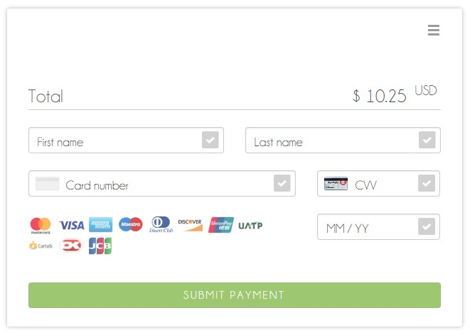
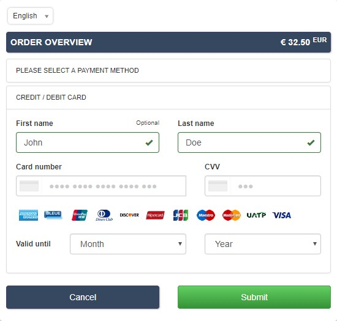

include::shortcuts.adoc[]

[#PaymentPageSolutions]
== Payment Page Solutions
Our payment page solutions maximize the user experience of the checkout
process by giving you control over its design and feel. With three
readily available integration options, you decide where and how you want
your customers to pay, while still enjoying the benefits of a dependable
payment solution. All you need to get started is PCI SAQ A compliance.
Each of our payment page products focus on filling different needs, so
you can choose based on what you want for your business.

ifdef::env-nova[]
ifdef::env-po[]
_{payment-page-v2}_ delivers a highly customizable, secure and
polished checkout experience with multiple integration options. If
visual design is your main priority, _{payment-page-v2}_ gives you all
the tools you need to create a great-looking payment page.
endif::[]
endif::[]

//// 
vhauss: I think we can exclude the following table completely for NOVA, as the relevant text is already provided in the "env-nov" bracket above.
////

ifndef::env-nova[]
[%autowidth]
[frame=none]
[grid=none]
|===
ifdef::env-wirecard[]
^| {payment-page-v2} ^| {payment-page-v1}

| _{payment-page-v2}_ delivers a highly customizable, secure and
polished checkout experience with multiple integration options. If
visual design is your main priority, _{payment-page-v2}_ gives you all
the tools you need to create a great-looking payment page.
endif::[]

ifdef::env-wirecard[]
<<PP, >>
endif::[]

| _{payment-page-v1}_ offers safe and smooth payment processing available with 3
different integration options. If a broad selection of alternative
payment methods is important for your business, _{payment-page-v1}_ is a great fit.

ifdef::env-wirecard[]
<<PP, >>
endif::[]
|===
endif::[]

//// 
[discrete]
=== {payment-page-v2}

{payment-page-v2} delivers a highly customizable, secure and
polished checkout experience with four different integration options. If
visual design is your main priority, {payment-page-v2} gives you all
the tools you need to create a great-looking payment page. +

[discrete]
=== {payment-page-v1}

{payment-page-v1} offers safe and smooth payment processing available with 3
different integration options. If a broad selection of alternative
payment methods is important for your business, _{payment-page-v1}_ is a great
fit. +

////

//// 
vhauss: we should remove the whole comment box above.
vhauss: the following table makes no sense in the NOVA environment, as PPv1 is not part of the deal. We can, at the most, list the features below in a bullet list, such as
////

ifdef::env-nova[]
{payment-page-v2} offers:

* Credit Card support.
* support of various alternative payment methods.
* the integration types Hosted/Embedded/Seamless.
* multi-language support.
* custom CSS.
* ready-to-use integration code in Java/PHP.
* the API formats JSON/NVP.
* customization through GUI designer.
* multiple themes.
* responsive design (mobile & desktop).

//-
endif::[] 

ifndef::env-nova[]
ifdef::env-wirecard[]
.Features
[cols="50h,25,25"]
|===
|                                              ^| {payment-page-v2}   ^| {payment-page-v1}

| Credit Card support                        2+^| ✅
| Payment methods                              ^| ✅ 14                    ^| ✅ 42
| Integration types                          2+^| Hosted/Embedded/Seamless
| Multi-language support                     2+^| ✅
| Custom CSS                                 2+^| ✅
| Ready-to-use integration code in Java/PHP    ^| ✅                       ^| ❌
| API formats                                  ^| JSON/NVP                 ^| NVP only
| Customization through GUI designer           ^| ✅                       ^| ❌
| Multiple themes                              ^| ✅                       ^| ❌
| Responsive design (mobile & desktop)       2+^| ✅
|===
endif::[]
endif::[]

//-
