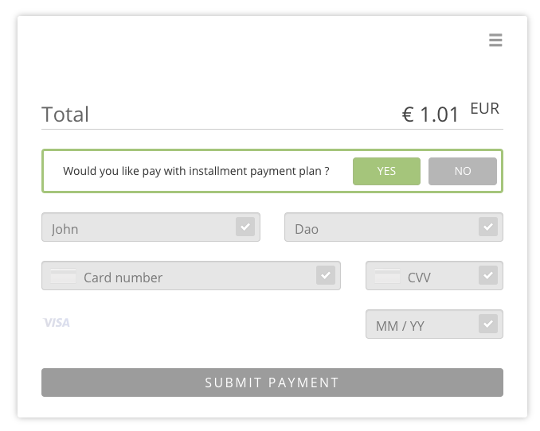
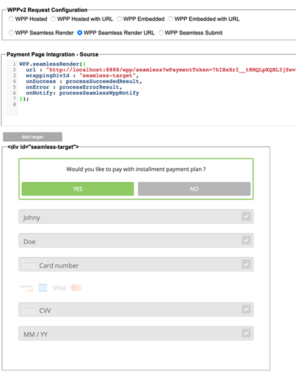
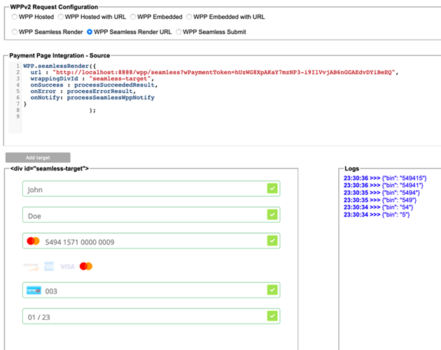

[#PPv2_CC_IPP]
[discrete]
== Installment Payment Plan (IPP) for {payment-page-v2-abbr}

**I**nstallment **P**ayment **P**lan is a feature that allows the consumer to pay in installments. +
Depending on the total order amount, you can offer various payment plans to the consumer. These _IPPs_ differ in tenure and installment payment framework (e.g. interest rate). +
 +
Set up a contract with your issuing bank to agree on the _IPP_ parameters. The issuing bank then provides {payment-provider-name} with these _IPP_ parameters.

NOTE: If your merchant account has not yet been set up for _IPP_, <<ContactUs, contact merchant support>>.

._IPP_ Characteristics
- *Fixed:* Installments are of equal amount.
- *On-us:* Issuing bank and acquiring bank are the same.
- *Issuer-based:* You receive the full amount from the acquiring bank once the transaction has been cleared. The consumer pays their issuing bank - same entity as acquiring bank since *on-us* - in installments.
- *Domestic payments only:* The instrument country, i.e. the country where the
consumer's card was issued, must match the merchant country.
- *Domestic currency only:* The consumer can only pay in the local currency of the merchant country.
- *Supported credit card brands:*
* Mastercard
* Visa

//-

[#PPv2_CC_IPP_CountriesCurrencies]
[discrete]
=== Countries and Currencies

[#PPv2_CC_IPP_Scenarios_Fields]
[%autowidth]
[cols="h,"]
|===
|Countries
|HK, ID, MY, PH, SG, TH, TW

|Currencies
|HKD, IDR, MYR, PHP, SGD, THB, TWD
|===

[#PPv2_CC_IPP_TransactionTypes]
[discrete]
=== Transaction Types
**I**nstallment **P**ayment **P**lan works with transaction type _purchase_.

---

[#PPv2_CC_IPP_HPP]
=== IPP for Hosted Payment Page
NOTE: You need a Merchant Account ID (MAID) to offer _IPP_ to your consumers. Make sure that _IPP_ has been set up for you by <<ContactUs, merchant support>>.

[#PPv2_CC_IPP_HPP_Workflow]
[discrete]
.Workflow
. The consumer checks out products in your shop and selects the payment method _Credit Card._

. -> Send an <<PaymentPageSolutions_PPv2_HPP_Integration_Example_Create, initial payment request>> to _{payment-gateway}_. This initial payment request must contain the MAID (IPP configuration).

. _{payment-gateway}_ checks if "IPP" is enabled in the merchant configuration.
** If the check fails, the payment process proceeds with a regular credit card payment. +
** If the check succeeds, _{payment-gateway}_ returns the ``payment-redirect-url`` with a list of available _IPP_ banks, programs and tenures.
 

. -> Use the ``payment-redirect-url`` to redirect the consumer.

. On the Hosted Payment Page, the consumer can choose to pay with _IPP:_ + 
+

. The consumer selects their preferred payment plan/tenure and submits the payment: +
 

. _{payment-gateway}_ checks the _IPP_ eligibility of
  - MAID,
  - credit card number,
  - consumer's country.
 
. _{payment-gateway}_ sends a payment request to the issuer.

. The issuer sends an authorization response to _{payment-gateway}._

. _{payment-gateway}_ forwards the payment result to you and sends an IPN to inform you on the outcome.

. -> Inform the consumer on the payment outcome.

[#PPv2_CC_IPP_seamless]
=== IPP for Seamless Integration

There are two types of seamless _IPP_ integrations:

* **Default - Non-Customizable:** The _IPPs_ offered to your consumers are the same for each payment. The consumer selects from different _IPP_ options.
* **Customizable:** You may preselect installment details for each payment individually. Consumers cannot change the preselected _IPP_ option.
//-

[#PPv2_CC_IPP_seamlessDefault]
[discrete]
==== 1. Non-Customizable IPP

Non-customizable _IPPs_ are predefined. Consumers are prompted to choose from various installment programs. These programs are retrieved with an initial payment request. This request must contain your Merchant Account ID (MAID). With your MAID, _{payment-gateway}_ checks if "onus" and "IPP" are enabled for your merchant account, so make sure that your merchant account has been set up for _IPP_ by <<ContactUs, merchant support>>. 

NOTE: If the MAID is missing in the initial payment request (e.g. due to expected merchant account resolving), the payment page does not offer payment in installments to your consumers.

[#PPv2_CC_IPP_seamlessDefault_Workflow]
[discrete]
.Workflow
. The consumer checks out products in your shop and selects the payment method _Credit Card._

. -> Send an <<PPv2_Seamless_Integration_Example_InitialRequest, initial payment request>> to _{payment-gateway}_. This initial payment request must contain the MAID (IPP configuration).

. _{payment-gateway}_ checks if "IPP" is enabled.
** If the check fails, the payment process proceeds with a regular credit card payment. +
** If the check succeeds, _{payment-gateway}_ returns the ``payment-redirect-url`` with a list of available _IPP_ banks, programs and tenures. 

. -> Use the ``payment-redirect-url`` to <<PPv2_Seamless_Integration_Example_Render, render the seamless payment form>>. Here, the consumer can choose to pay with _IPP:_ + 
+
[source,js,subs=attributes+]
----
WPP.seamlessRender({
    url: "payment-redirect-url", 
    wrappingDivId: "seamless-target",
    onSuccess: processSucceedResult,
    onError: processErrorResult, 
    onNotify: processSeamlessWppNotify
});
----
+

. The consumer selects their preferred bank and a plan/tenure: +
image:images/03-01-04-01-credit-card/wpp_cc_ipp_option1_workflow2_v.png[IPP bank selection,width=450]

. The consumer enters their credit card details and submits the payment: +
image:images/03-01-04-01-credit-card/wpp_cc_ipp_option1_workflow3_v.png[IPP bank selection,width=456]. +
The "Submit Payment" button is not part of the iframe, but on your payment page.

. Clicking "Submit Payment" calls the <<PPv2_Seamless_Integration_Example_Submit,  ``WPP.seamlessSubmit``>> script:
+
[source,js,subs=attributes+]
----
WPP.seamlessSubmit({
  onSuccess : processSucceededResult,
  onError : processErrorResult
});
----

. _{payment-gateway}_ checks the _IPP_ eligibility of
  - MAID,
  - credit card number,
  - consumer's country.

. _{payment-gateway}_ sends a payment request to the issuer.

. The issuer sends an authorization response to _{payment-gateway}_.

. _{payment-gateway}_ forwards the payment result to you and sends an IPN to inform you on the outcome.

. -> Inform the consumer on the payment outcome.

[#PPv2_CC_IPP_seamlessCustomizable]
[discrete]
==== 2. Customizable IPP

You can customize _IPPs_ for each payment individually. Consumers are not prompted to select from different installment plans, but an _IPP_ is requested automatically once the consumer  selects a tenure and submits the payment. 

For that purpose, you have to

. set the field ``manual-ipp`` to ``true`` in the <<PPv2_CC_IPP_seamlessCustomizable_Samples_initialPaymentRequest, initial payment request>>. +
 If this field is missing or set to ``false``, the payment process falls back to <<PPv2_CC_IPP_seamlessDefault, non-customizable IPP>>.
 . provide installment details when submitting the seamless form. +
These installment details must be part of the ``extPayment`` object of the ``WPP.seamlessSubmit`` function.

NOTE: To retrieve all available _IPP_ options, send a request to the <<GeneralPlatformFeatures_IPP_InstallmentCalculator, Installment Calculator>>.

[#PPv2_CC_IPP_seamlessCustomizable_Workflow]
[discrete]
.Workflow

. -> Send an <<GeneralPlatformFeatures_IPP_InstallmentCalculator, Installment Calculator>> request to retrieve the available _IPPs._

. <<GeneralPlatformFeatures_IPP_InstallmentCalculator, Installment Calculator>> returns a list of available _IPPs_. Depending on your merchant configuration, the _IPPs_ in this response are specified by either a single unique ``installment-plan-id`` or by a set of ``program-id``, ``plan-code`` and ``tenure``.

. The consumer checks out products in your shop and selects the payment method _Credit Card._

. -> Send an <<PPv2_CC_IPP_seamlessCustomizable_Samples_initialPaymentRequest, initial payment request>> to _{payment-gateway}_. This request must contain the following fields:
  - MAID
  - ``"manual-ipp" : true`` in the ``options`` JSON parent

+
.Sample Request
[#PPv2_CC_IPP_seamlessCustomizable_Samples_initialPaymentRequest]
[source,js,subs=attributes+,linenums,highlight=26-28]
----
{
       "payment": {
              "merchant-account-id": {
                     "value": "22bf581a-7950-4dcb-832b-8fccda56fb3d"
              },
              "request-id" : "{{$guid}}",
              "requested-amount": {
                     "value": "11.12",
                     "currency": "EUR"
              },
              "transaction-type": "auto-sale",
              "account-holder": {
                     "first-name": "Iam T.",
                     "last-name": "Shopper",
                     "email": "iam.t.shopper@home.com",
                     "phone": "+447795513955"
              },
              "payment-methods": {
                     "payment-method": [{"name" : "creditcard"}]
              },
              "locale": "en",
              "success-redirect-url": "https://demoshop-test.wirecard.com/demoshop/#/success",
              "fail-redirect-url": "https://demoshop-test.wirecard.com/demoshop/#/error"
       },
       "options": {
              "manual-ipp": true,
              "mode": "seamless",
              "frame-ancestor": "https://merchant.site"
       }
}
----

. _{payment-gateway}_ returns the ``payment-redirect-url`` that contains a list of available _IPP_ banks, programs and tenures. 

. -> Use ``WPP.seamlessRender`` to display the seamless payment form in an iframe on your payment page: 
+
[source,js,subs=attributes+]
----
WPP.seamlessRender({
    url: "payment-redirect-url", 
    wrappingDivId: "seamless-target",
    onSuccess: processSucceedResult,
    onError: processErrorResult, 
    onNotify: processSeamlessWppNotify
});
----
+
- ``onSuccess``: callback function called when seamless form is successfully rendered (no action required)
- ``onError``:  callback function called when seamless form cannot be rendered
- ``onNotify``: handles instant notifications from the seamless iframe 

+
 

. The consumer enters the credit card number into the corresponding field in the iframe. +
The ``onNotify`` function is called to immediately retrieve the BIN (first 6 digits of credit card number). +
Example of data content: ``data = {"bin": "549415"}``.

. -> Use the BIN to offer the appropriate installment/tenure option to your consumer (not handled by iframe, but displayed on your **payment page).**

. The consumer selects an installment/tenure option and clicks "Submit Payment" on your payment page.

  .. If the Installment Calculator response contains ``program-id``, ``plan-code`` and ``tenure``, clicking "Submit Payment" calls a script similar to the following:
+
[source,js,subs=attributes+]
----
WPP.seamlessSubmit({
  extPayment : {
    "periodic": {
      "periodic-type": "installment",
      "installment-plan": {
        "plan-code": "PPMAID-PGR2-01",
        "program-id": "IPP-PRG-2",
        "tenure": "12"
      }
    }
  },
  onSuccess : processSucceededResult,
  onError : processErrorResult
});

----
+
[#PPv2_CC_IPP_seamlessCustomizable_Fields]
[%autowidth]

|===
|Field |Data Type |Size |Description

m|tenure
|Integer
|10
|Installment tenure. Number of months the consumer has to pay in installments.
m|program-id
|String
|36
|Unique identifier of the installment payment plan framework.
m|plan-code
|String
|20
|Unique identifier of this _IPP_ issued by Wirecard. Maps to a specific tenure period and interest rate as agreed upon with the acquirer.
|===
+

These fields are **mandatory** in the ``extPayment`` object of the ``WPP.seamlessSubmit`` function. They specify the _IPP_ options selected by the consumer. 
+
.. If the Installment Calculator response contains ``installment-plan-id``, clicking "Submit Payment" calls a script similar to the following:
+
[source,js,subs=attributes+]
----
WPP.seamlessSubmit({
  extPayment : {
    "periodic": {
      "periodic-type": "installment",
      "installment-plan": {
		"installment-plan-id": "04204903-eda1-4cbf-8a93-f297577fbeae"
      }
    }
  },
  onSuccess : processSucceededResult,
  onError : processErrorResult
});

----
+
``installment-plan-id`` is **mandatory** in the ``extPayment`` object of the ``WPP.seamlessSubmit function``. They specify the IPP options selected by the consumer.
+
The ``extPayment`` data are automatically merged with the other payment data, i.e. credit card number and payment details from the initial payment request, and sent to _{payment-gateway}_.

. _{payment-gateway}_ checks the _IPP_ eligibility of
  - MAID,
  - credit card number,
  - consumer's country.

. _{payment-gateway}_ sends a payment request to the issuer. 

. The issuer sends an authorization response to _{payment-gateway}_.

. _{payment-gateway}_ forwards the payment result to you and sends an IPN to inform you on the outcome.

. -> Inform the consumer on the payment outcome.

//-
