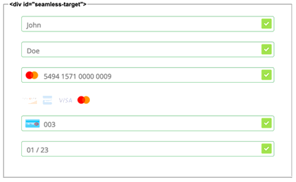

[#PPv2_CC_IPP]
== Installment Payment Plan (IPP) - Seamless Integration

**I**nstallment **P**ayment **P**lan is a feature that allows the consumer to pay in equal installments. +
Depending on the total order amount, you can offer various payment plans to the consumer. These IPPs differ in tenure and installment payment framework (e.g. interest rate). +
 +
Set up a contract with your issuing bank to agree on the IPP parameters. The issuing bank then provides {payment-provider-name} with these IPP parameters.

NOTE: If your merchant account has not yet been set up for IPP, <<ContactUs, contact merchant support>>.

.IPP Characteristics
- *Fixed*: Installments are of equal amount.
- *On-us:* Issuing bank and acquiring bank are the same.
- *Issuer-based:* Post-clearing, you receive the full amount from the acquiring bank. The consumer pays their issuing bank (same entity as acquiring bank since *on-us*) in installments.
- *Domestic payments only:* The instrument country, i.e. the country where the
consumer's card was issued, must match the merchant country.
- *Domestic currency only:* The consumer can only pay in the local currency of the merchant country.
- *Supported credit card brands:*
* Mastercard
* Visa
//-

[#PPv2_CC_IPP_CountriesCurrencies]
[discrete]
=== Countries and Currencies

[#PPv2_CC_IPP_Scenarios_Fields]
[%autowidth]
[cols="h,"]
|===
|Countries
|HK, ID, MY, PH, SG, TH, TW

|Currencies
|HKD, IDR, MYR, PHP, SGD, THB, TWD
|===

[#PPv2_CC_IPP_TransactionTypes]
[discrete]
=== Transaction Types
**I**nstallment **P**ayment **P**lan works with transaction type _purchase_.

***

There are two types of seamless IPP integration:

* **default - non-customizable:** The IPPs offered to your consumers are the same for each payment. The consumer selects from different IPP options.
* **customizable:** You may preselect installment details for each payment seperately. Consumers cannot change the preselected IPP options.
//-

[#PPv2_CC_IPP_option1]
[discrete]
=== 1. Non-customizable IPP

Non-customizable IPPs are pre-defined. Consumers are prompted to choose from various installment programs. These programs are retrieved with an initial payment request. This request must contain your Merchant Account ID (MAID). With your MAID, WPG checks if "onus" and "IPP" are enabled for you merchant account, so make sure that your merchant account has been set up for IPP by <<ContactUs, merchant support>>. 

NOTE: If the MAID is missing in the initial payment request (e.g. due to expected merchant account resolving), the payment page does not offer payment in installments to your consumer.

[#PPv2_CC_IPP_option1_Workflow]
[discrete]
==== Workflow
. The consumer checks out products in the merchant's shop and selects the payment method credit card.
. WPG checks
  - the signature
  - if "onus" is enabled
  - if "IPP" is enabled.

+

If the check fails, the payment process proceeds with a regular credit card payment. +
If the check is ok, WPG returns the payment-url with a list of available IPP banks, programs and tenures. 

. The merchant's payment page displays the rendered seamless payment form, where the consumer can choose to pay with IPP: + 
+
[source,js,subs=attributes+]
----
WPP.seamlessRender({
    url: paymentredirecturl, // this is the payment link returned in response to your initial request
    wrappingDivId: "seamless-target",
    onSuccess: processSucceedResult,
    onError: processErrorResult, 
    onNotify: processSeamlessWppNotify
});
----
+
image:images/03-01-04-01-credit-card/wpp_cc_ipp_option1_workflow1.png[IPP payment form,width=453]

. The consumer selects their preferred bank and a tenure: +
image:images/03-01-04-01-credit-card/wpp_cc_ipp_option1_workflow2.png[IPP bank selection,width=450]

. The consumer enters their credit card details and submits the payment: +
image:images/03-01-04-01-credit-card/wpp_cc_ipp_option1_workflow3.png[IPP bank selection,width=456]. +
The "Submit/Pay" button is not part of the iframe but of the merchant payment page.

. Clicking "Submit/Pay" calls the script:
+
[source,js,subs=attributes+]
----
WPP.seamlessSubmit({
  onSuccess : processSucceededResult,
  onError : processErrorResult
});
----

. WPG checks the IPP eligibility of
  - MAID
  - credit card number
  - consumer's country

+
and sends a payment request to the issuer.

. The issuer sends an authorization response to WPG.

. WPG forwards the payment result to the merchant and sends an IPN to inform the merchant on the outcome.

. The merchant informs the consumer on the payment outcome.

[#PPv2_CC_IPP_option2]
[discrete]
=== 2. Customizable IPP

You can customize IPPs for each payment separately. Consumers are not prompted to select from different installment plans, but an IPP is requested automatically once the consumer  selects a tenure and submits the payment. +
For that purpose, you have to

 . set the field ``manual-ipp`` to ``true`` in the <<PPv2_CC_IPP_option2_Samples_initialPaymentRequest, initial payment request>>. +
 If this field is missing or set to ``false``, the payment process falls back to <<PPv2_CC_IPP_option1, IPP type 1>>.
 . provide installment details when submitting the seamless form. +
These installment details must be part of the ``extPayment`` object of the ``WPP.seamlessSubmit`` function.
+

NOTE: To retrieve all available IPP options, send a request to the WPG <<GeneralPlatformFeatures_IPP_InstallmentCalculator, Installment Calculator>>.

[#PPv2_CC_IPP_option2_Workflow]
[discrete]
==== Workflow

. The merchant sends an <<GeneralPlatformFeatures_IPP_InstallmentCalculator, Installment Calculator>> request to WPG to retrieve the available IPPs.
. WPG returns a list of available IPP banks, programs and tenures.
. The consumer checks out products in the merchant's shop and selects the payment method credit card.
. The merchant sends an <<PPv2_CC_IPP_option2_Samples_initialPaymentRequest, initial payment request>> to WPG. This request must contain
  - MAID
  - the field ``"manual-ipp" : true`` in the ``options`` JSON parent.

. WPG returns a list of available IPP banks, programs and tenures. 
. The merchant uses ``WPP.seamlessRender`` to display the seamless payment form in an iframe on the merchant's payment page: + 
+
[source,js,subs=attributes+]
----
WPP.seamlessRender({
    url: paymentredirecturl, // this is the payment link returned in response to your initial request
    wrappingDivId: "seamless-target",
    onSuccess: processSucceedResult,
    onError: processErrorResult, 
    onNotify: processSeamlessWppNotify
});
----
+
 
+

NOTE: Use the ``onNotify`` callback in ``WPP.seamlessRender`` to retrieve the BIN from the entered credit card number. 

. The consumer enters their credit card number into the corresponding field in the iframe.

. The BIN that corresponds to this credit card number is displayed in the iframe.

. The merchant uses this BIN to offer tenure options on the merchant payment page (not in the iframe).

. The consumer selects a tenure and clicks "Submit/Pay".

. Clicking "Submit/Pay" calls a script similar to:
+
[source,js,subs=attributes+]
----
WPP.seamlessSubmit({
  extPayment : {
    "periodic": {
      "periodic-type": "installment",
      "installment-plan": {
        "plan-code": "PPMAID-PGR2-01",
        "program-id": "IPP-PRG-2",
        "tenure": "12"
      }
    }
  },
  onSuccess : processSucceededResult,
  onError : processErrorResult
});

----
+
The ``extPayment`` data are automatically merged with the other payment data (credit card number, payment details form the initial payment request).

. WPG checks the IPP eligibility of
  - MAID
  - credit card number
  - consumer's country

+
and sends a payment request to the issuer. 

. The issuer sends an authorization response to WPG.

. WPG forwards the payment result to the merchant and sends an IPN to inform the merchant on the outcome.

. The merchant informs the consumer on the payment outcome.

[#PPv2_CC_IPP_option2_Fields]
[discrete]
==== Fields
These fields are **mandatory** in the <<PPv2_CC_IPP_option2_Samples_initialPaymentRequest, initial payment request>>. They specify the IPP options. +
Send an <<GeneralPlatformFeatures_IPP_InstallmentCalculator, Installment Calculator request>> to retrieve the available field values.

[%autowidth]

|===
|Field |Data Type |Size |Description

m|tenure
|Integer
|10
|Installment tenure. Number of months the consumer has to pay in installments. +
m|program-id
|String
|36
|This ID uniquely identifies the corresponding installment payment plan framework.
|``plan-code``
|String
|
|
|===

[#PPv2_CC_IPP_option2_Samples]
[discrete]
==== Samples

[#PPv2_CC_IPP_option2_Samples_initialPaymentRequest]
.IPP Type 2 - Initial Payment Request

[source,js,subs=attributes+]
----
{
       "payment": {
              "merchant-account-id": {
                     "value": "22bf581a-7950-4dcb-832b-8fccda56fb3d"
              },
              "request-id" : "{{$guid}}",
              "requested-amount": {
                     "value": "11.12",
                     "currency": "EUR"
              },
              "transaction-type": "auto-sale",
              "account-holder": {
                     "first-name": "Johny",
                     "last-name": "Doe",
                     "email": "asd.asd@sdg.com",
                     "phone": "+447795513955"
              },
              "payment-methods": {
                     "payment-method": [{"name" : "creditcard"}]
              },
              "locale": "en",
              "success-redirect-url": "https://demoshop-test.wirecard.com/demoshop/#/success",
              "fail-redirect-url": "https://demoshop-test.wirecard.com/demoshop/#/error"
       },
       "options": {
              "manual-ipp": true,
              "mode": "seamless",
              "frame-ancestor": "https://merchant.site"
       }
}
----