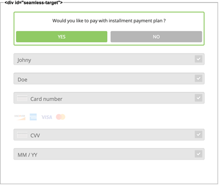

include::shortcuts.adoc[]

[#PPv2_CC_IPP]
== Installment Payment Plan (IPP) for {payment-page-v2-abbr}

**I**nstallment **P**ayment **P**lan is a feature that allows the consumer to pay in equal installments. +
Depending on the total order amount, you can offer various payment plans to the consumer. These IPPs differ in tenure and installment payment framework (e.g. interest rate). +
 +
Set up a contract with your issuing bank to agree on the IPP parameters. The issuing bank then provides {payment-provider-name} with these IPP parameters.

NOTE: If your merchant account has not yet been set up for IPP, <<ContactUs, contact merchant support>>.

.IPP Characteristics
- *Fixed*: Installments are of equal amount.
- *On-us:* Issuing bank and acquiring bank are the same.
- *Issuer-based:* Post-clearing, you receive the full amount from the acquiring bank. The consumer pays their issuing bank (same entity as acquiring bank since *on-us*) in installments.
- *Domestic payments only:* The instrument country, i.e. the country where the
consumer's card was issued, must match the merchant country.
- *Domestic currency only:* The consumer can only pay in the local currency of the merchant country.
- *Supported credit card brands:*
* Mastercard
* Visa
//-

[#PPv2_CC_IPP_CountriesCurrencies]
[discrete]
=== Countries and Currencies

[#PPv2_CC_IPP_Scenarios_Fields]
[%autowidth]
[cols="h,"]
|===
|Countries
|HK, ID, MY, PH, SG, TH, TW

|Currencies
|HKD, IDR, MYR, PHP, SGD, THB, TWD
|===

[#PPv2_CC_IPP_TransactionTypes]
[discrete]
=== Transaction Types
**I**nstallment **P**ayment **P**lan works with transaction type _purchase_.

***

[#PPv2_CC_IPP_HPP]
=== IPP for Hosted Payment Page
NOTE: You need a Merchant Account ID (MAID) to offer IPP to your consumers. Be sure that IPP has been set up for you by <<ContactUs, merchant support>>.

[#PPv2_CC_IPP_HPP_Workflow]
[discrete]
===== Workflow
. The consumer checks out products in the your shop and selects the payment method credit card.

. -> Send an <<PaymentPageSolutions_PPv2_HPP_Integration_Example_Create, initial payment request>> to WPG. This initial payment request must contain the MAID (IPP configuration).

. WPG checks
  - the signature
  - if "onus" is enabled
  - if "IPP" is enabled.

+

If the check fails, the payment process proceeds with a regular credit card payment. +
If the check is ok, WPG returns the ``payment-redirect-url`` with a list of available IPP banks, programs and tenures. 

. -> Use the ``payment-redirect-url`` to redirect the consumer.

. On the hosted payment page, the consumer can choose to pay with IPP: + 
+

. The consumer selects their preferred payment plan/tenure: +
 +
and submits the payment.

. WPG checks the IPP eligibility of
  - MAID
  - credit card number
  - consumer's country

+
and sends a payment request to the issuer.

. The issuer sends an authorization response to WPG.

. WPG forwards the payment result to you and sends an IPN to inform you on the outcome.

. -> Inform the consumer on the payment outcome.

[#PPv2_CC_IPP_seamless]
=== IPP for Seamles Integration

There are two types of seamless IPP integration:

* **default - non-customizable:** The IPPs offered to your consumers are the same for each payment. The consumer selects from different IPP options.
* **customizable:** You may preselect installment details for each payment seperately. Consumers cannot change the preselected IPP options.
//-

[#PPv2_CC_IPP_option1]
[discrete]
==== 1. Non-customizable IPP

Non-customizable IPPs are predefined. Consumers are prompted to choose from various installment programs. These programs are retrieved with an initial payment request. This request must contain your Merchant Account ID (MAID). With your MAID, WPG checks if "onus" and "IPP" are enabled for your merchant account, so make sure that your merchant account has been set up for IPP by <<ContactUs, merchant support>>. 

NOTE: If the MAID is missing in the initial payment request (e.g. due to expected merchant account resolving), the payment page does not offer payment in installments to your consumer.

[#PPv2_CC_IPP_option1_Workflow]
[discrete]
===== Workflow
. The consumer checks out products in your shop and selects the payment method credit card.

. -> Send an <<PPv2_Seamless_Integration_Example_InitialRequest, initial payment request>> to WPG. This initial payment request must contain the MAID (IPP configuration).

. WPG checks
  - the signature
  - if "onus" is enabled
  - if "IPP" is enabled.

+

If the check fails, the payment process proceeds with a regular credit card payment. +
If the check is ok, WPG returns the ``payment-redirect-url`` with a list of available IPP banks, programs and tenures. 

. -> Use the ``payment-redirect-url`` to <<PPv2_Seamless_Integration_Example_Render, render the seamless payment form>> on your payment page, where the consumer can choose to pay with IPP: + 
+
[source,js,subs=attributes+]
----
WPP.seamlessRender({
    url: "payment-redirect-url", 
    wrappingDivId: "seamless-target",
    onSuccess: processSucceedResult,
    onError: processErrorResult, 
    onNotify: processSeamlessWppNotify
});
----
+

. The consumer selects their preferred bank and a tenure: +

. The consumer enters their credit card details and submits the payment: +
. +
The "Submit/Pay" button is on your payment page (not part of the iframe).

. Clicking "Submit/Pay" <<PPv2_Seamless_Integration_Example_Submit, calls the script>>:
+
[source,js,subs=attributes+]
----
WPP.seamlessSubmit({
  onSuccess : processSucceededResult,
  onError : processErrorResult
});
----

. WPG checks the IPP eligibility of
  - MAID
  - credit card number
  - consumer's country

+
and sends a payment request to the issuer.

. The issuer sends an authorization response to WPG.

. WPG forwards the payment result to you and sends an IPN to inform you on the outcome.

. -> Inform the consumer on the payment outcome.

[#PPv2_CC_IPP_option2]
[discrete]
==== 2. Customizable IPP

You can customize IPPs for each payment separately. Consumers are not prompted to select from different installment plans, but an IPP is requested automatically once the consumer  selects a tenure and submits the payment. +
For that purpose, you have to

 . set the field ``manual-ipp`` to ``true`` in the <<PPv2_CC_IPP_option2_Samples_initialPaymentRequest, initial payment request>>. +
 If this field is missing or set to ``false``, the payment process falls back to <<PPv2_CC_IPP_option1, non-customizable IPP>>.
 . provide installment details when submitting the seamless form. +
These installment details must be part of the ``extPayment`` object of the ``WPP.seamlessSubmit`` function.
+

NOTE: To retrieve all available IPP options, send a request to the WPG <<GeneralPlatformFeatures_IPP_InstallmentCalculator, Installment Calculator>>.

[#PPv2_CC_IPP_option2_Workflow]
[discrete]
===== Workflow

. -> Send an <<GeneralPlatformFeatures_IPP_InstallmentCalculator, Installment Calculator>> request to WPG to retrieve the available IPPs.

. WPG returns a list of available IPP banks, programs and tenures.

. The consumer checks out products in your shop and selects the payment method credit card.

. -> Send an <<PPv2_CC_IPP_option2_Samples_initialPaymentRequest, initial payment request>> to WPG. This request must contain
  - MAID
  - the field ``"manual-ipp" : true`` in the ``options`` JSON parent.
+
.Sample Request
[#PPv2_CC_IPP_option2_Samples_initialPaymentRequest]
[source,js,subs=attributes+]
----
{
       "payment": {
              "merchant-account-id": {
                     "value": "22bf581a-7950-4dcb-832b-8fccda56fb3d"
              },
              "request-id" : "{{$guid}}",
              "requested-amount": {
                     "value": "11.12",
                     "currency": "EUR"
              },
              "transaction-type": "auto-sale",
              "account-holder": {
                     "first-name": "Iam T.",
                     "last-name": "Shopper",
                     "email": "iam.t.shopper@home.com",
                     "phone": "+447795513955"
              },
              "payment-methods": {
                     "payment-method": [{"name" : "creditcard"}]
              },
              "locale": "en",
              "success-redirect-url": "https://demoshop-test.wirecard.com/demoshop/#/success",
              "fail-redirect-url": "https://demoshop-test.wirecard.com/demoshop/#/error"
       },
       "options": {
              "manual-ipp": true,
              "mode": "seamless",
              "frame-ancestor": "https://merchant.site"
       }
}
----

. WPG returns the ``payment-redirect-url`` that contains a list of available IPP banks, programs and tenures. 

. -> Use ``WPP.seamlessRender`` to display the seamless payment form in an iframe on your payment page: 
+
[source,js,subs=attributes+]
----
WPP.seamlessRender({
    url: "payment-redirect-url", 
    wrappingDivId: "seamless-target",
    onSuccess: processSucceedResult,
    onError: processErrorResult, 
    onNotify: processSeamlessWppNotify
});
----
+
- ``onSuccess``: callback function called when seamless form is successfully rendered (no action required).
- ``onError``:  callback function called when seamless form cannot be rendered.
- ``onNotify``: handles instant notifications from the seamless iframe. 
+
image:images/03-01-04-01-credit-card/wpp_cc_ipp_option2_workflow1.png[IPP payment form,width=455] 

. The consumer enters the credit card number into the corresponding field in the iframe. +
The ``onNotify`` function is called to immediately retrieve the BIN (first 6 digits of credit card number). +
Example of data content: ``data = {"bin": "549415"}``.

. -> Use the BIN to offer the appropriate installment/tenure options to your consumer on your payment page. (They are not part of the iframe).

. The consumer selects an installment/tenure option and clicks "Submit/Pay".

. Clicking "Submit/Pay" calls a script similar to:
+
[source,js,subs=attributes+]
----
WPP.seamlessSubmit({
  extPayment : {
    "periodic": {
      "periodic-type": "installment",
      "installment-plan": {
        "plan-code": "PPMAID-PGR2-01",
        "program-id": "IPP-PRG-2",
        "tenure": "12"
      }
    }
  },
  onSuccess : processSucceededResult,
  onError : processErrorResult
});

----
+
[#PPv2_CC_IPP_option2_Fields]
[%autowidth]

|===
|Field |Data Type |Size |Description

m|tenure
|Integer
|10
|Installment tenure. Number of months the consumer has to pay in installments. +
m|program-id
|String
|36
|This ID uniquely identifies the corresponding installment payment plan framework.
|``plan-code``
|String
|
|
|===
+

-> These fields are **mandatory** in the ``extPayment`` object of the ``WPP.seamlessSubmit`` function. They specify the IPP options selected by the consumer. 
+
The ``extPayment`` data are automatically merged with the other payment data (credit card number, payment details from the initial payment request) and sent to WPG.

. WPG checks the IPP eligibility of
  - MAID
  - credit card number
  - consumer's country

+
and sends a payment request to the issuer. 

. The issuer sends an authorization response to WPG.

. WPG forwards the payment result to you and sends an IPN to inform you on the outcome.

. -> Inform the consumer on the payment outcome.

