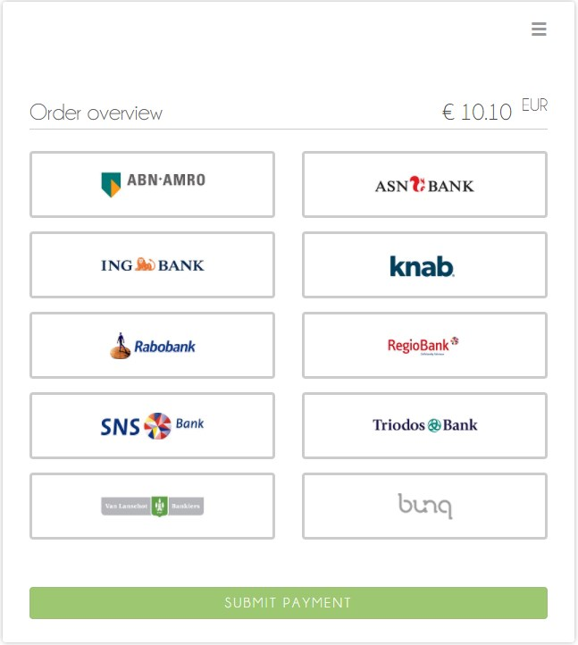

[#WPP_ideal]
===== iDEAL

[#WPP_ideal_General]
====== General Information

This is a reference page for _iDEAL_. Here you'll find all the
information necessary for integrating this payment method in
your Hosted and Embedded Payment Page.

.Are you unfamiliar with Wirecard Payment Page (WPP)?

NOTE: Visit one of the integration guides
(<<PaymentPageSolutions_WPP_HPP_Integration, Hosted>>,
<<PaymentPageSolutions_WPP_EPP_Integration, Embedded>>) for a quick explanation and
a step-by-step guide before continuing.

All <<PPSolutions_WPP, WPP>> integrations share a
<<PPSolutions_WPP_Workflow, common process flow>> for creating payments.

Below, you find example requests for <<WPP_ideal_TransactionType_debit, _debit_>>, 
including field lists with short descriptions.

These requests are designed for the testing environment and do not
use real information. 

NOTE: For production, you need to use production credentials. For details
contact our <<ContactUs, merchant support>>.

All given requests return successful responses.

For more details on the ``redirect-url``, see the 
<<PPSolutions_WPP_ConfigureRedirects, Configuring Redirects and IPNs for WPP>> 
section.

For response verification examples, see
the <<PPSolutions_WPP_WPPSecurity, WPP Security>> section.

[#WPP_ideal_About]
====== About _iDEAL_

_iDEAL_ is an e-commerce payment method widely used in the Netherlands.
Introduced in 2005, this payment method allows consumers to buy on the Internet
using direct online transfers from their bank account. _iDEAL_ works together
with leading Dutch banks using their online banking systems to carry out
payment transactions.

.Participating Banks

[width="100%",cols="50%,50%",]
|===
|BIC |Name

|ABNANL2A |ABN Amro Bank
|ASNBNL21 |ASN Bank
|BUNQNL2A |bunq
|HANDNL2A |Handelsbanken
|INGBNL2A |ING
|KNABNL2H |Knab
|MOYONL21 |Moneyou
|RABONL2U |Rabobank
|RGGINL21 |Regio Bank
|SNSBNL2A |SNS Bank
|TRIONL2U |Triodos Bank
|FVLBNL22 |Van Lanschot Bankiers
|===

[#WPP_ideal_TestCredentials]
====== Test Credentials

[cols="35h,65"]
|===
| URL(s) Endpoints
|``\https://wpp-test.wirecard.com/api/payment/register``
| Merchant Account ID (MAID)
| adb45327-170a-460b-9810-9008e9772f5f
| Username
| 70000-APITEST-AP
| Password
| qD2wzQ_hrc!8
| Secret Key (used for response verification)
| 1b9e63b4-c132-42c3-bcbd-2d2e47ae7154
|===

[#WPP_ideal_TestCredentials_Additional]
.Test banks for _iDEAL_ Sandbox

[cols="35,65"]
|===
|Bank |BIC

|Rabobank |RABONL2U
|ING | INGBNL2A
|===

At the moment, only Rabobank (RABONL2U) and ING (INGBNL2A) are available
for testing purposes. Choosing any other bank from the selection on the
payment or sending its BIC in the request triggers payment failure.

[#WPP_ideal_TransactionType_debit]
====== Transaction Type _debit_

A debit transaction charges the specified amount from the account
holder's bank account and marks it for immediate transfer.

For a successful _debit_ transaction:

. Create a payment session (initial request).
. Redirect the consumer to the payment page (initial response URL).
. Highly recommended: Parse and process the payment response. +

We provide ready-made JSON examples for each step of this process. You
can find them below.

<<WPP_ideal_TestCredentials, Endpoint>> for _iDEAL_ payments.

.Initial Request

The initial request creates the payment session. If it's
successful, you receive a URL as a response which redirects to the
_iDEAL_ payment form.

.Request Headers

[cols="20,80"]
|===
h| Authorization
| Basic NzAwMDAtQVBJVEVTVC1BUDpxRDJ3elFfaHJjITg=
h| Content-Type
| application/json
|===

.Optional fields

For a full list of optional fields you can use, see the REST API
<<iDEAL, _iDEAL_ specification>>.

For a full structure of a request (optional fields included), see the
<<WPP_ideal_JSONNVPField, JSON/NVP Field Reference>> section.

.1. Create a Payment Session (Initial Request)

[source,json]
----
{
    "payment": {
        "merchant-account-id": {
        "value": "adb45327-170a-460b-9810-9008e9772f5f"
        },
        "request-id": "{{$guid}}",
        "transaction-type": "debit",
        "requested-amount": {
            "currency": "EUR",
            "value": "1.23"
        },
        "payment-methods": {
            "payment-method": [
                {
                "name": "ideal"
                }
            ]
        }
    }
}
----

[cols="30,5,5,5,5,5,45"]
|===
3+|Field (JSON) |Data Type |Cardinality |Size |Description

2+|merchant-account-id |value |String |Required |36 |A unique identifier assigned
to every merchant account (by Wirecard).
3+|request-id |String |Required |64 a|A unique identifier assigned to every request
(by merchant). Used when searching for or referencing it later.
``{{$guid}}`` serves as a placeholder for a random ``request-id``.

Allowed characters: [a-z0-9-_]
3+|transaction-type |String |Required |n/a |The requested transaction type. For
_iDEAL_ payments, the transaction-type must be set to _debit_.
.2+|requested-amount  2+|value |Numeric |Required |18.2 a|The full amount that is
requested/contested in a transaction. 2 decimal digits allowed.

Use . (decimal point) as the separator.

2+|currency |String |Required |3 a|The currency of the requested/contested
transaction amount. For _iDEAL_ payments, the currency must be set to EUR.

Format: 3-character abbreviation according to ISO 4217.

|payment-methods |payment-method |name |String |Required | 15 |The name of the
payment method used. Set this value to _iDEAL_.
|===

.2. Redirect the consumer to the Payment Page (Initial Response URL)

[source,json]
----
{
"payment-redirect-url" : "https://wpp.wirecard.com/?wPaymentToken=f0c0e5b3-23ad-4cb4-abca-ed80a0e770e7"
}
----

////
In the following table we do not provide data for "size" and "cardinality"
////

[cols="<,<,<",]
|===
|Field (JSON) |Data Type |Description

|payment-redirect-url |String |The URL which redirects to the payment
form. Sent as a response to the initial request.
|===

At this point, you need to redirect your consumer to
``payment-redirect-url`` (or render it in an ``iframe`` depending on your
<<PPSolutions_WPP, integration method>>).

The consumers are redirected to the payment form. There they enter their
data and submit the form to confirm the payment. A payment can be:

- successful (``transaction-state``: _success_),
- failed (``transaction-state``: _failed_),
- canceled. The consumer canceled the payment before/after submission
(``transaction-state``: _failed_).

The transaction result is the value of ``transaction-state`` in the
payment response. More details (including the status code) can also be
found in the payment response in the ``statuses`` object. Canceled
payments are returned as ``transaction-state``: _failed_, but the
status description indicates it was canceled.

In any case (unless the consumer cancels the transaction on a 3rd party
provider page), a base64 encoded response containing payment information
is sent to the configured redirection URL. See
<<PPSolutions_WPP_ConfigureRedirects, Configuring Redirects and IPNs for WPP>>
for more details on redirection targets after payment & transaction status
notifications.

You can find a decoded payment response example below.

.3. Parse and Process the Payment Response (Decoded Payment Response)

[source,json]
----
{
  "api-id" : "up3-wpp",
  "parent-transaction-id" : "335da412-98ba-446d-a936-52b53f195e6c",
  "payment-methods" : {
    "payment-method" : [ {
      "name" : "ideal"
    } ]
  },
  "request-id" : "edcdefd8-ba6b-4987-a02c-112ecb3c67a5",
  "merchant-account-id" : {
    "value" : "adb45327-170a-460b-9810-9008e9772f5f"
  },
  "transaction-state" : "success",
  "account-holder" : {
    "first-name" : "Hr",
    "last-name" : "E G H Küppers en/of MW M.J. Küpp"
  },
  "bank-account" : {
    "iban" : "NL53INGB0654422370",
    "bic" : "INGBNL2A"
  },
  "transaction-type" : "debit",
  "transaction-id" : "cac570c9-d2a3-4b43-ac14-ca9e72b60c8c",
  "completion-time-stamp" : "2018-03-23T10:41:34",
  "requested-amount" : {
    "currency" : "EUR",
    "value" : 1.230000
  },
  "statuses" : {
    "status" : [ {
      "severity" : "information",
      "code" : "201.1126",
      "description" : "Successful confirmation received from the bank."
    } ]
  }
}
----

////
In the following table we do not provide data for "size" and "cardinality"
////

[cols="30,5,5,5,55"]
|===
3+|Field (JSON) |Data Type |Description

3+|api-id |String |Identifier of the currently used API.
3+|parent-transaction-id |String |The ID of the transaction being referenced as a parent.
|payment-method 2+|name |String |The name of the payment method used.
3+|request-id |String |A unique identifier assigned to every request (by merchant). Used when searching for or referencing it later.
|merchant-account-id 2+|value |String |A unique identifier assigned to every merchant account (by Wirecard).
3+|transaction-state |String a|The current transaction state.

Possible values:

- _in-progress_
- _success_
- _failed_

Typically, a transaction starts with state _in-progress_ and finishes with
state either _success_ or _failed_. This information is returned in the response
only.
.2+|account-holder 2+|first-name |String |The first name of the account holder.
2+|last-name |String |The last name of the account holder.
.2+|bank-account 2+|iban |String |The international bank account number (IBAN) of the account holder.
2+|bic |String |The bank identifier code (BIC) of the account holder.
3+|transaction-type |String |The requested transaction type.
3+|transaction-id |String |A unique identifier assigned to every transaction(by Wirecard). Used when searching for or referencing to it later.
3+|completion-time-stamp |YYYY-MM-DD-Thh:mm:ss a|The UTC/ISO time-stamp documents the time & date when the transaction was executed.

Format: YYYY-MM-DDThh:mm:ss (ISO).
.2+|requested-amount 2+|currency |String a|The currency of the requested/contested transaction amount. For iDEAL payments, the currency must be set to EUR.

Format: 3-character abbreviation according to ISO 4217.
2+|value |Numeric |The full amount that is requested/contested in a transaction. 2 decimals allowed.
.3+|statuses .3+|status |severity |String a|The definition of the status message.

Possible values:

- _information_
- _warning_
- _error_
|code |String |Status code of the status message.
|description |String |The description of the transaction status message.
|===

[#WPP_ideal_PostProcessing]
====== Post Processing Operations

WPP is best used to deal with "one-off" payments (e.g. regular,
independent _debit_ transactions) or the initial transaction in a chain of
them (e.g. a first _authorization_ in a chain of recurring transactions).
However, when it comes to referencing a transaction for any kind of
post processing operations — like a refund of one of your _[TRANSACTION TYPE NAME]_ transactions 
— use our <<RestApi, REST API>> directly. Check the REST API
<<iDEAL, _iDEAL_ specification>> for details on
_iDEAL_ specific post processing operations.

////
I rewrote the following sentence, as the information given in our Doc-Center
is missleading. iDEAL only supports "debit" all post processes must be performed
via SEPA.
////

_iDEAL_ with WPP supports _debit_ only. For refund,
use <<SEPACreditTransfer, SEPA Credit Transfer>> (if SEPA Credit Transfer is
activated for your merchant account) through our <<RestApi, REST API>>.

[#WPP_ideal_JSONNVPField]
====== JSON/NVP Field Reference

NVP equivalents for JSON fields (for migrating merchants).

Here you can:

- find the NVP equivalents for JSON fields (for migrating merchants),
- see the structure of a full request (optional fields included).

[#WPP_ideal_JSONNVPField_request]
.JSON Structure for _iDEAL_ Requests

[source,json]
----
{
    "payment": {
        "merchant-account-id": {
        "value": "string"
        },
        "request-id": "string",
        "transaction-type": "string",
        "requested-amount": {
            "currency": "string",
            "value": "0"
        },
        "payment-methods": {
            "payment-method": [
                {
                "name": "string"
                }
            ]
        },
        "bank-account": {
            "iban": "string",
            "bic": "string"
        },
        "account-holder" : {
            "first-name" : "string",
            "last-name" : "string"
        },
        "descriptor": "string",
        "order-number": "string",
        "locale": "string",
        "success-redirect-url": "string",
        "fail-redirect-url": "string",
        "cancel-redirect-url": "string"
    }
}
----

[cols=",,",]
|===
|Field (NVP) |Field (JSON) |JSON Parent

|merchant_account_id |value |merchant-account-id ({ })
|request-id |request-id |payment ({ })
|transaction-type |transaction-type |payment ({ })
|requested_amount_currency |currency |requested-amount ({ })
|requested_amount |value |requested-amount ({ })
|payment_method |payment-method ([ ])/name |payment-methods ({ })
|bank_account_bic |bic |bank-account ({ })
|bank_account_iban |iban |bank-account ({ })
|first_name |first-name |account-holder ({ })
|last_name |last-name |account-holder ({ })
|descriptor |descriptor |payment ({ })
|order_number |order-number |payment ({ })
|locale |locale |payment ({ })
|success_redirect_url |success-redirect-url |payment ({ })
|fail_redirect_url |fail-redirect-url |payment ({ })
|cancel_redirect_url |cancel-redirect-url |payment ({ })
|===

[#WPP_ideal_JSONNVPField_response]
.JSON Structure for _iDEAL_ Responses

[source,json]
----
{
  "api-id" : "string",
  "parent-transaction-id" : "string",
  "transaction-state" : "string",
  "transaction-id" : "string",
  "completion-time-stamp" : "2018-03-23T10:41:34",
  "statuses" : {
    "status" : [ {
      "severity" : "string",
      "code" : "string",
      "description" : "string"
    } ]
  }
}
----

[cols=",,",]
|===
|Field (NVP) |Field (JSON) |JSON Parent

|api_id |api-id |payment ({ })
|parent_transaction_id |parent-transaction-id |payment ({ })
|transaction_state |transaction-state |payment ({ })
|transaction_id |transaction-id |payment ({ })
|completion_time_stamp |completion-time-stamp |payment ({ })
|status_description_n |status ([ {} ])/ severity |statuses ({ })
|status_severity_n |status ([ {} ])/ code |statuses ({ })
|status_code_n |status ([ {} ])/ description |statuses ({ })
|===

//-
