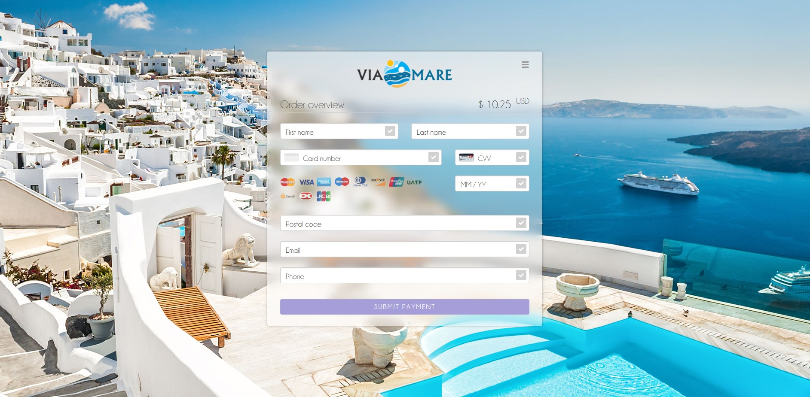
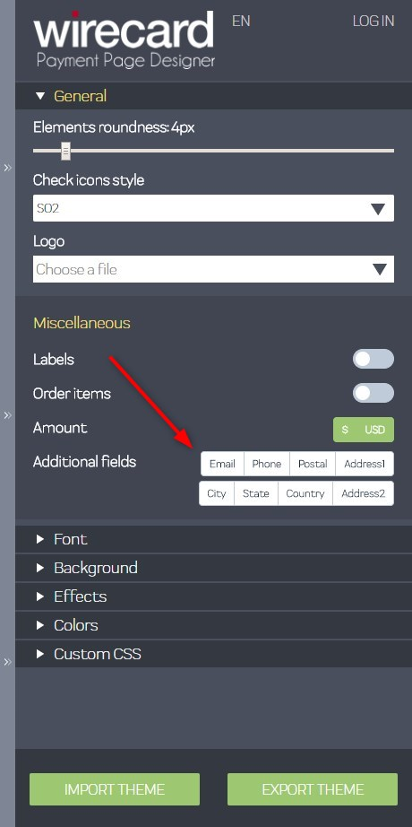
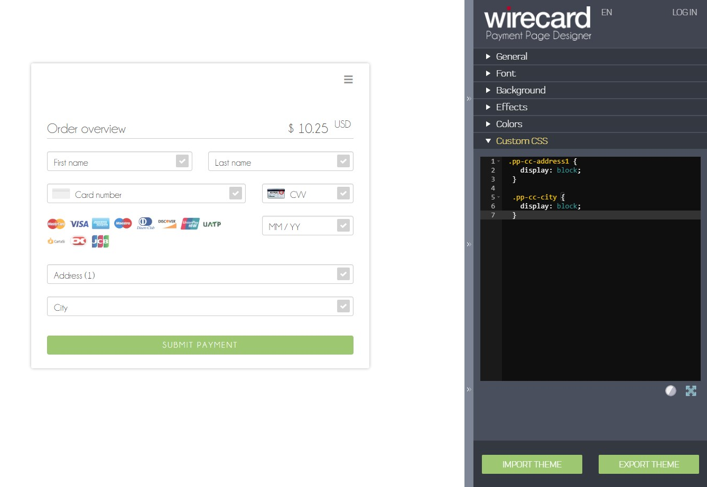

[#WPP_Features_AdditionalFields]

==== Additional Fields
Billing & shipping fields are not showing in the payment form by
default. However, you may enable these fields to show in the payment form:

* Email 
* Phone 
* Address 1 
* Address 2 
* City 
* State 
* Country 
* Postal Code
//-

NOTE: These fields are available for credit card transactions only.

To show these fields in the form, you have two options:

[#WPP_Features_AdditionalFields_FieldTogglesinPaymentPageDesigner]
===== Field Toggles in Payment Page Designer

[.float-group]
--

Click the button(s) of the field you want to show in the Designer menu,
then save the theme. WPP then shows the saved field selection each time
it loads a payment page with that theme.
--

[#WPP_Features_AdditionalFields_CustomCSSFeature]
===== Using the Custom CSS Feature in Payment Page Designer

Add the CSS class of the field you want to show to the *Payment Page Designer Custom
CSS Editor* and set its `display` property to `block`.

For example:

[source, CSS, syntaxhighlighter-pre]
----
.pp-cc-address1 {
    display: block;
 }

 .pp-cc-city {
    display: block;
 }
----

Since the default value of `display` property for these fields
is `none`, as soon as you change it to `block` they become visible.
These CSS settings are a part of the theme and are loaded at any time
that you use that particular theme.

Here is a list of the CSS element names for the hidden fields:

[source, CSS, syntaxhighlighter-pre]
----
.pp-cc-email
.pp-cc-phone
.pp-cc-address1
.pp-cc-address2
.pp-cc-city
.pp-cc-state
.pp-cc-country
.pp-cc-postal-code
----
