[#PPD_customize]
===== How to Customize your Payment Page?

If you want to customize your Payment Page, use the https://designer-test.{domain}[Payment Page Designer] (PPD).

.The Payment Page Designer shows

- to the left: a device preview. +
- in the middle: a live preview of your currently designed Payment Page. +
- to the right: the payment page styler.

// wait for Ronald to discuss a better name than "Payment Page Styler".

*Device Preview* +
Click the white arrows in the black area (top left) to open the device preview. Click either Notebook/PC, tablet or mobile phone to adjust the *Live Preview*.

*Live Preview* +
The live preview in the middle will change immediately as soon as you modify the settings in the *Payment Page Styler*. +
What does not change is the content of the Hamburger symbol at the top right in the live preview. +
With the Hamburger you can 

- select a language for your payment page.
- select a payment method.
- cancel a payment process.

*Payment Page Styler* +
In the head of the payment page styler you can select a language for the payment page styler (possible are English, German and French) and you find the login button. 
Login to PPD, if you want to manage your <<PPD_customize_save, exported themes>>.

//You can use these credentials to login to a test environment: User name; Password 

// Who can implement and provide these credentials?

The payment page styler is devided in three tabs: *Payment*, *Grid* and *Processing*. Use the 

- *Payment* tab for customizing.
- *Grid* tab to see all the available payment methods.
- *Processing* tab to see, how you customized the spinner (progress bar).

This section explains how you can customize your {payment-page-v2-abbr} with the *Payment* tab of the payment page styler.

[#PPD_customize_general]
.General

In the *General* section you can 

- customize the appearance of the input fields (roundness and icons). +
- select a predefined spinner (progress bar) or upload a personalized spinner. This personalized spinner must be available as an animated gif.
- upload your logo. The logo shall not exceed the volume of 300 kB. It must have a dimension between 30x30 px (min) and 1200x900 px (max).
- upload a background picture. The background picture shall not exceed the volume of 1024 kB. It must have a dimension between 1000x768 px (min) and 2651x1441 px (max).

[#PPD_customize_misc]
.Miscellaneous

In the *Miscellaneous* section you can

- insert the list of order items.
- move card data in one field.
- switch between labels and/or placeholders in the text fields. You can unselect *Placeholder* only, if *Label* is selected (and vice versa).
- customize the appearance of *amount* and *currency*.
- add additional customer information fields (like address, email, phone, etc).
- determine where you want to show the *CANCEL PAYMENT* button. The default position is in the Hamburger menu.

[#PPD_customize_font]
.Font

In the *Font* section you can

- change the fonts. Select one from the predefined fonts for text/buttons or input fields. +
- upload a font of your choice. + 
* upload one font at a time in the Web Open Font Format (.woff, .woff2 file extensions). +
You can see your uploaded font as custom font in the drop down list. You can select the uploaded font for both, text/buttons or input fields.

[#PPD_customize_colors]
.Colors

In the *Colors* section you can change the color of 

- the buttons (click *Primary Color*). 
- the *CANCEL PAYMENT* button (click *Secondary (Dismiss) Color*). It can be used only, if you <<PPD_customize_misc, set the button>> next to the submit button.
- the entire background (click *Page Background Color*).
- the payment page form (click *Content Background Color*).
- the input fields.
- GUI elements in the *Miscellaneous* section.

[#PPD_customize_effects]
.Effects

*Effects* can be used only, if you have uploaded a logo or a background picture in the <<PPD_customize_general, General>> section or a <<PPD_customize_colors, Color>>.

[#PPD_customize_css]
.Custom CSS

In the *Custom CSS* section you can be more specific with your settings. If you want to be more precise than the provided presets you can personalize your style sheet here and save it (<<PPD_customize_save, export it to a theme>>).

[#PPD_customize_payment-request]
.Payment request

In the *Payment request* section you can modify the values (e.g. requested-amount@value, requested-amount@currency, order-item.name, order-item.description, etc) of a potential payment request. The live preview displays your modifications immediately. +
If the order items are not visible you can display them via the <<PPD_customize_misc, Miscellaneous>> section.

[#PPD_customize_save]
.Save your settings

If you want to save your settings you can click *Export theme*.
You can define different themes and import them to PPD, if you want to customize them further.
//// 
Use your login credentials (link to "PPD") to mangage your themes (link to "Managing your Themes").
////

//-

//// 
[#PaymentPageDesigner_QuickStartGuide]
===== Quick Start Guide

{payment-provider-name} Payment Page Designer (PPD) is an intuitive web-tool for
customizing hosted and embedded payment pages. It offers numerous ways
to customize and add fonts, colors, effects, backgrounds, and logos to
create themes which can be exported (and imported for further editing),
or used immediately on your checkout page.

This guide aims to provide a brief overview of the tool's capabilities
and instructions on how to use them.

[#PaymentPageDesigner_QuickStartGuide_OpeningScreen]
====== Opening Screen

[.right]
ifdef::env-wirecard[]
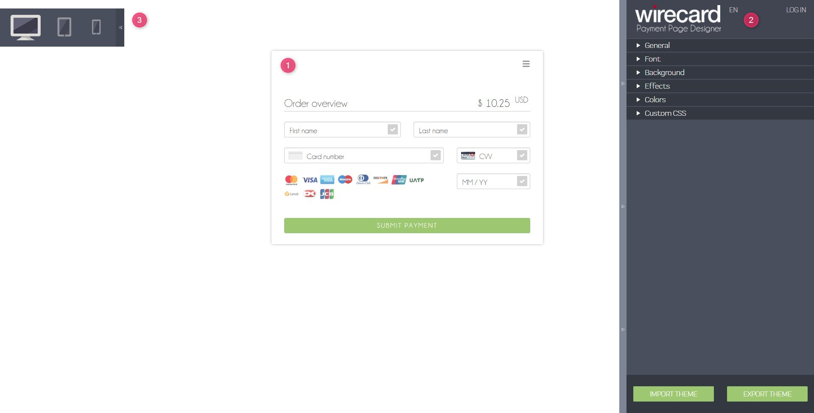
endif::[]

ifndef::env-wirecard[]
image::images/03-01-07-01-pp-designer-quick-start-guide/Payment_Page_Designer_opening_window_whitelabeled.png[Payment Page Designer Opening Window, width=450]
endif::[]

The PPD's GUI has 3 basic parts:

. Live preview in the middle
. Options menu on the right
. View selector on top left

//-

[#PaymentPageDesigner_QuickStartGuide_Livepreview]
*1. Live preview*

The preview updates itself whenever you customize - or add - something
using the tool rack. It is always visible and wholly reactive,
essentially providing you with a real model of how your design will look
when deployed.

[#PaymentPageDesigner_QuickStartGuide_Optionsmenu]
*2. Options Menu*

This is where you will make all the adjustments, edits and choose
settings. Most of this guide will be dedicated to going through the
separate sections of this menu.

[#PaymentPageDesigner_QuickStartGuide_Viewselector]
*3. View selector*

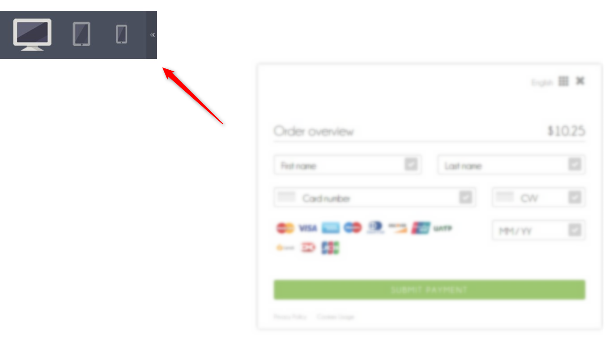

All of the designs you create with PPD are fully responsive: with the
view selector, you can switch between the web, tablet, and mobile
versions of your payment page/form.

[#PaymentPageDesigner_QuickStartGuide_RegistrationLogin]
====== Registration & Login

The login button can be found on the top right of the options menu.

Registered users gain access to the _Themes_ menu, which gives them
ability to save, store, and cycle between their themes easily without
leaving PPD.

For more information on theme management,
see <<PaymentPageDesigner_QuickStartGuide_ThemesMenu_RegisteredUsers, Themes Menu (Registered Users)>>
& <<PaymentPageDesigner_QuickStartGuide_ManagingYourThemes, Managing Your Themes>>.

[#PaymentPageDesigner_QuickStartGuide_OptionsMenu]
====== Options Menu (In-Depth)

[#PaymentPageDesigner_QuickStartGuide_General]
.General

[.clearfix]
--
[.right]
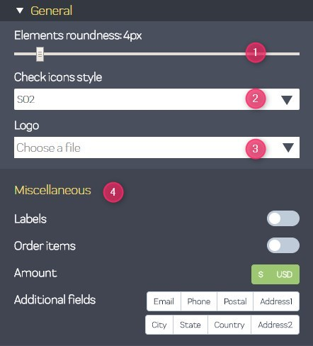

. Use the slider to select your preferred level of roundness for the
payment form's corners. 0px (square) is default.
. Flat, material and original (classic) versions of card icons are
available.
. You can upload your logo and set its position using the provided
sliders, the default being top middle of the payment form. It can be
reset or removed at any time. These options become visible only after
you upload a file. 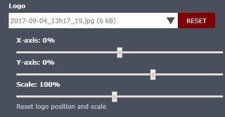

. You can also enable various <<PPv2_Features, {payment-page-v2-abbr} features>>.

//-

*The supported logo dimensions are 30 x 30 px min., 1200 x 900 px max.*
--

[#PaymentPageDesigner_QuickStartGuide_Font]
.Font

[.clearfix]
--
[.right]
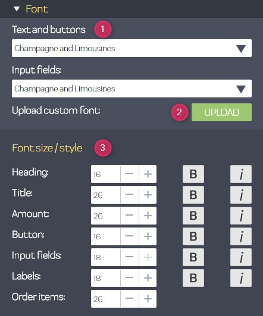

. In the drop-down menus, you can choose from a number of basic fonts
provided by default, available separately for the form elements and
input text.
. You can upload your own fonts by choosing the font file.
After the upload, they will be listed in the drop-down menus like the
basic fonts, under _Custom fonts_.
. You can set the font size for all of the elements and input fields,
with toggles for bold and italic.

//-

*PPD only accepts the Web Open Font Format (.woff, .woff2 file extensions).*
--

[#PaymentPageDesigner_QuickStartGuide_Background]
.Background

[.clearfix]
--
[.right]
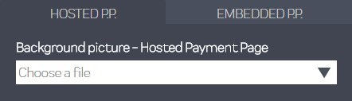

In the background section you can choose switch between the hosted
payment page (HPP, default) and embedded payment page (EPP) views:

* For HPP, you can set the background picture over which the live
preview will be rendered. +
*The supported background image dimensions are 1000 x 768 px min., 2651 x 1441 px max.*

* For EPP, you can set a preview site (via URL) over which the live
preview will be rendered. +
You can only use a page (URL) which can be displayed in an iframe as EPP
background.
//-
--

[#PaymentPageDesigner_QuickStartGuide_Effects]
.Effects

[.clearfix]
--
[.right]
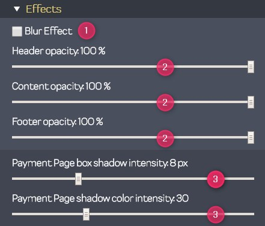

. The *Blur Effect* toggle halves the opacity sliders globally,
providing the desired effect of transparency.
. You can also set the sliders manually.
. The last two sliders allow you to set the size and intensity of the
payment form's shadow on the margins.
//-
--

[#PaymentPageDesigner_QuickStartGuide_Colors]
.Colors

[.clearfix]
--
[.right]
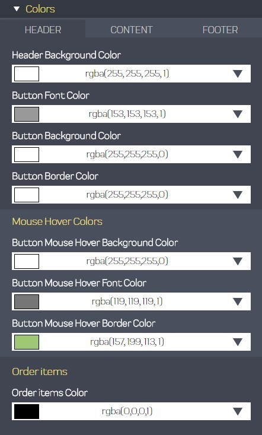

The *Colors* section provides drop-down menus for customizing the colors
of all the payment form elements. You can set colors separately for the
header, content, and footer parts of the form.

Mix the colors manually or use RGB/HEX codes. Color history feature is
available.

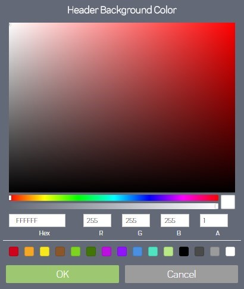
--

[#PaymentPageDesigner_QuickStartGuide_CustomCSS]
.Custom CSS

[.clearfix]
--
[.right]
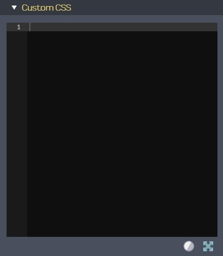

You can write or paste your optional CSS markup into the provided text
editor. Classic white and dark modes for the text editor are available,
as is full screen.
--

[#PaymentPageDesigner_QuickStartGuide_ImportExport]
.Import/Export

Import or export your PPD themes using their respective buttons at the
very bottom of the options menu.

NOTE: PPD uses the JSON format to store and interpret theme data.

////

[#PaymentPageDesigner_QuickStartGuide_ThemesMenu_RegisteredUsers]
====== Themes Menu (Registered Users)

[cols="1,1,1"]
[frame=none]
[grid=none]
|===
a|As mentioned in <<PaymentPageDesigner_QuickStartGuide_RegistrationLogin, Registration & Login>>, logged in users are able to use _Themes_ menu. After logging
in, the view will switch to _Themes_:

. Details regarding the currently selected theme.
. The current logged-in user. You can change the user by clicking the
pencil on the right.
. Opens a _Create New Theme_ window (pictured below).
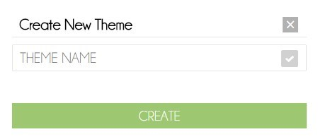

. Lets you import a theme in the `.json` file format from your
computer. A new theme named after the file will be created upon the
import.
. A list of your current themes.
. Preview button.
//-

You can switch between the _Themes_ and default options menu views at
any time. To go back to the options menu, use the *BACK TO STYLER*
button at the bottom of the sidebar.

Back in the options menu, instead of the import/export buttons at the
bottom, you will get these instead:
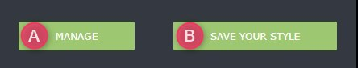

A. The *MANAGE* button switches the view to _Themes_ menu.
B. The *SAVE YOUR STYLE* button saves your work progress. If the theme
hasn't been created yet, it will open up a window where you can name and
save your new theme (pictured below).
//-
a|
ifdef::env-wirecard[]
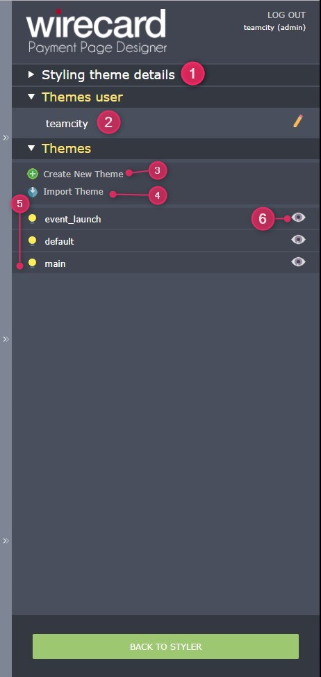
endif::[]

ifndef::env-wirecard[]
image::images/03-01-07-01-pp-designer-quick-start-guide/Payment_Page_Designer_themes_menu_themes_user_whitelabeled.png[Payment Page Designer themes user]
endif::[]

a|image::images/03-01-07-01-pp-designer-quick-start-guide/Payment_Page_Designer_themes_menu_styling_theme_details.png[Payment Page Designer styling theme details]
|===

[#PaymentPageDesigner_QuickStartGuide_ManagingYourThemes]
.Managing Your Themes

[.clearfix]
--
[.right]
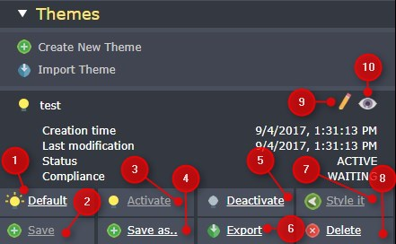

Clicking on an individual theme opens a detailed view. Here is what the
buttons do:

. Sets the selected theme as default. It will be rendered, unless you
specify otherwise.
. Saves your current work progress.
. Activates the selected theme.
. Saves the selected theme under a different name.
. Deactivates the selected theme.
. Exports the selected theme as a `.json` file.
. Switches to options menu view with the selected theme's options.
. Removes the selected theme from PPD.
. Lets you edit the theme's name.
. Opens up a preview of the theme with basic information (pictured
below). You can download the preview in `.jpeg` format.
//-
--
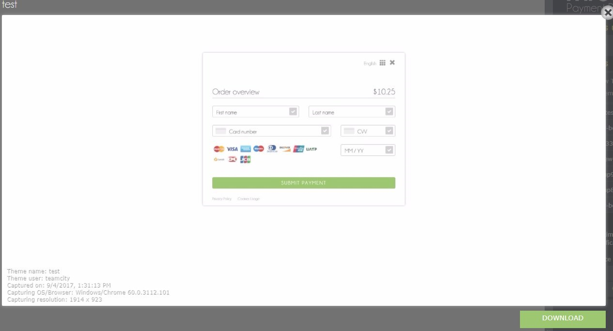
