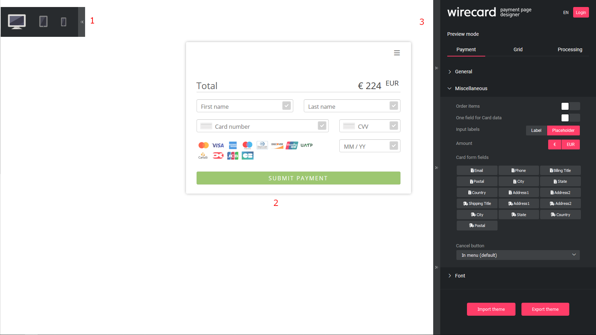

[#PPD_customize]
===== How to Customize your _{payment-page-v2}_

Customize your _{payment-page-v2}_ using the https://designer-test.{domain}[Payment Page Designer] (PPD).

.The Payment Page Designer displays:

- Preview menu for different devices (1) +
- Live preview of your currently designed _{payment-page-v2}_ (2) +
- Payment Page Designer menu (3)

*Device Preview* +
Click the unfold button in the upper-left corner to open the device preview menu. 
To see a live preview for different devices, click either *Desktop preview*, *Tablet preview* or *Mobile preview*.

*Live Preview* +
The live preview represents your _{payment-page-v2}_ form. It changes as soon as you modify the settings in the *Payment Page Designer* menu. +

During a payment process the *Hamburger* button in the upper-right corner of the _{payment-page-v2}_ form is available for the consumer. +
The consumer can use the *Hamburger* button to:

- Select a language for your _{payment-page-v2}_ form
- Select a payment method
- Cancel a payment process (this option depends on your <<PPD_customize_misc, customization>>)

//-

[#PPD_customize_menu]
*Payment Page Designer Menu* +
At the top of the *Payment Page Designer* menu, you can select one of the following languages for the *Payment Page Designer* menu:

- English (EN)
- German (DE)
- French (FR)

//-

Click *Login* to access and manage your <<PPD_customize_save, exported themes>>.

Change the *Preview mode* between *Payment*, *Grid* and *Processing*:

- *Payment* shows all the fields relevant for your payment process.
- *Grid* shows all the available payment methods. Click a payment method to process the payment.
- *Processing* shows the *Spinner* (process indicator), as it is presented to the customer while waiting for the execution of the payment process. 

//-

The *Payment Page Designer* is divided in seven sections:

- <<PPD_customize_general, General>>
- <<PPD_customize_misc, Miscellaneous>>
- <<PPD_customize_font, Font>>
- <<PPD_customize_colors, Colors>>
- <<PPD_customize_effects, Effects>>
- <<PPD_customize_css, Custom CSS>>
- <<PPD_customize_payment-request, Payment request (for preview only)>>

//-

[#PPD_customize_general]
.General

Drop down the *General* section to:

- Customize the appearance of the payment form and its input fields (roundness and icons).
- Select a predefined *Spinner* (process indicator) or upload a personalized one. The personalized one must be an animated gif.
- Upload your logo. It must not exceed 300 kB. Its size must be between 30x30 px and 1200x900 px.
- Upload a background picture. It must not exceed 1024 kB. Its size must be between 1000x768 px and 2651x1441 px.

//-

[#PPD_customize_misc]
.Miscellaneous

Drop down the *Miscellaneous* section to:

- Display or hide the input fields for order items (move the slider).
- Display the card data in either one or three input fields (move the slider).
- Switch between labels and/or placeholders for the input labels format. You can cancel the *Placeholder* selection only if *Label* 
is selected (and vice versa).
- Switch between currency symbol and/or currency name (the ISO 4217 alphabetical code) for the *Amount* format. You can cancel the currency symbol selection only if the currency name is selected (and vice versa). 
- Insert additional input fields (*Card form fields*) for detailed customer information (e.g. address, email, phone, etc).
- Determine where you want to place the *CANCEL PAYMENT* button. By default, it is displayed as a command in the *Hamburger* menu.

//-

[#PPD_customize_font]
.Font

Drop down the *Font* section to:

- Change the fonts. Select one of the predefined fonts for buttons or input fields. +
- Upload a font of your choice. + 

//-

NOTE: Upload only one font at a time in the Web Open Font Format (.woff, .woff2 file extensions). +
The uploaded font then appears as a custom font in the *Text and buttons* and *Input fields* list. 

[#PPD_customize_colors]
.Colors

Drop down the *Colors* section to change the colors of: 

- Buttons (click *Primary Color*)
- *CANCEL PAYMENT* button (click *Secondary (Dismiss) Color*). It can be used only if you <<PPD_customize_misc, place the button>> next to the *SUBMIT PAYMEMT* button.
- Entire background (click *Page Background Color*).
- _{payment-page-v2}_ form (click *Content Background Color*).
- Input fields.
- Graphic user interface elements in the *Miscellaneous* section, such as the horizontal line, the spinner and the *Hamburger* button (click *Menu Icons Color*).

//-

[#PPD_customize_effects]
.Effects

*Effects* can be used only if you have uploaded a logo or a background picture in the <<PPD_customize_general, General>> section, or a <<PPD_customize_colors, Color>>.

[#PPD_customize_css]
.Custom CSS

Drop down the *Custom CSS* section to include more detailed settings. If you want a more precise customization than the available presets, personalize your style sheet further and save it (<<PPD_customize_save, export it to a theme>>).

[#PPD_customize_payment-request]
.Payment request

Drop down the *Payment request* section to change the values of a potential payment request (e.g. requested-amount@value, requested-amount@currency, order-item.name, order-item.description, etc). The live preview displays your modifications immediately. +
If the order items are not visible, display them using the <<PPD_customize_misc, Miscellaneous>> section.

[#PPD_customize_save]
.Save your settings

Click *Export theme* to save your settings as a .json file.

[#PPD_customize_customize]
.Customize your themes

Click *Import theme* to customize your saved themes.

//-

[#PaymentPageDesigner_QuickStartGuide_ThemesMenu_RegisteredUsers]
====== Themes Menu (Registered Users)

[cols="1,1,1"]
[frame=none]
[grid=none]
|===
a|Log in for access to the _Themes_ menu. To find out more, go to <<PPD_customize_menu, Registration & Login>>. 
The _Themes_ menu displays:

. Details about the currently selected theme.
. The current logged-in user. Change the user by clicking the pencil on the right.
. The _Create New Theme_ window.
image:images/03-01-07-01-pp-designer-quick-start-guide/Payment_Page_Designer_themes_menu_create_new_theme.png[Payment Page Designer create new theme]

. The option to import a theme in `.json` file format from your
computer. A new theme named after the file is created upon import.
. A list of your current themes.
. The *Preview* button.
//-

You can switch between the _Themes_ and the default payment page designer menu at
any time. To go back to the default menu, click the *BACK TO STYLER* button at the bottom.

The Payment Page Designer menu now displays the following buttons instead of *Import theme* and *Export theme*:
image:images/03-01-07-01-pp-designer-quick-start-guide/Payment_Page_Designer_themes_menu_manage_save.png[Payment Page Designer manage and save buttons]

A. The *MANAGE* button. Click to switch to the _Themes_ menu.
B. The *SAVE YOUR STYLE* button. Click to save your work progress. If the theme
hasn't been created yet, a window opens where you can name and
save your new theme.
//-
a|
ifdef::env-wirecard[]
image::images/03-01-07-01-pp-designer-quick-start-guide/Payment_Page_Designer_themes_menu_themes_user.png[Payment Page Designer themes user]
endif::[]

ifndef::env-wirecard[]
image::images/03-01-07-01-pp-designer-quick-start-guide/Payment_Page_Designer_themes_menu_themes_user_whitelabeled.png[Payment Page Designer themes user]
endif::[]

a|image::images/03-01-07-01-pp-designer-quick-start-guide/Payment_Page_Designer_themes_menu_styling_theme_details.png[Payment Page Designer styling theme details]
|===

[#PaymentPageDesigner_QuickStartGuide_ManagingYourThemes]
.Managing Your Themes

[.clearfix]
--
[.right]
image::images/03-01-07-01-pp-designer-quick-start-guide/Payment_Page_Designer_managing_your_themes.png[Payment Page Designer managing themes]

Click each theme to open a window with its details. Discover below each button's functionality:

. Sets the selected theme as default. 
. Saves your current work progress.
. Activates the selected theme.
. Saves the selected theme under a different name.
. Deactivates the selected theme.
. Exports the selected theme as a `.json` file.
. Switches to the Payment Page Designer menu with the customized setting of the selected theme.
. Removes the selected theme from the PPD.
. Allows you to edit the theme name.
. Opens a preview of the theme with basic information. You can download the preview in `.jpeg` format.
//-
--
image::images/03-01-07-01-pp-designer-quick-start-guide/Payment_Page_Designer_test.png[Payment Page Designer test]
