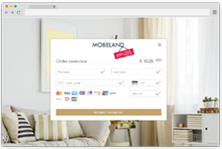
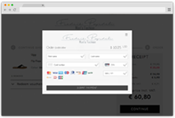
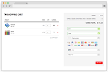

[#PPv2]
=== Wirecard Payment Page v2

[discrete]
[#WPP_WhatIs]
==== What Is Wirecard Payment Page v2?

Wirecard Payment Page v2 (WPP) is an online checkout solution which
combines a highly customizable user interface with payment processing
for various payment methods.

WPP allows merchants to customize the visual representation of their
payment page while keeping an optimal payment flow. WPP is designed
to streamline integration so merchants can accept payments quickly.
Additionally, Wirecard hosts all sensitive data so merchants can focus
on their business instead of worrying about data security and PCI.

Merchants can easily modify the design of WPP through Payment Page
Designer, an intuitive web interface for customizing nearly every visual
element the consumer would see. As an added benefit, using Designer
requires no graphical design experience or coding - new payment pages
can be created in minutes!

[discrete]
[#WPP_Modes]
==== Payment Page Modes

[cols="3,2,3,2,3,2"]
[grid="none"]
[frame="none"]
[stripes="none"]
|===
2+s|Hosted
2+s|Embedded
2+s|Seamless
2+|<<PaymentPageSolutions_WPP_HPP, >>
2+|<<PaymentPageSolutions_WPP_EPP, >>
2+|<<WPP_Seamless, >>
2+|A standalone payment page hosted independently from your checkout page.
2+|A payment form rendered over your checkout page as a modal window.
2+|A card form seamlessly integrated into your checkout form.
|{set:cellbgcolor:red}<<PaymentPageSolutions_WPP_HPP, [white]#Read more >#>>
|{set:cellbgcolor:white}
|{set:cellbgcolor:red}<<PaymentPageSolutions_WPP_EPP, [white]#Read more >#>>
|{set:cellbgcolor:white}
|{set:cellbgcolor:red}<<WPP_Seamless, [white]#Read more >#>>
|{set:cellbgcolor:white}
|===

[discrete]
[#WPP_WhatDoes]
==== What Does It Do?

WPP provides an appealing user interface for Wirecard Payment Gateway
(WPG), enhancing the user experience of paying customers. Payments are
created through backend payment sessions which supply a live URL to the
payment page.

Customers are redirected to this URL where they submit the payment and
WPP handles the processing automatically, for the benefit of both the
merchant & customer.

[discrete]
[#WPP_WhoIs]
==== Who Is This Documentation for?

This documentation is primarily for developers integrating WPP into an
online shop. Each variation of WPP has a short introduction, and a more
extensive overview of integration procedures and code.

A basic understanding of REST API services, JavaScript and HTML is
assumed.

[discrete]
[#WPP_SupportedPaymentMethods]
==== Which Payment Methods Are Supported?

Merchants can accept Credit Card payments from all the major card
schemes and various local providers as well as many alternative payment methods.
See the list of all supported payment methods below:

* <<PPv2_CC, Credit Card with WPP>>
* <<WPP_AlipayCrossborder, Alipay Cross-border with WPP>>
* <<WPP_Bancontact, Bancontact with WPP>>
* <<WPP_eps, eps with WPP>>
* <<WPP_ideal, iDEAL with WPP>>
* <<WPP_paybox, paybox with WPP>>
* <<PPv2_paydirekt, paydirekt with WPP>>
* <<PPv2_paylib, Paylib with WPP>>
* <<WPP_PayPal, PayPal with WPP>>
* <<WPP_paysafecard, paysafecard with WPP>>
* <<WPP_P24, Przelewy24 with WPP>>
* <<WPP_SEPADirectDebit, SEPA Direct Debit with WPP>>
* <<WPP_Sofort, Sofort. with WPP>>

//-
