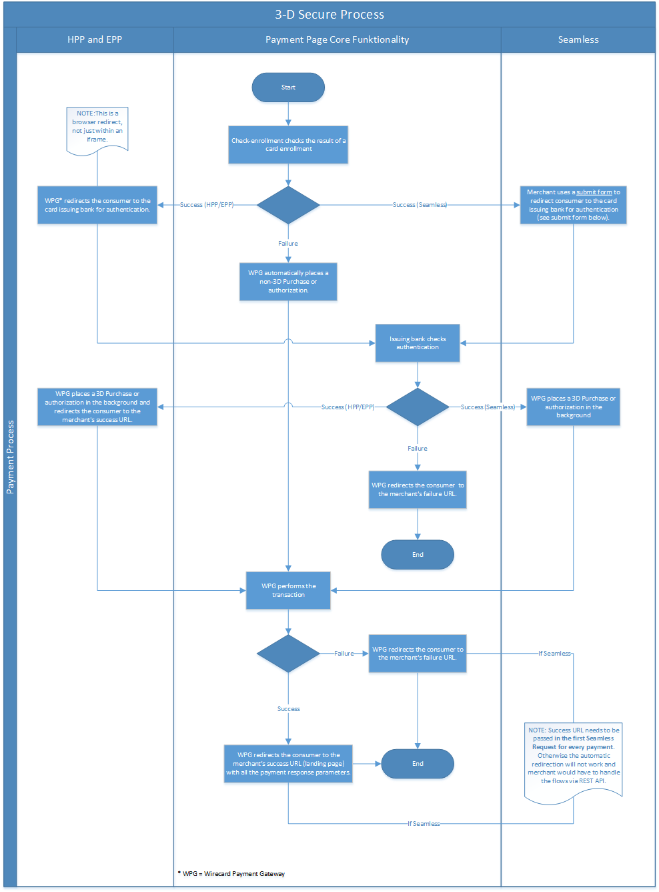

[#PP_3DSecure]
==== 3-D Secure for HPP/EPP and Seamless

3-D Secure payment can be processed via all the three Payment Page
integrations: HPP, EPP or Seamless. The main benefit is a simple credit
card payment request. The payment page automatically performs all
necessary steps to check 3-D enrollment of the card, redirects to the
cardholder’s bank and processes a response.

*3-D Secure 2 is now also available* and set to become the prime
authentication method for online card payments, thanks to a number of
updates that improve not only the security, but also the consumer
experience of 3-D Secure 1 (3DS).

The workflow remains the same but <<PP_3DSecure_2_Fields, *3-D Secure 2 requires additional fields*>>.

[#PP_3DSecure_Preconditions]
===== Preconditions

In order to process card payments with a 3-D Secure verification,
following *two preconditions* must be met:

.. The initial payment request needs to contain ``attempt_three_d`` attribute set to
``true``.
+
[%autowidth]
|===
| Field            | Required | Datatype | Value      | Description

| attempt_three_d  | Optional | Boolean  | true/false | Indicates that the Transaction Request should proceed with the 3D Secure workflow if the
                                                   [Card Holder] is enrolled. Otherwise, the transaction proceeds without 3D Secure.
|===
+
.Sample Request
[source,html]
----
<!DOCTYPE html PUBLIC "-//W3C//DTD HTML 4.01 Transitional//EN">
<html>
  <head>
    <title>
      Demo shop
    </title>
    
  </head>
  <body>
    <form>
      <input id="wirecard_pay_btn" type="button" onclick="pay()" value="Pay Now">
       
    </form>
  </body>
</html>
----
+
.. The *merchant account needs to have 3-D Secure transactions enabled* (<<ContactUs, contact Merchant Support for queries>>).

//-
---

[#PP_3DSecure_2_Fields]
===== 3-D Secure 2 - Additional Request Fields

To create a payment session with *Credit Card using 3-D Secure 2 authentication*, you need to *include additional 3-D Secure 2 fields in your initial request.*

Most of these fields are optional but we recommend the implementation of
optional fields, as this creates a smoother user experience and ensures
a higher level of security.

Need more information on 3-D Secure 2? Head to our <<CreditCard_3DS2, general introduction to 3-D Secure 2>>.

[%autowidth,cols="e,,,,"]
|===
| Field                            | Cardinality  | Datatype           | Size   | Description

| authentication_method            | Optional     | String             |        | Mechanism used by the cardholder to authenticate to the 3DS Requestor.

                                                                                  Possible values: ``01``, ``02``, ``03``, ``04``, ``05``, ``06``

                                                                                  ``01`` = No 3DS Requestor authentication occurred (i.e. cardholder “logged in” as guest). +
                                                                                  ``02`` = Login to the cardholder account at the 3DS Requestor system using 3DS Requestor’s own credentials. +
                                                                                  ``03`` = Login to the cardholder account at the 3DS Requestor system using federated ID. +
                                                                                  ``04`` = Login to the cardholder account at the 3DS Requestor system using issuer credentials. +
                                                                                  ``05`` = Login to the cardholder account at the 3DS Requestor system using third-party authentication. +
                                                                                  ``06`` = Login to the cardholder account at the 3DS Requestor system using FIDO Authenticator.
| authentication_timestamp         | Optional     | YYYY-MM-DDThh:mm:ss |       | Date and time in UTC of the cardholder authentication.
                                                                                  Format: YYYY-MM-DDThh:mm:ss (ISO).

| challenge_indicator              | Optional     | String              |       | Indicates whether a challenge is requested for this transaction.

                                                                                  Possible values: ``01``, ``02``, ``03``, ``04``

                                                                                  ``01`` = No preference. +
                                                                                  ``02`` = No challenge requested. +
                                                                                  ``03`` = Challenge requested: 3DS Requestor Preference. +
                                                                                  ``04`` = Challenge requested: Mandate.
| account_creation_date            | Optional     | Date                |       | Date that the cardholder opened the account with the 3DS Requestor.
| account_update_date              | Optional     | Date                |       | Date that the cardholder’s account with the 3DS Requestor was last changed. Including Billing or
                                                                                  Shipping address, new payment account, or new user(s) added.
| account_password_change_date     | Optional     | Date                |       | Date that cardholder’s account with the 3DS Requestor had a password change or account reset.
| shipping_address_first_use       | Optional     | Date                |       | Date when the shipping address used for this transaction was first used with the 3DS Requestor.
| transactions_last_day            | Optional     | Numeric             |       | Number of transactions (successful and abandoned) for this cardholder account with the 3DS
                                                                                  Requestor across all payment accounts in the previous 24 hours.
| transactions_last_year           | Optional     | Numeric             |       | Number of transactions (successful and abandoned) for this cardholder account with the 3DS
                                                                                  Requestor across all payment accounts in the previous year.
| card_transactions_last_day       | Optional     | Numeric             |       | Number of Add Card attempts in the last 24 hours.
| purchases_last_six_months        | Optional     | Numeric             |       | Number of purchases with this cardholder account during the previous six months.
| suspicious_activity              | Optional     | Boolean             |       | Indicates whether the 3DS Requestor has experienced suspicious activity (including previous fraud)
                                                                                  on the cardholder account.
| card_creation_date               | Optional     | Date                |       | Date that the payment account was enrolled in the cardholder’s account with the 3DS Requestor.
| street3                          | Conditional  | String              | 50    | Third line of the street address or equivalent local portion of the
                                                                                  cardholder's billing address associated with the card use for this purchase. +
                                                                                  This field is limited to maximum 50 characters. +
                                                                                  This field is required unless market or regional mandate restricts sending this information.
| home_phone_country_part          | Conditional  | String              | 3     | Country Code of the home phone provided by the cardholder. +
                                                                                  This field is required if available, unless market or regional mandate
                                                                                  restricts sending this information.
| home_phone_other_part            | Conditional  | String              | 15    | Subscriber section of the home phone provided by the cardholder.
| mobile_phone_country_part        | Conditional  | String              | 3     | Country Code of the mobile phone provided by the cardholder. +
                                                                                  This field is required if available, unless market or regional mandate
                                                                                  restricts sending this information.
| mobile_phone_other_part          | Conditional  | String              | 15    | Subscriber section of the mobile phone provided by the cardholder. +
                                                                                  This field is required if available, unless market or regional mandate
                                                                                  restricts sending this information.
| work_phone_country_part          | Conditional  | String              | 3     | Country Code of the work phone provided by the cardholder. +
                                                                                  This field is required if available, unless market or regional mandate
                                                                                  restricts sending this information.
| work_phone_other_part            | Conditional  | String              | 15    | Subscriber section of the work phone provided by the cardholder. +
                                                                                  This field is required if available, unless market or regional mandate
                                                                                  restricts sending this information.
| shipping_shipping_method         | Optional     | String              |       | Indicates shipping method chosen for the transaction. Merchants must
                                                                                  choose the Shipping Indicator code that most accurately describes the
                                                                                  cardholder's specific transaction. If one or more items are included in
                                                                                  the sale, use the Shipping Indicator code for the physical goods, or if
                                                                                  all digital goods, use the code that describes the most expensive item.

                                                                                  Accepted values are: ``01``, ``02``, ``03``, ``04``, ``05``, ``06``, ``07``

                                                                                  ``01`` = Ship to cardholder’s billing address. +
                                                                                  ``02`` = Ship to another verified address on file with merchant. +
                                                                                  ``03`` = Ship to address that is different than the cardholder's billing address. +
                                                                                  ``04`` = “Ship to Store” / Pick-up at local store (Store address shall be populated in shipping address fields). +
                                                                                  ``05`` = Digital goods (includes online services, electronic gift cards and redemption codes). +
                                                                                  ``06`` = Travel and Event tickets, not shipped. +
                                                                                  ``07`` = Other (for example, Gaming, digital services not shipped, e-media subscriptions, etc.).
| shipping_street3                 | Optional     | String             | 50     | Third line of the street address or equivalent local portion of the shipping address associated
                                                                                  with the card use for this purchase. +
                                                                                  This field is required unless shipping information is the same as
                                                                                  billing information, or market or regional mandate restricts sending this information.
| risk_info_delivery_timeframe     | Optional     | String             |        | Indicates the merchandise delivery time frame.

                                                                                  Accepted values are: ``01``, ``02``, ``03``, ``04``

                                                                                  ``01`` = Electronic Delivery. +
                                                                                  ``02`` = Same day shipping. +
                                                                                  ``03`` = Overnight shipping. +
                                                                                  ``04`` = Two-day or more shipping.
| risk_info_delivery_mail          | Optional     | String             | 254    | For electronic delivery, the email address to which the merchandise was delivered.
| risk_info_reorder_items          | Optional     | String             |        | Indicates whether the cardholder is reordering previously purchased merchandise.

                                                                                  Accepted values are: ``01``, ``02``

                                                                                  ``01`` = First time ordered. +
                                                                                  ``02`` = Reordered.
| risk_info_availability           | Optional     | String             |        | Indicates whether cardholder is placing an order for merchandise with a
                                                                                  future availability or release date.

                                                                                  Accepted values are: ``01``, ``02``

                                                                                  ``01`` = Merchandise available. +
                                                                                  ``02`` = Future availability.
| risk_info_preorder_date          | Optional     | Date               |        | For a pre-ordered purchase,
                                                                                  the expected date that the merchandise will be available.
| risk_info_gift_amount            | Optional     | Numeric            |        | For prepaid or gift card purchase, the purchase amount total of prepaid or gift card(s) in major
                                                                                  units (for example, USD 123.45 is 123).
| risk_info_gift_amount_currency   | Optional     | String             | 3      | For prepaid or gift card purchase, the currency code of the card as defined in ISO 4217
                                                                                  except ``955`` - ``964`` and ``999``.
| risk_info_gift_card_count        | Optional     | Numeric            |        | For prepaid or gift card purchase, total count of individual prepaid or gift
                                                                                  cards/codes purchased. Field is limited to 2 characters.
| recurring_expire_date            | Optional     | Date               |        | Date after which no further authorizations shall be performed.
| recurring_frequency              | Optional     | Numeric            | 4      | Indicates the minimum number of days between authorizations.
| iso_transaction_type             | Optional     | String             |        | Identifies the type of transaction being authenticated. The values are derived from ISO 8583.

                                                                                  Accepted values are: ``01``, ``03``, ``10``, ``11``, ``28``

                                                                                  ``01`` = Goods/ Service Purchase. +
                                                                                  ``03`` = Check Acceptance. +
                                                                                  ``10`` = Account Funding. +
                                                                                  ``11`` = Quasi-Cash Transaction. +
                                                                                  ``28`` = Prepaid Activation and Load.
|===

[#PP_3DSecure_Workflow]
===== The 3D Secure Workflow of the Payment Page

The workflow of 3D secure behaves almost identical for HPP, EPP and
Seamless.

Two differences can be observed. One after a successful check of a card
enrollment and another one after a successful authentication check.

See workflow graphic for details.

[#PP_3DSecure_Workflow_Graphic]
.Workflow Graphic

.Submit Form for Redirect
[source,html]
----
<form action="{acs_URL}" method="post" enctype="application/x-www-form-urlencoded" id="acsform">
    <input type="hidden" name="PaReq" value="{pareq}"/>
    <input type="hidden" name="TermUrl" value="https://api-test.wirecard.com/engine/rest/hpp/acs/{transaction_id}/"/>
    <input type="hidden" name="MD" value="merchant_account_id={MAID}&transaction_type=purchase&nonce3d={nonce3d}"/>
</form>
----
NOTE: Values in curly brackets {} are variables which you need to replace with the values of the response.
