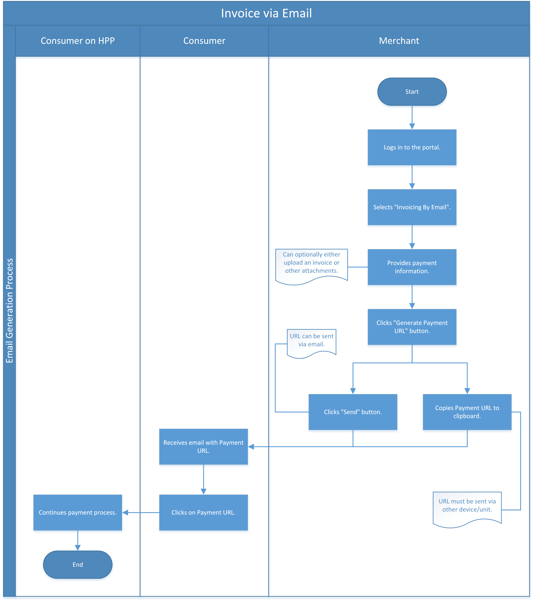

[#PP_PaymentSolutions]
==== Payment Solutions

[#PPv1_PaymentSolutions_PaybyLink]
===== Pay by Link

Merchants can offer payment on Hosted Payment Page (HPP) using a <<PPv1_PaymentSolutions_InvoiceviaEmail, hyperlink from their own newsletter or simply an email>>.
The hyperlink redirects the consumer to a credit card
form within HPP in order to supply consumer's card data. Additionally,
the merchant can accept MOTO (Mail Order/Telephone Order) payments and
remain PCI SAQ-A compliant. Pay by Link can also be used with the
<<PPv2_Features_PaybyLink, {payment-page-v2-abbr}>> integration.

[#PPV1_PaymentSolutions_PaybyLink_Hyperlink]
====== Hyperlink Expiration Timestamp

Merchant can offer payment on Hosted Payment Page (HPP) which has been
provided by hyperlink functionality for custom limited time by sending
``hyperlink_expiration_time_stamp`` in request. Timestamp is in ISO 8601
format consisting of combined date and time in UTC:
YY-MM-DDTHH:MM:SS±HH:MM.

[#PPv1_PaymentSolutions_PaybyLink_Hyperlink_HowTo]
.How-To

For XML and JSON Requests:

In order to generate payment link, send credit card payment request to
REST API, specifically ``paymentmethods`` endpoint without entering card
information. If request does not include all necessary parameters to
execute the payment, URL to HPP card form is returned in the response.
If request contains also optional ``hyperlink-expiration-time-stamp``
field, hyperlink will be valid until provided timestamp instead of
default value of 30 minutes.

For XML and JSON Responses:

The response contains the actual path stored at ``<payment-method url>``
which renders card payment form. This path needs to be copied to
customer.

.XML authorization Request (Successful)
[source,xml]
----
<?xml version="1.0" encoding="UTF-8" standalone="yes"?>
<payment xmlns="http://www.elastic-payments.com/schema/payment">
    <merchant-account-id>9105bb4f-ae68-4768-9c3b-3eda968f57ea</merchant-account-id>
    <request-id>3317a94b-c31a-a88d-4d03-ee5009f6cd44</request-id>
    <transaction-type>authorization</transaction-type>
    <payment-methods>
        <payment-method name="creditcard"/>
    </payment-methods>
    <requested-amount currency="EUR">10.15</requested-amount>
    <account-holder>
        <first-name>John</first-name>
        <last-name>Doe</last-name>
        <email>john.doe@test.com</email>
        <phone>5555555555</phone>
        <address>
          <street1>123 anystreet</street1>
          <city>Brantford</city>
          <state>ON</state>
          <country>CA</country>
          <postal-code>M4P1E8</postal-code>
        </address>
    </account-holder>
    <hyperlink-expiration-time-stamp>2018-12-07T13:20:00+02:00</hyperlink-expiration-time-stamp><!-- optional -->
</payment>
----

.XML authorization Response (Successful)
[source,xml]
----
<?xml version="1.0" encoding="UTF-8" standalone="yes"?>
<payment xmlns="http://www.elastic-payments.com/schema/payment" xmlns:ns2="http://www.elastic-payments.com/schema/epa/transaction">
    <merchant-account-id>9105bb4f-ae68-4768-9c3b-3eda968f57ea</merchant-account-id>
    <transaction-id>293d85c9-95ce-47f1-b82c-e4a8602e024f</transaction-id>
    <request-id>3317a94b-c31a-a88d-4d03-ee5009f6cd44</request-id>
    <transaction-type>authorization</transaction-type>
    <transaction-state>success</transaction-state>
    <completion-time-stamp>2018-11-19T11:50:36.000Z</completion-time-stamp>
    <statuses>
        <status code="201.0000" description="The resource was successfully created." severity="information"/>
    </statuses>
    <requested-amount currency="EUR">10.15</requested-amount>
    <account-holder>
        <first-name>John</first-name>
        <last-name>Doe</last-name>
        <email>john.doe@test.com</email>
        <phone>5555555555</phone>
        <address>
            <street1>123 anystreet</street1>
            <city>Brantford</city>
            <state>ON</state>
            <country>CA</country>
            <postal-code>M4P1E8</postal-code>
        </address>
    </account-holder>
    <payment-methods>
        <payment-method url="https://{test-instance-hostname}:443/engine/hpp/creditcard/293d85c9-95ce-47f1-b82c-e4a8602e024f/?request_time_stamp=20181119115036&amp;request_id=3317a94b-c31a-a88d-4d03-ee5009f6cd44&amp;merchant_account_id=9105bb4f-ae68-4768-9c3b-3eda968f57ea&amp;transaction_id=293d85c9-95ce-47f1-b82c-e4a8602e024f&amp;transaction_type=authorization&amp;requested_amount=10.15&amp;requested_amount_currency=EUR&amp;redirect_url=&amp;ip_address=&amp;request_signature=70a697bd993dc381cbea1b5263b55154cf7ec8872b4ed8d6bfcc9820fdd0f194&amp;psp_name=elastic-payments&amp;hyperlink_expiration_time_stamp=20181207112000&amp;country=CA" name="creditcard">
            <card-types>
                <card-type>jcb</card-type>
                <card-type>discover</card-type>
                <card-type>mastercard</card-type>
                <card-type>visa</card-type>
                <card-type>maestro</card-type>
                <card-type>amex</card-type>
                <card-type>diners</card-type>
                <card-type>upi</card-type>
            </card-types>
        </payment-method>
    </payment-methods>
    <hyperlink-expiration-time-stamp>2018-12-07T13:20:00+02:00</hyperlink-expiration-time-stamp>
</payment>
----

.JSON authorization Request (Successful)
[source,json]
----
{
  "payment" : {
    "merchant-account-id" : {
      "value" : "9105bb4f-ae68-4768-9c3b-3eda968f57ea"
    },
    "request-id" : "{{$guid}}",
    "transaction-type" : "authorization",
    "requested-amount" : {
      "value" : 10.15,
      "currency" : "EUR"
    },
    "payment-methods" : {
      "payment-method" : [ {
        "name" : "creditcard"
      } ]
    },
    "hyperlink-expiration-time-stamp" : "2017-05-05T01:00:00.000+03:00"
  }
}
----

.JSON authorization Response (Successful)
[source,json]
----
{
  "payment": {
    "statuses": {
      "status": [
        {
          "code": "201.0000",
          "description": "The resource was successfully created.",
          "severity": "information"
        }
      ]
    },
    "merchant-account-id": {
      "value": "9105bb4f-ae68-4768-9c3b-3eda968f57ea"
    },
    "transaction-id": "0430dd85-aa3f-45e7-85f5-d8dbfd370a80",
    "request-id": "1ce3fba5-5cfc-4b94-988a-3f6927055a03",
    "transaction-type": "authorization",
    "transaction-state": "success",
    "completion-time-stamp": 1493707087000,
    "requested-amount": {
      "value": 10.15,
      "currency": "EUR"
    },
    "payment-methods": {
      "payment-method": [
        {
          "card-types": {
            "card-type": [
              "hipercard",
              "amex",
              "uatp",
              "cartebleue",
              "diners",
              "aura",
              "maestro",
              "cup",
              "jcb",
              "discover",
              "visa",
              "mastercard"
            ]
          },
          "url": "https://i-elastic-int06.wirecard.sys:443/engine/hpp/creditcard/0430dd85-aa3f-45e7-85f5-d8dbfd370a80/?request_time_stamp=20170502063807&request_id=1ce3fba5-5cfc-4b94-988a-3f6927055a03&merchant_account_id=05fd7b10-2ccc-4e95-a790-ca9452153e37&transaction_id=0430dd85-aa3f-45e7-85f5-d8dbfd370a80&transaction_type=authorization&requested_amount=10.15&requested_amount_currency=EUR&redirect_url=&ip_address=&request_signature=d7e9ba9c032668299ba6ac7a03acbc192145bf9a4b4aa2e3ab14320e0cc20565&psp_name=elastic-payments&hyperlink_expiration_time_stamp=20170504220000&",
          "name": "creditcard"
        }
      ]
    },
    "hyperlink-expiration-time-stamp": 1493935200000
  }
}
----

[#PPv1_PaymentSolutions_PaybyLink_Limitations]
====== Limitations

. The payment hyperlink is valid until provided expiration timestamp.
If expiration timestamp is not provided, hyperlink is valid only 30
minutes, then the request ID expires.
. The payment hyperlink may be used only once.
. Merchant must generate own ``<request-id>`` as for every request.
. Redirect URL must be specified. If merchant hasn't been configured
on merchant level configuration, redirect URL must be sent via request.

//-

[#PPv1_PaymentSolutions_InvoiceviaEmail]
===== Invoice via Email

_Invoice via Email_ allows the merchant to send the consumer a generated
payment link automatically via email (or manually via other
devices/units of the merchant's choice).

[#PPv1_PaymentSolutions_InvoiceviaEmail_Workflow]
====== Workflow

. The merchant logs in to the portal.
. The merchant provides the required payment information.
. The merchant generates the URL.
. The merchant sends the URL to the consumer.

//-
