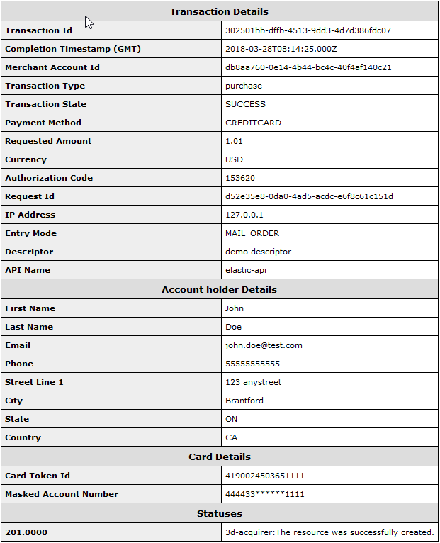

[#GeneralPlatformFeatures]
== General Platform Features

[#GeneralPlatformFeatures_CrossRef]
=== Cross-Referencing

[#GeneralPlatformFeatures_CrossMerchant]
==== Merchant Referencing

It is possible to enable cross payment account references for a merchant
in Wirecard Payment Gateway. It means a transaction from the merchant
account A can reference another one from the merchant account B if its
processing user has access rights also to the merchant account A. This
is a typical scenario for marketplace portals where a consumer can allow
to reuse his payment instrument for the further orders without the new
authentication process (so-called one-click-payment).

[#GeneralPlatformFeatures_CrossMerchant_Setup]
===== Merchant Setup

It is possible to reference a previous transaction using a different
merchant account.

[#GeneralPlatformFeatures_CrossMerchant_Setup_Precondition]
====== Precondition

The general rule is:

- The processing user used in the referencing transaction must have
access rights to the merchant account of the referenced transaction.
- The access rights to a particular merchant account for the given
processing user must be established on the ACL level.
//-

In order to enable the cross reference feature for a merchant account
the following global merchant parameter must be set to true:
*global.crossreference.enabled*

In order to see the cross referenced transactions in WEP, the WEP user
must also be granted to access the data of the referenced merchant
account. If this is not the case, the cross referenced transactions are
not shown inside the payment details list. i.e. the user cannot see the
transaction data of other merchants even if their transactions are
referencing the transactions of the others. This is a default setup
situation for a merchant WEP user.

The billing logic for the cross referenced transactions is unchanged.
The cross referenced transactions are billed for the corresponding
merchant account used in the payment request.

The merchant reconciliation report is unchanged as well. The cross
referenced transactions are reported inside the reconciliation file for
the corresponding merchant account.

[#GeneralPlatformFeatures_CrossMerchant_Samples]
===== Samples

[#GeneralPlatformFeatures_CrossMerchant_Samples_Initial]
====== Initial Transaction

NOTE: Note that the “periodic” attribute must be selected to mark which
transaction is the first and will be referenced later.

[#GeneralPlatformFeatures_CrossMerchant_Samples_Initial_Xml]
.XML get-url Request for i.e. "iDEAL"

[source,xml]
----
<?xml version="1.0" encoding="UTF-8" standalone="yes"?>
<payment xmlns="http://www.elastic-payments.com/schema/payment">
    <merchant-account-id>c7f1ba89-73ce-4237-9873-64295913ce7d</merchant-account-id>
    <request-id>2f3eb6ce-509c-4eb5-9f3f-527198e9ff75</request-id>
    <transaction-type>get-url</transaction-type>
    <payment-methods>
        <payment-method name="ideal"/>
    </payment-methods>
    <requested-amount currency="EUR">2.31</requested-amount>
    <order-description>test order</order-description>
    <descriptor>customerStatement 18009998888</descriptor>
    <bank-account>
        <bic>INGBNL2A</bic>
    </bank-account>
    <account-holder>
        <first-name>John</first-name>
        <last-name>Doe</last-name>
    </account-holder>
    <order-number>19317</order-number>
    <mandate>
        <mandate-id>manid</mandate-id>
        <signed-date>02-02-2015</signed-date>
    </mandate>
    <creditor-id>DE98ZZZ09999999999</creditor-id>
    <periodic>
        <periodic-type>installment</periodic-type>
        <sequence-type>first</sequence-type>
    </periodic>
</payment>
----

.XML get-url Response for i.e. "iDEAL"

[source,xml]
----
<?xml version="1.0" encoding="UTF-8" standalone="yes"?>
<payment xmlns="http://www.elastic-payments.com/schema/payment">
    <merchant-account-id>c7f1ba89-73ce-4237-9873-64295913ce7d</merchant-account-id>
    <transaction-id>713e3527-1a4b-11e5-b3a3-0050b65c678c</transaction-id>
    <request-id>2f3eb6ce-509c-4eb5-9f3f-527198e9ff75</request-id>
    <transaction-type>get-url</transaction-type>
    <transaction-state>success</transaction-state>
    <completion-time-stamp>2015-06-24T10:31:58.000+02:00</completion-time-stamp>
    <statuses>
        <status code="201.0000" description="The resource was successfully created." severity="information"/>
    </statuses>
    <requested-amount currency="EUR">2.31</requested-amount>
    <account-holder>
        <first-name>John</first-name>
        <last-name>Doe</last-name>
    </account-holder>
    <order-number>19317</order-number>
    <descriptor>customerStatement 18009998888</descriptor>
    <payment-methods>
        <payment-method url="https://idealtest.secure-ing.com/ideal/issuerSim.do?trxid=0050000101476386&amp;ideal=prob" name="ideal"/>
    </payment-methods>
    <bank-account>
        <bic>INGBNL2A</bic>
    </bank-account>
    <mandate>
        <mandate-id>manid</mandate-id>
        <signed-date>02-02-2015</signed-date>
    </mandate>
    <creditor-id>DE98ZZZ09999999999</creditor-id>
    <periodic>
        <periodic-type>installment</periodic-type>
        <sequence-type>first</sequence-type>
    </periodic>
</payment>
----

.XML Debit Notification for iDEAL

[source,xml]
----
<?xml version="1.0" encoding="UTF-8" standalone="yes"?>
<payment xmlns="http://www.elastic-payments.com/schema/payment">
    <merchant-account-id>c7f1ba89-73ce-4237-9873-64295913ce7d</merchant-account-id>
    <transaction-id>739faf84-1a4b-11e5-b3a3-0050b65c678c</transaction-id>
    <request-id>2f3eb6ce-509c-4eb5-9f3f-527198e9ff75</request-id>
    <transaction-type>debit</transaction-type>
    <transaction-state>success</transaction-state>
    <completion-time-stamp>2015-06-24T10:32:00.000+02:00</completion-time-stamp>
    <statuses>
        <status code="201.1126" description="ideal:Successful confirmation received from the bank." severity="information"/>
    </statuses>
    <requested-amount currency="EUR">2.31</requested-amount>
    <account-holder>
        <first-name>Hr</first-name>
        <last-name>E G H Küppers en/of MW M.J. Küpp</last-name>
    </account-holder>
    <order-number>19317</order-number>
    <descriptor>customerStatement 18009998888</descriptor>
    <payment-methods>
        <payment-method name="ideal"/>
    </payment-methods>
    <mandate>
        <mandate-id>manid</mandate-id>
        <signed-date>0007-08-08T00:00:00.000+01:00</signed-date>
    </mandate>
    <creditor-id>DE98ZZZ09999999999</creditor-id>
    <api-id>---</api-id>
    <periodic>
        <periodic-type>installment</periodic-type>
        <sequence-type>first</sequence-type>
    </periodic>
    <Signature xmlns="http://www.w3.org/2000/09/xmldsig#">
        <SignedInfo>
            <CanonicalizationMethod Algorithm="http://www.w3.org/TR/2001/REC-xml-c14n-20010315"/>
            <SignatureMethod Algorithm="http://www.w3.org/2000/09/xmldsig#rsa-sha1"/>
            <Reference URI="">
                <Transforms>
                    <Transform Algorithm="http://www.w3.org/2000/09/xmldsig#enveloped-signature"/>
                </Transforms>
                <DigestMethod Algorithm="http://www.w3.org/2000/09/xmldsig#sha1"/>
                <DigestValue>bZHaJgxjFpyO7VnpTwaTWa3ynM8=</DigestValue>
            </Reference>
        </SignedInfo>
        <SignatureValue>ZWOEjEbw1k4xfW85qTWSfaXFEPL4i1QuopVjmRctiZ844DYqninTi7qO6xRM4EbC3hBi5da2/yn1
EGBO6T3Z8FrlmQtOgoIV5iGBqWqDZMF+EB7UTwMXU+VQMNCzOLFBLgDacVCMHCuEvcWVKJO5y+SD
0abg8rOX1P/oaaLmHYSsFk7TC/s0BcGl7pb3VSW3KhOAIFx2t0FEEioE2+t7GUgVNPs8FlxnWHZ2
yQIFblEEMmFD5UrAmHJ/uUj8c4qmGgQ2EcdSSvUO8gy1LZisstQrN8GhwyvaimrSv/QKwvAAwTnO
+ms/TVEGoKuaKCZzxHPGquQFQ8pG5cdG+m/JjQ==</SignatureValue>
        <KeyInfo>
            <X509Data>
                <X509SubjectName>CN=Manoj Sahu,OU=Operations,O=Wirecard Elastic Payments,L=Toronto,ST=ON,C=CA</X509SubjectName>
                <X509Certificate>MIIDcDCCAligAwIBAgIETgQWGTANBgkqhkiG9w0BAQUFADB6MQswCQYDVQQGEwJDQTELMAkGA1UE
CBMCT04xEDAOBgNVBAcTB1Rvcm9udG8xIjAgBgNVBAoTGVdpcmVjYXJkIEVsYXN0aWMgUGF5bWVu
dHMxEzARBgNVBAsTCk9wZXJhdGlvbnMxEzARBgNVBAMTCk1hbm9qIFNhaHUwHhcNMTEwNjI0MDQ0
NDA5WhcNMTQwMzIwMDQ0NDA5WjB6MQswCQYDVQQGEwJDQTELMAkGA1UECBMCT04xEDAOBgNVBAcT
B1Rvcm9udG8xIjAgBgNVBAoTGVdpcmVjYXJkIEVsYXN0aWMgUGF5bWVudHMxEzARBgNVBAsTCk9w
ZXJhdGlvbnMxEzARBgNVBAMTCk1hbm9qIFNhaHUwggEiMA0GCSqGSIb3DQEBAQUAA4IBDwAwggEK
AoIBAQCc8rTt4N5fNeVzlsRgOXKDE2YUSfJx7xXBozFZ3Vh3XQyy3IpIuEfZz7004k4HeonfTxCN
etBvJ9rgNc0Cxrk/euMj3pOUrE9WYN2eAXC0r5pUIAZhIAnSxUSaIF3JKBxf7gDAik5d8RT5HaJV
4n5cXJQ/uhAEYU3EGN/74UrD2UsOYD3VBXTJS5VgSi/c3IyLwhDbYIyU6j4fMKyHIlAMGzW7VgKD
2pqu6BRysqUVdEEAvW2OmyVqGVyPkm87EiHSMMSar3CvYYxYqBN2KBUjabkvnRWbIzyQuyUyDeUb
QmhVQKL0WlMb5ev65m2VjGyDTGL5jfB14rSXRMGzeJ+LAgMBAAEwDQYJKoZIhvcNAQEFBQADggEB
ADgkuN/e2IFy7JXdbjNJbKBd3HLvFvK87dv8qQ+HK4qfCxYXh6aYhbKHJSA6C2pbOD3HBXoyovZr
mk/KqOyUL+unVcR+APjxX4KP25sdkplgmeQ47CWxtKAHZUTtWwAVI/WhsX89SSucBfIS5TJ54e7m
02qvGoK8UA/IRbIQ6DZ9hEKV5VQKiMx3ubwwHGXfOWz2fKmeZBuTeY+HiTEH8KCHpfw2j8G+dDgU
jlp9LvjVNmJzfNBBk1Si0d/rhXmMzVSKj08tp1sPRK0/sJtJZBzQajpnsZ9NFfoJNdG13AzYwDP3
x/QspK0jYn1KZw1qz524VWoQoueR8Xj30A2jntA=</X509Certificate>
            </X509Data>
        </KeyInfo>
    </Signature>
</payment>
----

[#GeneralPlatformFeatures_CrossMerchant_Samples_Initial_Json]
.JSON get-url Request for i.e. "iDEAL"

[source,json]
----
{
  "payment" : {
    "merchant-account-id" : {
      "value" : "c7f1ba89-73ce-4237-9873-64295913ce7d"
    },
    "request-id" : "2f3eb6ce-509c-4eb5-9f3f-527198e9ff75",
    "transaction-type" : "get-url",
    "requested-amount" : {
      "value" : 2.31,
      "currency" : "EUR"
    },
    "account-holder" : {
      "first-name" : "John",
      "last-name" : "Doe"
    },
    "order-number" : "19317",
    "descriptor" : "customerStatement 18009998888",
    "payment-methods" : {
      "payment-method" : [ {
        "name" : "ideal"
      } ]
    },
    "bank-account" : {
      "bic" : "INGBNL2A"
    },
    "mandate" : {
      "mandate-id" : "manid",
      "signed-date" : "02-02-2015"
    },
    "creditor-id" : "DE98ZZZ09999999999",
    "periodic" : {
      "periodic-type" : "installment",
      "sequence-type" : "first"
    }
  }
}
----

.JSON get-url Response for i.e. "iDEAL"

[source,json]
----
{
  "payment" : {
    "merchant-account-id" : {
      "value" : "c7f1ba89-73ce-4237-9873-64295913ce7d"
    },
    "transaction-id" : "713e3527-1a4b-11e5-b3a3-0050b65c678c",
    "request-id" : "2f3eb6ce-509c-4eb5-9f3f-527198e9ff75",
    "transaction-type" : "get-url",
    "transaction-state" : "success",
    "completion-time-stamp" : 1435134718000,
    "statuses" : {
      "status" : [ {
        "value" : "",
        "code" : "201.0000",
        "description" : "The resource was successfully created.",
        "severity" : "information"
      } ]
    },
    "requested-amount" : {
      "value" : 2.31,
      "currency" : "EUR"
    },
    "account-holder" : {
      "first-name" : "John",
      "last-name" : "Doe"
    },
    "order-number" : "19317",
    "descriptor" : "customerStatement 18009998888",
    "payment-methods" : {
      "payment-method" : [ {
        "url" : "https://idealtest.secure-ing.com/ideal/issuerSim.do?trxid=0050000101476386&ideal=prob",
        "name" : "ideal"
      } ]
    },
    "bank-account" : {
      "bic" : "INGBNL2A"
    },
    "mandate" : {
      "mandate-id" : "manid",
      "signed-date" : "02-02-2015"
    },
    "creditor-id" : "DE98ZZZ09999999999",
    "periodic" : {
      "periodic-type" : "installment",
      "sequence-type" : "first"
    }
  }
}
----

[#GeneralPlatformFeatures_CrossMerchant_Samples_Recurring]
====== Recurring Transaction

NOTE: This is a request for SEPA Credit where periodic type is “recurring”.
This means that this is a referencing payment. Please note that the
“parent-transaction-id” is the same as the one from the response of the
“first” (parent) transaction.

[#GeneralPlatformFeatures_CrossMerchant_Samples_Recurring_Xml]
.XML SEPA Credit Request Cross-Merchant Payment

[source,xml]
----
 <?xml version="1.0" encoding="UTF-8" standalone="yes"?>
<payment xmlns="http://www.elastic-payments.com/schema/payment">
    <merchant-account-id>e7c87536-2e7d-4cfc-abc8-9bb1d81907ca</merchant-account-id>
    <request-id>3864ca4a-eaac-4a65-968c-047676fd6101</request-id>
    <transaction-type>credit</transaction-type>
    <requested-amount currency="EUR">1.01</requested-amount>
    <account-holder>
        <first-name>John</first-name>
        <last-name>Doe</last-name>
    </account-holder>
    <payment-methods>
        <payment-method name="sepacredit"/>
    </payment-methods>
    <mandate>
        <mandate-id>mandid</mandate-id>
        <signed-date>2015-01-05</signed-date>
    </mandate>
    <creditor-id>XY98ZZZ09999999999</creditor-id>
    <consumer>
        <first-name/>
        <last-name/>
    </consumer>
    <periodic>
        <periodic-type>recurring</periodic-type>
        <sequence-type>recurring</sequence-type>
    </periodic>
    <parent-transaction-id>3aa87578-1a4c-11e5-b3a3-0050b65c678c</parent-transaction-id>
</payment>
----

.XML SEPA Credit Response Cross-Merchant Payment

[source,xml]
----
<?xml version="1.0" encoding="UTF-8" standalone="yes"?>
<payment xmlns="http://www.elastic-payments.com/schema/payment">
    <merchant-account-id>e7c87536-2e7d-4cfc-abc8-9bb1d81907ca</merchant-account-id>
    <transaction-id>3da64fb6-1a4c-11e5-b3a3-0050b65c678c</transaction-id>
    <request-id>3864ca4a-eaac-4a65-968c-047676fd6101</request-id>
    <transaction-type>credit</transaction-type>
    <transaction-state>success</transaction-state>
    <completion-time-stamp>2015-06-24T10:37:39.000+02:00</completion-time-stamp>
    <statuses>
        <status code="201.0000" description="The resource was successfully created." severity="information"/>
    </statuses>
    <requested-amount currency="EUR">1.01</requested-amount>
    <parent-transaction-id>3aa87578-1a4c-11e5-b3a3-0050b65c678c</parent-transaction-id>
    <account-holder>
        <first-name>John</first-name>
        <last-name>Doe</last-name>
    </account-holder>
    <order-number>28862</order-number>
    <descriptor>customerStatement 18009998888</descriptor>
    <payment-methods>
        <payment-method name="sepacredit"/>
    </payment-methods>
    <bank-account>
        <iban>NL53INGB0654422370</iban>
        <bic>INGBNL2A</bic>
    </bank-account>
    <mandate>
        <mandate-id>mandid</mandate-id>
        <signed-date>2015-01-05</signed-date>
    </mandate>
    <creditor-id>XY98ZZZ09999999999</creditor-id>
    <periodic>
        <periodic-type>recurring</periodic-type>
        <sequence-type>recurring</sequence-type>
    </periodic>
    <consumer>
        <first-name/>
        <last-name/>
    </consumer>
    <provider-transaction-reference-id>7BE65FA70E</provider-transaction-reference-id>
    <instrument-country>NL</instrument-country>
</payment>
----

.XML SEPA Credit Notification (Successful)

[source,xml]
----
<?xml version="1.0" encoding="UTF-8" standalone="yes"?>
<payment xmlns="http://www.elastic-payments.com/schema/payment">
    <merchant-account-id>e7c87536-2e7d-4cfc-abc8-9bb1d81907ca</merchant-account-id>
    <transaction-id>3ddf60d2-1a4c-11e5-b3a3-0050b65c678c</transaction-id>
    <request-id>3864ca4a-eaac-4a65-968c-047676fd6101</request-id>
    <transaction-type>credit</transaction-type>
    <transaction-state>success</transaction-state>
    <completion-time-stamp>2015-06-24T10:37:40.000+02:00</completion-time-stamp>
    <statuses>
        <status code="201.0000" description="bank:The resource was successfully created." provider-transaction-id="61ab74011ab6e13a797b00e47bf01106" severity="information"/>
    </statuses>
    <requested-amount currency="EUR">1.010000</requested-amount>
    <account-holder>
        <first-name>John</first-name>
        <last-name>Doe</last-name>
    </account-holder>
    <order-number>28862</order-number>
    <descriptor>customerStatement 18009998888</descriptor>
    <payment-methods>
        <payment-method name="sepacredit"/>
    </payment-methods>
    <mandate>
        <mandate-id>mandid</mandate-id>
        <signed-date>2015-01-05T00:00:00.000+01:00</signed-date>
    </mandate>
    <creditor-id>XY98ZZZ09999999999</creditor-id>
    <api-id>---</api-id>
    <periodic>
        <periodic-type>recurring</periodic-type>
        <sequence-type>recurring</sequence-type>
    </periodic>
    <provider-transaction-reference-id>7BE65FA70E</provider-transaction-reference-id>
    <instrument-country>NL</instrument-country>
    <Signature xmlns="http://www.w3.org/2000/09/xmldsig#">
        <SignedInfo>
            <CanonicalizationMethod Algorithm="http://www.w3.org/TR/2001/REC-xml-c14n-20010315"/>
            <SignatureMethod Algorithm="http://www.w3.org/2000/09/xmldsig#rsa-sha1"/>
            <Reference URI="">
                <Transforms>
                    <Transform Algorithm="http://www.w3.org/2000/09/xmldsig#enveloped-signature"/>
                </Transforms>
                <DigestMethod Algorithm="http://www.w3.org/2000/09/xmldsig#sha1"/>
                <DigestValue>aufM08TY4Xqa70knFRr93HXsy7I=</DigestValue>
            </Reference>
        </SignedInfo>
        <SignatureValue>cFkjLvNakh/1lg+0kBhgSYvWymv8+09iPHeidjXy/J2Z8xptwXj6429cC/qYJxqX7gRCXhVMPBRv
kw4dX0n+PsXGHkPcqdDR2O1UshtgxSMoqaiOU+aHrZAS0UORW/23iSXl4ww9yYknphDQknCCXAkl
E1suX6eX34tUi1WNf1IVchDm6Og5wi5m1y7YaV5H5VT+YFsbKf5/wn+RMpDol97R6gRk97gKA5rd
jIU4atMRtyGz3aOkv2Gxejnh8dvB6PXCieK2MrsocOjEyoOvN2ZN5dzhgbOlvBrwo+Jc8E74tWti
22d5HUDxH1SwTXVnOJHylwxZP7Nog1LfUvpzzg==</SignatureValue>
        <KeyInfo>
            <X509Data>
                <X509SubjectName>CN=Manoj Sahu,OU=Operations,O=Wirecard Elastic Payments,L=Toronto,ST=ON,C=CA</X509SubjectName>
                <X509Certificate>MIIDcDCCAligAwIBAgIETgQWGTANBgkqhkiG9w0BAQUFADB6MQswCQYDVQQGEwJDQTELMAkGA1UE
CBMCT04xEDAOBgNVBAcTB1Rvcm9udG8xIjAgBgNVBAoTGVdpcmVjYXJkIEVsYXN0aWMgUGF5bWVu
dHMxEzARBgNVBAsTCk9wZXJhdGlvbnMxEzARBgNVBAMTCk1hbm9qIFNhaHUwHhcNMTEwNjI0MDQ0
NDA5WhcNMTQwMzIwMDQ0NDA5WjB6MQswCQYDVQQGEwJDQTELMAkGA1UECBMCT04xEDAOBgNVBAcT
B1Rvcm9udG8xIjAgBgNVBAoTGVdpcmVjYXJkIEVsYXN0aWMgUGF5bWVudHMxEzARBgNVBAsTCk9w
ZXJhdGlvbnMxEzARBgNVBAMTCk1hbm9qIFNhaHUwggEiMA0GCSqGSIb3DQEBAQUAA4IBDwAwggEK
AoIBAQCc8rTt4N5fNeVzlsRgOXKDE2YUSfJx7xXBozFZ3Vh3XQyy3IpIuEfZz7004k4HeonfTxCN
etBvJ9rgNc0Cxrk/euMj3pOUrE9WYN2eAXC0r5pUIAZhIAnSxUSaIF3JKBxf7gDAik5d8RT5HaJV
4n5cXJQ/uhAEYU3EGN/74UrD2UsOYD3VBXTJS5VgSi/c3IyLwhDbYIyU6j4fMKyHIlAMGzW7VgKD
2pqu6BRysqUVdEEAvW2OmyVqGVyPkm87EiHSMMSar3CvYYxYqBN2KBUjabkvnRWbIzyQuyUyDeUb
QmhVQKL0WlMb5ev65m2VjGyDTGL5jfB14rSXRMGzeJ+LAgMBAAEwDQYJKoZIhvcNAQEFBQADggEB
ADgkuN/e2IFy7JXdbjNJbKBd3HLvFvK87dv8qQ+HK4qfCxYXh6aYhbKHJSA6C2pbOD3HBXoyovZr
mk/KqOyUL+unVcR+APjxX4KP25sdkplgmeQ47CWxtKAHZUTtWwAVI/WhsX89SSucBfIS5TJ54e7m
02qvGoK8UA/IRbIQ6DZ9hEKV5VQKiMx3ubwwHGXfOWz2fKmeZBuTeY+HiTEH8KCHpfw2j8G+dDgU
jlp9LvjVNmJzfNBBk1Si0d/rhXmMzVSKj08tp1sPRK0/sJtJZBzQajpnsZ9NFfoJNdG13AzYwDP3
x/QspK0jYn1KZw1qz524VWoQoueR8Xj30A2jntA=</X509Certificate>
            </X509Data>
        </KeyInfo>
    </Signature>
</payment>
----

[#GeneralPlatformFeatures_CrossMerchant_Samples_Recurring_Json]
.JSON SEPA Credit Request Cross-Merchant Payment

[source,json]
----
{
  "payment" : {
    "merchant-account-id" : {
      "value" : "e7c87536-2e7d-4cfc-abc8-9bb1d81907ca"
    },
    "request-id" : "3864ca4a-eaac-4a65-968c-047676fd6101",
    "transaction-type" : "credit",
    "requested-amount" : {
      "value" : 1.01,
      "currency" : "EUR"
    },
    "parent-transaction-id" : "3aa87578-1a4c-11e5-b3a3-0050b65c678c",
    "account-holder" : {
      "first-name" : "John",
      "last-name" : "Doe"
    },
    "payment-methods" : {
      "payment-method" : [ {
        "name" : "sepacredit"
      } ]
    },
    "mandate" : {
      "mandate-id" : "mandid",
      "signed-date" : "2015-01-05"
    },
    "creditor-id" : "XY98ZZZ09999999999",
    "periodic" : {
      "periodic-type" : "recurring",
      "sequence-type" : "recurring"
    },
    "consumer" : {
      "first-name" : "",
      "last-name" : ""
    }
  }
}
----

.JSON SEPA Credit Response Cross-Merchant Payment

[source,json]
----
{
  "payment" : {
    "merchant-account-id" : {
      "value" : "e7c87536-2e7d-4cfc-abc8-9bb1d81907ca"
    },
    "transaction-id" : "3da64fb6-1a4c-11e5-b3a3-0050b65c678c",
    "request-id" : "3864ca4a-eaac-4a65-968c-047676fd6101",
    "transaction-type" : "credit",
    "transaction-state" : "success",
    "completion-time-stamp" : 1435135059000,
    "statuses" : {
      "status" : [ {
        "value" : "",
        "code" : "201.0000",
        "description" : "The resource was successfully created.",
        "severity" : "information"
      } ]
    },
    "requested-amount" : {
      "value" : 1.01,
      "currency" : "EUR"
    },
    "parent-transaction-id" : "3aa87578-1a4c-11e5-b3a3-0050b65c678c",
    "account-holder" : {
      "first-name" : "John",
      "last-name" : "Doe"
    },
    "order-number" : "28862",
    "descriptor" : "customerStatement 18009998888",
    "payment-methods" : {
      "payment-method" : [ {
        "name" : "sepacredit"
      } ]
    },
    "bank-account" : {
      "iban" : "NL53INGB0654422370",
      "bic" : "INGBNL2A"
    },
    "mandate" : {
      "mandate-id" : "mandid",
      "signed-date" : "2015-01-05"
    },
    "creditor-id" : "XY98ZZZ09999999999",
    "periodic" : {
      "periodic-type" : "recurring",
      "sequence-type" : "recurring"
    },
    "consumer" : {
      "first-name" : "",
      "last-name" : ""
    },
    "provider-transaction-reference-id" : "7BE65FA70E",
    "instrument-country" : "NL"
  }
}
----
[#GeneralPlatformFeatures_CrossPayment]
==== Payment Methods

Cross-Payment-Methods Referencing helps to reduce fraud in recurring
payments, because the merchant can reference two payment methods. 

The initial transaction has to be performed with a method that requires
access credentials from the customer.

With the referencing of two payment methods the merchant can avoid that
a SEPA Direct Debit transaction, if used as initial
transaction, is returned after he has already provided the consumer with
the purchased goods or services.

The main reasons for returned SEPA Direct Debit transaction are:

- "Bank account not existing"
- "Invalid bank data"
//-

Cross-Payment-Methods Referencing is available, when the merchant has

- several online banking payment methods configured within MAID.
- installed Wirecard Payment Gateway backend and
Payment Page integrations.
//-

Cross-Payment-Methods Referencing is executed in two steps:

- The initial transaction is placed by the customer actively via one of
the supported online banking payment methods:
* Sofort.
* iDEAL
* giropay
* eps-Überweisung
//-

If the initial transaction is successful, the bank details IBAN and BIC
are saved in the database, but not returned in the response.

NOTE: Not every bank provides bank account data. _Wirecard Payment Gateway_
can only process bank account data if provided by the bank.

- The subsequent transaction is a SEPA Direct Debit transaction.
The merchant receives a transaction ID from the initial transaction
which is used later to place a referenced SEPA Direct Debit transaction
without knowing the bank account details as they are automatically
connected to the transaction ID.

This functionality allows e.g. easier subscription management.

[WARNING]
====
 - All mandatory SEPA Direct Debit transaction fields must be provided in
the initial transaction so that they can be used in the subsequent SEPA
Direct Debit transaction. Mandatory SEPA fields are:
* Mandate ID,
* Mandate Signature Date
* Creditor ID
- The initial transaction must have a sequence type "first" to avoid a
SEPA Direct Debit transaction with the sequence type “recurring” to
be rejected by the system.
- The subsequent transaction requires the sequence type "recurring".
====

A clear position for the "periodic" tag cannot be established. It can be
set either <<GeneralPlatformFeatures_CrossPayment_Samples_Initial, in the initial transaction>> iDEAL
or <<GeneralPlatformFeatures_CrossPayment_Samples_Subsequent, in the subsequent transaction>> within
the SEPA Direct Debit.

The advantages, setting it in the subsequent transaction are:

- Integration of original payment method (e.g. iDEAL, Sofort., …) does
not need to be amended.
- If you are using SEPA as an additional payment option, the behavior
where to send the periodic tags is identical.
//-

NOTE: API Endpoint for referenced transactions for alternative payment methods
is always:
\https://api-test.wirecard.com/engine/rest/payments

[#GeneralPlatformFeatures_CrossPayment_Samples]
===== Samples

[#GeneralPlatformFeatures_CrossPayment_Samples_Initial]
====== Periodic In Initial Transaction

This section describes a set of requests and responses in which the
"periodic" tag is set right in the beginning, in the _Request Initial iDEAL_.

[#GeneralPlatformFeatures_CrossPayment_Samples_Initial_Xml]
.XML get-url Request Initial iDEAL

[source,xml]
----
 <?xml version="1.0" encoding="UTF-8" standalone="yes"?>
<payment xmlns="http://www.elastic-payments.com/schema/payment">
    <merchant-account-id>36c1b68b-7a95-4f1b-bcdb-6b84bfbc5b41</merchant-account-id>
    <request-id>b2ddf106-0f00-41da-b8af-64429b3ee329</request-id>
    <transaction-type>get-url</transaction-type>
    <payment-methods>
        <payment-method name="ideal"/>
    </payment-methods>
    <requested-amount currency="EUR">2.31</requested-amount>
    <order-description>test order</order-description>
    <descriptor>customerStatement 18009998888</descriptor>
    <bank-account>
        <bic>INGBNL2A</bic>
    </bank-account>
    <account-holder>
        <first-name>John</first-name>
        <last-name>Doe</last-name>
    </account-holder>
    <order-number>43606</order-number>
    <mandate>
        <mandate-id>manid</mandate-id>
        <signed-date>2015-02-02</signed-date>
    </mandate>
    <creditor-id>DE98ZZZ09999999999</creditor-id>
    <periodic>
        <periodic-type>installment</periodic-type>
        <sequence-type>first</sequence-type>
    </periodic>
</payment>
----

.XML get-url Response Initial iDEAL

[source,xml]
----
<?xml version="1.0" encoding="UTF-8" standalone="yes"?>
<payment xmlns="http://www.elastic-payments.com/schema/payment">
    <merchant-account-id>36c1b68b-7a95-4f1b-bcdb-6b84bfbc5b41</merchant-account-id>
    <transaction-id>b8b27f18-4003-11e5-919b-005056a64448</transaction-id>
    <request-id>b2ddf106-0f00-41da-b8af-64429b3ee329</request-id>
    <transaction-type>get-url</transaction-type>
    <transaction-state>success</transaction-state>
    <completion-time-stamp>2015-08-11T07:07:08.000Z</completion-time-stamp>
    <statuses>
        <status code="201.0000" description="The resource was successfully created." severity="information"/>
    </statuses>
    <requested-amount currency="EUR">2.31</requested-amount>
    <account-holder>
        <first-name>John</first-name>
        <last-name>Doe</last-name>
    </account-holder>
    <order-number>43606</order-number>
    <descriptor>customerStatement 18009998888</descriptor>
    <payment-methods>
        <payment-method url="https://idealtest.secure-ing.com/ideal/issuerSim.do?trxid=0050000102513955&amp;ideal=prob" name="ideal"/>
    </payment-methods>
    <bank-account>
        <bic>INGBNL2A</bic>
    </bank-account>
    <mandate>
        <mandate-id>manid</mandate-id>
        <signed-date>2015-02-02</signed-date>
    </mandate>
    <creditor-id>DE98ZZZ09999999999</creditor-id>
    <periodic>
        <periodic-type>installment</periodic-type>
        <sequence-type>first</sequence-type>
    </periodic>
</payment>
----

.XML Debit Notification for Initial iDEAL

[source,xml]
----
<?xml version="1.0" encoding="UTF-8" standalone="yes"?>
<payment xmlns="http://www.elastic-payments.com/schema/payment">
    <merchant-account-id>36c1b68b-7a95-4f1b-bcdb-6b84bfbc5b41</merchant-account-id>
    <transaction-id>42d9e5e4-d3e8-4a1a-bc7a-7811648c5d38</transaction-id>
    <request-id>b2ddf106-0f00-41da-b8af-64429b3ee329</request-id>
    <transaction-type>debit</transaction-type>
    <transaction-state>success</transaction-state>
    <completion-time-stamp>2015-08-^1T10:32:00.000+02:00</completion-time-stamp>
    <statuses>
        <status code="201.1126" description="ideal:Successful confirmation received from the bank." severity="information"/>
    </statuses>
    <requested-amount currency="EUR">2.31</requested-amount>
    <account-holder>
        <first-name>John</first-name>
        <last-name>Doe</last-name>
    </account-holder>
    <order-number>43606</order-number>
    <descriptor>customerStatement 18009998888</descriptor>
    <payment-methods>
        <payment-method name="ideal"/>
    </payment-methods>
   <mandate>
        <mandate-id>manid</mandate-id>
        <signed-date>2015-02-02</signed-date>
    </mandate>
    <creditor-id>DE98ZZZ09999999999</creditor-id>
    <api-id>---</api-id>
    <periodic>
        <periodic-type>installment</periodic-type>
        <sequence-type>first</sequence-type>
    </periodic>
    <Signature xmlns="http://www.w3.org/2000/09/xmldsig#">
        <SignedInfo>
            <CanonicalizationMethod Algorithm="http://www.w3.org/TR/2001/REC-xml-c14n-20010315"/>
            <SignatureMethod Algorithm="http://www.w3.org/2000/09/xmldsig#rsa-sha1"/>
            <Reference URI="">
                <Transforms>
                    <Transform Algorithm="http://www.w3.org/2000/09/xmldsig#enveloped-signature"/>
                </Transforms>
                <DigestMethod Algorithm="http://www.w3.org/2000/09/xmldsig#sha1"/>
                <DigestValue>bZHaJgxjFpyO7VnpTwaTWa3ynM8=</DigestValue>
            </Reference>
        </SignedInfo>
        <SignatureValue>ZWOEjEbw1k4xfW85qTWSfaXFEPL4i1QuopVjmRctiZ844DYqninTi7qO6xRM4EbC3hBi5da2/yn1
EGBO6T3Z8FrlmQtOgoIV5iGBqWqDZMF+EB7UTwMXU+VQMNCzOLFBLgDacVCMHCuEvcWVKJO5y+SD
0abg8rOX1P/oaaLmHYSsFk7TC/s0BcGl7pb3VSW3KhOAIFx2t0FEEioE2+t7GUgVNPs8FlxnWHZ2
yQIFblEEMmFD5UrAmHJ/uUj8c4qmGgQ2EcdSSvUO8gy1LZisstQrN8GhwyvaimrSv/QKwvAAwTnO
+ms/TVEGoKuaKCZzxHPGquQFQ8pG5cdG+m/JjQ==</SignatureValue>
        <KeyInfo>
            <X509Data>
                <X509SubjectName>CN=Manoj Sahu,OU=Operations,O=Wirecard Elastic Payments,L=Toronto,ST=ON,C=CA</X509SubjectName>
                <X509Certificate>MIIDcDCCAligAwIBAgIETgQWGTANBgkqhkiG9w0BAQUFADB6MQswCQYDVQQGEwJDQTELMAkGA1UE
CBMCT04xEDAOBgNVBAcTB1Rvcm9udG8xIjAgBgNVBAoTGVdpcmVjYXJkIEVsYXN0aWMgUGF5bWVu
dHMxEzARBgNVBAsTCk9wZXJhdGlvbnMxEzARBgNVBAMTCk1hbm9qIFNhaHUwHhcNMTEwNjI0MDQ0
NDA5WhcNMTQwMzIwMDQ0NDA5WjB6MQswCQYDVQQGEwJDQTELMAkGA1UECBMCT04xEDAOBgNVBAcT
B1Rvcm9udG8xIjAgBgNVBAoTGVdpcmVjYXJkIEVsYXN0aWMgUGF5bWVudHMxEzARBgNVBAsTCk9w
ZXJhdGlvbnMxEzARBgNVBAMTCk1hbm9qIFNhaHUwggEiMA0GCSqGSIb3DQEBAQUAA4IBDwAwggEK
AoIBAQCc8rTt4N5fNeVzlsRgOXKDE2YUSfJx7xXBozFZ3Vh3XQyy3IpIuEfZz7004k4HeonfTxCN
etBvJ9rgNc0Cxrk/euMj3pOUrE9WYN2eAXC0r5pUIAZhIAnSxUSaIF3JKBxf7gDAik5d8RT5HaJV
4n5cXJQ/uhAEYU3EGN/74UrD2UsOYD3VBXTJS5VgSi/c3IyLwhDbYIyU6j4fMKyHIlAMGzW7VgKD
2pqu6BRysqUVdEEAvW2OmyVqGVyPkm87EiHSMMSar3CvYYxYqBN2KBUjabkvnRWbIzyQuyUyDeUb
QmhVQKL0WlMb5ev65m2VjGyDTGL5jfB14rSXRMGzeJ+LAgMBAAEwDQYJKoZIhvcNAQEFBQADggEB
ADgkuN/e2IFy7JXdbjNJbKBd3HLvFvK87dv8qQ+HK4qfCxYXh6aYhbKHJSA6C2pbOD3HBXoyovZr
mk/KqOyUL+unVcR+APjxX4KP25sdkplgmeQ47CWxtKAHZUTtWwAVI/WhsX89SSucBfIS5TJ54e7m
02qvGoK8UA/IRbIQ6DZ9hEKV5VQKiMx3ubwwHGXfOWz2fKmeZBuTeY+HiTEH8KCHpfw2j8G+dDgU
jlp9LvjVNmJzfNBBk1Si0d/rhXmMzVSKj08tp1sPRK0/sJtJZBzQajpnsZ9NFfoJNdG13AzYwDP3
x/QspK0jYn1KZw1qz524VWoQoueR8Xj30A2jntA=</X509Certificate>
            </X509Data>
        </KeyInfo>
    </Signature>
</payment>
----

[#GeneralPlatformFeatures_CrossPayment_Samples_Initial_Json]
.JSON get-url Request Initial iDEAL

[source,json]
----
{
  "payment" : {
    "merchant-account-id" : {
      "value" : "36c1b68b-7a95-4f1b-bcdb-6b84bfbc5b41"
    },
    "request-id" : "b2ddf106-0f00-41da-b8af-64429b3ee329",
    "transaction-type" : "get-url",
    "requested-amount" : {
      "value" : 2.31,
      "currency" : "EUR"
    },
    "account-holder" : {
      "first-name" : "John",
      "last-name" : "Doe"
    },
    "order-number" : "43606",
    "descriptor" : "customerStatement 18009998888",
    "payment-methods" : {
      "payment-method" : [ {
        "name" : "ideal"
      } ]
    },
    "bank-account" : {
      "bic" : "INGBNL2A"
    },
    "mandate" : {
      "mandate-id" : "manid",
      "signed-date" : "2015-02-02"
    },
    "creditor-id" : "DE98ZZZ09999999999",
    "periodic" : {
      "periodic-type" : "installment",
      "sequence-type" : "first"
    }
  }
}
----

.JSON get-url Response Initial iDEAL

[source,json]
----
{
  "payment" : {
    "merchant-account-id" : {
      "value" : "36c1b68b-7a95-4f1b-bcdb-6b84bfbc5b41"
    },
    "transaction-id" : "b8b27f18-4003-11e5-919b-005056a64448",
    "request-id" : "b2ddf106-0f00-41da-b8af-64429b3ee329",
    "transaction-type" : "get-url",
    "transaction-state" : "success",
    "completion-time-stamp" : 1439276828000,
    "statuses" : {
      "status" : [ {
        "value" : "",
        "code" : "201.0000",
        "description" : "The resource was successfully created.",
        "severity" : "information"
      } ]
    },
    "requested-amount" : {
      "value" : 2.31,
      "currency" : "EUR"
    },
    "account-holder" : {
      "first-name" : "John",
      "last-name" : "Doe"
    },
    "order-number" : "43606",
    "descriptor" : "customerStatement 18009998888",
    "payment-methods" : {
      "payment-method" : [ {
        "url" : "https://idealtest.secure-ing.com/ideal/issuerSim.do?trxid=0050000102513955&ideal=prob",
        "name" : "ideal"
      } ]
    },
    "bank-account" : {
      "bic" : "INGBNL2A"
    },
    "mandate" : {
      "mandate-id" : "manid",
      "signed-date" : "2015-02-02"
    },
    "creditor-id" : "DE98ZZZ09999999999",
    "periodic" : {
      "periodic-type" : "installment",
      "sequence-type" : "first"
    }
  }
}
----
[#GeneralPlatformFeatures_CrossPayment_Samples_Initial_RecurringIdeal]
====== Recurring Transaction Referencing iDEAL Payment

NOTE: Referenced SEPA payment does not contain mandatory fields in the
request as these are taken from the initial iDEAL payment based on
parent transaction ID.

[#GeneralPlatformFeatures_CrossPayment_Samples_Initial_RecurringIdeal_Xml]
.XML SEPA Direct Debit Request Following

[source,xml]
----
 <?xml version="1.0" encoding="UTF-8" standalone="yes"?>
<payment xmlns="http://www.elastic-payments.com/schema/payment">
    <merchant-account-id>36c1b68b-7a95-4f1b-bcdb-6b84bfbc5b41</merchant-account-id>
    <request-id>72ae0263-384f-41cc-8caa-aa78330afca3</request-id>
    <transaction-type>debit</transaction-type>
    <requested-amount currency="EUR">1.01</requested-amount>
    <account-holder>
        <first-name>John</first-name>
        <last-name>Doe</last-name>
    </account-holder>
    <payment-methods>
        <payment-method name="sepadirectdebit"/>
    </payment-methods>
    <consumer>
        <first-name/>
        <last-name/>
    </consumer>
    <periodic>
        <periodic-type>recurring</periodic-type>
        <sequence-type>recurring</sequence-type>
    </periodic>
    <parent-transaction-id>42d9e5e4-d3e8-4a1a-bc7a-7811648c5d38</parent-transaction-id>
</payment>
----

.XML SEPA Direct Debit Response Following (Successful)

[source,xml]
----
<?xml version="1.0" encoding="UTF-8" standalone="yes"?>
<payment xmlns="http://www.elastic-payments.com/schema/payment">
    <merchant-account-id>36c1b68b-7a95-4f1b-bcdb-6b84bfbc5b41</merchant-account-id>
    <transaction-id>bcd853f6-4003-11e5-919b-005056a64448</transaction-id>
    <request-id>72ae0263-384f-41cc-8caa-aa78330afca3</request-id>
    <transaction-type>debit</transaction-type>
    <transaction-state>success</transaction-state>
    <completion-time-stamp>2015-08-11T08:34:10.000Z</completion-time-stamp>
    <statuses>
        <status code="201.0000" description="The resource was successfully created." severity="information"/>
    </statuses>
    <requested-amount currency="EUR">1.01</requested-amount>
    <parent-transaction-id>b8b27f18-4003-11e5-919b-005056a64448</parent-transaction-id>
    <account-holder>
        <first-name>John</first-name>
        <last-name>Doe</last-name>
    </account-holder>
    <order-number>39849</order-number>
    <descriptor>customerStatement 18009998888</descriptor>
    <payment-methods>
        <payment-method name="sepadirectdebit"/>
    </payment-methods>
    <bank-account>
        <iban>NL53INGB0654422370</iban>
        <bic>INGBNL2A</bic>
    </bank-account>
    <mandate>
        <mandate-id>manid</mandate-id>
        <signed-date>2015-02-02</signed-date>
    </mandate>
    <creditor-id>DE98ZZZ09999999999</creditor-id>
    <due-date>2015-08-17</due-date>
    <periodic>
        <periodic-type>recurring</periodic-type>
        <sequence-type>recurring</sequence-type>
    </periodic>
    <consumer>
        <first-name/>
        <last-name/>
    </consumer>
    <provider-transaction-reference-id>261AD6D93C</provider-transaction-reference-id>
    <instrument-country>NL</instrument-country>
</payment>
----

[#GeneralPlatformFeatures_CrossPayment_Samples_Initial_RecurringIdeal_Json]
.JSON SEPA Direct Debit Request Following

[source,json]
----
{
  "payment" : {
    "merchant-account-id" : {
      "value" : "36c1b68b-7a95-4f1b-bcdb-6b84bfbc5b41"
    },
    "request-id" : "72ae0263-384f-41cc-8caa-aa78330afca3",
    "transaction-type" : "debit",
    "requested-amount" : {
      "value" : 1.01,
      "currency" : "EUR"
    },
    "parent-transaction-id" : "b8b27f18-4003-11e5-919b-005056a64448",
    "account-holder" : {
      "first-name" : "John",
      "last-name" : "Doe"
    },
    "payment-methods" : {
      "payment-method" : [ {
        "name" : "sepadirectdebit"
      } ]
    },
    "periodic" : {
      "periodic-type" : "recurring",
      "sequence-type" : "recurring"
    },
    "consumer" : {
      "first-name" : "",
      "last-name" : ""
    }
  }
}
----

.JSON SEPA Direct Debit Response Following (Successful)

[source,json]
----
{
  "payment" : {
    "merchant-account-id" : {
      "value" : "36c1b68b-7a95-4f1b-bcdb-6b84bfbc5b41"
    },
    "transaction-id" : "bcd853f6-4003-11e5-919b-005056a64448",
    "request-id" : "72ae0263-384f-41cc-8caa-aa78330afca3",
    "transaction-type" : "debit",
    "transaction-state" : "success",
    "completion-time-stamp" : 1439282050000,
    "statuses" : {
      "status" : [ {
        "value" : "",
        "code" : "201.0000",
        "description" : "The resource was successfully created.",
        "severity" : "information"
      } ]
    },
    "requested-amount" : {
      "value" : 1.01,
      "currency" : "EUR"
    },
    "parent-transaction-id" : "b8b27f18-4003-11e5-919b-005056a64448",
    "account-holder" : {
      "first-name" : "John",
      "last-name" : "Doe"
    },
    "order-number" : "39849",
    "descriptor" : "customerStatement 18009998888",
    "payment-methods" : {
      "payment-method" : [ {
        "name" : "sepadirectdebit"
      } ]
    },
    "bank-account" : {
      "iban" : "NL53INGB0654422370",
      "bic" : "INGBNL2A"
    },
    "mandate" : {
      "mandate-id" : "manid",
      "signed-date" : "2015-02-02"
    },
    "creditor-id" : "DE98ZZZ09999999999",
    "due-date" : "2015-08-17",
    "periodic" : {
      "periodic-type" : "recurring",
      "sequence-type" : "recurring"
    },
    "consumer" : {
      "first-name" : "",
      "last-name" : ""
    },
    "provider-transaction-reference-id" : "261AD6D93C",
    "instrument-country" : "NL"
  }
}
----

[#GeneralPlatformFeatures_CrossPayment_Samples_Initial_RecurringSepa]
====== Recurring Transaction Referencing SEPA Credit

NOTE: This scenario is for a cross-payment-methods referenced SEPA Credit
transaction.

[#GeneralPlatformFeatures_CrossPayment_Samples_Initial_RecurringSepa_Xml]
.XML SEPA Credit Request Following

[source,xml]
----
 <?xml version="1.0" encoding="UTF-8" standalone="yes"?>
<payment xmlns="http://www.elastic-payments.com/schema/payment">
    <merchant-account-id>36c1b68b-7a95-4f1b-bcdb-6b84bfbc5b41</merchant-account-id>
    <request-id>30ba2c27-d8bb-47d2-ac02-f1ccf94e162c</request-id>
    <transaction-type>credit</transaction-type>
    <requested-amount currency="EUR">1.01</requested-amount>
    <account-holder>
        <first-name>John</first-name>
        <last-name>Doe</last-name>
        <!-- optional
        <email>john.doe@test.com</email>
        <address>
            <street1>123 anystreet</street1>
            <city>Brantford</city>
            <country>CA</country>
        </address> -->
    </account-holder>
    <!-- optional
    <order-number></order-number> -->
    <!-- optional
    <descriptor>test</descriptor> -->
    <payment-methods>
        <payment-method name="sepacredit"/>
    </payment-methods>
    <!-- optional element consumer -->
    <consumer>
        <first-name/>
        <last-name/>
    </consumer>
    <periodic>
        <periodic-type>recurring</periodic-type>
        <sequence-type>recurring</sequence-type>
    </periodic>
    <parent-transaction-id>96468896-3ffb-11e5-919b-005056a64448</parent-transaction-id>
</payment>
----

.XML SEPA Credit Response Following

[source,xml]
----
 <?xml version="1.0" encoding="UTF-8" standalone="yes"?>
<payment xmlns="http://www.elastic-payments.com/schema/payment">
    <merchant-account-id>36c1b68b-7a95-4f1b-bcdb-6b84bfbc5b41</merchant-account-id>
    <transaction-id>b03c1d42-3ffb-11e5-919b-005056a64448</transaction-id>
    <request-id>30ba2c27-d8bb-47d2-ac02-f1ccf94e162c</request-id>
    <transaction-type>credit</transaction-type>
    <transaction-state>success</transaction-state>
    <completion-time-stamp>2015-08-11T07:36:33.000Z</completion-time-stamp>
    <statuses>
        <status code="201.0000" description="The resource was successfully created." severity="information"/>
    </statuses>
    <requested-amount currency="EUR">1.01</requested-amount>
    <parent-transaction-id>96468896-3ffb-11e5-919b-005056a64448</parent-transaction-id>
    <account-holder>
        <first-name>John</first-name>
        <last-name>Doe</last-name>
    </account-holder>
    <order-number>11153</order-number>
    <descriptor>customerStatement 18009998888</descriptor>
    <payment-methods>
        <payment-method name="sepacredit"/>
    </payment-methods>
    <bank-account>
        <iban>NL53INGB0654422370</iban>
        <bic>INGBNL2A</bic>
    </bank-account>
    <mandate>
        <mandate-id>manid</mandate-id>
        <signed-date>2015-02-02</signed-date>
    </mandate>
    <creditor-id>DE98ZZZ09999999999</creditor-id>
    <periodic>
        <periodic-type>recurring</periodic-type>
        <sequence-type>recurring</sequence-type>
    </periodic>
    <consumer>
        <first-name/>
        <last-name/>
    </consumer>
    <provider-transaction-reference-id>3E6B70E7B4</provider-transaction-reference-id>
    <instrument-country>NL</instrument-country>
</payment>
----

[#GeneralPlatformFeatures_CrossPayment_Samples_Initial_RecurringSepa_Json]
.JSON SEPA Credit Request Following

[source,json]
----
{
  "payment" : {
    "merchant-account-id" : {
      "value" : "36c1b68b-7a95-4f1b-bcdb-6b84bfbc5b41"
    },
    "request-id" : "30ba2c27-d8bb-47d2-ac02-f1ccf94e162c",
    "transaction-type" : "credit",
    "requested-amount" : {
      "value" : 1.01,
      "currency" : "EUR"
    },
    "parent-transaction-id" : "96468896-3ffb-11e5-919b-005056a64448",
    "account-holder" : {
      "first-name" : "John",
      "last-name" : "Doe"
    },
    "payment-methods" : {
      "payment-method" : [ {
        "name" : "sepacredit"
      } ]
    },
    "periodic" : {
      "periodic-type" : "recurring",
      "sequence-type" : "recurring"
    },
    "consumer" : {
      "first-name" : "",
      "last-name" : ""
    }
  }
}
----

.JSON SEPA Credit Response Following

[source,json]
----
{
  "payment" : {
    "merchant-account-id" : {
      "value" : "36c1b68b-7a95-4f1b-bcdb-6b84bfbc5b41"
    },
    "transaction-id" : "b03c1d42-3ffb-11e5-919b-005056a64448",
    "request-id" : "30ba2c27-d8bb-47d2-ac02-f1ccf94e162c",
    "transaction-type" : "credit",
    "transaction-state" : "success",
    "completion-time-stamp" : 1439278593000,
    "statuses" : {
      "status" : [ {
        "value" : "",
        "code" : "201.0000",
        "description" : "The resource was successfully created.",
        "severity" : "information"
      } ]
    },
    "requested-amount" : {
      "value" : 1.01,
      "currency" : "EUR"
    },
    "parent-transaction-id" : "96468896-3ffb-11e5-919b-005056a64448",
    "account-holder" : {
      "first-name" : "John",
      "last-name" : "Doe"
    },
    "order-number" : "11153",
    "descriptor" : "customerStatement 18009998888",
    "payment-methods" : {
      "payment-method" : [ {
        "name" : "sepacredit"
      } ]
    },
    "bank-account" : {
      "iban" : "NL53INGB0654422370",
      "bic" : "INGBNL2A"
    },
    "mandate" : {
      "mandate-id" : "manid",
      "signed-date" : "2015-02-02"
    },
    "creditor-id" : "DE98ZZZ09999999999",
    "periodic" : {
      "periodic-type" : "recurring",
      "sequence-type" : "recurring"
    },
    "consumer" : {
      "first-name" : "",
      "last-name" : ""
    },
    "provider-transaction-reference-id" : "3E6B70E7B4",
    "instrument-country" : "NL"
  }
}
----

[#GeneralPlatformFeatures_CrossPayment_Samples_Subsequent]
===== Periodic In Subsequent Transaction

This section describes a set of requests and responses in which the
"periodic" tag is set at a subsequent request, the _SEPA Debit Recurring_ #1.

[#GeneralPlatformFeatures_CrossPayment_Samples_Subsequent_Xml]
.XML debit Request Initial iDEAL

[source,xml]
----
<?xml version="1.0" encoding="utf-8" standalone="yes"?>
<payment xmlns="http://www.elastic-payments.com/schema/payment">
  <merchant-account-resolver-category>RULE_MERCHANTACCOUNTS</merchant-account-resolver-category>
  <request-id>{set unique request ID}</request-id>
  <transaction-type>debit</transaction-type>
  <requested-amount currency="EUR">112.00</requested-amount>
  <account-holder>
    <first-name>John</first-name>
    <last-name>Doe</last-name>
    <email>test@test.com</email>
    <phone />
    <address>
      <street1>Einsteinring 35</street1>
      <street2 />
      <city>Munich</city>
      <state>BY</state>
      <country>DE</country>
      <postal-code>85609</postal-code>
    </address>
  </account-holder>
  <notifications>
    <notification url="https://merchant.com/ipn.php"/>
  </notifications>
  <ip-address>128.0.000.0</ip-address>
  <order-number>Wirecard Test</order-number>
  <descriptor>descriptor test</descriptor>
  <payment-methods>
    <payment-method name="ideal" />
  </payment-methods>
  <bank-account>
    <bic>INGBNL2A</bic>
  </bank-account>
  <cancel-redirect-url>https://sandbox-engine.thesolution.com/shop/cancel.html</cancel-redirect-url>
  <success-redirect-url>https://sandbox-engine.thesolution.com/shop/success.html</success-redirect-url>
</payment> 
----

.XML debit Response Initial iDEAL

[source,xml]
----
<?xml version="1.0" encoding="UTF-8" standalone="yes"?>
<payment xmlns="http://www.elastic-payments.com/schema/payment" xmlns:ns2="http://www.elastic-payments.com/schema/epa/transaction">
  <merchant-account-id>adb45327-170a-460b-9810-9008e9772f5f</merchant-account-id>
  <transaction-id>063b54d7-0272-4b6e-ad13-f6f4c25c4759</transaction-id>
  <request-id>{unique ID from request}</request-id>
  <transaction-type>debit</transaction-type>
  <transaction-state>success</transaction-state>
  <completion-time-stamp>2017-02-23T09:01:03.000Z</completion-time-stamp>
  <statuses>
    <status code="201.0000" description="The resource was successfully created." severity="information" />
  </statuses>
  <requested-amount currency="EUR">112.00</requested-amount>
  <account-holder>
    <first-name>John</first-name>
    <last-name>Doe</last-name>
    <email>test@test.com</email>
    <phone>
    </phone>
    <address>
      <street1>Einsteinring 35</street1>
      <street2>
      </street2>
      <city>Munich</city>
      <state>BY</state>
      <country>DE</country>
      <postal-code>85609</postal-code>
    </address>
  </account-holder>
  <ip-address>128.0.000.0</ip-address>
  <order-number>Wirecard Test</order-number>
  <descriptor>descriptor test</descriptor>
  <notifications>
    <notification url="https://merchant.com/ipn.php"/>
    </notification>
  </notifications>
  <payment-methods>
    <payment-method url="https://idealtest.secure-ing.com/ideal/issuerSim.do?trxid=0050000126213329&amp;ideal=prob" name="ideal" />
  </payment-methods>
  <bank-account>
    <bic>INGBNL2A</bic>
  </bank-account>
  <cancel-redirect-url>https://sandbox-engine.thesolution.com/shop/cancel.html</cancel-redirect-url>
  <success-redirect-url>https://sandbox-engine.thesolution.com/shop/success.html</success-redirect-url>
</payment> 
----

NOTE: Receive Notification to get the transaction ID from the iDEAL debit to
use as reference for SEPA transactions.

.XML SEPA Credit Request

[source,xml]
----
<?xml version="1.0" encoding="UTF-8" standalone="yes"?>
<payment xmlns="http://www.elastic-payments.com/schema/payment">
  <merchant-account-id>ce7b6129-4ff1-42b9-8dcb-723149f5bbbe</merchant-account-id>
  <request-id>{set unique request ID}</request-id>
  <transaction-type>credit</transaction-type>
  <requested-amount currency="EUR">1.00</requested-amount>
  <notifications>
    <notification url="https://merchant.com/ipn.php"/>
  </notifications>
  <payment-methods>
    <payment-method name="sepacredit" />
  </payment-methods>
  <parent-transaction-id>0ceed077-fd9d-47d2-944d-af1488fd3ece</parent-transaction-id>
</payment> 
----

.XML SEPA Credit Response

[source,xml]
----
<?xml version="1.0" encoding="UTF-8" standalone="yes"?>
<payment xmlns="http://www.elastic-payments.com/schema/payment" xmlns:ns2="http://www.elastic-payments.com/schema/epa/transaction">
  <merchant-account-id>ce7b6129-4ff1-42b9-8dcb-723149f5bbbe</merchant-account-id>
  <transaction-id>edf03006-90f9-4daa-b903-ca6a98aab956</transaction-id>
  <request-id>{unique ID from request}</request-id>
  <transaction-type>credit</transaction-type>
  <transaction-state>success</transaction-state>
  <completion-time-stamp>2017-02-23T09:03:19.000Z</completion-time-stamp>
  <statuses>
    <status code="201.0000" description="The resource was successfully created." severity="information" />
  </statuses>
  <requested-amount currency="EUR">1.00</requested-amount>
  <parent-transaction-id>0ceed077-fd9d-47d2-944d-af1488fd3ece</parent-transaction-id>
  <account-holder>
    <first-name>Hr</first-name>
    <last-name>E G H Küppers en/of MW M.J. Küpp</last-name>
    <email>test@test.com</email>
    <phone>
    </phone>
    <address>
      <street1>Einsteinring 35</street1>
      <street2>
      </street2>
      <city>Munich</city>
      <state>BY</state>
      <country>DE</country>
      <postal-code>85609</postal-code>
    </address>
  </account-holder>
  <order-number>Wirecard Test</order-number>
  <descriptor>descriptor test</descriptor>
  <notifications>
    <notification url="https://merchant.com/ipn.php" />
  </notifications>
  <payment-methods>
    <payment-method name="sepacredit" />
  </payment-methods>
  <bank-account>
    <iban>NL53INGB0654422370</iban>
    <bic>INGBNL2A</bic>
  </bank-account>
  <api-id>---</api-id>
  <cancel-redirect-url>https://sandbox-engine.thesolution.com/shop/cancel.html</cancel-redirect-url>
  <success-redirect-url>https://sandbox-engine.thesolution.com/shop/success.html</success-redirect-url>
  <provider-transaction-reference-id>C6C38BB6AA</provider-transaction-reference-id>
</payment>
----

.XML SEPA Direct Debit Request Recurring #1

[source,xml]
----
<?xml version="1.0" encoding="UTF-8" standalone="yes"?>
<payment xmlns="http://www.elastic-payments.com/schema/payment">
  <merchant-account-id>ce7b6129-4ff1-42b9-8dcb-723149f5bbbe</merchant-account-id>
  <request-id>{set unique request ID}</request-id>
  <transaction-type>debit</transaction-type>
  <requested-amount currency="EUR">55.00</requested-amount>
  <account-holder>
    <first-name>John</first-name>
    <last-name>Doe</last-name>
  </account-holder>
  <payment-methods>
    <payment-method name="sepadirectdebit" />
  </payment-methods>
  <mandate>
    <mandate-id>mandid</mandate-id>
    <signed-date>2015-02-02</signed-date>
  </mandate>
  <creditor-id>DE98ZZZ09999999999</creditor-id>
  <consumer>
    <first-name>
    </first-name>
    <last-name>
    </last-name>
  </consumer>
  <notifications>
    <notification url="https://merchant.com/ipn.php"/>
  </notifications>
  <periodic>
    <periodic-type>recurring</periodic-type>
    <sequence-type>first</sequence-type>
  </periodic>
  <parent-transaction-id>0ceed077-fd9d-47d2-944d-af1488fd3ece</parent-transaction-id>
</payment>
----

.XML SEPA Direct Debit Response Recurring #1

[source,xml]
----
<?xml version="1.0" encoding="UTF-8" standalone="yes"?>
<payment xmlns="http://www.elastic-payments.com/schema/payment" xmlns:ns2="http://www.elastic-payments.com/schema/epa/transaction">
  <merchant-account-id>ce7b6129-4ff1-42b9-8dcb-723149f5bbbe</merchant-account-id>
  <transaction-id>aaf7d691-e83d-4907-b0d5-eaba18099a54</transaction-id>
  <request-id>{unique ID from request}</request-id>
  <transaction-type>debit</transaction-type>
  <transaction-state>success</transaction-state>
  <completion-time-stamp>2017-02-23T09:11:50.000Z</completion-time-stamp>
  <statuses>
    <status code="201.0000" description="The resource was successfully created." severity="information" />
  </statuses>
  <requested-amount currency="EUR">55.00</requested-amount>
  <parent-transaction-id>0ceed077-fd9d-47d2-944d-af1488fd3ece</parent-transaction-id>
  <account-holder>
    <first-name>John</first-name>
    <last-name>Doe</last-name>
    <address>
      <street1>Einsteinring 35</street1>
      <street2>
      </street2>
      <city>Munich</city>
      <state>BY</state>
      <country>DE</country>
      <postal-code>85609</postal-code>
    </address>
  </account-holder>
  <order-number>Wirecard Test</order-number>
  <descriptor>descriptor test</descriptor>
  <notifications>
    <notification url="https://merchant.com/ipn.php" />
  </notifications>
  <payment-methods>
    <payment-method name="sepadirectdebit" />
  </payment-methods>
  <bank-account>
    <iban>NL53INGB0654422370</iban>
    <bic>INGBNL2A</bic>
  </bank-account>
  <mandate>
    <mandate-id>mandid</mandate-id>
    <signed-date>2015-02-02</signed-date>
  </mandate>
  <creditor-id>DE98ZZZ09999999999</creditor-id>
  <api-id>---</api-id>
  <cancel-redirect-url>https://sandbox-engine.thesolution.com/shop/cancel.html</cancel-redirect-url>
  <success-redirect-url>https://sandbox-engine.thesolution.com/shop/success.html</success-redirect-url>
  <due-date>2017-03-06</due-date>
  <periodic>
    <periodic-type>recurring</periodic-type>
    <sequence-type>first</sequence-type>
  </periodic>
  <consumer>
    <first-name>
    </first-name>
    <last-name>
    </last-name>
  </consumer>
  <provider-transaction-reference-id>DA2DA22316</provider-transaction-reference-id>
</payment>
----

.XML SEPA Direct Debit Request Recurring #2

[source,xml]
----
<?xml version="1.0" encoding="UTF-8" standalone="yes"?>
<payment xmlns="http://www.elastic-payments.com/schema/payment">
  <merchant-account-id>ce7b6129-4ff1-42b9-8dcb-723149f5bbbe</merchant-account-id>
  <request-id>{set unique request ID}</request-id>
  <transaction-type>debit</transaction-type>
  <requested-amount currency="EUR">44.00</requested-amount>
  <account-holder>
    <first-name>John</first-name>
    <last-name>Doe</last-name>
  </account-holder>
  <payment-methods>
    <payment-method name="sepadirectdebit" />
  </payment-methods>
  <mandate>
    <mandate-id>mandid</mandate-id>
    <signed-date>2015-02-02</signed-date>
  </mandate>
  <creditor-id>DE98ZZZ09999999999</creditor-id>
  <consumer>
    <first-name>
    </first-name>
    <last-name>
    </last-name>
  </consumer>
  <notifications>
    <notification url="https://merchant.com/ipn.php"/>
  </notifications>
  <periodic>
    <periodic-type>recurring</periodic-type>
    <sequence-type>recurring</sequence-type>
  </periodic>
  <parent-transaction-id>aaf7d691-e83d-4907-b0d5-eaba18099a54</parent-transaction-id>
</payment>
----

.XML SEPA Direct Debit Response Recurring #2

[source,xml]
----
<?xml version="1.0" encoding="UTF-8" standalone="yes"?>
<payment xmlns="http://www.elastic-payments.com/schema/payment" xmlns:ns2="http://www.elastic-payments.com/schema/epa/transaction">
  <merchant-account-id>ce7b6129-4ff1-42b9-8dcb-723149f5bbbe</merchant-account-id>
  <transaction-id>adf766c1-3ac5-4ca8-8255-db47142e181e</transaction-id>
  <request-id>{unique ID from request}</request-id>
  <transaction-type>debit</transaction-type>
  <transaction-state>success</transaction-state>
  <completion-time-stamp>2017-02-23T09:15:27.000Z</completion-time-stamp>
  <statuses>
    <status code="201.0000" description="The resource was successfully created." severity="information" />
  </statuses>
  <requested-amount currency="EUR">44.00</requested-amount>
  <parent-transaction-id>aaf7d691-e83d-4907-b0d5-eaba18099a54</parent-transaction-id>
  <account-holder>
    <first-name>John</first-name>
    <last-name>Doe</last-name>
    <address>
      <street1>Einsteinring 35</street1>
      <street2>
      </street2>
      <city>Munich</city>
      <state>BY</state>
      <country>DE</country>
      <postal-code>85609</postal-code>
    </address>
  </account-holder>
  <order-number>Wirecard Test</order-number>
  <descriptor>descriptor test</descriptor>
  <notifications>
    <notification url="https://merchant.com/ipn.php" />
  </notifications>
  <payment-methods>
    <payment-method name="sepadirectdebit" />
  </payment-methods>
  <bank-account>
    <iban>NL53INGB0654422370</iban>
    <bic>INGBNL2A</bic>
  </bank-account>
  <mandate>
    <mandate-id>mandid</mandate-id>
    <signed-date>2015-02-02</signed-date>
  </mandate>
  <creditor-id>DE98ZZZ09999999999</creditor-id>
  <api-id>---</api-id>
  <cancel-redirect-url>https://sandbox-engine.thesolution.com/shop/cancel.html</cancel-redirect-url>
  <success-redirect-url>https://sandbox-engine.thesolution.com/shop/success.html</success-redirect-url>
  <due-date>2017-03-01</due-date>
  <periodic>
    <periodic-type>recurring</periodic-type>
    <sequence-type>recurring</sequence-type>
  </periodic>
  <consumer>
    <first-name>
    </first-name>
    <last-name>
    </last-name>
  </consumer>
  <provider-transaction-reference-id>FEE023CA5D</provider-transaction-reference-id>
</payment>
----

.XML SEPA Direct Debit Request Recurring #3

[source,xml]
----
<?xml version="1.0" encoding="UTF-8" standalone="yes"?>
<payment xmlns="http://www.elastic-payments.com/schema/payment">
  <merchant-account-id>ce7b6129-4ff1-42b9-8dcb-723149f5bbbe</merchant-account-id>
  <request-id>{set unique request ID}</request-id>
  <transaction-type>debit</transaction-type>
  <requested-amount currency="EUR">33.00</requested-amount>
  <account-holder>
    <first-name>John</first-name>
    <last-name>Doe</last-name>
  </account-holder>
  <payment-methods>
    <payment-method name="sepadirectdebit" />
  </payment-methods>
  <mandate>
    <mandate-id>mandid</mandate-id>
    <signed-date>2015-02-02</signed-date>
  </mandate>
  <creditor-id>DE98ZZZ09999999999</creditor-id>
  <consumer>
    <first-name>
    </first-name>
    <last-name>
    </last-name>
  </consumer>
  <notifications>
    <notification url="https://merchant.com/ipn.php"/>
  </notifications>
  <periodic>
    <periodic-type>recurring</periodic-type>
    <sequence-type>recurring</sequence-type>
  </periodic>
  <parent-transaction-id>aaf7d691-e83d-4907-b0d5-eaba18099a54</parent-transaction-id>
</payment>
----

.XML SEPA Direct Debit Response Recurring #3

[source,xml]
----
<?xml version="1.0" encoding="UTF-8" standalone="yes"?>
<payment xmlns="http://www.elastic-payments.com/schema/payment" xmlns:ns2="http://www.elastic-payments.com/schema/epa/transaction">
  <merchant-account-id>ce7b6129-4ff1-42b9-8dcb-723149f5bbbe</merchant-account-id>
  <transaction-id>62be2a49-c4a3-43c0-8ed0-65a10e68b199</transaction-id>
  <request-id>{unique ID from request}</request-id>
  <transaction-type>debit</transaction-type>
  <transaction-state>success</transaction-state>
  <completion-time-stamp>2017-02-23T09:16:31.000Z</completion-time-stamp>
  <statuses>
    <status code="201.0000" description="The resource was successfully created." severity="information" />
  </statuses>
  <requested-amount currency="EUR">33.00</requested-amount>
  <parent-transaction-id>aaf7d691-e83d-4907-b0d5-eaba18099a54</parent-transaction-id>
  <account-holder>
    <first-name>John</first-name>
    <last-name>Doe</last-name>
    <address>
      <street1>Einsteinring 35</street1>
      <street2>
      </street2>
      <city>Munich</city>
      <state>BY</state>
      <country>DE</country>
      <postal-code>85609</postal-code>
    </address>
  </account-holder>
  <order-number>Wirecard Test</order-number>
  <descriptor>descriptor test</descriptor>
  <notifications>
    <notification url="https://merchant.com/ipn.php" />
  </notifications>
  <payment-methods>
    <payment-method name="sepadirectdebit" />
  </payment-methods>
  <bank-account>
    <iban>NL53INGB0654422370</iban>
    <bic>INGBNL2A</bic>
  </bank-account>
  <mandate>
    <mandate-id>mandid</mandate-id>
    <signed-date>2015-02-02</signed-date>
  </mandate>
  <creditor-id>DE98ZZZ09999999999</creditor-id>
  <api-id>---</api-id>
  <cancel-redirect-url>https://sandbox-engine.thesolution.com/shop/cancel.html</cancel-redirect-url>
  <success-redirect-url>https://sandbox-engine.thesolution.com/shop/success.html</success-redirect-url>
  <due-date>2017-03-01</due-date>
  <periodic>
    <periodic-type>recurring</periodic-type>
    <sequence-type>recurring</sequence-type>
  </periodic>
  <consumer>
    <first-name>
    </first-name>
    <last-name>
    </last-name>
  </consumer>
  <provider-transaction-reference-id>B9280973C8</provider-transaction-reference-id>
</payment>
----

[#GeneralPlatformFeatures_IPN]
=== Instant Payment Notification

[#GeneralPlatformFeatures_IPN_Introduction]
==== Introduction

The _Wirecard Payment Gateway_ has a built-in _notification_ capability.
An _Instant Payment Notification_ (IPN) informs the merchant about the
final status of a transaction.

There are two types of notifications:

- *HTTP(S)* (Web Server POST)
- *SMTP* (Email prefixed with ‘mailto’)
//-

The following formats are currently supported:

- application/x-www-form-urlencoded
- application/xml
- application/json
- application/json-signed
//-

[#GeneralPlatformFeatures_IPN_Configuration]
==== Configuration

When the merchant wants to receive a notification, he can either

- specify a URL as part the merchant account setup; or 
- include either an email address or a URL as part of each transaction
request
//-

[NOTE]
====
- The definition of URL and format type in the transaction request
overwrites the configured definition in the merchant account setup.
- Only those notifications sent via URL contain a signature.
====

For request based IPN configuration, the request should contain the IPN
notifications element.

[WARNING]
====
- Please note that configuring an IPN is not a Mandatory setup but
recommended.
- In case a notification address has changed, it is the responsibility
of the merchant 
* to keep the address up to date
* to request a Firewall Change Request on the merchant's system so that
the firewall will accept the new address. The new notification addresses
can be called up at our <<ContactUs, Merchant Support>>.
- The IPN is using XML Digital Signatures, as defined here:
https://www.w3.org/TR/xmldsig-core/
* The possibility of using this is already integrated in Java as
described here:
https://docs.oracle.com/javase/8/docs/technotes/guides/security/xmldsig/XMLDigitalSignature.html
* Oracle also provides a sample code in Java to validate a signed XML
here:
https://docs.oracle.com/javase/8/docs/technotes/guides/security/xmldsig/Validate.java
====

[NOTE]
====
In case there is no format specified in the request then the format
specified in the merchant configuration is used. If there is no IPN
format in the configuration then NVP response is used for <<PP_RedirectUrlsIPNs, HPP/EPP requests>> or
application/xml for others by default.

Be aware that just *one* notification format can be set for all
notifications sent to the specified URLs.
====

[#GeneralPlatformFeatures_IPN_Json]
===== Request a Notification in JSON Format

The following example shows how the _Wirecard Payment Gateway_ can be
configured to send notifications as JSON format:

.Signed JSON Notifications
NOTE: To request an ``application/json-signed`` notification, simply switch the
format value. Compared to the default JSON notification, signed
notifications are base64 encoded and include a security signature: this
means you can verify that the notification comes from Wirecard, but need
to decode it before you can see its content.

``<notifications format="application/json>``

.XML Request (determines notification in JSON format)

[source,xml]
----
<?xml version="1.0" encoding="UTF-8"?>
<payment xmlns="http://www.elastic-payments.com/schema/payment" xmlns:ns2="http://www.elastic-payments.com/schema/epa/transaction">
     <merchant-account-id>${unique for each merchant account}</merchant-account-id>
     <request-id>${unique for each request}</request-id>
     <transaction-type>debit</transaction-type>
     <requested-amount currency="EUR">1.00</requested-amount>
     <parent-transaction-id>${unique for each parent transaction}</parent-transaction-id>
     <account-holder>
          <first-name>John</first-name>
          <last-name>Doe</last-name>
     </account-holder>
     <order-number>12345</order-number>
     <descriptor>customerStatement 12003332222</descriptor>
     <notifications format="application/json">
          <notification url="https://www.merchant.com/special-IPN"></notification>
     </notifications>
     <payment-methods>
          <payment-method name="${payment method}"/>
     </payment-methods>
</payment>
----

The notification will look like this:

.JSON Notification

[source, json]
----
{
    "payment": {
        "statuses": {
            "status": [{
                "code": "201.0000",
                "description": "3d-acquirer:The resource was successfully created.",
                "severity": "information"
            }]
        },
        "descriptor": "demo descriptor",
        "merchant-account-id": {
            "value": "04bfef3e-6029-4bdb-8bf7-951cb36077ab"
        },
        "transaction-id": "d5c773d7-2e03-4513-9f7f-343de0b35e4d",
        "request-id": "969fed83-252e-44d8-956d-74c4a42558bd",
        "transaction-type": "purchase",
        "transaction-state": "success",
        "completion-time-stamp": 1522225304000,
        "requested-amount": {
            "value": 1.01,
            "currency": "USD"
        },
        "account-holder": {
            "email": "john.doe@test.com",
            "phone": "55555555555",
            "address": {
                "street1": "123 anystreet",
                "city": "Brantford",
                "state": "ON",
                "country": "CA"
            },
            "first-name": "John",
            "last-name": "Doe"
        },
        "card-token": {
            "token-id": "4190024503651111",
            "masked-account-number": "444433******1111"
        },
        "ip-address": "127.0.0.1",
        "payment-methods": {
            "payment-method": [{
                "name": "creditcard"
            }]
        },
        "authorization-code": "153620",
        "api-id": "elastic-api",
        "entry-mode": "mail-order"
    }
}
----

.application/JSON-signed Notification Example
[source, json]
----
response-signature-base64: RfEJZDauGzMIvyzbR6n6qjjqhwDk9yUTKECdhWtPAiw=
response-signature-algorithm: HmacSHA256
response-base64: ewogICJkZXNjcmlwdG9yIiA6ICJkZW1vIGRlc2NyaXB0b3IiLAogICJzdGF0dXNlcyIgOiB7CiAgICAic3RhdHVzIiA6IFsgewogICAgICAiY29kZSIgOiAiMjAxLjAwMDAiLA
ogICAgICAic2V2ZXJpdHkiIDogImluZm9ybWF0aW9uIiwKICAgICAgImRlc2NyaXB0aW9uIiA6ICIzZC1hY3F1aXJlcjpUaGUgcmVzb3VyY2Ugd2FzIHN1Y2Nlc3NmdWxseSBjcmVhdGVkLiIKICAgI
H0gXQogIH0sCiAgImFjY291bnQtaG9sZGVyIiA6IHsKICAgICJmaXJzdC1uYW1lIiA6ICJKb2huIiwKICAgICJsYXN0LW5hbWUiIDogIkRvZSIKICB9LAogICJzdWNjZXNzLXJlZGlyZWN0LXVybCIg
OiAiaHR0cDovL2xvY2FsaG9zdDo4MDgwL3Nob3Avc3VjY2Vzcy5qc3AiLAogICJmYWlsLXJlZGlyZWN0LXVybCIgOiAiaHR0cDovL2xvY2FsaG9zdDo4MDgwL3Nob3AvZXJyb3IuanNwIiwKICAibWF
uZGF0ZSIgOiB7CiAgICAibWFuZGF0ZS1pZCIgOiAiMTIzNCIsCiAgICAic2lnbmVkLWNpdHkiIDogIjEyMzQiLAogICAgInNpZ25hdHVyZS1pbWFnZSIgOiAiMTIzNCIKICB9LAogICJwYXltZW50LW
1ldGhvZHMiIDogewogICAgInBheW1lbnQtbWV0aG9kIiA6IFsgewogICAgICAibmFtZSIgOiAiY3JlZGl0Y2FyZCIKICAgIH0gXQogIH0sCiAgInJlcXVlc3QtaWQiIDogImY2YjIxMWZkLWQxNWMtN
DQzNC1iNTI2LWM1YmU3ODM1ZmRhZCIsCiAgIm1lcmNoYW50LWFjY291bnQtaWQiIDogewogICAgInZhbHVlIiA6ICJmZjM5ZTZmZC0zNWY0LTExZTUtOWU5Yi1mODE2NTQ2MzIzMjgiCiAgfSwKICAi
dHJhbnNhY3Rpb24tdHlwZSIgOiAiYXV0aG9yaXphdGlvbiIsCiAgInJlcXVlc3RlZC1hbW91bnQiIDogewogICAgInZhbHVlIiA6IDEwLjEsCiAgICAiY3VycmVuY3kiIDogIkVVUiIKICB9LAogICJ
0cmFuc2FjdGlvbi1pZCIgOiAiY2U5MGQ4ZjUtMDUzMC00OGM0LTkyMDEtMDFiN2RiNDBkMjFkIiwKICAidHJhbnNhY3Rpb24tc3RhdGUiIDogInN1Y2Nlc3MiLAogICJjb21wbGV0aW9uLXRpbWUtc3
RhbXAiIDogIjIwMTctMTAtMjdUMDg6MzA6NDUiLAogICJjYXJkLXRva2VuIiA6IHsKICAgICJ0b2tlbi1pZCIgOiAiNDI0MzMxMjcwNzUxMTExMSIsCiAgICAibWFza2VkLWFjY291bnQtbnVtYmVyI
iA6ICI0NDQ0MzMqKioqKioxMTExIgogIH0sCiAgImF1dGhvcml6YXRpb24tY29kZSIgOiAiMTUzNjIwIiwKICAiYXBpLWlkIiA6ICJ1cDMtZ3BwIiwKICAib3JkZXItaXRlbXMiIDogewogICAgIm9y
ZGVyLWl0ZW0iIDogWyB7CiAgICAgICJuYW1lIiA6ICJNVU5JQ0ggLSBWSUVOTkEiLAogICAgICAiYW1vdW50IiA6IHsKICAgICAgICAidmFsdWUiIDogMTAuMSwKICAgICAgICAiY3VycmVuY3kiIDo
gIkVVUiIKICAgICAgfSwKICAgICAgImRlc2NyaXB0aW9uIiA6ICIoT1MxMTIpIHwgMWggMTBtaW4iLAogICAgICAicXVhbnRpdHkiIDogMQogICAgfSBdCiAgfSwKICAiY3JlZGl0b3ItaWQiIDogIj
EyMzQiCn0=
----

.Verifying the Notification Signature

To verify a signed notification, check the signature data against the
Secret Key you received during merchant configuration:

[source, java]
----
import javax.crypto.Mac;
import javax.crypto.spec.SecretKeySpec;
import javax.xml.bind.DatatypeConverter;

...

private String merchantSecretKey = "merchantSecretKey";

public boolean isValidSignature(String responseBase64, String responseBase64Signature, String responseSignatureAlgorithm) throws Exception {
    Mac mac = Mac.getInstance(responseSignatureAlgorithm);
    mac.init(new SecretKeySpec(merchantSecretKey.getBytes("UTF-8"), responseSignatureAlgorithm));
    return responseBase64Signature != null && responseBase64Signature.equals(DatatypeConverter.printBase64Binary(mac.doFinal(responseBase64.getBytes("UTF-8"))));
}
----

[#GeneralPlatformFeatures_IPN_Html]
===== Request a Notification in HTML Format

``<notifications format="application/html">``

[#GeneralPlatformFeatures_IPN_Xml]
===== Request a Notification in XML Format

``<notifications format="application/xml">``

.Notification in XML Format
[source, xml]
----
<?xml version="1.0" encoding="UTF-8" standalone="yes"?>
<payment xmlns="http://www.elastic-payments.com/schema/payment" xmlns:ns2="http://www.elastic-payments.com/schema/epa/transaction">
    <merchant-account-id>6f2c9d44-7eb0-4449-94cd-28d44c177320</merchant-account-id>
    <transaction-id>c2dcebc1-6c8b-4d87-b7d0-770df740116c</transaction-id>
    <request-id>3c5170d9-3ede-444b-bacf-b0cf5d5f93c2</request-id>
    <transaction-type>purchase</transaction-type>
    <transaction-state>success</transaction-state>
    <completion-time-stamp>2018-03-28T08:36:30.000Z</completion-time-stamp>
    <statuses>
        <status code="201.0000" description="3d-acquirer:The resource was successfully created." severity="information"/>
    </statuses>
    <requested-amount currency="USD">1.01</requested-amount>
    <account-holder>
        <first-name>John</first-name>
        <last-name>Doe</last-name>
        <email>john.doe@test.com</email>
        <phone>55555555555</phone>
        <address>
            <street1>123 anystreet</street1>
            <city>Brantford</city>
            <state>ON</state>
            <country>CA</country>
        </address>
    </account-holder>
    <card-token>
        <token-id>4585779929881111</token-id>
        <masked-account-number>444433******1111</masked-account-number>
    </card-token>
    <ip-address>127.0.0.1</ip-address>
    <descriptor>demo descriptor</descriptor>
    <payment-methods>
        <payment-method name="creditcard"/>
    </payment-methods>
    <authorization-code>153620</authorization-code>
    <api-id>elastic-api</api-id>
    <entry-mode>mail-order</entry-mode>
</payment>
----

It is possible to set up conditional notifications based on the state of
the transaction.  For example, it is possible to instruct a notification
to only occur on ‘failed’ or ‘successful’ transactions.

[cols="10,10,10,10,50"]
|===
|Notification Type  | Notification Tag in Request     | Possible Extensions of URL  | Ports         | Possible Extensions of ``transaction-state``

|HTTP(S)            | ``URL``, ``transaction-state``  | any configured URL          | 80, 443, 5500 | if _URL_ <> empty and _`transaction-state`_ = empty all notifications go to that URL or if _URL_ <> empty and _`transaction-state`_ <> empty depending on the _transaction-state_ (success, failed, in-progress, etc) the notification goes to the corresponding _URL_.
|SMTP               | ``URL``, ``transaction-state``  |                             |               | if _URL_ <> empty and ``transaction-state`` = empty all notifications go to that URL (Email address prefixed with ‘mailto’). OR if _URL_ <> empty and ``transaction-state`` <> empty depending on the ``transaction-state`` (success, failed, in-progress, etc) the notification goes to the corresponding _URL_ (Email address prefixed with ‘mailto’).
|===

A request, which defines a URL to be used, when the payment process will fail:

.XML Request with different URL for failed transactions
[source,xml]
----
<?xml version="1.0" encoding="UTF-8"?>
<payment xmlns="http://www.elastic-payments.com/schema/payment" xmlns:ns2="http://www.elastic-payments.com/schema/epa/transaction">
      <merchant-account-id>${unique for each merchant account}</merchant-account-id>
      <request-id>${unique for each request}</request-id>
      <transaction-type>debit</transaction-type>
      <requested-amount currency="EUR">1.00</requested-amount>
      <parent-transaction-id>${unique for each parent transaction}</parent-transaction-id>
      <account-holder>
            <first-name>John</first-name>
            <last-name>Doe</last-name>
      </account-holder>
      <order-number>12345</order-number>
      <descriptor>customerStatement 12003332222</descriptor>
      <notifications>
            <notification url="https://www.merchant.com/errorURL" transaction-state="failed"/>
      </notifications>
      <payment-methods>
            <payment-method name="${payment method}"/>
      </payment-methods>
</payment>
----

[#GeneralPlatformFeatures_IPN_NotificationExamples]
===== Notification Examples

.Credit Card Payment
[source,xml]
----
<?xml version="1.0" encoding="UTF-8" standalone="yes"?>
<payment xmlns="http://www.elastic-payments.com/schema/payment" xmlns:ns2="http://www.elastic-payments.com/schema/epa/transaction">
   <merchant-account-id>${unique for each merchant account}</merchant-account-id>
            <transaction-id>${unique for each transaction}</transaction-id>
            <request-id>${unique for each request}</request-id>
            <transaction-type>authorization</transaction-type>
            <transaction-state>success</transaction-state>
            <completion-time-stamp>2017-06-19T10:00:36.000Z</completion-time-stamp>
            <statuses>
               <status code="201.0000" description="3d-acquirer:The resource was successfully created." severity="information" provider-transaction-id="C123456789876543212345"/>
            </statuses>
            <avs-code>U</avs-code>
            <csc-code>P</csc-code>
            <requested-amount currency="USD">1.01</requested-amount>
            <account-holder>
               <first-name>John</first-name>
               <last-name>Doe</last-name>
               <email>john.doe@test.com</email>
               <phone>5555555555</phone>
               <address>
                  <street1>123 anystreet</street1>
                  <street2></street2>
                  <city>Brantford</city>
                  <state>ON</state>
                  <country>CA</country>
               </address>
            </account-holder>
            <card-token>
               <token-id>${unique for each token}</token-id>
               <masked-account-number>111111******1111</masked-account-number>
            </card-token>
            <ip-address>127.0.0.1</ip-address>
            <descriptor>demo descriptor</descriptor>
            <notifications>
               <notification transaction-state="failed" url="https://www.merchant.com/IPN"></notification>
               <notification url="mailto:admin@merchant.com"></notification>
            </notifications>
            <authorization-code>123456</authorization-code>
            <api-id>elastic-api</api-id>
</payment>
----

.Alternative Payment Methods
[source,xml]
----
<?xml version="1.0" encoding="UTF-8"?>
<payment xmlns="http://www.elastic-payments.com/schema/payment" xmlns:ns2="http://www.elastic-payments.com/schema/epa/transaction">
      <merchant-account-id>${unique for each merchant account}</merchant-account-id>
      <transaction-id>${unique for each transaction}</transaction-id>
      <request-id>${unique for each request}</request-id>
      <transaction-type>debit</transaction-type>
      <transaction-state>success</transaction-state>
      <completion-time-stamp>2017-06-19T10:22:17.000Z</completion-time-stamp>
      <statuses>
            <status code="201.1126" description="qtill:Successful confirmation received from the bank." severity="information"/>
      </statuses>
      <requested-amount currency="EUR">1.00</requested-amount>
      <parent-transaction-id>${unique for each parent transaction}</parent-transaction-id>
      <account-holder>
            <first-name>John</first-name>
            <last-name>Doe</last-name>
      </account-holder>
      <order-number>12345</order-number>
      <descriptor>customerStatement 12003332222</descriptor>
      <notifications>
            <notification transaction-state="failed" url="https://www.merchant.com/IPN"></notification>
            <notification url="mailto:admin@merchant.com"></notification>
      </notifications>
      <payment-methods>
            <payment-method name="${payment method}"/>
      </payment-methods>
      <api-id>---</api-id>
      <Signature xmlns="http://www.w3.org/2000/09/xmldsig#">
            <SignedInfo>
                  <CanonicalizationMethod Algorithm="http://www.w3.org/TR/2001/REC-xml-c14n-20010315"/>
                  <SignatureMethod Algorithm="http://www.w3.org/2001/04/xmldsig-more#rsa-sha256"/>
                  <Reference URI="">
                        <Transforms>
                              <Transform Algorithm="http://www.w3.org/2000/09/xmldsig#enveloped-signature"/>
                        </Transforms>
                        <DigestMethod Algorithm="http://www.w3.org/2001/04/xmlenc#sha256"/>
                        <DigestValue>uJWSjDzaJg3C04055Q/X6ZSiE6Fpivc1TAfdff9Ozfo=</DigestValue>
                  </Reference>
            </SignedInfo>
            <SignatureValue>I3DM296RHzvbZV4h30q5PAMv0/16JcSuN04a2OcYlA9KOnfi8nM8QQC39VfrCdTB/pvaI62b4plq
bjkth9Lwew09NXGcBGcOKmIAX7/pncpiETHiUmZKkYca4vVA2WxJcVDIyc2ZXvN8o0PByDYvdejn
oMAsfKPMOAkDhKLrRFE/MGgeuvtNH/FCXAqRv5JNfWEp8Ua91IXYT64XT6MxkKncmHGyDf/BE3ns
/dfyn2pWJPzs6EvTDoRmaCQPaCeLgTUVvbgABOE1TPZ89PIkbiaoJAKxSejwaCScwx2cKOzvqA01
vpcem1R1mEchxnafACZBQVy+Xme5gqL2F2PNO8MCtywXrRGsbV1mbhpIj5Apu/mj7C7xnTsJAf0k
t5y3y11hjeprallyQe2DYrbrEOYkanNNkZXouicuaelPJ9QWlb9HTDz7Ris95b6hzRrNDSgeoEdB
152wSYymdtyYXE1ViUDPkOi2jiAMMwmf2Xtt+Wpeatx/TlTyA14/+QJ+bn7ZgynYw4OUU5ps/KJD
ExE8TG4TCKcJdcjdEd0dVGb5mC9+SHLRATrZJxw+VwpwFDVFjbpxgcKl/RlY/5qWe/ihrPrCJeoW
Q0YN9ljXmiCmeSyeOVl8pEM6uANL24byLIF3A7YNs1t7fWfALckE5PQX6X/9lZGAvYH03o+kLCE=</SignatureValue>
            <KeyInfo>
                  <X509Data>
                        <X509SubjectName>L=Ascheim,2.5.4.4=#130642617965726e,CN=api-qa.wirecard.sys,OU=Operations,O=Wirecard Technologies GmbH,C=DE</X509SubjectName>
                        <X509Certificate>MIIF4jCCBMqgAwIBAgICLGswDQYJKoZIhvcNAQELBQAwWzELMAkGA1UEBhMCREUxETAPBgNVBAoT
CFdpcmVjYXJkMTkwNwYDVQQDFDB3aXJlY2FyZC1EUS1NVUMtaW50ZXJuYWwtd2Vic2VydmljZS1p
c3N1aW5nQ0FfMDIwHhcNMTYxMjE0MTQzNzQ2WhcNMTgxMjE0MTQzNzQ2WjCBiDELMAkGA1UEBhMC
REUxIzAhBgNVBAoTGldpcmVjYXJkIFRlY2hub2xvZ2llcyBHbWJIMRMwEQYDVQQLEwpPcGVyYXRp
b25zMRwwGgYDVQQDExNhcGktcWEud2lyZWNhcmQuc3lzMQ8wDQYDVQQEEwZCYXllcm4xEDAOBgNV
BAcTB0FzY2hlaW0wggIiMA0GCSqGSIb3DQEBAQUAA4ICDwAwggIKAoICAQDJuFgv7WVoBdbfDBhN
SVJAwEe5fJ/liTFq/efCLOzJglN57ncLlsXE8RFsgu3vh5P/7Fu5K9b3rRxFrdH27A3qBUfQb5QM
EoeUawiCQSxJy4C1/iXfN7VUEfVWLRhJFSO3+oIcixN8X4EWk26YHPNKaxPmtNi+UrFlhKSUjgcf
2QwS7eKyoHk//i4lJ2Pm8N5yYNSI9EFQXpfQneAIT6I4musFWsVzSnmTjdFo7p62TJflZcz9V0ON
i1cqgXcr/5B1RMkz41JbEPOTZxEO5tl8U8GzkDAdjRncSn4dsNQKysuJOudmIQZKmEvvCZ66KAJ4
yStzODVjUv26zvOOGM5IXARRB5jgeyZpuWuaGVMe0MK90J6B8KIvjfpGfcx4HoRAGylbPxLlFdn2
g+w81d0KWwu2DP8tMa3sPBGBqELCuICnQz9Cg3r+4MNvmGGShg1j3vxJmAHfrtDv/ZIk4l5txo/L
//iwxlXBpXWxgO02PcAgFBpcWrSfFrSofhO5Ve7f44KBMvBdXzDMKy5BAiqz7Crs89Px1dRXSwAF
P8vcLsIMiEa9UK0i7pVKb1JKv2zY7iSKBR+0scwNQ+1eud9fgN4KPtZMPn90r+qv+NIQVZ+3j3uH
ijcNZACbJSETmt5npc/Kn9WvYIPWz1UTJU/lA8+PUKf6Efgpa4MtXIjaWwIDAQABo4IBgDCCAXww
EQYDVR0OBAoECEDTetAg6sf8MBMGA1UdIwQMMAqACENsHhbUPQUOMAsGA1UdDwQEAwIE8DCCAUMG
A1UdHwSCATowggE2MIIBMqCCAS6gggEqhoHVbGRhcDovL3dpcmVjYXJkLmxhbi9DTj13aXJlY2Fy
ZC1EUS1NVUMtaW50ZXJuYWwtd2Vic2VydmljZS1pc3N1aW5nQ0FfMDIsQ049Q0RQLENOPVB1Ymxp
YyBLZXkgU2VydmljZXMsQ049U2VydmljZXMsQ049Q29uZmlndXJhdGlvbixkYz13aXJlY2FyZCxk
Yz1sYW4/Y2VydGlmaWNhdGVSZXZvY2F0aW9uTGlzdD9iYXNlP29iamVjdENsYXNzPUNSTERpc3Ry
aWJ1dGlvblBvaW50hlBodHRwOi8vY3JsLndpcmVjYXJkLmxhbi9DUkxfd2lyZWNhcmQtRFEtTVVD
LWludGVybmFsLXdlYnNlcnZpY2UtaXNzdWluZ0NBXzAyLmNybDANBgkqhkiG9w0BAQsFAAOCAQEA
TRhKA9IiGvF5GPaUOdf0aQsWT+NevciPfh7RWUE1wM4xU1Zimrj3Ey27qBhmZgbpzkLKcBugW4z7
KK8kwBwpf4OZNhMBZNevE6AbllWNcSy5GZFFmfRm9CUwEdAyZYSEul0ncPOr9qczFhQV296dqdv3
3/j0l+TnOPJFXXazrSsIBtBB1DnJMHZ9A591Y9BZeoLMfBs5x1PQfTkEiJbUO5yhANd0GmxWrKIb
nJaL9ovrceEcmIpIDlb9qe++us87pMn0QBK+y/QDjjmOBkUNZ27QVsNnrl7Sk/hA8pQPw6ukd1+u
hvXVMX/EVZt5y1Ip3v0YW7qUaRH0dW/q84OISg==</X509Certificate>
                  </X509Data>
            </KeyInfo>
      </Signature>
</payment>
----

NOTE: Note that the “amount” value for some alternative payment notifications
contains 6 minor digits.

[#GeneralPlatformFeatures_IPN_Content]
==== Content of the Notification

The content of the notification depends on the status of the response
_Wirecard Payment Gateway_ receives from the provider.

|===
|WPG receives... |WPG sends notification:...

|a successful response
|_Success_ <<StatusCodes, Return Code and Transaction Status>>

|a failure response
|_Failure_ <<StatusCodes, Return Code and Transaction Status>>

|a timeout from provider |_Failure_ with error code (e.g. 500.1051)

|no info from provider |_Failure_ with error code 500.1052, if WPG runs
in its internal timeout
|===

Credit Card IPNs are not encoded and non Credit Card IPNs are mostly
Base64 encoded, but there are variations possible. The variations depend
on the payment methods.

For each notification type it is possible to add more than one
recipient. Simply copy the tag and add a different URL.

In the following example, the transaction will notify the merchant’s
site for a failed transaction and send all results to an email address.

[#GeneralPlatformFeatures_IPN_Transaction]
===== Notification Transaction Types

The table below defines the expected transaction type in the
notification after a specific request/response.
[%autowidth]
|===
|Request/Response Transaction Type |Possible Notification Transaction Type

|authorization |deposit 
|get-url |debit, debit-return
|pending-credit |credit, credit-return, deposit
|pending-debit |debit, debit-return, deposit
|refund-request |refund-debit
|===

[#GeneralPlatformFeatures_IPN_Delay]
==== Notification Delay

In some cases the _Wirecard Payment Gateway_ (WPG) may send a delayed
IPN.

This may occur due to one of the following reasons:

- Some payment method providers have longer processing periods than
others
- Communication delays caused by:
* downtime of the provider's system
* a workflow which has a fixed waiting time, at the _Wirecard Payment
Gateway_ as well as the provider.
* the merchant has sent an incorrect ID. In that case _Wirecard Payment
Gateway_ will send a 404 message, stating that the transaction is not
available.
//-

[#GeneralPlatformFeatures_IpValidation]
=== IP Validation

A merchant can send his consumer's IP address via an API request to the
_Wirecard Payment Gateway_.

_Wirecard Payment Gateway_ then validates this IP address. This IP
validation process can be enabled and disabled in the merchant's setup.

|===
|Loopback Address, "127.0.0.1" |Loopback Address: "::1"
|Private IP: "192.168.0.1" |Regular IP:"32b1:953e:207a:1d36:24bf:9244:20a0:7cea"
|Public IP: "8.8.8.8" |Compressed IP: "2001:4860:4860::8888"
|  |Expanded IP: "2001:4860:4860:0000:0000:0000:0000:8888"
|  |IPv4 Compatible (or compat): "::8.8.8.8"
|  |IPv4 Mapped IP: "::ffff:8.8.8.8"
|===

[#GeneralPlatformFeatures_RedirectURL]
=== Redirect-URL

A payment process needs a redirect-URL. If no redirect-URL is defined at
all, the transaction will not be processed.

The merchant can send a redirect URL in case of a successful, a
cancelled or a failed transaction. Depending on the result of the
transaction the consumer will be redirected to the corresponding page of
the merchant's environment.

The redirect-URLs can be configured either on MAID level or they can be
sent individually with each request.

When the merchant configures the redirect-URLs in the MAID, they don't
have to be present in the request. The redirect-URLs are automatically
loaded from the MAID configuration. 

When the merchant determines the redirect-URLs in the request, the
request's redirect-URLs overwrite the MAID configuration for that
particular transaction.

The merchant can determine up to three different redirect-URLs in one request.
In that case the merchant can determine one success-URL, one for failure and
one cancellation-URL.

[#GeneralPlatformFeatures_RedirectURL_MAID]
==== Configured in MAID

In this request the redirect-URLs are configured on MAID level.

.General Request Sample for Redirect-URL

[source,xml]
----
<payment xmlns="http://www.elastic-payments.com/schema/payment">

    <merchant-account-id>9abf05c1-c266-46ae-8eac-7f87ca97af28</merchant-account-id>

    <request-id>bf5137a8-859c-465e-bcf9-31b6a0a6123a</request-id>

    <transaction-type>debit</transaction-type>

    <payment-methods>

        <payment-method name="*"/>

    </payment-methods>

    <requested-amount currency="EUR">1.00</requested-amount>

</payment>

* = The payment method can be any payment method that provides the redirect feature.
----

[#GeneralPlatformFeatures_RedirectURL_Request]
==== Determined in Request

In this request the redirect URL overwrites the redirect configuration
in the MAID.

.General Request Sample for Redirect URL

[source,xml]
----
<payment xmlns="http://www.elastic-payments.com/schema/payment">

    <merchant-account-id>9abf05c1-c266-46ae-8eac-7f87ca97af28</merchant-account-id>

    <request-id>bf5137a8-859c-465e-bcf9-31b6a0a6123a</request-id>

    <transaction-type>debit</transaction-type>

    <payment-methods>

        <payment-method name="*"/>

    </payment-methods>

    <requested-amount currency="EUR">1.00</requested-amount>

    <fail-redirect-url>https://www.example.com/fail.html</fail-redirect-url>

    <cancel-redirect-url>https://www.example.com/cancel.html</cancel-redirect-url>

    <success-redirect-url>https://www.example.com/success.html</success-redirect-url>

</payment>

* = The payment method can be any payment method that provides the redirect feature.
----

[#GeneralPlatformFeatures_InstrumentCountryBounceback]
=== Instrument Country Bounceback

*Since 2015 the new VAT rules raised by the EU are applicable for
companies established in a EU member state and supply
telecommunications,  broadcasting  and  electronic  services in the
e-commerce business. The company must charge the VAT of the EU country
the end consumer belongs to.*

The bounce back feature can be used by transmitting the a two-digit
country code via:

*``<instrument-country></instrument-country>``*

It is available for the following payment methods:

- Credit Card
- SEPA Direct Debit
- Paypal
- Sofort.
- iDEAL
- Giropay (if an IBAN is sent)
- Carrier Billing
//-

The feature was implemented to support digital merchants to handle the
new VAT rules raised by the EU in a more efficient way.

It can be enabled if a merchant intends to catch this information in the
XML response.

[#GeneralPlatformFeatures_MerchantAccountResolving]
=== Merchant Account Resolving

_Merchant Account Resolving_ allows the merchant to create a transaction
without a specific Merchant Account ID (MAID) present in time of
transaction request. Instead of the MAID, a Super Merchant ID and a
Resolver Category Code is sent in the request and a _specific MAID_ used
for payment is automatically calculated by the Payment Processor Engine
during payment processing. The calculation is based on
<<GeneralPlatformFeatures_ResolvingRules, resolving rules>>.
Resolving rules define the logic for choosing the _specific MAID_.

If the merchant wants to use the Resolver feature he must get in contact
with the Merchant Support. The Merchant Support will do all the
necessary customizing.

[#GeneralPlatformFeatures_ResolvingRules]
==== Resolving Rules

Resolving rules define the logic for the resolver engine. Based on these
rules a _final MAID_ is selected and used for the payment process. The
rules are logic expressions and several rules with a different priority
can be defined. The first rule that matches the conditions is
automatically processed and appropriate MAID is used. Other rules with
lower priority are ignored. These rules are configured by our Merchant
Support team based on the Merchant's specific requirements.

[#GeneralPlatformFeatures_ResolverCategoryCode]
==== Resolver Category Code

_Resolver Category Code_ is a field that defines groups of several
resolving rules. This allows the merchant to define more sets of
resolving rules and lets him decide which will be used for resolving in
time of payment request. Merchant Support provides the value to merchant
when sets of rules are configured.

[#GeneralPlatformFeatures_ResolvingPaymentMethods]
==== Supported Payment Methods

_Merchant Account Resolving_ is available for _Credit Card_ and all
other alternative payment methods.

[#GeneralPlatformFeatures_ResolvingSpecified]
==== Specifying Resolvers

Resolving rules for Credit Cards can be based on:

- BIN routing for 3D Secure handling (Non-3D / 3D Merchant Account ID)
- BIN routing for different fraud rule handling
- BIN routing for different acquirer handling
- Routing based on Credit Card brand
- Routing based on Amount
- Routing based on custom parameters
//-

[#GeneralPlatformFeatures_ResolvingSuperMerchant]
==== Super Merchant

Super Merchant or Super Merchant ID is basically a group of several
MAIDs. When the merchant does not send a MAID specifically in the
request, Resolver needs to know a set of several MAIDs to choose from.
Basically it’s like an Account ID superior to several MAIDs. the
Merchant Support configures Super Merchant and its inherent MAIDs.

NOTE: The payment *response* (structured payment by seamless or message POST
to merchant's page) *contains* resolved merchant and *signature computed
with secret key of resolved merchant*.

[#GeneralPlatformFeatures_Transactions]
=== Transactions

[#GeneralPlatformFeatures_ReferencingTransaction]
==== Referencing a Transaction

With the _Wirecard Payment Gateway_ a payment process can reference two
subsequent transactions.

This reference can be accomplished in two different ways:
- For alternative payment methods (such as _PayPal_ and _SEPA_) and
_credit card_ the merchant can reference transactions via the
transaction ID.
- For _credit card_ payments the merchant can also
 <<CreditCard_PaymentFeatures_Tokenization, use a token>>.
//-

[#GeneralPlatformFeatures_ReferencingTransaction_byID]
===== Referencing by Transaction ID

Referencing by transaction ID uses the field <``parent-transaction-id``>.

In that case the <``transaction-id``> of the preceding transaction will be
referenced as the <``parent-transaction-id``> of the follow up transaction.

Be aware that the ``parent-transaction-id`` is also referred to as
``reference-transaction-id``.

The following example for PayPal shows the use of
<``parent-transaction-id``>:

[%autowidth]
|===
|Transaction No. |Transaction Type |<transaction-id> |<parent-transaction-id>

|#1 |authorization |1234567 |empty
|#2 |capture-authorization |8901235 |1234567
|etc |void-authorization |6789012 |8901235
|===

[#GeneralPlatformFeatures_Transactions_Recurring]
==== Recurring Transaction

A recurring transaction is a repetitive set of transactions. In general
the recurrence occurs on a regular basis (e.g. paying annual fees for an
insurance). A <<GeneralPlatformFeatures_ReferencingTransaction, reference to such a transaction>>
always means that the subsequent transaction has
a functional dependency on the preceding transaction.

This could be, for example, a repeating transaction in a standard
transaction workflow which occurs on a regular schedule.

To submit a recurring transaction, the merchant must submit a request
with a specific transaction type. It depends on the payment method,
which transaction types apply. Currently the _Wirecard Payment Gateway_
supports recurring transactions with the payment methods <<CreditCard, Credit Card>>,
<<API_PaymentMethods_PayPal, PayPal>>, and <<SEPA>>.
If the merchant wants to use recurring transactions the request must
provide the corresponding PERIODIC TYPE and a SEQUENCE TYPE.

[#GeneralPlatformFeatures_Transactions_Recurring_Periodic]
===== The Periodic Type

The *PERIODIC TYPE* element is chosen specifically by the merchant and
depends on the merchant’s business model. One of the following two
periodic types must be chosen:

- *_installment_:* one in a set that completes a financial transaction
and
- *_recurring_*: one in a set that occurs repeatedly, such as a
subscription.
//-

Both transactions will be processed the same way.

[#GeneralPlatformFeatures_Transactions_Recurring_Sequence]
===== The Sequence Type

Additionally, the sub-element *SEQUENCE TYPE* with one of the following
sequences must be submitted:

- _*first*_: The first transaction in a series of recurring transactions
- _*recurring*_: A transaction that is part of a series of recurring
transactions.
- _*final*_: The final transaction in a series of recurring
transactions. A payment with this sequence type completes a chain of
recurring payments.
//-

[#GeneralPlatformFeatures_Transactions_Recurring_Restrictions]
===== Restrictions

To ensure proper processing, please take into consideration the
following restrictions:

- _Recurring_ and _final_ transactions are required to be matched to
the _first_ transaction.
- A request with sequence type _first_ may only contain a
parent-transaction ID referring to another transaction which has been
submitted without a periodic type.
- A _recurring_ or _final_ transaction may only be referenced to a
parent _first_ if it is on status SUCCESS.
- Where a _first_ transaction has been voided, a
subsequent _recurring_ or _final_ transaction will not be accepted.
- After a transaction with sequence type _final_ has been submitted, it
is not possible to submit another _recurring_ or _final_ transaction for
this series.
- Only one periodic type may be used for the complete series of
recurring payments. This means that the periodic type in a subsequent
transaction must match the periodic type sent in the _first_ request.

[#GeneralPlatformFeatures_RetrieveTransaction]
==== Retrieve a Transaction

The _Wirecard Payment Gateway_ allows the merchant to submit payment
transactions, as well as search for payments and merchant data. 

In the standard process, the merchant is informed via <<GeneralPlatformFeatures_IPN, IPN>>
about the status of a submitted transaction. _Retrieve Transaction_ is
an option for the merchant to find out the status of a transaction, if,
for some reason, the IPN has not been received. Lacking an IPN can
happen due to the fact that the transaction has not reached its final
status or additional information from providers are not present at the
point of time the _Retrieve_ query was sent. So in case the notification
was sent the status is final.

There are <<GeneralPlatformFeatures_IPN_Delay, several reasons>>
why _Retrieve Transaction_ shall not be launched immediately
after submitting a transaction and still waiting for the IPN.

[#GeneralPlatformFeatures_RetrieveTransaction_Formats]
===== Formats and Methods

[cols="h,"]
|===
|Request Formats | XML, NVP (credit card only)
|Response Formats | XML, HTML, JSON
|Request Methods | GET
|===

[#GeneralPlatformFeatures_RetrieveTransaction_TransactionID]
===== Retrieve Transaction by Transaction-ID

Retrieving a transaction using a _Transaction-ID_ returns a single
transaction belonging to a merchant account. The _Transaction-ID_
attribute must match the value that was included in the transaction
response sent by Wirecard. An error occurs if the _Transaction-ID_ is
not available (request must be submitted later again) or the requested
user is not authorized to see the content. The desired content type can
be set through the _Accept_-header or by specifying an extension.

The <<GeneralPlatformFeatures_IPN, Notification file (IPN)>> the merchant gets (based on configuration), is the standard
process to gather information about a submitted transaction. The reason
for this is that it could happen that the transaction has not reached
final status or additional information from providers are not present at
the point of time the _Retrieve_ query was sent. So in case the
notification was sent the status is final.

[#GeneralPlatformFeatures_RetrieveTransaction_TransactionID_Endpoint]
====== Endpoint

[cols="h,"]
|===
|URL

|``\https://hostname/engine/rest/merchants/{merchant-account-id}/payments/{transaction-id}``
|===

[#GeneralPlatformFeatures_RetrieveTransaction_TransactionID_Fields]
====== Fields

Mandatory (M) or optional (O).

[%autowidth]
|===
|Field |Cardinality |Datatype |Size

|merchant-account-id |M |Alphanumeric |36 
|transaction-id |M |Alphanumeric |36
|===

[#GeneralPlatformFeatures_RetrieveTransaction_TransactionID_SampleURL]
====== Sample URL to a Merchant's Endpoint

``\https://hostname/engine/rest/merchants/ba261be8-af94-11df-ab7800163e5eafd7/payments/048b27e0-9c31-4cab-9eab-3b72b1b4d498``

[#GeneralPlatformFeatures_RetrieveTransaction_TransactionID_Response]
====== Response when retrieving a transaction

The response corresponds to the transaction type of the transaction
being retrieved. For example, the transaction type = ‘purchase’ and the
transaction type = ‘tokenize’ have different responses when the
transaction is being created and that same response will occur for this
retrieval. See the sample responses as described for each transaction
type.

[#GeneralPlatformFeatures_RetrieveTransaction_RequestID]
===== Retrieve Transaction by Request-ID

Retrieving a transaction using a Request-ID returns a single transaction
belonging to a Merchant Account. The request-id attribute must match a
request-id that was submitted during the creation of a transaction. An
error is returned if the request-id is not available or the user is not
authorized to see the content. The desired content type can be set
through the “Accept”-header with value "*application/xml*" or by
specifying an extension.

[#GeneralPlatformFeatures_RetrieveTransaction_RequestID_Endpoint]
====== Endpoint

[cols="h,"]
|===
|URL
|``\https://hostname/engine/rest/merchants/\{merchant-account-id}/payments/search?payment.request-id=\{request-id}``
|===

[#GeneralPlatformFeatures_RetrieveTransaction_RequestID_Fields]
====== Fields

Mandatory (M) or optional (O).

[%autowidth]
|===
|Field |Cardinality |Datatype |Size

|merchant-account-id |M |Alphanumeric |36 
|request-id |M |Alphanumeric |150 
|===

[#GeneralPlatformFeatures_RetrieveTransaction_RequestID_Sample]
====== Sample URL to a Merchant's Endpoint

``\https://hostname/engine/rest/merchants/ba261be8-af94-11df-ab78-00163e5eafd7/payments/search?payment.request-id=048b27e0-9c31-4cab-9eab-3b72b1b4d498``

[#GeneralPlatformFeatures_RetrieveTransaction_RequestID_Response]
====== Response when retrieving a transaction

The behavior of a response is the same no matter whether you receive it
for a transaction by _Request-ID_ or Transaction-ID.

The details are described in section
<<GeneralPlatformFeatures_RetrieveTransaction_TransactionID, Retrieve Transaction by Transaction-ID>>.

[#GeneralPlatformFeatures_RetrieveTransaction_RequestIDCategory]
===== Retrieve Transaction by Request-ID and Category

Retrieving a transaction using a Request-ID and Category returns a
single transaction belonging to a Super Merchant Account with resolving
category. The request-id attribute must match a request-id that was
submitted during the creation of a transaction with Super Merchant. An
error is returned if the request-id is not available or the user is not
authorized to see the content. The desired content type can be set
through the “Accept”-header with value "*application/xml*" or by
specifying an extension.

[#GeneralPlatformFeatures_RetrieveTransaction_RequestIDCategory_Endpoint]
====== Endpoint

[cols="h,"]
|===
|URL
|``\https://hostname/engine/rest/resolver-category/{category-id}/payments/?request_id={request-id}``
|===

[#GeneralPlatformFeatures_RetrieveTransaction_RequestIDCategory_Fields]
====== Fields

Mandatory (M) or optional (O).

[%autowidth]
|===
|Field |Cardinality |Datatype |Size

|``merchant-account-id`` |M |Alphanumeric |36 
|``request-id`` |M |Alphanumeric |150 
|``resolver-category`` |M |Alphanumeric |32
|===

[#GeneralPlatformFeatures_RetrieveTransaction_RequestIDCategory_SampleURL]
====== Sample URL to a Merchant's Endpoint

``\https://i-elastic-int06.wirecard.sys/engine/rest/resolver-category/CATEGORY_X/payments/?request_id=c1052ad7-1372-4755-b6e1-fb32e7519be1``

[#GeneralPlatformFeatures_RetrieveTransaction_RequestIDCategory_SampleResponse]
====== Sample: XML Authorization Response (Successful)
 

[source,xml]
----
<?xml version="1.0" encoding="UTF-8" standalone="yes"?><payments xmlns="http://www.elastic-payments.com/schema/payment"
          xmlns:ns2="http://www.elastic-payments.com/schema/epa/transaction"
          self="https://i-elastic-int06.wirecard.sys:443/engine/rest/resolver-category/CATEGORY_X/payments/?request_id=c1052ad7-1372-4755-b6e1-fb32e7519be1">
    <payment
            self="https://i-elastic-int06.wirecard.sys:443/engine/rest/merchants/44b30ddd-6c31-4db6-8bf3-2b7cbc032373/payments/b36dcb4b-95d2-4f3e-ad4d-0f5e0e4b7d91">
        <merchant-account-id
                ref="https://i-elastic-int06.wirecard.sys:443/engine/rest/config/merchants/44b30ddd-6c31-4db6-8bf3-2b7cbc032373">
            44b30ddd-6c31-4db6-8bf3-2b7cbc032373
        </merchant-account-id>
        <transaction-id>b36dcb4b-95d2-4f3e-ad4d-0f5e0e4b7d91</transaction-id>
        <request-id>c1052ad7-1372-4755-b6e1-fb32e7519be1</request-id>
        <transaction-type>authorization</transaction-type>
        <transaction-state>success</transaction-state>
        <completion-time-stamp>2017-05-19T09:54:01.000Z</completion-time-stamp>
        <statuses>
            <status code="201.0000" description="The resource was successfully created." severity="information"
                    provider-transaction-id="IctgmYHK0nX1oonIA"/>
        </statuses>
        <requested-amount currency="EUR">5.000000</requested-amount>
        <parent-transaction-id>25fd7ee2-67d7-4baf-8f6a-a7c238f0e05d</parent-transaction-id>
        <group-transaction-id>25fd7ee2-67d7-4baf-8f6a-a7c238f0e05d</group-transaction-id>
        <account-holder>
            <first-name>Test</first-name>
            <last-name>User</last-name>
            <email>b1_1247133954_pre@qenta.at</email>
        </account-holder>
        <shipping>
            <first-name>WDCP</first-name>
            <last-name>Test</last-name>
            <phone>+49123123123</phone>
            <address>
                <street1>Einsteinring 35</street1>
                <city>Munich</city>
                <country>DE</country>
                <postal-code>81249</postal-code>
            </address>
        </shipping>
        <order-number>26647</order-number>
        <descriptor>customerStatement 18009998888</descriptor>
        <payment-methods>
            <payment-method name="paypal"/>
        </payment-methods>
        <api-id>---</api-id>
        <wallet>
            <account-id>NrS7h1wXXpuS</account-id>
        </wallet>
        <instrument-country>SK</instrument-country>
    </payment>
    <payment
            self="https://i-elastic-int06.wirecard.sys:443/engine/rest/merchants/667fddb2-38f4-4982-90c5-8f37dd54a679/payments/a538f7cf-11e8-40a9-ba2a-bac0165f4e56">
        <merchant-account-id
                ref="https://i-elastic-int06.wirecard.sys:443/engine/rest/config/merchants/667fddb2-38f4-4982-90c5-8f37dd54a679">
            667fddb2-38f4-4982-90c5-8f37dd54a679
        </merchant-account-id>
        <transaction-id>a538f7cf-11e8-40a9-ba2a-bac0165f4e56</transaction-id>
        <request-id>c1052ad7-1372-4755-b6e1-fb32e7519be1</request-id>
        <transaction-type>authorization</transaction-type>
        <transaction-state>success</transaction-state>
        <completion-time-stamp>2017-05-19T09:54:00.000Z</completion-time-stamp>
        <statuses>
            <status code="200.0000" description="The request completed successfully." severity="information"/>
            <status code="201.0000" description="The resource was successfully created." severity="information"/>
        </statuses>
        <requested-amount currency="EUR">1.020000</requested-amount>
        <group-transaction-id>a538f7cf-11e8-40a9-ba2a-bac0165f4e56</group-transaction-id>
        <account-holder>
            <first-name>WDCP</first-name>
            <last-name>Test</last-name>
            <email>elastic.engine@test.com</email>
            <phone></phone>
            <address>
                <street1>Einsteinring 35</street1>
                <street2></street2>
                <city>Munich</city>
                <state>ON</state>
                <country>DE</country>
            </address>
        </account-holder>
        <card>
            <expiration-month>12</expiration-month>
            <expiration-year>2020</expiration-year>
            <card-type>visa</card-type>
        </card>
        <card-token>
            <token-id>4099548076240154</token-id>
            <masked-account-number>492910******0154</masked-account-number>
       </card-token>
        <ip-address>127.0.0.1</ip-address>
        <descriptor>demo descriptor</descriptor>
        <payment-methods>
            <payment-method name="creditcard"/>
        </payment-methods>
        <authorization-code>153620</authorization-code>
        <api-id>elastic-api</api-id>
        <instrument-country>GB</instrument-country>
    </payment>
</payments>
----

[#GeneralPlatformFeatures_Transactions_Storing]
==== Storing Additional Data

In addition to processing transactions, Wirecard’s Payment Processing Gateway also
permits the storage and later retrieval of additional information.

The use of  the header “custom-field” permits the client application to
store key-value pairs with each transaction.

In the following example, the client application has stored a _purchase order_,
_invoice_, _crm-id_, _customer-tier_ and _promotional-code_.

This information is also echoed back in any response querying the status
of a transaction.  It is also possible to see this information in the
reporting system.

[source,xml]
----
<custom-fields>
   <custom-field field-name="purchase-order" field-value="PO999888776655111"/>
   <custom-field field-name="crm-id" field-value="7766558" />
   <custom-field field-name="customer-tier" field-value="gold" />
   <custom-field field-name="promotional-code" field-value="2010-06-15" />
</custom-fields>
----

[#GeneralPlatformFeatures_Transactions_View]
==== View Transactions in Browser

You can check your transactions in the browser. All you need is the
following URL:

``\https://\{hostname}/engine/rest/merchants/\{merchant-account-id}/payments/search?payment.request-id=\{request-id}``

Enter this URL in your browser and replace the following variables:

- {hostname}:
* if test environment: \http://api-test.wirecard.com
* if production environment: \http://api.wirecard.com
- {merchant-account-id}: Use the appropriate Test Merchant Account ID
- {request-id}: Use the appropriate Request ID
//-

When you login with the username and password of the test account, you
can see the result of the transaction in your browser.

[#GeneralPlatformFeatures_Transactions_TransactionTypes]
==== Transaction Types

[#GeneralPlatformFeatures_Transactions_CheckSignatureAuthorization]
===== _check-signature/authorisation_

_check-signature_ and its related transaction types are transaction
types that are dependent on the payment method not of elementary need for
processing via _Wirecard Paymen Gateway_. Some payment methods just
provide the possibility to verify if this payment method is allowed to
process by this consumer account or to verify if the account data are
valid. In WEP both Transaction Types are visible.   

[NOTE]
====
.Example
For <<Sofort>> the transaction type _check-signature_ can be submitted to validate the
digital signature.
====

[#GeneralPlatformFeatures_Transactions_GetUrlPendingDebitCredit]
===== _get-url/pending-debit/pending-credit_

_get-url_ and its related transaction types are transaction types that
depend on the payment method of elementary need for processing via
_Wirecard Payment Gateway_. Because of that for some payment methods
they are additionally created automatically even they were not sent via
the integration option. In WEP these Transaction Types are visible.

[NOTE]
====
.Example
For <<SEPADirectDebit, SEPA Direct Debit>> the transaction type _pending-credit_ is created in
addtion to the _credit_ that was submitted to visualize the process
steps.

- submitted _credit_ => visible in WEP _pending-credit_ and _credit_
- submitted _debit_ => visible in WEP _pending-debit_ and _debit_
====

[#GeneralPlatformFeatures_Transactions_AutoSale]
===== _auto-sale_

_auto-sale_ is a pseudo transaction type, which has been created for the
purpose of offering merchants and easier way to integrate the standard
and most widely used “SALE” transactions. _auto-sale_ does not exist as
an individual transaction type. It is only a place-holder which is used
by the _Wirecard Payment Gateway_ to decide which transaction type
should be used for a specific transaction. When using _auto-sale_,
the merchant is not required to send a specific transaction-type for
each credit card or alternative payment method request.

[#GeneralPlatformFeatures_Transactions_AutoSale_BasicConfiguration]
====== Basic Configuration

A merchant is automatically configured to use the default settings for
_auto-sale_. 

The _Wirecard Payment Gateway_ has already configured a default
transaction type for _auto-sale_ per payment method. The default values
are:

- For credit card, _auto-sale_ corresponds to  _purchase._
- For all other alternative payment methods, _auto-sale_ corresponds to
_debit._
//-

If a merchant sends in a transaction with transaction type _auto-sale_,
these default values will be used.

The transaction type stored in the database for a transaction request
will not be stored as _auto-sale_, meaning the response to a payment
request will include the actual transaction type and not _auto-sale_. It
will be stored with the transaction type configured behind _auto-sale_.
For example, a credit card transaction will be stored with transaction
type _purchase_.

[#GeneralPlatformFeatures_Transactions_AutoSale_ExtendedConfiguration]
====== Extended Configuration

A merchant may override these default transaction types by configuring
their own default transaction types. Each payment method may be
configured individually for _auto-sale_.

This is configured in the merchant account setup. For example, a
merchant may specify that for credit card, _auto-sale_ shall correspond
to _authorization_. This will override the automatically set
correspondence of _auto-sale_ to _purchase_.

Please contact Merchant Support to setup an extended configuration.

[#GeneralPlatformFeatures_Transactions_AutoSale_Currency]
====== Currency Configuration

In addition to transaction type, _auto-sale_ may also be configured for
a specific currency. The merchant is able to have multi default
transaction types depending on the currency.

.Example

``Merchant-id-1``, ``Creditcard``, ``EUR``, ``authorization``;
``Merchant-id-1``, ``Creditcard``, ``CZK``, ``purchase``;
``Merchant-id-1``, ``Creditcard``, ``GBP``, ``authorization-only``;

[#GeneralPlatformFeatures_ServerAvailability]
=== Server Availability

When you want to find out, whether the WPG servers are available, you
can use a link to the WPG status page:

https://api.wirecard.com/engine/status/

The status page shows the general status of the WPG.

It also shows the online status of database and tokenization server.

For reference you can also see the current server time.

Please use a slash "/" after "status", otherwise this page will ask for
credentials.

Please be aware that each server request means data traffic. Use this
request carefully. Use it only, if you encounter server connection
problems.

[#GeneralPlatformFeatures_Surcharging]
=== Surcharging

Surcharging is a feature for <<PP, Wirecard Payment Page v1>> (HPP and EPP) and
<<RestApi, REST API>>.
Aimed at merchants who would like to charge additional fees for certain types of
payments, this feature guarantees transparency about surcharging rates for
consumers. It is currently available in Australia and complies with the
link:https://www.rba.gov.au/payments-and-infrastructure/review-of-card-payments-regulation/q-and-a/card-payments-regulation-qa-conclusions-paper.html[RBA's surcharging standards].

Surcharging rates (calculated as either a fixed amount or a percentage) vary
depending on region, card type indicator, card type, and payment method.

- Region:
* Domestic
* International
- Card type indicator:
* Credit
* Debit
* Prepaid
- Card type:
* Visa
* Mastercard
* Amex
* JCB
* UPI
- Alternative payment method (if required):
* <<POLi, POli>>
* <<WPP_AlipayCrossborder, Alipay Cross-border>>
* <<WPP_PayPal, PayPal>>

//-

[#GeneralPlatformFeatures_Surcharging_Setup]
==== Merchant Account Setup

To enable this feature, your merchant account needs to be configured.

Please <<ContactUs, contact merchant support>> to set up your merchant account
as follows:

- Your country must be defined in your merchant account.
- Surcharging rates must be configured by region, card type indicator, card type, and payment method.
//-

The ``<surcharge-amount>`` can be added in the request to overwrite
your merchant account configuration.

NOTE: The ``<surcharge-amount>`` in the request is limited to fixed
rate surcharge.

[#GeneralPlatformFeatures_Surcharging_SupportedIntegration]
==== Supported Integration Options

- <<PP, Wirecard Payment Page v1>>
* <<PP_HPP, Hosted Payment Page>>
* <<PP_EPP, Embedded Payment Page>>
- <<RestApi, REST API>>
//-

[#GeneralPlatformFeatures_Surcharging_TestCredentials]
==== Test Credentials

|===
h| URLs (Endpoints)	| Please <<ContactUs, contact merchant support>> for full test credentials.
h| Merchant Account ID (MAID)	|	Please <<ContactUs, contact merchant support>> for full test credentials.
h| Username	|	16390-testing
h| Password	|	3!3013=D3fD8X7
h| Secret Key	|	Please <<ContactUs, contact merchant support>> for full test credentials.
|===

[#GeneralPlatformFeatures_Surcharging_Fields]
==== Fields
|===
|Field |Cardinality |Datatype |Size |Description

|account-holder/last-name	|M	|xs:string	|32	|The last name of the account holder.
|account-holder/email	|O	|xs:string	|64	|The email address of the account holder.
|account-holder/address/street1	|O	|xs:string	|128	|Line 1 of the street adreess of the account holder's address.
|account-holder/address/street2	|O	|xs:string	|128	|Line 2 of the street adress of the account holder's address.
|account-holder/address/state	|O	|xs:string	|32	|State/province of the account holder's address.
|account-holder/address/country	|O	|xs:token	|3	|Country ID of the account holder's address.
|account-holder/address/postal-code	|O	|xs:string	|16	|ZIP/postal code of the account holder's address.
|card/account-number	|M - Or Card Token	|xs:token	|36	|The embossed or encoded number that identifies the card issuer to which a transaction is to be routed and the account to which it is to be charged unless specific instructions indicate otherwise. In the case of a credit card, this is the primary account number.
|card/expiration-month	|M - Or Card Token	|xs:short	|2	|The 2-digit representation of the expiration month of the account-number.
|card/expiration-year	|M - Or Card Token	|xs:short	|4	|The 4-digit representation of the expiration year of the account-number.
|card/card-security-code	|Depending on merchant account settings	|xs:token	|4	|A security feature for credit or debit card transactions, providing increased protection against credit card or debit card fraud. The card security code is located on the back of MasterCard, Visa and Discover credit or debit cards and is typically a separate group of 3 digits to the right of the signature strip. On American Express cards, the card security code is a printed, not embossed, group of four digits on the front towards the right.
|card/card-type	|M |xs:token	|15	|A card scheme accepted by the processing system. This includes physically issued cards.
|payment-methods/payment-method-name	|O	|xs:string	|256	|The name of the payment method.
|merchant-account-id	|M	|xs:string	|36	|A unique identifier assigned for every merchant account.
|merchant-account-id/@ref	|M	|url	|n/a	|A reference URL to the merchant account. Can be used to retrieve merchant account details over a browser. This information is returned in the response only.
|transaction-type	|M	|xs:token	|n/a	|Determines a transaction's behavior during transaction processing and merchant settlement. Examples are: _authorization, capture, credit, purchase, refund, void authorization, void capture, void credit, void purchase._ For a complete list of transaction types, please see <<AppendixB, Appendix B: Transaction Types>>.
|transaction-state	|M	|xs:token	|n/a	|The current status of a transaction. Typically, a transaction will start from an ``in-progress`` state, and then finish in either the ``success`` or ``failed`` state. This information is returned in the response only.
|completion-time-stamp	|M	|xs:datetime	|n/a	|The date and time that a transaction state became either ``success`` or ``failed`` in GMT. This information is returned in the response only.
|requested-amount/@currency	|M	|xs:token	|3	|This is the currency in which a transaction is received and processed.
|statuses/status/@code	|M	|xs:string	|12	|The status of a transaction. This is primarily used in conjunction with the transaction state to determine the exact details of the status of the transaction. This information is returned in the response only.
|card-token/token-id	|O |uuid	|16	|A unique identifier assigned for every card token. This is a surrogate value for the primary account number.
|card-token/masked-account-number	|M	|xs:string	|16	|The masked account number. This information is returned in the response only.
|custom-fields/custom-field/@field-name	|O	|xs:string	|36	|The merchant defined name of the custom field.
|authorization-code	|O	|xs:token	|24	|A code generated by the card issuing bank as proof that the transaction request was acknowledged or declined.
|api-id	|O	|xs:token	|36	|A unique identifier assigned for every API.
|surcharge/surcharge-amount	|	TBD		| TBD | TBD | TBD
|original-requested-amount currency	|	TBD		| TBD | TBD | TBD
|===

[#GeneralPlatformFeatures_Surcharging_Samples]
==== Samples

.XML Request

[source,xml]
----
<payment xmlns="http://www.elastic-payments.com/schema/payment">
  <merchant-account-id>3b92fa5f-74b9-4749-aa0b-4e2e9e59c468</merchant-account-id>
  <request-id>df37b34b-478e-4715-8e77-d03ce5233d3c</request-id>
  <transaction-type>purchase</transaction-type>
  <requested-amount currency="AUD">10.000000</requested-amount>
  <account-holder>
    <first-name>John</first-name>
    <last-name>Doe</last-name>
    <email>john.doe@test.com</email>
    <address>
      <street1>2200 Pacific Hwy</street1>
      <city>San Diego</city>
      <state>US</state>
      <country>CA</country>
      <postal-code>92101</postal-code>
    </address>
  </account-holder>
  <card>
    <account-number>4081775926752511</account-number>
    <expiration-month>11</expiration-month>
    <expiration-year>2019</expiration-year>
    <card-security-code>123</card-security-code>
    <card-type>visa</card-type>
  </card>
  <payment-methods>
    <payment-method name="creditcard"/>
  </payment-methods>
  <three-d>
    <attempt-three-d>false</attempt-three-d>
  </three-d>
  <surcharge>
    <surcharge-amount>1.500000</surcharge-amount>
  </surcharge>
</payment>
----

.XML Response

[source,xml]
----
<payment xmlns="http://www.elastic-payments.com/schema/payment" xmlns:ns2="http://www.elastic-payments.com/schema/epa/transaction" self="http://127.0.0.1:9000/engine/rest/merchants/3b92fa5f-74b9-4749-aa0b-4e2e9e59c468/payments/ea4c6cc4-bb6a-4ecb-a5f8-e05bb1abd933">
  <merchant-account-id ref="http://127.0.0.1:9000/engine/rest/config/merchants/3b92fa5f-74b9-4749-aa0b-4e2e9e59c468">3b92fa5f-74b9-4749-aa0b-4e2e9e59c468</merchant-account-id>
  <transaction-id>ea4c6cc4-bb6a-4ecb-a5f8-e05bb1abd933</transaction-id>
  <request-id>df37b34b-478e-4715-8e77-d03ce5233d3c</request-id>
  <transaction-type>purchase</transaction-type>
  <transaction-state>success</transaction-state>
  <completion-time-stamp>2018-10-30T14:28:43.000+08:00</completion-time-stamp>
  <statuses>
    <status code="201.0000" description="3d-acquirer:The resource was successfully created." severity="information"/>
  </statuses>
  <requested-amount currency="AUD">11.500000</requested-amount>
  <account-holder>
    <first-name>John</first-name>
    <last-name>Doe</last-name>
    <email>john.doe@test.com</email>
    <address>
      <street1>2200 Pacific Hwy</street1>
      <city>San Diego</city>
      <state>US</state>
      <country>CA</country>
      <postal-code>92101</postal-code>
    </address>
  </account-holder>
  <card-token>
    <token-id>4184949824482511</token-id>
    <masked-account-number>408177******2511</masked-account-number>
  </card-token>
  <descriptor>description</descriptor>
  <custom-fields>
    <custom-field field-name="provider.response.status.type" field-value="INFO"/>
  </custom-fields>
  <payment-methods>
    <payment-method name="creditcard"/>
  </payment-methods>
  <authorization-code>123456</authorization-code>
  <api-id>elastic-api</api-id>
  <provider-account-id>20180801001</provider-account-id>
  <surcharge>
    <surcharge-amount>1.500000</surcharge-amount>
    <original-requested-amount currency="AUD">10.000000</original-requested-amount>
  </surcharge>
</payment>
----
