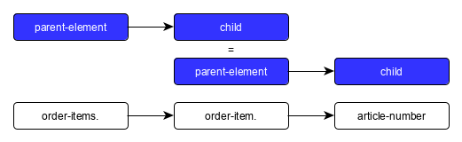

include::shortcuts.adoc[]
:date-pattern: The date format is YYYY-MM-DD.
:timestamp-pattern: The timestamp format is yyyyMMddHHmmss.

[#CC_Fields]
==== Fields

[#CC_Fields_intro]
===== Introduction

This table is the general field table for _Credit Card_. It gives a general overview of all the fields involved in _credit card_ transactions.

Some transaction types may require a different field definition. If this is the case, the different definition is given directly with the transaction type.

- _Format:_ XML 
- _POST_ requests and responses

//-

Fields, sent in a request, will usually also be part of the response. There are additional fields that are returned in the response only. These provide, for example, the result of the payment process. +
We provide the request and the response fields in two separate sections:

- <<CC_Fields_xmlelements_request, _Request_>> contains those fields sent in the request (and usually in the response).
- <<CC_Fields_xmlelements_response, _Response_>> contains those fields sent in the response only.

//-

Within _Request_ and _Response_, the fields are sorted by hierarchy.

In each section, the _Request_ section and the _Response_ section, the fields are grouped according to their elements (such as _payment_, _account-holder_, _card_, _shipping_, etc).
Each element is displayed with an own table.

[#CC_Fields_intro_elements]
====== Objects

Each field list has the following columns:

- <<CC_Fields_intro_elements_name, Name>>
- <<CC_Fields_intro_elements_cardinality, Cardinality>> (for _Request_ elements only)
- <<CC_Fields_intro_elements_dataType, Data Type>>
- <<CC_Fields_intro_elements_lengthLength, Length>>

//-

[#CC_Fields_intro_elements_name]
._Name_
_Structure:_ 

 

_Example:_ ``order-items.order-item.article-number``

// With the corresponding excerpt of the XSD we can show the structure of the xml elements.

The structure shows a hierarchical relation between the elements. We have a parent element consisting of children. Some children can turn into a parent element and have their own children.

According to the above example we have the parent element ``order-items`` and its child ``order-item``. ``order-item`` itself is also a parent element of its child ``article-number``. 
The hierarchy levels are sparated by a ``.``.

[#CC_Fields_intro_elements_cardinality]
._Cardinality_

_Cardinality_ indicates the functional necessity
of the field for the request/response. A field can be either mandatory (M) or optional (O).

- If a field is _mandatory_, it must be included in the request and contain a value. Without this field, the request will fail. +
- If a field is _optional_, it does not have to be included in the request. Including optional fields nevertheless may have certain advantages. 
Reasons why content should be sent with optional fields can be found at the table's description.

The definition of _Cardinality_ may sometimes lead to an ambiguous interpretation.
Look, for example, at the ``periodic``-element. When you send a request without a recurring intention, the ``periodic``-fields are not necessary. But they are mandatory, when you start a payment process with recurring transactions.

In the tables below we will describe the cardinality considering the technical requirement. We provide suggestions in the description of the tables in which context it makes sense to send a field even though its technical cardinality is _Optional_.

//-

[#CC_Fields_intro_elements_dataType]
._Data Type_

_Data Type_ defines the specific characteristics of the input values that can be used for a field. There are seven data types: _String_, _Boolean_, _Date_, _Timestamp_, _Decimal_, _Number_,  and _Enumeration_.

Fields containing child fields (such as ``order-item.article-number``) provide a link in the parent table which points to the table describing the children.

- String: allows a combination of text and numbers with an arbitrary but finite length. A subset of _String_ values can be defined according to a pattern value, such as a api-id. The pattern will be given in the _Description_ column.
- Boolean: has one of two possible values (usually either true or false).
- Date: is a value taken from a calendar (e.g. the date of birth). It follows the pattern YYYY-MM-DD. This pattern cannot be customized.
- Timestamp: Is a moment in time defined by a system. It follows the pattern yyyyMMddHHmmss. This pattern cannot be customized.
- Decimal: is a numeric value which has digits before the comma and after the comma, such as the amount of money in a specific currency (e.g. 138,53 €).
- Number: is a numeric value that has no digits after the decimal, such as expiration month of a credit card.
- Enumeration: is a list of predefined values, e.g. the severity of a status, which can provide the predefined values _warning_, _error_ and _information_.

[#CC_Fields_intro_elements_length]
._Length_
_Length_ shows how many characters can be used for this field. The value given here is the maximum value merchants can use to make sure the whole amount of characters is processed.

In general, the _{payment-gateway}_ allows all characters for each field, depending on the _Data Type_. 

If other rules apply they will be stated in the column _Description_ with each field.

[#CC_Fields_intro_ComplexType]
====== Parent Elements and its Children
Parent elements (also refered to as _Complex type_) are organised in subordinate tables (such as ``address``). The fields itself are part of the respective parent element table (e.g. ``address`` is a subordinate table of ``account-holder``, which is a subordinate table of ``payment``). The parent element table provides a link to the table of the child element.

[#CC_Fields_xmlelements]
===== XML Elements
Click the X in the respective column for request and response fields.

Please refer to our <<Appendix_Xml, xsd scheme>> for field descriptions.

|===
| Field | Request | Response

| payment
| <<CC_Fields_xmlelements_request_payment, X>>
| <<CC_Fields_xmlelements_response_payment, X>>

| account-holder
| <<CC_Fields_xmlelements_request_accountholder, X>>
| 

| address
| <<CC_Fields_xmlelements_request_address, X>>
| 

| airline-industry
| <<CC_Fields_xmlelements_request_airlineindustry, X>>
| 

| audit
| <<CC_Fields_xmlelements_request_audit, X>>
| 

| avs
| 
| <<CC_Fields_xmlelements_response_avs, X>>

| browser
| <<CC_Fields_xmlelements_request_browser, X>>
| 

| card
| <<CC_Fields_xmlelements_request_card, X>>
|  
 
// | card-emv
// | <<CC_Fields_xmlelements_request_cardemv, X>>
// | 

// | card-pin
// | <<CC_Fields_xmlelements_request_cardpin, X>>
// | 

// |card-raw
// | <<CC_Fields_xmlelements_request_cardraw, X>>
// | 

| card-token
| <<CC_Fields_xmlelements_request_cardtoken, X>>
| 

| credit-sender-data
| <<CC_Fields_xmlelements_request_creditsenderdata, X>>
| 

| cruise-industry
| <<CC_Fields_xmlelements_request_cruiseindustry, X>>
| 

| custom-fields
| <<CC_Fields_xmlelements_request_customfield, X>>
| <<CC_Fields_xmlelements_response_customfield, X>>

| device
| <<CC_Fields_xmlelements_request_device, X>>
| 

| notification
| <<CC_Fields_xmlelements_request_notification, X>>
| 

| order-items
| <<CC_Fields_xmlelements_request_orderitem, X>>
| 

| payment-method
| <<CC_Fields_xmlelements_request_paymentmethod, X>>
|

| segment
| <<CC_Fields_xmlelements_request_segment, X>>
| 

| shipping
| <<CC_Fields_xmlelements_request_shipping, X>>
| 

| status
| 
| <<CC_Fields_xmlelements_response_status, X>>

| sub-merchant-info
| <<CC_Fields_xmlelements_request_submerchantinfo, X>>
| 

| three-d
| <<CC_Fields_xmlelements_request_threed, X>>
| <<CC_Fields_xmlelements_response_threed, X>>
|===

[#CC_Fields_xmlelements_request]
====== Request

[#CC_Fields_xmlelements_request_payment]
.payment

Additional fields can be found in the
<<CC_Fields_xmlelements_response_payment, Response > payment>> section.

[cols="30,6,9,7,48a"]
|===
| Field | Cardinality | Datatype | Size | Description

| merchant-account-id | C | String | 36 | A unique identifier assigned to every merchant account.
//KKS: Personally, I think we should capitalize the datatypes as they occur in the XSD - so it would be string. Let's convince Christian.
| merchant-account-resolver-category | C | String | 36 | The category used to
<<GeneralPlatformFeatures_ResolverCategoryCode, resolve the merchant-account>>
based on a number of resolving rules.
| request-id | M | String | 32 | The identification number of the request. It must be unique for each request. The following characters are allowed: ASCII characters Code 32-38 and 40-126.
| requested-amount | M | Decimal | 18,2 | The full amount that is requested/contested in a transaction. Use ``.``(decimal point) as the separator.
a| currency

(Attribute of ``requested-amount``) | M | String | 3 | The currency of the requested/contested transaction amount. Format: 3-character abbreviation according to ISO 4217.
| transaction-type | M | String | 30 | The requested transaction type .
5+| <<CC_Fields_xmlelements_request_accountholder, account-holder>>
4+| <<CC_Fields_xmlelements_request_card, card>> | Used with the first request of card use only.
4+| <<CC_Fields_xmlelements_request_cardtoken, card-token>> | Returned by the first payment response and used for further operations.
| descriptor | M | String | 64 | Describes the settlement of the consumer's account about a transaction. 
| order-detail | O | String | 65535 | Details of an order filled in by the merchant.
5+| <<CC_Fields_xmlelements_request_orderitem, order-items>>
| order-number | M | String | 32 | The order number provided by the merchant. Allowed characters: ASCII characters Code 32-38 and 40-126.
| parent-transaction-id | M/O | String | 36 | This is the unique identifier of the referenced transaction. This is mandatory if 

- ``merchant-account-id`` or ``merchant-account-resolver-category`` are not used.
- the transaction refers to a previously processed transaction (e.g. a _refund_ refers to a _purchase_).
| group-transaction-id | C | String | 36 | A unique ID assigned to a group of related transactions. For example, an _authorization_, _capture_, and _refund_ will all share the same ``group-transaction-id``.
| authorization-code | C | String | 36 | The authorization-code can be

. input for a _capture_ without reference to _authorization_
. output for _authorization_
//-
//KKS: output for or of authorization?
| ip-address | O | String | 45 | The global (internet) IP address of the consumer's device.
| non-gambling-oct-type | O | String | 7 | A transfer type of non-gambling Original Credit Transaction (OCT).
Allowed values: ``p2p``, ``md``, ``acc2acc``, ``ccBill`` and ``fd``.
//KKS: I think we need to provide a brief description for each of these values.
| processing-redirect-url | O | String | 256 | The URL to which the consumer will be redirected after he has fulfilled his payment. This is normally a page
on the merchant's website.
// We must provide the "url" pattern
| success-redirect-url | M | String | 256 | The URL to which the consumer will be re-directed after a successful payment. This is normally a success
confirmation page on the merchant's website.
// We must provide the "url" pattern
| cancel-redirect-url | M | String | 256 | The URL to which the consumer will be re-directed after he has cancelled a payment. This is normally a page on the merchant's website.
// We must provide the "url" pattern
| locale | M | String | 6 | Code of the language. Can be ``CZ``, ``DA``, ``EN``, ``DE``,
``ES``, ``FI``, ``FR``, ``IT``, ``NL``, ``PL``, ``GR``, ``RO``, ``RU``, ``SV``, and ``TR``.
Can be sent in the format ``language`` or in the format ``language_country``.
//KKS: is this up-to-date? What does it do?
| entry-mode | O | String | 24 | This is information about the channel used for this transaction.
Can be one of the following: ``mail-order``, ``telephone-order``, ``ecommerce``, ``mcommerce``, ``pos``.
//KKS: Again, I think it wouldn't hurt to have a one-line description of each value. See 3DS2 table for similar formatting.
| periodic | O | String | 24 | This is information about the periodicity of this
transaction. Can be one of the following:
``installment``, ``recurring``, and ``ci``.
//KKS: for 3DS2 this can be ``ci`` as well.

5+| <<CC_Fields_xmlelements_request_airlineindustry, airline-industry>>

5+| <<CC_Fields_xmlelements_request_cruiseindustry, cruise-industry>>

5+| <<CC_Fields_xmlelements_request_notification, notifications>>

5+| <<CC_Fields_xmlelements_request_threed, three-d>>

5+| <<CC_Fields_xmlelements_request_browser, browser>>

5+| <<CC_Fields_xmlelements_request_creditsenderdata, credit-sender-data>>

5+| <<CC_Fields_xmlelements_request_customfield, custom-fields>>

5+| <<CC_Fields_xmlelements_request_device, device>>

5+| <<CC_Fields_xmlelements_request_paymentmethod, payment-methods>>

5+| <<CC_Fields_xmlelements_request_shipping, shipping>>

5+| <<CC_Fields_xmlelements_request_submerchantinfo, sub-merchant-info>>

//KKS: Adapt order to reflect actual order of field tables (alphabetical?).
|===

[#CC_Fields_xmlelements_request_accountholder]
.account-holder

``account-holder`` is a child of
<<CC_Fields_xmlelements_request_payment, ``payment``>>. +
With the ``account-holder`` merchants can gather detailed information about the
consumer. Please provide all the ``account-holder`` data in your request to make fraud
prevention easier.

////
Is that correct?
KKS: Set last-name to Optional due to input from Moritz.
////

[cols="30,6,9,7,48a"]
|===
| Field | Cardinality | Datatype | Size | Description

| first-name | O | String | 32 | The first name of the consumer.
//KKS: M for 3DS2 payment?
| last-name | O | String | 32 | The last name of the consumer.
//KKS: M for 3DS2 payment?
| email | O | String | 64 | The consumer’s email address as given in the merchant’s shop.
//KKS: I'm not sure about this one for 3DS2...there may also be a second, separate field for address.email.
| gender | O | String | 1 | This is the consumer's gender.
| date-of-birth | O | Date |  | This is the consumer's birth date. {date-pattern}
| phone | O | String | 32 | This is the phone number of the consumer.
| social-security-number | O | String | 14 | This is the social security number of the consumer.
| tax-number | O | String | 14 | This is the social security number of the consumer.
| merchant-crm-id | O | String | 64 | Consumer identifier in the merchant’s shop. Requests that contain payment information from the same consumer in the same shop must contain the same string.
////
"merchant-crm-id" seems to be a field purely for paysafecard. Please verify!
KKS: also used for 3DS2 - they adapted quite a number of existing fields as well; I adapted the ones already in here to the new values. May still be due to change, though!
////
//KKS: Adapted field description to 3DS2 description (written with input by Thomas Skarget).
5+| <<CC_Fields_xmlelements_request_address, address>>
|===

//KKS: Insert account-info as a child of account-holder. (see 3DS2) 
//vhauss: What do you mean by that?

[#CC_Fields_xmlelements_request_address]
.address

``address`` is a child of
<<CC_Fields_xmlelements_request_accountholder, account-holder>>,
<<CC_Fields_xmlelements_request_airlineindustry, airline-industry>>, and
<<CC_Fields_xmlelements_request_shipping, shipping>>. It is used to
specify the consumer's address and can refer to

- the consumer (for ``account-holder``)
- the ticket issuer (for ``airline-industry``)
- the consumer's alternative address (for ``shipping``)

Data can be provided optionally but it helps with fraud
checks, if ``address`` is complete.

////
Is that correct?
////

[cols="30,6,9,7,48a"]
|===
| Field | Cardinality | Datatype | Size | Description

| block-no | O | String | 12 | This is the block-no of the consumer.
| level | O | String | 3 | This is the level of the consumer.
| unit | O | String | 12 | This is the unit of the consumer.
| street1 | M | String | 50 | Line 1 of the street address of the consumer’s billing address.
| street2 | O | String | 50 | Line 2 of the street address of the consumer’s billing address.
| street3 | O | String | 50 | Line 3 of the street address of the consumer’s billing address.
| city | M | String | 50 | City of the consumer’s billing address.
| state | O | String | 3 | State/province of the consumer’s billing address. Accepted format: numeric ISO 3166-2 standard.
| country | M | String | 2 | Country of the consumer’s billing address.
| postal-code | M/O | String | 16 | Mandatory for 3DS2 transactions. ZIP/postal code of the consumer’s billing address. 
| house-extension | O | String | 16 | This is the consumer's house extension.
|===

[#CC_Fields_xmlelements_request_airlineindustry]
.airline-industry

``airline-industry`` is a child of
<<CC_Fields_xmlelements_request_payment, ``payment``>>.

[cols="30,6,9,7,48a"]
|===
| Field | Cardinality | Datatype | Size | Description

| airline-code |O |String |3	|The airline code assigned by IATA.
| airline-name |O |String	|64	|Name of the airline.
| passenger-code |O |String	|10	|The file key of the Passenger Name Record (PNR). This information is mandatory for transactions with AirPlus UATP cards.
| passenger-name |O |String	|32	|The name of the Airline Transaction passenger.
| passenger-phone |O |String	|32	|The phone number of the Airline Transaction passenger.
| passenger-email |O |String	|64	|The Email Address of the Airline Transaction passenger.
| passenger-ip-address |O |String |45 |The IP Address of the Airline Transaction passenger.
| ticket-issue-date |O |Date | |The date the ticket was issued. {date-pattern}
| ticket-number |O |String |11	|The airline ticket number, including the check digit. If no airline ticket number (IATA) is used, the element field must be populated with 99999999999.
| ticket-restricted-flag |O |String |1 |Indicates that the Airline Transaction is restricted. 0 = No restriction, 1 = Restricted (non-refundable).
| pnr-file-key |O |String	|10	|The Passenger Name File Id for the Airline Transaction.
| ticket-check-digit |O |String |2	|The airline ticket check digit.
| agent-code |O |String |3	|The agency code assigned by IATA.
| agent-name |O |String |64	|The agency name.
| non-taxable-net-amount |O | Decimal	|7,2 |This field must contain the net amount of the purchase transaction in the specified currency for which the tax is levied. Two decimal places are implied. If this field contains a value greater than zero, the indicated value must differ to the content of the transaction.
//KKS: Two decimal places are implied? They're definitely not just implied. If this field contains a value greater than zero, the indicated value must differ from the content of the transaction.
//KKS: ?? which indicated value? is the content of the transaction the transaction amount? This description doesn't make any sense.
2+| ticket-issuer/address 2+|<<CC_Fields_xmlelements_request_address, ``address``>> |The address of the ticket issuer.
//KKS: Is the formatting ok like this?
| number-of-passengers |O |String |3	|The number of passengers on the Airline Transaction.
| reservation-code |O |String |32 |The reservation code of the Airline Transaction passenger.
| itinerary | 2+| <<CC_Fields_xmlelements_request_itinerary, ``itinerary``>> | The itinerary segments of the airline transaction. Up to 99 itinerary segments can be defined. 
//KKS: Is the formatting ok like this? If yes, please apply to others as well. If not, rethink original solution.
|===

[#CC_Fields_xmlelements_request_audit]
.audit

``audit`` is a child of
<<CC_Fields_xmlelements_request_payment, ``payment``>>. 
Audit data is displayed in _{enterprise-portal-abbr}_ for each transaction it has been send with.

[cols="30,6,9,7,48a"]
|===
| Field | Cardinality | Datatype | Size | Description

| request-source |O |String |30 |Optional information that references the application or _{payment-gateway}_ a transaction is processed with.
| user |O | String |128 |Optional information that identifies the origin/user of the payment request. Audit user is send by frontend applications referencing the user processing transactions or follow up operations using the application.
|===

[#CC_Fields_xmlelements_request_browser]
.browser

``browser`` is a child of
<<CC_Fields_xmlelements_request_payment, ``payment``>>.

[cols="30,6,9,7,48a"]
|===
| Field | Cardinality | Datatype | Size | Description

|accept |O |String |2048 |This is the HTTP Accept Header as retrieved from the cardholder's browser in the HTTP request. In case it is longer than 2048 it has to be truncated. It is strongly recommended to provide this field to prevent rejections from ACS server side.
|user-agent |O |String |256 |This is the User Agent as retrieved from the card holder's browser in the HTTP request. In case it is longer than 256 Byte it has to be truncated. It is strongly recommended to provide this field to prevent rejections from ACS server side.
|===

//// 
[#CC_Fields_xmlelements_request_browser]
.browser

The following fields are currently not part of the doc: 

| ip-address | O | String | ?? | ??
| hostname | O  | String | ?? | ??
| browser-version | O | String | ?? | ??
| os | O | String  | ?? | ??
| time-zone | O | String | ?? | ??
| screen-resolution | O | String | ?? | ??
| referrer | O | String | ?? | ??
| headers | O | ?? | ?? | ??
| cookies | O | ?? | ?? | ??
| challenge-window-size | O | String | 2 | Dimensions of the challenge window that has been displayed to the cardholder. The ACS shall reply with content that is formatted to appropriately render in this window to provide the best possible user experience.
If not present it will be omitted.
Accepted values are: ``01``, ``02``, ``03``, ``04``, ``05`` +
``01`` = 250 x 400 +
``02`` = 390 x 400 +
``03`` = 500 x 600 +
``04`` = 600 x 400 +
``05`` = Full screen
//KKS: Based on https://confluence.wirecard.sys/pages/viewpage.action?pageId=79700815
| color-depth | O | Number | 2 | Value representing the bit depth of the color palette for displaying images, in bits per pixel. Obtained from cardholder browser using the ``screen.colorDepth`` property. The field is limited to 1-2 characters.
//KKS: Based on https://confluence.wirecard.sys/pages/viewpage.action?pageId=79700815
| java-enabled | O | Boolean |  | Boolean that represents the ability of the cardholder browser to execute Java. Value is returned from the ``navigator.javaEnabled`` property.
//KKS: Based on https://confluence.wirecard.sys/pages/viewpage.action?pageId=79700815
| language | O | String | 8 | Value representing the browser language as defined in IETF BCP47. The value is limited to 1-8 characters. Value is returned from ``navigator.language`` property.
//KKS: Based on https://confluence.wirecard.sys/pages/viewpage.action?pageId=79700815
|===

////

[#CC_Fields_xmlelements_request_card]
.card

``card`` is a child of  <<CC_Fields_xmlelements_request_payment, ``payment``>>. ``card`` details are sent only in the first transaction request when the card is used for the first time. Due to
<<CreditCard_PaymentFeatures_Tokenization_Introduction, PCI DSS>> compliance, ``card`` details are immediately replaced by a token. Beginning with the first response, this
token is used for every consecutive transaction (request and response) that is performed
with this credit card. Token data is provided with the
<<CC_Fields_xmlelements_request_cardtoken, ``card-token``>> element.

////
Please explain: When does it make sense to send the OPTIONAL fields?
KKS: The merchant-tokenization-flag is needed for one-click checkout.
////

NOTE: Only the transaction type _detokenize_ returns ``expiration-month``,
``expiration-year`` and ``card-type`` in a response. All the other transaction
types return elements of ``card-token`` in the response.

[cols="30,6,9,7,48a"]
|===
| Field | Cardinality | Datatype | Size | Description

| account-number | M/O | String | 36 | This is the card account number of the consumer. It is mandatory if ``card-token`` is not used.
| expiration-month | M | Number | 2 | This is the card's expiration month. If this field is configured it will be sent in the response.
| expiration-year | M | Number | 4 | This is the card's expiration year. If this field is configured it will be sent in the response.
| card-security-code | M/O | String | 4 | This is the card's security code. Depending on configuration it may be mandatory.
| card-type | M | String | 15 | This is the card's type. If this field is configured it will be sent in the response.
//vhauss: This field is also part of the "payment-method" element. Verify, whether it also belongs to the "card" element.
| issue-number | M | Number | 4 | This is the card's issue number.
| start-month | M | Number | 2 | This is the card's issue start month.
//KKS: maybe add "(valid from)" after month.
| start-year | M | Number | 4 | This is the card's issue start year.
//KKS: maybe add "(valid from)" after month.
| track-2 | O | String | 256 | This is the card's track-2.

| card-emv
// <<CC_Fields_xmlelements_request_cardemv, card-emv>>
| O | | | This is used for EMV data for credit card of the end-consumer
| card-pin
// <<CC_Fields_xmlelements_request_cardpin, card-pin>>
| O | | | This is used for PIN data for credit card of the end-consumer.
a| card-raw
// <<CC_Fields_xmlelements_request_cardraw, card-raw>> 
| O | | | This is the raw card data.

////
What is <card-raw>?
KKS: good question...are these the raw credit card data?
////

| merchant-tokenization-flag | O  | Boolean |  | The value is to be set to true as soon as consumer's card data has been stored by merchant for future transactions. Maps the Visa field _Stored Credential_.
|===

//// 
[#CC_Fields_xmlelements_request_cardemv]
.card-emv

``card-emv`` is a child of <<CC_Fields_xmlelements_request_card, ``card``>>. 

EMV cards are smart
cards (also called chip cards or IC cards) that store their data on integrated
circuits in addition to magnetic stripes (for backward compatibility). These
include cards that must be physically inserted (or "dipped") into a reader, as
well as contactless cards that can be read over a short distance using
near-field communication (NFC) technology. (Taken from Wikipedia)
KKS: OK as an internal reference but in my opinion not needed here. Maybe describe card types separately?

[cols="30,6,9,7,48a"]
|===
| Field | Cardinality | Datatype | Size | Description

| request-icc-data | O | ?? | ?? | ??

| request-icc-data-encoding | O | ?? | ?? | ??

| response-icc-data | M | ?? | ?? | ??

| response-icc-data-encoding | O | ?? | ?? | ??
|===

////

//// 

[#CC_Fields_xmlelements_request_cardpin]
.card-pin

``card-pin`` is a child of <<CC_Fields_xmlelements_request_card, ``card``>>. 

A PIN pad or PIN entry
device is an electronic device used in a debit, credit or smart card-based
transaction to accept and encrypt the cardholder's personal identification
number (PIN). PIN pads are normally used with payment terminals, automated
teller machines or integrated point of sale devices in which an electronic
cash register is responsible for taking the sale amount and initiating/handling
the transaction. The PIN pad is required to read the card and allow the PIN to
be securely entered and encrypted before it is sent to the bank.
(Taken from Wikipedia)
KKS: are these fields also required for online transactions, or only POS transactions?

[cols="30,6,9,7,48a"]
|===
| Field | Cardinality | Datatype | Size | Description

| data | O | ?? | ?? | ??
| encoding | O | ?? | ?? | ??
| format | O | ?? | ?? | ??
| encryption-context | O | ?? | ?? | ??
| encryption-version | O | ?? | ?? | ??
|===

////

//// 
[#CC_Fields_xmlelements_request_cardraw]
.card-raw

``card-raw`` is a child of
<<CC_Fields_xmlelements_request_card, ``card``>>

??

[cols="30,6,9,7,48a"]
|===
| Field | Cardinality | Datatype | Size | Description

| data | O | ?? | ?? | ??
| encoding | O | ?? | ?? | ??
| format | O | ?? | ?? | ??
| encryption-context | O | ?? | ?? | ??
| encryption-version | O | ?? | ?? | ??
|===

////

[#CC_Fields_xmlelements_request_cardtoken]
.card-token

``card-token`` is a child of
<<CC_Fields_xmlelements_request_payment, ``payment``>> and is the substitute
for <<CC_Fields_xmlelements_request_card, ``card``>>. Due to
<<CreditCard_PaymentFeatures_Tokenization_Introduction, PCI DSS>>
compliance, ``card`` data must not be sent in payment transactions. The _{payment-gateway}_ replaces ``card`` immediately with a token in the transaction response for the first use of a credit card.

[cols="30,6,9,7,48a"]
|===
| Field | Cardinality | Datatype | Size | Description

| token-id | M/O | String | 36 | This is the token corresponding to the ``card.account-number`` of the consumer. It is mandatory if
``card.account-number`` is not specified. It is unique per instance.
| token-ext-id | O | String | 36 | Identifier used for credit card in external system which will be used in mapping to token-id.
| masked-account-number | O | String | 36 | This is the masked version of ``card.account-number`` of the consumer, e.g. 440804\*****7893.
|===

[#CC_Fields_xmlelements_request_cardtype]
.card-type

``card-type`` is a child of <<CC_Fields_xmlelements_request_paymentmethod, ``payment-methods.card-types``>>. It provides a list of all supported card types. Please refer to the <<Appendic_Xml, Payment XSD>>
for the complete list of supported card types.

[#CC_Fields_xmlelements_request_creditsenderdata]
.credit-sender-data

``credit-sender-data`` is a child of
<<CC_Fields_xmlelements_request_payment, ``payment``>>.

``credit-sender-data`` is used in OCT non gambling payment processes only.

With this element the merchant can send money to the consumer.
This can be the case, if the merchant is

- an insurance company and has to pay out money to the consumer (insurance case).
- the government and has to pay back taxes.

////
KKS: I think I would actually include the sentence above. It would be nice to have this as a use case for cc transactions of this type.
////

[cols="30,6,9,7,48a"]
|===
| Field | Cardinality | Datatype | Size | Description

| receiver-name | M/O |String |35 |Mandatory for cross-border transactions. +
Maximum length for Visa: 30
| receiver-last-name | M/O |String |35 |Mandatory for cross-border transactions.
| reference-number |O |String |19 |Maximum length for Visa: 16
| sender-account-number | M/O |String |20 |_Mastercard:_ Mandatory +
_Visa:_ Mandatory if ReferenceNumber is empty, Maximum length: 34
| sender-name | M/O |String |24 |_Mastercard:_ Mandatory +
_Visa:_ Mandatory for US domestic transactions and cross-border money transfers, Maximum length: 30
| sender-last-name | M/O |String |35 |_Mastercard:_ Mandatory +
_Visa:_ Optional
| sender-address | M/O |String |50 |_Mastercard:_ Optional +
_Visa:_ Mandatory for US domestic and cross-border transactions, Maximum length: 35
| sender-city | M/O |String |25 |_Mastercard:_ Optional +
_Visa:_ Mandatory for US domestic and cross-border transactions
| sender-country | M/O |String |3 |_Mastercard:_ Optional +
_Visa:_ Mandatory for US domestic and cross-border transactions, Maximum length: 2
// Max. Size seems to be rather 2 (ISO-Country names consist of 2 characters.)
| sender-state | M/O |String |2 |_Mastercard:_ Mandatory if sender country is US or Canada +
_Visa:_ Mandatory for US domestic and cross-border transactions originating from US or Canada
| sender-postal-code |O |String |10 |No specific requirements for _Mastecard_ and _Visa_.
| sender-funds-source |O |String |2 |Accepted characters are: +
_Mastercard_ +
- US: 01, 02, 03, 04, 05, 07
- Non-US: 01, 02, 03, 04, 05, 06, 07 +
//-
_Visa_ +
- US: 1, 2, 3
- Non-US: 01, 02, 03, 04, 05, 06
//-
|===

[#CC_Fields_xmlelements_request_cruiseindustry]
.cruise-industry

``cruise-industry`` is a child of
<<CC_Fields_xmlelements_request_payment, ``payment``>>.

[cols="30,6,9,7,48a"]
|===
| Field | Cardinality | Datatype | Size | Description

| carrier-code |O |String |3 |The carrier code assigned by IATA.
| agent-code |O |String |8 |The agent code assigned by IATA.
| travel-package-type-code |O |String	|10	|This indicates if the package includes car rental, airline flight, both or neither. Valid entries include: +
C = Car rental reservation included, A = Airline flight reservation included, B = Both car rental and airline flight reservations included, N = Unknown.
| ticket-number |O |String |15 |The ticket number, including the check digit.
| passenger-name |O |String |100 |The name of the passenger.
| airline-code |O |String |3 |The airline code assigned by IATA.
| lodging-check-in-date |O |Date | |The cruise departure date also known as the sail date. {date-pattern}
| lodging-check-out-date |O |Date | |The cruise return date also known as the sail end date. {date-pattern}
| lodging-room-rate |O | Decimal |18,2 |The total cost of the cruise.
| number-of-nights |O |Number |3 |The length of the cruise in days.
| lodging-name |O |String |100 |The lodging name booked for the cruise.
| lodging-city-name |O |String |20 |The name of the city where the lodging property is located.
| lodging-region-code |O |String	|10	|The region code where the lodging property is located.
| lodging-country-code |O |String |10 |The country code where the lodging property is located.
| itinerary | 2+| <<CC_Fields_xmlelements_request_itinerary, ``itinerary``>> |The itinerary segments of the cruise. Up to 99 itinerary segments can be defined.
|===

[#CC_Fields_xmlelements_request_customfield]
.custom-field

``custom-field`` is a child of  
<<CC_Fields_xmlelements_request_payment, ``payment.custom-fields``>>.

In the <<CC_Fields_xmlelements_response_customfield, response > ``custom-field``>> section you can find examples for ready-to-use ``custom-field``.

[cols="30,6,9,7,48a"]
|===
| Field | Cardinality | Datatype | Size | Description

a|field-name 

(Attribute of ``custom-field``)
|O |String |36 |This is the name for the custom field.
a|field-value 

(Attribute of ``custom-field``)
|O |String |256 |This is the content of the custom field. In this field the merchant can send additional information.
|===

[#CC_Fields_xmlelements_request_device]
.device

``device`` is a child of
<<CC_Fields_xmlelements_request_payment, ``payment``>>.

[cols="30,6,9,7,48a"]
|===
| Field | Cardinality | Datatype | Size | Description

| fingerprint |O |String |4096 |A device fingerprint is information collected about a remote computing device for the purpose of identification retrieved on merchants side. Fingerprints can be used to fully or partially identify individual users or devices even when cookies are turned off.
|===

//// 
[#CC_Fields_xmlelements_request_device]
.device

``device`` is a child of
<<CC_Fields_xmlelements_request_payment, ``payment``>>.

[cols="30,6,9,7,48a"]
|===
| Field | Cardinality | Datatype | Size | Description

The following fields are currently not part of the doc: 
(KKS: added from https://doc.wirecard.com/CreditCard.html#CreditCard_Fields)

| policy-score | O | Integer // Number or Decimal!| ?? | ??
| type | O | ?? | ?? | ??
| operating-system | O | ?? | ?? | ??
| render-options | O | ?? | ?? | ??
| sdk | O | ?? | ?? | ??
|===

////

[#CC_Fields_xmlelements_request_itinerary]
.itinerary

``itinerary`` is a child of
<<CC_Fields_xmlelements_request_airlineindustry, ``airline-industry``>> and
<<CC_Fields_xmlelements_request_cruiseindustry, ``cruise-industry``>>.
 is the parent of <<CC_Fields_xmlelements_request_segment, segment>>. Airline Industry and Cruise Industry can define up to 99 itinerary segments.

[cols="30,6,9,7,48a"]
|===
| Field | Cardinality | Datatype | Size | Description

| itinerary 
4+| <<CC_Fields_xmlelements_request_segment, segment>>
|===

[#CC_Fields_xmlelements_request_notification]
.notification

``notification`` is a child of 
<<CC_Fields_xmlelements_request_payment, ``payment.notifications``>>.

``notification`` is used to set up <<GeneralPlatformFeatures_IPN, Instant Payment Notification (IPN)>>. It is highly recommended to use IPN. IPN informs you about the outcome of the individual payment processes. By including ``notification`` in the request
you can overwrite the <<GeneralPlatformFeatures_IPN_Configuration, merchant account configuration>>.

[cols="30,6,9,7,48a"]
|===
| Field | Cardinality | Datatype | Size | Description

a| transaction-state

(Attribute of ``notification``)
 |O |String |12 |This is the status of a transaction when IPN will be sent.
a| url

(Attribute of ``notification``)
 |O |String |256 |The URL to be used for the IPN. It overwrites the notification URL that is set up in the merchant configuration.

|===

[#CC_Fields_xmlelements_request_orderitem]
.order-item

``order-item`` is a child of
<<CC_Fields_xmlelements_request_payment, ``payment.order-items``>>. This is a field
for order's items filled by the merchant. Order item amount always includes tax.
Tax can be specified either by tax-amount or by tax-rate.

[cols="30,6,9,7,48a"]
|===
| Field | Cardinality | Datatype | Size | Description

| name |O | String | |Name of the item in the basket.
| article-number |O | String | |EAN or other article identifier for merchant.
| amount |O |Number | |Item's price per unit.
| tax-rate |O |Number | |Item's tax rate per unit.
| quantity |O |Number | |Total count of items in the order.
|===

//// 
[#CC_Fields_xmlelements_request_orderitem]
.order-item

vhauss: Who enters the values? If filled by the merchant: Is ``order-items`` a request or response field?

The following fields are currently not part of the doc:

| description | O | String | ?? | ??
| tax-amount | O | String | ?? | ??
| type | O | Number | ?? | ??
| discount | O | Number | ?? | ??
|===

////

//// 
[#CC_Fields_xmlelements_request_payloadfield]
.payload-field

``payload-field`` is a child of
<<CC_Fields_xmlelements_request_paymentmethod, ``payment-methods.payload``>>.

[cols="30,6,9,7,48a"]
|===
| Field | Cardinality | Datatype | Size | Description

| field-name | M | String | ?? | ??
| field-value | M | String | ?? | ??
|===

////

[#CC_Fields_xmlelements_request_paymentmethod]
.payment-method

``payment-method`` is a child of 
<<CC_Fields_xmlelements_request_payment, ``payment.payment-methods``>>.

The element ``payment-method`` specifies the payment method used for a transaction.

[cols="30,6,9,7,48a"]
|===
| Field | Cardinality | Datatype | Size | Description

a| name 

(Attribute of ``payment-method``) | M |  String | 15 | This is the name of the payment method that that the consumer selected. The value is always ``creditcard``.

a| url 

(Attribute of ``payment-method``) | O | String | 256 | The URL to be used for proceeding with the payment process on provider side.

2+| card-types 3+| This is the parent of multiple <<CC_Fields_xmlelements_request_cardtype, ``card-type``>> elements. 

// 2+| payload 3+| This is the parent of multiple <<CC_Fields_xmlelements_request_payload, ``payload-field``>> elements
//vhauss: Currently we don't need "payload" as it is not part of the current doc.
|===

[#CC_Fields_xmlelements_request_segment]
.segment

``segment`` is a child of
<<CC_Fields_xmlelements_request_itinerary, ``itinerary``>>. Itinerary segment data is used e.g. within airline-industry to specify itineraries of the flight.

[cols="30,6,9,7,48a"]
|===
| Field | Cardinality | Datatype | Size | Description

| carrier-code | M/O |String	|3	|The 2-letter airline code (e.g. LH, BA, KL) supplied by IATA for each leg of a flight. Mandatory, if itinerary is provided.
// Max. Size seems to be rather 2 (2-letter airline code obviously consists of 2 characters.)
| departure-airport-code | M/O |String	|3	|The departure airport code. IATA assigns the airport codes. Mandatory, if itinerary is provided.
| departure-city-code | M/O |String	|32	|The departure City Code of the Itinerary Segment. IATA assigns the airport codes. Mandatory, if itinerary is provided.
| arrival-airport-code | M/O |String	|3	|The arrival airport code of the Itinerary Segment. IATA assigns the airport codes. Mandatory, if itinerary is provided.
| arrival-city-code | M/O |String	|32	|The arrival city code of the Itinerary Segment. IATA assigns the airport codes. Mandatory, if itinerary is provided.
| departure-date | M/O |Date  |  |The departure date for a given leg. Mandatory, if itinerary is provided. {date-pattern}
| arrival-date | M/O |String | |The arrival date for a given leg. Mandatory, if itinerary is provided. {date-pattern}
| flight-number |O |String |6 |The flight number of the Itinerary Segment.
| fare-class |O |String |3 |Used to distinguish between First Class, Business Class and Economy Class, but also used to distinguish between different fares and booking
| fare-basis |O |String	|6 |Represents a specific fare and class of service with letters, numbers, or a combination of both.
| stop-over-code |O |String	|1 |0 = allowed, 1 = not allowed
// | tax-amount |O |Decimal | |The Value Added Tax Amount levied on the transaction amount.
// vhauss: I think "tax-amount" is a field that should be mentioned here (just as "requested-amount")
a| currency 

(Attribute of ``tax-amount``)
|O |String |3 |The currency of the Value Added Tax Amount levied on the transaction amount.
|===

[#CC_Fields_xmlelements_request_shipping]
.shipping

``shipping`` is a child of
<<CC_Fields_xmlelements_request_payment, ``payment``>>.
The consumer provides ``shipping`` only, if they want to receive the ordered
goods or services at a different place than given in ``account-holder``.

////
Please verify!
KKS: I think for 3DS2, it's necessary to send shipping in any case. I would remove that sentence entirely for that reason.
////

[cols="30,6,9,7,48a"]
|===
| Field | Cardinality | Datatype | Size | Description

| first-name | M | String | 32 | This is first name from shipping information.
//KKS: better descriptions for shipping in 3DS2 field table.

| last-name | M | String | 32 | This is last name from shipping information.

| phone | O | String | 3 | This is used to specify the phone from shipping information.
//KKS: Size is 3? That can't be right...

5+| <<CC_Fields_xmlelements_request_address, address>>

| email | O | String | 64 | This is used to specify the email from shipping information.

| shipping-method | O | String | 36 | This is used to specify the shipping method from shipping information.

| tracking-number | O | String | 64 | This is used to specify the tracking number from shipping information.

| tracking-url | O | String | 2000 | This is used to specify the tracking url from shipping information.
// We must provide the "url" pattern

| shipping-company | O | String | 64 | This is used to specify the shipping company from shipping information.

| return-tracking-number | O | String | 64 | This is used to specify the return tracking number from shipping information.

| return-tracking-url | O | String | 2000 | This is used to specify the return tracking URL from shipping information.
// We must provide the "url" pattern

| return-shipping-company | O | String | 36 | This is used to specify the return shipping company from shipping information.
|===

[#CC_Fields_xmlelements_request_submerchantinfo]
.sub-merchant-info

``sub-merchant-info`` is a child of
<<CC_Fields_xmlelements_request_payment, ``payment``>>.

[cols="30,6,9,7,48a"]
|===
| Field | Cardinality | Datatype | Size | Description

| id | O | String |15 | If you want to use <sub-merchant-info> _id_ is mandatory in every initial step of a transaction. It is recommended to set the <sub-merchant-info> in all the transaction steps. Otherwise some transactions cannot be completed successfully.
| name	| O | String |22 | If you want to use <sub-merchant-info> _name_ is mandatory in every initial step of a transaction. It is recommended to set the <sub-merchant-info> in all the transaction steps. Otherwise some transactions cannot be completed successfully.
| country | O | String |2 | If you want to use <sub-merchant-info> _country_ is mandatory in every initial step of a transaction. It is recommended to set the <sub-merchant-info> in all the transaction steps. Otherwise some transactions cannot be completed successfully.
| state | M/O | String |3 | Mandatory, when _country_ =  US or CA. +
For all other countries _state_ is optional. If _country_ is neither US nor CA, do not send this field at all in the request.
| city | O | String |13 |If you want to use <sub-merchant-info> _city_ is mandatory in every initial step of a transaction. It is recommended to set the <sub-merchant-info> in all the transaction steps. Otherwise some transactions cannot be completed successfully.
| street | O | String |38 |If you want to use <sub-merchant-info> _street_ is mandatory in every initial step of a transaction. It is recommended to set the <sub-merchant-info> in all the transaction steps. Otherwise some transactions cannot be completed successfully.
| postal-code | O | String |10	|If you want to use <sub-merchant-info> _postal-code_ is mandatory in every initial step of a transaction. It is recommended to set the <sub-merchant-info> in all the transaction steps. Otherwise some transactions cannot be completed successfully.
|===

//// 
[#CC_Fields_xmlelements_request_submerchantinfo]
.sub-merchant-info

The following fields are currently not part of the doc:

| appid | O | String | ?? | ??

| category | O | String | ?? | ??

| store-id | O | String | ?? | ??

| store-name | O | String | ?? | ??

| payment-facilitator-id | O | String | ?? | ??
////

[#CC_Fields_xmlelements_request_threed]
.three-d

``three-d`` is a child of
<<CC_Fields_xmlelements_request_payment, ``payment``>>.

Additional fields can be found in the
<<CC_Fields_xmlelements_response_threed, response > three-d>> section.

[cols="30,6,9,7,48a"]
|===
| Field | Cardinality | Datatype | Size | Description

| attempt-three-d | O |String |1 |Indicates that the Transaction Request should proceed with the 3D Secure workflow if the [Card Holder] is enrolled.  Otherwise, the transaction proceeds without 3D Secure. This field is used in conjunction with Hosted Payment Page.
|[[CreditCard_Fields_ThreeD_Pares]]
 pares | M/O |String |2048 | Mandatory in a 3D Secure transaction. This is the digitally signed, base64-encoded authentication response message received from the issuer.
| eci | M/O |String |2 | Mandatory in a 3D Secure transaction. This indicates the status of the VERes.
| xid | M/O |String |36 | Mandatory in a 3D Secure transaction. This is the unique transaction identifier.
| cardholder-authentication-value | M/O |String |1024 | Mandatory in a 3D Secure transaction. The CAVV is a cryptographic value generated by the Issuer. For Visa transaction it is called CAVV (Cardholder Authentication Verification Value) for MasterCard it is either called Accountholder Authentication Value (AAV) or Universal Cardholder Authentication Field (UCAF).
| cardholder-authentication-status | M/O |String |1 | Mandatory in a 3D Secure transaction. Status of 3D Secure check.
| pareq | M/O |String |16000 | Mandatory in a 3D Secure transaction. This is a base64-encoded request message created for cards participating in the 3D program. The PaReq is returned by the issuer's ACS via the VISA or MasterCard directory to the _{payment-gateway}_ and from here passed on to the merchant.
| acs-url | M/O |String |2048 | Mandatory in a 3D Secure transaction. The issuer URL to where the merchant must direct the enrolment check request via the cardholder's browser. It is returned only in case the cardholder is enrolled in 3D Secure program.
|===

//// 
[#CC_Fields_xmlelements_request_threed]
.three-d

How do we handle the sub object <annotation>? See
https://doc.wirecard.com/Appendix_Xml.html

The following fields are currently not part of the doc: 

| riid | O | String |   a| Indicates the type of 3RI request. +
Accepted values are: 01, 02, 03, 04, 05 +
01 = Recurring transaction +
02 = Installment transaction +
03 = Add card +
04 = Maintain card information +
05 = Account
//KKS: See https://doc.wirecard.com/CreditCard.html#CreditCard_3DS2_Fields
| server-transaction-id | O | String |   | 
| version | O | String | 5 a| Identifies the version of 3D Secure authentication used for the transaction. Accepted values are: ``1.0``, or ``2.1``. Uses default value ``1.0`` if the version is not provided in the request.
//KKS: See https://doc.wirecard.com/CreditCard.html#CreditCard_3DS2_Fields
| ds-transaction-id | O | String | 36 a| Universally unique transaction identifier assigned by the Directory Server to identify a single transaction. Required for external 3D Secure servers not provided by Wirecard.
//KKS: See https://doc.wirecard.com/CreditCard.html#CreditCard_3DS2_Fields
|===
//KKS: Should this table also contain all 3DS fields (1 & 2)? Personally, I would think it would make sense to have it all in one place. See: https://doc.wirecard.com/CreditCard.html#CreditCard_3DS2_Fields - still pending updates!
////

[#CC_Fields_xmlelements_response]
===== Response

[#CC_Fields_xmlelements_response_payment]
.payment

Here you can find the ``payment`` element fields which are sent in the response only.

[cols="30,9,7,48a"]
|===
|Field |Datatype |Size |Description

| transaction-id | String | 36 | This is the unique identifier for a transaction.
| transaction-state | String | 12 | This is the status of a transaction.
| completion-time-stamp | Timestamp |  | This is the timestamp of completion of request. {timestamp-pattern}
| avs-code | String | 24 | This is the result of address's validation.
4+| <<CC_Fields_xmlelements_response_avs, ``avs``>>
| csc-code  | String | 12 | Code indicating Card Verification Value (CVC/CVV) verification results.
| consumer-id  | String | 50 | The id of the consumer.
| api-id | String | 36 | The api-id is always returned in the notification. ``api-id`` is a string with a pattern value. The pattern is: 
// We must provide the "api-id" pattern
3+| custom-fields |  <<CC_Fields_xmlelements_response_customfield, ``custom-field``>>
3+| statuses | This is the parent of multiple <<CC_Fields_xmlelements_response_status, ``status``>> elements.
| signature  |  |  | The Signature info, consisting of ``SignedInfo``, ``SignatureValue`` and ``KeyInfo``.
//KKS:?? are SignedInfo etc. fields?
//vhauss: ``signature`` is a complex type, consists of the elements type, value and encoding. I don't know where the above values come from. According to our new structure ``signature`` requires an own table, which we will provide some time later.
| instrument-country | String | 256 | The instrument country retrieves the issuer country of a certain credit card. If this field is configured, use a two-digit country code, such as +
``DE`` (Germany), +
``ES`` (Spain), +
``FR`` (France), or +
``IT`` (Italy). +
If you want a full list of countries, please contact <<ContactUs, Merchant Support>>.
//// 
KKS: Elsewhere, the description is: "The instrument country retrieves the issuer country of a certain credit card." and "Payment origin country." This suggests that this needs to come either from the consumer or the issuer, right? I'm confused.
////
4+|<<CC_Fields_xmlelements_response_threed, three-d>>
|===

[#CC_Fields_xmlelements_response_avs]
.avs

``avs`` is a child of
<<CC_Fields_xmlelements_request_payment, ``payment``>>.

The <<FraudPrevention_AVS, Address Verification System (AVS)>> is an
advanced level of credit card security that is built in to the {payment-provider}
credit card processing network to help thwart identity theft. When a user makes
an online purchase with a credit card their billing address is required. The
house number and postal code of the billing address the user enters is compared
to the billing address held on file by the card issuing bank. If the address
does not match then the transaction can be declined. AVS is an on-demand service
which is configured by Wirecard.

See the complete list of the
<<FraudPrevention_AVS_WirecardResponseCodes, Wirecard Response Codes>>.
//KKS: Here we need to think about white labeling

[cols="30,9,7,48a"]
|===
|Field |Datatype |Size |Description

| result-code | String | 5 | AVS result code.
| result-message | String | 256 | AVS result message.
| provider-result-code | String | 5 | AVS provider result code.
| provider-result-message | String | 256 | AVS provider result message.
|===

//// 
[#CC_Fields_xmlelements_response_Avs]

.avs
[cols="15,9,9,9,12,7,40a"]
|===
.2+h|Field 3+h|Transaction Process .2+h|Datatype .2+h|Size .2+h|Description
h|Request h|Response h|Notification

|avs.result-code | |O |O |String |5 |AVS result code.
|avs.result-message | |O |O |String |256 |AVS result message.
|avs.provider-result-code | |O |O |String |5 |AVS provider result code.
|avs.provider-result-message | |O |O |String |256 |AVS provider result message.
|===

////

[#CC_Fields_xmlelements_response_customfield]
.custom-field

``custom-field`` is a child of
<<CC_Fields_xmlelements_request_payment, ``payment.custom-fields``>>.

Wirecard can configure ``custom-field`` for you.
For possible field values see the following selected examples. If you need the
values of other card products, please contact our <<ContactUs, Merchant Support>>.

[cols="30,9,7,48a"]
|===
|Field |Datatype |Size |Description

|CardCategoryExt |   |   a|Possible field values are: +
``M`` (Consumer) +
``C`` (Commercial)

|CardProductID |  |   a| For possible field values see the following selected examples. If you need the values of other card products, please contact our <<ContactUs, Merchant Support>>.

VISA: + 
``A`` (VISA Traditional) +
``F`` (ViSA Classic) +
``G`` (VISA Business) +
``I`` (VISA Infinite) +

MasterCard: +
``MCC`` (MasterCard® Consumer) +
``MCD`` (Debit MasterCard® Card) +
``MCS`` (MasterCard® Consumer - Standard)

|CardCategory |  |  |Possible field values are: +
``D`` (Debit) +
``C`` (Credit) +
``P`` (Prepaid)
|===

[#CC_Fields_xmlelements_response_status]
.status

``status`` is a child of <<CC_Fields_xmlelements_response_payment, ``payment.statuses``>>.

``status`` informs merchants about the result of the previously sent
request. They can use this information to redirect consumers to the respective
response page (success page or failure page).

[cols="30,9,7,48a"]
|===
|Field |Datatype |Size |Description

a| code 

(Attribute of ``status``) | String | 12 | This is the <<StatusCodes_InDetail, code of the status>> of a transaction.

a| description 

(Attribute of ``status``)| String | 256 | This is the description of the status code of a transaction.

a| severity

(Attribute of ``status``) | String | 20 | This field gives information about the severity. It can be either ``warning``, ``error`` or ``information``.
|===

[#CC_Fields_xmlelements_response_threed]
.three-d

``three-d`` is a child of
<<CC_Fields_xmlelements_response_payment, ``payment``>> .

[cols="30,9,7,48a"]
|===
|Field |Datatype |Size |Description

| liability-shift-indicator | String | 2048 | Liablilty shift can be enabled for 3D Secure consumers.
|===

//-