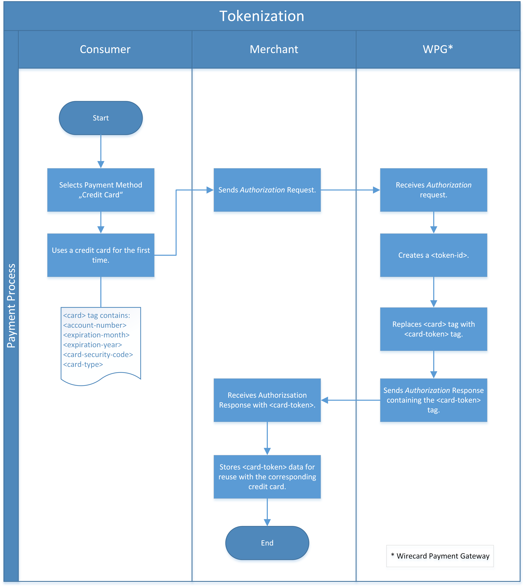
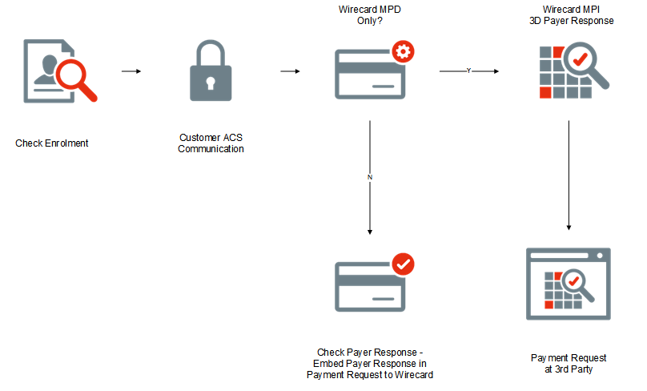
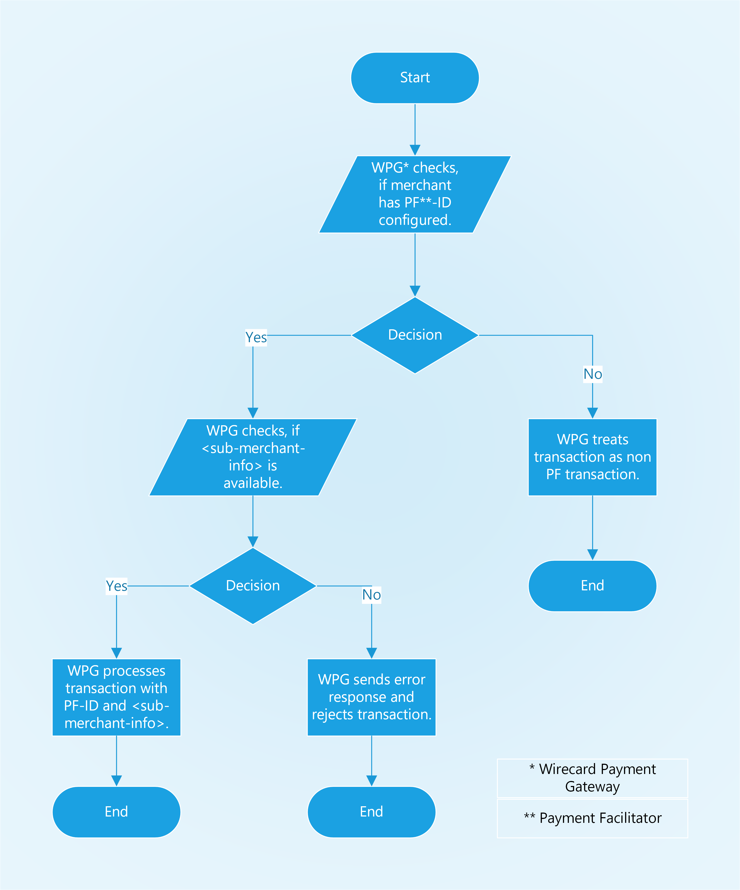

[#CreditCard_PaymentFeatures]
==== Payment Features

[#CreditCard_PaymentFeatures_Tokenization]
===== Tokenization

[#CreditCard_PaymentFeatures_Tokenization_Introduction]
====== Introduction

Tokenization defines a process through which sensitive data, such as
credit card number, is replaced with a surrogate value known as a
"token". This token serves as a reference or surrogate value for the original credit card data.

Tokenization enables the merchant to use credit card data based on PCI
DSS regulations, during a payment process.

It is a service provided by _{payment-provider-name}_ for its customers. The token,
generated by _{payment-provider-name}_, reduces the merchant's PCI DSS Scope. That means,
merchants do not have to store sensitive primary account numbers.

There are two options of using tokenization

.  *Sending a Credit Card Transaction with Credit Card Data*. In this
case _{payment-gateway}_ takes the credit card data
and encrypts the data. These data are stored in a secured encrypted area
inside _{data-warehouse}_ and are for use only in the encrypted
state and secured environment. +
*In other words:* Every card number that accompanies a transaction in
_{payment-gateway}_ is subsequently tokenized.
Regardless of the outcome of the transaction, any subsequent transaction
with these credit card data uses its assigned token instead of the clear
card account values. This means the merchant system never needs to store
the sensitive card information, helping to reduce PCI DSS compliance
issues.
. *Sending an Explicit Request with the Transaction Type _Tokenize_ or _Detokenize_*.
A transaction with this transaction type encrypts or
decrypts credit card data for later reuse. The sender only gets back a
_token-ID_. This _token-ID_ can be reused many times as unique
identifier for this specific credit card without sending or storing
credit card data on shop side.

//-

What is the difference between these two options?

[cols="1,2"]
|===
|Sending a Credit Card Transaction with Credit Card Data |Sending an Explicit Request with the Transaction Type _tokenize_ or _detokenize_

|always initiates a payment process *and* encrypts credit card data |encrypts credit card data only
|  |*does not* initiate a payment process
|===

[#CreditCard_PaymentFeatures_Tokenization_TokenID]
====== The _token-id_

The merchant sends an initial request to _{payment-gateway}._
This could be an _authorization_ for example. This request contains all
data concerning the goods, shipping, etc as well as the consumer's
credit card data. +

After the request of an _authorization_ transaction was processed
successfully, the response will not contain the information of the
Credit Card <data> tag. The <data> tag will be replaced with
a _token-id_ in the <card-token> tag. As soon as
the _token-id_ is created, the _token-id_ represents this
special credit card. +

With that _token-id_ any recurring or other follow up transaction
for this special credit card can be processed. As there is no additional
encryption required, the use of the _token-id_ reduces interaction
and accelerates the credit card payment process. Especially from PCI DSS
perspective it is less critical. +

e.g. A _capture-authorization_ as follow up transaction in the workflow
does not need the <data> tag of the Credit Card but only the
_token-id_.

_When using credit card, {payment-gateway}_ offers two different
options to reference transactions. It depends on the merchant's
individual business needs and business processes, which type of
referencing should be used.

Look at the following table to understand the pros and cons of
referencing with a token or with the
<<GeneralPlatformFeatures_ReferencingTransaction, parent-transaction-id>>.

[cols="1,2,3"]
|===
| |_parent-transaction-id_ |_token-id_

.4+|Pro |Can be used for all alternative payment methods and _credit card_. |
       |Recurring transactions can always reference to a FIRST transaction. | Once created, the token can be reused as often as needed.
       |Referencing is possible to a previous transaction during the life cycle of a payment process. |Credit card check is only performed once (with the first transaction). Makes the payment process faster.
       |Reference is possible even on older transactions. |Reference is valid ad long as the _credit card_ is valid.
.2+|Con |Referencing only within one life cycle of a payment process. |Can only be used with _credit card_.
       |When used with _credit card_ all card checks have to be performed with every new transaction step. |If card has expired, new token will be needed, even if the card number remains the same.
|===

NOTE: When processing _credit card_ transactions, the merchant must be PCI DSS
compliant.

If the merchant only hands through a payment process (using a token) and
does not store card holder data, it reduces the merchant's applicable
controls required for PCI DSS validation.

If the merchant wants to store card holder data (using
``parent-transaction-id``), it increases the merchant's applicable controls
required for PCI DSS validation.

The following table describes, which data can be stored and which data
must not be stored to be PCI DSS compliant.

[cols="1,2,3,4,5"]
[%autowidth]
|===
2+| |Data Element |Storage permitted? |Data needs to be unreadable (in line with PCI DSS requirements)?
.7+|Account Data .4+|Card holder data |Primary Account Number (PAN) |YES |YES
                                      |Card holder name |YES |NO
                                      |Service code |YES |NO
                                      |Expiration date |YES |NO
                    .3+|Sensitive Authentication Data |Full track data |NO |Doesn't apply
                                                      |CAV2/CVC2/CVV2/CID |NO |Doesn't apply
                                                      |PIN/PIN Block |NO |Doesn't apply
|===

[#CreditCard_PaymentFeatures_Tokenization_TokenID_Referencing]
*Referencing by _token-id_*

Referencing based on a token can be performed by using the Field
``<token-id>``.

With that feature it is possible to refer a NEW transaction to an
already submitted initial transaction. In the initial transaction the
cluster of the ``<card>`` tag will be summarized in a _token-id_.
This _token-id_ will be used in any subsequent transaction, which is
based on this initial transaction. The _token-id_ can be seen as a
black box which guarantees a correct correlation of subsequent
transactions without transmitting the complete card data repeatedly.

[cols="1,2,3, 4, 5"]
[%autowidth]
|===
.2+h|Transaction Sequence .2+h|Transaction Type 2+h|Token-ID .2+h|<card-token>
                                                h|Token Definition h|Value

|Initial transaction (Request) |authorization |the ``<card>``-section and all its fields +
e.g.: ``<account-number>``, ``<expiration-month>``, etc +
obtains the substitute _token-id_ value
|1234567890987654 |empty
|Response on initial transaction |authorization 2+|uses _token-id_ value generated from ``<card>`` data given in the initial transaction |1234567890987654
|Any subsequent transaction of this initial transaction |purchase 2+|uses _token-id_ value generated from ``<card>`` data given in the initial transaction |1234567890987654
|===

See the
<<CreditCard_Samples_PaymentProcessUsingToken,samples for an overview of a payment process>>
consisting of the transaction
types _authorization_ and _purchase_ using a token.

[#CreditCard_PaymentFeatures_Tokenization_TokenizeCreditCard]
====== Tokenize a Credit Card

The transaction type _tokenize_ converts credit card information into a
token that can be used in subsequent payment transactions, instead of
the actual credit card information.

ifdef::env-wirecard[]
[#CreditCard_PaymentFeatures_Tokenization_TokenizeCreditCard_Workflow]
*Workflow*

endif::[]

[#CreditCard_PaymentFeatures_Tokenization_TokenizeCreditCard_Fields]
*Fields*

The following fields must be sent either in the request or the response
(M = Mandatory, O = Optional). For details of the affected fields see
<<CreditCard_Fields, the field table>>.

[col="1,2,3"]
|===
|Field |Request |Response

3+a|
[[CreditCard_PaymentFeatures_Tokenization_TokenizeCreditCard_Fields_payment]]
[discrete]
====== payment

|merchant-account-id |M |M
|transaction-id |M |
|request-id |M |M
|transaction-type |M |
|ip-address |O |

3+a|
[[CreditCard_PaymentFeatures_Tokenization_TokenizeCreditCard_Fields_statuses]]
[discrete]
====== statuses

|statuses.status | |M
|status@code | |M
|status@description | |M
|status@severity | |M

3+a|
[[CreditCard_PaymentFeatures_Tokenization_TokenizeCreditCard_Fields_accountHolder]]
[discrete]
====== account-holder

|account-holder.first-name |O |M
|account-holder.last-name |O |M
|account-holder.email |O |M
|account-holder.gender |O |M
|account-holder.date-of-birth |O |M
|account-holder.phone |O |M

3+a|
[[CreditCard_PaymentFeatures_Tokenization_TokenizeCreditCard_Fields_card]]
[discrete]
====== card

|card.account-number |M |
|card.expiration-month |M |
|card.expiration-year |O |
|card.card-type |M |

3+a|
[[CreditCard_PaymentFeatures_Tokenization_TokenizeCreditCard_Fields_cardToken]]
[discrete]
====== card-token

|card-token.token-id | |M
|card-token.token-ext-id | |O
|card-token.masked-account-number |O |
|===

[#CreditCard_PaymentFeatures_Tokenization_TokenizeCreditCard_Samples]
*Samples*

For transaction process details see the
<<CreditCard_Samples_Tokenization, _Tokenize_ samples>>.

[#CreditCard_PaymentFeatures_Tokenization_DetokenizeCreditCard]
====== Detokenize a Credit Card

The transaction type _detokenize_ is the inverse of the transaction type
_tokenize._ With the transaction type _detokenize_ a _token-id_ is
provided to retrieve the original credit card information.

[#CreditCard_PaymentFeatures_Tokenization_DetokenizeCreditCard_Fields]
*Fields*

The following fields must be sent either in the request or the response
(M = Mandatory, O = Optional). For details of the affected fields see
<<CreditCard_Fields, the field table>>.

[col="1,2,3"]
|===
|Field |Request |Response

3+a|
[[CreditCard_PaymentFeatures_Tokenization_DetokenizeCreditCard_Fields_payment]]
[discrete]
====== payment

|merchant-account-id |M |M
|transaction-id | |M
|request-id |M |M
|transaction-type | |M
|ip-address | |O

3+a|
[[CreditCard_PaymentFeatures_Tokenization_DetokenizeCreditCard_Fields_statuses]]
[discrete]
====== statuses

|statuses.status | |M
|status@code | |M
|status@description | |M
|status@severity | |M

3+a|
[[CreditCard_PaymentFeatures_Tokenization_DetokenizeCreditCard_Fields_accountHolder]]
[discrete]
====== account-holder

|account-holder.first-name |M |O
|account-holder.last-name |M |O
|account-holder.email |M |O
|account-holder.gender |M |O
|account-holder.date-of-birth |M |O
|account-holder.phone |M |O

3+a|
[[CreditCard_PaymentFeatures_Tokenization_DetokenizeCreditCard_Fields_card]]
[discrete]
====== card

|card.account-number | |M
|card.expiration-month | |M
|card.expiration-year | |O
|card.card-type | |M

3+a|
[[CreditCard_PaymentFeatures_Tokenization_DetokenizeCreditCard_Fields_cardToken]]
[discrete]
====== card-token

|card-token.token-id |M |M
|card-token.token-ext-id |O |O
|card-token.masked-account-number | |O
|===

[#CreditCard_PaymentFeatures_Tokenization_DetokenizeCreditCard_Samples]
*Samples*

For transaction process details see the
<<CreditCard_Samples_Detokenization, _detokenize_ samples>>.

NOTE: The transaction type _detokenize_ *is not included in default configuration.* +
For further information please contact: {e-mail-support}

[#CreditCard_PaymentFeatures_3DSecure]
===== 3D Secure

3D Secure is a protocol supported by all major card schemes that
provides secure authentication and processing of online payments.
Merchants wishing to comply need to integrate the specific 3D requests
and payment parameters.

The Three Domain (3D) Secure initiative by VISA is a payment standard
for secure handling of credit card transactions in electronic commerce.
This provides Issuers with the ability to authenticate cardholders
during an online purchase. 
ifdef::env-wirecard[]
Branded as _Verified by Visa_. _MasterCard
SecureCode_, _Amex SafeKey_ and _JCB J/Secure_, 3D Secure is designed to
clearly identify cardholders and accelerate the growth of electronic
commerce through increased consumer confidence.
endif::[]
ifdef::env-po[]
Branded as _Verified by Visa_. _MasterCard
SecureCode_, 3D Secure is designed to
clearly identify cardholders and accelerate the growth of electronic
commerce through increased consumer confidence.
endif::[]

Authentication is accomplished by verification of certain data which is
maintained by the card issuing bank and identifies the individual making
an online purchase as the legal owner of the card used. 3D Secure is
more than a payment authentication method or a technology definition. It
is a model to isolate the liabilities of the various parties involved in
the payment transaction cycle. The payment environment requires the
participating cardholder to be registered (enrolled) for the process
with his issuing bank. In essence, all parties involved in the payment
flow must support the 3D Secure transactions. The 3D framework
requires the card issuing and acquiring banks to provide cardholders and
merchants with an authentication methodology, without binding them to
proprietary technology.

[#CreditCard_PaymentFeatures_3DSecure_MPI]
====== Merchant Plug-In (MPI)

An MPI is a software module which provides a communication interface
between the merchant and the card schemes' directory servers. It can be
integrated in the merchant website or it may be hosted by a service
provider or an acquirer. The main functions of an MPI are to verify the
card issuers digital signature used in the authentication process,
validate enrollment and authentication response messages, encrypt and
store passwords and certificates and retrieve payment records and
associated card details to resolve transaction disputes. Merchants can
choose to leverage the enrollment check and payment authentication using
a hosted or an integrated MPI. Both options will notify the merchant if
either of the two validations failed.

Payments need to be submitted with the relevant 3D Secure artifacts
obtained from the MPI. See the
<<CreditCard_PaymentFeatures_3DSecure_Workflow, Process Flow>>
in order to see how to submit the relevant 3D Secure artifacts.

[#CreditCard_PaymentFeatures_3DSecure_MPI_{payment-provider-name}MPI]
*{payment-provider-name} MPI*

This chapter describes the integrated MPI hosted by {payment-provider-name}, for
merchants that wish to use {payment-provider-name} as its 3D Secure MPI Provider. This
solution performs all of the relevant validations and exchanges as
required by the card schemes.

[#CreditCard_PaymentFeatures_3DSecure_MPI_PaymentRequest]
*Payment Request with 3rd Party MPI*

If a merchant wishes to use a 3^rd^ Party MPI, only payments need to be
submitted with the relevant 3D Secure artifacts obtained from the 3^rd^
Party MPI. The protocol is exactly the same as defined for
authorization or purchase request. Only the relevant 3D artifacts
should be included in addition, conditionally on their availability. The
response remains the same as defined.

[#CreditCard_PaymentFeatures_3DSecure_MPI_Fields]
*Fields*

See the field description at
<<CreditCard_Fields_Payment, payment fields>> plus the fields, which are specific to
<<CreditCard_Fields_ThreeD, 3D Secure>>.

[#CreditCard_PaymentFeatures_3DSecure_MPI_Samples]
*Samples*

See
<<CreditCard_Samples_PaymentRequest3rdPartyMPI, request/response samples>>
for _Payment Request with 3rd Party MPI_.

[#CreditCard_PaymentFeatures_3DSecure_Workflow]
====== Workflow

Processing 3D Secure transactions differs from standard payment
processing. Merchants must construct and route their transaction
requests accordingly.

The three necessary steps for processing are:

. *Check Enrollment*
. *Customer ACS Communication*
. *Check Payer Response* – Validation of the authentication result. This is used in conjunction with check enrollment.

//-

[#CreditCard_PaymentFeatures_3DSecure_CheckEnrollment]
====== Check Enrollment

{payment-processing-api} permits merchants to check if a
card/cardholder is enrolled in the 3D Secure program. To verify
Enrollment status, the merchant system sends a transaction request to
{payment-provider-name}'s MPI which in turn posts an Enrollment check request (VEReq)
to the card schemes' directory servers. In an exchange of messages the
directory communicates with the ACS of the card issuer, if required, to
determine if the cardholder is enrolled for 3D Secure. A response
message (VERes) is returned by the ACS to the MPI to prove that the
cardholder is enrolled or that authentication has been attempted.

[#CreditCard_PaymentFeatures_3DSecure_CheckEnrollment_Fields]
*Fields*

See the field description at
<<CreditCard_Fields_Payment, payment fields>> plus the fields, which are specific to
<<CreditCard_Fields_ThreeD, 3D Secure>>.

[#CreditCard_PaymentFeatures_3DSecure_CheckEnrollment_Samples]
*Samples*

See
<<CreditCard_Samples_CheckEnrollment, request/response samples>>
for _Check Enrollment_.

[#CreditCard_PaymentFeatures_3DSecure_CustomerACS]
====== Customer ACS Communication

_Customer ACS Communication_ redirects the consumer to the Access
Control Server (ACS) URL, a webpage provided by the cardholder's bank.
This allows the consumer to authenticate himself by entering his 3D
credentials.

In addition to the interface setup between the merchant and {payment-provider-name},
the successful 3D Secure implementation requires some interaction
between the merchant and the issuing bank via the cardholder browser.

WARNING: *There is NO interaction with {payment-provider-name} for this step.*

To get the 3D authentication to work, it is necessary that the merchant
communicates with the Access Control Server (ACS) by SSL-encrypted HTTP
POST request. In setting up the HTTPS Post authentication request, the
merchant must ensure that the following enrollment check of the purchase
order is redirected from the merchant server to the card issuer's Access
Control Server (ACS).

[#CreditCard_PaymentFeatures_3DSecure_CustomerACS_Fields]
*Fields*

See the field description at
<<CreditCard_Fields_Payment, payment fields>> plus the fields, which are specific to
<<CreditCard_Fields_ThreeD, 3D Secure>>.

[#CreditCard_PaymentFeatures_3DSecure_CustomerACS_HTTPSRedirect]
*ACS HTTPS Redirect*

In case a card is eligible and enrolled ('check-enrollment', Transaction
Status Code = ``200.0000``) the merchant system must redirect the customer's
browser to the ACS URL provided in the Verify 3D Participation
response. If the card is not enrolled (('check-enrollment', Transaction
Status Code = ``500.1072``) , the ACS redirect must be skipped.

This HTTPS POST message includes the web address (URL) of the ACS and
three hidden input types: ``<PaReq>``, ``<TermUrl>`` and ``<MD>``.

``<PaReq>`` defined as the Payment Authentication Request.

``<TermUrl>`` defines the web address of the merchant site to
which the issuer returns the Payment Authentication Response (PARes)
message.

The parameter type ``<MD>`` is reserved for specific merchant data.
Although this field is mandatory, it does not need to have a value
defined. If this input type is omitted an authentication error will
occur and the payment process is aborted. ``<MD>`` may be useful for
retrieving transaction data from the database or recalling a
transaction. The data is returned untouched by the ACS with the Payment
Authentication Response (_PARes_).

.Example: Auto submission POST Request
[source,html]
----
<html>
   <head>
      <meta HTTP-EQUIV="Content-Type" content="text/html; charset=UTF-8" />
      <meta HTTP-EQUIV="Cache-Control" CONTENT="no cache" />
      <meta HTTP-EQUIV="Pragma" CONTENT="no cache" />
      <meta HTTP-EQUIV="Expires" CONTENT="0" />
   </head>
   <body OnLoad="AutoSubmitForm();">
      <form name="downloadForm" action="AcsUrl" method="POST">
         <input type="hidden" name="PaReq" value="PaReq" />
         <input type="hidden" name="TermUrl" value="TermUrl" />
         <input type="hidden" name="MD" value="optionalValue" />
         
         <input type="submit" name="continue" value="Continue" />
      </form>
   </body>
</html>
----

[#CreditCard_PaymentFeatures_3DSecure_CustomerACS_HTTPSRedirectTermURL]
*ACS HTTPS Redirect to TermURL*

The cardholder's browser passes the encrypted *_PaReq_* message
unprocessed to the _ACS_.

This step is made up of two phases: The server invokes an authentication
popup or inline window in the cardholder's browser. The cardholder
enters a password in the authentication window and the data returns to
the ACS.

The ACS authenticates the cardholder's password, constructs the
verification ID, and posts an SSL-encrypted and digitally signed Payment
Authentication Response (_PARes_) to the TermURL via the account
holder's browser. Encryption and signature ensure that the content
cannot be modified during transit.

The cardholder browser redirects the fully encrypted _PARes_ to the
merchant's server address specified as *_TermUrl_*. The response message
contains the results of the cardholder authentication and the untouched
merchant data (*_MD_*).

[#CreditCard_PaymentFeatures_3DSecure_CheckPayerResponse]
====== Check Payer Response

The merchant has received the PARes via the *_TermUrl_*. This request
should be used in case you are using the Payment Processing API as "MPI
only".  Otherwise the _PARes_ should be included along with the subsequent
payment request.

NOTE: To ensure a unique transaction flow the _Check Payer Response_ should be
called for ALL 3D transactions regardless of the enrollment status. The
_Check Payer Response_ includes the ECI which is needed for further
payment processing.

[#CreditCard_PaymentFeatures_3DSecure_CheckPayerResponse_Fields]
*Fields*

See the field description at
<<CreditCard_Fields_Payment, payment fields>> plus the fields, which are specific to
<<CreditCard_Fields_ThreeD, 3D Secure>>.

[#CreditCard_PaymentFeatures_3DSecure_CheckPayerResponse_Samples]
*Samples*

See
<<CreditCard_Samples_CheckPayerResponse, request/response samples>>
for _Check Payer Response_.

[#CreditCard_PaymentFeatures_3DSecure_PaymentRequestPARes]
====== Payment Request with PARes

The merchant has received the _PARes_ via the *_TermUrl_*. The _PARes_ is
forwarded to {payment-provider-name} along with payment request.

[#CreditCard_PaymentFeatures_3DSecure_PaymentRequestPARes_Fields]
*Fields*

See the field description at
<<CreditCard_Fields_Payment, payment fields>> plus the fields, which are specific to
<<CreditCard_Fields_ThreeD, 3D Secure>>.

NOTE: The _parent-transaction-id_ supplied is the transaction-id of the
"check-enrollment" response. +
The _PARes_ is received after communicating with the issuing bank. +
{payment-provider-name} checks the payer response encoded in _PARes_. If successful, it will
perform the transaction.

[#CreditCard_PaymentFeatures_3DSecure_PaymentRequestPARes_Samples]
*Samples*

See
<<CreditCard_Samples_PaymentRequestPARes, request/response samples>>
for _Payment Request with PARes_.

[#CreditCard_PaymentFeatures_DynamicDescriptor]
===== Dynamic Descriptor

With the _Dynamic Descriptor_, merchants can itemize sales more clearly
to the benefit of their customers, back office and consumer care
management.

As merchants can add sales-specific information to electronic settlement
requests, consumers have a better understanding of what they purchased.
This increases their level of satisfaction and reduces the number of
chargebacks. Known as a dynamic descriptor, the details can be included
in any settlement transaction, be it e-commerce, POS or MOTO.

[#CreditCard_PaymentFeatures_DynamicDescriptor_DataStructure]
====== Data and Structure

_Merchant Name_ and _Merchant Location_ are usually displayed on the
cardholder's bank statement. These fields or parts of them are used for
presenting the dynamic data on the cardholder's statement.

Apart from such static data, the merchant can add transaction
information to better reference their sales. For example, the merchant
may use invoice number, booking ID or transaction ID. This data is
typically passed along to the merchant. As this field has a fixed
length, the longer the merchant name is, the smaller the number of
digits allocated to dynamic information will be.

[#CreditCard_PaymentFeatures_DynamicDescriptor_DataStructure_DigitsAllocation]
*Digits Allocation*

[cols="1,2,3"]
[%autowidth]
|===
|Card Brand |Field |Digits
.2+|VISA |Name |25
         |Location |13
.2+|Master Card |Name |22
                |Location |13
.2+|JBC |Name |25
        |Location |13
|===

NOTE: Merchants are advised to consider all these parameters before setting a
dynamic descriptor, because any text exceeding the permissible length is
cut off and discarded.

Please be aware that industry-specific restrictions apply by card
schemes.

Please also note that it is up to the issuer to decide which data
provided in the dynamic descriptor is printed on the cardholder's
statement. {payment-provider-name} can thus not guarantee that the dynamic descriptor
data submitted to the issuers via the scheme networks is fully printed
on the cardholder's statement.

ifdef::env-wirecard[]
Wirecard Bank (WDB) receives the transaction data from the _{payment-gateway}_, looks up the merchant address, consolidates static
address details and dynamic sales data (including _Merchant Name_ and
_Merchant Location_) and routes the information along with the
settlement request to the issuer. To what level the routed details will
later appear on the customer's card statement may vary from issuer to
issuer.
endif::[]

[#CreditCard_PaymentFeatures_DynamicDescriptor_HowItWorks]
====== How It Works

When a merchant sends a transaction request with a dynamic descriptor,
the data provided in the reserved transaction field tag expands the
address information registered in the card acquirer's MID database.

NOTE: The dynamic descriptor is created for settlement transaction types such
as ``purchase``, ``capture`` or ``credit``. ``authorization`` is not supported.

[#CreditCard_PaymentFeatures_DynamicDescriptor_HowItWorks_Workflow]
*Workflow*

ifdef::env-wirecard[]
image::images/11-01-03-credit-card_payment-features/CreditCard_DynamicDescriptor_Workflow.png[CreditCard DynamicDescriptor Workflow]
endif::[]

. The consumer shops at the merchant's site and enters his card
details at checkout.
. The merchant system records the data and posts an XML request
with the default identifiers including the descriptor text (entered in
one of the <Transaction-ID>, <Order Number>, <Request ID> or
<Descriptor> tag) to the _{payment-gateway}_.
. _{payment-gateway}_ processes the request and forwards
the transaction details to the acquirer
ifdef::env-wirecard[]
(e.g. Wirecard Bank).
endif::[]

. The acquirer acquires the card and sales details, reads the
related identifier values, looks up the merchant's name and business
details in the MID database and complements the merchant data with the
data sent in one of the transaction identifier tag fields.
. The aquirer routes the settlement request including the
dynamic text to the issuer.
. The issuer processes the request, debits the consumer's
account and adds a new debit item with the dynamic descriptor to the
credit card statement.

//-

[#CreditCard_PaymentFeatures_PaymentFacilitator]
===== Payment Facilitator

The _Payment Facilitator_ model allows a Payment Service Provider with a
_Payment Facilitator_ license to aggregate credit card payments, collect
funds resulting from credit card traffic and settle sub merchants
directly.

Requests in _Payment Facilitator_ traffic require additional sub
merchant information in the
<<<CreditCard_Fields_SubMerchantInfo, sub-merchant-info>>>
tag of each first request in the transaction flow (e.g.
``check-enrollment``, ``authorization-only``, ``authorization`` or
``purchase``).

The _sub merchant information_ is only required for MasterCard traffic,
but {payment-provider-name} recommends to send it for every credit card brand to avoid
complexity in implementation.

NOTE: Each transaction type must contain ``<sub-merchant-info>`` in the
initial step. For the following steps ``<sub-merchant-info>`` is not
mandatory, but {payment-provider-name} recommends to send ``<sub-merchant-info>`` in every
step. This helps to avoid complexity in implementation.

ifdef::env-wirecard[]
[#CreditCard_PaymentFeatures_PaymentFacilitator_HowItWorks]
====== How It Works

endif::[]

See the
<<CreditCard_Samples_PaymentFacilitatorTransactions, corresponding samples for details>>.

[#CreditCard_PaymentFeatures_RecurringTransaction]
===== Recurring Transaction

To submit a
<<GeneralPlatformFeatures_Transactions_Recurring, recurring transaction>>
the merchant must submit a request with the transaction
type ``authorization-only``, ``authorization`` or ``purchase`` including
the
<<GeneralPlatformFeatures_Transactions_Recurring_Periodic, PERIODIC TYPE>>
element and a
<<GeneralPlatformFeatures_Transactions_Recurring_Sequence, SEQUENCE TYPE>>.

[#CreditCard_PaymentFeatures_RecurringTransaction_PeriodicTypes]
====== Credit Card specific _Periodic Types_

Aside from the standard _Periodic Types, Credit Card_ can also be used
with the _Periodic Types_ ``ucof`` and ``ci``.

[#CreditCard_PaymentFeatures_RecurringTransaction_PeriodicTypes_ucof]
*_ucof_*

_The Unscheduled Credential on File (ucof)_ allows the merchant to
reference a regularly based transaction (like an unlimited periodic
payment or an installment payment) to an already successfully submitted
transaction. ``ucof`` is a transaction using a stored credential for a
fixed or variable amount that does not occur on a scheduled or regularly
occurring transaction date, where the cardholder has provided consent
for the merchant to initiate one or more future transactions. An example
of such transaction is an account auto-top up transaction.

[#CreditCard_PaymentFeatures_RecurringTransaction_PeriodicTypes_ci]
*_ci_*

The periodic type ``ci`` (Consumer Initiated) allows the merchant to
identify that the cardholder himself initiated the transaction and
whether this is an initial (first) or subsequent (recurring) one. As
soon as this is subsequent merchant initiated transaction (e.g. the
cardholder used an account on merchant side ) and the corresponding
information is sent to _{payment-gateway},_ _CVV_ could be omitted
within the transaction and Visa will still approve it. So this will lead
to higher approve rate in the future.

[#CreditCard_PaymentFeatures_RecurringTransaction_Restrictions]
====== Restrictions

Read, which
<<GeneralPlatformFeatures_Transactions_Recurring_Restrictions, restrictions>>
have to be met to use a recurring transaction.

[#CreditCard_PaymentFeatures_RecurringTransaction_Samples]
====== Samples

See
<<CreditCard_Samples, request/response samples>> for _Recurring Transaction._

[#CreditCard_PaymentFeatures_RecurringTransaction_PossibleScenarios]
====== Possible Scenarios

[#CreditCard_PaymentFeatures_RecurringTransaction_PossibleScenarios_ShoppingOnline]
*Shopping Online/Via an App*

_Establish Stored Credential/First Transaction_

. Cardholder consent is obtained: ``merchant-tokenization-flag`` set
to ``true``
. Cardholder provides the Credit Card data including _CVV/CVC2_ code
(required): ``periodic/periodic-type = 'ci'`` included in the transaction
and ``periodic/sequence-type = 'first'``
. Merchant sends the transaction to _{payment-gateway}_

//-

.Example: Establishment of Stored Credential/First Transaction
[source,xml,subs=attributes+]
----
include::samples/xml/CreditCardPaymentFeaturesRecurringTransactionPossibleScenariosShoppingOnline_CptCCdiCc.xml[]
----

_Subsequent Cardholder Initiated Purchase_

. Cardholder consent is obtained: ``merchant-tokenization-flag`` set
to ``true``
. Cardholder data is saved within a cardholder's account (_CVV_ is not
required)
. Cardholder uses the account to make a
purchase: ``periodic/periodic-type = 'ci'`` included in the transaction
and ``periodic/sequence-type = 'recurring'``
. Merchant sends the transaction to _{payment-gateway}_

//-

.Example: Subsequent Cardholder initiated purchase
[source,xml,subs=attributes+]
----
include::samples/xml/CreditCardPaymentFeaturesRecurringTransactionPossibleScenariosShoppingOnline_CardholderUsesTheAccountToMakeA.xml[]
----

_Guest Account/Single Transaction_

. Since Cardholder doesn't create a account, Cardholder data is not
being saved: the default value for ``merchant-tokenization-flag`` is
``false``
. Cardholder provides the Credit Card data including _CVV/CVC2_ code
(required)
. Merchant sends the transaction to _{payment-gateway}_

//-

.Example: Guest account/single transaction
[source,xml,subs=attributes+]
----
include::samples/xml/CreditCardPaymentFeaturesRecurringTransactionPossibleScenariosShoppingOnline_CptCCdiCc_3.xml[]
----

[#CreditCard_PaymentFeatures_RecurringTransaction_PossibleScenarios_RecurringInstallmentTransaction]
*Recurring \(R) or Installment (I) Transaction*

_First Recurring or Installment_

. Cardholder consent is obtained: ``merchant-tokenization-flag`` set
to ``true``
. Cardholder would like to initiate Recurring or Installment payments
. Cardholder provides the Credit Card data including _CVV/CVC2_
code: ``periodic/periodic-type = 'installment'``/``'recurring'`` included in
the transaction and ``periodic/sequence-type = 'first'``
. Merchant sends the transaction to {payment-gateway}

//-

.Example: First Recurring or Installment
[source,xml,subs=attributes+]
----
include::samples/xml/CreditCardPaymentFeaturesRecurringTransactionPossibleScenariosRecurringInstallmentTransaction_CptCCdiC.xml[]
----

[#CreditCard_PaymentFeatures_RecurringTransaction_PossibleScenarios_SubsequentRecurringInstallment]
*Subsequent Recurring or Installment*

_Merchant Initiated Transaction_

. Merchant initiates a subsequent Recurring or Installment
payment: ``periodic/periodic-type = 'installment'``/``'recurring'`` included
in the transaction and ``periodic/sequence-type = 'recurring'``
. Merchant sends the transaction to {payment-gateway}

//-

.Example: Merchant initiated transaction
[source,xml,subs=attributes+]
----
include::samples/xml/CreditCardPaymentFeaturesRecurringTransactionPossibleScenariosSubsequentRecurringInstallment_MerchantInitiatesASubsequentRecurringOrInstallment.xml[]
----

[#CreditCard_PaymentFeatures_RecurringTransaction_PossibleScenarios_ucof]
*ucof*

_Example_: auto-top up for transit or mobile ─ date is irregular, i.e.
not known as usage driven

. Cardholder consent is obtained: ``merchant-tokenization-flag`` set
to ``true``
. Cardholder would like to initiate _ucof_ payments
. Cardholder provides the Credit Card data including _CVV/CVC2_
code: ``periodic/periodic-type = 'ucof'`` included in the transaction
and ``periodic/sequence-type = 'first'``
. Merchant sends the transaction to {payment-gateway}

//-

.Example: First UCOF (sequence-type = 'first')
[source,xml,subs=attributes+]
----
include::samples/xml/CreditCardPaymentFeaturesRecurringTransactionPossibleScenariosUcof_CptCCdiC.xml[]
----

_Merchant Initiated Transaction_

. Merchant initiates a subsequent UCOF
payment: ``periodic/periodic-type = 'ucof'``  included in the transaction
and ``periodic/sequence-type = 'recurring'``
. Merchant sends the transaction to {payment-gateway}

//-

.Example: Subsequent UCOF (sequence-type = 'recurring')
[source,xml,subs=attributes+]
----
include::samples/xml/CreditCardPaymentFeaturesRecurringTransactionPossibleScenariosUcof_MerchantInitiatesASubsequent_UCOF.xml[]
----

[#CreditCard_PaymentFeatures_RecurringTransactions_NonReferencedCapture]
====== Non-Referenced Capture

In an offline transaction process it is possible to have a
non-referenced capture authorization. The _{payment-gateway}_ can
support such a type of transaction when using a special
``capture-authorization`` _Credit Card_ transaction.

A transaction is considered non-referenced capture when it meets all
the  following four conditions in the payment XML request:

. The transaction type is ``capture-authorization``
. ``payment-method`` is _Credit Card_
. ``parent-transaction-id`` is empty (no tag present)
. ``authorization-code`` is present (can have empty value)

//-

If all conditions are met, then the transaction is sent to _{payment-gateway}_.

The most exceptional fact in this process is, that it is missing the
_Parent-Transaction-ID_. By default ``capture-authorization`` takes most
of its properties from the parent transaction.

Even though no parent transaction is available, captures which have not
been referenced by _{payment-gateway}_ can be processed. Cases
like this will be handled a non-referenced ``capture-authorization``
transaction type. In that case all fields must be supplied with the
_capture-authorization_ request.

[#CreditCard_PaymentFeatures_VOP]
===== VISA Offers Program

[#CreditCard_PaymentFeatures_VOP_Intro]
====== Introduction

[#CreditCard_PaymentFeatures_VOP_TransactionTypes]
====== Transaction Types

The _VISA Offers Program_ uses the transaction type <<Glossary_TransactionType, _enrollment_>> only. 

For transaction type details look at <<AppendixB, Appendix B: Transaction Types>>.

[#CreditCard_PaymentFeatures_VOP_TestCredentials]
====== Test Credentials

|===
h|Endpoint  | ``\https://{test-instance-hostname}/engine/rest/payments/``
h|Merchant Account ID (MAID) | f82ea856-be50-4899-988d-697574df65f0
h|Username | 61613-VisaOffers
h|Password | woU6xxn17HhSi-
h|Secret Key | d40ec430-89eb-4c52-ba2c-98d9e8910fb3
|===

[#CreditCard_PaymentFeatures_VOP_Workflow]
====== Workflow

.Enroll Card

. Merchant sends enrollment request.
. {payment-gateway} returns enroll response.

.Add Card

. Merchant sends add card request.
. {payment-gateway} returns add card response.

[#CreditCard_PaymentFeatures_VOP_Fields]
====== Fields

[cols="20,5,5,5,5,5,5,50a"]

|===
.2+h| Fieldname 4+h| Cardinality .2+h| Datatype .2+h| Size .2+h| Description
   h| Enroll Card Request h| Enroll Card Response h| Add Card Request h| Add Card Response

8+h| account-holder 
| account-number | X |  | X |  | String | 36 | This is the card account number of the end-consumer.
| api-id | O | O | O | O | String | 36 | The api-id is always returned in the notification.
8+h| card 
8+h| card-data 
| card-id |  | O | O | O | String | 36 | This is unique VOP Card ID generated by VOP system upon successful enrollment.
8+h| card-token 
| card-type | X |  | X |  | String | 15 | This is the card's type of the end-consumer. It has to be "visa" or "mastercard".
| consumer-id | X/O | O |  |  | String | 50 | This is the end-consumer's identifier. At least one of following must be present: consumer-id, email or phone. The consumer-id is mandatory for Enroll Card With Token.
| email | X/O | X/O |  |  | String | 64 | This is the end-consumer’s email-address. At least one of following must be present: consumer-id, email or phone.
| expiration-month | X |  | X |  | Number | 2 | This is the card's expiration month of the end-consumer.
| expiration-year | X |  | X |  | Number | 4 | This is the card's expiration year of the end-consumer.
| instrument-country |  | O |  | O | String | 2 | Country code of the card issuer. Returned only if engine has enabled FEATURE_CARD_TYPE_SERVICE or X-WD-Toggle-EnableFeature=FEATURE_CARD_TYPE_SERVICE header is sent with request.
| issuer-name |  | O |  | O | String | 50 | Name of the card issuer. Returned only if engine has enabled FEATURE_CARD_TYPE_SERVICE or X-WD-Toggle-EnableFeature=FEATURE_CARD_TYPE_SERVICE header is sent with request.
8+h| loyality-card
8+h| loyalty 
| masked-account-number | O | O | O | O | String | 36 | This is the masked version of  "card.account-number" of the end-consumer. E.g. 440804******7893.
| merchant-account-id | X | X | X | X | String | 36 | Unique identifier for a merchant account.
8+h| payment 
| payment-methods/payment-method[@name] | X | X | X | X | String | 9 | The name of the Payment Method is “creditcard”.
| phone | X/O | X/O |  |  | String | 32 | This is the phone number of the end- consumer. At least one of following must be present: consumer-id, email or phone. If +1 999 555 0100 is phone number in international format, then 9995550100 is value of phone field.
| phone-country-code | C | O |  |  | String |  | This is the country identifying information for the contact. Must be present if phone number is used. If +1 999 555 0100 is phone number in international format, then 1 is value of country code field.
| promotion-code | O |  | O |  | numeric | 36 | Promotional code associated with the enrollment of the user. VOP sets the PromoCode to upper case upon receipt. Alphanumeric. No special characters.
| request-id | X | X | X | X | String | 36 | This is the identification number of the request. It has to be unique for each request.
| security-code | O |  | O |  | String | 4 | This is the card's security code of the end-consumer.
| token-id | O | O | O | O | String | 36 | This is the token corresponding to  "card.account-number" of the end-consumer.
| transaction-id |  | X |  | X | String | 36 | The Transaction ID is the unique identifier for a transaction. It is generated by Wirecard.
| transaction-type | X | X | X | X | String | 22 | This is the type for a transaction. Must be enrollment.
| user-id |  | O | X | O | String | 36 | This is unique VOP User ID generated by VOP system upon successful enrollment.
8+h| statuses 
| status |  | X |  | X | String | 12 | This is the status of a transaction.
| status@code |  | X |  | X | String | 12 | This is the code of the status of a transaction.
| status@description |  | X |  | X | String | 256 | This is the description to the status code of a transaction.
| status@severity |  | X |  | X | String | 20 | This field gives information if a status is a warning, an error or an information.
|===

[#CreditCard_PaymentFeatures_VOP_Samples]
====== Samples

._enrollment_ request

[source,json,subs=attributes+]
----
<payment xmlns="http://www.elastic-payments.com/schema/payment">
  <merchant-account-id>f82ea856-be50-4899-988d-697574df65f0</merchant-account-id>
  <request-id>{{$guid}}</request-id>
  <transaction-type>enrollment</transaction-type>
  <payment-methods>
    <payment-method name="creditcard"/>
  </payment-methods>
  <account-holder>
    <email>{{$guid}}@email.com</email>
    <phone-country-code>1</phone-country-code>
  </account-holder>
  <card>
    <card-type>visa</card-type>
    <account-number>4200000000000018</account-number>
    <expiration-year>2023</expiration-year>
    <expiration-month>01</expiration-month>
  </card>
</payment>
----

._enrollment_ response

//// 
The _enrollment_ request above returns an error:
<status code="500.3055" description="loyalty:Exceeded number of PAN attempts." severity="error"/>
////
[source,json,subs=attributes+]
----

----

._tokenize_ request

[source,json,subs=attributes+]
----
<payment xmlns="http://www.elastic-payments.com/schema/payment">
  <merchant-account-id>f82ea856-be50-4899-988d-697574df65f0</merchant-account-id>
  <request-id>{{$guid}}</request-id>
  <transaction-type>tokenize</transaction-type>
  <requested-amount currency="EUR">5.00</requested-amount>
  <account-holder>
    <first-name>John</first-name>
    <last-name>Doe</last-name>
    <email>john.doe@test.com</email>
    <address>
      <street1>2200 Pacific Hwy</street1>
      <city>San Diego</city>
      <state>US</state>
      <country>CA</country>
      <postal-code>92101</postal-code>
    </address>
  </account-holder>
  <card>
    <account-number>4200000000000018</account-number>
    <expiration-month>1</expiration-month>
    <expiration-year>2023</expiration-year>
    <card-security-code>018</card-security-code>
    <card-type>visa</card-type>
  </card>
  <payment-methods>
    <payment-method name="creditcard"/>
  </payment-methods>
  <three-d/>
</payment>
----

._tokenize_ response

[source,json,subs=attributes+]
----
<?xml version="1.0" encoding="UTF-8" standalone="yes"?>
<payment xmlns="http://www.elastic-payments.com/schema/payment" self="https://{test-instance-hostname}:443/engine/rest/merchants/f82ea856-be50-4899-988d-697574df65f0/payments/f35d5893-11be-407b-b256-c943b8643b62">
    <merchant-account-id ref="https://{test-instance-hostname}:443/engine/rest/config/merchants/f82ea856-be50-4899-988d-697574df65f0">f82ea856-be50-4899-988d-697574df65f0</merchant-account-id>
    <transaction-id>f35d5893-11be-407b-b256-c943b8643b62</transaction-id>
    <request-id>005176d1-9c4a-4ae3-b303-fcce71a179f5</request-id>
    <transaction-type>tokenize</transaction-type>
    <transaction-state>success</transaction-state>
    <completion-time-stamp>2019-08-07T13:08:09.000Z</completion-time-stamp>
    <statuses>
        <status code="201.0000" description="The resource was successfully created." severity="information"/>
    </statuses>
    <requested-amount currency="EUR">5.00</requested-amount>
    <account-holder>
        <first-name>John</first-name>
        <last-name>Doe</last-name>
        <email>john.doe@test.com</email>
        <address>
            <street1>2200 Pacific Hwy</street1>
            <city>San Diego</city>
            <state>US</state>
            <country>CA</country>
            <postal-code>92101</postal-code>
        </address>
    </account-holder>
    <card-token>
        <token-id>4242796444090018</token-id>
        <masked-account-number>420000******0018</masked-account-number>
    </card-token>
    <payment-methods>
        <payment-method name="creditcard"/>
    </payment-methods>
    <api-id>elastic-api</api-id>
</payment>
----

._tokenized-enrollment_ request

[source,json,subs=attributes+]
----
<payment xmlns="http://www.elastic-payments.com/schema/payment">
  <merchant-account-id>f82ea856-be50-4899-988d-697574df65f0</merchant-account-id>
  <request-id>{{$guid}}</request-id>
  <transaction-type>enrollment</transaction-type>
  <payment-methods>
    <payment-method name="creditcard"/>
  </payment-methods>
  <card-token>
    <token-id>4242796444090018</token-id>
  </card-token>
</payment>
----

._tokenized-enrollment_ response

[source,json,subs=attributes+]
----
<?xml version="1.0" encoding="UTF-8" standalone="yes"?>
<payment xmlns="http://www.elastic-payments.com/schema/payment" self="https://{test-instance-hostname}:443/engine/rest/merchants/f82ea856-be50-4899-988d-697574df65f0/payments/3aef6414-baeb-48d5-a96b-def06da89bf1">
    <merchant-account-id ref="https://{test-instance-hostname}:443/engine/rest/config/merchants/f82ea856-be50-4899-988d-697574df65f0">f82ea856-be50-4899-988d-697574df65f0</merchant-account-id>
    <transaction-id>3aef6414-baeb-48d5-a96b-def06da89bf1</transaction-id>
    <request-id>11575b50-0487-4383-aaba-98decd51e3b0</request-id>
    <transaction-type>enrollment</transaction-type>
    <transaction-state>success</transaction-state>
    <completion-time-stamp>2019-08-07T12:58:45.000Z</completion-time-stamp>
    <statuses>
        <status code="201.0000" description="loyalty:The resource was successfully created." severity="information"/>
    </statuses>
    <account-holder>
        <email>c523602e-4c4b-4813-b043-588af831a250@email.com</email>
    </account-holder>
    <loyalty-card>
        <user-id>791edab8-ebdb-432f-8b0e-e3623c6c6afc</user-id>
        <card-id>d925e43c-90af-e811-8807-005056ab64a1</card-id>
    </loyalty-card>
    <card-token>
        <token-id>4242796444090018</token-id>
        <masked-account-number>420000******0018</masked-account-number>
    </card-token>
    <descriptor></descriptor>
    <custom-fields>
        <custom-field field-name="elastic-api.card_id" field-value="33ad9112-d6d6-11e5-96d8-005056a96a54"/>
    </custom-fields>
    <payment-methods>
        <payment-method name="creditcard"/>
    </payment-methods>
    <api-id>elastic-api</api-id>
</payment>
----

//-