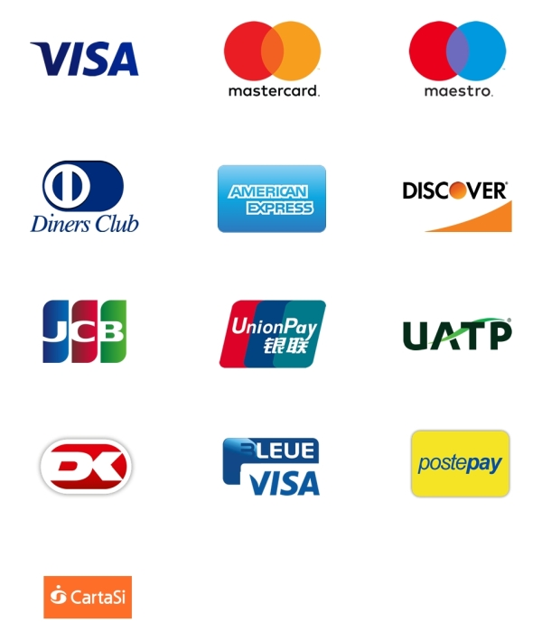
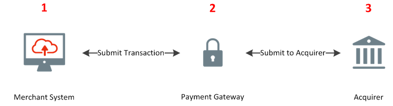

[#CreditCard]
=== Credit Card

[#CreditCard_Introduction]
==== Introduction
Credit Card payment is a payment method using a plastic card issued by a
bank, business, etc., for the purchase of goods or services on credit.

[#CreditCard_TestCredentials]
==== Test Credentials

[cols="h,"]
|===
URL (Endpoint) | ``\https://api-test.wirecard.com/engine/rest/payments/`` |
Request Formats | XML, NVP, JSON |
Response Formats | XML, HTML, JSON |
Request Methods | POST |
Currencies | Visa and MC support basically all currencies. To get the full picture please refer to their manual.

JCB and UPI require an explicit setup of transaction currencies as part
of the acquirer license agreement. |

Countries | Depends on the licensed area of the financial institution/acquirer.
Wirecard Bank, for example, is licensed to process payments globally. |
|===

Refer to one of the following tables to complete your test
credentials:

.Non-3D (Manual Card Brand Recognition) Demo
[cols="h,"]
|===
|Merchant Account ID (MAID) |1b3be510-a992-48aa-8af9-6ba4c368a0ac
|Merchant Account Name |Wirecard CC/EFT DemoCC no CVC
|Username to access Test Account |70000-APIDEMO-CARD
|Password to access Test Account |ohysS0-dvfMx
|Secret Key |33a67608-9822-43c2-acc1-faf2947b1be5
|Mobile SDK Applicable | No
|===

.Non-3D (Manual Card Brand Recognition) Test
[cols="h,"]
|===
|Merchant Account ID (MAID) |9105bb4f-ae68-4768-9c3b-3eda968f57ea 
|Merchant Account Name | Wirecard CC/EFT TestCC no CVC
|Username to access Test Account | 70000-APILUHN-CARD
|Password to access Test Account | 8mhwavKVb91T
|Secret Key | d1efed51-4cb9-46a5-ba7b-0fdc87a66544
|Mobile SDK Applicable | Yes
|===

.3D (Manual Card Brand Recognition) Test
[cols="h,"]
|===
|Merchant Account ID (MAID) | 33f6d473-3036-4ca5-acb5-8c64dac862d1
|Merchant Account Name | Wirecard CC/EFT Simu3D no CVC
|Username to access Test Account | 70000-APILUHN-CARD
|Password to access Test Account | 8mhwavKVb91T
|Secret Key | 9e0130f6-2e1e-4185-b0d5-dc69079c75cc
|Mobile SDK Applicable | Yes
|===

.Non-3D (Automatic Card Brand Recognition) Demo
[cols="h,"]
|===
|Merchant Account ID (MAID) | 7a6dd74f-06ab-4f3f-a864-adc52687270a
|Merchant Account Name | Wirecard CC/EFT DemoCC no CVC
|Username to access Test Account | 70000-APIDEMO-CARD
|Password to access Test Account | ohysS0-dvfMx
|Secret Key | a8c3fce6-8df7-4fd6-a1fd-62fa229c5e55
|Mobile SDK Applicable | No
|===

.Non-3D (Automatic Card Brand Recognition) Test
[cols="h,"]
|===
|Merchant Account ID (MAID) | 07edc10b-d3f9-4d12-901f-0db7f4c7e75c
|Merchant Account Name | Wirecard CC/EFT TestCC no CVC
|Username to access Test Account | 70000-APIDEMO-CARD
|Password to access Test Account | 8mhwavKVb91T
|Secret Key | 65f1d302-b2ac-4c52-8e31-5cc5351a258b
|Mobile SDK Applicable | Yes
|===

.3D (Automatic Card Brand Recognition) Test
[cols="h,"]
|===
|Merchant Account ID (MAID) |cad16b4a-abf2-450d-bcb8-1725a4cef443 
|Merchant Account Name | Wirecard CC/EFT Simu3D no CVC
|Username to access Test Account | 70000-APILUHN-CARD
|Password to access Test Account | 8mhwavKVb91T
|Secret Key | b3b131ad-ea7e-48bc-9e71-78d0c6ea579d
|Mobile SDK Applicable | Yes
|===

.Original Credit Transaction (OCT) Test
[cols="h,"]
|===
|Merchant Account ID (MAID) |86687a11-3f9b-4f30-be54-8f22998b6177 
|Merchant Account Name |Merchant-Test-Accounts
|Username to access Test Account |70000-APILUHN-CARD
|Password to access Test Account |8mhwavKVb91T
|Secret Key |dce5ebea-28f0-4fce-b087-85465a138a83
|Mobile SDK Applicable |Yes
|===

.Non-3D Non-Gambling Original Credit Transaction (OCT) Test
[cols="h,"]
|===
|Merchant Account ID (MAID) |1d08d0ea-535e-4b1a-b50b-d1591e97b8ea
|Merchant Account Name |Merchant-Test-Accounts
|Username to access Test Account |70000-APILUHN-CARD
|Password to access Test Account |8mhwavKVb91T
|Secret Key |1ddab375-08da-4704-83da-36610518efcf
|Mobile SDK Applicable |Yes
|===

.3D Non-Gambling Original Credit Transaction (OCT) Test
[cols="h,"]
|===
|Merchant Account ID (MAID) |ba90c606-5d0b-45b9-9902-9b0542bba3a4
|Merchant Account Name |Merchant-Test-Accounts
|Username to access Test Account |70000-APILUHN-CARD
|Password to access Test Account |8mhwavKVb91T
|Secret Key |b30bf3cc-f365-4929-89e9-d1cbde890f84
|Mobile SDK Applicable | Yes
|===

[#CreditCard_Workflow]
==== Workflow

[#CreditCard_PaymentSolutions]
==== Payment Solutions
As payment solutions the Wirecard Payment Processing Gateway provides _Pay by Link_ and _Invoice via Email._ They both are currently only used with a Payment Page integration.

You can find

* _Pay by Link_ at <<PP_PaymentSolutions_PaybyLink, Payment Page>> and <<WPP_Features_PaybyLink, Wirecard Payment Page>>
* _Invoice via Email_ at <<PP_PaymentSolutions_InvoiceviaEmail, Payment Page>>
