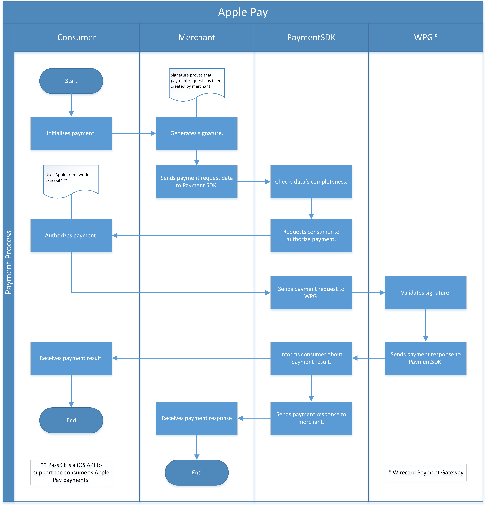

[#ApplePay]
=== Apple Pay

[#ApplePay_Introduction]
==== Introduction
[.clearfix]
--
[.right]

_Apple Pay_ supports credit and debit cards from the three major payment
organisations, namely American Express, MasterCard and Visa. When using
_Apple Pay_ in a shop, restaurant or other retailer, the name, credit
card number and security code are not visible to others.

_Apple Pay_ can be set up easily, with the consumer simply adding their
credit or debit card linked to the iTunes Store to their account.

Transactions are authorized with a unique number which is used by the
device account number. Instead of the security code on the back of the
card, _Apple Pay_ generates a dynamic security code to guarantee the
security of every transaction.

In-app online shopping with the iPhone is at your fingertips. Consumers
can pay for physical goods and services including clothes, electronics,
health and beauty artifacts, tickets and much more with Touch ID. The
payment process is confirmed in a single touch. The consumer need not
enter any account, dispatch or invoicing information. The card data is
handled with confidentiality meaning online retailers will not be
granted access.
--

[#ApplePay_TestAccount]
==== Test Account

Since _Apple Pay_ is a proprietary service, you have to have an Apple
Merchant ID and a Certificate Signing Request (csr-file) available
before you can setup _Apple Pay_.

* If you already have an Apple Merchant ID, you only need a CSR file.
See <<ApplePay_Workflow_ExistingAppleMerchantAccount, Apple Merchant Account exists>>.
* If you do not have an Apple Merchant ID, you need both, an Apple
Merchant ID and a CSR file. Wirecard's
<<ContactUs, Merchant Support>> will generate an Apple
Merchant ID for you. See <<ApplePay_Workflow_NoAppleMerchantAccount, Apple Merchant Account does not exist>>.

//-

You can find additional information in 
https://developer.apple.com/library/content/ApplePay_Guide/Configuration.html[Apple's own documentation].

If you have any questions, feel free to contact our <<ContactUs, Merchant Support>>.

After you've set up your accounts:

. https://developer.apple.com/support/apple-pay-sandbox/[Add a test card] 
to the wallet app.

. Integrate paymentSDK into your application.

. Conduct testing.

. Add a live card to the Wallet app and switch the _Wirecard
Payment Gateway_ instance to production mode (do not forget to
use production credentials - _MAID/SK/AppleMerchantID/csr_).

//-

[#ApplePay_Introduction_General]
==== General Information

[#ApplePay_Introduction_General_PaymentMode]
===== Payment Mode, Countries and Currencies

This table illustrates which payment mode _Apple Pay_ belongs
to. It also provides detailed information about the countries and
currencies, which are relevant for _Apple Pay_.

//-

[%autowidth]
|===
s|Payment Mode |<<PaymentMethods_PaymentMode_Wallet, Wallet>>, <<PaymentMethods_PaymentMode_MobilePayment, Mobile Payment>>
s|Countries |International
s|Currencies |EUR, GBP, CHF
|===

//-

[#ApplePay_Introduction_General_CommunicationFormats]
===== Communication Formats

This table illustrates how _Apple Pay_ notifications are
encoded and which languages and methods can be used for requests and
responses.

[%autowidth]
|===
.2+h|Requests/Responses | Format | XML
                        | Methods | POST, GET
h|IPN Encodement      2+| Base64
|===

[#ApplePay_TransactionTypes]
==== Transaction Types

[cols=",,]
|===
|Transaction Type ({payment-gateway-abbr} <<ApplePay_TransactionTypes_Footnote, ^(*)^>>) |Transaction Type (Apple Pay) |Link to the sample

|_authorization_ |Authorizations
|<<ApplePay_Samples_Authorization, _authorization_ sample>>
|_purchase_ |One-Time
|<<ApplePay_Samples_Purchase, _purchase_ sample>>
|_capture-authorization_ |Partial shipment
|<<ApplePay_Samples_CaptureAuthorization, _capture-authorization_ sample>>
|_refund-capture_, _refund-purchase_ |Refund
|<<ApplePay_Samples_Refund, _refund_ sample>>
|_void-authorization_ |Void
|<<ApplePay_Samples_Void, _void_ sample>>
|===

[#ApplePay_TransactionTypes_Footnote]
(*) {payment-gateway-abbr} = {payment-gateway}

For <<Glossary_TransactionType, transaction type>> details which are not given here, look
at <<AppendixB, Appendix B: Transaction Types>>.

[#ApplePay_TestCredentials]
==== Test Credentials

[NOTE]
====
.Test merchant account

There is no public merchant-account available. Apple Pay can be enabled
to a specific merchant provided that they have a CSR and an Apple
Merchant Account.
====

[%autowidth]
[%noheader]
[cols=",,"]
|===
.2+|URLs (Endpoints)
|To Test Environment
|``\https://{test-instance-hostname}/engine/rest/paymentmethods/``
|To Production Environment
|``\https://api.wirecard.com/engine/rest/paymentmethods/``
|Apple Merchant ID
2+|The merchant needs an Apple Merchant ID (merchant identifier), which can be
generated in the Apple Developer Portal. For details see
"Create a merchant identifier" in
https://developer.apple.com/documentation/passkit/apple_pay/setting_up_apple_pay_requirements[Setting Up Apple Pay Requirements.]
Just as well, you may ask Wirecard's <<ContactUs, Merchant Support>> to
generate an Apple Merchant ID for you, see
<<ApplePay_Workflow_NoAppleMerchantAccount, Apple Merchant ID does not exist>>.
|csr-file
2+|The merchant can use _Apple Pay_ only if the Apple Merchant ID is associated
with a Certificate Signing Request (csr-file). This csr-file is generated by
Wirecard's <<ContactUs, Merchant Support>>, see
<<ApplePay_TestCredentials_GenerateaCsrFileviaAppleMerchantID, Generate a csr-file via Apple Merchant ID>>.
|===

[#ApplePay_TestCredentials_GenerateaCsrFileviaAppleMerchantID]
===== Generate a csr-file via Apple Merchant ID

[cols="a,a"]
[frame="none"]
[grid="none"]
|===
|[#ApplePay_Workflow_ExistingAppleMerchantAccount]
.Apple Merchant Account exists
image::images/11-04-apple-pay/ApplePay_MAID_Workflow_AppleAccount_yes.png[Existing Apple Merchant Account]
|[#ApplePay_Workflow_NoAppleMerchantAccount]
.Apple Merchant Account does not exist
image::images/11-04-apple-pay/ApplePay_MAID_Workflow_AppleAccount_no.png[No existing Apple Merchant Account]
|===

[#ApplePay_Workflow]
==== Workflow

[#ApplePay_Fields]
==== Fields

`cryptogram-value` is optional in the response. +

All the other fields used for _Apple Pay_ requests, responses and
notifications are the same as the <<RestApi_Fields, REST API Fields>>.

[#ApplePay_Samples]
==== Samples

[NOTE]
====
Apple provides payment data in JSON format. This payment data can be
used as cryptogram value when using an iOS device. To use the cryptogram
value with ReST API the merchant must encode it to Base64.

See _Apple Pay_ encryption details:

https://developer.apple.com/documentation/apple_pay_on_the_web/applepaypaymenttoken/1916115-paymentdata

https://developer.apple.com/documentation/passkit/pkpaymenttoken/1617000-paymentdata?language=objc
====

[#ApplePay_Samples_Authorization]

===== _authorization_

.XML _authorization_ Request (Successful)

[source,XML]
----
<payment xmlns="http://www.elastic-payments.com/schema/payment">
   <merchant-account-id>56d2c680-52e8-492e-9c08-49f6f609089e</merchant-account-id>
   <request-id>d39e8fef-718c-435c-b6d7-ec9917d80691</request-id>
   <transaction-type>authorization</transaction-type>
   <cryptogram>
      <cryptogram-type>apple-pay</cryptogram-type>
      <cryptogram-value>eyJ2ZXJzaW9uIjoiRUNfdjEiLCJkYXRhIjoiNnZ3VjVMaFBFNEhldTY0RnFMWGVraWhRQ2VlMUFySUY5engyVnI1Y0Z0TE5UZnltRW9wTi9uc1ZXVjZ3ZkJjNGJ4SVZoNTlrWHhRUk5TYU80Qm5xNGVjZm9ma3piYUdNS2lGcUZFc2x4RzYvWHY1TmFKOTdmL3Bsek1McGJYbTFkTjkzSitHdDEyc2crR3Z4VjNJSTJvTU11MXk4c0QwUEZlNXZqVzZDYmNWbnAydkZISlE0bktRaThpQkdLaVZCeEl5eG0ybWtUTkg0bDU3UU5CVGtqUGVLU2VZTG1MV0ZCSTlTakZKVjRHV1lTZFJCVGQxWlJSVERKdkJ2LzlNWkUwT0tKcVZyS1QxZm9UQWIwRndUS0dPUktmVjFSNVJDWUluRXk4aVhlN3BlVUNtckVDNXYxNG9TZWczVnhiSlZhSytJaTUxOUxXbzFFUXR3SzI1MGlwYkdweWsrU21pbVFHUUZGS3BJdU16Sys5YzgzWlkzY2EzbGcxQW9NL3VjVlZqcUhmUTRwU2hGcVBzPSIsInNpZ25hdHVyZSI6Ik1JQUdDU3FHU0liM0RRRUhBcUNBTUlBQ0FRRXhEekFOQmdsZ2hrZ0JaUU1FQWdFRkFEQ0FCZ2txaGtpRzl3MEJCd0VBQUtDQU1JSUQ0akNDQTRpZ0F3SUJBZ0lJSkVQeXFBYWQ5WGN3Q2dZSUtvWkl6ajBFQXdJd2VqRXVNQ3dHQTFVRUF3d2xRWEJ3YkdVZ1FYQndiR2xqWVhScGIyNGdTVzUwWldkeVlYUnBiMjRnUTBFZ0xTQkhNekVtTUNRR0ExVUVDd3dkUVhCd2JHVWdRMlZ5ZEdsbWFXTmhkR2x2YmlCQmRYUm9iM0pwZEhreEV6QVJCZ05WQkFvTUNrRndjR3hsSUVsdVl5NHhDekFKQmdOVkJBWVRBbFZUTUI0WERURTBNRGt5TlRJeU1EWXhNVm9YRFRFNU1Ea3lOREl5TURZeE1Wb3dYekVsTUNNR0ExVUVBd3djWldOakxYTnRjQzFpY205clpYSXRjMmxuYmw5VlF6UXRVRkpQUkRFVU1CSUdBMVVFQ3d3TGFVOVRJRk41YzNSbGJYTXhFekFSQmdOVkJBb01Da0Z3Y0d4bElFbHVZeTR4Q3pBSkJnTlZCQVlUQWxWVE1Ga3dFd1lIS29aSXpqMENBUVlJS29aSXpqMERBUWNEUWdBRXdoVjM3ZXZXeDdJaGoyamRjSkNoSVkzSHNMMXZMQ2c5aEdDVjJVcjBwVUViZzBJTzJCSHpRSDZETXg4Y1ZNUDM2eklnMXJyVjFPLzBrb21KUG53UEU2T0NBaEV3Z2dJTk1FVUdDQ3NHQVFVRkJ3RUJCRGt3TnpBMUJnZ3JCZ0VGQlFjd0FZWXBhSFIwY0RvdkwyOWpjM0F1WVhCd2JHVXVZMjl0TDI5amMzQXdOQzFoY0hCc1pXRnBZMkV6TURFd0hRWURWUjBPQkJZRUZKUlgyMi9WZElHR2lZbDJMMzVYaFFmbm0xZ2tNQXdHQTFVZEV3RUIvd1FDTUFBd0h3WURWUjBqQkJnd0ZvQVVJL0pKeEUrVDVPOG41c1QyS0d3L29ydjlMa3N3Z2dFZEJnTlZIU0FFZ2dFVU1JSUJFRENDQVF3R0NTcUdTSWIzWTJRRkFUQ0IvakNCd3dZSUt3WUJCUVVIQWdJd2diWU1nYk5TWld4cFlXNWpaU0J2YmlCMGFHbHpJR05sY25ScFptbGpZWFJsSUdKNUlHRnVlU0J3WVhKMGVTQmhjM04xYldWeklHRmpZMlZ3ZEdGdVkyVWdiMllnZEdobElIUm9aVzRnWVhCd2JHbGpZV0pzWlNCemRHRnVaR0Z5WkNCMFpYSnRjeUJoYm1RZ1kyOXVaR2wwYVc5dWN5QnZaaUIxYzJVc0lHTmxjblJwWm1sallYUmxJSEJ2YkdsamVTQmhibVFnWTJWeWRHbG1hV05oZEdsdmJpQndjbUZqZEdsalpTQnpkR0YwWlcxbGJuUnpMakEyQmdnckJnRUZCUWNDQVJZcWFIUjBjRG92TDNkM2R5NWhjSEJzWlM1amIyMHZZMlZ5ZEdsbWFXTmhkR1ZoZFhSb2IzSnBkSGt2TURRR0ExVWRId1F0TUNzd0thQW5vQ1dHSTJoMGRIQTZMeTlqY213dVlYQndiR1V1WTI5dEwyRndjR3hsWVdsallUTXVZM0pzTUE0R0ExVWREd0VCL3dRRUF3SUhnREFQQmdrcWhraUc5Mk5rQmgwRUFnVUFNQW9HQ0NxR1NNNDlCQU1DQTBnQU1FVUNJSEtLbncrU295cTVtWFFyMVY2MmMwQlhLcGFIb2RZdTlUV1hFUFVXUHBicEFpRUFrVGVjZlc2K1c1bDByMEFEZnpUQ1BxMll0YlMzOXcwMVhJYXlxQk55OGJFd2dnTHVNSUlDZGFBREFnRUNBZ2hKYlMrL09wamFsekFLQmdncWhrak9QUVFEQWpCbk1Sc3dHUVlEVlFRRERCSkJjSEJzWlNCU2IyOTBJRU5CSUMwZ1J6TXhKakFrQmdOVkJBc01IVUZ3Y0d4bElFTmxjblJwWm1sallYUnBiMjRnUVhWMGFHOXlhWFI1TVJNd0VRWURWUVFLREFwQmNIQnNaU0JKYm1NdU1Rc3dDUVlEVlFRR0V3SlZVekFlRncweE5EQTFNRFl5TXpRMk16QmFGdzB5T1RBMU1EWXlNelEyTXpCYU1Ib3hMakFzQmdOVkJBTU1KVUZ3Y0d4bElFRndjR3hwWTJGMGFXOXVJRWx1ZEdWbmNtRjBhVzl1SUVOQklDMGdSek14SmpBa0JnTlZCQXNNSFVGd2NHeGxJRU5sY25ScFptbGpZWFJwYjI0Z1FYVjBhRzl5YVhSNU1STXdFUVlEVlFRS0RBcEJjSEJzWlNCSmJtTXVNUXN3Q1FZRFZRUUdFd0pWVXpCWk1CTUdCeXFHU000OUFnRUdDQ3FHU000OUF3RUhBMElBQlBBWEVZUVoxMlNGMVJwZUpZRUhkdWlBb3UvZWU2NU40STM4UzVQaE0xYlZabHMxcmlMUWwzWU5JazU3dWdqOWRoZk9pTXQydTJad3Zzam9LWVQvVkVXamdmY3dnZlF3UmdZSUt3WUJCUVVIQVFFRU9qQTRNRFlHQ0NzR0FRVUZCekFCaGlwb2RIUndPaTh2YjJOemNDNWhjSEJzWlM1amIyMHZiMk56Y0RBMExXRndjR3hsY205dmRHTmhaek13SFFZRFZSME9CQllFRkNQeVNjUlBrK1R2SitiRTlpaHNQNks3L1M1TE1BOEdBMVVkRXdFQi93UUZNQU1CQWY4d0h3WURWUjBqQkJnd0ZvQVV1N0Rlb1ZnemlKcWtpcG5ldnIzcnI5ckxKS3N3TndZRFZSMGZCREF3TGpBc29DcWdLSVltYUhSMGNEb3ZMMk55YkM1aGNIQnNaUzVqYjIwdllYQndiR1Z5YjI5MFkyRm5NeTVqY213d0RnWURWUjBQQVFIL0JBUURBZ0VHTUJBR0NpcUdTSWIzWTJRR0FnNEVBZ1VBTUFvR0NDcUdTTTQ5QkFNQ0EyY0FNR1FDTURyUGNvTlJGcG14aHZzMXcxYktZci8wRiszWkQzVk5vbzYrOFp5QlhrSzNpZmlZOTV0Wm41alZRUTJQbmVuQy9nSXdNaTNWUkNHd293VjNiRjN6T0R1UVovMFhmQ3doYlpaUHhuSnBnaEp2VlBoNmZSdVp5NXNKaVNGaEJwa1BDWklkQUFBeGdnR01NSUlCaUFJQkFUQ0JoakI2TVM0d0xBWURWUVFERENWQmNIQnNaU0JCY0hCc2FXTmhkR2x2YmlCSmJuUmxaM0poZEdsdmJpQkRRU0F0SUVjek1TWXdKQVlEVlFRTERCMUJjSEJzWlNCRFpYSjBhV1pwWTJGMGFXOXVJRUYxZEdodmNtbDBlVEVUTUJFR0ExVUVDZ3dLUVhCd2JHVWdTVzVqTGpFTE1Ba0dBMVVFQmhNQ1ZWTUNDQ1JEOHFnR25mVjNNQTBHQ1dDR1NBRmxBd1FDQVFVQW9JR1ZNQmdHQ1NxR1NJYjNEUUVKQXpFTEJna3Foa2lHOXcwQkJ3RXdIQVlKS29aSWh2Y05BUWtGTVE4WERURTRNRE13T0RFeU1Ua3lORm93S2dZSktvWklodmNOQVFrME1SMHdHekFOQmdsZ2hrZ0JaUU1FQWdFRkFLRUtCZ2dxaGtqT1BRUURBakF2QmdrcWhraUc5dzBCQ1FReElnUWdodHMwT2Q2cXNORVluZmRzTzFVQzZrR1pvY2ZRKzdOOE01U3FWOWRmNVRZd0NnWUlLb1pJemowRUF3SUVSekJGQWlBL056SzZpaCsyWUxndTBkWDdwYXFDSUpnRWYvMDVCZzV0cStuRUtnem8zZ0loQUlPa2lUTXhkSXBBRTRGckJzOFR4Mm1Nc1U2cndZcVdNWlkwUVVvTkVFa3lBQUFBQUFBQSIsImhlYWRlciI6eyJlcGhlbWVyYWxQdWJsaWNLZXkiOiJNRmt3RXdZSEtvWkl6ajBDQVFZSUtvWkl6ajBEQVFjRFFnQUU0QmNOYWtpS28vZDdtRXhJTDZjNGQ1Zk5UUVJLQVdST3BDZDh1OElLeGxBSmw1M2lUZDNteU0wTUJsYVlDVlhlNGJobXVzMDlpQjJTR2NPN1pkMVQwUT09IiwicHVibGljS2V5SGFzaCI6Ik5FbWhiR2hrajNhTFpzWUlEa3VKTmJYckRVTE12d0N5TlpkQVl1Y0EydXc9IiwidHJhbnNhY3Rpb25JZCI6IjAxODRlZjc4OTJiYmRhMmE1NjNjZDc1MTM1Yjk5NjIzYTkwYWJjYmFlN2VmNzZhZWQxYTRkZjAxODA5NDkwY2MifX0=</cryptogram-value>
   </cryptogram>
   <payment-methods>
      <payment-method name="creditcard "/>
   </payment-methods>
</payment>
----

.XML _authorization_ Response (Successful)

[source,XML]
----
<payment self="https://i-elastic-int05.wirecard.sys:443/engine/rest/merchants/56d2c680-52e8-492e-9c08-49f6f609089e/payments/126cf4e3-e411-46eb-9120-92d5ab8aa76f" xmlns="http://www.elastic-payments.com/schema/payment" xmlns:ns2="http://www.elastic-payments.com/schema/epa/transaction">
   <merchant-account-id ref="https://i-elastic-int05.wirecard.sys:443/engine/rest/config/merchants/56d2c680-52e8-492e-9c08-49f6f609089e">56d2c680-52e8-492e-9c08-49f6f609089e</merchant-account-id>
   <transaction-id>126cf4e3-e411-46eb-9120-92d5ab8aa76f</transaction-id>
   <request-id>d39e8fef-718c-435c-b6d7-ec9917d80691</request-id>
   <transaction-type>authorization</transaction-type>
   <transaction-state>success</transaction-state>
   <completion-time-stamp>2018-02-05T09:12:41.000Z</completion-time-stamp>
   <statuses>
      <status code="201.0000" description="3d-acquirer:The resource was successfully created." severity="information"/>
   </statuses>
   <requested-amount currency="GBP">0.02</requested-amount>
   <cryptogram>
      <cryptogram-type>apple-pay</cryptogram-type>
   </cryptogram>
    <descriptor>demo descriptor</descriptor>
   <payment-methods>
      <payment-method name="creditcard"/>
   </payment-methods>
   <authorization-code>153620</authorization-code>
   <api-id>elastic-api</api-id>
 </payment>
----

[#ApplePay_Samples_ReferencedAuthorization]

===== _referenced-authorization_

.XML _referenced-authorization_ Request (Successful)

[source,XML]
----
<?xml version="1.0" encoding="UTF-8" standalone="yes"?>
<payment xmlns="http://www.elastic-payments.com/schema/payment">
   <merchant-account-id>56d2c680-52e8-492e-9c08-49f6f609089e</merchant-account-id>
   <request-id>d18ec4e0-7951-458a-b93e-784e312c6ead</request-id>
   <transaction-type>referenced-authorization</transaction-type>
   <parent-transaction-id>126cf4e3-e411-46eb-9120-92d5ab8aa76f</parent-transaction-id>
   <periodic>
      <periodic-type>recurring</periodic-type>
   </periodic>
</payment>
----

.XML _referenced-authorization_ Response (Successful)

[source,XML]
----
<?xml version="1.0" encoding="UTF-8"?>
<payment xmlns="http://www.elastic-payments.com/schema/payment" xmlns:ns2="http://www.elastic-payments.com/schema/epa/transaction" self="https://i-elastic-int05.wirecard.sys:443/engine/rest/merchants/56d2c680-52e8-492e-9c08-49f6f609089e/payments/a6edbfd0-5c66-4258-9524-aefcf19b3817">
   <merchant-account-id ref="https://i-elastic-int05.wirecard.sys:443/engine/rest/config/merchants/56d2c680-52e8-492e-9c08-49f6f609089e">56d2c680-52e8-492e-9c08-49f6f609089e</merchant-account-id>
   <transaction-id>a6edbfd0-5c66-4258-9524-aefcf19b3817</transaction-id>
   <request-id>d18ec4e0-7951-458a-b93e-784e312c6ead</request-id>
   <transaction-type>referenced-authorization</transaction-type>
   <transaction-state>success</transaction-state>
   <completion-time-stamp>2018-02-05T09:12:43.000Z</completion-time-stamp>
   <statuses>
      <status code="201.0000" description="3d-acquirer:The resource was successfully created." severity="information" />
   </statuses>
   <requested-amount currency="GBP">0.02</requested-amount>
   <parent-transaction-id>126cf4e3-e411-46eb-9120-92d5ab8aa76f</parent-transaction-id>
   <cryptogram>
      <cryptogram-type>apple-pay</cryptogram-type>
   </cryptogram>
   <descriptor>demo descriptor</descriptor>
   <payment-methods>
      <payment-method name="creditcard" />
   </payment-methods>
   <parent-transaction-amount currency="GBP">0.020000</parent-transaction-amount>
   <authorization-code>153620</authorization-code>
   <api-id>elastic-api</api-id>
   <periodic>
      <periodic-type>recurring</periodic-type>
   </periodic>
</payment>
----

[#ApplePay_Samples_CaptureAuthorization]

===== _capture-authorization_

.XML _capture-authorization_ Request (Successful)

[source,XML]
----
<payment xmlns="http://www.elastic-payments.com/schema/payment">
    <merchant-account-id>${merchant-account-id}</merchant-account-id>
    <request-id>${request-id}</request-id>
    <transaction-type>capture-authorization</transaction-type>
    <parent-transaction-id>${parent-transaction-id}</parent-transaction-id>
</payment>
----

.XML _capture-authorization_ Response (Successful)

[source,XML]
----
<payment self="http://127.0.0.1:8080/engine/rest/merchants/7d726581-88ac-48bc-ac3e-3a1b3d57dade/payments/407288d0-34ab-4a1f-a5a2-756ab8b26e41" xmlns="http://www.elastic-payments.com/schema/payment" xmlns:ns2="http://www.elastic-payments.com/schema/epa/transaction">
   <merchant-account-id ref="http://127.0.0.1:8080/engine/rest/config/merchants/7d726581-88ac-48bc-ac3e-3a1b3d57dade">7d726581-88ac-48bc-ac3e-3a1b3d57dade</merchant-account-id>
   <transaction-id>407288d0-34ab-4a1f-a5a2-756ab8b26e41</transaction-id>
   <request-id>a1ebbc7d-d23b-4406-9044-ffa19b560645</request-id>
   <transaction-type>capture-authorization</transaction-type>
   <transaction-state>success</transaction-state>
   <completion-time-stamp>2018-02-28T09:50:47.000+01:00</completion-time-stamp>
   <statuses>
      <status code="201.0000" description="3d-acquirer:The resource was successfully created." severity="information"/>
   </statuses>
   <requested-amount currency="GBP">0.02</requested-amount>
   <parent-transaction-id>2f0a5103-a353-4876-b03d-1a2880979143</parent-transaction-id>
   <card>
      <expiration-month xsi:nil="true" xmlns:xsi="http://www.w3.org/2001/XMLSchema-instance"/>
      <expiration-year xsi:nil="true" xmlns:xsi="http://www.w3.org/2001/XMLSchema-instance"/>
      <card-type>visa</card-type>
   </card>
   <cryptogram>
      <cryptogram-type>apple-pay</cryptogram-type>
   </cryptogram>
   <descriptor>demo descriptor</descriptor>
   <payment-methods>
      <payment-method name="creditcard"/>
   </payment-methods>
   <parent-transaction-amount currency="GBP">0.020000</parent-transaction-amount>
   <authorization-code>153620</authorization-code>
   <api-id>elastic-api</api-id>
</payment>
----

[#ApplePay_Samples_Purchase]

===== _purchase_

.XML _purchase_ Request (Successful)

[source,XML]
----
<payment xmlns="http://www.elastic-payments.com/schema/payment">
    <merchant-account-id>${merchant-account-id}</merchant-account-id>
    <request-id>${request-id}</request-id>
    <transaction-type>purchase</transaction-type>
    <cryptogram>
        <cryptogram-value>eyJ2ZXJzaW9uIjoiRUNfdjEiLCJkYXRhIjoiMFpLcnNhQUFDMjBpZG9uTUpEbGl6NUt4bGhYM3k1dFEzRjQ5R2tBaXJPbkZXMkE0RkVVYnlXWkczSVpRY1ZaMXlHR2U5SFA5Uk00aWloVUF4OVJ1M3NhcVg3WW5saWZ1bk9NWHJUcVNIQmhKd1Vzb0t5RStraXdrTUQ2U3RtelhqVVpVR0VNOHlvcXA3di9KYXZ0MUZKUEUyMkFyLzZWMzYvekJJaDd6dkNsMzhnRkZZSHYydzc3RGMwMk95R1RDQVFkanpCSkxtU2Q4d0JSWDFmSVI2R0k1N0VXa1pZd0pSaHBROE5FQ05UUmg5NDVmRWVmR2E4QVB2NHh5TXFYVE1xK2pVWFhSSG5JNitRYlQyVk8wbUJIempCK2Y1R2ZJMWU2T0ROUktBc1B0SkVLT2QvSlROdWlUL0VaeFFITUJkTlVPeEVhRVB3ZWkvOVZFT0Y3dHkzUWZCbTFWVjY2Y1J0YThUUzRRRmVwYUxHZnQrd1B1OTZua1I0YWEvSnlYYktsbGkrWldBRWNiWGc9PSIsInNpZ25hdHVyZSI6Ik1JQUdDU3FHU0liM0RRRUhBcUNBTUlBQ0FRRXhEekFOQmdsZ2hrZ0JaUU1FQWdFRkFEQ0FCZ2txaGtpRzl3MEJCd0VBQUtDQU1JSUQ0akNDQTRpZ0F3SUJBZ0lJSkVQeXFBYWQ5WGN3Q2dZSUtvWkl6ajBFQXdJd2VqRXVNQ3dHQTFVRUF3d2xRWEJ3YkdVZ1FYQndiR2xqWVhScGIyNGdTVzUwWldkeVlYUnBiMjRnUTBFZ0xTQkhNekVtTUNRR0ExVUVDd3dkUVhCd2JHVWdRMlZ5ZEdsbWFXTmhkR2x2YmlCQmRYUm9iM0pwZEhreEV6QVJCZ05WQkFvTUNrRndjR3hsSUVsdVl5NHhDekFKQmdOVkJBWVRBbFZUTUI0WERURTBNRGt5TlRJeU1EWXhNVm9YRFRFNU1Ea3lOREl5TURZeE1Wb3dYekVsTUNNR0ExVUVBd3djWldOakxYTnRjQzFpY205clpYSXRjMmxuYmw5VlF6UXRVRkpQUkRFVU1CSUdBMVVFQ3d3TGFVOVRJRk41YzNSbGJYTXhFekFSQmdOVkJBb01Da0Z3Y0d4bElFbHVZeTR4Q3pBSkJnTlZCQVlUQWxWVE1Ga3dFd1lIS29aSXpqMENBUVlJS29aSXpqMERBUWNEUWdBRXdoVjM3ZXZXeDdJaGoyamRjSkNoSVkzSHNMMXZMQ2c5aEdDVjJVcjBwVUViZzBJTzJCSHpRSDZETXg4Y1ZNUDM2eklnMXJyVjFPLzBrb21KUG53UEU2T0NBaEV3Z2dJTk1FVUdDQ3NHQVFVRkJ3RUJCRGt3TnpBMUJnZ3JCZ0VGQlFjd0FZWXBhSFIwY0RvdkwyOWpjM0F1WVhCd2JHVXVZMjl0TDI5amMzQXdOQzFoY0hCc1pXRnBZMkV6TURFd0hRWURWUjBPQkJZRUZKUlgyMi9WZElHR2lZbDJMMzVYaFFmbm0xZ2tNQXdHQTFVZEV3RUIvd1FDTUFBd0h3WURWUjBqQkJnd0ZvQVVJL0pKeEUrVDVPOG41c1QyS0d3L29ydjlMa3N3Z2dFZEJnTlZIU0FFZ2dFVU1JSUJFRENDQVF3R0NTcUdTSWIzWTJRRkFUQ0IvakNCd3dZSUt3WUJCUVVIQWdJd2diWU1nYk5TWld4cFlXNWpaU0J2YmlCMGFHbHpJR05sY25ScFptbGpZWFJsSUdKNUlHRnVlU0J3WVhKMGVTQmhjM04xYldWeklHRmpZMlZ3ZEdGdVkyVWdiMllnZEdobElIUm9aVzRnWVhCd2JHbGpZV0pzWlNCemRHRnVaR0Z5WkNCMFpYSnRjeUJoYm1RZ1kyOXVaR2wwYVc5dWN5QnZaaUIxYzJVc0lHTmxjblJwWm1sallYUmxJSEJ2YkdsamVTQmhibVFnWTJWeWRHbG1hV05oZEdsdmJpQndjbUZqZEdsalpTQnpkR0YwWlcxbGJuUnpMakEyQmdnckJnRUZCUWNDQVJZcWFIUjBjRG92TDNkM2R5NWhjSEJzWlM1amIyMHZZMlZ5ZEdsbWFXTmhkR1ZoZFhSb2IzSnBkSGt2TURRR0ExVWRId1F0TUNzd0thQW5vQ1dHSTJoMGRIQTZMeTlqY213dVlYQndiR1V1WTI5dEwyRndjR3hsWVdsallUTXVZM0pzTUE0R0ExVWREd0VCL3dRRUF3SUhnREFQQmdrcWhraUc5Mk5rQmgwRUFnVUFNQW9HQ0NxR1NNNDlCQU1DQTBnQU1FVUNJSEtLbncrU295cTVtWFFyMVY2MmMwQlhLcGFIb2RZdTlUV1hFUFVXUHBicEFpRUFrVGVjZlc2K1c1bDByMEFEZnpUQ1BxMll0YlMzOXcwMVhJYXlxQk55OGJFd2dnTHVNSUlDZGFBREFnRUNBZ2hKYlMrL09wamFsekFLQmdncWhrak9QUVFEQWpCbk1Sc3dHUVlEVlFRRERCSkJjSEJzWlNCU2IyOTBJRU5CSUMwZ1J6TXhKakFrQmdOVkJBc01IVUZ3Y0d4bElFTmxjblJwWm1sallYUnBiMjRnUVhWMGFHOXlhWFI1TVJNd0VRWURWUVFLREFwQmNIQnNaU0JKYm1NdU1Rc3dDUVlEVlFRR0V3SlZVekFlRncweE5EQTFNRFl5TXpRMk16QmFGdzB5T1RBMU1EWXlNelEyTXpCYU1Ib3hMakFzQmdOVkJBTU1KVUZ3Y0d4bElFRndjR3hwWTJGMGFXOXVJRWx1ZEdWbmNtRjBhVzl1SUVOQklDMGdSek14SmpBa0JnTlZCQXNNSFVGd2NHeGxJRU5sY25ScFptbGpZWFJwYjI0Z1FYVjBhRzl5YVhSNU1STXdFUVlEVlFRS0RBcEJjSEJzWlNCSmJtTXVNUXN3Q1FZRFZRUUdFd0pWVXpCWk1CTUdCeXFHU000OUFnRUdDQ3FHU000OUF3RUhBMElBQlBBWEVZUVoxMlNGMVJwZUpZRUhkdWlBb3UvZWU2NU40STM4UzVQaE0xYlZabHMxcmlMUWwzWU5JazU3dWdqOWRoZk9pTXQydTJad3Zzam9LWVQvVkVXamdmY3dnZlF3UmdZSUt3WUJCUVVIQVFFRU9qQTRNRFlHQ0NzR0FRVUZCekFCaGlwb2RIUndPaTh2YjJOemNDNWhjSEJzWlM1amIyMHZiMk56Y0RBMExXRndjR3hsY205dmRHTmhaek13SFFZRFZSME9CQllFRkNQeVNjUlBrK1R2SitiRTlpaHNQNks3L1M1TE1BOEdBMVVkRXdFQi93UUZNQU1CQWY4d0h3WURWUjBqQkJnd0ZvQVV1N0Rlb1ZnemlKcWtpcG5ldnIzcnI5ckxKS3N3TndZRFZSMGZCREF3TGpBc29DcWdLSVltYUhSMGNEb3ZMMk55YkM1aGNIQnNaUzVqYjIwdllYQndiR1Z5YjI5MFkyRm5NeTVqY213d0RnWURWUjBQQVFIL0JBUURBZ0VHTUJBR0NpcUdTSWIzWTJRR0FnNEVBZ1VBTUFvR0NDcUdTTTQ5QkFNQ0EyY0FNR1FDTURyUGNvTlJGcG14aHZzMXcxYktZci8wRiszWkQzVk5vbzYrOFp5QlhrSzNpZmlZOTV0Wm41alZRUTJQbmVuQy9nSXdNaTNWUkNHd293VjNiRjN6T0R1UVovMFhmQ3doYlpaUHhuSnBnaEp2VlBoNmZSdVp5NXNKaVNGaEJwa1BDWklkQUFBeGdnRmVNSUlCV2dJQkFUQ0JoakI2TVM0d0xBWURWUVFERENWQmNIQnNaU0JCY0hCc2FXTmhkR2x2YmlCSmJuUmxaM0poZEdsdmJpQkRRU0F0SUVjek1TWXdKQVlEVlFRTERCMUJjSEJzWlNCRFpYSjBhV1pwWTJGMGFXOXVJRUYxZEdodmNtbDBlVEVUTUJFR0ExVUVDZ3dLUVhCd2JHVWdTVzVqTGpFTE1Ba0dBMVVFQmhNQ1ZWTUNDQ1JEOHFnR25mVjNNQTBHQ1dDR1NBRmxBd1FDQVFVQW9Ha3dHQVlKS29aSWh2Y05BUWtETVFzR0NTcUdTSWIzRFFFSEFUQWNCZ2txaGtpRzl3MEJDUVV4RHhjTk1UWXdOVEl3TVRBMU5USXhXakF2QmdrcWhraUc5dzBCQ1FReElnUWdJY3hzK1U2UTMrVS9ZUnR4Tnp1VEJ3RGhxc0VlZFljaDdZZjJjVHIvVGNNd0NnWUlLb1pJemowRUF3SUVSakJFQWlBbzJ1eDJUOU9IVWtHdFNuVTZtZjFUK2N4ZEt2U2NJT2dRaGxMd0xsdFhUZ0lnWFppMHp2K0ozVFVFaFYvbTBEemRaVW1HeGdRVzlsQ3lrQktNdHVmVHk3Z0FBQUFBQUFBPSIsImhlYWRlciI6eyJlcGhlbWVyYWxQdWJsaWNLZXkiOiJNRmt3RXdZSEtvWkl6ajBDQVFZSUtvWkl6ajBEQVFjRFFnQUVaUlZZRzBLQkN5UkcyZzk2QnBpTHQ1bFlUcEc4Wm5VUWtmOHZIV1RpcU9hbnoydlNsVW5QM2l5QktTZzBkL1dsRVJEa3ZCMHBlUzJXN2ovYmZJZVJ4QT09IiwicHVibGljS2V5SGFzaCI6ImRjZlh4K0tUUGY1enQzV2hXQ016VXhWdkJrbU1rS05Jb1V4L1RNcWY4V289IiwidHJhbnNhY3Rpb25JZCI6IjBkYzRjZDRlNDE4MTkzZDI5OWM5MTgxOWVmY2YzZmUwYzZhMDQ1MTg3YzhlNTEyYzY3N2NmYTA2MTU2NzUzZTgifX0</cryptogram-value>
        <cryptogram-type>apple-pay</cryptogram-type>
    </cryptogram>
    <payment-methods>
        <payment-method name="${payment-method}"/>
    </payment-methods>
</payment>
----

.XML _purchase_ Response (Successful)

[source,XML]
----
<payment self="http://127.0.0.1:8080/engine/rest/merchants/7d726581-88ac-48bc-ac3e-3a1b3d57dade/payments/c89667c4-53c7-4719-89a1-23f2f3ea32af" xmlns="http://www.elastic-payments.com/schema/payment" xmlns:ns2="http://www.elastic-payments.com/schema/epa/transaction">
   <merchant-account-id ref="http://127.0.0.1:8080/engine/rest/config/merchants/7d726581-88ac-48bc-ac3e-3a1b3d57dade">7d726581-88ac-48bc-ac3e-3a1b3d57dade</merchant-account-id>
   <transaction-id>c89667c4-53c7-4719-89a1-23f2f3ea32af</transaction-id>
   <request-id>d662c15c-3826-4172-9902-00237b2fec54</request-id>
   <transaction-type>purchase</transaction-type>
   <transaction-state>success</transaction-state>
   <completion-time-stamp>2018-02-28T09:46:16.000+01:00</completion-time-stamp>
   <statuses>
      <status code="201.0000" description="3d-acquirer:The resource was successfully created." severity="information"/>
   </statuses>
   <requested-amount currency="GBP">0.02</requested-amount>
   <card>
      <expiration-month xsi:nil="true" xmlns:xsi="http://www.w3.org/2001/XMLSchema-instance"/>
      <expiration-year xsi:nil="true" xmlns:xsi="http://www.w3.org/2001/XMLSchema-instance"/>
      <card-type>visa</card-type>
   </card>
   <cryptogram>
      <cryptogram-type>apple-pay</cryptogram-type>
   </cryptogram>
   <descriptor>demo descriptor</descriptor>
   <payment-methods>
      <payment-method name="creditcard"/>
   </payment-methods>
   <authorization-code>153620</authorization-code>
   <api-id>elastic-api</api-id>
</payment>
----

[#ApplePay_Samples_ReferencedPurchase]

===== _referenced-purchase_

.XML _referenced-purchase_ Request (Successful)

[source,XML]
----
<payment xmlns="http://www.elastic-payments.com/schema/payment">
    <merchant-account-id>${merchant-account-id}</merchant-account-id>
    <request-id>${request-id}</request-id>
    <transaction-type>referenced-purchase</transaction-type>
    <parent-transaction-id>${parent-transaction-id}</parent-transaction-id>
    <periodic>
        <periodic-type>${periodic-type}</periodic-type>
    </periodic>
</payment>
----

.XML _referenced-purchase_ Response (Successful)

[source,XML]
----
<payment self="http://127.0.0.1:8080/engine/rest/merchants/7d726581-88ac-48bc-ac3e-3a1b3d57dade/payments/c55d7fc8-35f8-47b1-99bb-fda835e0ddbb" xmlns="http://www.elastic-payments.com/schema/payment" xmlns:ns2="http://www.elastic-payments.com/schema/epa/transaction">
   <merchant-account-id ref="http://127.0.0.1:8080/engine/rest/config/merchants/7d726581-88ac-48bc-ac3e-3a1b3d57dade">7d726581-88ac-48bc-ac3e-3a1b3d57dade</merchant-account-id>
   <transaction-id>c55d7fc8-35f8-47b1-99bb-fda835e0ddbb</transaction-id>
   <request-id>af214f73-a357-46d3-a1b4-e38214511ed7</request-id>
   <transaction-type>referenced-purchase</transaction-type>
   <transaction-state>success</transaction-state>
   <completion-time-stamp>2018-02-28T09:54:12.000+01:00</completion-time-stamp>
   <statuses>
      <status code="201.0000" description="3d-acquirer:The resource was successfully created." severity="information"/>
   </statuses>
   <requested-amount currency="GBP">0.02</requested-amount>
   <parent-transaction-id>e835c6e2-f64e-4151-8abf-106457544d26</parent-transaction-id>
   <card>
      <expiration-month xsi:nil="true" xmlns:xsi="http://www.w3.org/2001/XMLSchema-instance"/>
      <expiration-year xsi:nil="true" xmlns:xsi="http://www.w3.org/2001/XMLSchema-instance"/>
      <card-type>visa</card-type>
   </card>
   <cryptogram>
      <cryptogram-type>apple-pay</cryptogram-type>
   </cryptogram>
   <descriptor>demo descriptor</descriptor>
   <payment-methods>
      <payment-method name="creditcard"/>
   </payment-methods>
   <parent-transaction-amount currency="GBP">0.020000</parent-transaction-amount>
   <authorization-code>153620</authorization-code>
   <api-id>elastic-api</api-id>
   <periodic>
      <periodic-type>recurring</periodic-type>
   </periodic>
</payment>
----

[#ApplePay_Samples_Refund]

===== _refund-capture_

.XML _refund-capture_ Request (Successful)

[source,XML]
----
<payment xmlns="http://www.elastic-payments.com/schema/payment">
    <merchant-account-id>${merchant-account-id}</merchant-account-id>
    <request-id>${request-id}</request-id>
    <transaction-type>refund-capture</transaction-type>
    <parent-transaction-id>${parent-transaction-id}</parent-transaction-id>
</payment>
----

.XML _refund-capture_ Response (Successful)

[source,XML]
----
<payment self="http://127.0.0.1:8080/engine/rest/merchants/7d726581-88ac-48bc-ac3e-3a1b3d57dade/payments/e0b9ad15-99ee-4c37-851b-52811316d2c3" xmlns="http://www.elastic-payments.com/schema/payment" xmlns:ns2="http://www.elastic-payments.com/schema/epa/transaction">
   <merchant-account-id ref="http://127.0.0.1:8080/engine/rest/config/merchants/7d726581-88ac-48bc-ac3e-3a1b3d57dade">7d726581-88ac-48bc-ac3e-3a1b3d57dade</merchant-account-id>
   <transaction-id>e0b9ad15-99ee-4c37-851b-52811316d2c3</transaction-id>
   <request-id>5ae1e6b3-203d-423d-aa45-f9eb1264ca26</request-id>
   <transaction-type>refund-capture</transaction-type>
   <transaction-state>success</transaction-state>
   <completion-time-stamp>2018-02-28T09:50:48.000+01:00</completion-time-stamp>
   <statuses>
      <status code="201.0000" description="3d-acquirer:The resource was successfully created." severity="information"/>
   </statuses>
   <requested-amount currency="GBP">0.02</requested-amount>
   <parent-transaction-id>407288d0-34ab-4a1f-a5a2-756ab8b26e41</parent-transaction-id>
   <card>
      <expiration-month xsi:nil="true" xmlns:xsi="http://www.w3.org/2001/XMLSchema-instance"/>
      <expiration-year xsi:nil="true" xmlns:xsi="http://www.w3.org/2001/XMLSchema-instance"/>
      <card-type>visa</card-type>
   </card>
   <cryptogram>
      <cryptogram-type>apple-pay</cryptogram-type>
   </cryptogram>
   <descriptor>demo descriptor</descriptor>
   <payment-methods>
      <payment-method name="creditcard"/>
   </payment-methods>
   <parent-transaction-amount currency="GBP">0.020000</parent-transaction-amount>
   <authorization-code>153620</authorization-code>
   <api-id>elastic-api</api-id>
</payment>
----

[#ApplePay_Samples_Void]

===== _void-authorization_

.XML _void-authorization_ Request (Successful)

[source,XML]
----
<payment xmlns="http://www.elastic-payments.com/schema/payment">
    <merchant-account-id>${merchant-account-id}</merchant-account-id>
    <request-id>${request-id}</request-id>
    <transaction-type>void-authorization</transaction-type>
    <parent-transaction-id>${parent-transaction-id}</parent-transaction-id>
</payment>
----

.XML _void-authorization_ Response (Successful)

[source,XML]
----
<payment self="http://127.0.0.1:8080/engine/rest/merchants/7d726581-88ac-48bc-ac3e-3a1b3d57dade/payments/e3c3a6f1-6692-484a-b96b-76c5b2e3845a" xmlns="http://www.elastic-payments.com/schema/payment" xmlns:ns2="http://www.elastic-payments.com/schema/epa/transaction">
   <merchant-account-id ref="http://127.0.0.1:8080/engine/rest/config/merchants/7d726581-88ac-48bc-ac3e-3a1b3d57dade">7d726581-88ac-48bc-ac3e-3a1b3d57dade</merchant-account-id>
   <transaction-id>e3c3a6f1-6692-484a-b96b-76c5b2e3845a</transaction-id>
   <request-id>c8b513f5-c727-4f03-81e6-cbb817b0b085</request-id>
   <transaction-type>void-authorization</transaction-type>
   <transaction-state>success</transaction-state>
   <completion-time-stamp>2018-02-28T09:53:04.000+01:00</completion-time-stamp>
   <statuses>
      <status code="201.0000" description="3d-acquirer:The resource was successfully created." severity="information"/>
   </statuses>
   <requested-amount currency="GBP">0.02</requested-amount>
   <parent-transaction-id>dd9e64b7-c21b-4003-a98e-936e62744f00</parent-transaction-id>
   <card>
      <expiration-month xsi:nil="true" xmlns:xsi="http://www.w3.org/2001/XMLSchema-instance"/>
      <expiration-year xsi:nil="true" xmlns:xsi="http://www.w3.org/2001/XMLSchema-instance"/>
      <card-type>visa</card-type>
   </card>
   <cryptogram>
      <cryptogram-type>apple-pay</cryptogram-type>
   </cryptogram>
   <descriptor>demo descriptor</descriptor>
   <payment-methods>
      <payment-method name="creditcard"/>
   </payment-methods>
   <parent-transaction-amount currency="GBP">0.020000</parent-transaction-amount>
   <authorization-code>153620</authorization-code>
   <api-id>elastic-api</api-id>
</payment>
----
