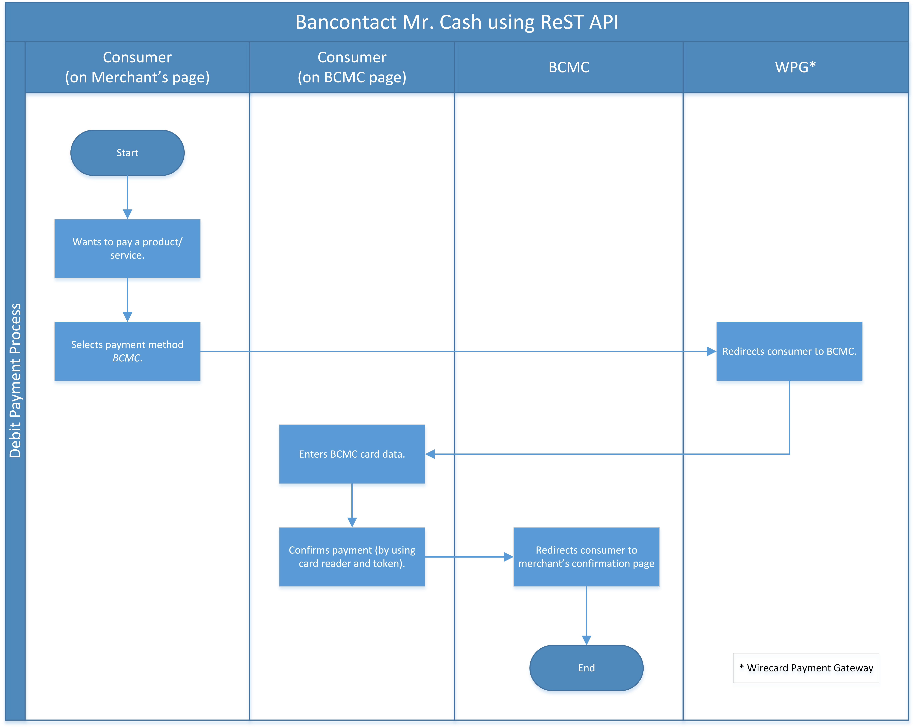
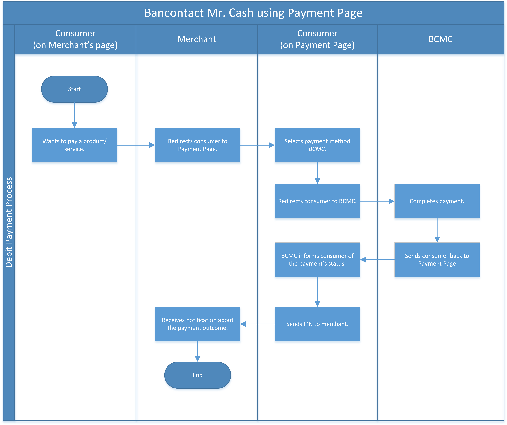

[#BancontactMisterCash]
=== Bancontact Mister Cash

[#BancontactMisterCash_Introduction]
==== Introduction

Bancontact Mister Cash (BCMC) is the most popular internet payment
method in Belgium. It is used in more than 80% of Belgian web shops. It
allows clients to pay with Belgian credit cards.

- With BCMC's mobile app you can pay back friends without cash
immediately after they took over a payment for you (e.g. at a
restaurant).
- You can pay your invoices at home using the BCMC mobile app. You can
use the app in a growing number of businesses and stores to pay your
bill without the hassle of a card reader.

//-

[#BancontactMisterCash_Introduction_HowtoIntegrate]
===== How to Integrate

If you are integrating via Payment Page, please refer to its documentation on <<PaymentPageSolutions, Payment Page>>.

If you are integrating via REST API, please refer to its documentation 
on <<RestApi, Rest Api>>.

[#BancontactMisterCash_GeneralInformation]
==== General Information

[#BancontactMisterCash_PaymentModeCountriesandCurrencies]
===== Payment Mode, Countries and Currencies

This table illustrates which payment mode _Bancontact_ belongs to. It
also provides detailed information about the countries and currencies
which are relevant for _Bancontact._

[cols="h,"]
|===
|Payment Mode | <<PaymentMethods_PaymentMode_OnlineBankTransfer, Online Bank Transfer>>
|Countries    |Belgium
|Currencies   |EUR
|===

[#BancontactMisterCash_CommunicationFormats]
===== Communication Formats

This table illustrates how _Bancontact_ notifications are encoded, and which formats and methods can be used for requests and responses.

[%autowidth]
|===
.2+h| Requests/Responses | Format | XML, JSON
                         | Methods | POST, GET
   h| IPN Encodement   2+| Please follow the instructions given at <<GeneralPlatformFeatures_IPN_Introduction, Instant Payment Notification>> to set up IPN.
|===

[#BancontactMisterCash_TransactionTypes]
==== Transaction Types

_Bancontact_ _refund_ and _recurring_ transactions are not provided by _Bancontact_ directly. They can be accomplished using the payment
method _SEPA_. See refund and recurring for details.

For <<Glossary_TransactionType, transaction type>> details which are not given here, look at <<AppendixB, Appendix B: Transaction Types>>.

[cols="e,,"]
|===
|Transaction Type |Description |Link to the Sample

| debit           |            | debit samples
| refund-debit    | _Bancontact_ does not support ``refund-debit``. Use <<SEPACreditTransfer, SEPA Credit Transfer>> to wire funds back to the consumer. |
| recurring       | _Bancontact_ does not support ``recurring`` transactions. Use <<SEPADirectDebit, SEPA Direct Debit>> to initiate _recurring_ transactions |
|===

[#BancontactMisterCash_TestCredentials]
==== Test Credentials

[stripes=none]
|===
.2+h|URLs (Endpoints)  |REST API     |``\https://api-test.wirecard.com/engine/rest/paymentmethods/``
                       |Payment Page |``\https://api-test.wirecard.com/engine/hpp/``
h|Merchant Account ID (MAID)       2+|86f03c98-6691-421d-94c8-232c3d5c2573
h|Username             |REST API     |16390-testing
h|Password             |REST API     |3!3013=D3fD8X7
h|Secret Key           |Payment Page |2341ae35-aa13-4511-95d5-acd80f0fcb52
|===

When using our testing environment, the _Wirecard Payment Gateway_
does not send the request to _Bancontact_ servers. Instead, it
will be sent to a simulation endpoint that looks similar to
the _Bancontact_ landing page.

It covers the most basic situations, such as:

- Success scenario
- User cancellation
- Invalid card data

NOTE: The look and feel of the simulated landing page will not be regularly
updated which may lead to differences when comparing with real BCMC
landing page.

You can skip the input fields _Card Number_ and _Expiry Date_ as our
testing endpoint is ignoring them. To simulate a specific scenario use
one of the options presented by field _Error code._

image::images/11-05-bancontact-mister-cash/Bancontact_error_code.png[Bancontact error code]

[#BancontactMisterCash_Workflow]
==== Workflow

[#BancontactMisterCash_debit]
===== _debit_

[#BancontactMisterCash_UsingReSTAPI]
====== Using ReST API

. Consumer wants to pay a product/service.
. Consumer selects BCMC payment method.
. WPG redirects consumer from website to BCMC landing page (WPG uses
the field ``payment-methods/payment-method/@url`` in the response).
. Consumer enters BCMC Card data.
. Now two actions occur simultaneously:
.. Consumer is sent back to the shop via _Redirect URL_ informing him
of the status of the payment. The destination depends on the given
redirect URLs in the <<BancontactMisterCash_Sample_ReSTAPI, _debit_ Request (Successful)>> sample (provided in the
``success-redirect-url`` field).
.. WPG sends a notification (IPN) of the payment outcome to the
merchant. In order to receive server-to-server notifications, you have
to provide the URL of your endpoint in the <<BancontactMisterCash_Sample_ReSTAPI, _debit_ Request (Successful)>> sample that will process IPNs (provided in the
``notifications/notification/@url`` field).

[#BancontactMisterCash_UsingPaymentPage]
====== Using Payment Page

. Consumer wants to pay a product/service.
. Merchant redirects Consumer to Payment Page
. Consumer selects BCMC payment method.
. Payment Page redirects the consumer to BCMC landing page (WPG uses
the field ``payment_methods/payment_method/@url`` in the response).
. Consumer completes the payment.
. Now two actions occur simultaneously:
.. Consumer is sent back to the Payment Page via _Redirect URL_
informing him of the status of the payment. The destination depends on
the given redirect URLs in the Payment Page sample, <<BancontactMisterCash_Sample_PaymentPage, _debit_ Request>> (provided in the field ``success_redirect_url``).
.. Payment Page sends a notification (IPN) of the payment outcome to
the merchant. In order to receive server-to-server notifications, you
have to provide the URL of your endpoint in the Payment Page sample,
<<BancontactMisterCash_Sample_PaymentPage, _debit_ Request>> that will process IPNs (``notification_url``).

[#BancontactMisterCash_refund]
===== _refund_

Although, BCMC does not support a native refund mechanism, the _Wirecard Payment Gateway_ offers a solution by which you are able to move funds
to your consumer. _Wirecard Payment Gateway_ employs the _SEPA Credit Transfer_ to wire funds back to consumer.

In order to initiate a _Refund_ using SEPA Credit Transfer, look at the
<<GeneralPlatformFeatures_CrossPayment_Samples_Initial_RecurringSepa_Xml, SEPA Credit Request>> sample.

The workflow looks like this:

image::images/11-05-bancontact-mister-cash/Bancontact_workflow_creditrefund.png[Bancontact workflow using credit refund]

. Merchant receives a request for refund from the consumer.
. Merchant agrees on refund amount with the consumer to refund a
specific debit transaction.
. Refund transaction.
. Merchant refunds by referencing the _credit_ to a previous _debit_ transaction; or
. Funds are transferred and consumer receives refund.

Characteristics of this workflow are:

- The workflow is offline, so you have to wait a longer period for the outcome (it is a matter of a few days).
- _SEPA Credit Transfer_ must be referenced to a successful debit
transaction; the _Transaction ID_ is taken from the successful debit
notification.

NOTE: The refund is not available immediately. You can initiate it 24 hours
after the initial _debit._

When making a _SEPA Credit Transfer_ Request, keep in mind:

. You have to reference the successful debit in the ``parent-transaction-id`` field.
. Bank account details like IBAN and BIC are not provided by you in
the request.

[#BancontactMisterCash_recurring]
===== _recurring_

Although, BCMC does not support native mechanism for recurring
payments, the _Wirecard Payment Gateway_ offers a solution by which you
are able to charge the consumer repeatedly. _Wirecard Payment Gateway_
employs _SEPA Direct Debit_ to withdraw funds from the consumer.

In order to initiate a _Recurring_ transaction using <<SEPADirectDebit, SEPA Direct Debit>>.

- look at <<GeneralPlatformFeatures_CrossPayment, Cross-Payment Methods Referencing>> for an explanation on how to make recurring
transactions using _SEPA Direct Debit._
- look at the <<GeneralPlatformFeatures_CrossPayment_Samples_Initial_RecurringSepa_Xml, XML SEPA Direct Debit Request Recurring>> sample.

For the Characteristics of the workflow see <<BancontactMisterCash_refund, refund>> above.
These characteristics also apply for _recurring_ in combination with
_SEPA Direct Debit._

When making a _SEPA Direct Debit_ Request, keep in mind:

. You have to reference successful debit in the ``parent-transaction-id`` field.
. Bank account details like IBAN and BIC are not provided by you in
the request.
. You need a Mandate, which represents the consumer’s consent of being
charged via _SEPA Direct Debit._
. You need to provide your <<SEPADirectDebit_Fields_SpecificFields_CreditorID, Creditor-ID>>
in each _SEPA Direct Debit_ request.

[#BancontactMisterCash_Fields]
==== Fields

The fields used for BCMC requests, responses and notifications are the
same as the REST API Fields resp. Payment Page. Please refer to: <<RestApi_Fields, ReST API Fields>>
or <<PaymentPageSolutions_Fields, Payment Page>>.

The fields listed below are BCMC specific and either mandatory *M* or
optional *O.*

[cols="e,,,"]
|===
| Field | Cardinality | Data Type | Description

| transaction-type | M |Alphanumeric a| This is the type for a transaction.

Use ``debit``.

| payment-methods | M | Alphanumeric a|
The name of the <<PaymentMethods, Payment Method>>.

Use ``bancontact``.

| Locale | O |  a| Language used to localize the BCMC landing page.

.Supported by BCMC
- ``zh`` Chinese
- ``nl`` Dutch
- ``en`` English
- ``fr`` French
- ``de`` German
- ``hi`` Hindi
- ``it`` Italian
- ``ja`` Japanese
- ``pt`` Portuguese
- ``ru`` Russian
- ``sk`` Slovak
- ``es`` Spanish
- ``ru`` Russian
- ``sk`` Slovak
- ``es`` Spanish

//-

Default locale is ``en`` English.
|===

[#BancontactMisterCash_Samples_RequestsandResponses]
==== Samples

Go to <<GeneralPlatformFeatures_IPN_NotificationExamples, Notification Examples>> if you want to see corresponding notification samples.

[#BancontactMisterCash_Sample_ReSTAPI]
===== ReST API

.debit Request (Successful)
[source,xml]
----
<?xml version="1.0" encoding="utf-8" standalone="yes"?>
<payment xmlns="http://www.elastic-payments.com/schema/payment">
   <merchant-account-id>86f03c98-6691-421d-94c8-232c3d5c2573</merchant-account-id>
   <request-id>20e15877-d5fb-4893-a260-1edaba911fbf</request-id>
   <transaction-type>debit</transaction-type>
   <requested-amount currency="EUR">0.01</requested-amount>
   <payment-methods>
      <payment-method name="bancontact" />
   </payment-methods>
   <order-number>180924114516875</order-number>
   <account-holder>
      <first-name>John</first-name>
      <last-name>Doe</last-name>
      <email>john.doe@test.com</email>
      <phone/>
      <address>
         <street1>123 anystreet</street1>
         <city>Brantford</city>
         <country>CA</country>
         <postal-code>M4P1E8</postal-code>
         <state>ON</state>
      </address>
   </account-holder>
   <bank-account>
      <account-number/>
      <bank-code/>
   </bank-account>
   <shipping>
      <first-name>John</first-name>
      <last-name>Doe</last-name>
      <phone>+49123123123</phone>
      <address>
         <street1>123 anystreet</street1>
         <city>Brantford</city>
         <country>CA</country>
         <postal-code>M4P1E8</postal-code>
      </address>
   </shipping>
   <notifications>
      <notification url="https://merchant.com/ipn.php" />
   </notifications>
   <cancel-redirect-url>https://demoshop-test.wirecard.com/demoshop/#!/cancel</cancel-redirect-url>
   <success-redirect-url>https://demoshop-test.wirecard.com/demoshop/#!/success</success-redirect-url>
   <fail-redirect-url>https://demoshop-test.wirecard.com/demoshop/#!/error</fail-redirect-url>
</payment>
----

.debit Response (Successful)
[source,xml]
----
<?xml version="1.0" encoding="utf-8" standalone="yes"?>
<payment xmlns="http://www.elastic-payments.com/schema/payment" xmlns:ns2="http://www.elastic-payments.com/schema/epa/transaction">
   <merchant-account-id>86f03c98-6691-421d-94c8-232c3d5c2573</merchant-account-id>
   <transaction-id>0bd26bfd-e3cb-40eb-a2a2-cd66059a2c22</transaction-id>
   <request-id>6d56982b-9ec8-4866-9e49-5f3da7f00251</request-id>
   <transaction-type>debit</transaction-type>
   <transaction-state>success</transaction-state>
   <completion-time-stamp>2018-09-24T10:08:01.000Z</completion-time-stamp>
   <statuses>
      <status code="201.0000" description="The resource was successfully created." severity="information" />
   </statuses>
   <requested-amount currency="EUR">0.01</requested-amount>
   <account-holder>
       <first-name>John</first-name>
       <last-name>Doe</last-name>
       <email>john.doe@test.com</email>
       <phone></phone>
       <address>
           <street1>123 anystreet</street1>
           <city>Brantford</city>
           <state>ON</state>
           <country>CA</country>
           <postal-code>M4P1E8</postal-code>
       </address>
   </account-holder>
   <shipping>
       <first-name>John</first-name>
       <last-name>Doe</last-name>
       <phone>+49123123123</phone>
       <address>
           <street1>123 anystreet</street1>
           <city>Brantford</city>
           <country>CA</country>
           <postal-code>M4P1E8</postal-code>
       </address>
   </shipping>
   <order-number>180924120801003</order-number>
   <notifications>
       <notification url="https://merchant.com/ipn.php"></notification>
   </notifications>
   <payment-methods>
       <payment-method url="https://demoshop-test.wirecard.com/demoshop/rest/sandbox/bcmc/payment?redirectionVersion=IR_WS_2.6&amp;redirectionData=9e471b1c-1c0a-4a78-978c-28f3ae7fac4c" name="bancontact" />
   </payment-methods>
   <bank-account>
       <account-number></account-number>
       <bank-code></bank-code>
   </bank-account>
   <cancel-redirect-url>https://demoshop-test.wirecard.com/demoshop/#!/cancel</cancel-redirect-url>
   <fail-redirect-url>https://demoshop-test.wirecard.com/demoshop/#!/error</fail-redirect-url>
   <success-redirect-url>https://demoshop-test.wirecard.com/demoshop/#!/success</success-redirect-url>
</payment>
----

.debit Request (Failure)
[source,xml]
----
<?xml version="1.0" encoding="utf-8" standalone="yes"?>
<payment xmlns="http://www.elastic-payments.com/schema/payment">
   <merchant-account-id>86f03c98-6691-421d-94c8-232c3d5c2573</merchant-account-id>
   <request-id>qqaaq20e15877-d5fb-4893-a260-1edaba911fbf</request-id>
   <transaction-type>debit</transaction-type>
   <requested-amount currency="EUR">0.01</requested-amount>
   <payment-methods>
      <payment-method name="bancontact" />
   </payment-methods>
   <order-number>180924114516811111111111111111111111175</order-number>
</payment>
----

.debit Response (Failure)
[source,xml]
----
 <?xml version="1.0" encoding="UTF-8" standalone="yes"?>
<payment xmlns="http://www.elastic-payments.com/schema/payment" xmlns:ns2="http://www.elastic-payments.com/schema/epa/transaction">
   <merchant-account-id>86f03c98-6691-421d-94c8-232c3d5c2573</merchant-account-id>
   <transaction-id>e2b6b05b-d76d-4d3a-9159-36af9b65a49f</transaction-id>
   <request-id>qqaaq20e15877-d5fb-4893-a260-1edaba911fbf</request-id>
   <transaction-type>debit</transaction-type>
   <transaction-state>failed</transaction-state>
   <completion-time-stamp>2018-09-24T09:58:58.000Z</completion-time-stamp>
   <statuses>
      <status code="400.1132" description="The Order Number is too long. Please check." severity="error" />
   </statuses>
   <requested-amount currency="EUR">0.01</requested-amount>
   <order-number>180924114516811111111111111111111111175</order-number>
   <payment-methods>
      <payment-method name="bancontact" />
   </payment-methods>
</payment>
----

[#BancontactMisterCash_Sample_PaymentPage]
===== Payment Page

.debit Request (Successful)
[source,js]
----
var requestData = {
  "request_id" : "75887972-6777-4af6-96fb-1c5419d2e80f",
  "request_time_stamp" : "20170201131500",
  "merchant_account_id" : "9e1b95df-3928-4256-af7b-2431a3c16c33",
  "transaction_type" : "debit",
  "requested_amount" : "0.01",
  "requested_amount_currency" : "EUR",
  "request_signature" : "6bb0393236df76463afcfb2a41ddbe43e13635aab2eac9115be9a9cfc3cfc2cb",
  "first_name" : "John",
  "last_name" : "Doe",
  "email" : "john.doe@test.com",
  "street1" : "123 anystreet",
  "city" : "Brantford",
  "state" : "ON",
  "country" : "CA",
  "postal_code" : "M4P1E8",
  "order_number" : "488037",
  "shipping_first_name" : "John",
  "shipping_last_name" : "Doe",
  "shipping_street1" : "123 anystreet",
  "shipping_city" : "Brantford",
  "shipping_country" : "CA",
  "shipping_postal_code" : "M4P1E8",
  "notification_url" : "https://merchant.com/ipn.php",
  "success_redirect_url" : "https://merchant.com/success.php",
  "fail_redirect_url" : "https://merchant.com/fail.php"
};
WirecardPaymentPage.hostedPay(requestData);
----
