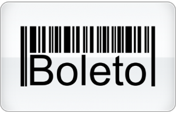
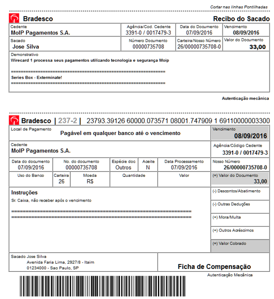
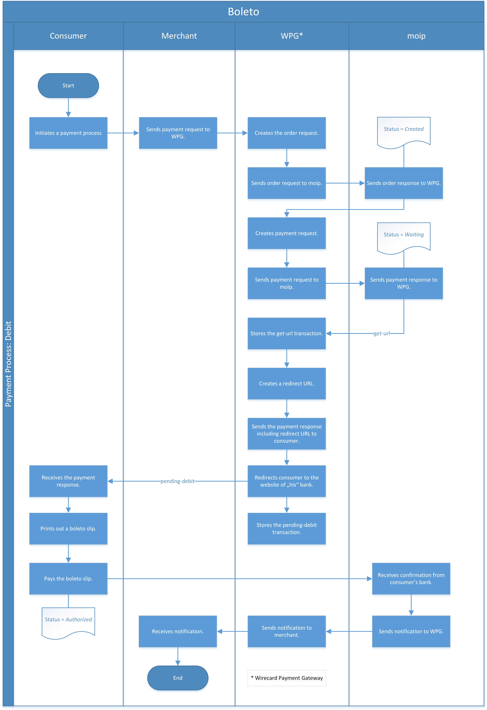
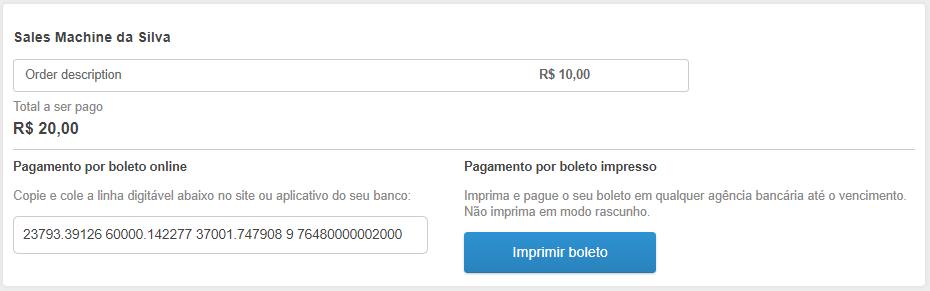

[#Boleto]
=== Boleto

[#Boleto_Introduction]
==== Introduction

Among the payment options, _moip_ counts on the alternative of paying
for online purchases via bank bill, a document that *allows the request to be paid at any bank or via internet banking*.

When the seller offers this option, at the end of the purchase you need
to add your data and click the _Generate Ticket_ option. The ticket will
typically have the information of

- who is buying,
- total value of the purchase,
- a bar code that identifies the transaction and
- the expiration date.

//-

[#Boleto_GeneralInformation]
==== General Information

[#Boleto_General_PaymentMode]
===== Payment Mode, Countries and Currencies

This table illustrates which payment mode _moip_ belongs to. It also
provides detailed information about the countries and currencies which
are relevant for _moip._

[%autowidth, cols="h,"]
|===
|Payment Mode | <<PaymentMethods_PaymentMode_OfflineBankTransfer, Offline Bank Transfer>>
|Countries    |Brazil
|Currencies   |BRL
|===

[#Boleto_General_Communication]
===== Communication Formats

This table illustrates how _moip_ notifications are encoded and which
formats and methods can be used for requests and responses.

[%autowidth]
|===
.2+h|Requests/Responses |Format  |XML
                        |Methods |POST

h|IPN Encodement 2+|Base64
|===

[#Boleto_TransactionTypes]
==== Transaction Types

For <<Glossary_TransactionType, transaction type>> details look at <<AppendixB, Appendix B: Transaction Types>>.

[%autowidth]
|===
|Transaction Type |Link to the sample

|debit            |<<Boleto_Samples_Debit, _debit_ sample>>
|refund-debit     |<<Boleto_Samples_Refund, _refund-request_ sample>>
|===

[#Boleto_TestCredentials]
==== Test Credentials

[%autowidth, cols="h,"]
|===
|URLs (Endpoints)           |``\https://api-test.wirecard.com/engine/rest/paymentmethods/``
|Merchant Account ID (MAID) |8a940e2a-5d7e-468b-8b27-d16a50814a02
|Username                   |16390-testing
|Password                   |3!3013=D3fD8X7
|Secret Key                 |807b6727-c199-4fc6-b663-788d577d1bea
|===

[#Boleto_Workflow]
==== Workflow

[#Boleto_Workflow_Debit]
===== _debit_

. Merchant sends the payment request to WPPG.
. WPPG creates the order request and sends it to _moip._
. _moip_ sends the order response with status _Created_ to WPPG.
. WPPG creates the payment request (related to previously created
order) from appropriate WPPG payment fields and sends it to _moip._ It
can be used to modify some payment fields, e.g. expiration date or
payment slip instructions.
. _moip_ sends the payment response with status _Waiting._
. WPPG stores the ``get-url`` transaction and sends the payment response
with redirect URL to the consumer.
. WPPG redirects consumer to the appropriate page (a bank) to print out
a _Boleto_ slip.
. WPPG stores a ``pending-debit`` transaction and waits for a notification
from _moip_ about the payment.
. After the payment, WPPG creates a final transaction and notifies
merchant about the payment.

//-

[#Boleto_Workflow_Refund]
===== _refund_

image::images/11-06-boleto/Boleto_Refund_Workflow.png[Boleto Refund Workflow]

.  Merchant requests the refund.
.  WPPG creates ``refund-request`` and sends it to _moip._
.  _moip_ sends the _refund_ response with status _Requested._
.  After _moip_ processes the refund, Merchant is notified.

//-

[#Boleto_Fields]
==== Fields
The following elements are mandatory *M*, optional *O* or conditional
*C* for sending a request/response for the Payment Method _Boleto._

[%autowidth]
[cols="e,,,,,,,,"]
|===
|Field name |Debit Request |Debit Response |Refund Request |Refund Response |Merchant Notification |Type |Size |Description

|merchant-account-id                                             |M |M |M |M |M |String    |36   |Unique identifier for a merchant account.
|transaction-id                                                  |  |M |  |M |M |String    |36   |The Transaction ID is the unique identifier for a transaction. It is generated by Wirecard.
|request-id                                                      |M |M |M |M |M |String    |36   |Identification number of the request. *It has to be unique for each request.*
|transaction-type                                                |M |M |M |M |M |Enum      |30   |Type of a transaction. Must be ``debit``.
|parent-transaction-id                                           |  |  |M |M |C |String    |36   |Unique identifier of parent transaction.
|transaction-state                                               |  |M |  |M |M |String    |12   |Status of a transaction.
|completition-time-stamp                                         |  |M |  |M |M |Date time |     |Timestamp of completion of request.
|statuses.status[@code]                                          |  |M |  |M |M |String    |12   |Code of the status of a transaction, e.g. ``201.0000``.
|statuses.status[@description]                                   |  |M |  |M |M |String    |256  |Description to the status code of a transaction.
|statuses.status[@severity]                                      |  |M |  |M |M |String    |20   |Transaction status severity. Should be *information* for successful transactions or *error* for failed.
|payment-methods.payment-method[@name]                           |M |M |M |M |M |Enum      |     |Name of the Payment Method is _Boleto._
|requested-amount                                                |M |M |O |M |M |Decimal   |18,2 |Amount of the transaction. The amount of the decimal place is dependent of the
currency. Minimum is ``0.01``. In case of refund, if no amount is specified, this implies a complete refund. If a smaller amount than in the original debit is
specified, a partial refund is done. Any subsequent partial refund must have a specified amount.
|requested-amount[@currency]                                     |M |M |C |M |M |String    |3    |Currency of the transaction. _Boleto_ supports only ``BRL``.
|order-items.order-item.name                                     |M |M |  |M |M |String    |     |Basket item name. Mandatory for each instance of ``order-item``.
|order-items.order-item.amount                                   |M |M |  |M |M |Decimal   |     |Basket item amount. Mandatory for each instance of ``order-item``.
|order-items.order-item.amount[@currency]                        |M |M |  |M |M |String    |3    |Basket item amount currency. _Boleto_ supports only ``BRL``.
|order-items.order-item.quantity                                 |M |M |  |M |M |Number    |     |Basket item quantity. Should be greater than zero. Mandatory for each instance of ``order-item``.
|account-holder                                                  |M |M |C |M |M |Complex   |     |Account holder information. This element is required only if debit request does not contain ``social-security-number`` element.
|account-holder.first-name                                       |M |M |M |M |M |String    |     |First name of the end consumer.
|account-holder.last-name                                        |M |M |M |M |M |String    |     |Last name of the end consumer.
|account-holder.email                                            |O |O |O |O |O |String    |     |End consumer’s email address.
|account-holder.date-of-birth                                    |M |M |M |M |O |String    |     |End consumer’s birth date.
|account-holder.social-security-number                           |M |  |M |  |M |String    |     |Tax number. If set in Required in Refund request only if not present in Debit request.
|shipping.first-name                                             |M |M |  |M |M |String    |     |Buyers first name.
|shipping.last-name                                              |M |M |  |M |M |String    |     |Buyers last name.
|shipping.email                                                  |M |M |  |M |M |String    |     |Buyers email address.
|api-id                                                          |O |O |  |  |  |String    |     |A unique identifier assigned for every API.
|expiration-date                                                 |M |M |  |  |M |Date time |     |Expiration date of payment. *The expiration date of the tickets generated via this API is 5 calendar days from the creation date.*
|custom-fields.custom-field[@field-name]                         |O |O |  |  |O |Enum      |     |Name of the custom field. _Boleto_ supports ``instruction-lines.first/second/third`` or ``logo-uri``.
|custom-fields.custom-field[@field-value]                        |C |C |  |  |C |String    |     |Content of the custom field. In this field the merchant can send additional information to consumer about payment.
|bankAccount.bank-code                                           |  |  |M |M |M |String    |     |Bank number (Febraban standard).
|bankAccount.agency-number                                       |  |  |M |M |M |String    |     |Agency number.
|bankAccount.agencyCheckNumber                                   |  |  |M |M |M |String    |     |The bank branch verifier digit.
|bankAccount.accountNumber                                       |  |  |M |M |M |String    |     |Account number.
|bankAccount.accountCheckNumber                                  |  |  |M |M |M |String    |     |The bank account verifier digit.
|bankAccount.type                                                |  |  |M |M |M |Enum      |     |Bank account type. Should be ``CHECKING`` or ``SAVING``.
|===

[#Boleto_Samples]
==== Samples

[#Boleto_Samples_Debit]
===== _debit_

.Debit Request (Successful)
[source,xml]
----
<?xml version="1.0" encoding="utf-8"?>
<payment xmlns="http://www.elastic-payments.com/schema/payment">
    <merchant-account-id>8a940e2a-5d7e-468b-8b27-d16a50814a02</merchant-account-id>
    <request-id>{{$guid}}</request-id>
    <transaction-type>debit</transaction-type>
    <payment-methods>
        <payment-method name="boleto" />
    </payment-methods>
    <requested-amount currency="BRL">5.00</requested-amount>
    <order-items>
        <order-item>
            <name>Series Box - Exterminate!</name>
            <amount currency="BRL">5.00</amount>
            <quantity>1</quantity>
        </order-item>
    </order-items>
    <account-holder>
        <first-name>Jose</first-name>
        <last-name>Silva</last-name>
        <date-of-birth>1988-12-30</date-of-birth>
        <social-security-number>05989318642</social-security-number>
    </account-holder>
    <shipping>
        <first-name>Jose</first-name>
        <last-name>Silva</last-name>
        <email>josesilva@email.com</email>
    </shipping>
    <expiration-date>2028-04-21</expiration-date>
    <custom-fields>
        <custom-field field-name="instruction-lines.first" field-value="Primeira linha se instruo" />
        <custom-field field-name="instruction-lines.second" field-value="Segunda linha se instruo" />
        <custom-field field-name="instruction-lines.third" field-value="Terceira linha se instruo" />
        <custom-field field-name="logo-uri" field-value="http://meusite.com.br/logo.jpg" />
    </custom-fields>
</payment>
----

.Debit Response (Successful)
[source,xml]
----
<?xml version="1.0" encoding="utf-8" standalone="yes"?>
<payment xmlns="http://www.elastic-payments.com/schema/payment" xmlns:ns2="http://www.elastic-payments.com/schema/epa/transaction">
    <merchant-account-id>8a940e2a-5d7e-468b-8b27-d16a50814a02</merchant-account-id>
    <transaction-id>809d088c-a970-4c96-bbfe-59f32976b5e4</transaction-id>
    <request-id>670418ee-9fbc-4885-ad16-bb71f12f0793</request-id>
    <transaction-type>debit</transaction-type>
    <transaction-state>success</transaction-state>
    <completion-time-stamp>2018-11-22T10:34:15.000Z</completion-time-stamp>
    <statuses>
        <status code="201.0000" description="The resource was successfully created." severity="information" provider-transaction-id="PAY-0HRR7IN7FMDF" />
    </statuses>
    <requested-amount currency="BRL">5.00</requested-amount>
    <account-holder>
        <first-name>Jose</first-name>
        <last-name>Silva</last-name>
    </account-holder>
    <shipping>
        <first-name>Jose</first-name>
        <last-name>Silva</last-name>
        <email>josesilva@email.com</email>
    </shipping>
    <order-items>
        <order-item>
            <name>Series Box - Exterminate!</name>
            <amount currency="BRL">5.00</amount>
            <quantity>1</quantity>
        </order-item>
    </order-items>
    <custom-fields>
        <custom-field field-name="instruction-lines.first" field-value="Primeira linha se instruo"></custom-field>
        <custom-field field-name="instruction-lines.second" field-value="Segunda linha se instruo"></custom-field>
        <custom-field field-name="instruction-lines.third" field-value="Terceira linha se instruo"></custom-field>
        <custom-field field-name="logo-uri" field-value="http://meusite.com.br/logo.jpg"></custom-field>
    </custom-fields>
    <payment-methods>
        <payment-method url="https://checkout-sandbox.moip.com.br/boleto/PAY-0HRR7IN7FMDF" name="boleto" />
    </payment-methods>
    <expiration-date>2028-04-21</expiration-date>
</payment>
----

[#Boleto_Samples_Refund]
===== _refund-request_

.Refund-Request Request (Successful)
[source,xml]
----
<?xml version="1.0" encoding="utf-8"?>
<payment xmlns="http://www.elastic-payments.com/schema/payment">
    <merchant-account-id>8a940e2a-5d7e-468b-8b27-d16a50814a02</merchant-account-id>
    <request-id>266c50a2-7200-4db2-82fe-53e9f0652d57</request-id>
    <transaction-type>refund-request</transaction-type>
    <parent-transaction-id>a4e07bd4-eedd-4ddb-842a-562ba51e4615</parent-transaction-id>
    <payment-methods>
        <payment-method name="boleto" />
    </payment-methods>
    <requested-amount currency="BRL">1.00</requested-amount>
    <account-holder>
        <first-name>Jose</first-name>
        <last-name>Silva</last-name>
        <date-of-birth>1988-12-30</date-of-birth>
        <social-security-number>05989318642</social-security-number>
    </account-holder>
    <bank-account>
        <type>checking</type>
        <bank-code>001</bank-code>
        <agency-number>4444444</agency-number>
        <agency-check-number>2</agency-check-number>
        <account-number>1234</account-number>
        <account-check-number>1</account-check-number>
    </bank-account>
</payment>
----
