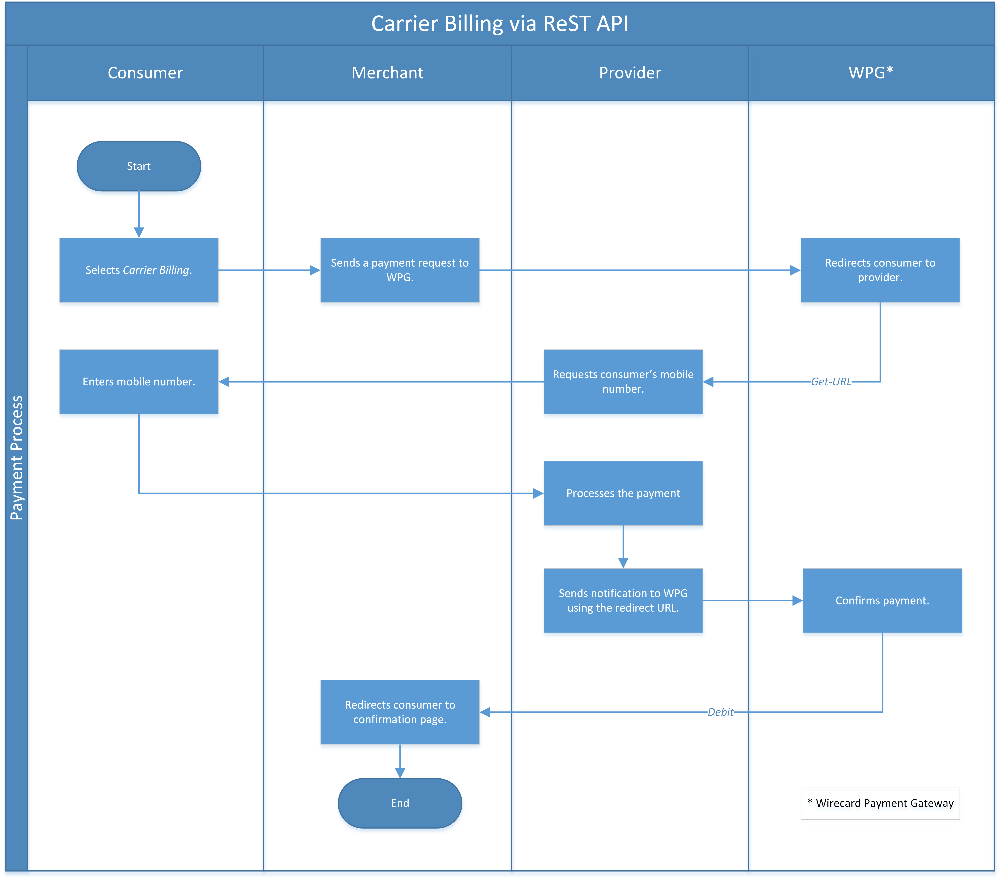
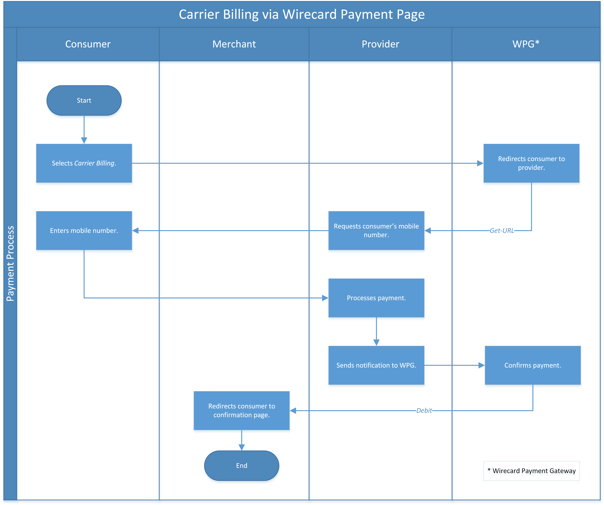
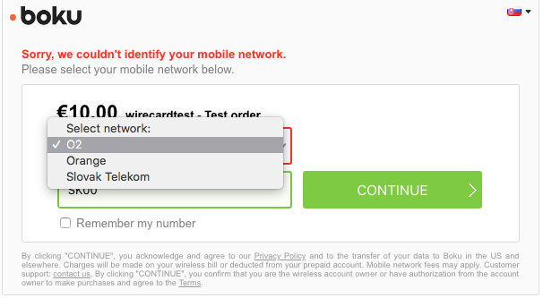

[#CarrierBilling]
=== Carrier Billing

[#CarrierBilling_Introduction]
==== Introduction
[.clearfix]
--
[.right]
image::images/11-07-carrier-billing/boku_logo.png[Carrier Billing Logo, width="200", align=right]

A mobile number is more than just a way to make a phone call. With Boku
(our payment provider for _carrier-billing_), a mobile number can be a
user identity, a digital address, and a payment method, all at the same
time. Boku's unique platform allows mobile operators and merchants
to rapidly design, scale, and operate programs aimed at giving mobile
subscribers a best-in-class experience for discovering, activating, and
purchasing new services. By providing access to a global network of
mobile operators and their subscribers, Boku offers merchants a powerful
channel with which to acquire and retain new users. These value
added services, in turn, deepen the commercial relationship mobile
operators have with their subscribers.
--

[#CarrierBilling_HowItWorks]
[discrete]
===== How it works

A full end-to-end program starts by promoting the merchant's service
across the various communication channels a mobile operator maintains
with its subscribers: web portals, mobile apps, retail stores, email
communications, SMS alerts, etc.

Once a subscriber signals interest in a promotion, their mobile number
can be used to activate and trial the service from any device.  If the
subscriber chooses to make a purchase or start a paid subscription, the
charges can be handled by their mobile operator through the same
mobile account used to purchase voice and data services. It is an
elegant, simple approach that starts and ends with the mobile number.

[#CarrierBilling_GeneralInformation]
==== General Information

[#CarrierBilling_GeneralInformation_PaymentMode]
===== Payment Mode, Countries and Currencies

This table illustrates which payment mode _carrier billing_ belongs to.
It also provides detailed information about the countries and currencies
which are relevant for _carrier billing_.

[%autowidth, cols="h,"]
|===
|Payment Mode |<<PaymentMethods_PaymentMode_OnlineBankTransfer, Online Bank Transfer>>
|Countries    |EUR Countries
|Currencies   |EUR
|===

[#CarrierBilling_GeneralInformation_Communication]
===== Communication Formats

This table illustrates how _carrier billing_ notifications are encoded
and which formats and methods can be used for requests and responses.

[%autowidth]
|===
.2+h|Requests/Responses |Format  |XML
                        |Methods |POST, GET
h|IPN Encodement      2+|Base64, JSON
|===

[#CarrierBilling_TransactionTypes]
==== Transaction Types

For <<Glossary_TransactionType, transaction type>> details look at <<AppendixB, Appendix B: Transaction Types>>.

[cols="e,"]
|===
|Transaction Type |Link  to the Sample

|debit        | <<CarrierBilling_Samples, _debit_ sample>>
|refund-debit |
|===

[#CarrierBilling_TransactionTypes_Debit]
===== _debit_ for _carrier-billing_

The payment method within the request must be _carrier-billing,_ the
transaction type _debit._ If the request is successful, the
_Forward-URL_ to the Landing-Page of the _carrier-billing_ provider will
be sent in the response. The notification allows a merchant to receive
the final status of a payment as soon as Wirecard receives it from the
_carrier-billing_ provider. Usually, this status is received within
seconds of the completion of the transaction, however, may take up to a
few days depending on the respective mobile provider.

Once Wirecard has received a notification from the _carrier-billing_
provider about the final status of the transaction, this status will be
communicated to the merchant via the <<GeneralPlatformFeatures_IPN, Notification URL>> that is configured in the merchant account or provided with the
initial payment transaction request.

If no notification URL is provided with the request and also not
configured in the merchant account, the notification will be sent via
Email to the merchant in case the Email address has been configured. In
case merchant has not received the notification, the status of the
transaction can be requested by sending a <<GeneralPlatformFeatures_RetrieveTransaction_TransactionID, Retrieve Transaction by Transaction ID>> or
<<GeneralPlatformFeatures_RetrieveTransaction_RequestID, Retrieve Transaction by Request ID>>.

[#CarrierBilling_TestCredentials]
==== Test Credentials

[%autowidth, cols="h,"]
|===
|URLs (Endpoints) |``\https://{test-instance-hostname}/engine/rest/paymentmethods``
|Test Merchant Account ID (MAID) |8b99e2dc-c8d0-43b8-9ebb-0a35fa808af7
|Username |16390-testing
|Password |3!3013=D3fD8X7
|Secret Key |c5baf402-82cd-453d-9f5a-1b20ad44f982
|===

[#CarrierBilling_TestCredentials_Additional]
===== Additional Test Credentials on _carrier billing's_ Environment

[%autowidth, cols="h,"]
|===
|Test Number |DE00, SK00
|===

[#CarrierBilling_Workflow]
==== Workflow

[#CarrierBilling_Workflow_REST]
===== Using ReST API

.  On the merchant site.
.  Consumers select _carrier billing._
.  The merchant sends a payment request to _{payment-gateway}._
.  _{payment-gateway}_ redirects consumers to provider's page.
.  Continue with point 4 of "Using Payment Page".

//-

[#CarrierBilling_Workflow_PP]
===== Using Payment Page

.  On the _Payment Page._
.  Consumers select _carrier billing._
.  _{payment-gateway}_ redirects consumers to provider's page.
.  Consumers select their mobile network provider.
+

+
and confirm payment.
+
image::images/11-07-carrier-billing/carrierbilling_confirmPayment.png[Confirm Payment]
+
.  Consumers submit the payment.
.  The provider processes the payment and sends a notification to
_{payment-gateway}._
.  _{payment-gateway}_ confirms the payment.
.  Merchant redirects consumers to merchant's confirmation page.
.  The amount to be paid appears on the consumer's monthly carrier
invoice.

//-

[#CarrierBilling_Fields]
==== Fields

The following elements are either mandatory (M), optional (O) or
conditional \(C) in a transaction process.

[%autowidth, cols="e,,,,,,"]
|===
|Field                          |Request |Response  |Notification |Datatype     |Size |Description

|transaction-type               |M       |M         |M            |Alphanumeric |30   |This is the type for a
transaction. For _carrier-billing_ only ``debit`` is allowed in the initial
request.
|transaction-id                 |M       |M         |M            |Alphanumeric |36   |The Transaction ID is the
unique identifier for a transaction. It is generated by Wirecard.
|statuses.status@severity       |        |M         |M            |Alphanumeric |20   |This field gives
information if a  status is a warning, an error or an information.
|statuses.status@description    |        |M         |M            |Alphanumeric |256  |This is the
description to the status code of a transaction.
|statuses.status@code           |        |M         |M            |Alphanumeric |12   |This is the code of
the status of a transaction.
|state                          |        |M         |M            |Alphanumeric |12   |The payment transaction state. For
_carrier-billing_ can only be success, failed  or in-progress.
|requested-amount@currency      |M       |M         |M            |Alphanumeric |3    |The ISO code of
the payment currency. Currently only ``EUR`` is supported.
|requested-amount               |M       |M         |M            |Numeric      |18,3 |This is the amount of the transaction.
The amount of the decimal place is dependent of the currency. The
maximum amount is highly dependent on the country and mobile network
operator. Currently the maximal allowed amount is 30 EUR.
|request-id                     |M       |M         |M            |Alphanumeric |64   |This is the identification
number of the request. It has to be unique for each request.
|payment-methods.payment-method-name@url |  |M      |             |Alphanumeric |256  |The forward URL to the _carrier-billing_ provider checkout page. The
end-consumer must be redirected to this URL in order to be able to
complete the payment.
|payment-methods.payment-method-name@name |M |      |             |Alphanumeric |15   |This is the name of the payment method that that is chosen from the
end-consumer. Currently only ``carrier-billing`` is supported.
|parent-transaction-id          |O       |O         |             |Alphanumeric |36 |Transaction ID of the first transaction in the series.
|order-detail                   |M       |M         |             |Alphanumeric |20 |Additional description of the provided product or service.
|notifications.notification@url |O       |O         |             |Alphanumeric |256 |The URL to be used for the Instant Payment Notification. It overwrites the
notification URL that is set up in the merchant configuration.
|merchant-account-id            |M       |M         |M            |Alphanumeric |36 |Unique identifier for a merchant account.
|locale                         |        |          |M            |Alphanumeric |6  |ISO code of the language. Can be sent
in the format ``<language>`` or in the format ``<language_country>``.
|instrument-country             |O       |          |             |Alphanumeric |2 |The instrument country
contains the information where the end-consumer belongs to.
|descriptor                     |O       |          |             |Alphanumeric |40 |Description of the provided
product or service. It will appear on the checkout web page and SMS
texts and may also appear on the end-customers billing invoice from the
mobile operator depending on the country and operator.
|consumer-id                    |M       |          |             |Alphanumeric |50 |An id of the end-consumer in the merchant's application e.g. account
name, gamer alias, login username.
|completion-time-stamp          |        |M         |M            |Datetime     |   |The completion timestamp of the transaction processing.
|account-holder.phone           |M       |M         |             |Alphanumeric |30 |The phone number of
the end-customer (MSISDN) intended to be used for payment
|account-holder.address.country |M       |M         |M            |Alphanumeric |3  |The ISO code
of the country used for the mobile payment. It influences the language
of the checkout page and usage of the mobile operators. Currently only
``DE`` is supported.
|account-holder.address.city    |M       |M         |             |Alphanumeric |256 |The city of residence of the account holder.
|account-holder.address.street1 |M       |M         |             |Alphanumeric |256 |The street name of residence of the account holder.
|account-holder.first-name      |M       |M         |             |Alphanumeric |256 |The first name of the account holder.
|account-holder.last-name       |M       |M         |             |Alphanumeric |256 |The last name of the account holder.
|account-holder.email           |M       |M         |M            |Alphanumeric |256 |The e-mail address of the account holder.
|===

[#CarrierBilling_Features]
==== Features

[#CarrierBilling_MerchantCountryCodeSecurity]
[discrete]
===== Merchant Country Code Security

Depending on the merchant account ID, merchants will only be able to
accept payments from the setup country. This means one country for one
merchant account ID.

[#CarrierBilling_Samples]
==== Samples

.Debit Request (Successful)
[source,xml,subs=attributes+]
----
include::samples/xml/carrier-billing_debit_request_success.xml[]
----

.Debit Response (Successful)
[source,xml,subs=attributes+]
----
include::samples/xml/carrier-billing_debit_response_success.xml[]
----

.Debit Request (Failure)
[source,xml,subs=attributes+]
----
include::samples/xml/carrier-billing_debit_request_failure.xml[]
----

.Debit Response (Failure)
[source,xml,subs=attributes+]
----
include::samples/xml/carrier-billing_debit_response_failure.xml[]
----

.Notification (Successful)
[source]
----
response_signature=2a715f3ac100ad38906d48c84717840c40f6a0990390c8be0273cb23104d7960&phone=SK00&transaction_type=debit&locale=&completion_time_stamp=20150709141336&status_code_1=201.0000&status_severity_1=information&transaction_state=success&transaction_id=ec87fe6b-2633-11e5-94a1-0050b65c678c&country=SK&merchant_account_id=d97a261d-dbee-4993-b323-2349d51b768b&ip_address=127.0.0.1&provider_transaction_reference_id=&request_id=5ebb92fc-b72d-478c-98ec-7aca869b1e4c&requested_amount=15.00&requested_amount_currency=EUR&status_description_1=boku%3AThe+resource+was+successfully+created.&provider_transaction_id_1=&authorization_code=&
----
