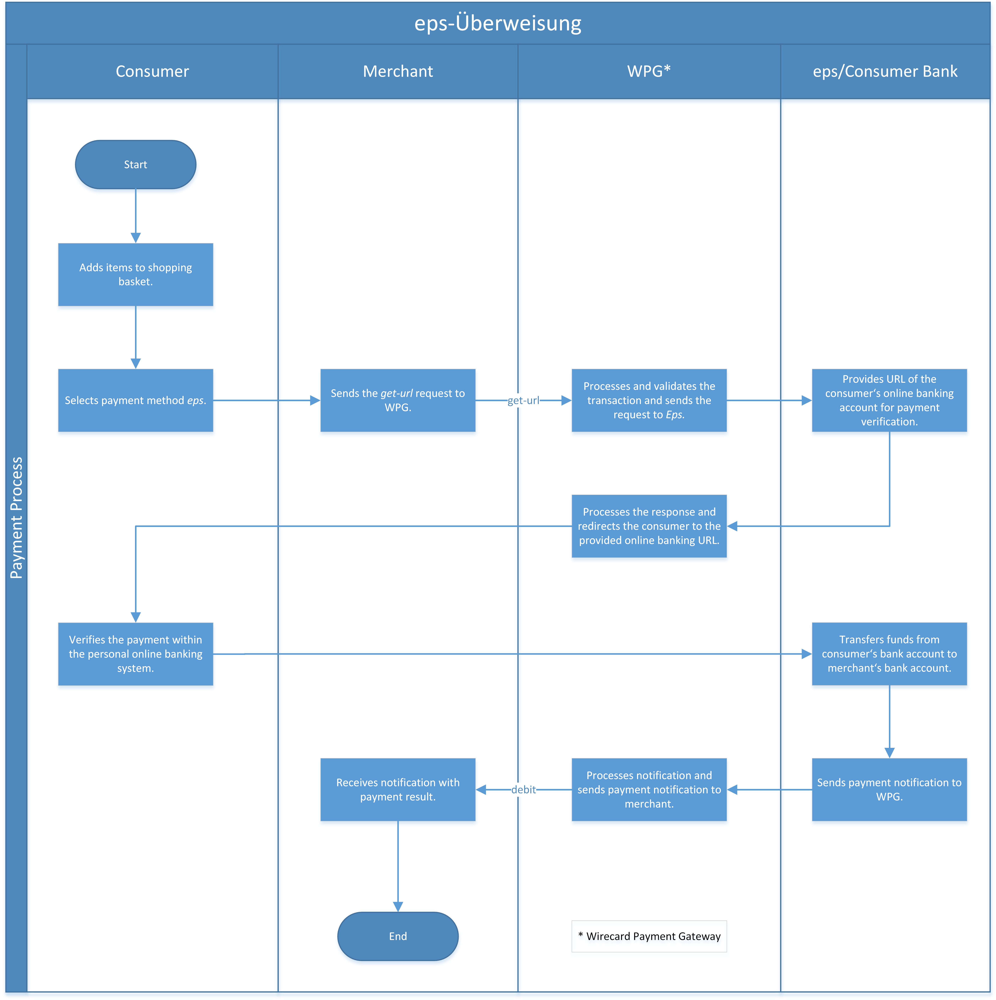

[#eps]
=== eps-Überweisung
[.float-group]
--

--

[#eps_Introduction]
==== Introduction

_eps-Überweisung_ (**e**lectronic **p**ayment **s**tandard) is an online
payment method provided to consumers of Austrian banks.
_eps-Überweisung_ utilizes the established online banking systems of
nearly all Austrian banks. _eps-Überweisung_ is one of the most popular
payment methods for online shopping in Austria.

The eps e-payment standard is the interface to online payment systems
for irrevocable payments, adopted by online shops as well as public
authorities like E-Government.

Selecting a bank in merchant's web store, the consumer is redirected
from merchant's web store to their bank's online banking window.

If no bank is selected in the merchant's web store, the bank selection
is done during redirect and consumer is redirected to their bank's
online banking window after selecting a bank from SO (Scheme Operator,
central routing instance for _eps-Überweisung_) bank list.

Successfully logging on to their respective account using their account
number and PIN, the buyer simply needs to confirm the transaction using
a TAN.

After the consumer confirmed the payment via TAN (or other usual used
approval mechanism within the internet banking), eps confirms the
payment sending payment result and details to the PSP system.

Consumer clicks "Back to shop" link in online banking window and is
redirected back to merchant's web shop.

[#eps_GeneralInformation]
==== General Information

[#eps_GeneralInformation_PaymentMode]
===== Payment Mode, Countries and Currencies

This table illustrates which payment mode _eps-Überweisung_ belongs to.
It also provides detailed information about the countries and currencies
which are relevant for _eps-Überweisung_.

[%autowidth]
[stripes=none]
[cols=",",]
|===
|*Payment Mode*
|<<PaymentMethods_PaymentMode_OnlineBankTransfer, Online Bank Transfer>>
|*Countries* |AT, DE (giropay interoperability)
|*Currencies* |EUR
|===

[#eps_GeneralInformation_Communication]
===== Communication Formats

This table illustrates how _eps-Überweisung_ notifications are encoded
and which formats and methods can be used for requests and responses.

[%autowidth]
[stripes=none]
|===
.2+| *Requests/Responses* | Format | XML
   | Methods |POST
   | *IPN Encodement* 2+| Base64 |
|===

[#eps_Transactions]
==== Transactions

[#eps_Transactions_TransactionTypes]
===== Transaction Types

For <<Glossary_TransactionType, transaction type>> details which are not given here, look
at <<AppendixB, AppendixB: Transaction Types>>.

[%autowidth]
[stripes=none]
|===
|Transaction Type |Description |Link to samples

|_get-url_ |Initiation of a transaction triggering the redirect of the
consumer to the eps system.
| See <<eps_Samples, _get-url_ samples>>
|_debit_ |Created during payment processing and finalized after consumer
TAN confirmation/cancel etc. using eps system payment confirmation.
| See <<eps_Samples, _debit_ samples>>
|===

[#eps_Transactions_ReferenceTransaction]
===== Reference Transaction
NOTE: For additional information regarding referenced transaction functionality, see <<GeneralPlatformFeatures_CrossPayment, Cross-Payment-Methods Referencing>>.

[#eps_Transactions_Restrictions]
===== Restrictions
NOTE: When using _eps-Überweisung_, some banks do not transmit consumer data
(e.g. account details) to _Wirecard Payment Gateway_. As these fields
are mandatory for a refund (e.g. via SEPA _Credit Transfer_), the
merchant is obliged to provide the consumer data to guarantee a
successful __refund__.

[#eps_TestCredentials]
==== Test Credentials

[cols="h,,"]
[%autowidth]
[stripes=none]
|===
|*URLs (Endpoints)*
|For transaction type _get-url_
|``\https://api-test.wirecard.com/engine/rest/paymentmethods/``
|*Merchant Account ID (MAID)*
2+|1f629760-1a66-4f83-a6b4-6a35620b4a6d
|*Username*
2+|16390-testing
|*Password*
2+|3!3013=D3fD8X7
|===

.Additional Test Credentials on eps-Überweisung Environment
[cols=",,"]
[%autowidth]
[stripes=none]
|===
.2+| *Ärzte- und Apotheker Bank*
| BIC
| BWFBATW1XXX
| Login Data
| Just click to continue - no input needed.
3+| or
.2+| *Stuzza Bank*
| BIC
| STUZZATWXXX
| Login Data
| Please <<ContactUs, contact merchant support>> for complete test credentials.
|===

[#eps_Workflow]
==== Workflow

[#eps_Ueberweisung_debit]
===== debit

NOTE: The merchant sends a _get-url_ request to Wirecard and receives a response
which contains either the URL of the consumers online banking system (if
BIC is provided in the request) or the eps bank selection page, to which the
consumer must be redirected. The consumer is redirected back to merchants shop after the
transaction is approved and the merchant receives a _debit_ payment notification
from _Wirecard Payment Gateway_.

. Consumer adds items to their shopping basket.
. Consumer selects _eps-Überweisung_.
. The merchant sends a _get-url_ request to _Wirecard Payment Gateway_.
. _Wirecard Payment Gateway_ processes and validates the
transaction.
. _Wirecard Payment Gateway_ forwards the request to
_eps-Überweisung_.
. _eps-Überweisung_ provides the URL of the consumer's online banking
account for payment verification.
. _Wirecard Payment Gateway_ processes the response.
. _Wirecard Payment Gateway_ redirects the consumer to the provided
online banking URL.
. Consumer verifies the payment within the personal online banking system.
. _eps-Überweisung_ transfers funds from the consumer's bank account
to the merchant's bank account.
. _eps-Überweisung_ sends a payment notification to the _Wirecard Payment Gateway_.
. _Wirecard Payment Gateway_ processes the notification and sends the
payment _debit_ notification to the merchant.
. The merchant receives the notification with the payment result.

//-

[#eps_giropayInteroperability]
==== _eps-Überweisung_ - giropay Interoperability

SO implemented interlink to _eps-giropay_ scheme in Germany. If the
merchant's contract allows to process those interoperability
transactions, all _eps-giropay_ participating banks in Germany can also
be reached with a technical _eps-Überweisung_ transaction.

Supporting banks can be chosen by the consumer during bank selection on
the SO bank selection page.

More information according _eps-giropay_ interoperability:
https://eservice.stuzza.at/de/haendler/eps-ueberweisung/eps-giropay-interoperabilitaet.html

[#eps_giropayInteroperability_Restrictions]
Restrictions are

* Shop does not support bank selection, only the SO bank selection is
supported for giropay banks.
* Max. 10.000 EUR guaranteed for single payment initiation (amount can
be higher than 10.000 EUR).
* Remittance identifier limited to 35 characters for structured purpose
or 140 characters for unstructured purpose (See field <<eps_Descriptor, descriptor>>).

[#eps_RetrieveEpsPaymentDetails]
==== Retrieve _eps-Überweisung_ Payment Details

Since _eps-Überweisung_ is an asynchronous payment method, the consumers
payment data is provided asynchronously via a server 2 server notification
from eps system.

To retrieve buyers detail payment data the merchant must query payment
data after receiving a debit notification or the redirect of the
consumer back to the shop system from eps/online banking system.

The debit payment returned as query result will contain consumer's
payment details such as

* account holder data
* buyer's bank account data

The data is included only if the consumer's bank provided the data in
the final bank notification for successful payment. It is not mandatory
for banks to send this data.

Therefore, it is required to process a payment query using WPG Rest
interface after the shop system received a debit payment notification or
the consumer has been redirected to the shop.

See <<GeneralPlatformFeatures_RetrieveTransaction, Retrieve a Transaction>>
for further information about retrieving transaction details.

[#eps_Fields]
==== Fields

The fields used for _eps-Überweisung_ requests, responses and
notifications are the same as the ReST API Fields.
Please refer to the <<RestApi_Fields, REST API field list>>. Only the fields listed below have different properties,
especially according to size.

The following elements are mandatory (M), optional (O) or conditional
\(C) for a request/response/notification. If the respective cell is
empty, the field is disregarded or not sent.

[cols=",,,,v", options="header"]
[frame=all]
[%autowidth]
|===
|*Field*
|*Cardinality*
|*Data Type*
|*Size*
|*Description*
|descriptor
|O
|xs:string
|140
|The remittance identifier. Limit of 35 characters for structured purpose
or 140 characters for unstructured purpose. Applied only if not already
configured during merchant setup. Supports only limited character set:
a b c d e f g h i j k l m n o p q r s t u v w x y z
A B C D E F G H I J K L M N O P Q R S T U V W X Y Z
0 1 2 3 4 5 6 7 8 9
- € $ § % ! = # ~ ; + / ? : ( ) . , ' & > < " * { } [ ] @ \ _ ° ^ \|
Ä Ö Ü ä ö ü ß
Space
|===

[#eps_Samples]
==== Samples

NOTE: _eps-Überweisung_ returns coded payment method URLs in the response! +
When you perform a test transaction, the ``<payment-method url>`` that
is returned in the XML Response is encoded and cannot be used directly.
You must decode the URL first to link to the correct page. You can use
any tool that decodes URLs. Maybe you want to try Coder's Toolbox,
available at:
https://coderstoolbox.net/string/#!encoding=xml&action=decode&charset=us_ascii

[#eps_Ueberweisung_GetUrlWithBankSelectionInMerchantShop]
===== _get-url_ with Bank Selection in Merchant Shop

[#eps_Ueberweisung_Success]
====== Successful Request/Response and Notification

.XML get-url Request (Successful)

[source, XML, syntaxhighlighter-pre]
----
<?xml version="1.0" encoding="utf-8" standalone="yes"?>
<payment xmlns="http://www.elastic-payments.com/schema/payment">
    <merchant-account-id>1f629760-1a66-4f83-a6b4-6a35620b4a6d</merchant-account-id>
    <request-id>e1b97aff-ae9a-4fa1-902c-cf77ba8d42b0</request-id>
    <transaction-type>get-url</transaction-type>
    <requested-amount currency="EUR">1.99</requested-amount>
    <payment-methods>
        <payment-method name="eps" />
    </payment-methods>
    <ip-address>10.10.245.94</ip-address>
    <bank-account>
        <bic>BWFBATW1XXX</bic>
    </bank-account>
    <notifications>
        <notification url="https://www.yourshop.at/notifications?REQUESTID=${unique for each request}"/>
    </notifications>
 <cancel-redirect-url>https://demoshop-test.wirecard.com/demoshop/#!/cancel</cancel-redirect-url>
 <success-redirect-url>https://demoshop-test.wirecard.com/demoshop/#!/success</success-redirect-url>
 <fail-redirect-url>https://demoshop-test.wirecard.com/demoshop/#!/error</fail-redirect-url>
    <processing-redirect-url>https://sandbox-engine.thesolution.com/shop/processing.html</processing-redirect-url>
</payment>
----

.XML get-url Response (Successful)

[source, XML, syntaxhighlighter-pre]
----
<?xml version="1.0" encoding="utf-8" standalone="yes"?>
<payment xmlns="http://www.elastic-payments.com/schema/payment" xmlns:ns2="http://www.elastic-payments.com/schema/epa/transaction">
  <merchant-account-id>1f629760-1a66-4f83-a6b4-6a35620b4a6d</merchant-account-id>
  <transaction-id>06a0802a-b8c6-416f-8ef9-38f018249e6f</transaction-id>
  <request-id>e1b97aff-ae9a-4fa1-902c-cf77ba8d42b0</request-id>
  <transaction-type>get-url</transaction-type>
  <transaction-state>success</transaction-state>
  <completion-time-stamp>2018-05-29T10:43:34.000Z</completion-time-stamp>
  <statuses>
    <status code="201.0000" description="The resource was successfully created." severity="information" />
  </statuses>
  <requested-amount currency="EUR">1.99</requested-amount>
  <ip-address>10.10.245.94</ip-address>
  <notifications>
    <notification url="https://www.yourshop.at/notifications?REQUESTID=${unique for each request}"/>
  </notifications>
  <payment-methods>
    <payment-method url="https://www.banking.co.at/appl/ebp/logout/so/loginPrepare/eps.html?resource=93&amp;demo=true&amp;cai=%2BHJZzHQsnOsTvOQB4NGO2ZdynZnjeHAYoKMckVWetFzZ*aitpauMmMRh*FPQsSGNuLUK3VoY-" name="eps" />
  </payment-methods>
  <bank-account>
    <bic>BWFBATW1XXX</bic>
  </bank-account>
  <processing-redirect-url>https://sandbox-engine.thesolution.com/shop/processing.html</processing-redirect-url>
  <cancel-redirect-url>https://demoshop-test.wirecard.com/demoshop/#!/cancel</cancel-redirect-url>
  <fail-redirect-url>https://demoshop-test.wirecard.com/demoshop/#!/error</fail-redirect-url>
  <success-redirect-url>https://demoshop-test.wirecard.com/demoshop/#!/success</success-redirect-url>
</payment>
----

.XML debit Notification (Successful)

[source, XML, syntaxhighlighter-pre]
----
<?xml version="1.0" encoding="UTF-8"?>
<payment xmlns="http://www.elastic-payments.com/schema/payment" xmlns:ns2="http://www.elastic-payments.com/schema/epa/transaction">
 <merchant-account-id>1f629760-1a66-4f83-a6b4-6a35620b4a6d</merchant-account-id>
 <transaction-id>03685043-2db2-4f9b-a672-925ce7243e91</transaction-id>
 <request-id>e1b97aff-ae9a-4fa1-902c-cf77ba8d42b0</request-id>
 <transaction-type>debit</transaction-type>
 <transaction-state>success</transaction-state>
 <completion-time-stamp>2018-05-29T10:44:10.000Z</completion-time-stamp>
 <statuses>
  <status code="201.0000" description="eps:The resource was successfully created." severity="information"/>
 </statuses>
 <requested-amount currency="EUR">1.99</requested-amount>
 <parent-transaction-id>06a0802a-b8c6-416f-8ef9-38f018249e6f</parent-transaction-id>
 <ip-address>10.10.245.94</ip-address>
 <notifications>
  <notification url="https://www.yourshop.at/notifications?REQUESTID=${unique for each request}"/>
 </notifications>
 <payment-methods>
  <payment-method name="eps"/>
 </payment-methods>
 <api-id>---</api-id>
 <Signature xmlns="http://www.w3.org/2000/09/xmldsig#">
  <SignedInfo>
   <CanonicalizationMethod Algorithm="http://www.w3.org/TR/2001/REC-xml-c14n-20010315"/>
   <SignatureMethod Algorithm="http://www.w3.org/2001/04/xmldsig-more#rsa-sha256"/>
   <Reference URI="">
    <Transforms>
     <Transform Algorithm="http://www.w3.org/2000/09/xmldsig#enveloped-signature"/>
    </Transforms>
    <DigestMethod Algorithm="http://www.w3.org/2001/04/xmlenc#sha256"/>
    <DigestValue>WhX5jfAGGWe/nZ71O2ivl7tGrIKHLKlHN5HHy5UObDs=</DigestValue>
   </Reference>
  </SignedInfo>
  <SignatureValue>Qd7xMPndqS+r6NY4zF/09Dn3bZXeeeZptLLmQvmFMXsmwXXDrKedRK31ipBRuNFhq2UXy7CopCD/T45RNOW0qIPp7XjN4juCbPK8TKDZFey4DVbjoLI/Q3mq0nalaoxP9t99/J4th3T8h+KNQIWCvmRz0dF4UUVvVmUaysaqEt7xT5nm3c73jpA5NkPRA1sX0Y0Q70Qdy6jIPjphRhYGgtnUM6Vr1bn0uwkiiCAfN19EcTCdmz5LtW9FQv1ra6vcIwEIiG1r/iym/M3DsF4BBtthAEbL1B4Y5to0OrVdGh1AEaojJ90vYd60FMOtqobs+j4G0CRutgZ5NtwlGcL70Xu7WEWWw76OcQexvXah5i1WgtvFYIcWMyLm0YNe1a7FjVeA5Wyzo2cR3n3ph8VFg3NpeH+oDnx1Ps2NvIspxBZ+DzalBcFeQWJmpOMlQ3oqWlt7YxyeiqDjPmGzsPB892MqjS/QqDGwfZzvX3u/SyPnOoDF7Si9s188zreHnjj+NlZY1i1B1sEFJ56104qJbQdt+O6s1QqLj6vKs26VrV477lNGhgDOEKkf1TQFMxr5kDHbp0wZ+nrpskIt+A6dnY0oH7dXs+uAK6BRK++T22gOdexI8/iJsXYSDdrws07N3Uxxq1mah8JbFCYNhUQLB6hxTGyKb/s+wj34Vo9O1V0=</SignatureValue>
  <KeyInfo>
   <X509Data>
    <X509SubjectName>L=Ascheim,2.5.4.4=#130642617965726e,CN=api-test.wirecard.com,OU=Operations,O=Wirecard Technologies GmbH,C=DE</X509SubjectName>
<X509Certificate>MIIF5DCCBMygAwIBAgICLHQwDQYJKoZIhvcNAQELBQAwWzELMAkGA1UEBhMCREUxETAPBgNVBAoTCFdpcmVjYXJkMTkwNwYDVQQDFDB3aXJlY2FyZC1EUS1NVUMtaW50ZXJuYWwtd2Vic2VydmljZS1pc3N1aW5nQ0FfMDIwHhcNMTcwMTEyMTM1OTI2WhcNMTkwMTEyMTM1OTI2WjCBijELMAkGA1UEBhMCREUxIzAhBgNVBAoTGldpcmVjYXJkIFRlY2hub2xvZ2llcyBHbWJIMRMwEQYDVQQLEwpPcGVyYXRpb25zMR4wHAYDVQQDExVhcGktdGVzdC53aXJlY2FyZC5jb20xDzANBgNVBAQTBkJheWVybjEQMA4GA1UEBxMHQXNjaGVpbTCCAiIwDQYJKoZIhvcNAQEBBQADggIPADCCAgoCggIBAKSkExBY8FjRcZdrxOuJF+HZY8+McQaOB8B0E/hTUhoclsF4OJNaMThje7R6w6OYWBMKpssGngHFaZv35rCo5XVUpJmjZa04ytxE72GKO/uP4yIR7ZBXZx42B22MFaJJZTgPRCCFd6jrz906BZ//CmEAmk5gKelfPxfWJgGyTX6xz7I9R/G57E1xNOuEihN0ma5Q2IhD71MPVseFIGazyfGbJD6rYYbeBbOQSGk//TL8sdRCn0BLcm4DH5oqcPxDKzkaBP4ohNkCWsxpLLSyV6Wx0ihT0S1OLVNkEeTvcrYgUk124VyGatwWNUuCBYyOGQSOGqrW8IHmrhjzzT0NQog0/m38lpdqw/eWmt39qhODqSfILUk2Dxv1+W0IRKJCKcJrcTbXEQCuHl+XWY+U2AhinIPNRA0KX2oOgC//inwyKWSGWHdQnaake646R1wHqtoEfCtEcfyaeR+IrMr1rCAA3RZ+MH1J5UlUCWcnxPT0kad6dUwe3Qjq3jK4gaFzYU2yVScX5LVZMlWy2NiGCIvngHQmhArESzxMVvz5METZujfax6hfmiLNRWu0Zqs09Mpxy5zk5m/WRi5izb0uBeCfcA6x9pmjMx8M4OGG5RO2HTXSwLYJTKI47VXNsLLOY+nMFmhj/dkLJ5d3zI7EczToPMRHmHG7EqEdAfbb+oUlAgMBAAGjggGAMIIBfDARBgNVHQ4ECgQIS6wVIA0mJ9IwEwYDVR0jBAwwCoAIQ2weFtQ9BQ4wCwYDVR0PBAQDAgTwMIIBQwYDVR0fBIIBOjCCATYwggEyoIIBLqCCASqGgdVsZGFwOi8vd2lyZWNhcmQubGFuL0NOPXdpcmVjYXJkLURRLU1VQy1pbnRlcm5hbC13ZWJzZXJ2aWNlLWlzc3VpbmdDQV8wMixDTj1DRFAsQ049UHVibGljIEtleSBTZXJ2aWNlcyxDTj1TZXJ2aWNlcyxDTj1Db25maWd1cmF0aW9uLGRjPXdpcmVjYXJkLGRjPWxhbj9jZXJ0aWZpY2F0ZVJldm9jYXRpb25MaXN0P2Jhc2U/b2JqZWN0Q2xhc3M9Q1JMRGlzdHJpYnV0aW9uUG9pbnSGUGh0dHA6Ly9jcmwud2lyZWNhcmQubGFuL0NSTF93aXJlY2FyZC1EUS1NVUMtaW50ZXJuYWwtd2Vic2VydmljZS1pc3N1aW5nQ0FfMDIuY3JsMA0GCSqGSIb3DQEBCwUAA4IBAQAmlUoiEFPRsOjGPb7SYiuJLxqTXCvZQeuXiUydF6FQl/zIpR/zSltaZKK86L+1i7t1C89OyTTXBD9FN6EKmlHo/ulsMn9V2B4zK3lT/NUclST98BmCla4Jzm+roeOHTqlPz3gPRJiPsr3wdvM+FSAJ2MRdv3l77mTE3v3hjsVVMmShR3VwwpxCICl3mpMsSaJZLyJdOHwvnpXs1m9kESwPD3DQ3RAQ/OGa0pPxAkHaauog4DhPvr/nBQnWHd2Us5b/ep7LME9hZ8u3hu/Kc6Vk24c5p3WUOiyaTiw+Ym3QDXl1wBSl9DdM94KbmAAQ5D/FUqyQnSc4TpmYvJ+Iavag</X509Certificate>
   </X509Data>
  </KeyInfo>
 </Signature>
</payment>
----

.Base64 debit Notification (Successful)

[source, XML, syntaxhighlighter-pre]
----
PD94bWwgdmVyc2lvbj0iMS4wIiBlbmNvZGluZz0iVVRGLTgiPz48cGF5bWVudCB4bWxucz0iaHR0cDovL3d3dy5lbGFzdGljLXBheW1lbnRzLmNvbS9zY2hlbWEvcGF5bWVudCIgeG1sbnM6bnMyPSJodHRwOi8vd3d3LmVsYXN0aWMtcGF5bWVudHMuY29tL3NjaGVtYS9lcGEvdHJhbnNhY3Rpb24iPjxtZXJjaGFudC1hY2NvdW50LWlkPjFmNjI5NzYwLTFhNjYtNGY4My1hNmI0LTZhMzU2MjBiNGE2ZDwvbWVyY2hhbnQtYWNjb3VudC1pZD48dHJhbnNhY3Rpb24taWQ+MDM2ODUwNDMtMmRiMi00ZjliLWE2NzItOTI1Y2U3MjQzZTkxPC90cmFuc2FjdGlvbi1pZD48cmVxdWVzdC1pZD5lMWI5N2FmZi1hZTlhLTRmYTEtOTAyYy1jZjc3YmE4ZDQyYjA8L3JlcXVlc3QtaWQ+PHRyYW5zYWN0aW9uLXR5cGU+ZGViaXQ8L3RyYW5zYWN0aW9uLXR5cGU+PHRyYW5zYWN0aW9uLXN0YXRlPnN1Y2Nlc3M8L3RyYW5zYWN0aW9uLXN0YXRlPjxjb21wbGV0aW9uLXRpbWUtc3RhbXA+MjAxOC0wNS0yOVQxMDo0NDoxMC4wMDBaPC9jb21wbGV0aW9uLXRpbWUtc3RhbXA+PHN0YXR1c2VzPjxzdGF0dXMgY29kZT0iMjAxLjAwMDAiIGRlc2NyaXB0aW9uPSJlcHM6VGhlIHJlc291cmNlIHdhcyBzdWNjZXNzZnVsbHkgY3JlYXRlZC4iIHNldmVyaXR5PSJpbmZvcm1hdGlvbiIvPjwvc3RhdHVzZXM+PHJlcXVlc3RlZC1hbW91bnQgY3VycmVuY3k9IkVVUiI+MS45OTwvcmVxdWVzdGVkLWFtb3VudD48cGFyZW50LXRyYW5zYWN0aW9uLWlkPjA2YTA4MDJhLWI4YzYtNDE2Zi04ZWY5LTM4ZjAxODI0OWU2ZjwvcGFyZW50LXRyYW5zYWN0aW9uLWlkPjxpcC1hZGRyZXNzPjEwLjEwLjI0NS45NDwvaXAtYWRkcmVzcz48bm90aWZpY2F0aW9ucz48bm90aWZpY2F0aW9uIHVybD0ibWFpbHRvOmFtaXJhLnpha2lAd2lyZWNhcmQuY29tIi8+PC9ub3RpZmljYXRpb25zPjxwYXltZW50LW1ldGhvZHM+PHBheW1lbnQtbWV0aG9kIG5hbWU9ImVwcyIvPjwvcGF5bWVudC1tZXRob2RzPjxhcGktaWQ+LS0tPC9hcGktaWQ+PFNpZ25hdHVyZSB4bWxucz0iaHR0cDovL3d3dy53My5vcmcvMjAwMC8wOS94bWxkc2lnIyI+PFNpZ25lZEluZm8+PENhbm9uaWNhbGl6YXRpb25NZXRob2QgQWxnb3JpdGhtPSJodHRwOi8vd3d3LnczLm9yZy9UUi8yMDAxL1JFQy14bWwtYzE0bi0yMDAxMDMxNSIvPjxTaWduYXR1cmVNZXRob2QgQWxnb3JpdGhtPSJodHRwOi8vd3d3LnczLm9yZy8yMDAxLzA0L3htbGRzaWctbW9yZSNyc2Etc2hhMjU2Ii8+PFJlZmVyZW5jZSBVUkk9IiI+PFRyYW5zZm9ybXM+PFRyYW5zZm9ybSBBbGdvcml0aG09Imh0dHA6Ly93d3cudzMub3JnLzIwMDAvMDkveG1sZHNpZyNlbnZlbG9wZWQtc2lnbmF0dXJlIi8+PC9UcmFuc2Zvcm1zPjxEaWdlc3RNZXRob2QgQWxnb3JpdGhtPSJodHRwOi8vd3d3LnczLm9yZy8yMDAxLzA0L3htbGVuYyNzaGEyNTYiLz48RGlnZXN0VmFsdWU+V2hYNWpmQUdHV2Uvblo3MU8yaXZsN3RHcklLSExLbEhONUhIeTVVT2JEcz08L0RpZ2VzdFZhbHVlPjwvUmVmZXJlbmNlPjwvU2lnbmVkSW5mbz48U2lnbmF0dXJlVmFsdWU+UWQ3eE1QbmRxUytyNk5ZNHpGLzA5RG4zYlpYZWVlWnB0TExtUXZtRk1Yc213WFhEcktlZFJLMzFpcEJSdU5GaHEyVVh5N0NvcENEL1Q0NVJOT1cwcUlQcDdYak40anVDYlBLOFRLRFpGZXk0RFZiam9MSS9RM21xMG5hbGFveFA5dDk5L0o0dGgzVDhoK0tOUUlXQ3ZtUnowZEY0VVVWdlZtVWF5c2FxRXQ3eFQ1bm0zYzczanBBNU5rUFJBMXNYMFkwUTcwUWR5NmpJUGpwaFJoWUdndG5VTTZWcjFibjB1d2tpaUNBZk4xOUVjVENkbXo1THRXOUZRdjFyYTZ2Y0l3RUlpRzFyL2l5bS9NM0RzRjRCQnR0aEFFYkwxQjRZNXRvME9yVmRHaDFBRWFvako5MHZZZDYwRk1PdHFvYnMrajRHMENSdXRnWjVOdHdsR2NMNzBYdTdXRVdXdzc2T2NRZXh2WGFoNWkxV2d0dkZZSWNXTXlMbTBZTmUxYTdGalZlQTVXeXpvMmNSM24zcGg4VkZnM05wZUgrb0RueDFQczJOdklzcHhCWitEemFsQmNGZVFXSm1wT01sUTNvcVdsdDdZeHllaXFEalBtR3pzUEI4OTJNcWpTL1FxREd3Zlp6dlgzdS9TeVBuT29ERjdTaTlzMTg4enJlSG5qaitObFpZMWkxQjFzRUZKNTYxMDRxSmJRZHQrTzZzMVFxTGo2dktzMjZWclY0NzdsTkdoZ0RPRUtrZjFUUUZNeHI1a0RIYnAwd1orbnJwc2tJdCtBNmRuWTBvSDdkWHMrdUFLNkJSSysrVDIyZ09kZXhJOC9pSnNYWVNEZHJ3czA3TjNVeHhxMW1haDhKYkZDWU5oVVFMQjZoeFRHeUtiL3Mrd2ozNFZvOU8xVjA9PC9TaWduYXR1cmVWYWx1ZT48S2V5SW5mbz48WDUwOURhdGE+PFg1MDlTdWJqZWN0TmFtZT5MPUFzY2hlaW0sMi41LjQuND0jMTMwNjQyNjE3OTY1NzI2ZSxDTj1hcGktdGVzdC53aXJlY2FyZC5jb20sT1U9T3BlcmF0aW9ucyxPPVdpcmVjYXJkIFRlY2hub2xvZ2llcyBHbWJILEM9REU8L1g1MDlTdWJqZWN0TmFtZT48WDUwOUNlcnRpZmljYXRlPk1JSUY1RENDQk15Z0F3SUJBZ0lDTEhRd0RRWUpLb1pJaHZjTkFRRUxCUUF3V3pFTE1Ba0dBMVVFQmhNQ1JFVXhFVEFQQmdOVkJBb1RDRmRwY21WallYSmtNVGt3TndZRFZRUURGREIzYVhKbFkyRnlaQzFFVVMxTlZVTXRhVzUwWlhKdVlXd3RkMlZpYzJWeWRtbGpaUzFwYzNOMWFXNW5RMEZmTURJd0hoY05NVGN3TVRFeU1UTTFPVEkyV2hjTk1Ua3dNVEV5TVRNMU9USTJXakNCaWpFTE1Ba0dBMVVFQmhNQ1JFVXhJekFoQmdOVkJBb1RHbGRwY21WallYSmtJRlJsWTJodWIyeHZaMmxsY3lCSGJXSklNUk13RVFZRFZRUUxFd3BQY0dWeVlYUnBiMjV6TVI0d0hBWURWUVFERXhWaGNHa3RkR1Z6ZEM1M2FYSmxZMkZ5WkM1amIyMHhEekFOQmdOVkJBUVRCa0poZVdWeWJqRVFNQTRHQTFVRUJ4TUhRWE5qYUdWcGJUQ0NBaUl3RFFZSktvWklodmNOQVFFQkJRQURnZ0lQQURDQ0Fnb0NnZ0lCQUtTa0V4Qlk4RmpSY1pkcnhPdUpGK0haWTgrTWNRYU9COEIwRS9oVFVob2Nsc0Y0T0pOYU1UaGplN1I2dzZPWVdCTUtwc3NHbmdIRmFadjM1ckNvNVhWVXBKbWpaYTA0eXR4RTcyR0tPL3VQNHlJUjdaQlhaeDQyQjIyTUZhSkpaVGdQUkNDRmQ2anJ6OTA2QlovL0NtRUFtazVnS2VsZlB4ZldKZ0d5VFg2eHo3STlSL0c1N0UxeE5PdUVpaE4wbWE1UTJJaEQ3MU1QVnNlRklHYXp5ZkdiSkQ2cllZYmVCYk9RU0drLy9UTDhzZFJDbjBCTGNtNERINW9xY1B4REt6a2FCUDRvaE5rQ1dzeHBMTFN5VjZXeDBpaFQwUzFPTFZOa0VlVHZjcllnVWsxMjRWeUdhdHdXTlV1Q0JZeU9HUVNPR3FyVzhJSG1yaGp6elQwTlFvZzAvbTM4bHBkcXcvZVdtdDM5cWhPRHFTZklMVWsyRHh2MStXMElSS0pDS2NKcmNUYlhFUUN1SGwrWFdZK1UyQWhpbklQTlJBMEtYMm9PZ0MvL2lud3lLV1NHV0hkUW5hYWtlNjQ2UjF3SHF0b0VmQ3RFY2Z5YWVSK0lyTXIxckNBQTNSWitNSDFKNVVsVUNXY254UFQwa2FkNmRVd2UzUWpxM2pLNGdhRnpZVTJ5VlNjWDVMVlpNbFd5Mk5pR0NJdm5nSFFtaEFyRVN6eE1Wdno1TUVUWnVqZmF4NmhmbWlMTlJXdTBacXMwOU1weHk1ems1bS9XUmk1aXpiMHVCZUNmY0E2eDlwbWpNeDhNNE9HRzVSTzJIVFhTd0xZSlRLSTQ3VlhOc0xMT1krbk1GbWhqL2RrTEo1ZDN6STdFY3pUb1BNUkhtSEc3RXFFZEFmYmIrb1VsQWdNQkFBR2pnZ0dBTUlJQmZEQVJCZ05WSFE0RUNnUUlTNndWSUEwbUo5SXdFd1lEVlIwakJBd3dDb0FJUTJ3ZUZ0UTlCUTR3Q3dZRFZSMFBCQVFEQWdUd01JSUJRd1lEVlIwZkJJSUJPakNDQVRZd2dnRXlvSUlCTHFDQ0FTcUdnZFZzWkdGd09pOHZkMmx5WldOaGNtUXViR0Z1TDBOT1BYZHBjbVZqWVhKa0xVUlJMVTFWUXkxcGJuUmxjbTVoYkMxM1pXSnpaWEoyYVdObExXbHpjM1ZwYm1kRFFWOHdNaXhEVGoxRFJGQXNRMDQ5VUhWaWJHbGpJRXRsZVNCVFpYSjJhV05sY3l4RFRqMVRaWEoyYVdObGN5eERUajFEYjI1bWFXZDFjbUYwYVc5dUxHUmpQWGRwY21WallYSmtMR1JqUFd4aGJqOWpaWEowYVdacFkyRjBaVkpsZG05allYUnBiMjVNYVhOMFAySmhjMlUvYjJKcVpXTjBRMnhoYzNNOVExSk1SR2x6ZEhKcFluVjBhVzl1VUc5cGJuU0dVR2gwZEhBNkx5OWpjbXd1ZDJseVpXTmhjbVF1YkdGdUwwTlNURjkzYVhKbFkyRnlaQzFFVVMxTlZVTXRhVzUwWlhKdVlXd3RkMlZpYzJWeWRtbGpaUzFwYzNOMWFXNW5RMEZmTURJdVkzSnNNQTBHQ1NxR1NJYjNEUUVCQ3dVQUE0SUJBUUFtbFVvaUVGUFJzT2pHUGI3U1lpdUpMeHFUWEN2WlFldVhpVXlkRjZGUWwveklwUi96U2x0YVpLSzg2TCsxaTd0MUM4OU95VFRYQkQ5Rk42RUttbEhvL3Vsc01uOVYyQjR6SzNsVC9OVWNsU1Q5OEJtQ2xhNEp6bStyb2VPSFRxbFB6M2dQUkppUHNyM3dkdk0rRlNBSjJNUmR2M2w3N21URTN2M2hqc1ZWTW1TaFIzVnd3cHhDSUNsM21wTXNTYUpaTHlKZE9Id3ZucFhzMW05a0VTd1BEM0RRM1JBUS9PR2EwcFB4QWtIYWF1b2c0RGhQdnIvbkJRbldIZDJVczViL2VwN0xNRTloWjh1M2h1L0tjNlZrMjRjNXAzV1VPaXlhVGl3K1ltM1FEWGwxd0JTbDlEZE05NEtibUFBUTVEL0ZVcXlRblNjNFRwbVl2SitJYXZhZzwvWDUwOUNlcnRpZmljYXRlPjwvWDUwOURhdGE+PC9LZXlJbmZvPjwvU2lnbmF0dXJlPjwvcGF5bWVudD4=
----

[#eps_Ueberweisung_Failure]
====== Failure Request/Response

.XML get-url Request (Failure)

[source, XML, syntaxhighlighter-pre]
----
<?xml version="1.0" encoding="utf-8" standalone="yes"?>
<payment xmlns="http://www.elastic-payments.com/schema/payment">
    <merchant-account-id>1f629760-1a66-4f83-a6b4-6a35620b4a6d</merchant-account-id>
    <request-id>fc47bb53-c297-448f-bc00-c5ff579f184d</request-id>
    <transaction-type>get-url</transaction-type>
    <payment-methods>
        <payment-method name="eps" />
    </payment-methods>
    <ip-address>10.10.245.94</ip-address>
    <bank-account>
        <bic>BWFBATW1XXX</bic>
    </bank-account>
    <notifications>
  <notification url="https://www.yourshop.at/notifications?REQUESTID=${unique for each request}"/>
    </notifications>
 <cancel-redirect-url>https://demoshop-test.wirecard.com/demoshop/#!/cancel</cancel-redirect-url>
 <success-redirect-url>https://demoshop-test.wirecard.com/demoshop/#!/success</success-redirect-url>
 <fail-redirect-url>https://demoshop-test.wirecard.com/demoshop/#!/error</fail-redirect-url>
    <processing-redirect-url>https://sandbox-engine.thesolution.com/shop/processing.html</processing-redirect-url>
</payment>
----

.XML get-url Response (Failure)

[source, XML, syntaxhighlighter-pre]
----
<?xml version="1.0" encoding="utf-8" standalone="yes"?>
<payment xmlns="http://www.elastic-payments.com/schema/payment" xmlns:ns2="http://www.elastic-payments.com/schema/epa/transaction">
 <merchant-account-id>1f629760-1a66-4f83-a6b4-6a35620b4a6d</merchant-account-id>
 <request-id>fc47bb53-c297-448f-bc00-c5ff579f184d</request-id>
 <transaction-type>get-url</transaction-type>
 <transaction-state>failed</transaction-state>
 <statuses>
  <status code="400.1011" description="The Requested Amount has not been provided.  Please check your input and try again." severity="error" />
 </statuses>
 <ip-address>10.10.245.94</ip-address>
 <notifications>
  <notification url="https://www.yourshop.at/notifications?REQUESTID=${unique for each request}"/>
 </notifications>
 <payment-methods>
  <payment-method name="eps" />
 </payment-methods>
 <bank-account>
  <bic>BWFBATW1XXX</bic>
 </bank-account>
 <processing-redirect-url>https://sandbox-engine.thesolution.com/shop/processing.html</processing-redirect-url>
 <cancel-redirect-url>https://demoshop-test.wirecard.com/demoshop/#!/cancel</cancel-redirect-url>
 <fail-redirect-url>https://demoshop-test.wirecard.com/demoshop/#!/error</fail-redirect-url>
 <success-redirect-url>https://demoshop-test.wirecard.com/demoshop/#!/success</success-redirect-url>
</payment>
----

[#eps_Ueberweisung_SuccessWithFailureNotification]
====== Successful Request/Response with Failure Notification

.XML get-url Request (Successful)

[source, XML, syntaxhighlighter-pre]
----
<?xml version="1.0" encoding="utf-8" standalone="yes"?>
<payment xmlns="http://www.elastic-payments.com/schema/payment">
    <merchant-account-id>1f629760-1a66-4f83-a6b4-6a35620b4a6d</merchant-account-id>
    <request-id>a1329030-3570-49c9-b6e0-21245067e7c6</request-id>
    <transaction-type>get-url</transaction-type>
    <requested-amount currency="EUR">1.99</requested-amount>
    <payment-methods>
        <payment-method name="eps" />
    </payment-methods>
    <ip-address>10.10.245.94</ip-address>
    <bank-account>
        <bic>BWFBATW1XXX</bic>
    </bank-account>
    <notifications>
        <notification url="https://www.yourshop.at/notifications?REQUESTID=${unique for each request}"/>
    </notifications>
 <cancel-redirect-url>https://demoshop-test.wirecard.com/demoshop/#!/cancel</cancel-redirect-url>
 <success-redirect-url>https://demoshop-test.wirecard.com/demoshop/#!/success</success-redirect-url>
 <fail-redirect-url>https://demoshop-test.wirecard.com/demoshop/#!/error</fail-redirect-url>
    <processing-redirect-url>https://sandbox-engine.thesolution.com/shop/processing.html</processing-redirect-url>
</payment>
----

.XML get-url Response (Successful)

[source, XML, syntaxhighlighter-pre]
----
 <?xml version="1.0" encoding="utf-8" standalone="yes"?>
<payment xmlns="http://www.elastic-payments.com/schema/payment" xmlns:ns2="http://www.elastic-payments.com/schema/epa/transaction">
 <merchant-account-id>1f629760-1a66-4f83-a6b4-6a35620b4a6d</merchant-account-id>
 <transaction-id>ba65bb58-fbed-4988-87ee-9520db9f9679</transaction-id>
 <request-id>a1329030-3570-49c9-b6e0-21245067e7c6</request-id>
 <transaction-type>get-url</transaction-type>
 <transaction-state>success</transaction-state>
 <completion-time-stamp>2018-05-29T10:51:38.000Z</completion-time-stamp>
 <statuses>
  <status code="201.0000" description="The resource was successfully created." severity="information" />
 </statuses>
 <requested-amount currency="EUR">1.99</requested-amount>
 <ip-address>10.10.245.94</ip-address>
 <notifications>
  <notification url="https://www.yourshop.at/notifications?REQUESTID=${unique for each request}"/>
 </notifications>
 <payment-methods>
  <payment-method url="https://www.banking.co.at/appl/ebp/logout/so/loginPrepare/eps.html?resource=93&amp;demo=true&amp;cai=%2BYiQ3JORlRQkhYtFdXQg1LEy5ZKS4HQOgZCQ2Zxe3Lgt*akvra3WhjhP*OABmBli6TVsxDAB-" name="eps" />
 </payment-methods>
 <bank-account>
  <bic>BWFBATW1XXX</bic>
 </bank-account>
 <processing-redirect-url>https://sandbox-engine.thesolution.com/shop/processing.html</processing-redirect-url>
 <cancel-redirect-url>https://demoshop-test.wirecard.com/demoshop/#!/cancel</cancel-redirect-url>
 <fail-redirect-url>https://demoshop-test.wirecard.com/demoshop/#!/error</fail-redirect-url>
 <success-redirect-url>https://demoshop-test.wirecard.com/demoshop/#!/success</success-redirect-url>
</payment>
----

.XML debit Notification (Failure)

[source, XML, syntaxhighlighter-pre]
----
<?xml version="1.0" encoding="UTF-8"?>
<payment xmlns="http://www.elastic-payments.com/schema/payment" xmlns:ns2="http://www.elastic-payments.com/schema/epa/transaction">
 <merchant-account-id>1f629760-1a66-4f83-a6b4-6a35620b4a6d</merchant-account-id>
 <transaction-id>ad513283-d391-4af0-b357-32a36bcddaf8</transaction-id>
 <request-id>a1329030-3570-49c9-b6e0-21245067e7c6</request-id>
 <transaction-type>debit</transaction-type>
 <transaction-state>failed</transaction-state>
 <completion-time-stamp>2018-05-29T10:51:59.000Z</completion-time-stamp>
 <statuses>
  <status code="500.1127" description="eps:Failed confirmation received from the third party." severity="error"/>
 </statuses>
 <requested-amount currency="EUR">1.990000</requested-amount>
 <parent-transaction-id>ba65bb58-fbed-4988-87ee-9520db9f9679</parent-transaction-id>
 <ip-address>10.10.245.94</ip-address>
 <notifications>
  <notification url="https://www.yourshop.at/notifications?REQUESTID=${unique for each request}"/>
 </notifications>
 <payment-methods>
  <payment-method name="eps"/>
 </payment-methods>
 <api-id>---</api-id>
 <processing-redirect-url>https://sandbox-engine.thesolution.com/shop/processing.html</processing-redirect-url>
 <cancel-redirect-url>https://demoshop-test.wirecard.com/demoshop/#!/cancel</cancel-redirect-url>
 <fail-redirect-url>https://demoshop-test.wirecard.com/demoshop/#!/error</fail-redirect-url>
 <success-redirect-url>https://demoshop-test.wirecard.com/demoshop/#!/success</success-redirect-url>
 <Signature xmlns="http://www.w3.org/2000/09/xmldsig#">
  <SignedInfo>
   <CanonicalizationMethod Algorithm="http://www.w3.org/TR/2001/REC-xml-c14n-20010315"/>
   <SignatureMethod Algorithm="http://www.w3.org/2001/04/xmldsig-more#rsa-sha256"/>
   <Reference URI="">
    <Transforms>
     <Transform Algorithm="http://www.w3.org/2000/09/xmldsig#enveloped-signature"/>
    </Transforms>
    <DigestMethod Algorithm="http://www.w3.org/2001/04/xmlenc#sha256"/>
    <DigestValue>+HStec44U633YlaZe4pWclwDu9HwE0gMMkvm4fWxGPw=</DigestValue>
   </Reference>
  </SignedInfo>
  <SignatureValue>J3B+0jkbdHpihFIxScpZtNTZHS9wD5G1FnA1FbjSTwQ6J6gccUrHykcnm02LfDqKx9m6LPR3NaV0ifjCo+t8unWp6uIZd9sQHehQVxsi5aIkRhEFwE07j5+QMnr0EziauUMUuPrFlLe9w+VeLD/rODQ9AS2aq5UuGuy4e2/KrTB0tUYhdp9RKGDSg8fn6t4yZ6xg5/Dh1ypDTJYmstUAzrCHzY99m5B3aVczN4CrF8gvTN0BCv/oh0vUqtU5w/FDtdqwgiYblNXLqCJ7LlJUS5aD+vIj+nIEbL86hEWjlvA3BHynHWI3Dx5vj4Fqa2+M+82RDGwAUWD4zrSNSD6Zi4LjZ6cAugD3mIeKQ3TmCEBdrOac8jGO7ZU1ywHYbosJGEJyaYkGb2Wp+y42hodW/rWiJoCOo5B1b9g9goX3AUT36KYprAY6X0657bE/zKYza5L60CPcO7nQvJgqB+cq1fvsJ7gLN2rvXoO8M1wSzvTN/HPahcpqMT1bfiF7SORmppd8UsyIs/REIHUg0XVMxhi73vODi2xQKVu/fBU/d3vgG/UU04df9B+NV4d0B4LRrx6t/QcH9dyOkHPB/qTVPIbgD61rNOWL2BYS8py7ZClukp0T1ITCImJmL5mgzdeywKtD+a2KAeE7r0yiXIz7yETmAMBNw6yQhRwnkecnA40=</SignatureValue>
  <KeyInfo>
   <X509Data>
    <X509SubjectName>L=Ascheim,2.5.4.4=#130642617965726e,CN=api-test.wirecard.com,OU=Operations,O=Wirecard Technologies GmbH,C=DE</X509SubjectName>
    <X509Certificate>MIIF5DCCBMygAwIBAgICLHQwDQYJKoZIhvcNAQELBQAwWzELMAkGA1UEBhMCREUxETAPBgNVBAoTCFdpcmVjYXJkMTkwNwYDVQQDFDB3aXJlY2FyZC1EUS1NVUMtaW50ZXJuYWwtd2Vic2VydmljZS1pc3N1aW5nQ0FfMDIwHhcNMTcwMTEyMTM1OTI2WhcNMTkwMTEyMTM1OTI2WjCBijELMAkGA1UEBhMCREUxIzAhBgNVBAoTGldpcmVjYXJkIFRlY2hub2xvZ2llcyBHbWJIMRMwEQYDVQQLEwpPcGVyYXRpb25zMR4wHAYDVQQDExVhcGktdGVzdC53aXJlY2FyZC5jb20xDzANBgNVBAQTBkJheWVybjEQMA4GA1UEBxMHQXNjaGVpbTCCAiIwDQYJKoZIhvcNAQEBBQADggIPADCCAgoCggIBAKSkExBY8FjRcZdrxOuJF+HZY8+McQaOB8B0E/hTUhoclsF4OJNaMThje7R6w6OYWBMKpssGngHFaZv35rCo5XVUpJmjZa04ytxE72GKO/uP4yIR7ZBXZx42B22MFaJJZTgPRCCFd6jrz906BZ//CmEAmk5gKelfPxfWJgGyTX6xz7I9R/G57E1xNOuEihN0ma5Q2IhD71MPVseFIGazyfGbJD6rYYbeBbOQSGk//TL8sdRCn0BLcm4DH5oqcPxDKzkaBP4ohNkCWsxpLLSyV6Wx0ihT0S1OLVNkEeTvcrYgUk124VyGatwWNUuCBYyOGQSOGqrW8IHmrhjzzT0NQog0/m38lpdqw/eWmt39qhODqSfILUk2Dxv1+W0IRKJCKcJrcTbXEQCuHl+XWY+U2AhinIPNRA0KX2oOgC//inwyKWSGWHdQnaake646R1wHqtoEfCtEcfyaeR+IrMr1rCAA3RZ+MH1J5UlUCWcnxPT0kad6dUwe3Qjq3jK4gaFzYU2yVScX5LVZMlWy2NiGCIvngHQmhArESzxMVvz5METZujfax6hfmiLNRWu0Zqs09Mpxy5zk5m/WRi5izb0uBeCfcA6x9pmjMx8M4OGG5RO2HTXSwLYJTKI47VXNsLLOY+nMFmhj/dkLJ5d3zI7EczToPMRHmHG7EqEdAfbb+oUlAgMBAAGjggGAMIIBfDARBgNVHQ4ECgQIS6wVIA0mJ9IwEwYDVR0jBAwwCoAIQ2weFtQ9BQ4wCwYDVR0PBAQDAgTwMIIBQwYDVR0fBIIBOjCCATYwggEyoIIBLqCCASqGgdVsZGFwOi8vd2lyZWNhcmQubGFuL0NOPXdpcmVjYXJkLURRLU1VQy1pbnRlcm5hbC13ZWJzZXJ2aWNlLWlzc3VpbmdDQV8wMixDTj1DRFAsQ049UHVibGljIEtleSBTZXJ2aWNlcyxDTj1TZXJ2aWNlcyxDTj1Db25maWd1cmF0aW9uLGRjPXdpcmVjYXJkLGRjPWxhbj9jZXJ0aWZpY2F0ZVJldm9jYXRpb25MaXN0P2Jhc2U/b2JqZWN0Q2xhc3M9Q1JMRGlzdHJpYnV0aW9uUG9pbnSGUGh0dHA6Ly9jcmwud2lyZWNhcmQubGFuL0NSTF93aXJlY2FyZC1EUS1NVUMtaW50ZXJuYWwtd2Vic2VydmljZS1pc3N1aW5nQ0FfMDIuY3JsMA0GCSqGSIb3DQEBCwUAA4IBAQAmlUoiEFPRsOjGPb7SYiuJLxqTXCvZQeuXiUydF6FQl/zIpR/zSltaZKK86L+1i7t1C89OyTTXBD9FN6EKmlHo/ulsMn9V2B4zK3lT/NUclST98BmCla4Jzm+roeOHTqlPz3gPRJiPsr3wdvM+FSAJ2MRdv3l77mTE3v3hjsVVMmShR3VwwpxCICl3mpMsSaJZLyJdOHwvnpXs1m9kESwPD3DQ3RAQ/OGa0pPxAkHaauog4DhPvr/nBQnWHd2Us5b/ep7LME9hZ8u3hu/Kc6Vk24c5p3WUOiyaTiw+Ym3QDXl1wBSl9DdM94KbmAAQ5D/FUqyQnSc4TpmYvJ+Iavag</X509Certificate>
   </X509Data>
  </KeyInfo>
 </Signature>
</payment>
----

.Base64 debit Notification (Failure)

[source, syntaxhighlighter-pre]
----
PD94bWwgdmVyc2lvbj0iMS4wIiBlbmNvZGluZz0iVVRGLTgiPz48cGF5bWVudCB4bWxucz0iaHR0cDovL3d3dy5lbGFzdGljLXBheW1lbnRzLmNvbS9zY2hlbWEvcGF5bWVudCIgeG1sbnM6bnMyPSJodHRwOi8vd3d3LmVsYXN0aWMtcGF5bWVudHMuY29tL3NjaGVtYS9lcGEvdHJhbnNhY3Rpb24iPjxtZXJjaGFudC1hY2NvdW50LWlkPjFmNjI5NzYwLTFhNjYtNGY4My1hNmI0LTZhMzU2MjBiNGE2ZDwvbWVyY2hhbnQtYWNjb3VudC1pZD48dHJhbnNhY3Rpb24taWQ+YWQ1MTMyODMtZDM5MS00YWYwLWIzNTctMzJhMzZiY2RkYWY4PC90cmFuc2FjdGlvbi1pZD48cmVxdWVzdC1pZD5hMTMyOTAzMC0zNTcwLTQ5YzktYjZlMC0yMTI0NTA2N2U3YzY8L3JlcXVlc3QtaWQ+PHRyYW5zYWN0aW9uLXR5cGU+ZGViaXQ8L3RyYW5zYWN0aW9uLXR5cGU+PHRyYW5zYWN0aW9uLXN0YXRlPmZhaWxlZDwvdHJhbnNhY3Rpb24tc3RhdGU+PGNvbXBsZXRpb24tdGltZS1zdGFtcD4yMDE4LTA1LTI5VDEwOjUxOjU5LjAwMFo8L2NvbXBsZXRpb24tdGltZS1zdGFtcD48c3RhdHVzZXM+PHN0YXR1cyBjb2RlPSI1MDAuMTEyNyIgZGVzY3JpcHRpb249ImVwczpGYWlsZWQgY29uZmlybWF0aW9uIHJlY2VpdmVkIGZyb20gdGhlIHRoaXJkIHBhcnR5LiIgc2V2ZXJpdHk9ImVycm9yIi8+PC9zdGF0dXNlcz48cmVxdWVzdGVkLWFtb3VudCBjdXJyZW5jeT0iRVVSIj4xLjk5MDAwMDwvcmVxdWVzdGVkLWFtb3VudD48cGFyZW50LXRyYW5zYWN0aW9uLWlkPmJhNjViYjU4LWZiZWQtNDk4OC04N2VlLTk1MjBkYjlmOTY3OTwvcGFyZW50LXRyYW5zYWN0aW9uLWlkPjxpcC1hZGRyZXNzPjEwLjEwLjI0NS45NDwvaXAtYWRkcmVzcz48bm90aWZpY2F0aW9ucz48bm90aWZpY2F0aW9uIHVybD0ibWFpbHRvOmFtaXJhLnpha2lAd2lyZWNhcmQuY29tIi8+PC9ub3RpZmljYXRpb25zPjxwYXltZW50LW1ldGhvZHM+PHBheW1lbnQtbWV0aG9kIG5hbWU9ImVwcyIvPjwvcGF5bWVudC1tZXRob2RzPjxhcGktaWQ+LS0tPC9hcGktaWQ+PHByb2Nlc3NpbmctcmVkaXJlY3QtdXJsPmh0dHBzOi8vc2FuZGJveC1lbmdpbmUudGhlc29sdXRpb24uY29tL3Nob3AvcHJvY2Vzc2luZy5odG1sPC9wcm9jZXNzaW5nLXJlZGlyZWN0LXVybD48Y2FuY2VsLXJlZGlyZWN0LXVybD5odHRwczovL2RlbW9zaG9wLXRlc3Qud2lyZWNhcmQuY29tL2RlbW9zaG9wLyMhL2NhbmNlbDwvY2FuY2VsLXJlZGlyZWN0LXVybD48ZmFpbC1yZWRpcmVjdC11cmw+aHR0cHM6Ly9kZW1vc2hvcC10ZXN0LndpcmVjYXJkLmNvbS9kZW1vc2hvcC8jIS9lcnJvcjwvZmFpbC1yZWRpcmVjdC11cmw+PHN1Y2Nlc3MtcmVkaXJlY3QtdXJsPmh0dHBzOi8vZGVtb3Nob3AtdGVzdC53aXJlY2FyZC5jb20vZGVtb3Nob3AvIyEvc3VjY2Vzczwvc3VjY2Vzcy1yZWRpcmVjdC11cmw+PFNpZ25hdHVyZSB4bWxucz0iaHR0cDovL3d3dy53My5vcmcvMjAwMC8wOS94bWxkc2lnIyI+PFNpZ25lZEluZm8+PENhbm9uaWNhbGl6YXRpb25NZXRob2QgQWxnb3JpdGhtPSJodHRwOi8vd3d3LnczLm9yZy9UUi8yMDAxL1JFQy14bWwtYzE0bi0yMDAxMDMxNSIvPjxTaWduYXR1cmVNZXRob2QgQWxnb3JpdGhtPSJodHRwOi8vd3d3LnczLm9yZy8yMDAxLzA0L3htbGRzaWctbW9yZSNyc2Etc2hhMjU2Ii8+PFJlZmVyZW5jZSBVUkk9IiI+PFRyYW5zZm9ybXM+PFRyYW5zZm9ybSBBbGdvcml0aG09Imh0dHA6Ly93d3cudzMub3JnLzIwMDAvMDkveG1sZHNpZyNlbnZlbG9wZWQtc2lnbmF0dXJlIi8+PC9UcmFuc2Zvcm1zPjxEaWdlc3RNZXRob2QgQWxnb3JpdGhtPSJodHRwOi8vd3d3LnczLm9yZy8yMDAxLzA0L3htbGVuYyNzaGEyNTYiLz48RGlnZXN0VmFsdWU+K0hTdGVjNDRVNjMzWWxhWmU0cFdjbHdEdTlId0UwZ01Na3ZtNGZXeEdQdz08L0RpZ2VzdFZhbHVlPjwvUmVmZXJlbmNlPjwvU2lnbmVkSW5mbz48U2lnbmF0dXJlVmFsdWU+SjNCKzBqa2JkSHBpaEZJeFNjcFp0TlRaSFM5d0Q1RzFGbkExRmJqU1R3UTZKNmdjY1VySHlrY25tMDJMZkRxS3g5bTZMUFIzTmFWMGlmakNvK3Q4dW5XcDZ1SVpkOXNRSGVoUVZ4c2k1YUlrUmhFRndFMDdqNStRTW5yMEV6aWF1VU1VdVByRmxMZTl3K1ZlTEQvck9EUTlBUzJhcTVVdUd1eTRlMi9LclRCMHRVWWhkcDlSS0dEU2c4Zm42dDR5WjZ4ZzUvRGgxeXBEVEpZbXN0VUF6ckNIelk5OW01QjNhVmN6TjRDckY4Z3ZUTjBCQ3Yvb2gwdlVxdFU1dy9GRHRkcXdnaVlibE5YTHFDSjdMbEpVUzVhRCt2SWorbklFYkw4NmhFV2psdkEzQkh5bkhXSTNEeDV2ajRGcWEyK00rODJSREd3QVVXRDR6clNOU0Q2Wmk0TGpaNmNBdWdEM21JZUtRM1RtQ0VCZHJPYWM4akdPN1pVMXl3SFlib3NKR0VKeWFZa0diMldwK3k0MmhvZFcvcldpSm9DT281QjFiOWc5Z29YM0FVVDM2S1lwckFZNlgwNjU3YkUvektZemE1TDYwQ1BjTzduUXZKZ3FCK2NxMWZ2c0o3Z0xOMnJ2WG9POE0xd1N6dlROL0hQYWhjcHFNVDFiZmlGN1NPUm1wcGQ4VXN5SXMvUkVJSFVnMFhWTXhoaTczdk9EaTJ4UUtWdS9mQlUvZDN2Z0cvVVUwNGRmOUIrTlY0ZDBCNExScng2dC9RY0g5ZHlPa0hQQi9xVFZQSWJnRDYxck5PV0wyQllTOHB5N1pDbHVrcDBUMUlUQ0ltSm1MNW1nemRleXdLdEQrYTJLQWVFN3IweWlYSXo3eUVUbUFNQk53NnlRaFJ3bmtlY25BNDA9PC9TaWduYXR1cmVWYWx1ZT48S2V5SW5mbz48WDUwOURhdGE+PFg1MDlTdWJqZWN0TmFtZT5MPUFzY2hlaW0sMi41LjQuND0jMTMwNjQyNjE3OTY1NzI2ZSxDTj1hcGktdGVzdC53aXJlY2FyZC5jb20sT1U9T3BlcmF0aW9ucyxPPVdpcmVjYXJkIFRlY2hub2xvZ2llcyBHbWJILEM9REU8L1g1MDlTdWJqZWN0TmFtZT48WDUwOUNlcnRpZmljYXRlPk1JSUY1RENDQk15Z0F3SUJBZ0lDTEhRd0RRWUpLb1pJaHZjTkFRRUxCUUF3V3pFTE1Ba0dBMVVFQmhNQ1JFVXhFVEFQQmdOVkJBb1RDRmRwY21WallYSmtNVGt3TndZRFZRUURGREIzYVhKbFkyRnlaQzFFVVMxTlZVTXRhVzUwWlhKdVlXd3RkMlZpYzJWeWRtbGpaUzFwYzNOMWFXNW5RMEZmTURJd0hoY05NVGN3TVRFeU1UTTFPVEkyV2hjTk1Ua3dNVEV5TVRNMU9USTJXakNCaWpFTE1Ba0dBMVVFQmhNQ1JFVXhJekFoQmdOVkJBb1RHbGRwY21WallYSmtJRlJsWTJodWIyeHZaMmxsY3lCSGJXSklNUk13RVFZRFZRUUxFd3BQY0dWeVlYUnBiMjV6TVI0d0hBWURWUVFERXhWaGNHa3RkR1Z6ZEM1M2FYSmxZMkZ5WkM1amIyMHhEekFOQmdOVkJBUVRCa0poZVdWeWJqRVFNQTRHQTFVRUJ4TUhRWE5qYUdWcGJUQ0NBaUl3RFFZSktvWklodmNOQVFFQkJRQURnZ0lQQURDQ0Fnb0NnZ0lCQUtTa0V4Qlk4RmpSY1pkcnhPdUpGK0haWTgrTWNRYU9COEIwRS9oVFVob2Nsc0Y0T0pOYU1UaGplN1I2dzZPWVdCTUtwc3NHbmdIRmFadjM1ckNvNVhWVXBKbWpaYTA0eXR4RTcyR0tPL3VQNHlJUjdaQlhaeDQyQjIyTUZhSkpaVGdQUkNDRmQ2anJ6OTA2QlovL0NtRUFtazVnS2VsZlB4ZldKZ0d5VFg2eHo3STlSL0c1N0UxeE5PdUVpaE4wbWE1UTJJaEQ3MU1QVnNlRklHYXp5ZkdiSkQ2cllZYmVCYk9RU0drLy9UTDhzZFJDbjBCTGNtNERINW9xY1B4REt6a2FCUDRvaE5rQ1dzeHBMTFN5VjZXeDBpaFQwUzFPTFZOa0VlVHZjcllnVWsxMjRWeUdhdHdXTlV1Q0JZeU9HUVNPR3FyVzhJSG1yaGp6elQwTlFvZzAvbTM4bHBkcXcvZVdtdDM5cWhPRHFTZklMVWsyRHh2MStXMElSS0pDS2NKcmNUYlhFUUN1SGwrWFdZK1UyQWhpbklQTlJBMEtYMm9PZ0MvL2lud3lLV1NHV0hkUW5hYWtlNjQ2UjF3SHF0b0VmQ3RFY2Z5YWVSK0lyTXIxckNBQTNSWitNSDFKNVVsVUNXY254UFQwa2FkNmRVd2UzUWpxM2pLNGdhRnpZVTJ5VlNjWDVMVlpNbFd5Mk5pR0NJdm5nSFFtaEFyRVN6eE1Wdno1TUVUWnVqZmF4NmhmbWlMTlJXdTBacXMwOU1weHk1ems1bS9XUmk1aXpiMHVCZUNmY0E2eDlwbWpNeDhNNE9HRzVSTzJIVFhTd0xZSlRLSTQ3VlhOc0xMT1krbk1GbWhqL2RrTEo1ZDN6STdFY3pUb1BNUkhtSEc3RXFFZEFmYmIrb1VsQWdNQkFBR2pnZ0dBTUlJQmZEQVJCZ05WSFE0RUNnUUlTNndWSUEwbUo5SXdFd1lEVlIwakJBd3dDb0FJUTJ3ZUZ0UTlCUTR3Q3dZRFZSMFBCQVFEQWdUd01JSUJRd1lEVlIwZkJJSUJPakNDQVRZd2dnRXlvSUlCTHFDQ0FTcUdnZFZzWkdGd09pOHZkMmx5WldOaGNtUXViR0Z1TDBOT1BYZHBjbVZqWVhKa0xVUlJMVTFWUXkxcGJuUmxjbTVoYkMxM1pXSnpaWEoyYVdObExXbHpjM1ZwYm1kRFFWOHdNaXhEVGoxRFJGQXNRMDQ5VUhWaWJHbGpJRXRsZVNCVFpYSjJhV05sY3l4RFRqMVRaWEoyYVdObGN5eERUajFEYjI1bWFXZDFjbUYwYVc5dUxHUmpQWGRwY21WallYSmtMR1JqUFd4aGJqOWpaWEowYVdacFkyRjBaVkpsZG05allYUnBiMjVNYVhOMFAySmhjMlUvYjJKcVpXTjBRMnhoYzNNOVExSk1SR2x6ZEhKcFluVjBhVzl1VUc5cGJuU0dVR2gwZEhBNkx5OWpjbXd1ZDJseVpXTmhjbVF1YkdGdUwwTlNURjkzYVhKbFkyRnlaQzFFVVMxTlZVTXRhVzUwWlhKdVlXd3RkMlZpYzJWeWRtbGpaUzFwYzNOMWFXNW5RMEZmTURJdVkzSnNNQTBHQ1NxR1NJYjNEUUVCQ3dVQUE0SUJBUUFtbFVvaUVGUFJzT2pHUGI3U1lpdUpMeHFUWEN2WlFldVhpVXlkRjZGUWwveklwUi96U2x0YVpLSzg2TCsxaTd0MUM4OU95VFRYQkQ5Rk42RUttbEhvL3Vsc01uOVYyQjR6SzNsVC9OVWNsU1Q5OEJtQ2xhNEp6bStyb2VPSFRxbFB6M2dQUkppUHNyM3dkdk0rRlNBSjJNUmR2M2w3N21URTN2M2hqc1ZWTW1TaFIzVnd3cHhDSUNsM21wTXNTYUpaTHlKZE9Id3ZucFhzMW05a0VTd1BEM0RRM1JBUS9PR2EwcFB4QWtIYWF1b2c0RGhQdnIvbkJRbldIZDJVczViL2VwN0xNRTloWjh1M2h1L0tjNlZrMjRjNXAzV1VPaXlhVGl3K1ltM1FEWGwxd0JTbDlEZE05NEtibUFBUTVEL0ZVcXlRblNjNFRwbVl2SitJYXZhZzwvWDUwOUNlcnRpZmljYXRlPjwvWDUwOURhdGE+PC9LZXlJbmZvPjwvU2lnbmF0dXJlPjwvcGF5bWVudD4=
----

[#eps_Ueberweisung_GetUrlWithBankSelectionInSO]
===== _get-url_ with Bank Selection in _eps-Überweisung_ SO System

.XML get-url Request (Successful)

[source, XML, syntaxhighlighter-pre]
----
<?xml version="1.0" encoding="utf-8" standalone="yes"?>
<payment xmlns="http://www.elastic-payments.com/schema/payment">
    <merchant-account-id>1f629760-1a66-4f83-a6b4-6a35620b4a6d</merchant-account-id>
    <request-id>38f2ceae-7843-48f5-b059-3506b0c35376</request-id>
    <transaction-type>get-url</transaction-type>
    <requested-amount currency="EUR">1.99</requested-amount>
    <payment-methods>
        <payment-method name="eps" />
    </payment-methods>
    <ip-address>10.10.245.94</ip-address>
    <notifications>
        <notification url="https://www.yourshop.at/notifications?REQUESTID=${unique for each request}"/>
    </notifications>
    <processing-redirect-url>https://sandbox-engine.thesolution.com/shop/processing.html</processing-redirect-url>
    <cancel-redirect-url>https://demoshop-test.wirecard.com/demoshop/#!/cancel</cancel-redirect-url>
 <success-redirect-url>https://demoshop-test.wirecard.com/demoshop/#!/success</success-redirect-url>
 <fail-redirect-url>https://demoshop-test.wirecard.com/demoshop/#!/error</fail-redirect-url>
</payment>
----

.XML get-url Response (Successful)

[source, XML, syntaxhighlighter-pre]
----
<?xml version="1.0" encoding="utf-8" standalone="yes"?>
<payment xmlns="http://www.elastic-payments.com/schema/payment" xmlns:ns2="http://www.elastic-payments.com/schema/epa/transaction">
 <merchant-account-id>1f629760-1a66-4f83-a6b4-6a35620b4a6d</merchant-account-id>
 <transaction-id>5d35ceae-3db2-4bc4-965d-075b68f1e6f6</transaction-id>
 <request-id>38f2ceae-7843-48f5-b059-3506b0c35376</request-id>
 <transaction-type>get-url</transaction-type>
 <transaction-state>success</transaction-state>
 <completion-time-stamp>2018-05-29T10:47:29.000Z</completion-time-stamp>
 <statuses>
  <status code="201.0000" description="The resource was successfully created." severity="information" />
 </statuses>
 <requested-amount currency="EUR">1.99</requested-amount>
 <ip-address>10.10.245.94</ip-address>
 <notifications>
  <notification url="https://www.yourshop.at/notifications?REQUESTID=${unique for each request}"/>
 </notifications>
 <payment-methods>
  <payment-method url="https://routing.eps.or.at/appl/epsSO-test/transinit/bankauswahl_prepare.html?lang=de&amp;caiSO=%2BN286OxTdZBMsBmkFBeXPBwup" name="eps" />
 </payment-methods>
 <processing-redirect-url>https://sandbox-engine.thesolution.com/shop/processing.html</processing-redirect-url>
 <cancel-redirect-url>https://demoshop-test.wirecard.com/demoshop/#!/cancel</cancel-redirect-url>
 <fail-redirect-url>https://demoshop-test.wirecard.com/demoshop/#!/error</fail-redirect-url>
 <success-redirect-url>https://demoshop-test.wirecard.com/demoshop/#!/success</success-redirect-url>
</payment>
----

.XML debit Notification (Successful)

[source, XML, syntaxhighlighter-pre]
----
 <?xml version="1.0" encoding="UTF-8"?>
<payment xmlns="http://www.elastic-payments.com/schema/payment" xmlns:ns2="http://www.elastic-payments.com/schema/epa/transaction">
 <merchant-account-id>1f629760-1a66-4f83-a6b4-6a35620b4a6d</merchant-account-id>
 <transaction-id>fb12d5d9-b372-4d33-a487-c49c7da16163</transaction-id>
 <request-id>38f2ceae-7843-48f5-b059-3506b0c35376</request-id>
 <transaction-type>debit</transaction-type>
 <transaction-state>success</transaction-state>
 <completion-time-stamp>2018-05-29T10:47:57.000Z</completion-time-stamp>
 <statuses>
  <status code="201.0000" description="eps:The resource was successfully created." severity="information"/>
 </statuses>
 <requested-amount currency="EUR">1.99</requested-amount>
 <parent-transaction-id>5d35ceae-3db2-4bc4-965d-075b68f1e6f6</parent-transaction-id>
 <ip-address>10.10.245.94</ip-address>
 <notifications>
  <notification url="https://www.yourshop.at/notifications?REQUESTID=${unique for each request}"/>
 </notifications>
 <payment-methods>
  <payment-method name="eps"/>
 </payment-methods>
 <api-id>---</api-id>
 <Signature xmlns="http://www.w3.org/2000/09/xmldsig#">
  <SignedInfo>
   <CanonicalizationMethod Algorithm="http://www.w3.org/TR/2001/REC-xml-c14n-20010315"/>
   <SignatureMethod Algorithm="http://www.w3.org/2001/04/xmldsig-more#rsa-sha256"/>
   <Reference URI="">
    <Transforms>
     <Transform Algorithm="http://www.w3.org/2000/09/xmldsig#enveloped-signature"/>
    </Transforms>
    <DigestMethod Algorithm="http://www.w3.org/2001/04/xmlenc#sha256"/>
    <DigestValue>Rd8AZaCPRazcIkC6V7b7qo3O77eO456ptbY0OG2gsKw=</DigestValue>
   </Reference>
  </SignedInfo>
  <SignatureValue>banKJSUea5M7K2DMC0jIGg3cc6VX1D0RsoIyqZ+Y1GhFPU8Ys2NAnN0MFU6tDTM7e10I9ewriOhGl6Vibc+DZPpuH66ZjDKAT03LrX1VI/dVTmC+PX3BS84Ex3jSWe+1MiQFtww5DYBiuqAUQvuNINoaIPfP+h+VjSoUiwtau97JzygAZahN26DKMNs3i8VhoFhWgjispC1xRwl9MHtnSadngsZX7pAgIoz9/bjhIr6KM5ZZRzgkwUmD3eryCHsXyIWlTMswqEWufBfOCD9Qfy5Oo8NrbCrcvHL3aj8/IelWzgnWmc3lfTZ6eSqNoSS9acW/rQkWoyKy0jilJwFY7KKO5DtAKBKeJ9JovZ2Jm5RU4riryq1PPcboZ6gFi7izC7nSDumAvCeH1BpuFv8LaKquIY9kr8Ye/XIP7mD66K4slh3eX3Eg+XnAJlhLHPfULq42bAh2B9d5269nBZWI+Fg6WbeL0EYn+G0wwHEZfCXMn2izV16lPCqdyo3VGwlYd4YhXiS1yEDbyA0WFnbQxCJOp9qsDqBmMI0hVOaJ3iOdhR8nvZx8qkvtyGCh2XOptV/Bx8Ig38nFJtOMOYI84EAj0AuFwB0KF4H9minGf2zMqhb6pujKduoL+2MiXHBqCLm/udBaiDc5A0SclQOlmMBtCYh/skbVPNJc6KueLfc=</SignatureValue>
  <KeyInfo>
   <X509Data>
    <X509SubjectName>L=Ascheim,2.5.4.4=#130642617965726e,CN=api-test.wirecard.com,OU=Operations,O=Wirecard Technologies GmbH,C=DE</X509SubjectName>
    <X509Certificate>MIIF5DCCBMygAwIBAgICLHQwDQYJKoZIhvcNAQELBQAwWzELMAkGA1UEBhMCREUxETAPBgNVBAoTCFdpcmVjYXJkMTkwNwYDVQQDFDB3aXJlY2FyZC1EUS1NVUMtaW50ZXJuYWwtd2Vic2VydmljZS1pc3N1aW5nQ0FfMDIwHhcNMTcwMTEyMTM1OTI2WhcNMTkwMTEyMTM1OTI2WjCBijELMAkGA1UEBhMCREUxIzAhBgNVBAoTGldpcmVjYXJkIFRlY2hub2xvZ2llcyBHbWJIMRMwEQYDVQQLEwpPcGVyYXRpb25zMR4wHAYDVQQDExVhcGktdGVzdC53aXJlY2FyZC5jb20xDzANBgNVBAQTBkJheWVybjEQMA4GA1UEBxMHQXNjaGVpbTCCAiIwDQYJKoZIhvcNAQEBBQADggIPADCCAgoCggIBAKSkExBY8FjRcZdrxOuJF+HZY8+McQaOB8B0E/hTUhoclsF4OJNaMThje7R6w6OYWBMKpssGngHFaZv35rCo5XVUpJmjZa04ytxE72GKO/uP4yIR7ZBXZx42B22MFaJJZTgPRCCFd6jrz906BZ//CmEAmk5gKelfPxfWJgGyTX6xz7I9R/G57E1xNOuEihN0ma5Q2IhD71MPVseFIGazyfGbJD6rYYbeBbOQSGk//TL8sdRCn0BLcm4DH5oqcPxDKzkaBP4ohNkCWsxpLLSyV6Wx0ihT0S1OLVNkEeTvcrYgUk124VyGatwWNUuCBYyOGQSOGqrW8IHmrhjzzT0NQog0/m38lpdqw/eWmt39qhODqSfILUk2Dxv1+W0IRKJCKcJrcTbXEQCuHl+XWY+U2AhinIPNRA0KX2oOgC//inwyKWSGWHdQnaake646R1wHqtoEfCtEcfyaeR+IrMr1rCAA3RZ+MH1J5UlUCWcnxPT0kad6dUwe3Qjq3jK4gaFzYU2yVScX5LVZMlWy2NiGCIvngHQmhArESzxMVvz5METZujfax6hfmiLNRWu0Zqs09Mpxy5zk5m/WRi5izb0uBeCfcA6x9pmjMx8M4OGG5RO2HTXSwLYJTKI47VXNsLLOY+nMFmhj/dkLJ5d3zI7EczToPMRHmHG7EqEdAfbb+oUlAgMBAAGjggGAMIIBfDARBgNVHQ4ECgQIS6wVIA0mJ9IwEwYDVR0jBAwwCoAIQ2weFtQ9BQ4wCwYDVR0PBAQDAgTwMIIBQwYDVR0fBIIBOjCCATYwggEyoIIBLqCCASqGgdVsZGFwOi8vd2lyZWNhcmQubGFuL0NOPXdpcmVjYXJkLURRLU1VQy1pbnRlcm5hbC13ZWJzZXJ2aWNlLWlzc3VpbmdDQV8wMixDTj1DRFAsQ049UHVibGljIEtleSBTZXJ2aWNlcyxDTj1TZXJ2aWNlcyxDTj1Db25maWd1cmF0aW9uLGRjPXdpcmVjYXJkLGRjPWxhbj9jZXJ0aWZpY2F0ZVJldm9jYXRpb25MaXN0P2Jhc2U/b2JqZWN0Q2xhc3M9Q1JMRGlzdHJpYnV0aW9uUG9pbnSGUGh0dHA6Ly9jcmwud2lyZWNhcmQubGFuL0NSTF93aXJlY2FyZC1EUS1NVUMtaW50ZXJuYWwtd2Vic2VydmljZS1pc3N1aW5nQ0FfMDIuY3JsMA0GCSqGSIb3DQEBCwUAA4IBAQAmlUoiEFPRsOjGPb7SYiuJLxqTXCvZQeuXiUydF6FQl/zIpR/zSltaZKK86L+1i7t1C89OyTTXBD9FN6EKmlHo/ulsMn9V2B4zK3lT/NUclST98BmCla4Jzm+roeOHTqlPz3gPRJiPsr3wdvM+FSAJ2MRdv3l77mTE3v3hjsVVMmShR3VwwpxCICl3mpMsSaJZLyJdOHwvnpXs1m9kESwPD3DQ3RAQ/OGa0pPxAkHaauog4DhPvr/nBQnWHd2Us5b/ep7LME9hZ8u3hu/Kc6Vk24c5p3WUOiyaTiw+Ym3QDXl1wBSl9DdM94KbmAAQ5D/FUqyQnSc4TpmYvJ+Iavag</X509Certificate>
   </X509Data>
  </KeyInfo>
 </Signature>
</payment>
----

.Base64 debit Notification (Successful)

[source, XML, syntaxhighlighter-pre]
----
 PD94bWwgdmVyc2lvbj0iMS4wIiBlbmNvZGluZz0iVVRGLTgiPz48cGF5bWVudCB4bWxucz0iaHR0cDovL3d3dy5lbGFzdGljLXBheW1lbnRzLmNvbS9zY2hlbWEvcGF5bWVudCIgeG1sbnM6bnMyPSJodHRwOi8vd3d3LmVsYXN0aWMtcGF5bWVudHMuY29tL3NjaGVtYS9lcGEvdHJhbnNhY3Rpb24iPjxtZXJjaGFudC1hY2NvdW50LWlkPjFmNjI5NzYwLTFhNjYtNGY4My1hNmI0LTZhMzU2MjBiNGE2ZDwvbWVyY2hhbnQtYWNjb3VudC1pZD48dHJhbnNhY3Rpb24taWQ+ZmIxMmQ1ZDktYjM3Mi00ZDMzLWE0ODctYzQ5YzdkYTE2MTYzPC90cmFuc2FjdGlvbi1pZD48cmVxdWVzdC1pZD4zOGYyY2VhZS03ODQzLTQ4ZjUtYjA1OS0zNTA2YjBjMzUzNzY8L3JlcXVlc3QtaWQ+PHRyYW5zYWN0aW9uLXR5cGU+ZGViaXQ8L3RyYW5zYWN0aW9uLXR5cGU+PHRyYW5zYWN0aW9uLXN0YXRlPnN1Y2Nlc3M8L3RyYW5zYWN0aW9uLXN0YXRlPjxjb21wbGV0aW9uLXRpbWUtc3RhbXA+MjAxOC0wNS0yOVQxMDo0Nzo1Ny4wMDBaPC9jb21wbGV0aW9uLXRpbWUtc3RhbXA+PHN0YXR1c2VzPjxzdGF0dXMgY29kZT0iMjAxLjAwMDAiIGRlc2NyaXB0aW9uPSJlcHM6VGhlIHJlc291cmNlIHdhcyBzdWNjZXNzZnVsbHkgY3JlYXRlZC4iIHNldmVyaXR5PSJpbmZvcm1hdGlvbiIvPjwvc3RhdHVzZXM+PHJlcXVlc3RlZC1hbW91bnQgY3VycmVuY3k9IkVVUiI+MS45OTwvcmVxdWVzdGVkLWFtb3VudD48cGFyZW50LXRyYW5zYWN0aW9uLWlkPjVkMzVjZWFlLTNkYjItNGJjNC05NjVkLTA3NWI2OGYxZTZmNjwvcGFyZW50LXRyYW5zYWN0aW9uLWlkPjxpcC1hZGRyZXNzPjEwLjEwLjI0NS45NDwvaXAtYWRkcmVzcz48bm90aWZpY2F0aW9ucz48bm90aWZpY2F0aW9uIHVybD0ibWFpbHRvOmFtaXJhLnpha2lAd2lyZWNhcmQuY29tIi8+PC9ub3RpZmljYXRpb25zPjxwYXltZW50LW1ldGhvZHM+PHBheW1lbnQtbWV0aG9kIG5hbWU9ImVwcyIvPjwvcGF5bWVudC1tZXRob2RzPjxhcGktaWQ+LS0tPC9hcGktaWQ+PFNpZ25hdHVyZSB4bWxucz0iaHR0cDovL3d3dy53My5vcmcvMjAwMC8wOS94bWxkc2lnIyI+PFNpZ25lZEluZm8+PENhbm9uaWNhbGl6YXRpb25NZXRob2QgQWxnb3JpdGhtPSJodHRwOi8vd3d3LnczLm9yZy9UUi8yMDAxL1JFQy14bWwtYzE0bi0yMDAxMDMxNSIvPjxTaWduYXR1cmVNZXRob2QgQWxnb3JpdGhtPSJodHRwOi8vd3d3LnczLm9yZy8yMDAxLzA0L3htbGRzaWctbW9yZSNyc2Etc2hhMjU2Ii8+PFJlZmVyZW5jZSBVUkk9IiI+PFRyYW5zZm9ybXM+PFRyYW5zZm9ybSBBbGdvcml0aG09Imh0dHA6Ly93d3cudzMub3JnLzIwMDAvMDkveG1sZHNpZyNlbnZlbG9wZWQtc2lnbmF0dXJlIi8+PC9UcmFuc2Zvcm1zPjxEaWdlc3RNZXRob2QgQWxnb3JpdGhtPSJodHRwOi8vd3d3LnczLm9yZy8yMDAxLzA0L3htbGVuYyNzaGEyNTYiLz48RGlnZXN0VmFsdWU+UmQ4QVphQ1BSYXpjSWtDNlY3YjdxbzNPNzdlTzQ1NnB0YlkwT0cyZ3NLdz08L0RpZ2VzdFZhbHVlPjwvUmVmZXJlbmNlPjwvU2lnbmVkSW5mbz48U2lnbmF0dXJlVmFsdWU+YmFuS0pTVWVhNU03SzJETUMwaklHZzNjYzZWWDFEMFJzb0l5cVorWTFHaEZQVThZczJOQW5OME1GVTZ0RFRNN2UxMEk5ZXdyaU9oR2w2VmliYytEWlBwdUg2NlpqREtBVDAzTHJYMVZJL2RWVG1DK1BYM0JTODRFeDNqU1dlKzFNaVFGdHd3NURZQml1cUFVUXZ1TklOb2FJUGZQK2grVmpTb1Vpd3RhdTk3Snp5Z0FaYWhOMjZES01OczNpOFZob0ZoV2dqaXNwQzF4UndsOU1IdG5TYWRuZ3NaWDdwQWdJb3o5L2JqaElyNktNNVpaUnpna3dVbUQzZXJ5Q0hzWHlJV2xUTXN3cUVXdWZCZk9DRDlRZnk1T284TnJiQ3JjdkhMM2FqOC9JZWxXemduV21jM2xmVFo2ZVNxTm9TUzlhY1cvclFrV295S3kwamlsSndGWTdLS081RHRBS0JLZUo5Sm92WjJKbTVSVTRyaXJ5cTFQUGNib1o2Z0ZpN2l6QzduU0R1bUF2Q2VIMUJwdUZ2OExhS3F1SVk5a3I4WWUvWElQN21ENjZLNHNsaDNlWDNFZytYbkFKbGhMSFBmVUxxNDJiQWgyQjlkNTI2OW5CWldJK0ZnNldiZUwwRVluK0cwd3dIRVpmQ1hNbjJpelYxNmxQQ3FkeW8zVkd3bFlkNFloWGlTMXlFRGJ5QTBXRm5iUXhDSk9wOXFzRHFCbU1JMGhWT2FKM2lPZGhSOG52Wng4cWt2dHlHQ2gyWE9wdFYvQng4SWczOG5GSnRPTU9ZSTg0RUFqMEF1RndCMEtGNEg5bWluR2Yyek1xaGI2cHVqS2R1b0wrMk1pWEhCcUNMbS91ZEJhaURjNUEwU2NsUU9sbU1CdENZaC9za2JWUE5KYzZLdWVMZmM9PC9TaWduYXR1cmVWYWx1ZT48S2V5SW5mbz48WDUwOURhdGE+PFg1MDlTdWJqZWN0TmFtZT5MPUFzY2hlaW0sMi41LjQuND0jMTMwNjQyNjE3OTY1NzI2ZSxDTj1hcGktdGVzdC53aXJlY2FyZC5jb20sT1U9T3BlcmF0aW9ucyxPPVdpcmVjYXJkIFRlY2hub2xvZ2llcyBHbWJILEM9REU8L1g1MDlTdWJqZWN0TmFtZT48WDUwOUNlcnRpZmljYXRlPk1JSUY1RENDQk15Z0F3SUJBZ0lDTEhRd0RRWUpLb1pJaHZjTkFRRUxCUUF3V3pFTE1Ba0dBMVVFQmhNQ1JFVXhFVEFQQmdOVkJBb1RDRmRwY21WallYSmtNVGt3TndZRFZRUURGREIzYVhKbFkyRnlaQzFFVVMxTlZVTXRhVzUwWlhKdVlXd3RkMlZpYzJWeWRtbGpaUzFwYzNOMWFXNW5RMEZmTURJd0hoY05NVGN3TVRFeU1UTTFPVEkyV2hjTk1Ua3dNVEV5TVRNMU9USTJXakNCaWpFTE1Ba0dBMVVFQmhNQ1JFVXhJekFoQmdOVkJBb1RHbGRwY21WallYSmtJRlJsWTJodWIyeHZaMmxsY3lCSGJXSklNUk13RVFZRFZRUUxFd3BQY0dWeVlYUnBiMjV6TVI0d0hBWURWUVFERXhWaGNHa3RkR1Z6ZEM1M2FYSmxZMkZ5WkM1amIyMHhEekFOQmdOVkJBUVRCa0poZVdWeWJqRVFNQTRHQTFVRUJ4TUhRWE5qYUdWcGJUQ0NBaUl3RFFZSktvWklodmNOQVFFQkJRQURnZ0lQQURDQ0Fnb0NnZ0lCQUtTa0V4Qlk4RmpSY1pkcnhPdUpGK0haWTgrTWNRYU9COEIwRS9oVFVob2Nsc0Y0T0pOYU1UaGplN1I2dzZPWVdCTUtwc3NHbmdIRmFadjM1ckNvNVhWVXBKbWpaYTA0eXR4RTcyR0tPL3VQNHlJUjdaQlhaeDQyQjIyTUZhSkpaVGdQUkNDRmQ2anJ6OTA2QlovL0NtRUFtazVnS2VsZlB4ZldKZ0d5VFg2eHo3STlSL0c1N0UxeE5PdUVpaE4wbWE1UTJJaEQ3MU1QVnNlRklHYXp5ZkdiSkQ2cllZYmVCYk9RU0drLy9UTDhzZFJDbjBCTGNtNERINW9xY1B4REt6a2FCUDRvaE5rQ1dzeHBMTFN5VjZXeDBpaFQwUzFPTFZOa0VlVHZjcllnVWsxMjRWeUdhdHdXTlV1Q0JZeU9HUVNPR3FyVzhJSG1yaGp6elQwTlFvZzAvbTM4bHBkcXcvZVdtdDM5cWhPRHFTZklMVWsyRHh2MStXMElSS0pDS2NKcmNUYlhFUUN1SGwrWFdZK1UyQWhpbklQTlJBMEtYMm9PZ0MvL2lud3lLV1NHV0hkUW5hYWtlNjQ2UjF3SHF0b0VmQ3RFY2Z5YWVSK0lyTXIxckNBQTNSWitNSDFKNVVsVUNXY254UFQwa2FkNmRVd2UzUWpxM2pLNGdhRnpZVTJ5VlNjWDVMVlpNbFd5Mk5pR0NJdm5nSFFtaEFyRVN6eE1Wdno1TUVUWnVqZmF4NmhmbWlMTlJXdTBacXMwOU1weHk1ems1bS9XUmk1aXpiMHVCZUNmY0E2eDlwbWpNeDhNNE9HRzVSTzJIVFhTd0xZSlRLSTQ3VlhOc0xMT1krbk1GbWhqL2RrTEo1ZDN6STdFY3pUb1BNUkhtSEc3RXFFZEFmYmIrb1VsQWdNQkFBR2pnZ0dBTUlJQmZEQVJCZ05WSFE0RUNnUUlTNndWSUEwbUo5SXdFd1lEVlIwakJBd3dDb0FJUTJ3ZUZ0UTlCUTR3Q3dZRFZSMFBCQVFEQWdUd01JSUJRd1lEVlIwZkJJSUJPakNDQVRZd2dnRXlvSUlCTHFDQ0FTcUdnZFZzWkdGd09pOHZkMmx5WldOaGNtUXViR0Z1TDBOT1BYZHBjbVZqWVhKa0xVUlJMVTFWUXkxcGJuUmxjbTVoYkMxM1pXSnpaWEoyYVdObExXbHpjM1ZwYm1kRFFWOHdNaXhEVGoxRFJGQXNRMDQ5VUhWaWJHbGpJRXRsZVNCVFpYSjJhV05sY3l4RFRqMVRaWEoyYVdObGN5eERUajFEYjI1bWFXZDFjbUYwYVc5dUxHUmpQWGRwY21WallYSmtMR1JqUFd4aGJqOWpaWEowYVdacFkyRjBaVkpsZG05allYUnBiMjVNYVhOMFAySmhjMlUvYjJKcVpXTjBRMnhoYzNNOVExSk1SR2x6ZEhKcFluVjBhVzl1VUc5cGJuU0dVR2gwZEhBNkx5OWpjbXd1ZDJseVpXTmhjbVF1YkdGdUwwTlNURjkzYVhKbFkyRnlaQzFFVVMxTlZVTXRhVzUwWlhKdVlXd3RkMlZpYzJWeWRtbGpaUzFwYzNOMWFXNW5RMEZmTURJdVkzSnNNQTBHQ1NxR1NJYjNEUUVCQ3dVQUE0SUJBUUFtbFVvaUVGUFJzT2pHUGI3U1lpdUpMeHFUWEN2WlFldVhpVXlkRjZGUWwveklwUi96U2x0YVpLSzg2TCsxaTd0MUM4OU95VFRYQkQ5Rk42RUttbEhvL3Vsc01uOVYyQjR6SzNsVC9OVWNsU1Q5OEJtQ2xhNEp6bStyb2VPSFRxbFB6M2dQUkppUHNyM3dkdk0rRlNBSjJNUmR2M2w3N21URTN2M2hqc1ZWTW1TaFIzVnd3cHhDSUNsM21wTXNTYUpaTHlKZE9Id3ZucFhzMW05a0VTd1BEM0RRM1JBUS9PR2EwcFB4QWtIYWF1b2c0RGhQdnIvbkJRbldIZDJVczViL2VwN0xNRTloWjh1M2h1L0tjNlZrMjRjNXAzV1VPaXlhVGl3K1ltM1FEWGwxd0JTbDlEZE05NEtibUFBUTVEL0ZVcXlRblNjNFRwbVl2SitJYXZhZzwvWDUwOUNlcnRpZmljYXRlPjwvWDUwOURhdGE+PC9LZXlJbmZvPjwvU2lnbmF0dXJlPjwvcGF5bWVudD4=
----

.XML get-url Request (Failure)

[source, XML, syntaxhighlighter-pre]
----
 <?xml version="1.0" encoding="utf-8" standalone="yes"?>
<payment xmlns="http://www.elastic-payments.com/schema/payment">
    <merchant-account-id>1f629760-1a66-4f83-a6b4-6a35620b4a6d</merchant-account-id>
    <request-id>f3170045-9e32-4f48-b1d0-f320ba672951</request-id>
    <transaction-type>get-url</transaction-type>
    <payment-methods>
        <payment-method name="eps" />
    </payment-methods>
    <ip-address>10.10.245.94</ip-address>
    <notifications>
        <notification url="https://www.yourshop.at/notifications?REQUESTID=${unique for each request}"/>
    </notifications>
    <processing-redirect-url>https://sandbox-engine.thesolution.com/shop/processing.html</processing-redirect-url>
    <cancel-redirect-url>https://demoshop-test.wirecard.com/demoshop/#!/cancel</cancel-redirect-url>
 <success-redirect-url>https://demoshop-test.wirecard.com/demoshop/#!/success</success-redirect-url>
 <fail-redirect-url>https://demoshop-test.wirecard.com/demoshop/#!/error</fail-redirect-url>
</payment>
----

.XML get-url Response (Failure)

[source, XML, syntaxhighlighter-pre]
----
 <?xml version="1.0" encoding="utf-8" standalone="yes"?>
<payment xmlns="http://www.elastic-payments.com/schema/payment" xmlns:ns2="http://www.elastic-payments.com/schema/epa/transaction">
 <merchant-account-id>1f629760-1a66-4f83-a6b4-6a35620b4a6d</merchant-account-id>
 <request-id>f3170045-9e32-4f48-b1d0-f320ba672951</request-id>
 <transaction-type>get-url</transaction-type>
 <transaction-state>failed</transaction-state>
 <statuses>
  <status code="400.1011" description="The Requested Amount has not been provided.  Please check your input and try again." severity="error" />
 </statuses>
 <ip-address>10.10.245.94</ip-address>
 <notifications>
  <notification url="https://www.yourshop.at/notifications?REQUESTID=${unique for each request}"/>
 </notifications>
 <payment-methods>
  <payment-method name="eps" />
 </payment-methods>
 <processing-redirect-url>https://sandbox-engine.thesolution.com/shop/processing.html</processing-redirect-url>
 <cancel-redirect-url>https://demoshop-test.wirecard.com/demoshop/#!/cancel</cancel-redirect-url>
 <fail-redirect-url>https://demoshop-test.wirecard.com/demoshop/#!/error</fail-redirect-url>
 <success-redirect-url>https://demoshop-test.wirecard.com/demoshop/#!/success</success-redirect-url>
</payment>
----

[#eps_Ueberweisung_QueryResult]
===== Query Result

.XML debit Payment Query Result

[source, XML, syntaxhighlighter-pre]
----
<?xml version="1.0" encoding="UTF-8" standalone="yes"?>
<payment xmlns="http://www.elastic-payments.com/schema/payment" xmlns:ns2="http://www.elastic-payments.com/schema/epa/transaction" self="https://api-test.wirecard.com/engine/rest/merchants/184bcc34-82ea-4f67-94d6-dc782ab86da3/payments/1e12e5ef-2ebe-4b46-962d-d93ae51a2a07">
    <merchant-account-id ref="https://api-test.wirecard.com/engine/rest/config/merchants/184bcc34-82ea-4f67-94d6-dc782ab86da3">184bcc34-82ea-4f67-94d6-dc782ab86da3</merchant-account-id>
    <transaction-id>1e12e5ef-2ebe-4b46-962d-d93ae51a2a07</transaction-id>
    <request-id>${get-url request-id}</request-id>
    <transaction-type>debit</transaction-type>
    <transaction-state>success</transaction-state>
    <completion-time-stamp>2018-04-20T11:55:54.000Z</completion-time-stamp>
    <statuses>
        <status code="201.0000" description="The resource was successfully created." severity="information" provider-transaction-id="209991804202AIL-00DCH62Y5QXC"/>
    </statuses>
    <requested-amount currency="EUR">1.990000</requested-amount>
    <parent-transaction-id>${get-url-transaction-uuid}</parent-transaction-id>
    <account-holder>
        <first-name>Karl</first-name>
        <last-name>Netzzahler</last-name>
    </account-holder>
    <notifications>
        <notification url="https://www.yourshop.at/notifications?REQUESTID=${get-url request-id}"/>
    </notifications>
    <payment-methods>
        <payment-method name="eps"/>
    </payment-methods>
    <bank-account>
        <iban>AT302099900001123488</iban>
        <bic>SPBAAT20XXX</bic>
    </bank-account>
    <processing-redirect-url>https://sandbox-engine.thesolution.com/shop/processing.html</processing-redirect-url>
    <cancel-redirect-url>https://sandbox-engine.thesolution.com/shop/cancel.html</cancel-redirect-url>
    <fail-redirect-url>https://sandbox-engine.thesolution.com/shop/error.html</fail-redirect-url>
    <success-redirect-url>https://sandbox-engine.thesolution.com/shop/success.html</success-redirect-url>
</payment>
----
