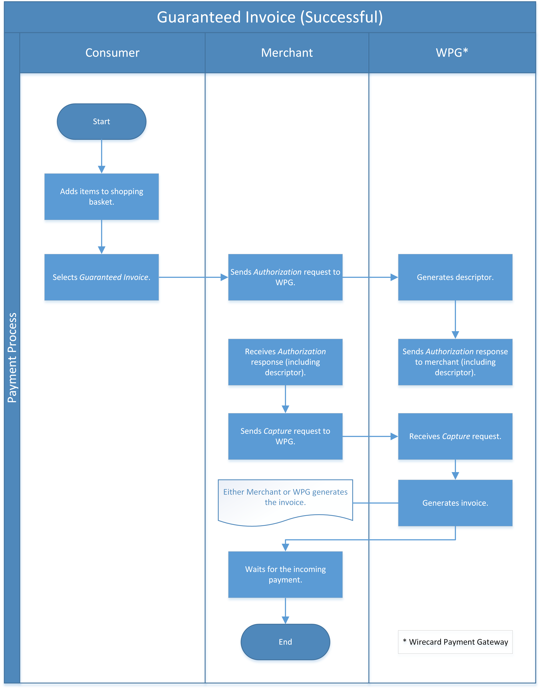

[#GuaranteedInvoiceandDirectDebit]
=== Guaranteed Invoice by Wirecard and Direct Debit

[#GuaranteedInvoiceandDirectDebit_Introduction]
==== Introduction

Guaranteed Invoice by Wirecard and Guaranteed Direct Debit are payment methods which
guarantee that merchants receive money in case the consumer does not pay
(merchants are paid the order amounts by Wirecard in advance of
settlement with consumers). These payment methods are only available
for *Germany*, *Austria* and *Switzerland.*

- *Guaranteed Invoice by Wirecard* allows the consumer to pay by invoice after the
receipt of goods. The invoicing and collection process (dunning) is
handled by Wirecard.
- *Guaranteed Direct Debit* allows the consumer to pay directly from
their bank account. The invoicing, direct debit and collection process
(dunning) is handled by Wirecard.

//-

Basket items must be specified in every request. The response for each
authorization request returns an individual string (an alphanumerical
code, starting with ``DG``) in the field ``descriptor``. The descriptor must
be printed on all invoice documents and saved by the shop (as it must be
used by the consumer on bank transfers; German: “Verwendungszweck”).­­
Capture-authorization transactions have to follow a successful
authorization on the same day the goods are dispatched. The period
between ``authorization`` and the first ``capture-authorization`` must be at
least 4 hours. The merchant may do a partial ``capture-authorization`` if the
goods are shipped in separate shipments.

[#GuaranteedInvoiceandDirectDebit_GeneralInformation]
==== General Information

[#GuaranteedInvoiceandDirectDebit_CountriesandCurrencies]
===== Payment Mode, Countries and Currencies

This table illustrates which payment mode _Guaranteed Invoice by Wirecard and
Guaranteed Direct Debit_ belong to. It also provides detailed
information about the countries and currencies which are relevant for
_Guaranteed Invoice by Wirecard and Guaranteed Direct Debit._

[%autowidth,stripes=none,cols="h,"]
|===
| Payment Mode | <<PaymentMethods_PaymentMode_OnlineBankTransfer, Online Bank Transfer>>
| Countries    | DE, AT, CH +
                 on Payment Page environment: DE only
| Currencies   | EUR, CHF
|===

[#GuaranteedInvoiceandDirectDebit_Communication]
===== Communication Formats

This table illustrates how _Guaranteed Invoice by Wirecard and Guaranteed Direct Debit_ notifications are encoded and which formats and methods can be
used for requests and responses.

[%autowidth,stripes=none]
|===
.2+h| Requests/Responses | Format  | XML
                         | Methods | POST
   h| IPN Encodement   2+| NVP (plain text)
|===

[#GuaranteedInvoiceandDirectDebit_TransactionTypes]
==== Transaction Types

For <<Glossary_TransactionType, transaction type>> details which are not given here, look
at <<AppendixB, AppendixB: Transaction Types>>.

[%autowidth,stripes=none, cols="e,,"]
|===
|Transaction Type | Description | Link to samples

|authorization |Performs a creditworthiness check at the moment when
consumer makes an order. All order items must be listed for the shopping
basket. The authorization amount must match the value of the items in
the basket.
| <<GuaranteedInvoiceandDirectDebit_Samples_GuaranteedInvoice, Guaranteed Invoice by Wirecard samples>>

<<GuaranteedInvoiceandDirectDebit_Samples_DirectDebit, Direct Debit samples>>

|capture-authorization |Used to capture the reserved funds at the moment
when some or all goods are physically delivered to the consumer.
Available only on successful ``authorization`` response which wasn’t voided
nor fully captured. Partial (and multiple) capture is allowed, until
the authorization limit is not exceeded. Basket items only lists the
items that were delivered to the consumer in this delivery, not the ones
that were delivered before or are waiting to be delivered. The total
amount of the capture must be the value of the items in the basket.
|<<GuaranteedInvoiceandDirectDebit_Samples_GuaranteedInvoice, Guaranteed Invoice by Wirecard samples>>

<<GuaranteedInvoiceandDirectDebit_Samples_DirectDebit, Direct Debit samples>>

|void-authorization |Used when the consumer wishes to cancel some or all
(not yet shipped) items from the order. Available only for a successful
``authorization`` response which was not yet voided or captured. Partial and
multiple void are allowed, until all items from the order are canceled
or shipped. Basket items only list those items which are being canceled
from the order.
|<<GuaranteedInvoiceandDirectDebit_Samples_GuaranteedInvoice, Guaranteed Invoice by Wirecard samples>>

<<GuaranteedInvoiceandDirectDebit_Samples_DirectDebit, Direct Debit samples>>

|refund-capture |Used when the consumer wishes to return some or all
delivered goods. Available on a successful ``capture-authorization``.
Partial and multiple refunds are allowed, until all delivered items have
been returned. Basket items list only those items which are being
returned to the merchant.
|<<GuaranteedInvoiceandDirectDebit_Samples_GuaranteedInvoice, Guaranteed Invoice by Wirecard samples>>

<<GuaranteedInvoiceandDirectDebit_Samples_DirectDebit, Direct Debit samples>>

|credit |Used when merchant wishes to grant a discount on an existing
order. Items from this order may already be delivered to the consumer.
Available on a successful ``capture-authorization``. Multiple credits are
allowed, but the overall sum of credits may not exceed the value of the
delivered goods to the consumer. The credit transaction must include a
basket item representing the discount. The credit transaction must refer
to the successful authorization transaction ID.
|<<GuaranteedInvoiceandDirectDebit_Samples_GuaranteedInvoice, Guaranteed Invoice by Wirecard samples>>

<<GuaranteedInvoiceandDirectDebit_Samples_DirectDebit, Direct Debit samples>>
|===

[NOTE]
====
. <<GuaranteedInvoiceandDirectDebit_BasketItemsDetails, Basket items>>  must be specified in every request.
. The response for each ``authorization`` request returns an individual
string (an alphanumerical code, starting with DG) in the
field ``descriptor``.
. The descriptor must be printed on all invoice documents and saved by
the shop (used by consumers in bank transfers; German:
“Verwendungszweck”).­­
. ``capture-authorization`` transactions have to follow a successful
``authorization`` on the same day the goods are dispatched.
. The period between ``authorization`` and the first
``capture-authorization`` must be at least 4 hours.
. Merchants can request partial ``capture-authorizations`` if the goods
are shipped in separate shipments.

//-
====

[#GuaranteedInvoiceandDirectDebit_TestCredentials]
==== Test Credentials

[%autowidth,stripes=none]
|===
.2+h| URLs (Endpoints)            | For transaction type ``authorization`` | `\https://api-test.wirecard.com/engine/rest/paymentmethods`
                                  | For transaction types ``capture-authorization``, ``refund-capture``,
                                    ``void-authorization`` and ``credit``
                                                                         |``\https://api-test.wirecard.com/engine/rest/payments``
.2+h| Merchant Account ID (MAID)  | Guaranteed Invoice by Wirecard       | 7d7edecb-b008-4f05-9103-308c81cf2ea2
                                  | Guaranteed Direct Debit | 3cfb0fb7-59e2-4d92-847f-37121d633844
   h| Username                  2+| 16390-testing
   h| Password                  2+| 3!3013=D3fD8X7
.2+h| Secret Key                  | Guaranteed Invoice by Wirecard       | 555d998b-15db-46a9-8f1f-d9bc3ec66b19
                               .2+| Guaranteed Direct Debit  | cf0b29fc-a6ab-474d-b6be-92e9596e9107
|===

[#GuaranteedInvoiceandDirectDebit_Workflow]
==== Workflow

[#GuaranteedInvoiceandDirectDebit_StandardProcess]
===== Standard Process

[#GuaranteedInvoiceandDirectDebit_GuaranteedInvoice]
====== Guaranteed Invoice by Wirecard

. Consumer adds items to shopping basket.
. Consumer selects the payment method _Guaranteed Invoice by Wirecard._
. Merchant sends an _authorization_ request including items to
Wirecard.
. Merchant receives an _authorization_ response, including the
descriptor (an alphanumerical code, starting with ``DG``).
. Merchant sends a _capture_ request to Wirecard when the items
are ready for delivery.
. After a successful _capture_ request, Wirecard or Merchant generates
the invoice, including the descriptor (an alphanumerical code, starting
with DG).
. Merchant waits for the incoming payment.
. If any payment changes are necessary, the following transaction types
are available: ``credit``, ``refund-capture`` or ``void-authorization``.

//-

[#GuaranteedInvoiceandDirectDebit_GuaranteedDirectDebit]
====== Guaranteed Direct Debit

image::images/11-11-guaranteed-invoice-and-direct-debit/guaranteed_DD_workflow.png[Guaranteed Direct Debit Workflow, width=950, align="center"]

. Consumer adds items to shopping basket.
. Consumer selects the payment method _Guaranteed Direct Debit_.
. Merchant sends an _authorization_ request including items to
Wirecard.
. Merchant receives an _authorization_ response, including the
descriptor (an alphanumerical code, starting with DG).
. Merchant sends a _capture_ request to Wirecard when the items
are ready for delivery.
. After a successful _capture_ request, Wirecard or Merchant generates
the invoice, including the descriptor (an alphanumerical code, starting
with DG).
. Wirecard Bank collects the transaction amount from consumer's
bank account.
. If any payment changes are necessary, the following transaction types
are available: ``credit``, ``refund-capture`` or ``void-authorization``.

//-

[#GuaranteedInvoiceandDirectDebit_ProcessChain]
===== Process Chain

Every merchant needs to follow the process chains below successfully in
a test environment to get an approval to go live. Wirecard checks and
approves the frontend/checkout and invoices (if generated and sent out
by the merchant).

NOTE: Please provide us with the order number and descriptor for each
transaction. 

[#GuaranteedInvoiceandDirectDebit_SimpleProcessChainforGuaranteedInvoice]
====== Simple Process Chain for Guaranteed Invoice by Wirecard

.A: Partial Cancelations

. Order (2 products + shipping costs + voucher) ``authorization``
. Partial cancellation of 1 product ``void-authorization``
. Partial cancellation of the rest ``void-authorization``

//-

.B: Full Cancellation

. Order (2 products + shipping costs) ``authorization``
. Full order cancellation ``void-authorization``

//-

.C: Partial Deliveries

. Order (3 products + shipping costs + voucher) ``authorization``
. Partial delivery of 1 product + shipping costs + voucher ``capture-authorization``
. Partial delivery of the rest ``capture-authorization``

//-

.D: Partial Cancellation & Partial Delivery

. Order (2 products + shipping costs + voucher) ``authorization``
. Partial cancellation of 1 product ``void-authorization``
. Partial delivery of 1 product + shipping costs + voucher ``capture-authorization``
. Invoice generation 

//-

.E: Partial Returns

. Order (2 products + shipping costs + voucher) ``authorization``
. Complete delivery of the order ``capture-authorization``
. Invoice generation
. Partial return of 1 product ``refund-capture``
. Partial return of the rest ``refund-capture`` 

//-

.F: Full Return

. Order (2 products + shipping costs + voucher) ``authorization``
. Complete delivery of the order ``capture-authorization``
. Invoice generation
. Full return of the order ``refund-capture`` 

//-

.G: Reduction

. Order (2 products + shipping costs + voucher) ``authorization``
. Reduction with negative amount ``credit``
. Complete delivery of the order ``capture-authorization``
. Invoice generation

//-

[#GuaranteedInvoiceandDirectDebit_ComplexProcessChainforGuaranteedInvoice]
====== Complex Process Chain for Guaranteed Invoice by Wirecard

.X: Reduction & Adjustment Charges

. Order (6 products including shipping costs) ``authorization``
. Reduction with negative amount ``credit``
. Partial delivery of 2 products + reduction ``capture-authorization``
. Invoice generation 
. Adjustment charge with positive amount ``credit``
. Partial delivery of the rest = 4 products + adjustment charge ``capture-authorization``
. Invoice generation
. Reduction with negative amount ``credit``

//-

.Y: Partial Cancellation & Partial Return

. Order (6 products including shipping costs) ``authorization``
. Partial delivery of 3 products ``capture-authorization``
. Invoice generation
. Partial cancellation of 1 product ``void-authorization``
. Partial return of 2 products ``refund-capture``
. Partial delivery of 2 products ``capture-authorization``
. Invoice generation
. Partial return of the rest = 3 products ``refund-capture``

//-

[#GuaranteedInvoiceandDirectDebit_Fields]
==== Fields

The following elements are mandatory *M*, optional *O* or conditional
*C* for sending a request for the payment method Guaranteed Invoice by Wirecard and Guaranteed Direct Debit (complete field
list available in <<RestApi_Fields, REST API field list>>):

[%autowidth,stripes=none, cols="v,,,,"]
|===
| Field  | Cardinality  | Datatype  | Size  | Description

5+a|
[[GuaranteedInvoiceandDirectDebit_Fields_Payment]]
[discrete]
===== payment

|_merchant-account-id_
|M
|Alphanumeric
|36
|Unique identifier for a merchant account

|_request-id_
|M
|Alphanumeric
|150
|This is the identification number of the request.

*It has to be unique for each request.*

|_transaction-type_
|M
|Alphanumeric
|30
|This is the type for a transaction: ``authorization``, ``capture``, ``void-authorization``, ``refund-capture`` and ``credit`` are supported for Guaranteed Invoice by Wirecard and Guaranteed Direct Debit.

|_requested-amount_
|M
|Numeric
|18,3
|This is the amount of the transaction. The amount of the decimal place depends on the currency. The amount must be between a defined minimum value and a defined maximum value.

|_requested-amount@currency_
|M
|
|
|This is the currency of the transaction. For Germany and Austria, only ``EUR`` is allowed. Switzerland additionally accepts ``CHF``.

|_order-detail_
|O
|Alphanumeric
|65535
|Details of the order filled by the merchant.

|_order-number_
|M
|Alphanumeric
|64
|The order number from the merchant.

|_consumer-id_
|O
|Alphanumeric
|
|Merchant’s identifier for the consumer.

|_invoice-id_
|O
|Alphanumeric
|
|Merchant’s invoice identifier.

|_creditor-id_
|C
|Alphanumeric
|
|Wirecard Bank creditor identifier, provided by Wirecard Support

*Mandatory for Guaranteed Direct Debit only.*

|_locale_
|O
|Alphanumeric
|
|It is used to control the language of the consumer message and the correspondence to the consumer. Allowed values: ``fr``, ``en``, ``nl``, ``de``.
If empty or with wrong value, German language is used by default. The same logic applies for Payment Page integration.

5+a|
[[GuaranteedInvoiceandDirectDebit_Fields_PaymentMethods]]
[discrete]
===== payment-methods

|_payment-methods.payment-method@name_
|M
|Alphanumeric
|15
|The name of the Payment Method is ``ratepay-invoice`` or ``ratepay-elv``.

5+a|
[[GuaranteedInvoiceandDirectDebit_Fields_AccountHolder]]
[discrete]
===== account-holder

|_account-holder.first-name_
|M
|Alphanumeric
|
|

|_account-holder.last-name_
|M
|Alphanumeric
|
|

|_account-holder.email_
|M
|Alphanumeric
|
|

|_account-holder.phone_
|M
|Alphanumeric
|
|

|_account-holder.date-of-birth_
|M
|Alphanumeric
|
|

|_account-holder.gender_
|O
|Token
|
|

5+a|
[[GuaranteedInvoiceandDirectDebit_Fields_AccountHolderAddress]]
[discrete]
===== account-holder.address

|_account-holder.address.street1_
|M
|Alphanumeric
|
|Must include house number.

|_account-holder.address.street2_
|O
|Alphanumeric
|
|

|_account-holder.address.city_
|M
|Alphanumeric
|
|

|_account-holder.address.state_
|O
|Alphanumeric
|
|

|_account-holder.address.country_
|M
|Token
|
|

|_account-holder.address.postal-code_
|M
|Alphanumeric
|
|

4+a|
[[GuaranteedInvoiceandDirectDebit_Fields_BankAccount]]
[discrete]
===== bank-account

|Consumer's bank account details.

*Mandatory for Guaranteed Direct Debit only.*

|_bank-account.bank-name_
|M
|Alphanumeric
|
|

|_bank-account.iban_
|C
|Alphanumeric
|
|Mandatory if ``account-number`` is not used

|_bank-account.bic_
|C
|Alphanumeric
|
|Mandatory if ``iban`` is used

|_bank-account.account-number_
|C
|Alphanumeric
|
|Mandatory if ``iban`` is not used

|_bank-account.bank-code_
|C
|Alphanumeric
|
|Mandatory if ``account-number`` is used

5+a|
[[GuaranteedInvoiceandDirectDebit_Fields_OrderItems]]
[discrete]
===== order-items

|_order-items.order-item.name_
|M
|Alphanumeric
|
|Name of the item in the basket.

|_order-items.order-item.article-number_
|M
|Alphanumeric
|
|EAN or other article identifier for merchant.

|_order-items.order-item.amount_
|M
|Number
|
|Item’s price per unit.

|_order-items.order-item.tax-rate_
|M
|Number
|
|Item’s tax rate per unit.

|_order-items.order-item.quantity_
|M
|Number
|
|Total count of items in the order.

4+a|
[[GuaranteedInvoiceandDirectDebit_Fields_Shipping]]
[discrete]
===== shipping

|Shipping fields have to match the billing address (specified as <<GuaranteedInvoiceandDirectDebit_Fields_AccountHolder, account-holder>>).

|_shipping/first-name_
|O
|Alphanumeric
|
|

|_shipping/last-name_
|O
|Alphanumeric
|
|

|_shipping/phone_
|O
|Alphanumeric
|
|

4+a|
[[GuaranteedInvoiceandDirectDebit_Fields_ShippingAaddress]]
[discrete]
===== shipping/address

|Shipping/address fields have to match the billing address (specified as <<GuaranteedInvoiceandDirectDebit_Fields_AccountHolderAddress, account-holder.address>>).

|_shipping/address/street1_
|O
|Alphanumeric
|
|

|_shipping/address/street2_
|O
|Alphanumeric
|
|

|_shipping/address/city_
|O
|Alphanumeric
|
|

|_shipping/address/state_
|O
|Alphanumeric
|
|

|_shipping/address/country_
|O
|Alphanumeric
|
|

|_shipping/address/postal-code_
|O
|Alphanumeric
|
|
5+a|
[[GuaranteedInvoiceandDirectDebit_Fields_Device]]
[discrete]
===== device

|_device/fingerprint_
|C
|Alphanumeric
|
|Device fingerprinting token that was used in merchant’s online shop to track this transaction.

*It is mandatory for ``authorization``.*

5+a|
[[GuaranteedInvoiceandDirectDebit_Fields_Mandate]]
[discrete]
===== mandate

|_mandate.mandate-id_
|C
|Alphanumeric
|
|Mandate ID will be generated by Wirecard. Please use the following statement as placeholder: “Wird nach Kaufabschluss übermittelt“

*Mandatory for Guaranteed Direct Debit only.*
|===

[#GuaranteedInvoiceandDirectDebit_Features]
==== Features

[#GuaranteedInvoiceandDirectDebit_Features_Bankaccountdetails]
===== Bank Account Details

consist either of

- ``account-owner``, ``bank-name``, ``account-number`` and ``bank-code`` +
or
- ``account-owner``, ``bank-name``, ``iban`` and ``bic`` for SEPA standard.

NOTE: Account holder details must
cover ``first-name``, ``last-name``,`` email``,`` phone``, ``date-of-birth``,`` address``
and ``gender``. An address within the account holder details must
``include street1`` (including house number),`` city``, ``country`` and ``postal-code``.

NOTE: Shipping address has to match the billing address. 

[#GuaranteedInvoiceandDirectDebit_BasketItemsDetails]
===== Basket Items Details

Basket items details must be sent along with every request. Content of
the shopping basket depends on the location of the items.
There can be 3 different locations:

- the (distribution) storage of the merchant,
- the delivery (items are „on the road“); and
- home of the consumer.

The shopping basket always contains the items that are being authorized
(ordered), captured (delivered), voided (canceled), refunded (returned)
or credited depending to the transaction type.

The detailed items of the shopping basket will be stored as a part of
payment details on provider and they can be obtained from Wirecard
Processing API later as part of transaction details.

[cols="v,,,"]
|===
| Field                                   | Cardinality  Req/Resp  | Datatype     | Description

| _order-items.order-item.name_           | M                      | Alphanumeric | Name of the item in the basket.
| _order-items.order-item.article-number_ | M                      | Alphanumeric | EAN or other article identifier for merchant.
| _order-items.order-item.amount_         | M                      | Number       | Item’s price per unit.
| _order-items.order-item.tax-rate_       | M                      | Number       | Item’s tax rate per unit.
| _order-items.order-item.quantity_       | M                      | Number       | Total count of items in the order.
|===

[#GuaranteedInvoiceandDirectDebit_DeviceFingerprint_GuaranteedInvoice]
===== Device Fingerprint (Guaranteed Invoice by Wirecard)

[#GuaranteedInvoiceandDirectDebit_DeviceFingerprint_GuaranteedInvoice_Introduction]
====== Introduction

_Device Fingerprint (Guaranteed Invoice by Wirecard)_ is a method of fraud
protection and able to identify technical devices. Fraudsters learn to
exploit the weaknesses of traditional fraud prevention tools over time.
We protect businesses from fraud and loss of revenue with innovative
fraud prevention: by automatically linking transactions, fraud can be
detected in real time. With our self-learning and adaptive software you
are prepared to face new and upcoming fraud scenarios. This document
describes the procedure of a _Device Fingerprint_ call and how to
implement its result in the PAYMENT_QUERY operation and PAYMENT_REQUEST
operation.

[#GuaranteedInvoiceandDirectDebit_DeviceFingerprint_GuaranteedInvoice_UniqueToken]
====== Generate a Unique Token

To generate a fingerprint you first need to create a unique token within
your online shop. To ensure that the token is really unique, we suggest
using a combination of customer id and timestamp which is encrypted,
with MD5 for instance.

.Generate a unique token (Example)
[source,php]
----
$deviceIdentSId = 'WDWL';
$timestamp = microtime();
$customerId = $customerObject->getId();
$deviceIdentToken = md5($customerId . "_" . $timestamp);
----

[#GuaranteedInvoiceandDirectDebit_DeviceFingerprint_GuaranteedInvoice_RunJavaScript]
====== Run JavaScript

We recommend outputting the _Device Fingerprint_ JavaScript code as
early as possible to get a sufficient latency between script call and
end of the order.

For instance when the customer entered the checkout or when the customer
is putting a first item into the cart.

Please ensure that this script is executed only one-time per session
(per customer + checkout + device).

.Output Device Fingerprint JavaScript/HTML/PHP (Example)
[source,php]
----

 
 <noscript><link rel="stylesheet" type="text/css" href="//d.ratepay.com/di.css?t=<?php echo $deviceIdentToken ?>&v=<?php echo $deviceIdentSId ?>&l=Checkout">
</noscript>
<object type="application/x-shockwave-flash" data="//d.ratepay.com/<?php echo $deviceIdentSId?>/c.swf" width="0" height="0">
<param name="movie" value="//d.ratepay.com/<?php echo $deviceIdentSId ?>/c.swf" />
<param name="flashvars" value="t=<?php echo $deviceIdentToken ?>&v=<?php echo $deviceIdentSId?>"/><param name="AllowScriptAccess" value="always"/>
</object>
----

[#GuaranteedInvoiceandDirectDebit_DeviceFingerprint_GuaranteedInvoice_DataTransferToWirecard]
====== Data Transfer to Wirecard

Please transfer the ``deviceIdentToken`` within the authorization request to
Wirecard. You can find a corresponding XML sample for either <<GuaranteedInvoiceandDirectDebit_Samples_GuaranteedInvoice, Guaranteed Invoice by Wirecard>> or <<GuaranteedInvoiceandDirectDebit_Samples_DirectDebit, Guaranteed Direct Debit>>.

[#GuaranteedInvoiceandDirectDebit_RegularConsumers]
===== Regular Consumers

Regular consumers who pay their bills on time are important capital for
each merchant. With Wirecard, merchants can use this capital as a
payment method.

To accomplish that, merchants simply submit a list with the order and
payment history of their consumers to Wirecard.

https://wcdwl.ratepay.com/index.php/en/overview.html[Here] you can
find which format (and content) you need for the list and how to upload
it.

[#GuaranteedInvoiceandDirectDebit_ConsenttoGeneralTermsandConditions]
===== Consent to General Terms and Conditions

During checkout, the consumer has to agree to Wirecard's general terms
and conditions. They have to give their consent by ticking an
appropriate checkbox.

|===
|Language |Check-box text |Correct links

|English
|I herewith confirm that I have read the https://www.wirecardbank.com/privacy-documents/datenschutzhinweise-fuer-die-wirecard-zahlarten/[privacy
notice] and https://www.wirecardbank.com/privacy-documents/zusatzliche-geschaftsbedingungen-fur-wirecard-zahlarten/[additional terms and conditions] for Wirecard payment types and that I accept their
validity.
a|
- https://www.wirecardbank.com/privacy-documents/datenschutzhinweise-fuer-die-wirecard-zahlarten/[privacy notice]:
link to
https://www.wirecardbank.com/privacy-documents/datenschutzhinweise-fuer-die-wirecard-zahlarten/
- https://www.wirecardbank.com/privacy-documents/zusatzliche-geschaftsbedingungen-fur-wirecard-zahlarten/[additional terms and conditions]:
link to
https://www.wirecardbank.com/privacy-documents/zusatzliche-geschaftsbedingungen-fur-wirecard-zahlarten/
|Deutsch
|Hiermit bestätige ich, dass ich die https://www.wirecardbank.de/privacy-documents/datenschutzhinweis-fur-die-wirecard-zahlarten/[Datenschutzhinweise]
und https://www.wirecardbank.de/privacy-documents/zusatzliche-geschaftsbedingungen-fur-wirecard-zahlarten/[zusätzlichen Geschäftsbedingungen] für Wirecard-Zahlarten zur Kenntnis genommen habe und mit deren Geltung einverstanden bin.
a|
- https://www.wirecardbank.de/privacy-documents/datenschutzhinweis-fur-die-wirecard-zahlarten/[Datenschutzhinweise]:
link to
https://www.wirecardbank.de/privacy-documents/datenschutzhinweis-fur-die-wirecard-zahlarten/[https://www.wirecardbank.com/privacy-documents/datenschutzhinweise-fuer-die-wirecard-zahlarten/]
- https://www.wirecardbank.de/privacy-documents/zusatzliche-geschaftsbedingungen-fur-wirecard-zahlarten/[zusätzliche Geschäftsbedingungen]:
link to
https://www.wirecardbank.de/privacy-documents/zusatzliche-geschaftsbedingungen-fur-wirecard-zahlarten/[https://www.wirecardbank.com/privacy-documents/zusatzliche-geschaftsbedingungen-fur-wirecard-zahlarten/]
|===

Make sure that the privacy notice and the additional terms and
conditions are linked properly.

[#GuaranteedInvoiceandDirectDebit_AdditionalBusinessContitions]
====== Additional business conditions

When the consumers use either _Guaranteed Invoice by Wirecard_ or _Guaranteed Direct Debit,_
payments with debt discharging effect can be made solely to Wirecard.

[#GuaranteedInvoiceandDirectDebit_Samples]
==== Samples

Click <<GeneralPlatformFeatures_IPN_NotificationExamples, here>> for corresponding notification samples.

[#GuaranteedInvoiceandDirectDebit_Samples_GuaranteedInvoice]
===== Guaranteed Invoice by Wirecard

[#GuaranteedInvoiceandDirectDebit_Samples_GuaranteedInvoice_Authorization]
====== _authorization_

.XML authorization Request (Successful)
[source,xml]
----
<?xml version="1.0" encoding="utf-8" standalone="yes"?>
<payment xmlns="http://www.elastic-payments.com/schema/payment">
  <merchant-account-id>7d7edecb-b008-4f05-9103-308c81cf2ea2</merchant-account-id>
  <request-id>{{$guid}}</request-id>
  <transaction-type>authorization</transaction-type>
  <payment-methods>
    <payment-method name="ratepay-invoice" />
  </payment-methods>
  <requested-amount currency="EUR">400</requested-amount>
  <order-number>180801110644949</order-number>
  <account-holder>
    <first-name>John</first-name>
    <last-name>Doe</last-name>
    <email>John@doe.de</email>
    <phone>03018425165</phone>
    <date-of-birth>27-12-1973</date-of-birth>
    <address>
      <street1>Nicht versenden Weg 12</street1>
      <city>Berlin</city>
      <state>Berlin</state>
      <country>DE</country>
      <postal-code>13353</postal-code>
    </address>
  </account-holder>
  <order-items>
    <order-item>
      <name>Denim 753 Blue 27/32</name>
      <article-number>1</article-number>
      <amount currency="EUR">150</amount>
      <tax-rate>19</tax-rate>
      <quantity>1</quantity>
    </order-item>
    <order-item>
      <name>Women V-Neck S</name>
      <article-number>12</article-number>
      <amount currency="EUR">50</amount>
      <tax-rate>19</tax-rate>
      <quantity>1</quantity>
    </order-item>
    <order-item>
      <name>Sneakers Size 44</name>
      <article-number>123</article-number>
      <amount currency="EUR">200</amount>
      <tax-rate>19</tax-rate>
      <quantity>1</quantity>
    </order-item>
  </order-items>
  <locale>nl</locale>
</payment>
----

.XML authorization Response (Successful)
[source,xml]
----
<?xml version="1.0" encoding="utf-8" standalone="yes"?>
<payment xmlns="http://www.elastic-payments.com/schema/payment" xmlns:ns2="http://www.elastic-payments.com/schema/epa/transaction">
  <merchant-account-id>7d7edecb-b008-4f05-9103-308c81cf2ea2</merchant-account-id>
  <transaction-id>32783284-5bce-4d5f-aca6-25fa17f6ad53</transaction-id>
  <request-id>8b4b145e-fb5a-4c12-ad9a-396a46b83593</request-id>
  <transaction-type>authorization</transaction-type>
  <transaction-state>success</transaction-state>
  <completion-time-stamp>2018-08-01T09:06:46.000Z</completion-time-stamp>
  <statuses>
    <status code="201.0000" description="The resource was successfully created." severity="information" provider-transaction-id="09-201808019802726" />
  </statuses>
  <requested-amount currency="EUR">400</requested-amount>
  <account-holder>
    <first-name>John</first-name>
    <last-name>Doe</last-name>
    <email>John@doe.de</email>
    <phone>03018425165</phone>
    <address>
      <street1>Nicht versenden Weg 12</street1>
      <city>Berlin</city>
      <state>Berlin</state>
      <country>DE</country>
      <postal-code>13353</postal-code>
    </address>
  </account-holder>
  <order-number>180801110644949</order-number>
  <order-items>
    <order-item>
      <name>Denim 753 Blue 27/32</name>
      <article-number>1</article-number>
      <amount currency="EUR">150</amount>
      <tax-rate>19</tax-rate>
      <quantity>1</quantity>
    </order-item>
    <order-item>
      <name>Women V-Neck S</name>
      <article-number>12</article-number>
      <amount currency="EUR">50</amount>
      <tax-rate>19</tax-rate>
      <quantity>1</quantity>
    </order-item>
    <order-item>
      <name>Sneakers Size 44</name>
      <article-number>123</article-number>
      <amount currency="EUR">200</amount>
      <tax-rate>19</tax-rate>
      <quantity>1</quantity>
    </order-item>
  </order-items>
  <descriptor>DK0073634K2</descriptor>
  <payment-methods>
    <payment-method name="ratepay-invoice" />
  </payment-methods>
  <locale>nl</locale>
</payment>
----

[#GuaranteedInvoiceandDirectDebit_Samples_GuaranteedInvoice_CaptureAuthorization]
====== _capture-authorization_

.XML capture-authorization Request (Successful)
[source,xml]
----
<?xml version="1.0" encoding="utf-8" standalone="yes"?>
<payment xmlns="http://www.elastic-payments.com/schema/payment">
  <merchant-account-id>7d7edecb-b008-4f05-9103-308c81cf2ea2</merchant-account-id>
  <request-id>{{$guid}}</request-id>
  <transaction-type>capture-authorization</transaction-type>
  <payment-methods>
    <payment-method name="ratepay-invoice" />
  </payment-methods>
  <requested-amount currency="EUR">200</requested-amount>
  <parent-transaction-id>32783284-5bce-4d5f-aca6-25fa17f6ad53</parent-transaction-id>
  <order-items>
    <order-item>
      <name>Denim 753 Blue 27/32</name>
      <article-number>1</article-number>
      <amount currency="EUR">150</amount>
      <tax-rate>19</tax-rate>
      <quantity>1</quantity>
    </order-item>
    <order-item>
      <name>Women V-Neck S</name>
      <article-number>12</article-number>
      <amount currency="EUR">50</amount>
      <tax-rate>19</tax-rate>
      <quantity>1</quantity>
    </order-item>
  </order-items>
</payment>
----

.XML capture-authorization Response (Successful)
[source,xml]
----
<?xml version="1.0" encoding="utf-8" standalone="yes"?>
<payment xmlns="http://www.elastic-payments.com/schema/payment" xmlns:ns2="http://www.elastic-payments.com/schema/epa/transaction" self="https://api-test.wirecard.com:443/engine/rest/merchants/7d7edecb-b008-4f05-9103-308c81cf2ea2/payments/789b1a74-2d07-477c-a5eb-d6dd61872d88">
  <merchant-account-id ref="https://api-test.wirecard.com:443/engine/rest/config/merchants/7d7edecb-b008-4f05-9103-308c81cf2ea2">7d7edecb-b008-4f05-9103-308c81cf2ea2</merchant-account-id>
  <transaction-id>789b1a74-2d07-477c-a5eb-d6dd61872d88</transaction-id>
  <request-id>314fa896-16ba-4787-b12d-0a7d1169105b</request-id>
  <transaction-type>capture-authorization</transaction-type>
  <transaction-state>success</transaction-state>
  <completion-time-stamp>2018-08-01T09:07:19.000Z</completion-time-stamp>
  <statuses>
    <status code="201.0000" description="ratepay:The resource was successfully created." severity="information" provider-transaction-id="09-201808019802726" />
  </statuses>
  <requested-amount currency="EUR">200</requested-amount>
  <parent-transaction-id>32783284-5bce-4d5f-aca6-25fa17f6ad53</parent-transaction-id>
  <account-holder>
    <first-name>John</first-name>
    <last-name>Doe</last-name>
    <email>John@doe.de</email>
    <phone>03018425165</phone>
    <address>
      <street1>Nicht versenden Weg 12</street1>
      <city>Berlin</city>
      <state>Berlin</state>
      <country>DE</country>
      <postal-code>13353</postal-code>
    </address>
  </account-holder>
  <order-number>180801110644949</order-number>
  <order-items>
    <order-item>
      <name>Denim 753 Blue 27/32</name>
      <article-number>1</article-number>
      <amount currency="EUR">150</amount>
      <tax-rate>19</tax-rate>
      <quantity>1</quantity>
    </order-item>
    <order-item>
      <name>Women V-Neck S</name>
      <article-number>12</article-number>
      <amount currency="EUR">50</amount>
      <tax-rate>19</tax-rate>
      <quantity>1</quantity>
    </order-item>
  </order-items>
  <descriptor>DK0073634K2</descriptor>
  <payment-methods>
    <payment-method name="ratepay-invoice" />
  </payment-methods>
  <parent-transaction-amount currency="EUR">400.000000</parent-transaction-amount>
  <api-id>elastic-api</api-id>
  <locale>nl</locale>
  <provider-account-id>0000003174069FC7</provider-account-id>
</payment>
----

[#GuaranteedInvoiceandDirectDebit_Samples_GuaranteedInvoice_Credit]
====== _credit_

.XML credit Request (Successful)
[source,xml]
----
<?xml version="1.0" encoding="utf-8" standalone="yes"?>
<payment xmlns="http://www.elastic-payments.com/schema/payment">
  <merchant-account-id>7d7edecb-b008-4f05-9103-308c81cf2ea2</merchant-account-id>
  <request-id>{{$guid}}</request-id>
  <transaction-type>credit</transaction-type>
  <payment-methods>
    <payment-method name="ratepay-invoice" />
  </payment-methods>
  <parent-transaction-id>32783284-5bce-4d5f-aca6-25fa17f6ad53</parent-transaction-id>
  <requested-amount currency="EUR">10</requested-amount>
 <account-holder>
  <first-name>John</first-name>
  <last-name>Doe</last-name>
  <email>John@doe.de</email>
  <phone>03018425165</phone>
     <date-of-birth>27-12-1973</date-of-birth>
     <address>
       <street1>Nicht versenden Weg 12</street1>
       <city>Berlin</city>
       <state>Berlin</state>
       <country>DE</country>
       <postal-code>13353</postal-code>
     </address>
  </account-holder>
  <order-items>
    <order-item>
      <name>Nachlass über € 10,00</name>
      <article-number>1</article-number>
      <amount currency="EUR">10</amount>
      <tax-rate>19</tax-rate>
      <quantity>1</quantity>
    </order-item>
  </order-items>
</payment>
----

.XML credit Response (Successful)
[source,xml]
----
<?xml version="1.0" encoding="utf-8" standalone="yes"?>
<payment xmlns="http://www.elastic-payments.com/schema/payment" xmlns:ns2="http://www.elastic-payments.com/schema/epa/transaction" self="https://api-test.wirecard.com:443/engine/rest/merchants/7d7edecb-b008-4f05-9103-308c81cf2ea2/payments/42a30b0b-9aed-47cb-89e5-dc3649d770b2">
  <merchant-account-id ref="https://api-test.wirecard.com:443/engine/rest/config/merchants/7d7edecb-b008-4f05-9103-308c81cf2ea2">7d7edecb-b008-4f05-9103-308c81cf2ea2</merchant-account-id>
  <transaction-id>42a30b0b-9aed-47cb-89e5-dc3649d770b2</transaction-id>
  <request-id>0891f924-c326-4a39-ab04-2d240743a161</request-id>
  <transaction-type>credit</transaction-type>
  <transaction-state>success</transaction-state>
  <completion-time-stamp>2018-08-01T09:07:54.000Z</completion-time-stamp>
  <statuses>
    <status code="201.0000" description="ratepay:The resource was successfully created." severity="information" provider-transaction-id="09-201808019802726" />
  </statuses>
  <requested-amount currency="EUR">10</requested-amount>
  <parent-transaction-id>32783284-5bce-4d5f-aca6-25fa17f6ad53</parent-transaction-id>
  <account-holder>
    <first-name>John</first-name>
    <last-name>Doe</last-name>
    <email>John@doe.de</email>
    <phone>03018425165</phone>
    <address>
      <street1>Nicht versenden Weg 12</street1>
      <city>Berlin</city>
      <state>Berlin</state>
      <country>DE</country>
      <postal-code>13353</postal-code>
    </address>
  </account-holder>
  <order-number>180801110644949</order-number>
  <order-items>
    <order-item>
      <name>Nachlass ?ber ? 10,00</name>
      <article-number>1</article-number>
      <amount currency="EUR">10</amount>
      <tax-rate>19</tax-rate>
      <quantity>1</quantity>
    </order-item>
  </order-items>
  <descriptor>DK0073634K2</descriptor>
  <payment-methods>
    <payment-method name="ratepay-invoice" />
  </payment-methods>
  <parent-transaction-amount currency="EUR">400.000000</parent-transaction-amount>
  <api-id>elastic-api</api-id>
  <locale>nl</locale>
  <provider-account-id>0000003174069FC7</provider-account-id>
</payment>
----

[#GuaranteedInvoiceandDirectDebit_Samples_GuaranteedInvoice_RefundCapture]
====== _refund-capture_

.XML refund-capture Request (Successful)
[source,xml]
----
<?xml version="1.0" encoding="utf-8" standalone="yes"?>
<payment xmlns="http://www.elastic-payments.com/schema/payment">
    <merchant-account-id>7d7edecb-b008-4f05-9103-308c81cf2ea2</merchant-account-id>
    <request-id>{{$guid}}</request-id>
    <transaction-type>refund-capture</transaction-type>
    <payment-methods>
        <payment-method name="ratepay-invoice" />
    </payment-methods>
    <requested-amount currency="EUR">50</requested-amount>
    <parent-transaction-id>789b1a74-2d07-477c-a5eb-d6dd61872d88</parent-transaction-id>
    <order-items>
    <order-item>
      <name>Women V-Neck S</name>
      <article-number>12</article-number>
      <amount currency="EUR">50</amount>
      <tax-rate>19</tax-rate>
      <quantity>1</quantity>
    </order-item>
    </order-items></payment>
----

.XML refund-capture Response (Successful)
[source,xml]
----
<?xml version="1.0" encoding="utf-8" standalone="yes"?>
<payment xmlns="http://www.elastic-payments.com/schema/payment" xmlns:ns2="http://www.elastic-payments.com/schema/epa/transaction" self="https://api-test.wirecard.com:443/engine/rest/merchants/7d7edecb-b008-4f05-9103-308c81cf2ea2/payments/34c6ed51-c417-413e-a1f0-e7074f24b19b">
  <merchant-account-id ref="https://api-test.wirecard.com:443/engine/rest/config/merchants/7d7edecb-b008-4f05-9103-308c81cf2ea2">7d7edecb-b008-4f05-9103-308c81cf2ea2</merchant-account-id>
  <transaction-id>34c6ed51-c417-413e-a1f0-e7074f24b19b</transaction-id>
  <request-id>d7287da8-00a9-48b0-ac3b-8ea14a1f3440</request-id>
  <transaction-type>refund-capture</transaction-type>
  <transaction-state>success</transaction-state>
  <completion-time-stamp>2018-08-01T09:08:33.000Z</completion-time-stamp>
  <statuses>
    <status code="201.0000" description="ratepay:The resource was successfully created." severity="information" provider-transaction-id="09-201808019802726" />
  </statuses>
  <requested-amount currency="EUR">50</requested-amount>
  <parent-transaction-id>789b1a74-2d07-477c-a5eb-d6dd61872d88</parent-transaction-id>
  <account-holder>
    <first-name>John</first-name>
    <last-name>Doe</last-name>
    <email>John@doe.de</email>
    <phone>03018425165</phone>
    <address>
      <street1>Nicht versenden Weg 12</street1>
      <city>Berlin</city>
      <state>Berlin</state>
      <country>DE</country>
      <postal-code>13353</postal-code>
    </address>
  </account-holder>
  <order-number>180801110644949</order-number>
  <order-items>
    <order-item>
      <name>Women V-Neck S</name>
      <article-number>12</article-number>
      <amount currency="EUR">50</amount>
      <tax-rate>19</tax-rate>
      <quantity>1</quantity>
    </order-item>
  </order-items>
  <descriptor>DK0073634K2</descriptor>
  <payment-methods>
    <payment-method name="ratepay-invoice" />
  </payment-methods>
  <parent-transaction-amount currency="EUR">200.000000</parent-transaction-amount>
  <api-id>elastic-api</api-id>
  <locale>nl</locale>
  <provider-account-id>0000003174069FC7</provider-account-id>
</payment>
----

[#GuaranteedInvoiceandDirectDebit_Samples_GuaranteedInvoice_VoidAuthorization]
====== _void-authorization_

.XML void-authorization Request (Successful)
[source,xml]
----
<?xml version="1.0" encoding="utf-8"?>
<payment xmlns="http://www.elastic-payments.com/schema/payment">
  <merchant-account-id>7d7edecb-b008-4f05-9103-308c81cf2ea2</merchant-account-id>
  <request-id>{{$guid}}</request-id>
  <transaction-type>void-authorization</transaction-type>
  <payment-methods>
    <payment-method name="ratepay-invoice" />
  </payment-methods>
  <parent-transaction-id>32783284-5bce-4d5f-aca6-25fa17f6ad53</parent-transaction-id>
  <requested-amount currency="EUR">200</requested-amount>
  <account-holder>
        <first-name>John</first-name>
  <last-name>Doe</last-name>
  <email>John@doe.de</email>
    <phone>03018425165</phone>
    <date-of-birth>27-12-1973</date-of-birth>
    <address>
      <street1>Nicht versenden Weg 12</street1>
      <city>Berlin</city>
      <state>Berlin</state>
      <country>DE</country>
      <postal-code>13353</postal-code>
    </address>
  </account-holder>
  <order-items>
    <order-item>
      <name>Sneakers Size 44</name>
      <article-number>123</article-number>
      <amount currency="EUR">200</amount>
      <tax-rate>19</tax-rate>
      <quantity>1</quantity>
    </order-item>
  </order-items>
</payment>
----

.XML void-authorization Response (Successful)

[source,xml]
----
<?xml version="1.0" encoding="utf-8" standalone="yes"?>
<payment xmlns="http://www.elastic-payments.com/schema/payment" xmlns:ns2="http://www.elastic-payments.com/schema/epa/transaction" self="https://api-test.wirecard.com:443/engine/rest/merchants/7d7edecb-b008-4f05-9103-308c81cf2ea2/payments/265b5d4f-7a4c-4b93-9189-ab4c0a09e3f2">
  <merchant-account-id ref="https://api-test.wirecard.com:443/engine/rest/config/merchants/7d7edecb-b008-4f05-9103-308c81cf2ea2">7d7edecb-b008-4f05-9103-308c81cf2ea2</merchant-account-id>
  <transaction-id>265b5d4f-7a4c-4b93-9189-ab4c0a09e3f2</transaction-id>
  <request-id>cdcb75f9-5131-4459-a201-c5db7c8172e4</request-id>
  <transaction-type>void-authorization</transaction-type>
  <transaction-state>success</transaction-state>
  <completion-time-stamp>2018-08-01T09:09:37.000Z</completion-time-stamp>
  <statuses>
    <status code="201.0000" description="ratepay:The resource was successfully created." severity="information" provider-transaction-id="09-201808019802726" />
  </statuses>
  <requested-amount currency="EUR">200</requested-amount>
  <parent-transaction-id>32783284-5bce-4d5f-aca6-25fa17f6ad53</parent-transaction-id>
  <account-holder>
    <first-name>John</first-name>
    <last-name>Doe</last-name>
    <email>John@doe.de</email>
    <phone>03018425165</phone>
    <address>
      <street1>Nicht versenden Weg 12</street1>
      <city>Berlin</city>
      <state>Berlin</state>
      <country>DE</country>
      <postal-code>13353</postal-code>
    </address>
  </account-holder>
  <order-number>180801110644949</order-number>
  <order-items>
    <order-item>
      <name>Sneakers Size 44</name>
      <article-number>123</article-number>
      <amount currency="EUR">200</amount>
      <tax-rate>19</tax-rate>
      <quantity>1</quantity>
    </order-item>
  </order-items>
  <descriptor>DK0073634K2</descriptor>
  <payment-methods>
    <payment-method name="ratepay-invoice" />
  </payment-methods>
  <parent-transaction-amount currency="EUR">400.000000</parent-transaction-amount>
  <api-id>elastic-api</api-id>
  <locale>nl</locale>
  <provider-account-id>0000003174069FC7</provider-account-id>
</payment>
----

[#GuaranteedInvoiceandDirectDebit_Samples_GuaranteedInvoice_DeviceIdentToken]
====== _authorization_ Request to Wirecard

.deviceIdentToken Transfer
[source,xml]
----
<?xml version="1.0" encoding="utf-8" standalone="yes"?>
<payment xmlns="http://www.elastic-payments.com/schema/payment">
  <merchant-account-id>7d7edecb-b008-4f05-9103-308c81cf2ea2</merchant-account-id>
  <request-id>{{$guid}}</request-id>
  <transaction-type>authorization</transaction-type>
  <payment-methods>
    <payment-method name="ratepay-invoice" />
  </payment-methods>
  <requested-amount currency="EUR">400</requested-amount>
  <order-number>180801121956992</order-number>
  <account-holder>
    <first-name>Hans-Jürgen </first-name>
    <last-name>Wischnewski</last-name>
    <email>hans@qenta.de</email>
    <phone>03018425165</phone>
    <date-of-birth>27-12-1973</date-of-birth>
    <address>
      <street1>Nicht versenden Weg 12</street1>
      <city>Berlin</city>
      <state>Berlin</state>
      <country>DE</country>
      <postal-code>13353</postal-code>
    </address>
  </account-holder>
  <order-items>
    <order-item>
      <name>Denim 753 Blue 27/32</name>
      <article-number>1</article-number>
      <amount currency="EUR">150</amount>
      <tax-rate>19</tax-rate>
      <quantity>1</quantity>
    </order-item>
    <order-item>
      <name>Women V-Neck S</name>
      <article-number>12</article-number>
      <amount currency="EUR">50</amount>
      <tax-rate>19</tax-rate>
      <quantity>1</quantity>
    </order-item>
    <order-item>
      <name>Sneakers Size 44</name>
      <article-number>123</article-number>
      <amount currency="EUR">200</amount>
      <tax-rate>19</tax-rate>
      <quantity>1</quantity>
    </order-item>
  </order-items>
  <device>
    <fingerprint>DeviceIdentToken</fingerprint>
  </device>
</payment>
----

[#GuaranteedInvoiceandDirectDebit_Samples_DirectDebit]
===== Guaranteed Direct Debit

[#GuaranteedInvoiceandDirectDebit_Samples_DirectDebit_Authorization]
====== _authorization_

.XML authorization Request (Successful)
[source,xml]
----
<?xml version="1.0" encoding="utf-8" standalone="yes"?>
<payment xmlns="http://www.elastic-payments.com/schema/payment">
  <merchant-account-id>3cfb0fb7-59e2-4d92-847f-37121d633844</merchant-account-id>
  <request-id>{{$guid}}</request-id>
  <transaction-type>authorization</transaction-type>
  <payment-methods>
    <payment-method name="ratepay-elv" />
  </payment-methods>
  <requested-amount currency="EUR">400</requested-amount>
  <order-number>180801111842579</order-number>
  <mandate>
    <mandate-id>Wird nach dem Kauf uebermittelt</mandate-id>
    <signed-date>08-02-2017</signed-date>
  </mandate>
  <creditor-id>DE98ZZZ09999999999</creditor-id>
  <account-holder>
    <first-name>John</first-name>
    <last-name>Doe</last-name>
    <email>John@doe.de</email>
    <phone>03018425165</phone>
    <date-of-birth>27-12-1973</date-of-birth>
    <address>
      <street1>Nicht versenden Weg 12</street1>
      <city>Berlin</city>
      <state>Berlin</state>
      <country>DE</country>
      <postal-code>13353</postal-code>
    </address>
  </account-holder>
  <bank-account>
    <bank-name>Danske Bank Hamburg</bank-name>
    <iban>DE99203205004989123456</iban>
    <bic>DABADEHHXXX</bic>
  </bank-account>
  <order-items>
    <order-item>
      <name>Denim 753 Blue 27/32</name>
      <article-number>1</article-number>
      <amount currency="EUR">150</amount>
      <tax-rate>19</tax-rate>
      <quantity>1</quantity>
    </order-item>
    <order-item>
      <name>Women V-Neck S</name>
      <article-number>12</article-number>
      <amount currency="EUR">50</amount>
      <tax-rate>19</tax-rate>
      <quantity>1</quantity>
    </order-item>
    <order-item>
      <name>Sneakers Size 44</name>
      <article-number>123</article-number>
      <amount currency="EUR">200</amount>
      <tax-rate>19</tax-rate>
      <quantity>1</quantity>
    </order-item>
  </order-items>
  <locale>de</locale>
</payment>
----

.XML authorization Response (Successful)

[source,xml]
----
<?xml version="1.0" encoding="utf-8" standalone="yes"?>
<payment xmlns="http://www.elastic-payments.com/schema/payment" xmlns:ns2="http://www.elastic-payments.com/schema/epa/transaction">
  <merchant-account-id>3cfb0fb7-59e2-4d92-847f-37121d633844</merchant-account-id>
  <transaction-id>f1ed56d2-08f5-40d8-8b82-82b405cfc3c6</transaction-id>
  <request-id>c765ff24-cbe7-45a3-98a1-e5bfd149b7cd</request-id>
  <transaction-type>authorization</transaction-type>
  <transaction-state>success</transaction-state>
  <completion-time-stamp>2018-08-01T09:18:43.000Z</completion-time-stamp>
  <statuses>
    <status code="201.0000" description="The resource was successfully created." severity="information" />
  </statuses>
  <requested-amount currency="EUR">400</requested-amount>
  <account-holder>
    <first-name>John</first-name>
    <last-name>Doe</last-name>
    <email>John@doe.de</email>
    <phone>03018425165</phone>
    <address>
      <street1>Nicht versenden Weg 12</street1>
      <city>Berlin</city>
      <state>Berlin</state>
      <country>DE</country>
      <postal-code>13353</postal-code>
    </address>
  </account-holder>
  <order-number>180801111842579</order-number>
  <order-items>
    <order-item>
      <name>Denim 753 Blue 27/32</name>
      <article-number>1</article-number>
      <amount currency="EUR">150</amount>
      <tax-rate>19</tax-rate>
      <quantity>1</quantity>
    </order-item>
    <order-item>
      <name>Women V-Neck S</name>
      <article-number>12</article-number>
      <amount currency="EUR">50</amount>
      <tax-rate>19</tax-rate>
      <quantity>1</quantity>
    </order-item>
    <order-item>
      <name>Sneakers Size 44</name>
      <article-number>123</article-number>
      <amount currency="EUR">200</amount>
      <tax-rate>19</tax-rate>
      <quantity>1</quantity>
    </order-item>
  </order-items>
  <descriptor>DK0073651G0</descriptor>
  <payment-methods>
    <payment-method name="ratepay-elv" />
  </payment-methods>
  <bank-account>
    <bank-name>Danske Bank Hamburg</bank-name>
    <iban>DE99203205004989123456</iban>
    <bic>DABADEHHXXX</bic>
  </bank-account>
  <mandate>
    <mandate-id>Wird nach dem Kauf uebermittelt</mandate-id>
    <signed-date>08-02-2017</signed-date>
  </mandate>
  <creditor-id>DE98ZZZ09999999999</creditor-id>
  <locale>de</locale>
</payment>
----

[#GuaranteedInvoiceandDirectDebit_Samples_DirectDebit_CaptureAuthorization]
====== _capture-authorization_

.XML capture-authorization Request (Successful)
[source,xml]
----
<?xml version="1.0" encoding="utf-8" standalone="yes"?>
<payment xmlns="http://www.elastic-payments.com/schema/payment">
  <merchant-account-id>3cfb0fb7-59e2-4d92-847f-37121d633844</merchant-account-id>
  <request-id>{{$guid}}</request-id>
  <transaction-type>capture-authorization</transaction-type>
  <payment-methods>
    <payment-method name="ratepay-elv" />
  </payment-methods>
  <requested-amount currency="EUR">200</requested-amount>
  <parent-transaction-id>f1ed56d2-08f5-40d8-8b82-82b405cfc3c6</parent-transaction-id>
  <order-items>
    <order-item>
      <name>Denim 753 Blue 27/32</name>
      <article-number>1</article-number>
      <amount currency="EUR">150</amount>
      <tax-rate>19</tax-rate>
      <quantity>1</quantity>
    </order-item>
    <order-item>
      <name>Women V-Neck S</name>
      <article-number>12</article-number>
      <amount currency="EUR">50</amount>
      <tax-rate>19</tax-rate>
      <quantity>1</quantity>
    </order-item>
  </order-items>
</payment>
----

.XML capture-authorization Response (Successful)
[source,xml]
----
<?xml version="1.0" encoding="utf-8" standalone="yes"?>
<payment xmlns="http://www.elastic-payments.com/schema/payment" xmlns:ns2="http://www.elastic-payments.com/schema/epa/transaction" self="https://api-test.wirecard.com:443/engine/rest/merchants/3cfb0fb7-59e2-4d92-847f-37121d633844/payments/674f05af-b289-4e7a-99e3-1ee799c53151">
  <merchant-account-id ref="https://api-test.wirecard.com:443/engine/rest/config/merchants/3cfb0fb7-59e2-4d92-847f-37121d633844">3cfb0fb7-59e2-4d92-847f-37121d633844</merchant-account-id>
  <transaction-id>674f05af-b289-4e7a-99e3-1ee799c53151</transaction-id>
  <request-id>0d32afa6-492a-4228-9edf-169df8ab15db</request-id>
  <transaction-type>capture-authorization</transaction-type>
  <transaction-state>success</transaction-state>
  <completion-time-stamp>2018-08-01T09:20:30.000Z</completion-time-stamp>
  <statuses>
    <status code="201.0000" description="ratepay:The resource was successfully created." severity="information" />
  </statuses>
  <requested-amount currency="EUR">200</requested-amount>
  <parent-transaction-id>f1ed56d2-08f5-40d8-8b82-82b405cfc3c6</parent-transaction-id>
  <account-holder>
    <first-name>John</first-name>
    <last-name>Doe</last-name>
    <email>John@doe.de</email>
    <phone>03018425165</phone>
    <address>
      <street1>Nicht versenden Weg 12</street1>
      <city>Berlin</city>
      <state>Berlin</state>
      <country>DE</country>
      <postal-code>13353</postal-code>
    </address>
  </account-holder>
  <order-number>180801111842579</order-number>
  <order-items>
    <order-item>
      <name>Denim 753 Blue 27/32</name>
      <article-number>1</article-number>
      <amount currency="EUR">150</amount>
      <tax-rate>19</tax-rate>
      <quantity>1</quantity>
    </order-item>
    <order-item>
      <name>Women V-Neck S</name>
      <article-number>12</article-number>
      <amount currency="EUR">50</amount>
      <tax-rate>19</tax-rate>
      <quantity>1</quantity>
    </order-item>
  </order-items>
  <descriptor>DK0073651G0</descriptor>
  <payment-methods>
    <payment-method name="ratepay-elv" />
  </payment-methods>
  <parent-transaction-amount currency="EUR">400.000000</parent-transaction-amount>
  <mandate>
    <mandate-id>Wird nach dem Kauf uebermittelt</mandate-id>
    <signed-date>08-02-2017</signed-date>
  </mandate>
  <creditor-id>DE98ZZZ09999999999</creditor-id>
  <api-id>elastic-api</api-id>
  <locale>de</locale>
  <provider-account-id>000000317406A011</provider-account-id>
</payment>
----

[#GuaranteedInvoiceandDirectDebit_Samples_DirectDebit_RefundCapture]
====== _refund-capture_

.XML refund-capture Request (Successful)
[source,xml]
----
<?xml version="1.0" encoding="utf-8" standalone="yes"?>
<payment xmlns="http://www.elastic-payments.com/schema/payment">
    <merchant-account-id>3cfb0fb7-59e2-4d92-847f-37121d633844</merchant-account-id>
    <request-id>{{$guid}}</request-id>
    <transaction-type>refund-capture</transaction-type>
    <payment-methods>
        <payment-method name="ratepay-elv" />
    </payment-methods>
    <requested-amount currency="EUR">50</requested-amount>
    <parent-transaction-id>674f05af-b289-4e7a-99e3-1ee799c53151</parent-transaction-id>
    <order-items>
    <order-item>
      <name>Women V-Neck S</name>
      <article-number>12</article-number>
      <amount currency="EUR">50</amount>
      <tax-rate>19</tax-rate>
      <quantity>1</quantity>
    </order-item>
    </order-items></payment>
----

.XML refund-capture Response (Successful)
[source,xml]
----
<?xml version="1.0" encoding="utf-8" standalone="yes"?>
<payment xmlns="http://www.elastic-payments.com/schema/payment" xmlns:ns2="http://www.elastic-payments.com/schema/epa/transaction" self="https://api-test.wirecard.com:443/engine/rest/merchants/3cfb0fb7-59e2-4d92-847f-37121d633844/payments/037d379c-d168-4088-9af5-c231f03290c6">
  <merchant-account-id ref="https://api-test.wirecard.com:443/engine/rest/config/merchants/3cfb0fb7-59e2-4d92-847f-37121d633844">3cfb0fb7-59e2-4d92-847f-37121d633844</merchant-account-id>
  <transaction-id>037d379c-d168-4088-9af5-c231f03290c6</transaction-id>
  <request-id>97cddb7d-7d92-44c3-9032-836574b84eb1</request-id>
  <transaction-type>refund-capture</transaction-type>
  <transaction-state>success</transaction-state>
  <completion-time-stamp>2018-08-01T09:23:08.000Z</completion-time-stamp>
  <statuses>
    <status code="201.0000" description="ratepay:The resource was successfully created." severity="information" />
  </statuses>
  <requested-amount currency="EUR">50</requested-amount>
  <parent-transaction-id>674f05af-b289-4e7a-99e3-1ee799c53151</parent-transaction-id>
  <account-holder>
    <first-name>John</first-name>
    <last-name>Doe</last-name>
    <email>John@doe.de</email>
    <phone>03018425165</phone>
    <address>
      <street1>Nicht versenden Weg 12</street1>
      <city>Berlin</city>
      <state>Berlin</state>
      <country>DE</country>
      <postal-code>13353</postal-code>
    </address>
  </account-holder>
  <order-number>180801111842579</order-number>
  <order-items>
    <order-item>
      <name>Women V-Neck S</name>
      <article-number>12</article-number>
      <amount currency="EUR">50</amount>
      <tax-rate>19</tax-rate>
      <quantity>1</quantity>
    </order-item>
  </order-items>
  <descriptor>DK0073651G0</descriptor>
  <payment-methods>
    <payment-method name="ratepay-elv" />
  </payment-methods>
  <parent-transaction-amount currency="EUR">200.000000</parent-transaction-amount>
  <api-id>elastic-api</api-id>
  <locale>de</locale>
  <provider-account-id>000000317406A011</provider-account-id>
</payment>
----

[#GuaranteedInvoiceandDirectDebit_Samples_DirectDebit_Credit]
====== _credit_

.XML credit Request (Successful)
[source,xml]
----
<?xml version="1.0" encoding="utf-8" standalone="yes"?>
<payment xmlns="http://www.elastic-payments.com/schema/payment">
  <merchant-account-id>3cfb0fb7-59e2-4d92-847f-37121d633844</merchant-account-id>
  <request-id>{{$guid}}</request-id>
  <transaction-type>credit</transaction-type>
  <payment-methods>
    <payment-method name="ratepay-elv" />
  </payment-methods>
  <parent-transaction-id>f1ed56d2-08f5-40d8-8b82-82b405cfc3c6</parent-transaction-id>
  <requested-amount currency="EUR">10</requested-amount>
  <order-items>
    <order-item>
      <name>Nachlass über € 10,00</name>
      <article-number>1</article-number>
      <amount currency="EUR">10</amount>
      <tax-rate>19</tax-rate>
      <quantity>1</quantity>
    </order-item>
  </order-items></payment>
----

.XML credit Response (Successful)
[source,xml]
----
<?xml version="1.0" encoding="utf-8" standalone="yes"?>
<payment xmlns="http://www.elastic-payments.com/schema/payment" xmlns:ns2="http://www.elastic-payments.com/schema/epa/transaction" self="https://api-test.wirecard.com:443/engine/rest/merchants/3cfb0fb7-59e2-4d92-847f-37121d633844/payments/4c2c8bd2-8678-44f5-bcf4-b178c11af8d4">
  <merchant-account-id ref="https://api-test.wirecard.com:443/engine/rest/config/merchants/3cfb0fb7-59e2-4d92-847f-37121d633844">3cfb0fb7-59e2-4d92-847f-37121d633844</merchant-account-id>
  <transaction-id>4c2c8bd2-8678-44f5-bcf4-b178c11af8d4</transaction-id>
  <request-id>ea4fd763-ec62-450c-b797-6ca013e87dbb</request-id>
  <transaction-type>credit</transaction-type>
  <transaction-state>success</transaction-state>
  <completion-time-stamp>2018-08-01T09:22:15.000Z</completion-time-stamp>
  <statuses>
    <status code="201.0000" description="ratepay:The resource was successfully created." severity="information" />
  </statuses>
  <requested-amount currency="EUR">10</requested-amount>
  <parent-transaction-id>f1ed56d2-08f5-40d8-8b82-82b405cfc3c6</parent-transaction-id>
  <account-holder>
    <first-name>John</first-name>
    <last-name>Doe</last-name>
    <email>John@doe.de</email>
    <phone>03018425165</phone>
    <address>
      <street1>Nicht versenden Weg 12</street1>
      <city>Berlin</city>
      <state>Berlin</state>
      <country>DE</country>
      <postal-code>13353</postal-code>
    </address>
  </account-holder>
  <order-number>180801111842579</order-number>
  <order-items>
    <order-item>
      <name>Nachlass ?ber ? 10,00</name>
      <article-number>1</article-number>
      <amount currency="EUR">10</amount>
      <tax-rate>19</tax-rate>
      <quantity>1</quantity>
    </order-item>
  </order-items>
  <descriptor>DK0073651G0</descriptor>
  <payment-methods>
    <payment-method name="ratepay-elv" />
  </payment-methods>
  <parent-transaction-amount currency="EUR">400.000000</parent-transaction-amount>
  <mandate>
    <mandate-id>Wird nach dem Kauf uebermittelt</mandate-id>
    <signed-date>08-02-2017</signed-date>
  </mandate>
  <creditor-id>DE98ZZZ09999999999</creditor-id>
  <api-id>elastic-api</api-id>
  <locale>de</locale>
  <provider-account-id>000000317406A011</provider-account-id>
</payment>
----

[#GuaranteedInvoiceandDirectDebit_Samples_DirectDebit_VoidAuthorization]
====== _void-authorization_

.XML void-authorization Request (Successful)
[source,xml]
----
<?xml version="1.0" encoding="utf-8"?>
<payment xmlns="http://www.elastic-payments.com/schema/payment">
  <merchant-account-id>3cfb0fb7-59e2-4d92-847f-37121d633844</merchant-account-id>
  <request-id>{{$guid}}</request-id>
  <transaction-type>void-authorization</transaction-type>
  <payment-methods>
    <payment-method name="ratepay-elv" />
  </payment-methods>
  <parent-transaction-id>f1ed56d2-08f5-40d8-8b82-82b405cfc3c6</parent-transaction-id>
  <requested-amount currency="EUR">200</requested-amount>
  <account-holder>
    <first-name>John</first-name>
    <last-name>Doe</last-name>
    <email>John@doe.de</email>
    <phone>03018425165</phone>
    <date-of-birth>27-12-1973</date-of-birth>
    <address>
      <street1>Nicht versenden Weg 12</street1>
      <city>Berlin</city>
      <state>Berlin</state>
      <country>DE</country>
      <postal-code>13353</postal-code>
    </address>
  </account-holder>
  <order-items>
    <order-item>
      <name>Sneakers Size 44</name>
      <article-number>123</article-number>
      <amount currency="EUR">200</amount>
      <tax-rate>19</tax-rate>
      <quantity>1</quantity>
    </order-item>
  </order-items>
</payment>
----

.XML void-authorization Response (Successful)
[source,xml]
----
<?xml version="1.0" encoding="utf-8" standalone="yes"?>
<payment xmlns="http://www.elastic-payments.com/schema/payment" xmlns:ns2="http://www.elastic-payments.com/schema/epa/transaction" self="https://api-test.wirecard.com:443/engine/rest/merchants/3cfb0fb7-59e2-4d92-847f-37121d633844/payments/2881a638-1db5-470f-8f94-7a517cc03d55">
  <merchant-account-id ref="https://api-test.wirecard.com:443/engine/rest/config/merchants/3cfb0fb7-59e2-4d92-847f-37121d633844">3cfb0fb7-59e2-4d92-847f-37121d633844</merchant-account-id>
  <transaction-id>2881a638-1db5-470f-8f94-7a517cc03d55</transaction-id>
  <request-id>ac840474-67f2-4873-b3b2-8993e06e4fa3</request-id>
  <transaction-type>void-authorization</transaction-type>
  <transaction-state>success</transaction-state>
  <completion-time-stamp>2018-08-01T09:26:45.000Z</completion-time-stamp>
  <statuses>
    <status code="201.0000" description="ratepay:The resource was successfully created." severity="information" />
  </statuses>
  <requested-amount currency="EUR">200</requested-amount>
  <parent-transaction-id>f1ed56d2-08f5-40d8-8b82-82b405cfc3c6</parent-transaction-id>
  <account-holder>
    <first-name>John</first-name>
    <last-name>Doe</last-name>
    <email>John@doe.de</email>
    <phone>03018425165</phone>
    <address>
      <street1>Nicht versenden Weg 12</street1>
      <city>Berlin</city>
      <state>Berlin</state>
      <country>DE</country>
      <postal-code>13353</postal-code>
    </address>
  </account-holder>
  <order-number>180801111842579</order-number>
  <order-items>
    <order-item>
      <name>Sneakers Size 44</name>
      <article-number>123</article-number>
      <amount currency="EUR">200</amount>
      <tax-rate>19</tax-rate>
      <quantity>1</quantity>
    </order-item>
  </order-items>
  <descriptor>DK0073651G0</descriptor>
  <payment-methods>
    <payment-method name="ratepay-elv" />
  </payment-methods>
  <parent-transaction-amount currency="EUR">400.000000</parent-transaction-amount>
  <mandate>
    <mandate-id>Wird nach dem Kauf uebermittelt</mandate-id>
    <signed-date>08-02-2017</signed-date>
  </mandate>
  <creditor-id>DE98ZZZ09999999999</creditor-id>
  <api-id>elastic-api</api-id>
  <locale>de</locale>
  <provider-account-id>000000317406A011</provider-account-id>
</payment>
----

[#GuaranteedInvoiceandDirectDebit_Samples_DirectDebit_DeviceIdentToken]
====== _authorization_ Request to Wirecard

.deviceIdentToken Transfer
[source,xml]
----
<?xml version="1.0" encoding="utf-8" standalone="yes"?>
<payment xmlns="http://www.elastic-payments.com/schema/payment">
  <merchant-account-id>3cfb0fb7-59e2-4d92-847f-37121d633844</merchant-account-id>
  <request-id>{{$guid}}</request-id>
  <transaction-type>authorization</transaction-type>
  <payment-methods>
    <payment-method name="ratepay-elv" />
  </payment-methods>
  <requested-amount currency="EUR">400</requested-amount>
  <order-number>180801122503017</order-number>
  <mandate>
    <mandate-id>Wird nach dem Kauf uebermittelt</mandate-id>
    <signed-date>08-02-2017</signed-date>
  </mandate>
  <creditor-id>DE98ZZZ09999999999</creditor-id>
  <account-holder>
    <first-name>John</first-name>
    <last-name>Doe</last-name>
    <email>John@doe.de</email>
    <phone>03018425165</phone>
    <date-of-birth>27-12-1973</date-of-birth>
    <address>
      <street1>Nicht versenden Weg 12</street1>
      <city>Berlin</city>
      <state>Berlin</state>
      <country>DE</country>
      <postal-code>13353</postal-code>
    </address>
  </account-holder>
  <bank-account>
    <bank-name>Danske Bank Hamburg</bank-name>
    <iban>DE99203205004989123456</iban>
    <bic>DABADEHHXXX</bic>
  </bank-account>
  <order-items>
    <order-item>
      <name>Denim 753 Blue 27/32</name>
      <article-number>1</article-number>
      <amount currency="EUR">150</amount>
      <tax-rate>19</tax-rate>
      <quantity>1</quantity>
    </order-item>
    <order-item>
      <name>Women V-Neck S</name>
      <article-number>12</article-number>
      <amount currency="EUR">50</amount>
      <tax-rate>19</tax-rate>
      <quantity>1</quantity>
    </order-item>
    <order-item>
      <name>Sneakers Size 44</name>
      <article-number>123</article-number>
      <amount currency="EUR">200</amount>
      <tax-rate>19</tax-rate>
      <quantity>1</quantity>
    </order-item>
  </order-items>
  <locale>de</locale>
  <device>
    <fingerprint>DeviceIdentToken</fingerprint>
  </device>
</payment>
----
