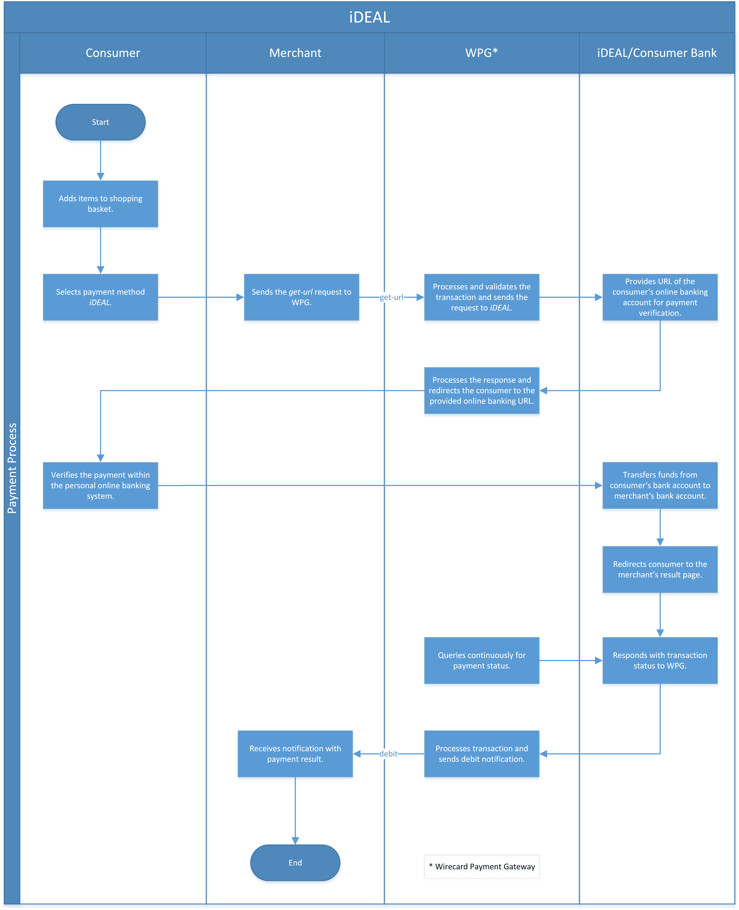

[#iDEAL]
=== iDEAL

[#iDEAL_Introduction]
==== Introduction
[.clearfix]
--
[.right]
image::images/11-12-ideal/IDEAL_Logo.png[align="right", width=190]

iDEAL is an e-commerce payment method widely used in the Netherlands.
Introduced in 2005, this payment method allows consumers to buy on the
Internet using direct online transfers from their bank account, i.e.
payments are made directly between bank accounts. iDEAL works together
with leading Dutch banks using the banks' online banking systems to
carry out payment transactions.
--

Since the introduction of SEPA, iDEAL payments may be carried out from
and to all European bank accounts (in EUR). However, in order to enable
consumers outside The Netherlands to use this payment method, their bank
must have an iDEAL license from Currence, the trademark owner and
supervisory authority for iDEAL.

.Advantages for Merchants

* When offering iDEAL in your online shop, a direct link is established
with the systems of your own bank or online financial service provider.
* Virtually risk-free: consumers may not reverse the payment (no
chargeback).
* Payments are credited to the merchant´s account as fast as any
conventional credit transfer.
* Paying via their own familiar banking environment reassures consumers
of a high payment security and leads to a higher conversion rate.

//-

.Advantages for Consumers

* Easy to access, simple to use and free of cost.
* Very convenient since consumers use the same familiar environment as
their bank´s online banking platform.
* Consumer´s name and bank account number are not disclosed until
consumer approves the payment.
* Immediately after completing the purchase, the consumer receives a
confirmation message.
* The consumer´s online bank account summary is also updated.
* No sensitive information is disclosed to the merchant.

//-

[#iDEAL_GeneralInformation]
==== General Information

[#iDEAL_GeneralInformation_PaymentMode]
===== Payment Mode, Countries and Currencies

This table illustrates which payment mode _iDEAL_ belongs to. It also
provides detailed information about the countries and currencies which
are relevant for _iDEAL._

[cols="1h,2", stripes="none"]
|===
|Payment Mode | <<PaymentMethods_PaymentMode_OnlineBankTransfer, Online Bank Transfer>>
|Countries |Netherlands
|Currencies |EUR
|===

[#iDEAL_GeneralInformation_Communication]
===== Communication Formats

This table illustrates how _iDEAL_ notifications are encoded and which
formats and methods can be used for requests and responses.

[%autowidth]
|===
.2+h| Requests/Responses | Format   | XML
                         | Methods  | POST
   h| IPN Encodement   2+| A signed XML document
|===

[#iDEAL_TransactionTypes]
==== Transaction Types

For <<Glossary_TransactionType, transaction type>> details which are not given here, look
at <<AppendixB, Appendix B: Transaction Types>>.

[%autowidth]
[cols="e,,"]
|===
|Transaction Type |Description |Link to samples

|get-url |A transaction for initiating an iDEAL payment. As long as
there is no notification from iDEAL there is only a _get-url_
transaction. |See <<iDEAL_Samples, sample>>
|debit |Transfer funds from the Account Holder to the Merchant. The
debit will be created when notification for the transaction is received
from IDEAL. |See <<iDEAL_Samples, sample>>
|===

[#iDEAL_ReferenceTransaction]
===== Reference Transaction
NOTE: For additional information regarding the referenced transaction
functionality, see <<GeneralPlatformFeatures_CrossPayment, Cross-Payment-Methods Referencing>>.

[#iDEAL_TestCredentials]
==== Test Credentials

[cols="h,,"]
[%autowidth]
|===
| *URLs (Endpoints)*
| For transaction type _get-url._
| ``\https://api-test.wirecard.com/engine/rest/paymentmethods/``
| *Merchant Account ID (MAID)*
2+| 4aeccf39-0d47-47f6-a399-c05c1f2fc819
| *Username*
2+| 16390-testing
| *Password*
2+| 3!3013=D3fD8X7
| *Secret Key*
2+| 7a353766-23b5-4992-ae96-cb4232998954
|===

.Additional Test Credentials on iDEAL Environment

[cols=",,"]
//[cols="70,15,15"]
[%autowidth]
|===
   h| BIC
  2+| INGBNL2A
.6+h| The transaction result depends on the requested amount
   h| Requested Amount
   h| Result
    | EUR 1.00
    | Success
    | EUR 2.00
    | Canceled
    | EUR 3.00
    | Expired
    | EUR 4.00
    | Forever pending transaction
    | EUR 5.00
    | Failure
|===

[#iDEAL_Workflow]
==== Workflow

[#iDEAL_Workflow_debit]
===== debit

NOTE: The merchant sends a debit request to Wirecard and receives a response
which contains the URL of the consumers online banking system to which
the consumer must be redirected to. The consumer is redirected back to
merchants shop after the transaction is approved and the merchant
receives a payment notification from Wirecard.

. Consumer adds items to his/her shopping basket.
. Consumer selects _iDEAL_.
. The merchant sends a _get-url_ request to _Wirecard Payment
Processing Gateway_.
. _Wirecard Payment Gateway_ processes and validates the
transaction.
. _Wirecard Payment Gateway_ forwards the request to _iDEAL_.
. _iDEAL_ provides the URL of the consumer's online banking account
for payment verification.
. _Wirecard Payment Gateway_ processes the response.
. _Wirecard Payment Gateway_ redirects the consumer to the provided
online banking URL.
. Consumer verifies the payment within the personal online banking
system.
. _iDEAL_ transfers funds from the consumer's bank account to the
merchant's bank account.
. _iDEAL_ redirects consumer to the merchant's result page.
. iDEAL sends the transaction Status to _Wirecard Payment Gateway_
(_Wirecard Payment Gateway_ continuously queries for the payment
status).
. _Wirecard Payment Gateway_ processes the notification and sends the
payment _debit_ notification to the merchant.
. The merchant receives the notification with the payment result.

[#iDEAL_Fields]
==== Fields

The fields used for iDEAL requests, responses and notifications are the
same as the ReST API Fields. Please refer to the <<RestApi_Fields, REST API field
list>>. Only the fields listed below have different properties.

The following elements are mandatory (M) or optional (O) for a
request/response/notification. If the respective cell is empty, the
field is disregarded or not sent.

[cols=",,,,,,v"]
[%autowidth]
|===
|Field |Request  |Response |Notification |Data Type |Size |Description

|bank-account.bic
|M
|M
|
|xs:string
|11
|This is the BIC of the end-consumer. It can't be used together with
account-number/bank-code.
|order-number
|O
|O
|O
|xs:string
|35
|This is the order number of the merchant. The following characters are
allowed:
``a-z``  ``A-Z``  ``0-9``  ``+``
|descriptor
|O
|O
|O
|xs:string
|35
|Description on the settlement of the account holder's account about a
transaction. The following characters are allowed:
``umlaut`` ``space``
``0-9``  ``a-z``  ``A-Z``   ``'``  ``+``  ``,``  ``-``  ``.``
|success-redirect-url
|M
|M
|M
|xs:string
|512
|The URL to which the consumer will be re-directed after a successful
payment. This is normally a success confirmation page on the merchant's
website.
|===

[#iDEAL_ParticipatingBanks]
==== Participating Banks

[%autowidth]
|===
| *BIC*    | *Name*
| ABNANL2A | ABN Amro Bank
| ASNBNL21 | ASN Bank
| BUNQNL2A | bunq
| HANDNL2A | Handelsbanken
| INGBNL2A | ING
| KNABNL2H | Knab
| MOYONL21 | Moneyou
| RABONL2U | Rabobank
| RGGINL21 | Regio Bank
| SNSBNL2A | SNS Bank
| TRIONL2U | Triodos Bank
| FVLBNL22 | Van Lanschot Bankiers
|===

Frieslandbank merged into Rabobank. They are now available as Rabobank.

[NOTE]
====
Only the following banks can be used
on ``\http://api-test.wirecard.com`` and iDEAL
sandbox:

- *RABONL2U (Rabobank)*
- *INGBNL2A (ING)*
//-
====

[#iDEAL_Samples]
==== Samples

.XML Get-URL Request (Successful)

[source,xml]
----
include::samples/xml/ideal_get-url_request_success.xml[]
----

.XML Get-URL Response (Successful)

[source,xml]
----
include::samples/xml/ideal_get-url_response_success.xml[]
----

.XML Debit Notification (Successful)

[source,xml]
----
include::samples/xml/ideal_debit_notification_success.xml[]
----

.XML Get-URL Request (Failure)

[source,xml]
----
include::samples/xml/ideal_get-url_request_failure.xml[]
----

.XML Get-URL Response (Failure)

[source,xml]
----
include::samples/xml/ideal_get-url_response_failure.xml[]
----

.XML Debit Notification (Failure)

[source,xml]
----
include::samples/xml/ideal_get-url_notification_failure.xml[]
----
