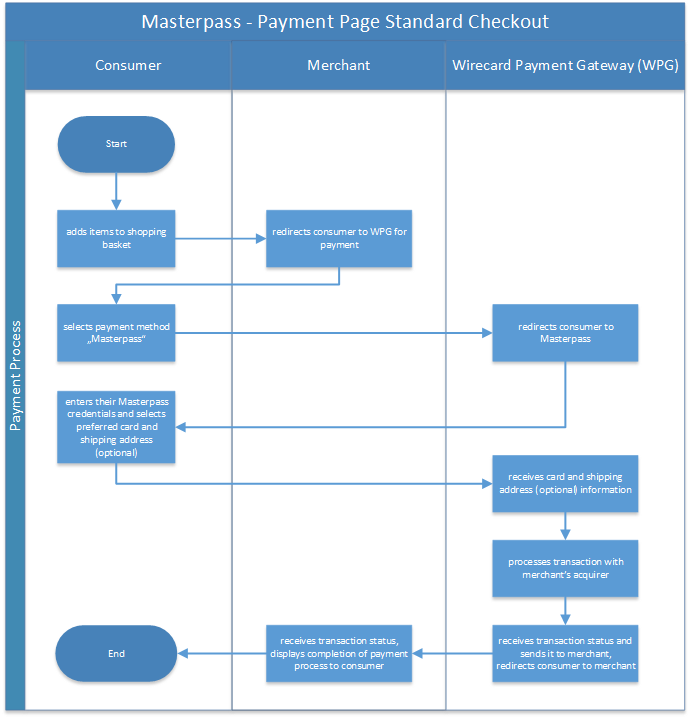
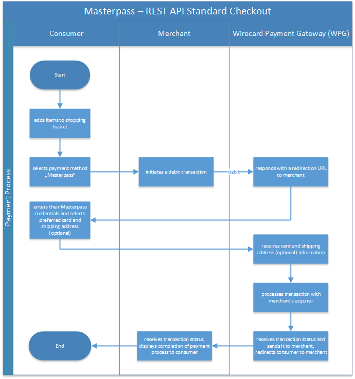
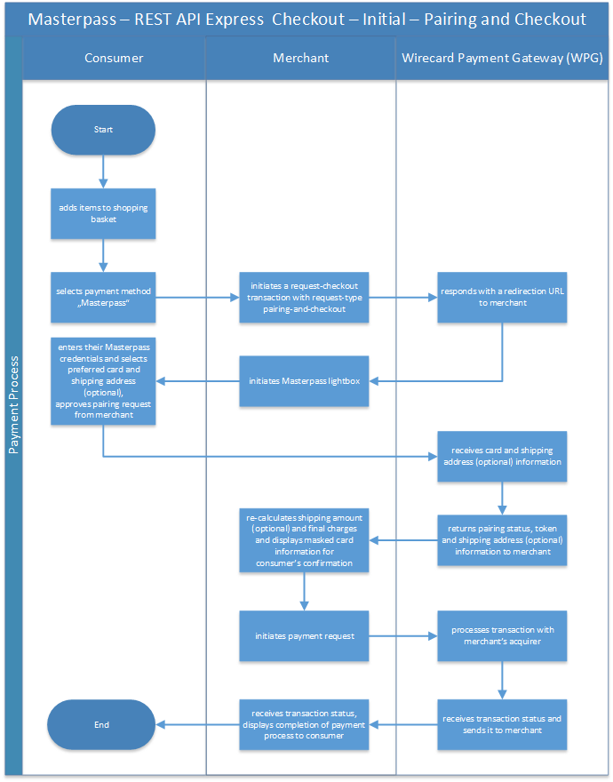
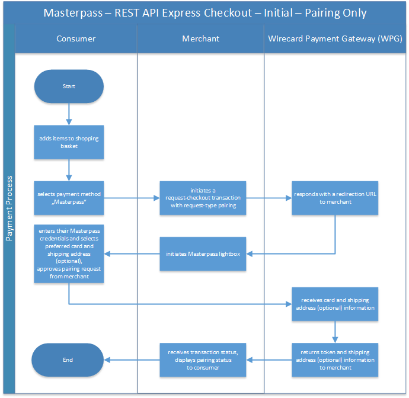
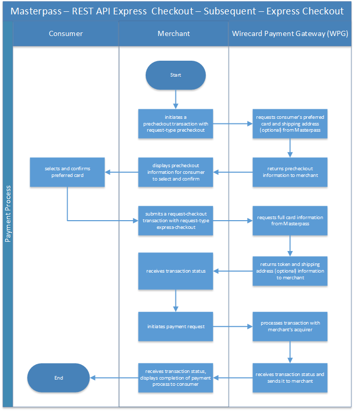

[#API_MasterPass]
=== MasterPass

[#API_MasterPass_Introduction]
==== Introduction

_MasterPass_ is a digital wallet for faster, safer shopping, allowing
consumers to make purchases without entering shipping and credit card
information on the merchant's website, as _MasterPass_ stores the credit
card and shipping details on behalf of the consumer. The consumer
selects _MasterPass_ as the payment method, and is redirected to
_MasterPass_ to select the credit card and shipping (optional)
information.

_MasterPass_ supports 2 modes of requests:

- *_MasterPass_ Standard Checkout* allows the merchant to redirect the
consumer to the _MasterPass_ site to select the preferred card and
shipping details to complete the checkout.
- *_MasterPass_ Express Checkout* allows the merchant to pair (link) the
merchant account to the consumer account so that the merchant can
initiate subsequent payments to _MasterPass_ without requiring the
consumer to login to _MasterPass_. The consumer only has to login to
_MasterPass_ once and approve the pairing.

//-

The _MasterPass_ wallet can be integrated in three different ways:

[%autowidth]
|===
|Integration Option |Description

|Hosted Payment Page integration a| . The customer is redirected
to MasterPass website to login and select the preferred credit card for
payment. +
                                    . The Wirecard Payment Gateway will receive the credit card information
from _MasterPass_ and proceed with payment authorization with the
acquirer. +
                                    . The Wirecard Payment Gateway manages all interactions with
_MasterPass_.
|REST API integration for Standard Checkout |The merchant handles the
integration into _MasterPass_ based on the _MasterPass_ information provided
by the gateway.
|REST API integration for Express Checkout |The merchant handles the
integration into _MasterPass_ based on the _MasterPass_ information provided
by the gateway for both the initial and subsequent requests.
|===

[#API_MasterPass_GeneralInformation]
==== General Information

[#API_MasterPass_General_PaymentMode]
===== Payment Mode, Countries, and Currencies

This table illustrates which payment mode _MasterPass_ belongs to. It
also provides detailed information about the countries and currencies
which are relevant for _MasterPass_.

[%autowidth, cols="h,"]
|===
|Payment Mode |<<PaymentMethods_PaymentMode_Wallet, Wallet>>
|Countries |International
|Currencies |All currencies are supported.
|===

[#API_MasterPass_General_Communication]
===== Communication Formats

This table illustrates how _MasterPass_ notifications are encoded and
which formats and methods can be used for requests and responses.

[%autowidth]
|===
.2+h|Requests/Responses |Format |XML
                        |Methods |POST, GET
h|IPN Encodement      2+| Base64
|===

[#API_MasterPass_TransactionTypes]
==== Transaction Types

Every successful MasterPass payment request ends up with two distinct
transactions in the database, one for the _MasterPass_ wallet and one for
the credit card.

For <<Glossary_TransactionType, transaction type>> details which are not given
here, look at <<AppendixB, Appendix B: Transaction Types>>.

[%autowidth]
|===
|_MasterPass_ |  |_Credit Card_

|_debit_ |AND |_purchase_
|_authorization_ |AND |_authorization_
|_authorization-only_ |AND |_authorization-only_
|===

[#API_MasterPass_TestCredentials]
==== Test Credentials 

[%autowidth]
|===
.2+h|URL(s) Endpoints          |Hosted Payment Page |``\https://api-test.wirecard.com/engine/hpp/``
                               |REST API |``\https://api-test.wirecard.com/engine/rest/paymentmethods/``
h|Merchant Account ID (MAID) 2+|Please contact <<ContactUs, merchant support>> for complete test credentials.
h|Username                   2+|70000-APITEST-AP
h|Password                   2+|qD2wzQ_hrc!8
h|Secret Key                 2+|87e1c187-363f-41d8-abab-7bae0fb03eca
|===

[#API_MasterPass_Workflows]
==== Workflows

[#API_MasterPass_Workflows_PaymentPage_Standard]
===== Payment Page: Standard Checkout

The Payment Page flow follows the usual Payment Page integration and
flow.

. Consumers add items to shopping basket.
. Merchants redirect consumers to _Wirecard Payment Processing Gateway_ for
payment.
. Consumers select payment method _MasterPass_.
. _Wirecard Payment Processing Gateway_ redirects consumers to _MasterPass_.
. Consumers enter their _MasterPass_ credentials and select preferred
card and shipping address (optional).
. _Wirecard Payment Processing Gateway_ receives the card and shipping
address (optional) information.
. _Wirecard Payment Processing Gateway_ processes the transaction with the
merchants' acquirer.
. _Wirecard Payment Processing Gateway_ receives transaction status.
. _Wirecard Payment Processing Gateway_ sends transaction status to merchants
and redirects the consumers to the merchant.
. Merchants receive the transaction's status and display the
completion of the payment process to the consumer.

//-

[#API_MasterPass_Workflows_API_Standard]
===== REST API: Standard Checkout

. Consumers add items to shopping basket.
. Consumers select payment method _MasterPass_.
. Merchants initiate a _debit_ transaction.
. _Wirecard Payment Processing Gateway_ responds with a redirect-URL to the
merchant.
. Consumers enter their _MasterPass_ credentials and select preferred
card and shipping address (optional).
. _Wirecard Payment Processing Gateway_ receives the card and shipping
address (optional) information.
. _Wirecard Payment Processing Gateway_ processes the transaction with the
merchants' acquirer.
. _Wirecard Payment Processing Gateway_ receives transaction status.
. _Wirecard Payment Processing Gateway_ sends transaction status to merchants
and redirects the consumers to the merchants.
. Merchants receive the transaction's status and display the
completion of the payment process to the consumers.

//-

[#API_MasterPass_Workflows_API_Express]
===== REST API: Express Checkout

For Express Checkout, merchants can choose to do the pairing (request
for consumer's account to be linked to merchant's account) to be handled
with or without a checkout.

[#API_MasterPass_Workflows_API_Express_Initial_PairingCheckout]

.Initial - Pairing and Checkout

. Consumers add items to shopping basket.
. Consumers select payment method _MasterPass_.
. Merchants initiate a _request-checkout_ transaction with
request-type pairing-and-checkout.
. _Wirecard Payment Processing Gateway_ responds with a redirect-URL to the
merchants.
. Merchants initiate _MasterPass_ lightbox.
. Consumers enter their _MasterPass_ credentials and select preferred
card and shipping address (optional).
. Consumers approve pairing request
from merchants.
. _Wirecard Payment Processing Gateway_ receives the card and shipping address
(optional) information.
. _Wirecard Payment Processing Gateway_ returns pairing status, token and
shipping address (optional) information to merchants.
. Merchants re-calculate shipping amount (optional) and final charges
and display masked card information for consumers' confirmation.
. Merchants initiate payment request.
. _Wirecard Payment Processing Gateway_ processes the transaction with the
merchants' acquirer.
. _Wirecard Payment Processing Gateway_ receives transaction status.
. _Wirecard Payment Processing Gateway_ sends transaction status to merchants.
. Merchants receive the transaction's status and display the
completion of the payment process to the consumers.

//-

[#API_MasterPass_Workflows_API_Express_Initial_Pairing]
.Initial - Pairing Only

. Consumers add items to shopping basket.
. Consumers select payment method _MasterPass_.
. Merchants initiate a _request-checkout_ transaction with
request-type pairing.
. _Wirecard Payment Processing Gateway_ responds with a redirect-URL to the
merchants.
. Merchants initiate _MasterPass_ lightbox.
. Consumers enter their _MasterPass_ credentials and select preferred
card and shipping address (optional).
. Consumers approve pairing request from merchants.
. _Wirecard Payment Processing Gateway_ receives the card and shipping address
(optional) information.
. _Wirecard Payment Processing Gateway_ returns the token and shipping address
(optional) information to merchants.
. Merchants receive the transaction status and display pairing status
to consumers. 

//-

[#API_MasterPass_Workflows_API_Express_Subsequent_Express]
.Subsequent - Express Checkout

. Merchants initiate a _precheckout_ transaction with request-type
precheckout.
. _Wirecard Payment Processing Gateway_ requests consumers' preferred card and
shipping address (optional) from _MasterPass_.
. _Wirecard Payment Processing Gateway_ returns _precheckout_ information to
merchants.
. Merchants display _precheckout_ information for consumers to select
and confirm.
. Consumers select and confirm preferred card.
. Merchants submit a _request-checkout_ transaction with request-type
express-checkout.
. _Wirecard Payment Processing Gateway_ requests for full card information
from _MasterPass_.
. _Wirecard Payment Processing Gateway_ returns the token and shipping address
(optional) information to merchants.
. Merchants receive the transaction status. 
. Merchants initiate payment request.
. _Wirecard Payment Processing Gateway_ processes the transaction with the
merchants' acquirer.
. _Wirecard Payment Processing Gateway_ receives transaction status.
. _Wirecard Payment Processing Gateway_ sends transaction status to merchants.
. Merchants receive the transaction's status and display the
completion of the payment process to the consumers.

//-

The _request-checkout_ transaction with request-type express-checkout
must be initiated within 30 mins for the _precheckout_ information to be
valid.

[#API_MasterPass_Fields]
==== Fields

Fields can be mandatory (M), optional (O) or conditional (C).

[#API_MasterPass_Fields_requestcheckout]
===== _request-checkout_

The following elements are elements with differing cardinality
from the <<RestApi_Fields, REST API Fields>>.

[%autowidth]
|===
|Field |Request |Response |Notification |Data Type |Size |Description

|custom-fields/custom-field/@field-name   |M  |M  |M  |String |36 |Default as "elastic-api.merchant-origin".
|custom-fields/custom-field/@field-value  |M  |M  |M  |String |36 |The Transaction ID is
                                                                   the unique identifier for a transaction. It is generated by Wirecard.
|customer-id                              |M  |M  |M  |String |40 |Unique identifier in merchant's system that
                                                                   identifies the customer.
|payment-methods/payment-method/url       |   |M  |M  |String |   |Contains callback, acceptable_cards fields to be used to initiate _MasterPass_ Lightbox. This field
                                                                   is returned in the response for Pairing and Connect Checkout flow. Callback is
                                                                   URL-encoded and has to be URL-decoded before use.
|request-type                             |M  |M  |M  |String |   |Type of request. Supported request types include
                                                                   pairing, checkout, pairing-and-checkout, express-checkout.
|shipping/allowed-countries               |O  |O  |O  |String |   |Shipping profile created by Gateway
                                                                   specifying countries where merchant accepts shipping.
|wallet/address-id                        |O  |M  |M  |String |   |_MasterPass's_ unique ID to identify the
                                                                   customer's selected shipping information for Express Checkout flow.
|wallet/card-id                           |O  |M  |M  |String |   |_MasterPass's_ unique ID to identify the
                                                                   customer's selected card information for Express Checkout flow.
|wallet/merchant-id                       |   |M  |M  |String |   |Merchant's CheckoutId to be provided for
                                                                   Lightbox initialization.
|wallet/pair-token                        |   |M  |M  |String |   |Pairing Token to be used to initiate _MasterPass_ Lightbox.
|wallet/provider-ref                      |   |M  |M  |String |   |_MasterPass's_ precheckout Transaction-ID to identify the precheckout request.
|wallet/request-token                     |   |M  |M  |String |   |Request Token to be used to initiate _MasterPass_ Lightbox.
|===

[#API_MasterPass_Fields_precheckout]
===== _precheckout_

The following elements are elements with differing cardinality
from the <<RestApi_Fields, REST API Fields>>.

[%autowidth]
|===
|Field |Request |Response |Notification |Data Type |Size |Description

|customer-id              |M  |M  |M  |String |40 |Unique identifier in merchant's system that identifies the customer.
|transaction-id           |   |M  |M  |String |   |Current Transaction Id to be provided for the
                                                   final debit transaction.
|wallet/merchant-id       |   |M  |M  |String |   |Merchant's CheckoutId.
|wallet/provider-ref      |   |M  |M  |String |   |Current precheckout Transaction-ID to be
                                          provided for Lightbox initialization and final debit transaction.
|wallet/wallet-data       |   |M  |M  |String |   |_MasterPass's_ precheckout Data which
                                                   contains all the customer's _MasterPass_ account / address / shipping
                                                   information. This field is a Base64 encoded string of XML data. Base64
                                                   decoding is required to obtain the XML data with the necessary information.
|===

[#API_MasterPass_Fields_debit]
===== _debit_

The following elements are elements with differing cardinality
from the <<RestApi_Fields, REST API Fields>>.

[%autowidth]
|===
|Field |Request |Response |Notification |Data Type |Size |Description

|wallet/provider-ref            |C  |M  |M  |String |   |MasterPass Precheckout-ID from
                                                         wallet/provider-ref in a previous Express Checkout Transaction. Mandatory for
                                                         Express Checkout flow.
|wallet/provider-transaction-id |C  |M  |M  |String |   |MasterPass Transaction-ID from
                                                         wallet/provider-transaction-id in a previous Express Checkout Transaction.
                                                         Mandatory for Express Checkout flow.
|===  

[#API_MasterPass_Samples]
==== Samples

[#API_MasterPass_Samples_Initial_PairingCheckout]
===== Initial - Pairing and Checkout

._request-checkout_ Pairing and Checkout Request (Successful)

[source,xml]
----
 <?xml version="1.0" encoding="UTF-8" standalone="yes"?>
 <payment xmlns="http://www.elastic-payments.com/schema/payment">
    <merchant-account-id>ff1cc720-e73d-408d-acd4-9cbb491c1b3c</merchant-account-id>
    <request-id>93f7ade9-6fc5-e748-7781-4891f3624dfd</request-id>
    <transaction-type>request-checkout</transaction-type>
    <requested-amount currency="SGD">4.00</requested-amount>
    <custom-fields>
         <custom-field field-name="elastic-api.merchant-origin" field-value="http://localhost/shop/masterpass/pairingredirect/"/>
    </custom-fields>
    <payment-methods>
        <payment-method name="masterpass"/>
    </payment-methods>
    <redirect-url>http://localhost/shop/rest/masterpass/requestcheckoutresponse/?</redirect-url>
    <request-type>pairing-and-checkout</request-type>
    <customer-id>unique-testid-003</customer-id>
</payment>
----

._request-checkout_ Pairing and Checkout Response (Successful)

[source,xml]
----
<?xml version="1.0" encoding="UTF-8" standalone="yes"?> 
<payment xmlns="http://www.elastic-payments.com/schema/payment"> 
    <merchant-account-id>ff1cc720-e73d-408d-acd4-9cbb491c1b3c</merchant-account-id> 
    <transaction-id>f21b063d-ac12-4580-ad7d-549a783ee5ef</transaction-id> 
    <request-id>93f7ade9-6fc5-e748-7781-4891f3624dfd</request-id> 
    <transaction-type>request-checkout</transaction-type> 
    <transaction-state>success</transaction-state> 
    <completion-time-stamp>2016-11-04T00:24:31.000Z</completion-time-stamp> 
    <statuses> 
        <status code="201.0000" description="The resource was successfully created." severity="information"/> 
    </statuses> 
    <requested-amount currency="SGD">4.00</requested-amount> 
    <custom-fields> 
        <custom-field field-name="elastic-api.merchant-origin" field-value="http://localhost/shop/masterpass/pairingredirect/"/> 
    </custom-fields> 
    <payment-methods> 
        <payment-method url="https://sandbox-engine.thesolution.com/engine/notification/masterpass/lightBoxPaymentPageoauth_token=e9b30de7ee4e6a7ff5a66bd1d12f16962ec371fa&acceptable_cards=visa,master&checkout_identifier=a4a6w4waeskkkhudnya4w1hveovoyzec5i&version=v6&callback=https%3A%2F%2Fsandbox-engine.thesolution.com%2Fengine%2Fnotification%2Fmasterpass%3Fpayment.transaction-id=f21b063d-ac12-4580-ad7d-549a783ee5ef%26payment.transaction-type=request-checkout%26payment.request-type=pairing-and-checkout%26payment.customer-id=unique-testid-003&lightboxurl=https%3A%2F%2Fsandbox.masterpass.com%2Flightbox%2FSwitch%2Fintegration%2FMasterPass.client.js&suppress_shipping_address=true&merchantOrigin=http%3A%2F%2Flocalhost%2Fshop%2Fmasterpass%2Fpairingredirect%2F" name="masterpass"/> 
    </payment-methods> 
    <redirect-url>http://localhost/shop/rest/masterpass/requestcheckoutresponse/?</redirect-url> 
    <wallet> 
        <merchant-id>a4a6w4waeskkkhudnya4w1hveovoyzec5i</merchant-id> 
        <request-token>699f3012198d2dc958d688a4d21a0c909ae0698f</request-token> 
        <pair-token>c334d6e3a4fe3e078606206b1331172d11a70b09</pair-token> 
    </wallet> 
    <request-type>pairing-and-checkout</request-type> 
    <customer-id>unique-testid-003</customer-id> 
</payment>
----

._request-checkout_ Pairing and Checkout Notification (Successful)

[source]
----
MasterPass.client.checkout({ "requestToken": "699f3012198d2dc958d688a4d21a0c909ae0698f", "callbackUrl":"https://sandbox-engine.thesolution.com/engine/notification/masterpass?payment.transaction-id=f21b063d-ac12-4580-ad7d-549a783ee5ef&payment.transaction-type=request-checkout&payment.request-type=pairing-and-checkout&payment.customer-id=unique-testid-003", "merchantCheckoutId":"a4a6w4waeskkkhudnya4w1hveovoyzec5i", "allowedCardTypes":["visa,master"], "suppressShippingAddressEnable":"true", "pairingRequestToken":"c334d6e3a4fe3e078606206b1331172d11a70b09", "requestPairing":true, "requestedDataTypes":["ADDRESS","PROFILE","CARD"], "requestExpressCheckout":true, "version":"v6" });
----

[#API_MasterPass_Samples_Initial_Pairing]
===== Initial - Pairing Only

._request-checkout_ Pairing only Request (Successful)

[source,xml]
----
<?xml version="1.0" encoding="UTF-8" standalone="yes"?>
<payment xmlns="http://www.elastic-payments.com/schema/payment"> 
    <merchant-account-id>ff1cc720-e73d-408d-acd4-9cbb491c1b3c</merchant-account-id> 
    <request-id>ee597653-6dcd-3e45-f058-1dfbbeece7a8</request-id> 
    <transaction-type>request-checkout</transaction-type> 
    <requested-amount currency="SGD">4.00</requested-amount> 
    <custom-fields> 
        <custom-field field-name="elastic-api.merchant-origin" field-value="http://localhost/shop/masterpass/pairingredirect/"/>
    </custom-fields> 
    <payment-methods> 
        <payment-method name="masterpass"/> 
    </payment-methods> 
    <redirect-url>http://localhost/shop/rest/masterpass/requestcheckoutresponse/?</redirect-url> 
    <request-type>pairing</request-type> 
    <customer-id>unique-testid-005</customer-id> 
</payment>
----

._request-checkout_ Pairing only Response (Successful)

[source,xml]
----
<?xml version="1.0" encoding="UTF-8" standalone="yes"?> 
<payment xmlns="http://www.elastic-payments.com/schema/payment"> 
    <merchant-account-id>ff1cc720-e73d-408d-acd4-9cbb491c1b3c</merchant-account-id> 
    <transaction-id>1d0ca01d-f81d-4228-a287-27f3fbd048ee</transaction-id> 
    <request-id>ee597653-6dcd-3e45-f058-1dfbbeece7a8</request-id> 
    <transaction-type>request-checkout</transaction-type> 
    <transaction-state>success</transaction-state> 
    <completion-time-stamp>2016-11-01T07:23:16.000Z</completion-time-stamp> 
    <statuses> 
        <status code="201.0000" description="The resource was successfully created." severity="information"/> 
    </statuses> 
    <requested-amount currency="SGD">4.00</requested-amount> 
    <custom-fields> 
        <custom-field field-name="elastic-api.merchant-origin" field-value="http://localhost/shop/masterpass/pairingredirect/"/> 
    </custom-fields> 
    <payment-methods> 
        <payment-method url="https://sandbox-engine.thesolution.com/engine/notification/masterpass/lightBoxPaymentPageoauth_token=e9b30de7ee4e6a7ff5a66bd1d12f16962ec371fa&acceptable_cards=visa,master&checkout_identifier=a4a6w4waeskkkhudnya4w1hveovoyzec5i&version=v6&callback=https%3A%2F%2Fsandbox-engine.thesolution.com%2Fengine%2Fnotification%2Fmasterpass%3Fpayment.transaction-id=1d0ca01d-f81d-4228-a287-27f3fbd048ee%26payment.transaction-type=request-checkout%26payment.request-type=pairing%26payment.customer-id=unique-testid-005&lightboxurl=https%3A%2F%2Fsandbox.masterpass.com%2Flightbox%2FSwitch%2Fintegration%2FMasterPass.client.js&suppress_shipping_address=true&merchantOrigin=http%3A%2F%2Flocalhost%2Fshop%2Fmasterpass%2Fpairingredirect%2F" name="masterpass"/> 
    </payment-methods> 
    <redirect-url>http://localhost/shop/rest/masterpass/requestcheckoutresponse/?</redirect-url> 
    <wallet> 
        <merchant-id>a4a6w4waeskkkhudnya4w1hveovoyzec5i</merchant-id> 
        <pair-token>7575d7fecaa79454a9615b1e78e1090db8f2e38c</pair-token> 
    </wallet> 
    <request-type>pairing</request-type> 
    <customer-id>unique-testid-005</customer-id> 
</payment>
----

._request-checkout_ Pairing only Notification (Successful)

[source,xml]
----
<?xml version="1.0" encoding="UTF-8" standalone="yes"?> 
<payment xmlns="http://www.elastic-payments.com/schema/payment"> 
    <merchant-account-id>ff1cc720-e73d-408d-acd4-9cbb491c1b3c</merchant-account-id> 
    <transaction-id>1d0ca01d-f81d-4228-a287-27f3fbd048ee</transaction-id> 
    <request-id>ee597653-6dcd-3e45-f058-1dfbbeece7a8-request-checkout</request-id> 
    <transaction-type>request-checkout</transaction-type> 
    <transaction-state>success</transaction-state> 
    <completion-time-stamp>2016-11-01T07:24:48.000Z</completion-time-stamp> 
    <statuses> 
        <status code="201.0000" description="masterpass:The resource was successfully created." severity="information"/> 
    </statuses> 
    <requested-amount currency="SGD">4</requested-amount> 
    <order-items/> 
    <notifications> 
    <notification url="http://requestb.in/1blbj011"/></notifications>
    <custom-fields> 
        <custom-field field-name="elastic-api.merchant-origin" field-value="http://localhost/shop/masterpass/pairingredirect/"/> 
    </custom-fields> 
    <payment-methods> 
        <payment-method url="http://localhost/shop/rest/masterpass/requestcheckoutresponse/?" name="masterpass"/> 
    </payment-methods> 
    <api-id>---</api-id> 
    <processing-redirect-url>http://localhost/shop/rest/masterpass/requestcheckoutresponse/?</processing-redirect-url> 
    <cancel-redirect-url>http://localhost/shop/rest/masterpass/requestcheckoutresponse/?</cancel-redirect-url> 
    <fail-redirect-url>http://localhost/shop/rest/masterpass/requestcheckoutresponse/?</fail-redirect-url> 
    <success-redirect-url>http://localhost/shop/rest/masterpass/requestcheckoutresponse/?</success-redirect-url> 
    <locale>null</locale> 
    <Signature xmlns="http://www.w3.org/2000/09/xmldsig#"> 
        <SignedInfo> 
            <CanonicalizationMethod Algorithm="http://www.w3.org/TR/2001/REC-xml-c14n-20010315"/> 
            <SignatureMethod Algorithm="http://www.w3.org/2000/09/xmldsig#rsa-sha1"/> 
            <Reference URI=""> 
            <Transforms> 
                <Transform Algorithm="http://www.w3.org/2000/09/xmldsig#enveloped-signature"/> 
            </Transforms> 
            <DigestMethod Algorithm="http://www.w3.org/2000/09/xmldsig#sha1"/> 
                <DigestValue>mCNvwYofUBmYuLGw1aezv3R7J64=</DigestValue> 
            </Reference> 
        </SignedInfo> 
        <SignatureValue>cgPmcPbGt1rLPmkR9+Q0LNJdN62ucxP7YwPRuMfW2NyFYYL+BpxhDqEDoaAxfRkx/zKCDt7a5V+X 0hygOo0tQ5Bb1+ZIjq9uBcJbj4046GSgUhg60cuDYbTkCTKAH6pHmRXcviP4b9l1pYTUh7EQmYuC 5ncL5QG4JusAOhaCXI44nrzn2dNuh9eODAb7LDwHPHOhhg8IEWvMdqxHqmu2TvrVz7yjrb4Raf9Q CcFYxd94yqBBDMbmUqudHKVZc/02+0vjzffjyohPmI1QaTM/e4la/Pfm4zpjxIHWFiu0SV8Oe8PZ tnUxCdNT/Sq4SR1E8dvkhgyUeC5si4ace1cTiQ== </SignatureValue> 
        <KeyInfo> 
            <X509Data> 
                <X509SubjectName>CN=Sample Cert,OU=R&D,O=Company Ltd,L=Toronto,ST=ON,C=CA</X509SubjectName> 
                <X509Certificate>MIIDcDCCAligAwIBAgIETgQWGTANBgkqhkiG9w0BAQUFADB6MQswCQYDVQQGEwJDQTELMAkGA1UE CBMCT04xEDAOBgNVBAcTB1Rvcm9udG8xIjAgBgNVBAoTGVdpcmVjYXJkIEVsYXN0aWMgUGF5bWVu dHMxEzARBgNVBAsTCk9wZXJhdGlvbnMxEzARBgNVBAMTCk1hbm9qIFNhaHUwHhcNMTEwNjI0MDQ0 NDA5WhcNMTQwMzIwMDQ0NDA5WjB6MQswCQYDVQQGEwJDQTELMAkGA1UECBMCT04xEDAOBgNVBAcT B1Rvcm9udG8xIjAgBgNVBAoTGVdpcmVjYXJkIEVsYXN0aWMgUGF5bWVudHMxEzARBgNVBAsTCk9w ZXJhdGlvbnMxEzARBgNVBAMTCk1hbm9qIFNhaHUwggEiMA0GCSqGSIb3DQEBAQUAA4IBDwAwggEK AoIBAQCc8rTt4N5fNeVzlsRgOXKDE2YUSfJx7xXBozFZ3Vh3XQyy3IpIuEfZz7004k4HeonfTxCN etBvJ9rgNc0Cxrk/euMj3pOUrE9WYN2eAXC0r5pUIAZhIAnSxUSaIF3JKBxf7gDAik5d8RT5HaJV 4n5cXJQ/uhAEYU3EGN/74UrD2UsOYD3VBXTJS5VgSi/c3IyLwhDbYIyU6j4fMKyHIlAMGzW7VgKD 2pqu6BRysqUVdEEAvW2OmyVqGVyPkm87EiHSMMSar3CvYYxYqBN2KBUjabkvnRWbIzyQuyUyDeUb QmhVQKL0WlMb5ev65m2VjGyDTGL5jfB14rSXRMGzeJ+LAgMBAAEwDQYJKoZIhvcNAQEFBQADggEB ADgkuN/e2IFy7JXdbjNJbKBd3HLvFvK87dv8qQ+HK4qfCxYXh6aYhbKHJSA6C2pbOD3HBXoyovZr mk/KqOyUL+unVcR+APjxX4KP25sdkplgmeQ47CWxtKAHZUTtWwAVI/WhsX89SSucBfIS5TJ54e7m 02qvGoK8UA/IRbIQ6DZ9hEKV5VQKiMx3ubwwHGXfOWz2fKmeZBuTeY+HiTEH8KCHpfw2j8G+dDgU jlp9LvjVNmJzfNBBk1Si0d/rhXmMzVSKj08tp1sPRK0/sJtJZBzQajpnsZ9NFfoJNdG13AzYwDP3 x/QspK0jYn1KZw1qz524VWoQoueR8Xj30A2jntA= </X509Certificate> 
            </X509Data> 
        </KeyInfo> 
    </Signature> 
</payment>
----

Initialize _MasterPass_ lightbox with the following script in the
merchant's origin_url page

.Javascript Lightbox initialization

[source,javascript]
----
MasterPass.client.connect({ "pairingRequestToken":"7575d7fecaa79454a9615b1e78e1090db8f2e38c", "callbackUrl":"https://sandbox-engine.thesolution.com/engine/notification/masterpass?payment.transaction-id=1d0ca01d-f81d-4228-a287-27f3fbd048ee&payment.transaction-type=request-checkout&payment.request-type=pairing&payment.customer-id=unique-testid-005", "merchantCheckoutId":"a4a6w4waeskkkhudnya4w1hveovoyzec5i", "requestedDataTypes":["ADDRESS","PROFILE","CARD"], "requestPairing":true, "requestExpressCheckout":true });
----

[#API_MasterPass_Samples_Subsequent_Express]
===== Subsequent - Express Checkout

._precheckout_ Express Checkout Request (Successful)

[source,xml]
----
<?xml version="1.0" encoding="UTF-8" standalone="yes"?> 
<payment xmlns="http://www.elastic-payments.com/schema/payment"> 
    <merchant-account-id>ff1cc720-e73d-408d-acd4-9cbb491c1b3c</merchant-account-id> 
    <request-id>7ce6f720-97ed-a1e4-f843-801fe475024f</request-id> 
    <transaction-type>precheckout</transaction-type> 
    <requested-amount currency="SGD">4.00</requested-amount> 
    <payment-methods> 
        <payment-method name="masterpass"/> 
    </payment-methods> 
    <customer-id>unique-testid-005</customer-id> 
</payment>
----

._precheckout_ Express Checkout Response (Successful)

[source,xml]
----
<?xml version="1.0" encoding="UTF-8" standalone="yes"?> 
<payment xmlns="http://www.elastic-payments.com/schema/payment"> 
    <merchant-account-id>ff1cc720-e73d-408d-acd4-9cbb491c1b3c</merchant-account-id> 
    <transaction-id>37b24b99-8c47-47b2-89a6-4187897531b3</transaction-id> 
    <request-id>7ce6f720-97ed-a1e4-f843-801fe475024f</request-id> 
    <transaction-type>precheckout</transaction-type> 
    <transaction-state>success</transaction-state> 
    <completion-time-stamp>2016-11-01T07:33:42.000Z</completion-time-stamp> 
    <statuses> 
        <status code="201.0000" description="The resource was successfully created." severity="information"/> 
    </statuses> 
    <requested-amount currency="SGD">4.00</requested-amount> 
    <payment-methods> 
        <payment-method name="masterpass"/> 
    </payment-methods> 
    <wallet> 
        <merchant-id>a4a6w4waeskkkhudnya4w1hveovoyzec5i</merchant-id> 
        <provider-ref>a466w42-7th98g-iuoen57j-1-iuz6h732-6xoc</provider-ref> 
        <wallet-data>PD94bWwgdmVyc2lvbj0iMS4wIiBlbmNvZGluZz0iVVRGLTgiIHN0YW5kYWxvb mU9InllcyI/PjxQcmVjaGVja291dERhdGE+PENhcmRzPjxDYXJkPjxCcmFuZElkPm1hc3Rlcjw vQnJhbmRJZD48QnJhbmROYW1lPk1hc3RlckNhcmQ8L0JyYW5kTmFtZT48QmlsbGluZ0FkZHJlc 3M+PENpdHk+c2luZ2Fwb3JlPC9DaXR5PjxDb3VudHJ5PlNHPC9Db3VudHJ5PjxDb3VudHJ5U3V iZGl2aXNpb24+c2luZ2Fwb3JlPC9Db3VudHJ5U3ViZGl2aXNpb24+PExpbmUxPnRlc3QxPC9Ma W5lMT48UG9zdGFsQ29kZT4xMjM0NTY8L1Bvc3RhbENvZGU+PC9CaWxsaW5nQWRkcmVzcz48Q2F yZEhvbGRlck5hbWU+S2ltIExpPC9DYXJkSG9sZGVyTmFtZT48RXhwaXJ5TW9udGg+MTwvRXhwa XJ5TW9udGg+PEV4cGlyeVllYXI+MjAyMDwvRXhwaXJ5WWVhcj48Q2FyZElkPmIxM2RkZTY5LTA wOTYtNDc4ZS1hYjMxLTRjYzYyOWVlYmI2YTwvQ2FyZElkPjxMYXN0Rm91cj4wMDE0PC9MYXN0R m91cj48U2VsZWN0ZWRBc0RlZmF1bHQ+dHJ1ZTwvU2VsZWN0ZWRBc0RlZmF1bHQ+PC9DYXJkPjw vQ2FyZHM+PENvbnRhY3Q+PEZpcnN0TmFtZT5LaW08L0ZpcnN0TmFtZT48TGFzdE5hbWU+TGk8L 0xhc3ROYW1lPjxDb3VudHJ5PlNHPC9Db3VudHJ5PjxFbWFpbEFkZHJlc3M+a2ltQGVtYWlsLmN vbTwvRW1haWxBZGRyZXNzPjxQaG9uZU51bWJlcj4xMjM0NTY3NjwvUGhvbmVOdW1iZXI+PC9Db 250YWN0PjxTaGlwcGluZ0FkZHJlc3Nlcz48U2hpcHBpbmdBZGRyZXNzPjxDaXR5PnNpbmdhcG9 yZTwvQ2l0eT48Q291bnRyeT5TRzwvQ291bnRyeT48Q291bnRyeVN1YmRpdmlzaW9uPnNpbmdhc G9yZTwvQ291bnRyeVN1YmRpdmlzaW9uPjxMaW5lMT50ZXN0MTwvTGluZTE+PFBvc3RhbENvZGU +MTIzNDU2PC9Qb3N0YWxDb2RlPjxSZWNpcGllbnROYW1lPktpbSBMaTwvUmVjaXBpZW50TmFtZ T48UmVjaXBpZW50UGhvbmVOdW1iZXI+MTIzNDU2NzY8L1JlY2lwaWVudFBob25lTnVtYmVyPjx BZGRyZXNzSWQ+ZjE5ZTRiZTEtODZhOS00ZDU1LTk0NjQtNTU0NGU1Mzk2MWQxPC9BZGRyZXNzS WQ+PFNlbGVjdGVkQXNEZWZhdWx0PnRydWU8L1NlbGVjdGVkQXNEZWZhdWx0PjwvU2hpcHBpbmd BZGRyZXNzPjwvU2hpcHBpbmdBZGRyZXNzZXM+PFdhbGxldE5hbWU+bWFzdGVycGFzczwvV2Fsb GV0TmFtZT48UHJlY2hlY2tvdXRUcmFuc2FjdGlvbklkPmE0NjZ3NDItN3RoOThnLWl1b2VuNTd qLTEtaXV6Nmg3MzItNnhvYzwvUHJlY2hlY2tvdXRUcmFuc2FjdGlvbklkPjxDb25zdW1lcldhb GxldElkPmRhMDZmYjA1YzMxNGIzYmNhMjgyODJhMTI3MzhkNDhmPC9Db25zdW1lcldhbGxldEl kPjwvUHJlY2hlY2tvdXREYXRhPg==</wallet-data> 
    </wallet> 
    <customer-id>unique-testid-005</customer-id> 
</payment>
----

._request-checkout_ Express Checkout Request (Successful)

[source,xml]
----
<?xml version="1.0" encoding="UTF-8" standalone="yes"?> 
<payment xmlns="http://www.elastic-payments.com/schema/payment"> 
    <merchant-account-id>ff1cc720-e73d-408d-acd4-9cbb491c1b3c</merchant-account-id> 
    <request-id>65c731dc-de21-8457-7b0d-f1dd6569fb06</request-id> 
    <transaction-type>request-checkout</transaction-type> 
    <requested-amount currency="SGD">4.00</requested-amount> 
    <parent-transaction-id>37b24b99-8c47-47b2-89a6-4187897531b3</parent-transaction-id> 
    <payment-methods> 
        <payment-method name="masterpass"/> 
    </payment-methods> 
    <redirect-url>http://localhost/shop/rest/masterpass/requestcheckoutresponse/?</redirect-url> 
    <wallet> 
        <card-id>b13dde69-0096-478e-ab31-4cc629eebb6a</card-id> 
        <address-id>f19e4be1-86a9-4d55-9464-5544e53961d1</address-id> 
        <provider-ref>a466w42-7th98g-iuoen57j-1-iuz6h732-6xoc</provider-ref> 
    </wallet> 
    <request-type>express-checkout</request-type> 
    <customer-id>unique-testid-005</customer-id> 
</payment>
----

._request-checkout_ Express Checkout Response (Successful)

[source,xml]
----
<?xml version="1.0" encoding="UTF-8" standalone="yes"?> 
<payment xmlns="http://www.elastic-payments.com/schema/payment"> 
    <merchant-account-id>ff1cc720-e73d-408d-acd4-9cbb491c1b3c</merchant-account-id> 
    <transaction-id>05e44225-424a-441a-a425-3cfc71ca0b82</transaction-id> 
    <request-id>65c731dc-de21-8457-7b0d-f1dd6569fb06</request-id> 
    <transaction-type>request-checkout</transaction-type> 
    <transaction-state>success</transaction-state> 
    <completion-time-stamp>2016-11-01T07:35:16.000Z</completion-time-stamp> 
    <statuses> 
        <status code="201.0000" description="The resource was successfully created." severity="information"/> 
    </statuses> 
    <requested-amount currency="SGD">4.00</requested-amount> 
    <parent-transaction-id>37b24b99-8c47-47b2-89a6-4187897531b3</parent-transaction-id> 
    <card> 
        <expiration-month>1</expiration-month> 
        <expiration-year>2020</expiration-year> 
        <card-type>mastercard</card-type> 
    </card> 
    <card-token> 
        <token-id>5266048063690014</token-id> 
        <masked-account-number>520474******0014</masked-account-number> 
    </card-token> 
    <custom-fields> 
        <custom-field field-name="elastic-api.merchant-origin" field-value="http://localhost/shop/masterpass/precheckout/"/> 
    </custom-fields> 
    <payment-methods> 
        <payment-method name="masterpass"/> 
    </payment-methods> 
    <api-id>---</api-id> 
    <redirect-url>http://localhost/shop/rest/masterpass/requestcheckoutresponse/?</redirect-url> 
    <wallet> 
        <card-id>b13dde69-0096-478e-ab31-4cc629eebb6a</card-id> 
        <address-id>f19e4be1-86a9-4d55-9464-5544e53961d1</address-id> 
        <provider-ref>a466w42-7th98g-iuoen57j-1-iuz6h732-6xoc</provider-ref> 
        <provider-transaction-id>a466w42-7th98g-iuoen57j-1-iuz6h732-6xoc</provider-transaction-id> 
    </wallet> 
    <request-type>express-checkout</request-type> 
    <customer-id>unique-testid-005</customer-id> 
</payment>
----

[#API_MasterPass_Samples_debit]
===== _debit_

._debit_ Request (Successful)

[source,xml]
----
<?xml version="1.0" encoding="UTF-8" standalone="yes"?> 
<payment xmlns="http://www.elastic-payments.com/schema/payment"> 
    <merchant-account-id>ff1cc720-e73d-408d-acd4-9cbb491c1b3c</merchant-account-id> 
    <request-id>c57a8da8-085d-5058-b43f-412ce5132f3e</request-id> 
    <transaction-type>debit</transaction-type> 
    <requested-amount currency="SGD">4.00</requested-amount> 
    <parent-transaction-id>05e44225-424a-441a-a425-3cfc71ca0b82</parent-transaction-id> 
    <card-token> 
        <token-id>5266048063690014</token-id> 
    </card-token> 
    <payment-methods> 
        <payment-method name="masterpass"/> 
    </payment-methods> 
    <wallet> 
        <provider-ref>a466w42-7th98g-iuoen57j-1-iuz6h732-6xoc</provider-ref> 
        <provider-transaction-id>a466w42-7th98g-iuoen57j-1-iuz6h732-6xoc</provider-transaction-id> 
    </wallet> 
</payment>
----

._debit_ Response (Successful)

[source,xml]
----
<?xml version="1.0" encoding="UTF-8" standalone="yes"?> 
<payment xmlns="http://www.elastic-payments.com/schema/payment"> 
    <merchant-account-id>ff1cc720-e73d-408d-acd4-9cbb491c1b3c</merchant-account-id> 
    <transaction-id>dfcd8bee-1323-4960-b05a-388b64799be2</transaction-id> 
    <request-id>c57a8da8-085d-5058-b43f-412ce5132f3e</request-id> 
    <transaction-type>debit</transaction-type> 
    <transaction-state>success</transaction-state> 
    <completion-time-stamp>2016-11-01T07:42:57.000Z</completion-time-stamp> 
    <statuses> 
        <status code="201.0000" description="The resource was successfully created." severity="information"/> 
    </statuses> 
    <requested-amount currency="SGD">4.00</requested-amount> 
    <parent-transaction-id>05e44225-424a-441a-a425-3cfc71ca0b82</parent-transaction-id> 
    <account-holder> 
        <email>kim@email.com</email> 
        <phone>12345676</phone> 
        <address> 
            <street1>test1</street1> 
            <city>singapore</city> 
            <country>SG</country> 
            <postal-code>123456</postal-code> 
        </address> 
    </account-holder> 
    <card> 
        <expiration-month>1</expiration-month> 
        <expiration-year>2020</expiration-year> 
        <card-type>mastercard</card-type> 
    </card> 
    <card-token> 
        <token-id>5266048063690014</token-id> 
        <masked-account-number>520474******0014</masked-account-number> 
    </card-token> 
    <custom-fields> 
        <custom-field field-name="elastic-api.merchant-origin" field-value="http://localhost/shop/masterpass/precheckout/"/> 
    </custom-fields> 
    <payment-methods> 
        <payment-method name="masterpass"/> 
    </payment-methods> 
    <api-id>---</api-id> 
    <processing-redirect-url>http://localhost/shop/rest/masterpass/requestcheckoutresponse/?</processing-redirect-url> 
    <cancel-redirect-url>http://localhost/shop/rest/masterpass/requestcheckoutresponse/?</cancel-redirect-url> 
    <fail-redirect-url>http://localhost/shop/rest/masterpass/requestcheckoutresponse/?</fail-redirect-url> 
    <success-redirect-url>http://localhost/shop/rest/masterpass/requestcheckoutresponse/?</success-redirect-url> 
    <wallet> 
        <provider-ref>a466w42-7th98g-iuoen57j-1-iuz6h732-6xoc</provider-ref> 
        <provider-transaction-id>a466w42-7th98g-iuoen57j-1-iuz6h732-6xoc</provider-transaction-id> 
    </wallet> 
    <provider-transaction-reference-id>27164948457843568161</provider-transaction-reference-id> 
</payment>
----

//-
