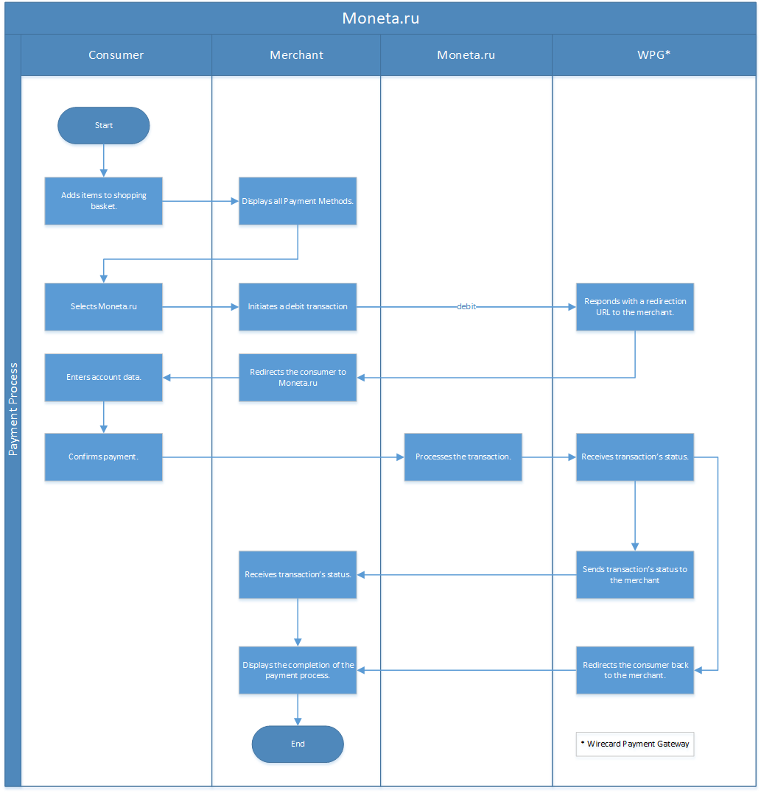

[#monetaRu]
=== moneta.ru

[#monetaRu_Introduction]
==== Introduction
[.clearfix]
--
[.right]

_moneta.ru_ is a well-established and widely used payment method and
electronic wallet in Russia and the Ukraine. After registering and
opening an account, funds may be transferred to and from this account.
The account holder may load funds to the account using both credit and
debit cards as well as alternative payment methods, such as Yandex.Money
and Web Money.
--

To make a payment using a moneta.ru account, consumers log in to their
account and authorize the transaction. Once the payment is authorized by
the consumer, the payment may no longer be cancelled. This ensures a
payment guarantee and allows the merchant to deliver the goods or
provide services immediately upon receipt of the payment. Any
discrepancies that might appear are settled directly between the
consumer and _moneta.ru._

_moneta.ru_ processes payments for many renowned gaming companies making
the online gaming industry one of _moneta.ru_'s core businesses for
payouts.

[#monetaRu_GeneralInformation]
==== General Information

[#monetaRu_PaymentModeCountriesandCurrencies]
===== Payment Mode, Countries and Currencies

This table illustrates which payment mode _moneta.ru_ belongs to. It
also provides detailed information about the countries and currencies
which are relevant for _moneta.ru._

[%autowidth,cols="h,"]
|===
| Payment Mode | <<PaymentMethods_PaymentMode_Wallet, Wallet>>
| Countries    | AM, AZ, BY, EE, KZ, KG, LV, LT, MD, RU, TJ, UA, UZ
| Currencies   | EUR, USD, RUB
|===

[#monetaRu_CommunicationFormats]
===== Communication Formats

This table illustrates how _moneta.ru_ notifications are encoded and
which formats and methods can be used for requests and responses.

[%autowidth]
|===
.2+h| Requests/Responses | Format   | XML, NVP
                         | Methods  | POST, GET
   h| IPN Encodement   2+| Please follow the instructions given at <<GeneralPlatformFeatures_IPN, Instant Payment Notification>> to set up IPN.
|===

[#monetaRu_TransactionTypes]
==== Transaction Types

For <<Glossary_TransactionType, transaction type>> details which are not given
here, look at <<AppendixB, Appendix B: Transaction Types>>.

[cols="e,"]
|===
| Transaction Type | Link to the Sample

| check-signature  |
| credit           | <<monetaRu_Samples_credit, credit samples>>
| debit            | <<monetaRu_Samples_debit, debit samples>>
| refund-debit     | <<monetaRu_Samples_refundDebit, refund-debit samples>>
|===

[#monetaRu_TestCredentials]
==== Test Credentials

.Test Credentials for moneta.ru
[stripes=none]
|===
.2+h|URLs (Endpoints)       .2+| REST API | For transaction types ``credit`` and ``debit``. | ``\https://api-test.wirecard.com/engine/rest/paymentmethods/``
                                          | For transaction types ``refund-debit``.         | ``\https://api-test.wirecard.com/engine/rest/payments/``
h| Merchant Account ID       3+| 6f3109c3-4ab1-46ea-88c0-093b324184da
h| Username                  3+| 16390-testing
h| Password                  3+| 3!3013=D3fD8X7
h| Secret Key (Payment Page) 3+| f6486298-85b0-40a2-956f-eaa52f6b6aa5
|===

[#monetaRu_AdditionalTestCredentials]
===== On _moneta.ru_ Environment

[%autowidth,cols="h,"]
|===
| Email             | \moneta.testmerchant@wirecard.com
| Password          | TestS3cureMyGate
| Payment Password  | 12345
|===

[#monetaRu_Workflow]
==== Workflow

[#monetaRu_Fields]
==== Fields

The fields used for _moneta.ru_ requests, responses and notifications are
the same as the <<RestApi_Fields, REST API Fields>> with the following exceptions:

[#monetaRu_Fields_debit]
===== debit

Please refer to the <<RestApi_Fields, API field list>>
or the request example for the fields required in a debit transaction.

Only the fields listed below have different properties.

The following elements are mandatory *M*, optional *O* or conditional
*C* for a request/response/notification. If the respective cell is
empty, the field is disregarded or not sent.

[cols="e,,,,,,,"]
|===
| Field  | Request | Response | Notification | Data Type    | Size | Values           | Description

| locale | M       | M        | O            | Alphanumeric | 2    | ``en`` or ``ru`` | Language that the moneta page will be rendered in. Default: ``en``.
|===

[#monetaRu_Fields_credit]
===== credit

Please refer to the <<RestApi_Fields, API field list>>
or the request example for the fields required in a credit transaction.

Only the fields listed below have different properties.

The following elements are mandatory *M*, optional *O* or conditional
*C* for a request/response/notification. If the respective cell is
empty, the field is disregarded or not sent.

[cols="e,,,,,,,"]
|===
| Field            | Request | Response | Notification | Data Type    | Size | Value Range | Description

|wallet/account-id | M       | M        | O            | Alphanumeric | 100  | Numeric     | Identifier of the Account Holder's Moneta Wallet Account.
|===

[#monetaRu_Samples]
==== Samples

NOTE: For XML we do not list any notification samples. See <<GeneralPlatformFeatures_IPN_NotificationExamples, IPN Notification Examples>>, for notification samples.

[#monetaRu_Samples_debit]
===== debit

.XML debit Request (Successful)
[source,xml]
----
<?xml version="1.0" encoding="utf-8"?>
<payment xmlns="http://www.elastic-payments.com/schema/payment">
   <payment-methods>
      <payment-method name="moneta_ru" />
   </payment-methods>
   <merchant-account-id>6f3109c3-4ab1-46ea-88c0-093b324184da</merchant-account-id>
   <request-id>{{$guid}}</request-id>
   <transaction-type>debit</transaction-type>
   <requested-amount currency="EUR">1.00</requested-amount>
   <order-number>180925092813363</order-number>
   <order-detail>Test product 001</order-detail>
   <ip-address>127.0.0.1</ip-address>
   <locale>en</locale>
   <account-holder>
      <first-name>John</first-name>
      <last-name>Doe</last-name>
      <email>john.doe@wirecard.com</email>
   </account-holder>
      <notifications>
         <notification url="add.your.url.here"/>
      </notifications>
   <cancel-redirect-url>https://demoshop-test.wirecard.com/demoshop/#/cancel</cancel-redirect-url>
   <success-redirect-url>https://demoshop-test.wirecard.com/demoshop/#/success</success-redirect-url>
   <fail-redirect-url>https://demoshop-test.wirecard.com/demoshop/#/error</fail-redirect-url>
</payment>
----

.XML debit Response (Successful)
[source,xml]
----
<?xml version="1.0" encoding="utf-8" standalone="yes"?>
<payment xmlns="http://www.elastic-payments.com/schema/payment" xmlns:ns2="http://www.elastic-payments.com/schema/epa/transaction">
   <merchant-account-id>6f3109c3-4ab1-46ea-88c0-093b324184da</merchant-account-id>
   <transaction-id>7238e0c5-8270-4fa3-b06d-3fe6d3f26d48</transaction-id>
   <request-id>d82fc3a0-8bcc-4c35-998d-b66b39697f69</request-id>
   <transaction-type>debit</transaction-type>
   <transaction-state>success</transaction-state>
   <completion-time-stamp>2018-09-25T07:28:13.000Z</completion-time-stamp>
   <statuses>
      <status code="201.0000" description="The resource was successfully created." severity="information" />
   </statuses>
   <requested-amount currency="EUR">1.00</requested-amount>
   <account-holder>
      <first-name>John</first-name>
      <last-name>Doe</last-name>
      <email>john.doe@wirecard.com</email>
   </account-holder>
   <ip-address>127.0.0.1</ip-address>
   <order-number>180925092813363</order-number>
   <order-detail>Test product 001</order-detail>
   <notifications>
      <notification url="add.your.url.here"/>
   </notifications>
   <payment-methods>
      <payment-method url="https://demo.moneta.ru:443/assistant.htm?MNT_ID=75484984&amp;MNT_TRANSACTION_ID=d82fc3a0-8bcc-4c35-998d-b66b39697f69&amp;MNT_CURRENCY_CODE=EUR&amp;MNT_AMOUNT=1.00&amp;MNT_DESCRIPTION=Test+product+001&amp;MNT_SUCCESS_URL=https%3A%2F%2Fapi-test.wirecard.com%3A443%2Fengine%2Fnotification%2Fmoneta%2Fredirect%2F7238e0c5-8270-4fa3-b06d-3fe6d3f26d48%2F&amp;MNT_FAIL_URL=https%3A%2F%2Fdemoshop-test.wirecard.com%2Fdemoshop%2F%23%21%2Ferror&amp;moneta.locale=en&amp;MNT_TEST_MODE=0&amp;MNT_CUSTOM1=7238e0c5-8270-4fa3-b06d-3fe6d3f26d48&amp;MNT_CUSTOM2=180925092813363&amp;MNT_CUSTOM3=moneta_ru&amp;MNT_SIGNATURE=245fdbb37ed7ac20b40f348625734ec3&amp;paymentSystem.unitId=1015&amp;paymentSystem.limitIds=1015" name="moneta_ru" />
   </payment-methods>
   <cancel-redirect-url>https://demoshop-test.wirecard.com/demoshop/#/cancel</cancel-redirect-url>
   <fail-redirect-url>https://demoshop-test.wirecard.com/demoshop/#/error</fail-redirect-url>
   <success-redirect-url>https://demoshop-test.wirecard.com/demoshop/#/success</success-redirect-url>
   <locale>en</locale>
</payment>
----

.XML debit Request (Failure)
[source,xml]
----
<?xml version="1.0" encoding="utf-8"?>
<payment xmlns="http://www.elastic-payments.com/schema/payment">
   <payment-methods>
      <payment-method name="moneta_ru" />
   </payment-methods>
   <merchant-account-id>6f3109c3-4ab1-46ea-88c0-093b324184da</merchant-account-id>
   <request-id>{{$guid}}</request-id>
   <transaction-type>debit</transaction-type>
</payment>
----

.XML debit Response (Failure)
[source,xml]
----
<?xml version="1.0" encoding="utf-8" standalone="yes"?>
<payment xmlns="http://www.elastic-payments.com/schema/payment" xmlns:ns2="http://www.elastic-payments.com/schema/epa/transaction">
   <merchant-account-id>6f3109c3-4ab1-46ea-88c0-093b324184da</merchant-account-id>
   <request-id>1848e744-b30c-4912-8ef5-74be7a94af06</request-id>
   <transaction-type>debit</transaction-type>
   <transaction-state>failed</transaction-state>
   <statuses>
      <status code="400.1011" description="The Requested Amount has not been provided.  Please check your input and try again." severity="error" />
   </statuses>
   <payment-methods>
      <payment-method name="moneta_ru" />
   </payment-methods>
</payment>
----

[#monetaRu_Samples_credit]
===== credit

.XML credit Request (Successful)
[source,xml]
----
<?xml version="1.0" encoding="utf-8"?>
<payment xmlns="http://www.elastic-payments.com/schema/payment">
   <merchant-account-id>6f3109c3-4ab1-46ea-88c0-093b324184da</merchant-account-id>
   <request-id>{{$guid}}</request-id>
   <transaction-type>credit</transaction-type>
   <requested-amount currency="USD">0.10</requested-amount>
   <ip-address>127.0.0.1</ip-address>
   <wallet>
      <account-id>70550125</account-id>
   </wallet>
   <payment-methods>
      <payment-method name="moneta_ru" />
   </payment-methods>
</payment>
----

.XML credit Response (Successful)
[source,xml]
----
<?xml version="1.0" encoding="utf-8" standalone="yes"?>
<payment xmlns="http://www.elastic-payments.com/schema/payment" xmlns:ns2="http://www.elastic-payments.com/schema/epa/transaction">
   <merchant-account-id>6f3109c3-4ab1-46ea-88c0-093b324184da</merchant-account-id>
   <transaction-id>5214fa2f-0196-4f13-aa0c-4c42d172e608</transaction-id>
   <request-id>ed1c76f1-3483-44f2-8beb-a79f0a9985d1</request-id>
   <transaction-type>credit</transaction-type>
   <transaction-state>success</transaction-state>
   <completion-time-stamp>2018-09-27T06:48:13.000Z</completion-time-stamp>
   <statuses>
      <status code="201.0000" description="The resource was successfully created." severity="information" />
   </statuses>
   <requested-amount currency="USD">0.10</requested-amount>
   <ip-address>127.0.0.1</ip-address>
   <payment-methods>
      <payment-method name="moneta_ru" />
   </payment-methods>
   <wallet>
      <account-id>70550125</account-id>
   </wallet>
</payment>
----

.XML credit Request (Failure)
[source,xml]
----
<?xml version="1.0" encoding="utf-8"?>
<payment xmlns="http://www.elastic-payments.com/schema/payment">
   <merchant-account-id>6f3109c3-4ab1-46ea-88c0-093b324184da</merchant-account-id>
   <request-id>93d0e001-f2a6-4277-8006-fba5c0491e2f</request-id>
   <transaction-type>credit</transaction-type>
   <ip-address>127.0.0.1</ip-address>
   <wallet>
      <account-id>70550125</account-id>
   </wallet>
   <payment-methods>
      <payment-method name="moneta_ru" />
   </payment-methods>
</payment>
----

.XML credit Response (Failure)
[source,xml]
----
<?xml version="1.0" encoding="utf-8" standalone="yes"?>
<payment xmlns="http://www.elastic-payments.com/schema/payment" xmlns:ns2="http://www.elastic-payments.com/schema/epa/transaction">
   <merchant-account-id>6f3109c3-4ab1-46ea-88c0-093b324184da</merchant-account-id>
   <request-id>93d0e001-f2a6-4277-8006-fba5c0491e2f</request-id>
   <transaction-type>credit</transaction-type>
   <transaction-state>failed</transaction-state>
   <statuses>
      <status code="400.1011" description="The Requested Amount has not been provided.  Please check your input and try again." severity="error" />
   </statuses>
   <ip-address>127.0.0.1</ip-address>
   <payment-methods>
      <payment-method name="moneta_ru" />
   </payment-methods>
   <wallet>
      <account-id>70550125</account-id>
   </wallet>
</payment>
----

[#monetaRu_Samples_refundDebit]
===== refund-debit

.XML refund-debit Request (Successful)
[source,xml]
----
<?xml version="1.0" encoding="utf-8"?>
<payment xmlns="http://www.elastic-payments.com/schema/payment">
   <merchant-account-id>6f3109c3-4ab1-46ea-88c0-093b324184da</merchant-account-id>
   <request-id>{{$guid}}</request-id>
   <transaction-type>refund-debit</transaction-type>
   <requested-amount currency="EUR">1.00</requested-amount>
   <parent-transaction-id>fc6bc03d-de2f-47c3-93df-717fe017a3a6</parent-transaction-id>
   <payment-methods>
      <payment-method name="moneta_ru" />
   </payment-methods>
</payment>
----

.XML refund-debit Response (Successful)
[source,xml]
----
<?xml version="1.0" encoding="utf-8" standalone="yes"?>
<payment xmlns="http://www.elastic-payments.com/schema/payment" xmlns:ns2="http://www.elastic-payments.com/schema/epa/transaction" self="https://api-test.wirecard.com:443/engine/rest/merchants/6f3109c3-4ab1-46ea-88c0-093b324184da/payments/55683493-aec9-4c58-90e1-a0e79e9a90c6">
   <merchant-account-id ref="https://api-test.wirecard.com:443/engine/rest/config/merchants/6f3109c3-4ab1-46ea-88c0-093b324184da">6f3109c3-4ab1-46ea-88c0-093b324184da</merchant-account-id>
   <transaction-id>55683493-aec9-4c58-90e1-a0e79e9a90c6</transaction-id>
   <request-id>fedf4ef6-7bfe-4b8e-ba49-df5a15d327ea</request-id>
   <transaction-type>refund-debit</transaction-type>
   <transaction-state>success</transaction-state>
   <completion-time-stamp>2018-09-27T06:48:56.000Z</completion-time-stamp>
   <statuses>
      <status code="201.0000" description="moneta_ru:The resource was successfully created." severity="information" />
   </statuses>
   <requested-amount currency="EUR">1.00</requested-amount>
   <parent-transaction-id>fc6bc03d-de2f-47c3-93df-717fe017a3a6</parent-transaction-id>
   <account-holder>
      <first-name>John</first-name>
      <last-name>Doe</last-name>
      <email>john.doe@wirecard.com</email>
   </account-holder>
   <ip-address>127.0.0.1</ip-address>
   <order-number>180925092813363</order-number>
   <order-detail>Test product 001</order-detail>
   <notifications>
      <notification url="add.your.url.here"/>
   </notifications>
   <payment-methods>
      <payment-method name="moneta_ru" />
   </payment-methods>
   <parent-transaction-amount currency="EUR">1.000000</parent-transaction-amount>
   <api-id>elastic-api</api-id>
   <cancel-redirect-url>https://demoshop-test.wirecard.com/demoshop/#/cancel</cancel-redirect-url>
   <fail-redirect-url>https://demoshop-test.wirecard.com/demoshop/#/error</fail-redirect-url>
   <success-redirect-url>https://demoshop-test.wirecard.com/demoshop/#/success</success-redirect-url>
   <locale>en</locale>
   <wallet>
      <account-id>38038281</account-id>
   </wallet>
   <iso>
      <pos-transaction-time>064856</pos-transaction-time>
      <pos-transaction-date>0927</pos-transaction-date>
   </iso>
   <provider-account-id>75484984</provider-account-id>
</payment>
----

.XML refund-debit Request (Failure)
[source,xml]
----
 <?xml version="1.0" encoding="utf-8"?>
<payment xmlns="http://www.elastic-payments.com/schema/payment">
   <merchant-account-id>6f3109c3-4ab1-46ea-88c0-093b324184da</merchant-account-id>
   <request-id>{{$guid}}</request-id>
   <transaction-type>refund-debit</transaction-type>
   <requested-amount currency="EUR">1.00</requested-amount>
   <parent-transaction-id>fc6bc03d-de2f-47c3-93df-717fe017a3a6</parent-transaction-id>
   <payment-methods>
      <payment-method name="moneta_ru" />
   </payment-methods>
</payment>
----

NOTE: The merchant receives an _XML refund-debit Response (Failure)_, if the
acquirer did not respond due to e.g. a server downtime.

.XML refund-debit Response (Failure)
[source,xml]
----
<?xml version="1.0" encoding="utf-8" standalone="yes"?>
<payment xmlns="http://www.elastic-payments.com/schema/payment" xmlns:ns2="http://www.elastic-payments.com/schema/epa/transaction">
   <merchant-account-id>6f3109c3-4ab1-46ea-88c0-093b324184da</merchant-account-id>
   <transaction-id>ddc902ec-ae18-44e3-8e12-b261eb9b2437</transaction-id>
   <request-id>96b97dd0-26ef-4d3f-a23a-b3f66f3a95db</request-id>
   <transaction-type>refund-debit</transaction-type>
   <transaction-state>failed</transaction-state>
   <completion-time-stamp>2018-09-27T06:50:19.000Z</completion-time-stamp>
   <statuses>
      <status code="500.1999" description="The acquirer returned an unknown response.  Contact Technical Support." severity="error" />
   </statuses>
   <requested-amount currency="EUR">1.00</requested-amount>
   <parent-transaction-id>fc6bc03d-de2f-47c3-93df-717fe017a3a6</parent-transaction-id>
   <account-holder>
      <first-name>John</first-name>
      <last-name>Doe</last-name>
      <email>john.doe@wirecard.com</email>
   </account-holder>
   <order-number>180925092813363</order-number>
   <order-detail>Test product 001</order-detail>
   <notifications>
      <notification url="add.your.url.here"/>
   </notifications>
   <payment-methods>
      <payment-method name="moneta_ru" />
   </payment-methods>
   <api-id>---</api-id>
   <cancel-redirect-url>https://demoshop-test.wirecard.com/demoshop/#/cancel</cancel-redirect-url>
   <fail-redirect-url>https://demoshop-test.wirecard.com/demoshop/#/error</fail-redirect-url>
   <success-redirect-url>https://demoshop-test.wirecard.com/demoshop/#/success</success-redirect-url>
   <locale>en</locale>
   <wallet>
      <account-id>38038281</account-id>
   </wallet>
</payment>
----
