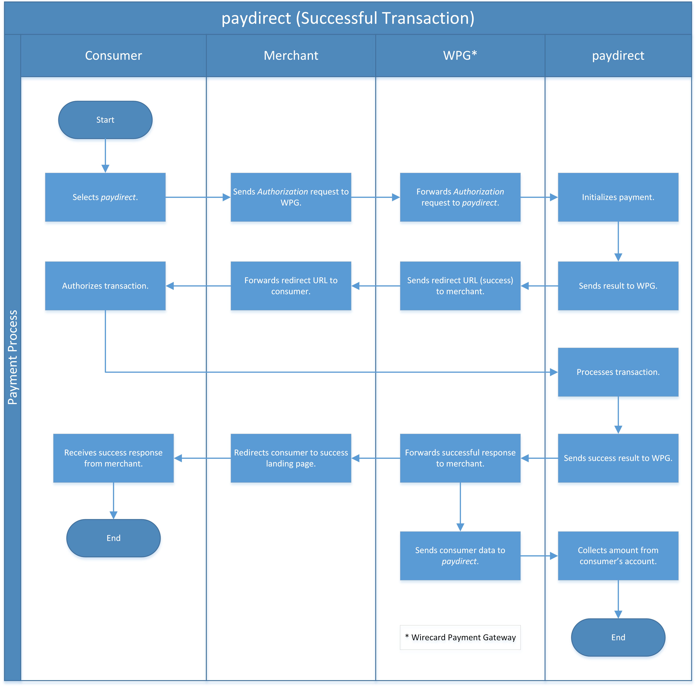

[#paydirekt]
=== paydirekt

[#paydirekt_Introduction]
==== Introduction
[.clearfix]
--
[.right]
image::images/11-21-paydirekt/paydirekt-logo.png[paydirekt Logo,width=200]

_paydirekt_ is a payment method offered by Germany’s private banks and
local cooperative banks. The online payment system is an initiative of
several major banks in Germany. _paydirekt_ is integrated into the
systems of the participating banks and follows the strict requirements
from the German banking industry. A major benefit for the merchants is
that the payment solution is made in Germany. Consumers may be more
receptive towards a local payment method rather than a foreign player.
It offers an immediate payment guarantee, a simple interface, easy
connection via payment service providers and standard plugins as well as
a high transaction security, age verification, and Consumer
authentication.
--

[#paydirekt_GeneralInformation]
==== General Information

[#paydirekt_PaymentModeCountriesandCurrencies]
===== Payment Mode, Countries and Currencies 

This table illustrates which payment mode _paydirekt_ belongs to. It
also provides detailed information about the countries and currencies
which are relevant for _paydirekt._

[cols="h,"]
|===
| Payment Mode | <<PaymentMethods_PaymentMode_OnlineBankTransfer, Online Bank Transfer>>
| Countries    | Germany
| Currencies   | EUR
|===

[#paydirekt_CommunicationFormats]
===== Communication Formats

This table illustrates how _paydirekt_ notifications are encoded and
which formats and methods can be used for requests and responses.

[%autowidth]
|===
.2+h| Requests/Responses | Format   | XML
                         | Methods  | POST, GET
   h| IPN Encodement   2+| Base64
|===

[#paydirekt_TransactionTypes]
==== Transaction Types

For <<Glossary_TransactionType, transaction type>> details look
at <<AppendixB, Appendix B: Transaction Types>>.

[%autowidth]
|===
| Transaction Type      | Link to the Sample

| _authorization_         | <<paydirekt_Samples_authorization, _authorization_ samples>>
| _capture-authorization_ | <<paydirekt_Samples_capture, _capture_ samples>>
| _debit_                 | <<paydirekt_Samples_debit, _debit_ samples>>
| _refund-debit_          |
| _refund-capture_        |
|===

[#paydirekt_TestCredentials]
==== Test Credentials
|===
.2+h| URLs (Endpoints)             | For transaction types _authorization_ and _debit_.                      | ``\https://{test-instance-hostname}/engine/rest/paymentmethods/``
                                   | For transaction types _capture_, _refund-capture_ and _refund-debit_. | ``\https://{test-instance-hostname}/engine/rest/payments/``
   h| Merchant Account ID (MAID) 2+| c7f465c6-7982-4a58-a878-66265e75db50
   h| Username                   2+| 16390-testing
   h| Password                   2+| 3!3013=D3fD8X7
   h| Secret Key                 2+| 30520cf9-8f5b-4b0b-9430-58a1223b79dc
|===

[#paydirekt_AdditionalTestCredentials]
.On _paydirekt_ Environment

[%autowidth,cols="h,"]
|===
| login    | WirecardPDExpress2
| password | WirecardPDExpress22$
|===

[#paydirekt_Workflow]
==== Workflow

. Consumer selects _paydirekt._
. Merchant sends a payment request to WPG.
. {payment-gateway-abbr} forwards the payment request to _paydirekt._
. _paydirekt_ initializes payment.
. _paydirekt_ sends payment result to WPG.
. {payment-gateway-abbr} sends redirect URL to merchant.
. Merchant forwards redirect URL to consumer.
. Consumer authorizes the transaction in _paydirekt_ account.
. _paydirekt_ processes the transaction.
. _paydirekt_ sends success result to WPG.
. {payment-gateway-abbr} forwards success result to merchant and sends consumer data to _paydirekt._
. Merchant redirects consumer to success landing page.
. Consumer receives the successful result from merchant.
. _paydirekt_ collects amount from consumer's account.

//-

[#paydirekt_Fields]
==== Fields

The following elements are mandatory *M*, optional *O* or conditional
*C* for a request/response/notification. If the respective cell is
empty, the field is disregarded or not sent.

[#paydirekt_Fields_authorization]
===== _authorization_

[cols="10e,1,1,1,2,1,10a"]
|===
| Term                                     | Request  | Response | Notification  | Type         | Size | Description

| merchant-account-id                      | M        | M        | M             | String       | 36   | Unique identifier for a merchant account.
| transaction-id                           |          | M        | M             |              | 36   | The Transaction ID is the unique identifier for a transaction. It is generated by Wirecard.
| request-id                               | M        | M        | M             | String       | 36   | This is the identification number of the request. *It has to be unique for each request.*
| transaction-type                         | M        | M        | M             | String       | 22   | This is the type for a transaction. Must be ``authorization``.
| payment-methods/payment-method[@name]    | M        | M        | M             | String       | 9    | The name of the Payment Method is _paydirekt._ Must be _paydirekt._
| payment-methods/payment-method[@url]     |          | M        |               | String       |      | _paydirekt_ url  where the consumer is going to be redirected in order to confirm the payment.
| api-id                                   | O        | O        | M             | String       |      |
| requested-amount                         | M        | M        | M             | Decimal      | 7,2  | This is the amount of the transaction.
The amount of the decimal place is dependent of the currency. Minimum is 0.01. Maximum is 50000.
| requested-amount[@currency]              | M        | M        | M             | String       | 3    | _paydirekt_ supports *only EUR currency.* Must be ``EUR``.
| order-number                             | M        | M        | M             | String       | 20   | The order number from the merchant.
| order-items                              | O        | O        | O             | order-item[] |      | Basket items details
| order-items/order-item                   | O        | O        | O             | order-item   |      | Basket item detail
| order-items/order-item/name              | M        | M        | M             | String       | 256  | Basket item name. Mandatory for each instance of ``order-item``.
| order-items/order-item/quantity          | M        | M        | M             | Number       |      | Basket item quantity. Should be greater than zero. Mandatory for each instance of ``order-item``.
| order-items/order-item/amount            | M        | M        | M             | Decimal      | 12,3 | Basket item amount. Mandatory for each instance of ``order-item``.
| order-items/order-item/amount[@currency] | M        | M        | M             | String       | 3    | Basket item amount currency, must be ``EUR``.
| order-items/order-item/article-number    | O        | O        | O             | String       |      | Article number
| order-items/order-item/tax-rate          | O        | O        | O             | String       |      | Tax rate
| shipping                                 | M        | M        | M             | Shipping     |      | Shipping details

NOTE: Only mandatory for *non*-express payment! In case of express, shipping
data shall not be set.

| shipping/first-name                      | M        | M        | M             | String       | 32   | Consumer's first name
| shipping/last-name                       | M        | M        | M             | String       | 32   | Consumer's last name
| shipping/address                         | M        | M        | M             | Address      |      | Consumer's shipping address details
| shipping/address/street1                 | M        | M        | M             | String       | 70   | Consumer's shipping address street 1
| shipping/address/city                    | M        | M        | M             | String       | 32   | Consumer's shipping address city
| shipping/address/country                 | M        | M        | M             | String       | 3    | Consumer's shipping address country
| shipping/address/postal-code             | M        | M        | M             | String       | 16   | Consumer's shipping address zip code
| transaction-state                        |          | M        | M             | String       | 7    | Transaction result status. Should be ``success`` or ``cancel`` or ``failed``.
| Statuses/status[@code]                   |          | M        | M             | String       |      | Transaction status code, e.g. ``201.0000``.
| statuses/status[@description]            |          | M        | M             | String       |      | Transaction status description
| statuses/status[@severity]               |          | M        | M             | String       |      | Transaction status severity. Should be ``information`` for successful transactions, ``error`` for failed transactions.
| completion-time-stamp                    |          | M        | M             | Date time    |      | Timestamp of the transaction
|===

[#paydirekt_Fields_debit]
===== _debit_

[cols="10e,1,1,1,2,1,10a"]
|===
| Term                                     | Request  | Response | Notification  | Type         | Size | Description

| merchant-account-id                      | M        | M        | M             | String       | 36   | Unique identifier for a merchant account.
| transaction-id                           |          | M        | M             | String       | 36   | The Transaction ID is the unique identifier for a transaction. It is generated by Wirecard.
| request-id                               | M        | M        | M             | String       | 36   | This is the identification number of the request. *It has to be unique for each request.*
| transaction-type                         | M        | M        | M             | String       | 22   | This is the type for a transaction. Must be ``debit``.
| payment-methods/payment-method[@name]    | M        | M        | M             | String       | 9    | The name of the Payment Method is _paydirekt_. Must be ``paydirekt``.
| payment-methods/payment-method[@url]     |          | M        |               | String       |      | _paydirekt_ url  where the consumer is going to be redirected in order to confirm the payment.
| api-id                                   | O        | O        | M             | String       |      |
| requested-amount                         | M        | M        | M             | Decimal      | 7,2  | This is the amount of the transaction. The amount of the decimal place is dependent of the currency. Minimum is 0.01. Maximum is 50000.
| requested-amount[@currency]              | M        | M        | M             | String       | 3    | _paydirekt_ supports *only EUR currency.* Must be ``EUR``.
| order-number                             | M        | M        | M             | String       | 20   | The order number from the merchant.
| order-items                              | O        | O        | O             | order-item[] |      | Basket items details
| order-items/order-item                   | O        | O        | O             | order-item   |      | Basket item detail
| order-items/order-item/name              | M        | M        | M             | String       | 256  | Basket item name. Mandatory for each instance of ``order-item``.
| order-items/order-item/quantity          | M        | M        | M             | Number       |      | Basket item quantity. Should be greater than zero. Mandatory for each instance of ``order-item``.
| order-items/order-item/amount            | M        | M        | M             | Decimal      | 12,3 | Basket item amount. Mandatory for each instance of ``order-item``.
| order-items/order-item/amount[@currency] | M        | M        | M             | String       | 3    | Basket item amount currency, must be ``EUR``.
| order-items/order-item/article-number    | O        | O        | O             | String       |      | Article number
| order-items/order-item/tax-rate          | O        | O        | O             | String       |      | Tax rate
| shipping                                 | M        | M        | M             | Shipping     |      | Shipping details

NOTE: Only mandatory for *non*-express payment! In case of express, shipping data shall not be set.

| shipping/first-name                      | M        | M        | M             | String       | 32   | Consumer's first name
| shipping/last-name                       | M        | M        | M             | String       | 32   | Consumer's last name
| shipping/address                         | M        | M        | M             | Address      |      | Consumer's shipping address details
| shipping/address/street1                 | M        | M        | M             | String       | 70   | Consumer's shipping address street 1
| shipping/address/city                    | M        | M        | M             | String       | 32   | Consumer's shipping address city
| shipping/address/country                 | M        | M        | M             | String       | 3    | Consumer's shipping address country
| shipping/address/postal-code             | M        |          | M             | String       | 16   | Consumer's shipping address zip code
| transaction-state                        |          | M        | M             | String       | 7    | Transaction result status. Should be ``success`` or ``cancel`` or ``failed``.
| Statuses/status[@code]                   |          | M        | M             | String       |      | Transaction status code, e.g. ``201.0000``.
| statuses/status[@description]            |          | M        | M             | String       |      | Transaction status description
| statuses/status[@severity]               |          | M        | M             | String       |      | Transaction status severity. Should be ``information`` for successful transactions, ``error`` for failed transactions.
| completion-time-stamp                    |          | M        | M             |Date time     |      | Timestamp of the transaction
|===

[#paydirekt_Fields_captureAuthorization_refundCapture_refundDebit]
===== _capture-authorization & refund-capture & refund-debit_

[cols="10e,1,1,1,2,1,10a"]
|===
| Term                                     | Request  | Response | Notification  | Type         | Size | Description

| merchant-account-id                      | M        | M        | M             | String       | 36   | Unique identifier for a merchant account.
| transaction-id                           |          | M        | M             |              | 36   | The Transaction ID is the unique identifier for a transaction. It is generated by Wirecard.
| parent-transaction-id                    | M        | M        |               | String       | 36   | 
| request-id                               | M        | M        | M             | String       | 36   | This is the identification number of the request. *It has to be unique for each request.*
| transaction-type                         | M        | M        | M             | String       | 22   | This is the type for a transaction. Must be ``capture-authorization`` or ``refund-capture`` or ``refund-debit``.
| payment-methods/payment-method[@name]    | M        | M        | M             | String       | 9    | The name of the Payment Method is _paydirekt_. Must be ``paydirekt``.
| api-id                                   | O        | M        | M             | String       |      | 
| requested-amount                         | M        | M        | M             | Decimal      | 7,2  | This is the amount of the transaction.

The amount of the decimal place is dependent of the currency. Minimum is 0.01. Maximum is 50000.

| requested-amount[@currency]              | M        | M        | M             | String       | 3    | _paydirekt_ supports *only EUR currency.* Must be ``EUR``.
| order-number                             |          | M        | M             | String       | 20   | The order number from the merchant.
| order-items                              |          | O        | O             | order-item   |      | Basket items details. Present if exists for parent transaction.
| order-items/order-item                   |          | O        | O             | order-item   |      | Basket item detail. Present if exists for parent transaction.
| order-items/order-item/name              |          | M        | M             | String       | 256  | Basket item name. Mandatory for each instance of ``order-item``.
| order-items/order-item/quantity          |          | M        | M             | Number       |      | Basket item quantity. Should be greater than zero. Mandatory for each instance of ``order-item``.
| order-items/order-item/amount            |          | M        | M             | Decimal      | 12,3 | Basket item amount. Mandatory for each instance of ``order-item``.
| order-items/order-item/amount[@currency] |          | M        | M             | String       | 3    | Basket item amount currency, Must be ``EUR``.
| order-items/order-item/article-number    |          | O        | O             | String       |      | Article number
| order-items/order-item/tax-rate          |          | O        | O             | String       |      | Tax rate
| shipping                                 |          | M        | M             | Shipping     |      | Shipping details

NOTE: Only mandatory for *non*-express payment! In case of express, shipping data shall not be set.

| shipping/first-name                      |          | M        | M             | String       | 32   | Consumer's first name
| shipping/last-name                       |          | M        | M             | String       | 32   | Consumer's last name
| shipping/address                         |          | M        | M             | Address      |      | Consumer's shipping address details
| shipping/address/street1                 |          | M        | M             | String       | 70   | Consumer's shipping address street 1
| shipping/address/city                    |          | M        | M             | String       | 32   | Consumer's shipping address city
| shipping/address/country                 |          | M        | M             | String       | 3    | Consumer's shipping address country
| shipping/address/postal-code             |          | M        | M             | String       | 16   | Consumer's shipping address zip code
| transaction-state                        |          | M        | M             | String       | 7    | Transaction result status. Should be ``success`` or ``cancel`` or ``failed``.
| Statuses/status[@code]                   |          | M        | M             | String       |      | Transaction status code, e.g. ``201.0000``.
| statuses/status[@description]            |          | M        | M             | String       |      | Transaction status description
| statuses/status[@severity]               |          | M        | M             | String       |      | Transaction status severity. Should be ``information`` for successful transactions, ``error`` for failed transactions.
| completion-time-stamp                    |          | M        | M             | Date time    |      | Timestamp of the capture/refund transaction
| custom-fields/custom-field[@field-name='finalCapture'][@field-value]
                                           | O        | O        | O             | Boolean      |      | Final capture flag. If set to true the final capture will be created and no further capture will be possible.
|===

[#paydirekt_Features]
==== Features

[#paydirekt_ExpressCheckout]
===== EXPRESS Checkout

[#paydirekt_ExpressCheckout_TestCredentials]
====== Test Credentials

|===
h| URLs (Endpoints)             | For transaction types _authorization_ and _debit_.                     | ``\https://{test-instance-hostname}/engine/rest/paymentmethods/``
h| Merchant Account ID (MAID) 2+| 068793d9-3f5b-4028-89b8-00e26a8c540d
h| Merchant Account Name      2+| _paydirekt Express_ Test Merchant
h| Username                   2+| 16390-testing
h| Password                   2+| 3!3013=D3fD8X7
h| Secret Key                 2+| e39945d1-9f42-4f3e-b873-09201d7cc95e
|===

[#paydirekt_ExpressCheckout_AdditionalTestCredentials]
.On paydirekt Environment
[%autowidth, cols="h,"]
|===
| Login    | WirecardPDExpress2
| Password | WirecardPDExpress22$
|===

[#paydirekt_ExpressCheckout_Description]
====== Description

_paydirekt_ Express enables payments to be made, with the shipping
address being returned to the merchant. In this way, a purchase can be
made without consumers having to enter their address on the merchant
website or having to create a consumer account. To complete the payment
and conclusively confirm it, the execute link must be called up after
the consumer confirmation in the _paydirekt_ system. Here, the
consumer is typically redirected back to the shop and prompted to
confirm the merchant’s general terms & conditions of business.

[#paydirekt_ExpressCheckout_Configuration]
====== Configuration

WARNING: There is no special flag to mark "Express" Checkout, this depends on
merchant's configuration.

image::images/11-21-paydirekt/paydirekt-express-checkout-workflow.png[paydirekt Express Checkout Workflow]

[#paydirekt_ProcessFlow]
====== Process Flow

. Consumer: Clicks _EXPRESS Checkout_ Button in the Shop.
. Shop-System: Calls the checkout endpoint and submits all relevant
order data to _paydirekt._ +
_paydirekt:_ Returns the _approve_” link (_paydirekt_ payment page) in
the API Response.
. Shop-System: Redirects the Consumer to the approve link (_paydirekt_
payment page).
. Consumer: Logs into his _paydirekt_ account on the _paydirekt_
payment page.
. _paydirekt_: Calls the shop-system’s ``callbackUrlCheckDestinations``
endpoint (the shop-system must provide this callback) after the consumer
logs in and the shop-system provides all addresses available in the
consumer's _paydirekt_ account in that call. +
Shop-System: Uses the addresses submitted from _paydirekt_ and decides
which addresses are allowed as invoice and/or delivery address.
Furthermore the shop system needs to add the shipping options for each
address and return this in the answer to the callback call.
. _paydirekt_: Displays the default addresses on the payment
page (those addresses used most often by the consumer) along with the
shipping options (that _paydirekt_ received in step 5). +
. Consumer: Chooses one of the shipping addresses. Alternatively, the
consumer can choose any other address available in his/her _paydirekt_
account (they all have shipping options associated due to the callback).
The consumer may also add a new address. If the consumer adds a new
address, a callback is issued similar to step 5, sending the new address
to the merchant. Handling is the same as in step 5. +
_paydirekt_: While the consumer chooses a shipping option on the payment
page, Wirecard recalculates/updates the totalAmount in the shopping
cart.
. Consumer: Consumer clicks on the _Jetzt kaufen_ link on the payment
page.
. _paydirekt_: Redirects the user back to the shop (using the provided
redirect URLS) depending on the status of the Directsale/Order
actions.
. Shop-System: Queries (GET) the checkout. The checkout now contains
the addresses the consumer selected along with the shipping options. The
shop-system now has all relevant data.
. Shop-System: Shows the _Final Order_ screen and _Order Confirmation_
button (along with the data from step 10).
. Consumer: Clicks the _Order Confirmation_ button
. Shop-System: Internally flags/stores the order as _confirmed_ AND
sends the execute request to _paydirekt_ (for initiating all payment
processes = getting the money). +
_paydirekt_: Will return the status of the execute call.
. Shop-System: Depending on the Status of Step 13:
.. Show the “thank you page” and stores the payment information to the
order. Or
.. In case of an error, most likely presents the consumer with a page
to choose a different payment method.

//-

See <<paydirekt_Samples_ExpressCheckout_debit, XML Request Debit (Express Checkout)>> for a sample.

[#paydirekt_Samples]
==== Samples

Go to <<GeneralPlatformFeatures_IPN_NotificationExamples, Notification Examples>>, if you want to see corresponding notification samples.

[#paydirekt_Samples_authorization]
===== _authorization_

.XML Request Authorization (Successful)
[source,xml]
----
<?xml version="1.0" encoding="utf-8" standalone="yes"?>
<payment xmlns="http://www.elastic-payments.com/schema/payment">
    <merchant-account-id>c7f465c6-7982-4a58-a878-66265e75db50</merchant-account-id>
    <request-id>{{$guid}}</request-id>
    <transaction-type>authorization</transaction-type>
    <payment-methods>
        <payment-method name="paydirekt" />
    </payment-methods>
    <requested-amount currency="EUR">5.00</requested-amount>
    <order-number>180606120514730</order-number>
    <shipping>
        <first-name>John</first-name>
        <last-name>Doe</last-name>
        <address>
            <street1>Mullerstrase 16</street1>
            <city>Berlin</city>
            <postal-code>00010</postal-code>
            <country>DE</country>
        </address>
    </shipping>
 </payment>
----

.XML Response Authorization (Successful)
[source,xml]
----
<?xml version="1.0" encoding="utf-8" standalone="yes"?>
<payment xmlns="http://www.elastic-payments.com/schema/payment" xmlns:ns2="http://www.elastic-payments.com/schema/epa/transaction">
    <merchant-account-id>c7f465c6-7982-4a58-a878-66265e75db50</merchant-account-id>
    <transaction-id>219166b2-d71d-4f05-b332-d87720929007</transaction-id>
    <request-id>c274df92-81a7-47e4-a1ee-7a6cc4285584</request-id>
    <transaction-type>authorization</transaction-type>
    <transaction-state>success</transaction-state>
    <completion-time-stamp>2018-06-06T10:05:15.000Z</completion-time-stamp>
    <statuses>
        <status code="201.0000" description="The resource was successfully created." severity="information" />
    </statuses>
    <requested-amount currency="EUR">5.00</requested-amount>
    <shipping>
        <first-name>John</first-name>
        <last-name>Doe</last-name>
        <address>
            <street1>Mullerstrase 16</street1>
            <city>Berlin</city>
            <country>DE</country>
            <postal-code>00010</postal-code>
        </address>
    </shipping>
    <order-number>180606120514730</order-number>
    <payment-methods>
        <payment-method url="https://sandbox.paydirekt.de/checkout/#/checkout/c092a6a6-c130-4fab-930c-c6a07eab66c9" name="paydirekt" />
    </payment-methods>
</payment>
----

NOTE: In the following failure samples the failure is caused by a difference
between requested amount and the total amount of the merchandise in the
cart. 

.XML Request Authorization (Failed)
[source,xml]
----
<?xml version="1.0" encoding="utf-8" standalone="yes"?>
<payment xmlns="http://www.elastic-payments.com/schema/payment">
    <merchant-account-id>c7f465c6-7982-4a58-a878-66265e75db50</merchant-account-id>
    <request-id>{{$guid}}</request-id>
    <transaction-type>authorization</transaction-type>
    <payment-methods>
        <payment-method name="paydirekt" />
    </payment-methods>
    <requested-amount currency="EUR">250.60</requested-amount>
    <order-number>180606130133148</order-number>
    <order-items>
        <order-item>
            <name>Bobbycar</name>
            <article-number>800001303</article-number>
            <amount currency="EUR">25.99</amount>
            <quantity>3</quantity>
        </order-item>
        <order-item>
            <name>John</name>
            <article-number>800001304</article-number>
            <amount currency="EUR">22.03</amount>
            <quantity>1</quantity>
        </order-item>
    </order-items>
    <shipping>
        <first-name>Jane</first-name>
        <last-name>Doe</last-name>
        <address>
            <street1>Packstation 999</street1>
            <city>Schwaig</city>
            <postal-code>90402</postal-code>
            <country>DE</country>
        </address>
    </shipping>
</payment>
----

.XML Response Authorization (Failed)
[source,xml]
----
<?xml version="1.0" encoding="utf-8" standalone="yes"?>
<payment xmlns="http://www.elastic-payments.com/schema/payment" xmlns:ns2="http://www.elastic-payments.com/schema/epa/transaction">
    <merchant-account-id>c7f465c6-7982-4a58-a878-66265e75db50</merchant-account-id>
    <transaction-id>d825ccbf-d58b-4790-8c3a-09718545bf0f</transaction-id>
    <request-id>9383db6a-7d3a-40ae-a541-6297362a301c</request-id>
    <transaction-type>authorization</transaction-type>
    <transaction-state>failed</transaction-state>
    <completion-time-stamp>2018-06-06T11:01:33.000Z</completion-time-stamp>
    <statuses>
        <status code="400.1186" description="Order items overall amount is different to requested amount. Please check your input and try again." severity="error" />
    </statuses>
    <requested-amount currency="EUR">250.60</requested-amount>
    <shipping>
        <first-name>Jane</first-name>
        <last-name>Doe</last-name>
        <address>
            <street1>Packstation 999</street1>
            <city>Schwaig</city>
            <country>DE</country>
            <postal-code>90402</postal-code>
        </address>
    </shipping>
    <order-number>180606130133148</order-number>
    <order-items>
        <order-item>
            <name>Bobbycar</name>
            <article-number>800001303</article-number>
            <amount currency="EUR">25.99</amount>
            <quantity>3</quantity>
        </order-item>
        <order-item>
            <name>John</name>
            <article-number>800001304</article-number>
            <amount currency="EUR">22.03</amount>
            <quantity>1</quantity>
        </order-item>
    </order-items>
    <payment-methods>
      <payment-method name="paydirekt" />
    </payment-methods>
</payment>
----

[#paydirekt_Samples_capture]
===== _capture_

.XML Request Capture-Authorization (Successful)
[source,xml]
----
<?xml version="1.0" encoding="utf-8" standalone="yes"?>
<payment xmlns="http://www.elastic-payments.com/schema/payment">
    <merchant-account-id>c7f465c6-7982-4a58-a878-66265e75db50</merchant-account-id>
    <request-id>{{$guid}}</request-id>
    <transaction-type>capture-authorization</transaction-type>
    <parent-transaction-id>784e748d-2a21-4212-9ab2-a82183b1cbdb</parent-transaction-id>
    <payment-methods>
        <payment-method name="paydirekt" />
    </payment-methods>
    <requested-amount currency="EUR">5.0</requested-amount>
    <custom-fields>
        <custom-field field-name="finalCapture" field-value="false" />
    </custom-fields>
</payment>
----

.XML Response Capture-Authorization (Successful)
[source,xml]
----
<?xml version="1.0" encoding="utf-8" standalone="yes"?>
<payment xmlns="http://www.elastic-payments.com/schema/payment" xmlns:ns2="http://www.elastic-payments.com/schema/epa/transaction" self="https://{test-instance-hostname}:443/engine/rest/merchants/c7f465c6-7982-4a58-a878-66265e75db50/payments/116ccd3b-bd76-4925-a3db-c85ec8be98bd">
    <merchant-account-id ref="https://{test-instance-hostname}:443/engine/rest/config/merchants/c7f465c6-7982-4a58-a878-66265e75db50">c7f465c6-7982-4a58-a878-66265e75db50</merchant-account-id>
    <transaction-id>116ccd3b-bd76-4925-a3db-c85ec8be98bd</transaction-id>
    <request-id>4884632c-d5ba-4315-b639-6ed58eceae0c</request-id>
    <transaction-type>capture-authorization</transaction-type>
    <transaction-state>success</transaction-state>
    <completion-time-stamp>2018-06-06T10:14:19.000Z</completion-time-stamp>
    <statuses>
        <status code="201.0000" description="paydirekt:The resource was successfully created." severity="information" />
    </statuses>
    <requested-amount currency="EUR">5.0</requested-amount>
    <parent-transaction-id>784e748d-2a21-4212-9ab2-a82183b1cbdb</parent-transaction-id>
    <shipping>
        <first-name>John</first-name>
        <last-name>Doe</last-name>
        <address>
            <street1>Mullerstrase 16</street1>
            <city>Berlin</city>
            <country>DE</country>
            <postal-code>00010</postal-code>
        </address>
    </shipping>
    <order-number>180606120514730</order-number>
    <custom-fields>
        <custom-field field-name="finalCapture" field-value="false"></custom-field>
    </custom-fields>
    <payment-methods>
        <payment-method name="paydirekt" />
    </payment-methods>
    <parent-transaction-amount currency="EUR">5.000000</parent-transaction-amount>
    <api-id>elastic-api</api-id>
</payment>
----

.XML Request Capture-Authorization (Failed)
[source,xml]
----
<?xml version="1.0" encoding="utf-8" standalone="yes"?>
<payment xmlns="http://www.elastic-payments.com/schema/payment">
    <merchant-account-id>c7f465c6-7982-4a58-a878-66265e75db50</merchant-account-id>
    <request-id>{{$guid}}</request-id>
    <transaction-type>capture-authorization</transaction-type>
    <parent-transaction-id>784e748d-2a21-4212-9ab2-a82183b1cbdb</parent-transaction-id>
    <payment-methods>
        <payment-method name="paydirekt" />
    </payment-methods>
    <requested-amount currency="EUR">100.00</requested-amount>    <notifications>
           <custom-fields>
    <custom-field field-name="finalCapture" field-value="false" />
    </custom-fields>
</payment>
----

.XML Response Capture-Authorization (Failed)
[source,xml]
----
<?xml version="1.0" encoding="utf-8" standalone="yes"?>
<payment xmlns="http://www.elastic-payments.com/schema/payment" xmlns:ns2="http://www.elastic-payments.com/schema/epa/transaction" self="https://{test-instance-hostname}:443/engine/rest/merchants/c7f465c6-7982-4a58-a878-66265e75db50/payments/efd3b24b-5b24-4822-9af6-0657915a044d">
    <merchant-account-id ref="https://{test-instance-hostname}:443/engine/rest/config/merchants/c7f465c6-7982-4a58-a878-66265e75db50">c7f465c6-7982-4a58-a878-66265e75db50</merchant-account-id>
    <transaction-id>efd3b24b-5b24-4822-9af6-0657915a044d</transaction-id>
    <request-id>5f8bf8a6-2fd9-4afc-9f75-2b93d05396e5</request-id>
    <transaction-type>capture-authorization</transaction-type>
    <transaction-state>failed</transaction-state>
    <completion-time-stamp>2018-06-06T10:12:44.000Z</completion-time-stamp>
    <statuses>
        <status code="400.1027" description="The Requested Amount exceeds the Parent Transaction Amount. Please check your input and try again." severity="error" />
    </statuses>
    <requested-amount currency="EUR">100.00</requested-amount>
    <parent-transaction-id>784e748d-2a21-4212-9ab2-a82183b1cbdb</parent-transaction-id>
    <shipping>
        <first-name>John</first-name>
        <last-name>Doe</last-name>
        <address>
            <street1>Mullerstrase 16</street1>
            <city>Berlin</city>
            <country>DE</country>
            <postal-code>00010</postal-code>
        </address>
    </shipping>
    <order-number>180606120514730</order-number>
    <custom-fields>
        <custom-field field-name="finalCapture" field-value="false"></custom-field>
    </custom-fields>
    <payment-methods>
        <payment-method name="paydirekt" />
    </payment-methods>
    <parent-transaction-amount currency="EUR">5.000000</parent-transaction-amount>
    <api-id>elastic-api</api-id>
</payment>
----

.XML Request Refund-Capture (Failed)
[source,xml]
----
<?xml version="1.0" encoding="utf-8" standalone="yes"?>
<payment xmlns="http://www.elastic-payments.com/schema/payment">
    <merchant-account-id>c7f465c6-7982-4a58-a878-66265e75db50</merchant-account-id>
    <request-id>{{$guid}}</request-id>
    <transaction-type>refund-capture</transaction-type>
    <payment-methods>
        <payment-method name="paydirekt" />
    </payment-methods>
    <requested-amount currency="EUR">250.60</requested-amount>
    <parent-transaction-id>fb02f827-171a-4094-88c9-3f40a889c848</parent-transaction-id>
</payment>
----

.XML Response Refund-Capture (Failed)
[source,xml]
----
<?xml version="1.0" encoding="utf-8" standalone="yes"?>
<payment xmlns="http://www.elastic-payments.com/schema/payment" xmlns:ns2="http://www.elastic-payments.com/schema/epa/transaction" self="https://{test-instance-hostname}:443/engine/rest/merchants/c7f465c6-7982-4a58-a878-66265e75db50/payments/ca0a101d-cc1b-4ee9-be89-87ccfcd26185">
    <merchant-account-id ref="https://{test-instance-hostname}:443/engine/rest/config/merchants/c7f465c6-7982-4a58-a878-66265e75db50">c7f465c6-7982-4a58-a878-66265e75db50</merchant-account-id>
    <transaction-id>ca0a101d-cc1b-4ee9-be89-87ccfcd26185</transaction-id>
    <request-id>1f6f5f11-562b-4db1-8ec3-1e5e37ab4ff0</request-id>
    <transaction-type>refund-capture</transaction-type>
    <transaction-state>failed</transaction-state>
    <completion-time-stamp>2018-06-06T10:59:47.000Z</completion-time-stamp>
    <statuses>
        <status code="400.1027" description="The Requested Amount exceeds the Parent Transaction Amount. Please check your input and try again." severity="error" />
    </statuses>
    <requested-amount currency="EUR">250.60</requested-amount>
    <parent-transaction-id>fb02f827-171a-4094-88c9-3f40a889c848</parent-transaction-id>
    <shipping>
        <first-name>John</first-name>
        <last-name>Doe</last-name>
        <address>
            <street1>Mullerstrase 16</street1>
            <city>Berlin</city>
            <country>DE</country>
            <postal-code>00010</postal-code>
        </address>
    </shipping>
    <order-number>180606123534060</order-number>
    <custom-fields>
        <custom-field field-name="finalCapture" field-value="false" />
    </custom-fields>
    <payment-methods>
        <payment-method name="paydirekt" />
    </payment-methods>
    <parent-transaction-amount currency="EUR">5.000000</parent-transaction-amount>
    <api-id>elastic-api</api-id>
</payment>
----

[#paydirekt_Samples_debit]
===== _debit_

.XML Request Debit (Successful)
[source,xml]
----
<?xml version="1.0" encoding="utf-8" standalone="yes"?>
<payment xmlns="http://www.elastic-payments.com/schema/payment">
    <merchant-account-id>c7f465c6-7982-4a58-a878-66265e75db50</merchant-account-id>
    <request-id>{{$guid}}</request-id>
    <transaction-type>debit</transaction-type>
    <payment-methods>
        <payment-method name="paydirekt" />
    </payment-methods>
    <requested-amount currency="EUR">5.00</requested-amount>
    <order-number>180606130313945</order-number>
    <shipping>
        <first-name>John</first-name>
        <last-name>Doe</last-name>
        <address>
            <street1>Mullerstrase 16</street1>
            <city>Berlin</city>
            <postal-code>00010</postal-code>
            <country>DE</country>
        </address>
    </shipping>
</payment>
----

.XML Response Debit (Successful)
[source,xml]
----
<?xml version="1.0" encoding="utf-8" standalone="yes"?>
<payment xmlns="http://www.elastic-payments.com/schema/payment" xmlns:ns2="http://www.elastic-payments.com/schema/epa/transaction">
    <merchant-account-id>c7f465c6-7982-4a58-a878-66265e75db50</merchant-account-id>
    <transaction-id>36309bca-edcb-4164-a15f-d7a0707b7d58</transaction-id>
    <request-id>c22b861d-4773-4ab2-9502-6b108e93a0d9</request-id>
    <transaction-type>debit</transaction-type>
    <transaction-state>success</transaction-state>
    <completion-time-stamp>2018-06-06T11:03:14.000Z</completion-time-stamp>
    <statuses>
        <status code="201.0000" description="The resource was successfully created." severity="information" />
    </statuses>
    <requested-amount currency="EUR">5.00</requested-amount>
    <shipping>
        <first-name>John</first-name>
        <last-name>Doe</last-name>
        <address>
            <street1>Mullerstrase 16</street1>
            <city>Berlin</city>
            <country>DE</country>
            <postal-code>00010</postal-code>
        </address>
    </shipping>
    <order-number>180606130313945</order-number>
    <payment-methods>
        <payment-method url="https://sandbox.paydirekt.de/checkout/#/checkout/ec40032d-d7f1-4922-947f-07e6c60f74dc" name="paydirekt" />
    </payment-methods>
</payment>
----

[#paydirekt_Samples_ExpressCheckout_debit]
===== _debit_ EXPRESS Checkout

.XML Request Debit (Express Checkout)
[source,xml]
----
<?xml version="1.0" encoding="utf-8"?>
<payment xmlns="http://www.elastic-payments.com/schema/payment">
    <merchant-account-id>068793d9-3f5b-4028-89b8-00e26a8c540d</merchant-account-id>
    <request-id>{{$guid}}</request-id>
    <transaction-type>debit</transaction-type>
    <payment-methods>
        <payment-method name="paydirekt" />
    </payment-methods>
    <requested-amount currency="EUR">10.00</requested-amount>
    <order-number>180618135629929</order-number>
    <order-items>
        <order-item>
            <name>Bobbycar</name>
            <article-number>800001303</article-number>
            <amount currency="EUR">2.50</amount>
            <quantity>3</quantity>
        </order-item>
        <order-item>
            <name>Helmet</name>
            <amount currency="EUR">2.50</amount>
            <quantity>1</quantity>
        </order-item>
    </order-items>
</payment>
----

.XML Response Debit (Express Checkout)
[source,xml]
----
 <?xml version="1.0" encoding="utf-8" standalone="yes"?>
<payment xmlns="http://www.elastic-payments.com/schema/payment" xmlns:ns2="http://www.elastic-payments.com/schema/epa/transaction">
    <merchant-account-id>068793d9-3f5b-4028-89b8-00e26a8c540d</merchant-account-id>
    <transaction-id>a40a0951-9245-4046-9500-8b4cca1bb865</transaction-id>
    <request-id>a8707525-088d-4cbd-ab14-a7990188796a</request-id>
    <transaction-type>debit</transaction-type>
    <transaction-state>success</transaction-state>
    <completion-time-stamp>2018-06-18T11:56:30.000Z</completion-time-stamp>
    <statuses>
        <status code="201.0000" description="The resource was successfully created." severity="information" />
    </statuses>
    <requested-amount currency="EUR">10.00</requested-amount>
    <order-number>180618135629929</order-number>
    <order-items>
        <order-item>
            <name>Bobbycar</name>
            <article-number>800001303</article-number>
            <amount currency="EUR">2.50</amount>
            <quantity>3</quantity>
        </order-item>
        <order-item>
            <name>Helmet</name>
            <amount currency="EUR">2.50</amount>
            <quantity>1</quantity>
        </order-item>
    </order-items>
    <payment-methods>
        <payment-method url="https://sandbox.paydirekt.de/checkout/#/checkout/c615db87-a8e4-4c79-82f8-9e807cc3df2f" name="paydirekt" />
    </payment-methods>
</payment>
----

NOTE: An Express Checkout request is a regular request (e.g. a regular
<<paydirekt_Samples_debit, debit>>) which
does *not* include the shipping element or account-holder element. The
payment response is a normal response with an 'approve' link.

[NOTE]
====
The information about the express checkout transaction is available in
the response as soon as the consumer

. has chosen the shipping/billing addresses.
. has finalized the payment.
. has clicked on the 'approve' link

//-
====
