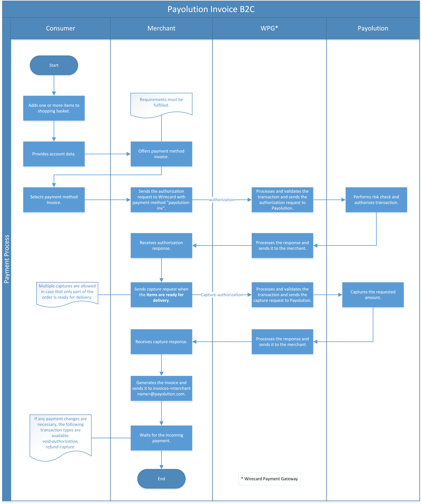
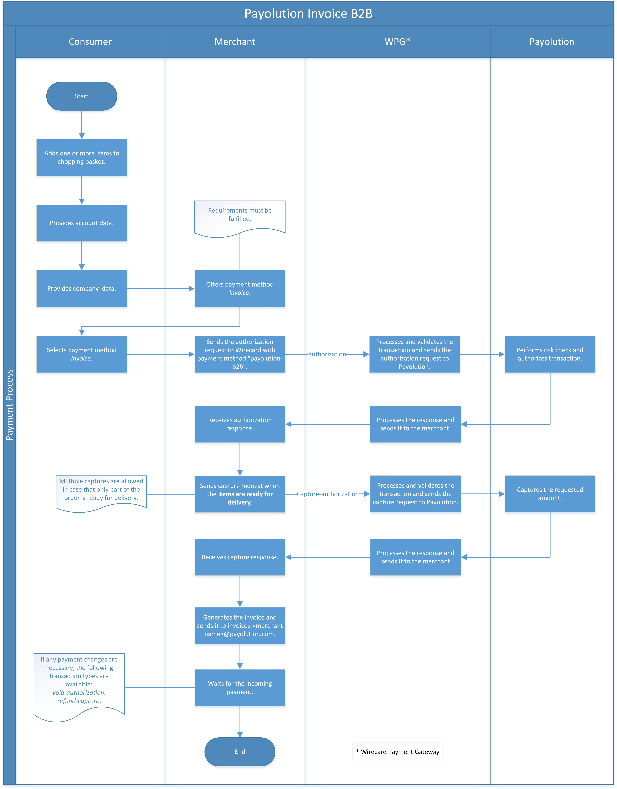
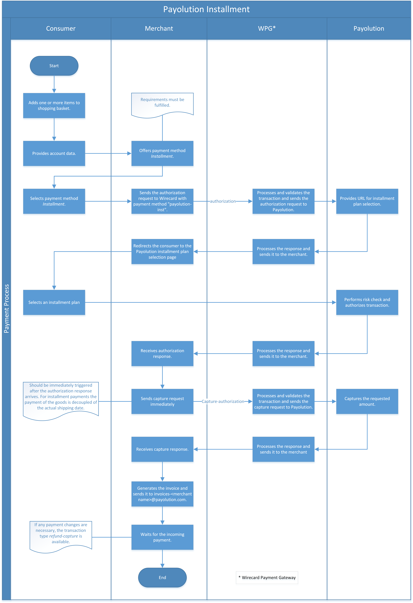
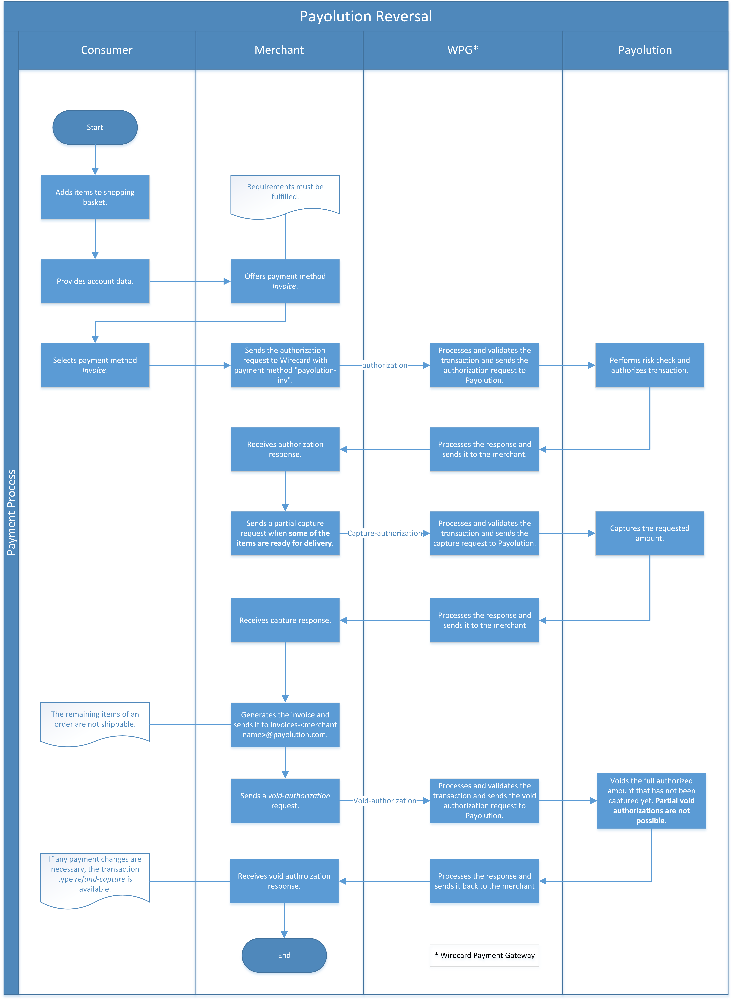

[#payolution]
=== payolution

[#payolution_Introduction]
==== Introduction

image::images/11-23-payolution/payolution_logo.png[payolution logo,  width=200, float="right", align="right"]

_payolution_ is an Austrian financial service provider offering the
payment methods **invoice** and **installment** as white label solutions
for online shops in Austria, Germany, Switzerland, and the Netherlands. 

[#payolution_Requirements]
===== Requirements

To integrate and offer the payment method for your consumers in your
online shop you need to fulfill some important requirements:

* The currency of the order amount has to be in *EUR* for Austria,
Germany and Netherlands or in *CHF* for Switzerland.
* Minimum age of private consumers (B2C): 18.
* The order amount must be within the limits agreed upon in the contract closed with _payolution_.
* All required consumer data must be available.
* The shipping country must be accepted by _payolution_.
* Additional parameters, required by _payolution_ for assessing the
creditworthiness of your consumer, must be submitted.
* Gift vouchers must be excluded and may not be purchased via invoice or
installment.

//-

[#payolution_GeneralInformation]
==== General Information

[#payolution_CountriesandCurrencies]
===== Payment Mode, Countries and Currencies

This table illustrates which payment mode _payolution_ belongs to. It
also provides detailed information about the countries and currencies
which are relevant for _payolution_.

[%autowidth,stripes=none,cols=",,"]
|===
h| Payment Mode
2+| <<PaymentMethods_PaymentMode_OnlineBankTransfer, Online Bank Transfer>>
.3+h| Countries
| Invoice B2C
| AT, DE, CH, NL
| Invoice B2B
| AT, DE, CH
| Installment
| AT, DE, CH
h| Currencies
2+| EUR, CHF
|===

[#payolution_CommunicationFormats]
===== Communication Formats

This table illustrates how _payolution_ notifications are encoded and
which formats and methods can be used for requests and responses.

[%autowidth,stripes=none,cols=",,"]
|===
.2+h|Requests/Responses
|Format
|XML
|Methods
|POST
h|IPN Encodement
2+|Please follow the instructions given at <<GeneralPlatformFeatures_IPN, Instant Payment Notification>> to set up IPN.
|===

[#payolution_Transactions]
==== Transactions

[#payolution_SpecificPaymentMethods]
===== _payolution's_ Specific Payment Methods

[%autowidth,stripes=none,cols="v,"]
|===
|Payment Method |Description

|payolution-inv
|Performs an invoice transaction. Used only for B2C transactions.
|payolution-b2b
|Performs an invoice transaction. Used only for B2B
transactions. The company name must be provided and the consumer
birthdate is not mandatory in this case.
|payolution-inst
|Performs an installment transaction. Can be used only
for B2C transactions.
|===

[#payolution-TransactionTypes]
===== Transaction Types

For <<Glossary_TransactionType, transaction type>> details which are not given here, look
at <<AppendixB, Appendix B: Transaction Types>>.

[%autowidth,cols="v,,]
|===
| Transaction Type | Description | Link to the Samples

| _authorization_
| Performs creditworthiness check the moment the consumer places an order.
| <<payolution_Samples_authorization, _authorization_ samples>>
| _capture-authorization_
| Used to capture the reserved funds the moment
some or all goods are physically delivered to the consumer. Available
only on successful authorization response which wasn’t voided nor fully
captured. Partial (and multiple) captures are allowed as long as the
authorization limit is not exceeded.
| <<payolution_Samples_captureAuthorization, _capture-authorization_ samples>>
| _void-authorization_
| Used when the consumer wishes to cancel some or
all (not yet shipped) items from the order. Available only for a
successful authorization response which has not yet been voided or
captured. Partial and multiple voids are allowed until all ordered items
are canceled or shipped.
| <<payolution_Samples_voidAuthorization, _void-authorization_ samples>>
|_refund-capture_
| Used when the consumer wishes to return some or all
delivered goods. Available on a successful capture-authorization.
Partial and multiple refunds are allowed until all delivered items have
been returned.
| <<payolution_Samples_refundCapture, _refund-capture_ samples>>
|===

[#payolution_TestCredentials]
==== Test Credentials

[cols=",,"]
[%autowidth]
[stripes=none]
|===
.2+h| URLs (Endpoints)
| For transaction type _authorization_.
| ``\https://api-test.wirecard.com/engine/rest/paymentmethods/``
| For transaction types _capture-authorization_, _refund-capture_ and _void-authorization._
| ``\https://api-test.wirecard.com/engine/rest/payments/``
h| Merchant Account ID (MAID)
2+| 2048677d-57f4-44b0-8d67-9014c6631d5f
h| Username
2+| 16390-testing
h| Password
2+| 3!3013=D3fD8X7
h| Secret Key
2+| 74bd2f0c-6d1b-4e9a-b278-abc34b83ab9f
|===

.Additional Test Credentials on _payolution_ Environment

[%autowidth, cols= "h,"]
|===
|German Bank Account
|IBAN: DE55203205008737970454 +
BIC: DABADEHHXXX
|Austrian Bank Account
|IBAN: AT321936000136412018 +
BIC: INGDAT21XXX
|Swiss Bank Account
|Not necessary on test environment.
|Netherlands
|Installment not supported for consumers from the Netherlands.
|===

[#payolution_Workflow]
==== Workflow

[#payolution_InvoiceB2C]
===== Invoice B2C (_authorization, capture-authorization_)

[NOTE]
====
_payolution_ sends the _authorization_ request with the _payolution_
specific payment method "*payolution-inv*".

For B2C transactions, the account holder's date of birth is mandatory.

Invoice B2C captures the full amount only when *all the ordered goods*
are ready for delivery.
====

[#payolution_InvoiceB2B]
===== Invoice B2B (_authorization, capture-authorization_)

[NOTE]
====
_Invoice B2B_ has the same structure as _Invoice B2C_.

_Invoice B2B_ sends the _authorization_ request with the _payolution_
specific payment method "*payolution-b2b*".

For B2B transactions, a company name is required.

Invoice B2B captures the full amount only when *all ordered goods* are
ready for delivery.
====

[#payolution_Installment]
===== Installment (_authorization, capture-authorization_)

[NOTE]
====
_Installment_ sends the _authorization_ request with the _payolution_
specific payment method "*payolution-inst*".

_Capture-authorization_ must be triggered *immediately after the
authorization* response has arrived.
====

[#payolution_Reversal]
===== Reversal (_void-authorization_)

A reversal cancels an authorized order and blocks it for future
captures. Only full reversals of the non-captured amount are supported.
Reversals should not be possible for installment transactions (capture
should follow authorization immediately).

[NOTE]
====
_Reversal_ sends the _authorization_ request with the _payolution_
specific payment method "*payolution-inv*".

_Reversal_ sends a partial _capture_ request when *some of the
items* are ready for delivery.

Only the fully authorized amount that has not been captured can be
voided. Partial void authorizations are not possible.
====

[#payolution_Refund]
===== Refund (_refund-capture_)

[NOTE]
====
A refund request must be sent in case of goods returned by the consumer.

Refunds can also be used for invoice reduction or settlement of faulty
payments with the merchant account.

The refund workflow applies to both Invoice and Installment
transactions.
====

[NOTE]
====
_Refund_ sends the _authorization_ request with the _payolution_
specific payment method "*payolution-inv*".

_Refund_ sends a _capture_-_authorization_ request when *all the
items* are ready for delivery.

Multiple _captures_ are allowed in case that only part of the order is
ready for delivery.

Sends _refund-capture_ request with the amount of returned items.
====

image::images/11-23-payolution/payolution_refund_refundCapture.png[payolution Refund, width=950, align="right"]

[#payolution_Fields]
==== Fields

The fields used for _payolution_ requests, responses and notifications
are the same as the REST API fields. Please refer to the <<RestApi_Fields, REST API field list>>.

Only the fields listed below have different properties, especially
according to size.

[#payolution_Fields_authorization]
===== _authorization_

The following elements are mandatory (M), optional (O) or conditional
\(C) for an _authorization_ request for any
of _payolution's_ specific payment methods
(payolution-inv, payolution-b2b and payolution-inst).

[cols="v,,,,"]
[frame=all]
[%autowidth]
|===
|Field |Cardinality |Datatype |Size |Description

|payment-methods/payment-method@name |M |xs:string |15 |Name of payment
method is <payolution-inv>, <payolution-b2b> or <payolution-inst>.
|account-holder/first-name |M |xs:string |32 |The first name of the
account holder.
|account-holder/last-name |M |xs:string |32 |The last name of the
account holder.
|account-holder/email |M |xs:string |64 |The email address of the
account holder.
|account-holder/date-of-birth |C |xs:string |10 |The date of birth of
the account holder. Mandatory for B2C transactions. Optional for B2B
transactions.
|account-holder/phone |C |xs:string |32 |The phone number of the account
holder. Mandatory for consumers from the Netherlands.
|account-holder/address/street1 |M |xs:string |128 |The first line of
the street address of the account holder.
|account-holder/address/city |M |xs:string |32 |The city of the address
of the account holder.
|account-holder/address/country |M |xs:string |2 |The Country ID of the
address of the account holder (ISO 3166-1 alpha-2).
|account-holder/address/postal-code |M |xs:string |16 |The postal code
or ZIP of the address of the account holder.
|===

[#payolution_Fields_CustomFieldsforB2BTransactions]
===== Custom Fields for B2B Transactions

Custom fields contain company information if the consumer is a business
consumer. For B2B transactions only the company name is mandatory. All
other fields are optional.

[cols="v,,,,"]
[frame=all]
[%autowidth]
|===
|Field |Cardinality |Datatype |Size |Description

|custom-field@field-name="company-name" |M |xs:string |256 |Company name
of consumer.
|custom-field@field-name="company-uid" |O |xs:string |256 |VAT
identification number of consumer.
|custom-field@field-name="company-trade-register-number" |O |xs:string
|256 |Trade register number of consumer.
|custom-field@field-name="company-register-key" |O |xs:string |256
|Additional registration information about consumer.
|===

[#payolution_AmountLimits]
==== Amount Limits

The order amount must be within the limits agreed upon in the contract
closed with _payolution_. The limits are set individually for each of
_payolution's_ specific payment method (payolution-inv, payolution-b2b
and payolution-inst). If the order amount is not within the defined
limits, the payment options Installment and Invoice should not be
available to the consumer. 

[#payolution_Samples]
==== Samples

Click the link to view corresponding <<GeneralPlatformFeatures_IPN_NotificationExamples, Notification Examples>>.

[#payolution_Samples_authorization]
===== _authorization_

.XML B2C Invoice authorization Request (Successful)

[source,XML]
----
<?xml version="1.0" encoding="utf-8" standalone="yes"?>
<payment xmlns="http://www.elastic-payments.com/schema/payment">
    <merchant-account-id>916dd288-ab7d-4b11-98d2-d690443cb599</merchant-account-id>
    <request-id>3a2e4c1f-fb3e-41ac-adff-4e3d46fa23d3</request-id>
    <order-number>180629103914689</order-number>
    <transaction-type>authorization</transaction-type>
    <requested-amount currency="EUR">21.11</requested-amount>
    <account-holder>
        <first-name>John</first-name>
        <last-name>Doe</last-name>
        <email>support4558@wirecard.at</email>
        <date-of-birth>1970-01-01</date-of-birth>
        <address>
            <street1>Nicht versenden Strasse 42</street1>
            <city>Traumstadt</city>
            <state>Bayern</state>
            <country>DE</country>
            <postal-code>12345</postal-code>
        </address>
    </account-holder>
    <ip-address>10.10.245.94</ip-address>
    <payment-methods>
        <payment-method name="payolution-inv" />
    </payment-methods>
</payment>
----

.XML B2C Invoice authorization Response (Successful)

[source,XML]
----
<?xml version="1.0" encoding="UTF-8" standalone="yes"?>
<payment xmlns="http://www.elastic-payments.com/schema/payment">
    <merchant-account-id>2048677d-57f4-44b0-8d67-9014c6631d5f</merchant-account-id>
    <transaction-id>be8a53f9-8bb2-46cb-a8ef-ee66a454713a</transaction-id>
    <request-id>fadec462-ba0c-471d-8490-f666a62b2f79</request-id>
    <transaction-type>authorization</transaction-type>
    <transaction-state>success</transaction-state>
    <completion-time-stamp>2018-06-29T10:35:02.000Z</completion-time-stamp>
    <statuses>
        <status code="201.0000" description="The resource was successfully created." severity="information"/>
    </statuses>
    <requested-amount currency="EUR">21.11</requested-amount>
    <account-holder>
        <first-name>John</first-name>
        <last-name>Doe</last-name>
        <email>support4558@wirecard.at</email>
        <address>
            <street1>Nicht versenden Stra  sse 42</street1>
            <city>Traumstadt</city>
            <state>Bayern</state>
            <country>DE</country>
            <postal-code>12345</postal-code>
        </address>
    </account-holder>
    <ip-address>10.10.245.94</ip-address>
    <order-number>180629123452321</order-number>
    <payment-methods>
        <payment-method name="payolution-inv"/>
    </payment-methods>
</payment>
----

.XML B2C Invoice authorization Request (Failure)

[source,XML]
----
<?xml version="1.0" encoding="utf-8" standalone="yes"?>
<payment xmlns="http://www.elastic-payments.com/schema/payment">
    <merchant-account-id>2048677d-57f4-44b0-8d67-9014c6631d5f</merchant-account-id>
    <request-id>b9b37cba-fa22-42d7-a4a4-26621a19ce38</request-id>
    <order-number>180629123518305</order-number>
    <transaction-type>authorization</transaction-type>
    <requested-amount currency="EUR">9.00</requested-amount>
    <account-holder>
        <first-name>John</first-name>
        <last-name>Doe</last-name>
        <email>support4537@wirecard.at</email>
        <date-of-birth>1970-01-01</date-of-birth>
        <address>
            <street1>Nicht versenden Strasse 42</street1>
            <city>Traumstadt</city>
            <state>Bayern</state>
            <country>DE</country>
            <postal-code>12345</postal-code>
        </address>
    </account-holder>
    <ip-address>127.0.0.1</ip-address>
    <payment-methods>
        <payment-method name="payolution-inv" />
    </payment-methods>
</payment>
----

.XML B2C Invoice authorization Response (Failure)

[source,XML]
----
<?xml version="1.0" encoding="utf-8" standalone="yes"?>
<payment xmlns="http://www.elastic-payments.com/schema/payment" xmlns:ns2="http://www.elastic-payments.com/schema/epa/transaction">
    <merchant-account-id>2048677d-57f4-44b0-8d67-9014c6631d5f</merchant-account-id>
    <transaction-id>27c84202-6aee-4ff3-bcf7-6f35c065c2ec</transaction-id>
    <request-id>b9b37cba-fa22-42d7-a4a4-26621a19ce38</request-id>
    <transaction-type>authorization</transaction-type>
    <transaction-state>failed</transaction-state>
    <completion-time-stamp>2018-06-29T10:35:18.000Z</completion-time-stamp>
    <statuses>
         <status code="500.1154" description="The amount requested is not valid." severity="error" />
    </statuses>
    <requested-amount currency="EUR">9.00</requested-amount>
    <account-holder>
         <first-name>John</first-name>
         <last-name>Doe</last-name>
         <email>support4537@wirecard.at</email>
         <address>
              <street1>Nicht versenden Strasse 42</street1>
              <city>Traumstadt</city>
              <state>Bayern</state>
              <country>DE</country>
              <postal-code>12345</postal-code>
         </address>
    </account-holder>
    <ip-address>127.0.0.1</ip-address>
    <order-number>180629123518305</order-number>
    <payment-methods>
         <payment-method name="payolution-inv" />
    </payment-methods>
</payment>
----

***

[#payolution_Samples_B2BInvoiceAuthorization]

.XML B2B Invoice authorization Request (Successful)

[source,XML]
----
<?xml version="1.0" encoding="utf-8" standalone="yes"?>
<payment xmlns="http://www.elastic-payments.com/schema/payment">
    <merchant-account-id>2048677d-57f4-44b0-8d67-9014c6631d5f</merchant-account-id>
    <request-id>44b4ad0b-81ac-4a3b-8f0c-9fbecb6cb80b</request-id>
    <order-number>180703111134838</order-number>
    <transaction-type>authorization</transaction-type>
    <requested-amount currency="EUR">300.01</requested-amount>
    <account-holder>
        <first-name>John</first-name>
        <last-name>Doe</last-name>
        <email>support5258@wirecard.at</email>
        <address>
            <street1>Nicht versenden Strasse 42</street1>
            <city>Traumstadt</city>
            <state>Bayern</state>
            <country>DE</country>
            <postal-code>12345</postal-code>
        </address>
    </account-holder>
    <ip-address>127.0.0.1</ip-address>
    <custom-fields>
        <custom-field field-name="company-name" field-value="Company Name Inc."></custom-field>
        <custom-field field-name="company-uid" field-value="ATU000000"></custom-field>
        <custom-field field-name="company-trade-registry-number" field-value="FN 00000 n"></custom-field>
        <custom-field field-name="company-register-key" field-value="2112322"></custom-field>
    </custom-fields>
    <payment-methods>
        <payment-method name="payolution-b2b" />
    </payment-methods>
</payment>
----

.XML B2B Invoice authorization Response (Successful)

[source,XML]
----
<?xml version="1.0" encoding="utf-8" standalone="yes"?>
<payment xmlns="http://www.elastic-payments.com/schema/payment" xmlns:ns2="http://www.elastic-payments.com/schema/epa/transaction">
    <merchant-account-id>2048677d-57f4-44b0-8d67-9014c6631d5f</merchant-account-id>
    <transaction-id>df706683-2726-4794-bc69-1a6c5dbc2eed</transaction-id>
    <request-id>44b4ad0b-81ac-4a3b-8f0c-9fbecb6cb80b</request-id>
    <transaction-type>authorization</transaction-type>
    <transaction-state>success</transaction-state>
    <completion-time-stamp>2018-07-03T09:11:37.000Z</completion-time-stamp>
    <statuses>
        <status code="201.0000" description="The resource was successfully created." severity="information" />
    </statuses>
    <requested-amount currency="EUR">300.01</requested-amount>
    <account-holder>
        <first-name>John</first-name>
        <last-name>Doe</last-name>
        <email>support5258@wirecard.at</email>
        <address>
            <street1>Nicht versenden Strasse 42</street1>
            <city>Traumstadt</city>
            <state>Bayern</state>
            <country>DE</country>
            <postal-code>12345</postal-code>
        </address>
    </account-holder>
    <ip-address>127.0.0.1</ip-address>
    <order-number>180703111134838</order-number>
    <custom-fields>
        <custom-field field-name="company-name" field-value="Company Name Inc."></custom-field>
        <custom-field field-name="company-uid" field-value="ATU000000"></custom-field>
        <custom-field field-name="company-trade-registry-number" field-value="FN 00000 n"></custom-field>
        <custom-field field-name="company-register-key" field-value="2112322"></custom-field>
    </custom-fields>
    <payment-methods>
        <payment-method name="payolution-b2b" />
    </payment-methods>
</payment>
----

.XML B2B Invoice authorization Request (Failure)

[source,XML]
----
<?xml version="1.0" encoding="utf-8" standalone="yes"?>
<payment xmlns="http://www.elastic-payments.com/schema/payment">
    <merchant-account-id>2048677d-57f4-44b0-8d67-9014c6631d5f</merchant-account-id>
    <request-id>d181568c-53dc-42e0-ba2c-a692f047ccb0</request-id>
    <order-number>180629123907501</order-number>
    <transaction-type>authorization</transaction-type>
    <requested-amount currency="EUR">300.01</requested-amount>
    <account-holder>
        <first-name>John</first-name>
        <last-name>Doe</last-name>
        <email>support5258@wirecard.at</email>
        <address>
            <street1>Nicht versenden Strasse 42</street1>
            <city>Traumstadt</city>
            <state>Bayern</state>
            <country>DE</country>
            <postal-code>12345</postal-code>
        </address>
    </account-holder>
    <ip-address>127.0.0.1</ip-address>
    <payment-methods>
        <payment-method name="payolution-b2b" />
    </payment-methods>
</payment>
----

.XML B2B Invoice authorization Response (Failure)

[source,XML]
----
<?xml version="1.0" encoding="utf-8" standalone="yes"?>
<payment xmlns="http://www.elastic-payments.com/schema/payment" xmlns:ns2="http://www.elastic-payments.com/schema/epa/transaction">
    <merchant-account-id>2048677d-57f4-44b0-8d67-9014c6631d5f</merchant-account-id>
    <transaction-id>fef4eb96-c9fa-4fd9-bcd9-599626110568</transaction-id>
    <request-id>d181568c-53dc-42e0-ba2c-a692f047ccb0</request-id>
    <transaction-type>authorization</transaction-type>
    <transaction-state>failed</transaction-state>
    <completion-time-stamp>2018-06-29T10:39:07.000Z</completion-time-stamp>
    <statuses>
        <status code="400.1270" description="Invalid request. Company name is missing." severity="error" />
    </statuses>
    <requested-amount currency="EUR">300.01</requested-amount>
    <account-holder>
        <first-name>John</first-name>
        <last-name>Doe</last-name>
        <email>support5258@wirecard.at</email>
        <address>
            <street1>Nicht versenden Strasse 42</street1>
            <city>Traumstadt</city>
            <state>Bayern</state>
            <country>DE</country>
            <postal-code>12345</postal-code>
        </address>
    </account-holder>
    <ip-address>127.0.0.1</ip-address>
    <order-number>180629123907501</order-number>
    <payment-methods>
        <payment-method name="payolution-b2b" />
    </payment-methods>
</payment>
----

***

[#payolution_Samples_InstallmentAuthorization]

.XML Installment authorization Request (Successful)

[source,XML]
----
<?xml version="1.0" encoding="utf-8" standalone="yes"?>
<payment xmlns="http://www.elastic-payments.com/schema/payment">
    <merchant-account-id>2048677d-57f4-44b0-8d67-9014c6631d5f</merchant-account-id>
    <request-id>86680701-a02c-4f70-9f75-c6df6c882871</request-id>
    <transaction-type>authorization</transaction-type>
    <requested-amount currency="EUR">433.33</requested-amount>
    <account-holder>
        <first-name>John</first-name>
        <last-name>Doe</last-name>
        <email>support78521@wirecard.at</email>
        <date-of-birth>1970-01-01</date-of-birth>
        <address>
            <street1>Nicht versenden Stra?e 42</street1>
            <city>Traumstadt</city>
            <state>Bayern</state>
            <country>DE</country>
            <postal-code>12345</postal-code>
        </address>
    </account-holder>
    <ip-address>127.0.0.1</ip-address>
    <order-number>180629123856212</order-number>
    <payment-methods>
        <payment-method name="payolution-inst" />
    </payment-methods>
</payment>
----

.XML Installment authorization Response (Successful)

[source,XML]
----
<?xml version="1.0" encoding="UTF-8" standalone="yes"?>
<payment xmlns="http://www.elastic-payments.com/schema/payment">
    <merchant-account-id>2048677d-57f4-44b0-8d67-9014c6631d5f</merchant-account-id>
    <transaction-id>f35bbe8d-1606-4298-b30d-97ee18833ece</transaction-id>
    <request-id>86680701-a02c-4f70-9f75-c6df6c882871</request-id>
    <transaction-type>authorization</transaction-type>
    <transaction-state>success</transaction-state>
    <completion-time-stamp>2018-06-29T10:39:05.000Z</completion-time-stamp>
    <statuses>
        <status code="201.0000" description="The resource was successfully created." severity="information"/>
    </statuses>
    <requested-amount currency="EUR">434.44</requested-amount>
    <account-holder>
        <first-name>John</first-name>
        <last-name>Doe</last-name>
        <email>support78521@wirecard.at</email>
        <address>
            <street1>Nicht versenden Stra?e 42</street1>
            <city>Traumstadt</city>
            <state>Bayern</state>
            <country>DE</country>
            <postal-code>12345</postal-code>
        </address>
    </account-holder>
    <ip-address>127.0.0.1</ip-address>
    <order-number>180629123856212</order-number>
    <payment-methods>
        <payment-method url="https://test-payment.payolution.com/payment-pages/frontend/installment?id=FE-7fb43819-9c31-480a-9278-26dd5538753f" name="payolution-inst"/>
    </payment-methods>
</payment>
----

.XML Installment authorization Request (Failure)

[source,XML]
----
<?xml version="1.0" encoding="utf-8" standalone="yes"?>
<payment xmlns="http://www.elastic-payments.com/schema/payment">
    <merchant-account-id>2048677d-57f4-44b0-8d67-9014c6631d5f</merchant-account-id>
    <request-id>37bdb61f-d8e8-4594-9235-5717ac39e22c</request-id>
    <order-number>180629123922869</order-number>
    <transaction-type>authorization</transaction-type>
    <requested-amount currency="EUR">420.05</requested-amount>
    <account-holder>
        <first-name>John</first-name>
        <last-name>Doe</last-name>
        <email>support78521@wirecard.at</email>
        <date-of-birth>1970-01-01</date-of-birth>
        <address>
            <street1>Nicht versenden Strasse 42</street1>
            <city>Traumstadt</city>
            <state>Bayern</state>
            <country>DE</country>
        </address>
    </account-holder>
    <ip-address>127.0.0.1</ip-address>
    <payment-methods>
        <payment-method name="payolution-inst" />
    </payment-methods>
</payment>
----

.XML Installment authorization Response (Failure)

[source,XML]
----
<?xml version="1.0" encoding="utf-8" standalone="yes"?>
<payment xmlns="http://www.elastic-payments.com/schema/payment" xmlns:ns2="http://www.elastic-payments.com/schema/epa/transaction">
    <merchant-account-id>2048677d-57f4-44b0-8d67-9014c6631d5f</merchant-account-id>
    <transaction-id>866fd273-83ae-4c04-b6a8-a1b57ba755bd</transaction-id>
    <request-id>37bdb61f-d8e8-4594-9235-5717ac39e22c</request-id>
    <transaction-type>authorization</transaction-type>
    <transaction-state>failed</transaction-state>
    <completion-time-stamp>2018-06-29T10:39:23.000Z</completion-time-stamp>
    <statuses>
        <status code="400.1207" description="Postal code has not been provided. Please check your input and try again." severity="error" />
    </statuses>
    <requested-amount currency="EUR">420.05</requested-amount>
    <account-holder>
        <first-name>John</first-name>
        <last-name>Doe</last-name>
        <email>support78521@wirecard.at</email>
        <address>
            <street1>Nicht versenden Strasse 42</street1>
            <city>Traumstadt</city>
            <state>Bayern</state>
            <country>DE</country>
        </address>
    </account-holder>
    <ip-address>127.0.0.1</ip-address>
    <order-number>180629123922869</order-number>
    <payment-methods>
        <payment-method name="payolution-inst" />
    </payment-methods>
</payment>
----

[#payolution_Samples_captureAuthorization]
===== _capture-authorization_

.XML B2C Invoice capture-authorization Request (Successful)

[source,XML]
----
<?xml version="1.0" encoding="utf-8" standalone="yes"?>
<payment xmlns="http://www.elastic-payments.com/schema/payment">
    <merchant-account-id>2048677d-57f4-44b0-8d67-9014c6631d5f</merchant-account-id>
    <request-id>a5c5827e-9b11-4dfb-aeb7-831f938cfb0d</request-id>
    <transaction-type>capture-authorization</transaction-type>
    <requested-amount currency="EUR">21.11</requested-amount>
    <parent-transaction-id>be8a53f9-8bb2-46cb-a8ef-ee66a454713a</parent-transaction-id>
    <payment-methods>
        <payment-method name="payolution-inv" />
    </payment-methods>
</payment>
----

.XML B2C Invoice capture-authorization Response (Successful)

[source,XML]
----
<?xml version="1.0" encoding="utf-8" standalone="yes"?>
<payment xmlns="http://www.elastic-payments.com/schema/payment" xmlns:ns2="http://www.elastic-payments.com/schema/epa/transaction" self="https://api-test.wirecard.com:443/engine/rest/merchants/2048677d-57f4-44b0-8d67-9014c6631d5f/payments/928788ee-106d-429b-a31e-76d8cddff975">
    <merchant-account-id ref="https://api-test.wirecard.com:443/engine/rest/config/merchants/2048677d-57f4-44b0-8d67-9014c6631d5f">2048677d-57f4-44b0-8d67-9014c6631d5f</merchant-account-id>
    <transaction-id>928788ee-106d-429b-a31e-76d8cddff975</transaction-id>
    <request-id>a5c5827e-9b11-4dfb-aeb7-831f938cfb0d</request-id>
    <transaction-type>capture-authorization</transaction-type>
    <transaction-state>success</transaction-state>
    <completion-time-stamp>2018-07-03T09:25:39.000Z</completion-time-stamp>
    <statuses>
        <status code="201.0000" description="payolution:The resource was successfully created." severity="information" />
    </statuses>
    <requested-amount currency="EUR">21.11</requested-amount>
    <parent-transaction-id>be8a53f9-8bb2-46cb-a8ef-ee66a454713a</parent-transaction-id>
    <account-holder>
        <first-name>John</first-name>
        <last-name>Doe</last-name>
        <email>support4558@wirecard.at</email>
        <address>
            <street1>Nicht versenden Strasse 42</street1>
            <city>Traumstadt</city>
            <state>Bayern</state>
            <country>DE</country>
            <postal-code>12345</postal-code>
        </address>
    </account-holder>
    <ip-address>10.10.245.94</ip-address>
    <order-number>180629123452321</order-number>
    <payment-methods>
        <payment-method name="payolution-inv" />
    </payment-methods>
    <parent-transaction-amount currency="EUR">21.110000</parent-transaction-amount>
    <api-id>elastic-api</api-id>
</payment>
----

***

.XML B2B Invoice capture-authorization Request (Successful)

[source,XML]
----
<?xml version="1.0" encoding="utf-8" standalone="yes"?>
<payment xmlns="http://www.elastic-payments.com/schema/payment">
    <merchant-account-id>2048677d-57f4-44b0-8d67-9014c6631d5f</merchant-account-id>
    <request-id>78b1b09f-68df-4f07-9933-6e56ac0aff37</request-id>
    <transaction-type>capture-authorization</transaction-type>
    <requested-amount currency="EUR">300.01</requested-amount>
    <parent-transaction-id>df706683-2726-4794-bc69-1a6c5dbc2eed</parent-transaction-id>
    <payment-methods>
        <payment-method name="payolution-b2b" />
    </payment-methods>
</payment>
----

.XML B2B Invoice capture-authorization Response (Successful)

[source,XML]
----
 <?xml version="1.0" encoding="utf-8" standalone="yes"?>
<payment xmlns="http://www.elastic-payments.com/schema/payment" xmlns:ns2="http://www.elastic-payments.com/schema/epa/transaction" self="https://api-test.wirecard.com:443/engine/rest/merchants/2048677d-57f4-44b0-8d67-9014c6631d5f/payments/8f0b610e-34bc-4df9-8576-7b1bde788a93">
  <merchant-account-id ref="https://api-test.wirecard.com:443/engine/rest/config/merchants/2048677d-57f4-44b0-8d67-9014c6631d5f">2048677d-57f4-44b0-8d67-9014c6631d5f</merchant-account-id>
  <transaction-id>8f0b610e-34bc-4df9-8576-7b1bde788a93</transaction-id>
  <request-id>78b1b09f-68df-4f07-9933-6e56ac0aff37</request-id>
  <transaction-type>capture-authorization</transaction-type>
  <transaction-state>success</transaction-state>
  <completion-time-stamp>2018-07-03T09:40:47.000Z</completion-time-stamp>
  <statuses>
    <status code="201.0000" description="payolution:The resource was successfully created." severity="information" />
  </statuses>
  <requested-amount currency="EUR">300.01</requested-amount>
  <parent-transaction-id>df706683-2726-4794-bc69-1a6c5dbc2eed</parent-transaction-id>
  <account-holder>
    <first-name>John</first-name>
    <last-name>Doe</last-name>
    <email>support5258@wirecard.at</email>
    <address>
      <street1>Nicht versenden Strasse 42</street1>
      <city>Traumstadt</city>
      <state>Bayern</state>
      <country>DE</country>
      <postal-code>12345</postal-code>
    </address>
  </account-holder>
  <ip-address>127.0.0.1</ip-address>
  <order-number>180703111134838</order-number>
  <custom-fields>
    <custom-field field-name="company-name" field-value="Company Name Inc." />
    <custom-field field-name="company-uid" field-value="ATU000000" />
    <custom-field field-name="company-trade-registry-number" field-value="FN 00000 n" />
    <custom-field field-name="company-register-key" field-value="2112322" />
  </custom-fields>
  <payment-methods>
    <payment-method name="payolution-b2b" />
  </payment-methods>
  <parent-transaction-amount currency="EUR">300.010000</parent-transaction-amount>
  <api-id>elastic-api</api-id>
</payment>
----

***

.XML Installment capture-authorization Request (Successful)

[source,XML]
----
 <?xml version="1.0" encoding="utf-8" standalone="yes"?>
<payment xmlns="http://www.elastic-payments.com/schema/payment">
  <merchant-account-id>2048677d-57f4-44b0-8d67-9014c6631d5f</merchant-account-id>
  <request-id>fe39bd03-4788-4e58-a951-0297ee698ac3</request-id>
  <transaction-type>capture-authorization</transaction-type>
  <requested-amount currency="EUR">433.33</requested-amount>
  <parent-transaction-id>3541d575-dbb2-4156-9849-a98446540dee</parent-transaction-id>
  <payment-methods>
    <payment-method name="payolution-inst" />
  </payment-methods>
</payment>
----

.XML Installment capture-authorization Response (Successful)

[source,XML]
----
 <?xml version="1.0" encoding="utf-8" standalone="yes"?>
<payment self="https://api-test.wirecard.com:443/engine/rest/merchants/916dd288-ab7d-4b11-98d2-d690443cb599/payments/bcbcf7fb-b5e8-42bb-b0df-a0b91227b3b8" xmlns="http://www.elastic-payments.com/schema/payment">
  <merchant-account-id ref="https://api-test.wirecard.com:443/engine/rest/config/merchants/916dd288-ab7d-4b11-98d2-d690443cb599">2048677d-57f4-44b0-8d67-9014c6631d5f</merchant-account-id>
  <transaction-id>bcbcf7fb-b5e8-42bb-b0df-a0b91227b3b8</transaction-id>
  <request-id>fe39bd03-4788-4e58-a951-0297ee698ac3</request-id>
  <transaction-type>capture-authorization</transaction-type>
  <transaction-state>success</transaction-state>
  <completion-time-stamp>2018-06-29T09:23:34.000Z</completion-time-stamp>
  <statuses>
    <status code="201.0000" description="payolution:The reso urce was successfully created." severity="information" />
  </statuses>
  <requested-amount currency="EUR">433.33</requested-amount>
  <parent-transaction-id>3541d575-dbb2-4156-9849-a98446540dee</parent-transaction-id>
  <account-holder>
    <first-name>John</first-name>
    <last-name>Doe</last-name>
    <email>support78521@wirecard.at</email>
    <address>
      <street1>Nicht versenden Stra?e 42</street1>
      <city>Traumstadt</city>
      <state>Bayern</state>
      <country>DE</country>
      <postal-code>12345</postal-code>
    </address>
  </account-holder>
  <ip-address>127.0.0.1</ip-address>
  <order-number>180628122822601</order-number>
  <payment-methods>
    <payment-method name="payolution-inst" />
  </payment-methods>
  <parent-transaction-amount currency="EUR">433.330000</parent-transaction-amount>
  <api-id>elastic-api</api-id>
</payment>
----

***

.XML B2B Invoice capture-authorization Request (Failure)

[source,XML]
----
 <?xml version="1.0" encoding="utf-8" standalone="yes"?>
<payment xmlns="http://www.elastic-payments.com/schema/payment">
    <merchant-account-id>2048677d-57f4-44b0-8d67-9014c6631d5f</merchant-account-id>
    <request-id>614276e4-da40-472d-837e-60b1529590f2</request-id>
    <transaction-type>capture-authorization</transaction-type>
    <requested-amount currency="EUR">400</requested-amount>
    <parent-transaction-id>df706683-2726-4794-bc69-1a6c5dbc2eed</parent-transaction-id>
    <payment-methods>
        <payment-method name="payolution-b2b" />
    </payment-methods>
</payment>
----

.XML B2B Invoice capture-authorization Response (Failure)

[source,XML]
----
<?xml version="1.0" encoding="utf-8" standalone="yes"?>
<payment xmlns="http://www.elastic-payments.com/schema/payment" xmlns:ns2="http://www.elastic-payments.com/schema/epa/transaction" self="https://api-test.wirecard.com:443/engine/rest/merchants/2048677d-57f4-44b0-8d67-9014c6631d5f/payments/3192a08e-d1b5-4f23-859b-daf97331e36e">
  <merchant-account-id ref="https://api-test.wirecard.com:443/engine/rest/config/merchants/2048677d-57f4-44b0-8d67-9014c6631d5f">2048677d-57f4-44b0-8d67-9014c6631d5f</merchant-account-id>
  <transaction-id>3192a08e-d1b5-4f23-859b-daf97331e36e</transaction-id>
  <request-id>614276e4-da40-472d-837e-60b1529590f2</request-id>
  <transaction-type>capture-authorization</transaction-type>
  <transaction-state>failed</transaction-state>
  <completion-time-stamp>2018-07-03T09:41:48.000Z</completion-time-stamp>
  <statuses>
    <status code="400.1027" description="The Requested Amount exceeds the Parent Transaction Amount.  Please check your input and try again." severity="error" />
  </statuses>
  <requested-amount currency="EUR">400</requested-amount>
  <parent-transaction-id>df706683-2726-4794-bc69-1a6c5dbc2eed</parent-transaction-id>
  <account-holder>
    <first-name>John</first-name>
    <last-name>Doe</last-name>
    <email>support5258@wirecard.at</email>
    <address>
      <street1>Nicht versenden Strasse 42</street1>
      <city>Traumstadt</city>
      <state>Bayern</state>
      <country>DE</country>
      <postal-code>12345</postal-code>
    </address>
  </account-holder>
  <ip-address>127.0.0.1</ip-address>
  <order-number>180703111134838</order-number>
  <custom-fields>
    <custom-field field-name="company-name" field-value="Company Name Inc." />
    <custom-field field-name="company-uid" field-value="ATU000000" />
    <custom-field field-name="company-trade-registry-number" field-value="FN 00000 n" />
    <custom-field field-name="company-register-key" field-value="2112322" />
  </custom-fields>
  <payment-methods>
    <payment-method name="payolution-b2b" />
  </payment-methods>
  <parent-transaction-amount currency="EUR">300.010000</parent-transaction-amount>
  <api-id>elastic-api</api-id>
</payment>
----

[#payolution_Samples_voidAuthorization]
===== _void-authorization_

.XML B2B Invoice void-authorization Request (Successful)

[source,XML]
----
<?xml version="1.0" encoding="utf-8" standalone="yes"?>
<payment xmlns="http://www.elastic-payments.com/schema/payment">
    <merchant-account-id>2048677d-57f4-44b0-8d67-9014c6631d5f</merchant-account-id>
    <request-id>7cf45b1d-15c1-4468-96dc-25cf4e6a8412</request-id>
    <transaction-type>void-authorization</transaction-type>
    <parent-transaction-id>cbbed962-91e1-4365-9f70-6c05bf6ca018</parent-transaction-id>
    <payment-methods>
        <payment-method name="payolution-b2b" />
    </payment-methods>
</payment>
----

.XML B2B Invoice void-authorization Response (Successful)

[source,XML]
----
<?xml version="1.0" encoding="utf-8" standalone="yes"?>
<payment xmlns="http://www.elastic-payments.com/schema/payment" xmlns:ns2="http://www.elastic-payments.com/schema/epa/transaction" self="https://api-test.wirecard.com:443/engine/rest/merchants/2048677d-57f4-44b0-8d67-9014c6631d5f/payments/7f089819-c017-462c-9822-335d94d66dcd">
  <merchant-account-id ref="https://api-test.wirecard.com:443/engine/rest/config/merchants/2048677d-57f4-44b0-8d67-9014c6631d5f">2048677d-57f4-44b0-8d67-9014c6631d5f</merchant-account-id>
  <transaction-id>7f089819-c017-462c-9822-335d94d66dcd</transaction-id>
  <request-id>7cf45b1d-15c1-4468-96dc-25cf4e6a8412</request-id>
  <transaction-type>void-authorization</transaction-type>
  <transaction-state>success</transaction-state>
  <completion-time-stamp>2018-07-03T09:48:47.000Z</completion-time-stamp>
  <statuses>
    <status code="201.0000" description="payolution:The resource was successfully created." severity="information" />
  </statuses>
  <requested-amount currency="EUR">300.01</requested-amount>
  <parent-transaction-id>cbbed962-91e1-4365-9f70-6c05bf6ca018</parent-transaction-id>
  <account-holder>
    <first-name>John</first-name>
    <last-name>Doe</last-name>
    <email>support5258@wirecard.at</email>
    <address>
      <street1>Nicht versenden Strasse 42</street1>
      <city>Traumstadt</city>
      <state>Bayern</state>
      <country>DE</country>
      <postal-code>12345</postal-code>
    </address>
  </account-holder>
  <ip-address>127.0.0.1</ip-address>
  <order-number>180703114824819</order-number>
  <custom-fields>
    <custom-field field-name="company-name" field-value="Company Name Inc." />
    <custom-field field-name="company-uid" field-value="ATU000000" />
    <custom-field field-name="company-trade-registry-number" field-value="FN 00000 n" />
    <custom-field field-name="company-register-key" field-value="2112322" />
  </custom-fields>
  <payment-methods>
    <payment-method name="payolution-b2b" />
  </payment-methods>
  <parent-transaction-amount currency="EUR">300.010000</parent-transaction-amount>
  <api-id>elastic-api</api-id>
</payment>
----

.XML B2B Invoice void-authorization Request (Failure)

[source,XML]
----
<?xml version="1.0" encoding="utf-8" standalone="yes"?>
<payment xmlns="http://www.elastic-payments.com/schema/payment">
    <merchant-account-id>2048677d-57f4-44b0-8d67-9014c6631d5f</merchant-account-id>
    <request-id>aeabecc8-e3ac-42f4-a79b-4d4bfd0ce68d</request-id>
    <transaction-type>void-authorization</transaction-type>
    <parent-transaction-id>7311ed4a-307f-4537-9fae-71dbf7879015</parent-transaction-id><requested-amount currency="EUR">450.00</requested-amount>
    <payment-methods>
        <payment-method name="payolution-b2b" />
    </payment-methods>
</payment>
----

.XML B2B Invoice void-authorization Response (Failure)

[source,XML]
----
<?xml version="1.0" encoding="utf-8" standalone="yes"?>
<payment xmlns="http://www.elastic-payments.com/schema/payment" xmlns:ns2="http://www.elastic-payments.com/schema/epa/transaction" self="https://api-test.wirecard.com:443/engine/rest/merchants/2048677d-57f4-44b0-8d67-9014c6631d5f/payments/590221ef-d935-4a70-b21b-25f2f1c9042a">
  <merchant-account-id ref="https://api-test.wirecard.com:443/engine/rest/config/merchants/2048677d-57f4-44b0-8d67-9014c6631d5f">2048677d-57f4-44b0-8d67-9014c6631d5f</merchant-account-id>
  <transaction-id>590221ef-d935-4a70-b21b-25f2f1c9042a</transaction-id>
  <request-id>aeabecc8-e3ac-42f4-a79b-4d4bfd0ce68d</request-id>
  <transaction-type>void-authorization</transaction-type>
  <transaction-state>failed</transaction-state>
  <completion-time-stamp>2018-07-03T09:51:26.000Z</completion-time-stamp>
  <statuses>
    <status code="400.1127" description="The Transaction Amount does not qualify to the parent transaction amount.  Please try another amount." severity="error" />
  </statuses>
  <requested-amount currency="EUR">450.00</requested-amount>
  <parent-transaction-id>7311ed4a-307f-4537-9fae-71dbf7879015</parent-transaction-id>
  <account-holder>
    <first-name>John</first-name>
    <last-name>Doe</last-name>
    <email>support5258@wirecard.at</email>
    <address>
      <street1>Nicht versenden Strasse 42</street1>
      <city>Traumstadt</city>
      <state>Bayern</state>
      <country>DE</country>
      <postal-code>12345</postal-code>
    </address>
  </account-holder>
  <ip-address>127.0.0.1</ip-address>
  <order-number>180703115011408</order-number>
  <custom-fields>
    <custom-field field-name="company-name" field-value="Company Name Inc." />
    <custom-field field-name="company-uid" field-value="ATU000000" />
    <custom-field field-name="company-trade-registry-number" field-value="FN 00000 n" />
    <custom-field field-name="company-register-key" field-value="2112322" />
  </custom-fields>
  <payment-methods>
    <payment-method name="payolution-b2b" />
  </payment-methods>
  <parent-transaction-amount currency="EUR">300.010000</parent-transaction-amount>
  <api-id>elastic-api</api-id>
</payment>
----

[#payolution_Samples_refundCapture]
===== _refund-capture_

.XML B2B Invoice refund-capture Request (Successful)

[source,XML]
----
<?xml version="1.0" encoding="utf-8" standalone="yes"?>
<payment xmlns="http://www.elastic-payments.com/schema/payment">
    <merchant-account-id>2048677d-57f4-44b0-8d67-9014c6631d5f</merchant-account-id>
    <request-id>d68ae240-9706-4fad-a5ef-6b370ec56093</request-id>
    <transaction-type>refund-capture</transaction-type>
    <requested-amount currency="EUR">300.01</requested-amount>
    <parent-transaction-id>8f0b610e-34bc-4df9-8576-7b1bde788a93</parent-transaction-id>
    <payment-methods>
        <payment-method name="payolution-b2b" />
    </payment-methods>
</payment>
----

.XML B2B Invoice refund-capture Response (Successful)

[source,XML]
----
<?xml version="1.0" encoding="utf-8" standalone="yes"?>
<payment xmlns="http://www.elastic-payments.com/schema/payment" xmlns:ns2="http://www.elastic-payments.com/schema/epa/transaction" self="https://api-test.wirecard.com:443/engine/rest/merchants/2048677d-57f4-44b0-8d67-9014c6631d5f/payments/0603e0d5-9025-4e3c-879c-b186d9decad3">
  <merchant-account-id ref="https://api-test.wirecard.com:443/engine/rest/config/merchants/2048677d-57f4-44b0-8d67-9014c6631d5f">2048677d-57f4-44b0-8d67-9014c6631d5f</merchant-account-id>
  <transaction-id>0603e0d5-9025-4e3c-879c-b186d9decad3</transaction-id>
  <request-id>d68ae240-9706-4fad-a5ef-6b370ec56093</request-id>
  <transaction-type>refund-capture</transaction-type>
  <transaction-state>success</transaction-state>
  <completion-time-stamp>2018-07-03T09:55:24.000Z</completion-time-stamp>
  <statuses>
    <status code="201.0000" description="payolution:The resource was successfully created." severity="information" />
  </statuses>
  <requested-amount currency="EUR">300.01</requested-amount>
  <parent-transaction-id>8f0b610e-34bc-4df9-8576-7b1bde788a93</parent-transaction-id>
  <account-holder>
    <first-name>John</first-name>
    <last-name>Doe</last-name>
    <email>support5258@wirecard.at</email>
    <address>
      <street1>Nicht versenden Strasse 42</street1>
      <city>Traumstadt</city>
      <state>Bayern</state>
      <country>DE</country>
      <postal-code>12345</postal-code>
    </address>
  </account-holder>
  <ip-address>127.0.0.1</ip-address>
  <order-number>180703111134838</order-number>
  <custom-fields>
    <custom-field field-name="company-name" field-value="Company Name Inc." />
    <custom-field field-name="company-uid" field-value="ATU000000" />
    <custom-field field-name="company-trade-registry-number" field-value="FN 00000 n" />
    <custom-field field-name="company-register-key" field-value="2112322" />
  </custom-fields>
  <payment-methods>
    <payment-method name="payolution-b2b" />
  </payment-methods>
  <parent-transaction-amount currency="EUR">300.010000</parent-transaction-amount>
  <api-id>elastic-api</api-id>
</payment>
----

.XML B2B Invoice refund-capture Request (Failure)

[source,XML]
----
<?xml version="1.0" encoding="utf-8" standalone="yes"?>
<payment xmlns="http://www.elastic-payments.com/schema/payment">
    <merchant-account-id>2048677d-57f4-44b0-8d67-9014c6631d5f</merchant-account-id>
    <request-id>a03f1ba9-771f-49da-a06e-5a4ac269f1c6</request-id>
    <transaction-type>refund-capture</transaction-type>
    <requested-amount currency="EUR">400.00</requested-amount>
    <parent-transaction-id>240fa6d8-ea8b-467b-8fe7-16bd720f702d</parent-transaction-id>
    <payment-methods>
        <payment-method name="payolution-b2b" />
    </payment-methods>
</payment>
----

.XML B2B Invoice refund-capture Response (Failure)

[source,XML]
----
<?xml version="1.0" encoding="utf-8" standalone="yes"?>
<payment xmlns="http://www.elastic-payments.com/schema/payment" xmlns:ns2="http://www.elastic-payments.com/schema/epa/transaction" self="https://api-test.wirecard.com:443/engine/rest/merchants/2048677d-57f4-44b0-8d67-9014c6631d5f/payments/5baa6d97-fb08-47a7-99a6-21b4eca517d0">
  <merchant-account-id ref="https://api-test.wirecard.com:443/engine/rest/config/merchants/2048677d-57f4-44b0-8d67-9014c6631d5f">2048677d-57f4-44b0-8d67-9014c6631d5f</merchant-account-id>
  <transaction-id>5baa6d97-fb08-47a7-99a6-21b4eca517d0</transaction-id>
  <request-id>a03f1ba9-771f-49da-a06e-5a4ac269f1c6</request-id>
  <transaction-type>refund-capture</transaction-type>
  <transaction-state>failed</transaction-state>
  <completion-time-stamp>2018-07-03T09:56:54.000Z</completion-time-stamp>
  <statuses>
    <status code="400.1027" description="The Requested Amount exceeds the Parent Transaction Amount.  Please check your input and try again." severity="error" />
  </statuses>
  <requested-amount currency="EUR">400.00</requested-amount>
  <parent-transaction-id>240fa6d8-ea8b-467b-8fe7-16bd720f702d</parent-transaction-id>
  <account-holder>
    <first-name>John</first-name>
    <last-name>Doe</last-name>
    <email>support5258@wirecard.at</email>
    <address>
      <street1>Nicht versenden Strasse 42</street1>
      <city>Traumstadt</city>
      <state>Bayern</state>
      <country>DE</country>
      <postal-code>12345</postal-code>
    </address>
  </account-holder>
  <ip-address>127.0.0.1</ip-address>
  <order-number>180703115608602</order-number>
  <custom-fields>
    <custom-field field-name="company-name" field-value="Company Name Inc." />
    <custom-field field-name="company-uid" field-value="ATU000000" />
    <custom-field field-name="company-trade-registry-number" field-value="FN 00000 n" />
    <custom-field field-name="company-register-key" field-value="2112322" />
  </custom-fields>
  <payment-methods>
    <payment-method name="payolution-b2b" />
  </payment-methods>
  <parent-transaction-amount currency="EUR">300.010000</parent-transaction-amount>
  <api-id>elastic-api</api-id>
</payment>
----
