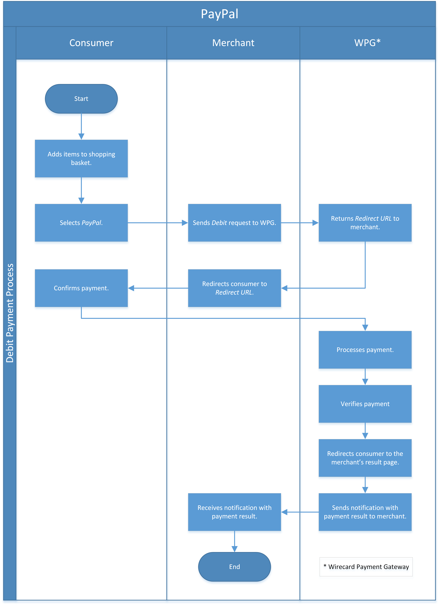
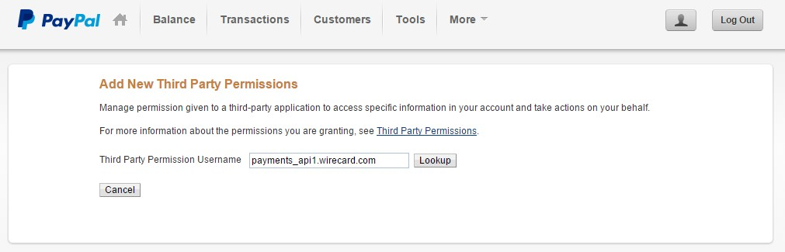
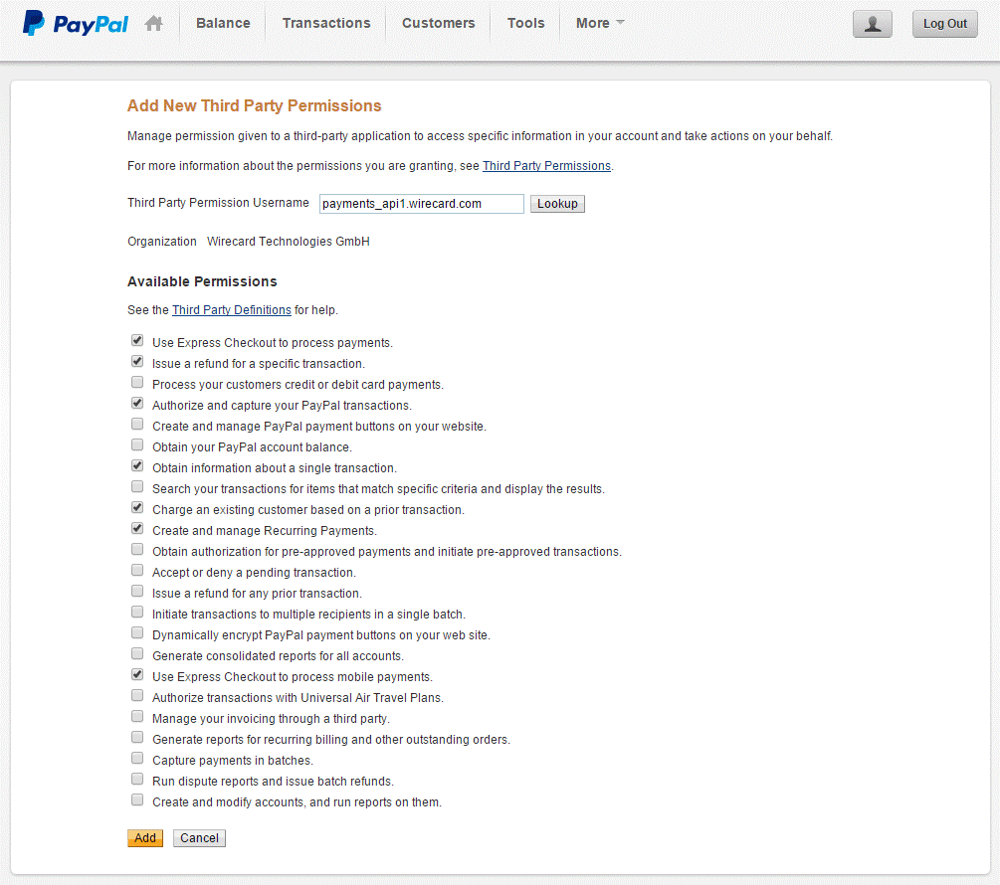
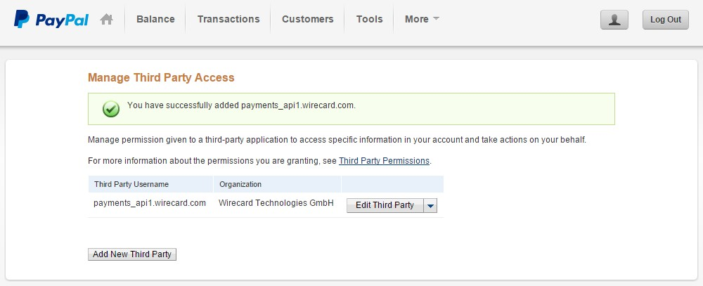
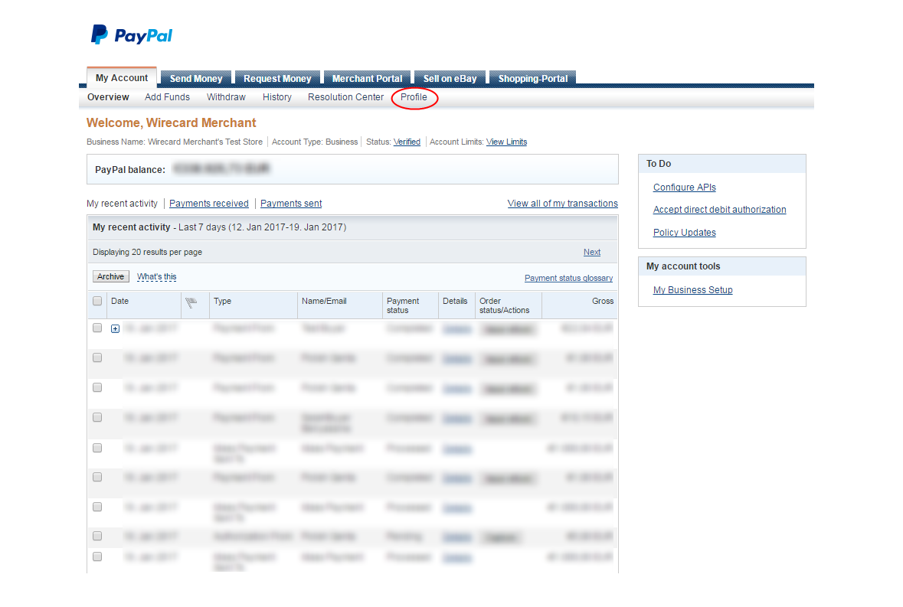
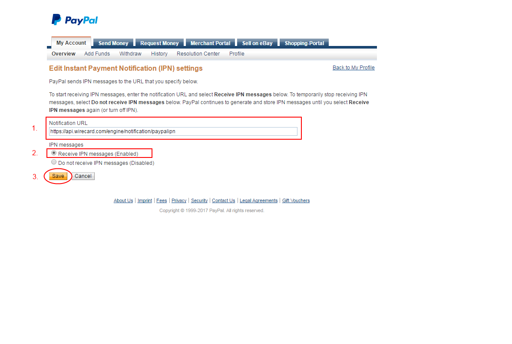

[#API_PaymentMethods_PayPal]
=== PayPal

[#API_PayPal_Introduction]
==== Introduction
[.clearfix]
--
[.right]
image::images/11-24-paypal/PayPal_logo.png[PayPal Logo, width=200]

_PayPal_ is a global e-commerce business. _PayPal_ processes its
payments and money transfers through the Internet. _PayPal_ is a wallet
payment method that allows consumers to make and accept payments without
having to share their financial information. It is available in 190
countries worldwide, with more than 100 million active accounts.
_PayPal_ claims an average 18% increase in online sales once merchants
add _PayPal_ payment method to their online stores.
--

_PayPal_ supports debit, authorization and capture, void, refund,
authorization-only and preauthorization transactions. If the debit,
authorization, authorization-only or preauthorization request is
successful, the _Forward-URL_ to the _PayPal_ Express Checkout landing
page will be sent in the response.

Once Wirecard has received a notification from _PayPal_ about the final
status of the transaction, this status will be communicated to the
merchant via the _Notification-URL_ that is configured in the merchant
account. If no _Notification-URL_ is configured in the merchant account
the notification will be sent via email to the merchant in case the
email address has been configured. Usually, this status is received
within seconds of the completion of the transaction, however, it may
take up to a few days.

[#API_PayPal_Express]
===== _PayPal_ Express Checkout

_PayPal_ Express Checkout is a service
that allows consumers to pay using a _PayPal_ account instead of a
credit card. They can make purchases without entering billing, shipping,
and credit card information as all of this information is already stored
with _PayPal_. _PayPal_ expects merchants to provide details about
an order, so that this Information can be shown to a consumer during the
checkout procedure. Also, the consumer is able to change the shipping
address during the checkout in _PayPal_. Therefore the shipping address
together with other payment details are returned to merchant’s web shop
for further processing.

[#API_PayPal_GeneralInformation]
==== General Information

[#API_PayPal_GeneralInformation_PaymentMode]
===== Payment Mode, Countries and Currencies

This table illustrates which payment mode _PayPal_ belongs to. It also
provides detailed information about the countries and currencies which
are relevant for _PayPal_.

.Payment Mode, Countries and Currencies
[%autowidth, cols= "h,"]
|===
|Payment Mode |<<PaymentMethods_PaymentMode_Wallet, Wallet>>
|Countries |Worldwide
|Currencies |USD, EUR, AUD, CAD, CZK, DKK, HKD, HUF, ILS, JPY, MYR,
MXN, NOK, NZD, PHP, PLN, GBP, SGD, SEK, CHF, TWD, THB
|===

[#API_PayPal_GeneralInformation_Communication]
===== Communication Formats

This table illustrates how _PayPal_ notifications are encoded and which
formats and methods can be used for requests and responses.

.Communication Formats
[%autowidth]
|===
.2+h|Requests/Responses | Format | XML
                        | Methods | POST
h|IPN Encodement      2+| Please follow the instructions given at <<GeneralPlatformFeatures_IPN_NotificationExamples,Instant Payment Notification>> to set up IPN.
|===

[#API_PayPal_Transactions]
==== Transactions

[#API_PayPal_Transactions_TransactionTypes]
===== Transaction Types

For <<Glossary_TransactionType, transaction type>> details which are not given here look at <<AppendixB, Appendix B: Transaction Types>>.

.Transaction Types
[%autowidth]
|===
|Transaction Type |Description |Link to the samples

|_capture-authorization_ |only available on a successful _authorization_
which was neither voided nor fully captured yet. Partial and multiple
capture is allowed, until the authorization limit is not exceeded.
|<<API_PayPal_Samples_Workflow_captureauthorization, _capture-authorization_ samples>>

|_authorization_ |an _authorization_ payment request represents an
agreement to pay and places the consumer's funds on hold for up to three
days. You can attempt to capture from day four to day 29 of the
authorization period, but _PayPal_ cannot ensure that 100% of the funds
will be available after the three-day honor period
|<<API_PayPal_Samples_GeneralSamples_authorization, _authorization_ samples>>

|_void-authorization_ |only available on a successful _authorization_
which was neither voided nor captured yet. Authorization is voided as a
whole.
|<<API_PayPal_Samples_voidauthorization, _void-authorization_ sample>>

|_debit_ |debit is an immediate payment for online purchase by
consumer’s _PayPal_ wallet.
|<<API_PayPal_Samples_GeneralSamples_debit, _debit_ samples>>

|_refund-debit_ |available on a successful _debit_. Partial and multiple
refunds are allowed, until the original amount is not exceeded.
|<<API_PayPal_Samples_GeneralSamples_refunddebit, _refund-debit_ samples>>

|_refund-capture_ |available on a successful capture-authorization.
Partial and multiple refunds are allowed, until the original amount is
not exceeded.
|<<API_PayPal_Samples_GeneralSamples_refundcapture, _refund-capture_ samples>>

|_preauthorization_ |the possibility to obtain consumer’s preliminary
payment confirmation (along with shipping details from _PayPal_ for
example).
|<<API_PayPal_Workflow_ConfirmPreauthorization, _preauthorization_ sample>> 

|_authorization-only_ |transaction can be only the first one in the
series, and the amount is always zero.|
<<API_PayPal_Samples_GeneralSamples_authorizationonly, _authorization-only_ samples>>

| __order__ |creating a _PayPal_ order indicates that the consumer has
consented to the purchase but does not place the funds on hold. After
merchant creates an order, they can place multiple authorizations upon
it to place funds on hold until ready to capture. Order cannot be
referenced by debit transaction and cannot be voided. |
<<API_PayPal_Samples_GeneralSamples_order, _order_ samples>>

|_pending-credit_ or _credit_
|moves funds from the merchant to the consumer without referencing
previous payment. |
<<API_PayPal_Samples_GeneralSamples_pendingcredit, _pending-credit_ samples>> or
<<API_PayPal_Samples_GeneralSamples_credit, _credit_ samples>>

|_pending-debit_ |unfinished debit transaction, waiting for the result
of the link:https://developer.paypal.com/docs/classic/express-checkout/integration-guide/ECOtherAPIOps/[_PayPal_ Payment Review] process. After _PayPal_’s review process is finished, a
*debit* transaction will be created as follow up transaction. For
proper functionality, an <<GeneralPlatformFeatures_IPN_Configuration, IPN configuration>> is required in the merchant’s _PayPal_ account. This
transaction type will occur only for transactions in review process and
is not invoked for all transactions automatically. | 
|===

[#API_PayPal_Transactions_Recurring]
===== Recurring Transaction

IMPORTANT: The endpoint for referenced transactions is: ``\https://api.wirecard.com/engine/rest/payments/``.

The _Wirecard Payment Processing Gateway_ allows a merchant to submit
<<GeneralPlatformFeatures_Transactions_Recurring, recurring transactions>>
for _PayPal_ transactions. To submit a recurring transaction, the merchant
must submit a request with the transaction type _Debit_, _Authorization_ or
_Authorization-Only_ including a
<<GeneralPlatformFeatures_Transactions_Recurring_Periodic, PERIODIC TYPE>>
and a <<GeneralPlatformFeatures_Transactions_Recurring_Sequence, SEQUENCE TYPE>> element.
With _PayPal_ it is also possible to mix the transaction types
_Authorization_ and _Debit_.

Read, which <<GeneralPlatformFeatures_Transactions_Recurring_Restrictions, restrictions>>
have to be met to use a recurring transaction.

[#API_PayPal_Transactions_TransactionTypes_PayPalSpecific]
===== _PayPal_-Specific Use of Transaction Types

[#API_PayPal_Transactions_TransactionTypes_PayPalSpecific_preauthorization]
====== _preauthorization_

It is possible to obtain consumer’s preliminary payment confirmation
(along with shipping details from _PayPal_, for example) without
reserving funds on payer’s _PayPal_ account. This can be achieved
using a _preauthorization_ transaction, which have the same parameters
as _authorization_ or _debit_ request. Similarly, the _Forward-URL_ to
the <<API_PayPal_Express, _PayPal_ Express Checkout>> is
delivered in the response, where the consumer needs to confirm the
payment. In order to finalize the payment, a regular _authorization_ or
_debit_ transaction needs to be submitted, referencing the prior
_preauthorization_ transaction using the _Parent-transaction-ID_ field.
The _preauthorization_ does not need to be cancelled, if the merchant
decides not to follow up on this order attempt.

[#API_PayPal_Transactions_TransactionTypes_PayPalSpecific_authorizationOnly]
====== _authorization-only_

On _PayPal_ merchant setup site the option "Use <<API_PayPal_Express, Express Checkout>> to
process payments" must be "true", otherwise it is not possible to create a "get-url" transaction.
_authorization-only_ (records data at _PayPal_ and Wirecard for later
payments/recurring transactions) requires the following: 

- Additional activation of the setting “Obtain authorization for
pre-approved payments and initiate pre-approved transactions.”
- _authorization-only_ transaction needs the following settings:
* address the ``...paymentmethods`` endpoint
.  the <<GeneralPlatformFeatures_Transactions_Recurring_Periodic, periodic type>> part must be either "recurring" or "installment"
.  the <<GeneralPlatformFeatures_Transactions_Recurring_Sequence, sequence type>> must be "first".
* amount = "0.00"
- In addition the merchant can reference "Authorization-only" by either
debit or authorization. A Follow-up authorization can be then be
captured.
* address the ``…/payments`` endpoint for the follow-up debit
* always use non-zero amount for debit operation
* the correct (parent-)transaction-id is visible as
group-transaction-id in WEP for example or can be found out by querying
{payment-gateway} using the RequestID from the initial
transaction (see
<<GeneralPlatformFeatures_RetrieveTransaction_RequestID, here>>).
//-

[#API_PayPal_Transactions_TransactionTypes_PayPalSpecific_credit]
====== _credit_

_credit_ transaction moves funds from the merchant to the consumer
without referencing previous payment. It's a fast and convenient way to
send commissions, rebates, rewards, and general payments.

_PayPal_ takes the payment amounts from your account and attempts to put
them into the recipients' _PayPal_ account. If the recipients do not
have _PayPal_ accounts, _PayPal_ notifies them that a payment is
available and they must create a _PayPal_ account to receive the
payment. _PayPal_ will temporarily hold the total monetary value of the
mass payment, plus associated fees, until processing is completed. If a
payment is sent to a recipient who does not have a _PayPal_ account, and
it remains unclaimed for 30 days from the payment date, the money is
returned to your _PayPal_ account.

Every recipient receives an email notifying them of the payment.
Recipients with a _PayPal_ click a link in the email message, log in to
their account, and access their payments. If the recipients do not have
a _PayPal_ account, their email message contains a link that directs
them to a _PayPal_ sign-up page. The sign-up process automatically
confirms their email address. When they complete the sign-up process,
the money is available in their new _PayPal_ account. Customers will
then have the option to make online purchases with their money, withdraw
it to a bank account, have a check mailed to them, or request for
_PayPal_ to send them a debit card to access their funds.

Merchant needs to specify one (or multiple) of three fields in the
_pending-credit_ request:

- wallet.account-id (with customer’s _PayPal_ account identifier)
- account-holder.email
- account-holder.phone

The provided information is used in this order to identify the recipient
of the payment. As soon as request is submitted a _pending-credit_
transaction is created in the database. Once Wirecard has received a
notification from _PayPal_ about the final status, a follow-up _credit_
transaction is created, and this status will be communicated to the
merchant via the _Notification-URL_ that is configured in the merchant
account. If no _Notification-URL_ is configured in the merchant account
the notification will be sent via email to the merchant in case the
email address has been configured.

_credit_ transaction is provided over so-called “Mass Payments“ service,
so merchant should contact _PayPal_ Customer Support to enable Mass
Payments for their _PayPal_ premier or business accounts.

[#API_PayPal_Transactions_TransactionTypes_PayPalSpecific_order]
====== _order_

Creating a _PayPal order_ indicates that the buyer has consented to the
purchase but does not place the funds on hold. After merchant creates an
_order_, they can place multiple authorizations upon it to place funds
on hold until ready to _capture_.

Merchants often use this technique to accept orders for items that are
not available for shipment when the order is placed. For example, when a
merchant ships items from multiple distribution centers and needs
separate _authorizations_ for each shipment. Another example would be
delayed shipping on items that are not in stock.

An _order_ is valid for 29 days. Merchant can make up to 10 referencing
_authorizations_ for each order. _order_ cannot be referenced by _debit_
transaction and cannot be voided.

_order_ request has the same fields as _authorization_ or _debit_
transactions. Similarly, the _Forward-URL_ to the
<<API_PayPal_Express, _PayPal_ Express Checkout>> is delivered in
the response, where the consumer needs to confirm the payment. In order
to finalize the payment, a regular _authorization_ transaction needs to
be submitted, referencing the prior _order_ transaction using the
Parent-Transaction-ID field.

[#PayPal_TestCredentials]
==== Test Credentials

.Test Credentials
[%autowidth]
|===
.2+h|URL(s) Endpoints | The transaction types _debit_, _authorization_, _authorization-only_,
_preauthorization_, _pending-credit_, _credit_ or _order_ use 2+| ``\https://{test-instance-hostname}/engine/rest/paymentmethods/``
| The transaction types _capture-authorization_, _refund-capture_,
_void-authorization_ and _refund-debit_ use
2+| ``\https://{test-instance-hostname}/engine/rest/payments/``
.3+h|Merchant Account ID (MAID)
|Show No Address |be17476f-1a0c-442e-8841-70e33996c0aa
.3+|<<API_PayPal_Configuration_Addresses, See details>>
|Show Address |8695f3e4-76e8-414b-96cd-a1e5dafcf20c
|Edit Address |ecfec3fa-87a2-41bb-86e9-4e738b89c91a

h|Username 3+|16390-testing
h|Password 3+|3!3013=D3fD8X7
.3+h|Secret Key
|Show No Address | 3d5b74ed-c716-486c-91a5-188b3ffd9862
.3+|<<API_PayPal_Configuration_Addresses, See details>>
|Show Address | 227dd634-1226-42a8-a598-83e8988e45d9
|Edit Address | ef3407c9-2c24-4a68-b290-1051f88c1af7
|===

[#API_PayPal_TestCredentials_Additional]
===== Additional Test Credentials on _PayPal_ Environment

.Additional Test Credentials
[%autowidth, cols="h,"]
|===
|Email |``\paypal.buyer2@wirecard.com``
|Password |Wirecardbuyer
|===

[#API_PayPal_Workflow]
==== Workflow

NOTE: The consumer has three hours to finish his payment, because the
<<GeneralPlatformFeatures_RedirectURL, _Redirect URL_>> expires after three hours. A query for an unfinished transaction,
that has exceeded this time span will return a _Failed_ transaction.

[#API_PayPal_Workflow_debit]
===== _debit_

See <<API_PayPal_Samples_GeneralSamples_debit, _debit_ samples>> for details.

._debit_ workflow with _PayPal_

.  Consumer initiates payment.
.  Merchant sends _debit_ request to WPG.
.  {payment-gateway-abbr} sends a response to merchant containing the redirect URL to
_PayPal_.
.  Merchant takes URL from response.
.  Merchant redirects consumer to this URL (URL can be found in parameter <``payment-method url="URL" name="paypal"/``>).
.  Consumer confirms payment on _PayPal_ site.
.  {payment-gateway-abbr} redirects consumer back to merchant’s system URL based on
payment result (success_url, cancel_url, failed_url <- defined in MAID
configuration or in first request).
.  {payment-gateway-abbr} sends IPN to merchant’s system after payment is verified (usually
few seconds).
//-

[#API_PayPal_Workflow_refundDebit]
===== refund-debit or refund-capture

See <<API_PayPal_Samples_GeneralSamples_refunddebit, _refund-debit_ samples>>
for details.

._refund-debit_ workflow with _PayPal_
image::images/11-24-paypal/PaypalWorkflow_refundDebit.png[refund-debit Workflow]

.  Merchant sends _refund_ request to WPG
..  It depends on the corresponding transaction, whether merchant sends
a _refund-debit_ or _refund-capture_ request.
..  The request must contain the <``transaction-id``> of the transaction to
be refunded. The <``transaction-id``> of this corresponding transaction must
be placed in the <``parent-transaction-id``> field.
.  The response sent back to merchant will contain result of
transaction (success or failed).
.  IPN is sent to merchant’s system with transaction result as
well.
//-

[#API_PayPal_Workflow_credit]
===== _credit_

See <<API_PayPal_Samples_GeneralSamples_credit, _credit_ samples>> for details.

._credit_ workflow with _PayPal_
image::images/11-24-paypal/PaypalWorkflow_credit.png[credit workflow,height=250]

.  Merchant sends _pending-credit_ request to WPG.
.  {payment-gateway-abbr} processes the transaction.
.  {payment-gateway-abbr} sends response containing the transaction result back to
merchant.
.  {payment-gateway-abbr} sends an IPN to merchant with final transaction status.
//-

[#API_PayPal_Workflow_authorization]
===== _authorization_ and _capture-authorization_

See <<API_PayPal_Workflow_AuthorizationCaptureRefundCapture, _authorization_ and _capture-authorization_ samples>> for details.

._authorization_ and _capture-authorization_ workflow with _PayPal_
image::images/11-24-paypal/PaypalWorkflow_AuthorizationCapture.png[authorization and capture-authorization workflow]

The merchant does an _authorization_ for a specific amount, the consumer
needs to accept this authorization and then the merchant can submit a
_capture_ anytime to capture the requested amount.

.  _authorization_
..  Merchant sends _authorization_ request to WPG.
..  {payment-gateway-abbr} responds with the redirect URL to __PayPal__.
..  Merchant takes URL from response and redirects consumer to this URL
(URL is in field
<``payment-method url="http://www.paypal.com/?token=EC-MOCK-9N3XB7G4P9PR%22 name="paypal"/``>)
..  Consumer authorizes payment on _PayPal_ site
..  {payment-gateway-abbr} redirects consumer back to merchant’s system. The URL depends on
payment result (success_url, cancel_url, failed_url, which is defined
either in the MAID configuration or in the first request of this payment
process).
.  _capture-authorization_
..  Merchant submits a _capture_ request. The request contains the
_Transaction-ID_ from the preceding successful authorization
transaction. The _Transaction-ID_ is forwarded in field
__Parent-Transaction-ID__.
..  {payment-gateway-abbr} sends the response with the final transaction status to the
merchant (the endpoint is defined via _Redirect URL_).
..  The merchant also receives an IPN.
//-

[#API_PayPal_Workflow_order]
===== _order_ and _authorization_ and _capture_

See <<API_PayPal_Workflow_OrderAuthorizationCapture, _order_, _authorization_ and _capture-authorization_ samples>>
for details.

._order_, _authorization_ and _capture-authorization_ workflow with _PayPal_
image::images/11-24-paypal/PaypalWorkflow_OrderAuthorizationCapture.png[order, authorization and capture-authorization workflow,height=250]
  

.  _order_
..  Merchant sends an _order_ request.
..  {payment-gateway-abbr} sends a response containing the _Redirect URL_.
..  Merchant takes URL from this response and redirects consumer to this
URL (URL is in field
<payment-method url="http://www.paypal.com/?token=EC-MOCK-9N3XB7G4P9PR%22 name="paypal"/>)
..  Consumer authorizes his order on _PayPal_'s site.
..  Merchant redirects consumer back to merchant’s system. The URL
depends on payment result (success_url, cancel_url, failed_url <-
defined in MAID configuration or in first request)
..  {payment-gateway-abbr} sends a notification to the merchant's endpoint specified in
request or in merchant <<API_PayPal_Configuration_PayPalAccount, account configuration>>.
The notification contains the *Transaction ID*, which is needed for
further process.
.  _authorization_
..  Merchant submits an _authorization_ request. The request *contains
the _Transaction-ID_ from the preceding successful _order_* transaction.
The _Transaction-ID_ is forwarded in field _Parent-Transaction-ID_.
..  {payment-gateway-abbr} sends a response to the merchant. The response contains the
Authorization's _Transaction-ID_, to be used for further capture
processes.
.  _capture-authorization_
..  Merchant submits an _authorization-capture_ request (The
_Parent-Transaction-ID_ in this request *must contain the
_Transaction-ID_ from the preceding _authorization_* of this payment
process).
..  {payment-gateway-abbr} sends an _authorization-capture_ response to the merchant.
//-

[#API_PayPal_Fields]
==== Fields

The following elements are mandatory (M), optional (O) or conditional
(C) for sending a request/response for the Payment Method _Paypal._

._PayPal_ Fields
[%autowidth]
|===
|Field |Request |Response |Notification |Data Type |Size |Description

7+a|
[#API_PayPal_Fields_Payment]
===== Payment
|merchant-account-id |M |M |M |String |36 |Unique identifier for a merchant account.
|request-id |M |M |M |150 |String |This is the identification number of the request. It has to be unique for each request.
|transaction-type |M |M |M |30 |String |This is the type for a transaction. For Paypal only DEBIT is allowed in the initial request.
|requested-amount |M |M |M |9,2 |Decimal |This is the amount of the transaction. The amount of the decimal place is dependent of the currency.
|parent-transaction-id |C |C |C |36 |String |Transaction ID of the first transaction of a payment. For an individual payment parent-transaction-id is not necessary. If the process is recurring, parent-transaction-id is mandatory in the recurring and final transaction.
|ip-address |O |O |O |String |15 |The global (internet) IP address of the consumer's computer.
|order-number |O |O |O |String |64 |This is the order number of the merchant.
|order-detail |O |O |O |String |65535 |This is a field for details of an order filled by the merchant.
|descriptor |O |O |O |String |27 |Description on the settlement of the account holder’s account about a transaction. The following characters are allowed: ``umlaut, - '0-9','a-z','A-Z',' ' , '+',',','-','.'``
|transaction-id | |M |M |String |36 |The Transaction ID is the unique identifier for a transaction. It is generated by Wirecard.
|transaction-type |M |M |M |String |30 |This is the type for a transaction. For Paypal only DEBIT is allowed in the initial request.
|transaction-state | | M | M |String |12 |This is the status of a transaction
|completion-time-stamp | |M |M |dateTime | |This is the timestamp of completion of request.
|api-id | | |M |String | |The API id is always returned in the notification. For Skrill it is ``---``
|instrument-country |O |O |O |String |2 |The instrument country contains the information where the consumer belongs to.
|processing-redirect-url |O |O |O |String |256 |The URL to which the consumer will be redirected after he has fulfilled his payment. This is normally a page on the merchant’s website.
|cancel-redirect-url |O |O |O |String |256 |The URL to which the consumer will be re-directed after he has cancelled a payment. This is normally a page on the merchant’s Website.
|success-redirect-url |O |O |O |String |256 |The URL to which the consumer will be re-directed after a successful payment. This is normally a success confirmation page on the merchant’s website.
|signature | | |M |complex | |The signature info, consisting of SignedInfo, SignatureValue and KeyInfo. For details see <<GeneralPlatformFeatures_IPN, IPN>>.
|provider-transaction-reference-id |O |O |M |String |36 |Billing agreement ID from _PayPal_ returned in response (relevant for a recurring transaction).
|risk-reference-id |O |O |O |String |32 |Additional field, which enables PayPal to better detect fraud on consumer-triggered recurring payments.
7+a|
[#API_PayPal_Fields_Payment_accountHolder]
====== account-holder
|account-holder.first-name |O |O |O |String |27 |This is the first name of the consumer. The maximum size of first-name and last-name in combination is 27 characters.
|account-holder.last-name |O |O |O |String |27 |This is the last name of the consumer. The maximum size of first-name and last-name in combination is 27 characters.
|account-holder.email |C |C |C |String |64 |This is the consumer’s Email- Address. It is mandatory if the field wallet-account-id is not sent in the initial request.
|account-holder.gender |O |O |O |String |1 |This is the consumer’s gender.
|account-holder.date-of-birth |O |O |O |Date |0 |This is the consumer’s birth date.
|account-holder.phone |O |O |O |String |32 |This is the phone number of the consumer.
[#API_PayPal_Fields_Payment_AccountHolder_Address]
|account-holder.address.street1 |O |O |O |String |128 |This is the first part of the consumer’s street.
|account-holder.address.street2 |O |O |O |String |128 |This is the second part of the consumer’s street.
|account-holder.address.city |O |O |O |String |32 |This is the consumer’s city.
|account-holder.address.state |O |O |O |String |32 |This is the consumer’s state.
|account-holder.address.country |O |O |O |String |3 |This is the consumer’s country.
|account-holder.address.postal-code |O |O |O |String |16 |This is the consumer’s postal code.
7+a|
[#API_PayPal_Fields_Payment_Shipping]
====== shipping
|shipping.first-name |O |O |O |String |27 |First name of the shipment's recipient.
|shipping.last-name |O |O |O |String |27 |Last name of the shipment's recipient.
|shipping.phone |O |O |O |String |32 |Phone number of the shipment's recipient.
[#API_PayPal_Fields_Payment_Shipping_Address]
|shipping.address.street1 |O |O |O |String |128 |First part of the shipment recipient's street name.
|shipping.address.street2 |O |O |O |String |128 |Second part of the shipment recipient's street name.
|shipping.address.city |O |O |O |String |32 |Name of the shipment recipient's city.
|shipping.address.country |O |O |O |String |3 |Name of the shipment recipient's country. Please use the list of country codes supported by https://developer.paypal.com/docs/classic/api/country_codes/[Paypal]
|shipping.address.state |C |C |C |String |32 |Name of the shipment recipient's state. It is a mandatory field, if the <``shipping.address.country``> country is one of the following:
AR (Argentina)1
BR (Brazil)1
CA (Canada)1
IN (India)
ID (Indonesia)
IT (Italy)1
JP (Japan)1
MX (Mexico)1
TH (Thailand)
US (USA)
Please use the list of state codes supported by Paypal: https://developer.paypal.com/docs/classic/api/state_codes/
1 = For these countries the fields <``shipping.address.postal-code``> and <``shipping.address.state``> are  mandatory.
|shipping.address.postal-code |C |C |C |String |16 |Postal code of the shipment recipient's city. It is a mandatory field, if the shipment recipient's country is provided with a "1" in the field description for <``shipping.address.state``>.
7+a|
[#API_PayPal_Fields_Payment_statuses]
====== statuses
[#API_PayPal_Fields_Payment_statuses_status]
|statuses.status.code | |M |M |String |12 |This is the code of the status of a transaction. It can be any of <<StatusCodes, those>>.
|statuses.status.description | |M |M |String |256 |This is the description to the status code of a transaction.
|statuses.status.severity | |M |M |String |20 |This field gives information if a status is a warning, an error or an information.
7+a|
[#API_PayPal_Fields_Payment_notifications]
====== notifications
|notifications.notification@url |O |O |O |String |256 |The URL to be used for the Instant Payment Notification. It overwrites the notification URL that is set up in the merchant configuration.
7+a|
[#API_PayPal_Fields_Payment_customfields]
====== custom-fields
|custom-field.paypal-address-status |O |O |O |String |256 |This is the status of the PayPal address check. Note that this field must be explicitly enabled by <<ContactUs, {payment-provider-name} Merchant Support>>.
|custom-field.paypal-protection-eligibility |O |O |O |String |256 |This is the status of the PayPal Seller Protection offered to merchants to protect them from chargebacks, reversals, etc. Note that this field must be explicitly enabled by <<ContactUs, {payment-provider-name} Merchant Support>>.
7+a|
[#API_PayPal_Fields_Payment_paymentmethods]
====== payment-methods
|payment-methods.payment-method-Name |M |M |M |String |15 |This is the name of the payment method that is chosen from the consumer.
7+a|
[#API_PayPal_Fields_Payment_wallet]
====== wallet
|wallet.account-id |C |C |C |String |50 |The unique identifier of the Account Holder's Wallet Account. It is mandatory if the field ``account-holder.email`` is not sent in the initial request.
7+a|
[#API_PayPal_Fields_Payment_periodic]
====== periodic
|periodic.periodic-type |M |M |M |String |9 |Indicates how and why a Payment occurs more than once. Only two possible values: ``recurring`` or ``installment``
|periodic.sequence-type |M |M |M |String |9 |Indicates the sequence of the recurring transaction. Possible values: ``first``, ``recurring`` or ``final``

|===

[#API_PayPal_Configuration]
==== Configuration

[#API_PayPal_Configuration_PayPalAccount]
===== _PayPal_ Account Configuration

[#API_PayPal_Configuration_PayPalAccount_Granting]
====== Granting 3rd Party Permission

In order to submit payments on the merchant’s behalf, merchant needs to
grant 3^rd^ party API permission to Wirecard on _PayPal_ website.

. Navigate to _Account settings_ → _My selling tools_ → _API Access_
and select the link _Grant API permission_.
+
image::images/11-24-paypal/Granting_3rdParty_APIAccess.jpg[Paypal 3rdparty APIaccess]
+
. In the textfield _Third Party Permission Username_  enter
``\payments_api1.wirecard.com`` and click _Lookup_.
+

+
. Select from the list of _Available Permissions_ the following
items:
- Use Express Checkout to process payments.
- Issue a refund for a specific transaction.
- Authorize and capture your _PayPal_ transactions.
- Obtain information about a single transaction.
- Charge an existing customer based on a prior transaction.
- Create and manage Recurring Payments.
- Use Express Checkout to process mobile payments.
- Click _Add_.
+

+
. Check that the permissions were added successfully.
+

+
. Finally, the merchant’s _PayPal_ registration e-mail address
must be communicated to Wirecard to submit payments.
. Click _Add new Third Party_ to confirm your settings.
//-

[#API_PayPal_Configuration_PayPalAccount_IPNConfiguration]
====== IPN Configuration for Wirecard

In order to maintain proper functionality of _PayPal_ transactions, IPN
(<<GeneralPlatformFeatures_IPN_Configuration, Instant Payment Notification>>) has to be enabled and pointed to the Wirecard server on Merchant’s account in _PayPal_.

Please follow these steps:

. Navigate to _My Account_ > _Profile_
+

+
. Switch to section _My Selling tools_, find _Instant payment
notification_ and click _Update_ on right side in the corresponding
row.
+
image::images/11-24-paypal/IPN_PayPal_MySellingTools.png[PayPal Selling Tools]
+
. Click _Edit settings_
+
image::images/11-24-paypal/IPN_PayPal_EditSettings.png[PayPal Edit Settings]
+
. Set Notification URL ``\https://api.wirecard.com/engine/notification/paypalipn`` to Wirecard server as shown on image below.
+

//-

[#API_PayPal_Configuration_Addresses]
==== Addresses

The _{payment-gateway}_ offers three options to configure the
consumer's address:

- Transmitted address is not shown in the wallet, that means, the
address cannot be modified.
- Transmitted address is shown in the wallet AND the consumer can change
it directly in the wallet (changes will be forwarded to shop via
notification).
- Transmitted address is shown in the wallet AND the consumer cannot
change it directly in the wallet. The consumer can change his address
only in the merchant's shop.
//-

The configuration is set by
<<ContactUs, {payment-provider-name} Merchant Support>>.

[#API_PayPal_Features]
==== Features

[#API_PayPal_Features_Basket]
===== Basket Items

Basket item details may be sent along with debit and authorization
requests. The detailed items of the shopping basket will be displayed in
_PayPal_ during the checkout, and later stored as a part of payment
details in _PayPal_. They can also be obtained later from the _{payment-gateway}_ as part of the transaction details.

.Basket Items
[%autowidth]
|===
|Field |Cardinality Req/Resp |Dataype |Size |Description

|order-items.order-item.name |O |Alphanumeric | |Name of the item in the basket.
|order-items.order-item.description |O |Alphanumeric | |Longer item description.
|order-items.order-item.article-number |O |Alphanumeric | |EAN or other article identifier for merchant.
|order-items.order-item.amount |O |Number | |Item’s price per unit.
|order-items.order-item.tax-amount |O |Number | |Item’s tax per unit.
|order-items.order-item.quantity |O |Number | |Total count of items in the order.
|===

[#API_PayPal_Features_Cross]
===== Cross Merchant Account References

The default security setting for all types of reference transactions
using the field payment/parent-transaction-id allows the references only
to the transactions of the same merchant account. However it is possible
to activate cross referencing for a merchant account. With this option
activated a merchant account can reference a transaction of another
merchant account. The only requirement is that the processing user used
for the authentication of the payment request has rights on the merchant
account of the referenced transaction.

NOTE: This merchant configuration parameter affects all transaction types.
Other kinds of reference transactions such as _refund_ or _void_ can use
cross references as well. Once activated it is enabled for all payment
methods configured for a merchant account even though not all payment
providers/acquirers might support it.

_PayPal_ supports cross references natively by configuring a special
shared consumer account which can be used by several merchants.
Therefore the billing agreement ID can also be shared among several
merchants.

NOTE: The cross references must be solely enabled for the
corresponding merchant accounts of the processing user by Wirecard Support team.

The recurring transactions process in cross-reference
mode remains the same.

[#API_PayPal_Features_Provider]
===== Provider Transaction ID

This feature enables a merchant to search for transactions in
the _PayPal_ merchant dashboard directly.

The <``provider-transaction-id``> is returned in every response of an
_ExpressCheckout, Capture, Refund_ and _Referenced Transaction_ and is
also part of the respective notifications.

NOTE: The <``provider-transaction-id``> can be found in <``status``> field and it is
generated for every _PayPal_ transaction.

.<``statuses``>

[source,xml]
----
<statuses>
    <status code="201.0000" description="paypal:The resource was successfully created." severity="information" provider-transaction-id="NMTPYE7FQWYFRGQDJ"/>
</statuses>
----

[#API_PayPal_Features_Seller]
===== Seller Protection & Recurring Payments

_PayPal_ offers a Seller Protection policy for merchants to help guard
from losing money to claims and chargebacks. For details of this policy
see the official _PayPal_ documentation. Terms and conditions for this
feature depend on the operating country. Please refer to your country
specific _PayPal_ Website.

The feature _Seller Protection & Recurring Payments_ is available by
default in the _{payment-gateway}_.

The merchant needs to provide a shipping address only in the initial
payment. For subsequent recurring payments {payment-gateway}
automatically sends the shipping address from the initial payment to
_PayPal_.

NOTE: For recurring payments __{payment-gateway}__ uses the shipping
address which has been received from _PayPal_ during the initial
request.

[#API_PayPal_Features_Cancel]
===== Cancel handling

_PayPal_ offers payment cancelation. After clicking on Cancel button,
consumer is redirected to merchant's cancel redirect URL and if merchant
has cancelation enabled, a _failed transaction_ will be created.
The response will contain the status 500.1108
``Transaction was cancelled/aborted. Please try again later.``

image::images/11-24-paypal/PayPal_CancelHandling.png[PayPal Cancel Handling]

[#API_PayPal_Samples]
==== Samples

[#API_PayPal_Samples_GeneralSamples]
===== General Samples 

[#API_PayPal_Samples_GeneralSamples_authorization]
====== _authorization_

._preauthorization_ Request (Successful)

[source,xml]
----
<?xml version="1.0" encoding="utf-8" standalone="yes"?>
<payment xmlns="http://www.elastic-payments.com/schema/payment">
    <merchant-account-id>be17476f-1a0c-442e-8841-70e33996c0aa</merchant-account-id>
    <request-id>${unique for each request}</request-id>
    <transaction-type>preauthorization</transaction-type>
    <requested-amount currency="EUR">6.66</requested-amount>
    <account-holder>
        <first-name>Manon</first-name>
        <last-name>Mertens</last-name>
        <email>m.mertens@example.com</email>
    </account-holder>
    <shipping>
        <first-name>Paul</first-name>
        <last-name>Peterson</last-name>
        <phone>+1 773-945-6175</phone>
        <address>
            <street1>978C Golf Street</street1>
            <city>Round Lake</city>
            <state>IL</state>
            <postal-code>60073</postal-code>
        </address>
    </shipping>
    <order-number>180403092713285</order-number>
    <descriptor>customerStatement 18009998888</descriptor>
    <payment-methods>
        <payment-method name="paypal" />
    </payment-methods>
     <cancel-redirect-url>https://{pp-redirect-url-cancel}</cancel-redirect-url>
     <success-redirect-url>https://{pp-redirect-url-success}</success-redirect-url>
</payment>
----

._preauthorization_ Response (Successful)

[source,xml]
----
<?xml version="1.0" encoding="utf-8" standalone="yes"?>
<payment xmlns="http://www.elastic-payments.com/schema/payment" xmlns:ns2="http://www.elastic-payments.com/schema/epa/transaction">
 <merchant-account-id>be17476f-1a0c-442e-8841-70e33996c0aa</merchant-account-id>
 <transaction-id>1e35fd5e-e820-43f1-b7d4-813f6ec5d913</transaction-id>
 <request-id>9d4d7ffa-05ed-4fb7-bbc3-e54c119cd3e3</request-id>
 <transaction-type>preauthorization</transaction-type>
 <transaction-state>success</transaction-state>
 <completion-time-stamp>2018-04-11T08:37:39.000Z</completion-time-stamp>
 <statuses>
  <status code="201.0000" description="The resource was successfully created." severity="information" />
 </statuses>
 <requested-amount currency="EUR">6.66</requested-amount>
 <account-holder>
  <first-name>Manon</first-name>
  <last-name>Mertens</last-name>
  <email>m.mertens@example.com</email>
 </account-holder>
 <shipping>
  <first-name>Paul</first-name>
  <last-name>Peterson</last-name>
  <phone>+1 773-945-6175</phone>
  <address>
   <street1>978C Golf Street</street1>
   <city>Round Lake</city>
   <state>IL</state>
   <postal-code>60073</postal-code>
  </address>
 </shipping>
 <order-number>180411103738025</order-number>
 <descriptor>customerStatement 18009998888</descriptor>
 <payment-methods>
  <payment-method url="https://www.sandbox.paypal.com/cgi-bin/webscr?cmd=_express-checkout&amp;useraction=commit&amp;token=EC-64D234765W077901M" name="paypal" />
 </payment-methods>
  <cancel-redirect-url>https://{pp-redirect-url-cancel}</cancel-redirect-url>
  <success-redirect-url>https://{pp-redirect-url-success}</success-redirect-url>
</payment>
----

._preauthorization_ Notification (Successful)

[source,xml]
----
<?xml version="1.0" encoding="UTF-8"?>
<payment xmlns="http://www.elastic-payments.com/schema/payment" xmlns:ns2="http://www.elastic-payments.com/schema/epa/transaction">
 <merchant-account-id>be17476f-1a0c-442e-8841-70e33996c0aa</merchant-account-id>
 <transaction-id>b5e0e78f-d9ef-417a-8d1e-ee0913c4c905</transaction-id>
 <request-id>9d4d7ffa-05ed-4fb7-bbc3-e54c119cd3e3</request-id>
 <transaction-type>preauthorization</transaction-type>
 <transaction-state>success</transaction-state>
 <completion-time-stamp>2018-04-11T08:39:38.000Z</completion-time-stamp>
 <statuses>
  <status code="201.0000" description="paypal:The resource was successfully created." severity="information"/>
 </statuses>
 <requested-amount currency="EUR">6.660000</requested-amount>
 <parent-transaction-id>1e35fd5e-e820-43f1-b7d4-813f6ec5d913</parent-transaction-id>
 <account-holder>
  <first-name>Manon</first-name>
  <last-name>Mertens</last-name>
  <email>m.mertens@example.com</email>
 </account-holder>
 <shipping>
  <first-name>Paul</first-name>
  <last-name>Peterson</last-name>
  <phone>+1 773-945-6175</phone>
  <address>
   <street1>978C Golf Street</street1>
   <city>Round Lake</city>
   <state>IL</state>
   <postal-code>60073</postal-code>
  </address>
 </shipping>
 <order-number>180411103738025</order-number>
 <descriptor>customerStatement 18009998888</descriptor>
 <custom-fields/>
 <payment-methods>
  <payment-method name="paypal"/>
 </payment-methods>
 <api-id>---</api-id>
 <cancel-redirect-url>https://{pp-redirect-url-cancel}</cancel-redirect-url>
 <success-redirect-url>https://{pp-redirect-url-success}</success-redirect-url>
 <wallet>
  <account-id>ZNKTXUBNSQE2Y</account-id>
 </wallet>
 <Signature xmlns="http://www.w3.org/2000/09/xmldsig#">
  <SignedInfo>
   <CanonicalizationMethod Algorithm="http://www.w3.org/TR/2001/REC-xml-c14n-20010315"/>
   <SignatureMethod Algorithm="http://www.w3.org/2001/04/xmldsig-more#rsa-sha256"/>
   <Reference URI="">
    <Transforms>
     <Transform Algorithm="http://www.w3.org/2000/09/xmldsig#enveloped-signature"/>
    </Transforms>
    <DigestMethod Algorithm="http://www.w3.org/2001/04/xmlenc#sha256"/>
    <DigestValue>3yuZnp63BGKrAUAeLbfDX+1nca234qo9t7xIx0OFw/M=</DigestValue>
   </Reference>
  </SignedInfo>
  <SignatureValue>YfrMGpnwcNqHmndRXsQ+ZYUlzW4wliV7bM9QTwXloX1dVEYbEo7oPFZxuKbBKaQKweBKgDSjuXcl3isCvJCqzMUtMdPP+622iPagQ/7kzwVxcLiWo6HKvawVRgRnInEPphLDOzz6dDZAnt1IznSa3usQ30kljMuusHNryLQ9+YaG/GI34Bo/h+gOE+PJ12k2RUFdnEptHcuKkVtYkB07IxAv1eoK8imBjGQRuo7Cn8A00faQYvx2VPFeF1kD1Jval4DLkQQZSpbWtenq1PxioQ96DNIOJDu3TaQ6ko86ad0dxMEnq42rsL5i8zISNlbrNbbhufLIiG5ObVKPc2UKuWf/Rj5j2ZyeXaVBLLeJQ98vW0LKYQ/5aqk883LOSNuNgWDLq62Ap/6m2I1HboSRLqFyGXAdNcaeMX8LlYnFnZR5cqkmLaLCo+rqjtO5hU48L++N5Qerl3xnk856rNmvqWvQ/nu+mtwkafZMQO66+RwJD4lcF/mO8tm6KVOhlUX6UFe5mvs/JsPCoQRWfPPknEWNf20czDYj+bjPW2joTsuu6g9KPWI6+O4V9qW+HVrabKW7iPf/Jh8lbZwo3upJbTTZiZPmu2IAQPDVBVHAmBuNIlnn6wyy+7JesqkcpfHzC72CPC7yvsTGgc5xAxDnDxG4hFHEVPXI/uowygV57hE=</SignatureValue>
  <KeyInfo>
   <X509Data>
    <X509SubjectName>L=Ascheim,2.5.4.4=#130642617965726e,CN={test-instance-hostname},OU=Operations,O=Wirecard Technologies GmbH,C=DE</X509SubjectName>
    <X509Certificate>MIIF5DCCBMygAwIBAgICLHQwDQYJKoZIhvcNAQELBQAwWzELMAkGA1UEBhMCREUxETAPBgNVBAoTCFdpcmVjYXJkMTkwNwYDVQQDFDB3aXJlY2FyZC1EUS1NVUMtaW50ZXJuYWwtd2Vic2VydmljZS1pc3N1aW5nQ0FfMDIwHhcNMTcwMTEyMTM1OTI2WhcNMTkwMTEyMTM1OTI2WjCBijELMAkGA1UEBhMCREUxIzAhBgNVBAoTGldpcmVjYXJkIFRlY2hub2xvZ2llcyBHbWJIMRMwEQYDVQQLEwpPcGVyYXRpb25zMR4wHAYDVQQDExVhcGktdGVzdC53aXJlY2FyZC5jb20xDzANBgNVBAQTBkJheWVybjEQMA4GA1UEBxMHQXNjaGVpbTCCAiIwDQYJKoZIhvcNAQEBBQADggIPADCCAgoCggIBAKSkExBY8FjRcZdrxOuJF+HZY8+McQaOB8B0E/hTUhoclsF4OJNaMThje7R6w6OYWBMKpssGngHFaZv35rCo5XVUpJmjZa04ytxE72GKO/uP4yIR7ZBXZx42B22MFaJJZTgPRCCFd6jrz906BZ//CmEAmk5gKelfPxfWJgGyTX6xz7I9R/G57E1xNOuEihN0ma5Q2IhD71MPVseFIGazyfGbJD6rYYbeBbOQSGk//TL8sdRCn0BLcm4DH5oqcPxDKzkaBP4ohNkCWsxpLLSyV6Wx0ihT0S1OLVNkEeTvcrYgUk124VyGatwWNUuCBYyOGQSOGqrW8IHmrhjzzT0NQog0/m38lpdqw/eWmt39qhODqSfILUk2Dxv1+W0IRKJCKcJrcTbXEQCuHl+XWY+U2AhinIPNRA0KX2oOgC//inwyKWSGWHdQnaake646R1wHqtoEfCtEcfyaeR+IrMr1rCAA3RZ+MH1J5UlUCWcnxPT0kad6dUwe3Qjq3jK4gaFzYU2yVScX5LVZMlWy2NiGCIvngHQmhArESzxMVvz5METZujfax6hfmiLNRWu0Zqs09Mpxy5zk5m/WRi5izb0uBeCfcA6x9pmjMx8M4OGG5RO2HTXSwLYJTKI47VXNsLLOY+nMFmhj/dkLJ5d3zI7EczToPMRHmHG7EqEdAfbb+oUlAgMBAAGjggGAMIIBfDARBgNVHQ4ECgQIS6wVIA0mJ9IwEwYDVR0jBAwwCoAIQ2weFtQ9BQ4wCwYDVR0PBAQDAgTwMIIBQwYDVR0fBIIBOjCCATYwggEyoIIBLqCCASqGgdVsZGFwOi8vd2lyZWNhcmQubGFuL0NOPXdpcmVjYXJkLURRLU1VQy1pbnRlcm5hbC13ZWJzZXJ2aWNlLWlzc3VpbmdDQV8wMixDTj1DRFAsQ049UHVibGljIEtleSBTZXJ2aWNlcyxDTj1TZXJ2aWNlcyxDTj1Db25maWd1cmF0aW9uLGRjPXdpcmVjYXJkLGRjPWxhbj9jZXJ0aWZpY2F0ZVJldm9jYXRpb25MaXN0P2Jhc2U/b2JqZWN0Q2xhc3M9Q1JMRGlzdHJpYnV0aW9uUG9pbnSGUGh0dHA6Ly9jcmwud2lyZWNhcmQubGFuL0NSTF93aXJlY2FyZC1EUS1NVUMtaW50ZXJuYWwtd2Vic2VydmljZS1pc3N1aW5nQ0FfMDIuY3JsMA0GCSqGSIb3DQEBCwUAA4IBAQAmlUoiEFPRsOjGPb7SYiuJLxqTXCvZQeuXiUydF6FQl/zIpR/zSltaZKK86L+1i7t1C89OyTTXBD9FN6EKmlHo/ulsMn9V2B4zK3lT/NUclST98BmCla4Jzm+roeOHTqlPz3gPRJiPsr3wdvM+FSAJ2MRdv3l77mTE3v3hjsVVMmShR3VwwpxCICl3mpMsSaJZLyJdOHwvnpXs1m9kESwPD3DQ3RAQ/OGa0pPxAkHaauog4DhPvr/nBQnWHd2Us5b/ep7LME9hZ8u3hu/Kc6Vk24c5p3WUOiyaTiw+Ym3QDXl1wBSl9DdM94KbmAAQ5D/FUqyQnSc4TpmYvJ+Iavag</X509Certificate>
   </X509Data>
  </KeyInfo>
 </Signature>
</payment>
----

._preauthorization_ Request (Failure)

[source,xml]
----
<?xml version="1.0" encoding="utf-8" standalone="yes"?>
<payment xmlns="http://www.elastic-payments.com/schema/payment">
    <merchant-account-id>be17476f-1a0c-442e-8841-70e33996c0aa</merchant-account-id>
    <request-id>${unique for each request}</request-id>
    <transaction-type>preauthorization</transaction-type>
    <requested-amount currency="EUR">6.66</requested-amount>
    <account-holder>
        <first-name>Manon</first-name>
        <last-name>Mertens</last-name>
        <email>m.mertens@example.com</email>
    </account-holder>
    <shipping>
        <first-name>Paul</first-name>
        <last-name>Peterson</last-name>
        <phone>+1 773-945-6175</phone>
        <address>
            <street1>978C Golf Street</street1>
            <city>Round Lake</city>
            <state>IL</state>
            <postal-code>60073</postal-code>
        </address>
    </shipping>
    <order-number>180403092713285</order-number>
    <descriptor>customerStatement 18009998888</descriptor>
    <payment-methods>
        <payment-method name="paypal" />
    </payment-methods>
     <success-redirect-url>https://{pp-redirect-url-success}</success-redirect-url>
</payment>
----

._preauthorization_ Response (Failure)

[source,xml]
----
<?xml version="1.0" encoding="utf-8" standalone="yes"?>
<payment xmlns="http://www.elastic-payments.com/schema/payment" xmlns:ns2="http://www.elastic-payments.com/schema/epa/transaction">
  <merchant-account-id>be17476f-1a0c-442e-8841-70e33996c0aa</merchant-account-id>
  <transaction-id>4d63630e-dcf4-44f7-961a-21c08b526f32</transaction-id>
  <request-id>14b3aa98-ea4b-45d8-916c-1cba5ede8bbf</request-id>
  <transaction-type>preauthorization</transaction-type>
  <transaction-state>failed</transaction-state>
  <completion-time-stamp>2018-04-12T09:16:06.000Z</completion-time-stamp>
  <statuses>
    <status code="500.1086" description="The acquirer is missing a mandatory field.  Resend with all fields correctly entered.  Please check your input or use different card." severity="error" />
  </statuses>
  <requested-amount currency="EUR">6.66</requested-amount>
  <account-holder>
   <first-name>Manon</first-name>
   <last-name>Mertens</last-name>
   <email>m.mertens@example.com</email>
  </account-holder>
  <shipping>
    <first-name>Paul</first-name>
    <last-name>Peterson</last-name>
    <phone>+1 773-945-6175</phone>
    <address>
      <street1>978C Golf Street</street1>
      <city>Round Lake</city>
      <state>IL</state>
      <postal-code>60073</postal-code>
    </address>
  </shipping>
  <order-number>180412111604744</order-number>
  <descriptor>customerStatement 18009998888</descriptor>
  <payment-methods>
    <payment-method name="paypal" />
  </payment-methods>
  <success-redirect-url>https://{pp-redirect-url-success}</success-redirect-url>
</payment>
----

._authorization_ Request (Successful)

[source,xml]
----
<?xml version="1.0" encoding="utf-8" standalone="yes"?>
<payment xmlns="http://www.elastic-payments.com/schema/payment">
    <merchant-account-id>be17476f-1a0c-442e-8841-70e33996c0aa</merchant-account-id>
    <request-id>${unique for each request}</request-id>
    <transaction-type>authorization</transaction-type>
    <requested-amount currency="EUR">1.53</requested-amount>
    <account-holder>
        <first-name>Manon</first-name>
        <last-name>Mertens</last-name>
        <email>m.mertens@example.com</email>
    </account-holder>
    <shipping>
        <first-name>Paul</first-name>
        <last-name>Peterson</last-name>
        <phone>+1 773-945-6175</phone>
        <address>
            <street1>978C Golf Street</street1>
            <city>Round Lake</city>
            <state>IL</state>
            <postal-code>60073</postal-code>
        </address>
    </shipping>
    <order-number>48090</order-number>
    <descriptor>customerStatement 18009998888</descriptor>
    <payment-methods>
        <payment-method name="paypal" />
    </payment-methods>
    <cancel-redirect-url>https://{pp-redirect-url-cancel}</cancel-redirect-url>
    <success-redirect-url>https://{pp-redirect-url-success}</success-redirect-url>
</payment>
----

NOTE: The URL for redirecting consumer is provided, so they can complete
_authorization_ transaction using <<API_PayPal_Express, PayPal Express Checkout>>.

._authorization_ Response (Successful)

[source,xml]
----
<?xml version="1.0" encoding="utf-8" standalone="yes"?>
<payment xmlns="http://www.elastic-payments.com/schema/payment" xmlns:ns2="http://www.elastic-payments.com/schema/epa/transaction">
 <merchant-account-id>be17476f-1a0c-442e-8841-70e33996c0aa</merchant-account-id>
 <transaction-id>e6f84861-6523-4b46-a770-63f3ee51e3b2</transaction-id>
 <request-id>35d4f120-3a60-4eb8-b014-fae0ddf5189d</request-id>
 <transaction-type>authorization</transaction-type>
 <transaction-state>success</transaction-state>
 <completion-time-stamp>2018-04-11T08:01:27.000Z</completion-time-stamp>
 <statuses>
  <status code="201.0000" description="The resource was successfully created." severity="information" />
 </statuses>
 <requested-amount currency="EUR">1.53</requested-amount>
 <account-holder>
  <first-name>Manon</first-name>
  <last-name>Mertens</last-name>
  <email>m.mertens@example.com</email>
 </account-holder>
 <shipping>
  <first-name>Paul</first-name>
  <last-name>Peterson</last-name>
  <phone>+1 773-945-6175</phone>
  <address>
   <street1>978C Golf Street</street1>
   <city>Round Lake</city>
   <state>IL</state>
   <postal-code>60073</postal-code>
  </address>
 </shipping>
 <order-number>180411100125053</order-number>
 <descriptor>customerStatement 18009998888</descriptor>
 <payment-methods>
  <payment-method url="https://www.sandbox.paypal.com/cgi-bin/webscr?cmd=_express-checkout&amp;useraction=commit&amp;token=EC-7RV03184BR3855228" name="paypal" />
 </payment-methods>
 <cancel-redirect-url>https://{pp-redirect-url-cancel}</cancel-redirect-url>
 <success-redirect-url>https://{pp-redirect-url-success}</success-redirect-url>
</payment>
----
._authorization_ Notification (Successful)

[source, xml]
----
<?xml version="1.0" encoding="UTF-8"?>
<payment xmlns="http://www.elastic-payments.com/schema/payment" xmlns:ns2="http://www.elastic-payments.com/schema/epa/transaction">
 <merchant-account-id>be17476f-1a0c-442e-8841-70e33996c0aa</merchant-account-id>
 <transaction-id>1a8dcffd-ed36-487d-b61f-e2bde485a7ca</transaction-id>
 <request-id>35d4f120-3a60-4eb8-b014-fae0ddf5189d</request-id>
 <transaction-type>authorization</transaction-type>
 <transaction-state>success</transaction-state>
 <completion-time-stamp>2018-04-11T08:02:39.000Z</completion-time-stamp>
 <statuses>
  <status code="201.0000" description="paypal:The resource was successfully created." provider-transaction-id="9R261956479906906" severity="information"/>
 </statuses>
 <requested-amount currency="EUR">1.530000</requested-amount>
 <parent-transaction-id>e6f84861-6523-4b46-a770-63f3ee51e3b2</parent-transaction-id>
 <account-holder>
  <first-name>Manon</first-name>
  <last-name>Mertens</last-name>
  <email>m.mertens@example.com</email>
 </account-holder>
 <shipping>
  <first-name>Paul</first-name>
  <last-name>Peterson</last-name>
  <phone>+1 773-945-6175</phone>
  <address>
   <street1>978C Golf Street</street1>
   <city>Round Lake</city>
   <state>IL</state>
   <postal-code>60073</postal-code>
  </address>
 </shipping>
 <order-number>180411100125053</order-number>
 <descriptor>customerStatement 18009998888</descriptor>
 <custom-fields/>
 <payment-methods>
  <payment-method name="paypal"/>
 </payment-methods>
 <api-id>---</api-id>
 <cancel-redirect-url>https://{pp-redirect-url-cancel}</cancel-redirect-url>
 <success-redirect-url>https://{pp-redirect-url-success}</success-redirect-url>
 <wallet>
  <account-id>ZNKTXUBNSQE2Y</account-id>
 </wallet>
 <Signature xmlns="http://www.w3.org/2000/09/xmldsig#">
  <SignedInfo>
   <CanonicalizationMethod Algorithm="http://www.w3.org/TR/2001/REC-xml-c14n-20010315"/>
   <SignatureMethod Algorithm="http://www.w3.org/2001/04/xmldsig-more#rsa-sha256"/>
   <Reference URI="">
    <Transforms>
     <Transform Algorithm="http://www.w3.org/2000/09/xmldsig#enveloped-signature"/>
    </Transforms>
    <DigestMethod Algorithm="http://www.w3.org/2001/04/xmlenc#sha256"/>
    <DigestValue>xmyY+Ov063aEA0EfjGQ6/aGrO5uluiMh41rCrc5XNZU=</DigestValue>
   </Reference>
  </SignedInfo>
  <SignatureValue>ALnfzX6cu7ET6q2GZe9uTLRoerh1BFGD+x3gqkEDi1fFBcl+KeR88uRrXhYlL492X34wFCXs2dfcHDorJVKPuUFko1tzl+GX7fcsowYgbyGwRjChfdhn08kdvEwdZMNhGifsS360gNXT4xAAcI34iehlp/uxqedt+hoGzp1B5JPwRbHxsH+bkNdP87bAa3VBTbXFms6oRxzxr2IHQTJ1nJCppQksvnHBTLfv5rfvUjyg29TQJvF1TwW1wXRHiU44nSXM5lwMd5xkUsikAAokjxpN/IySiy0ylZ0o7nZavKkyCArQJUvU5BbXh0yC1jcmMwqjj/S75YXMRcYYdt82T9tqdBWul9QGBeRTBOyv+EhbD5g5mM02z5LN5yCjj+YfHn3+IgArnFIlrjYTtrRQZ6c+kknnb1FbSrN69rU3cfcAdxZH1GCm5Z+xQ5MVt3szPYrkk1aGji5CgREWu8iVZzwOX4+2D2Jir9kvt+diLfeRJWL4JbXeT5+pqQwbmPzxyBOf5NYzFO4Av712Gj0FfI3yBhqlmjgmStXYnH7wUD7vVC/rfVWNNWoBGNRSeLDuyr9Ec5XAdvos6KF+e3L4I+8o2VG7pXw3iSpqUWWKJYHdtISOoVPkx0HBkaTwD6HKSIWq4L+9PFwWOxmqn0aJnOniR1i1krPRSJjgc6lsb4U=</SignatureValue>
  <KeyInfo>
   <X509Data>
    <X509SubjectName>L=Ascheim,2.5.4.4=#130642617965726e,CN={test-instance-hostname},OU=Operations,O=Wirecard Technologies GmbH,C=DE</X509SubjectName>
    <X509Certificate>MIIF5DCCBMygAwIBAgICLHQwDQYJKoZIhvcNAQELBQAwWzELMAkGA1UEBhMCREUxETAPBgNVBAoTCFdpcmVjYXJkMTkwNwYDVQQDFDB3aXJlY2FyZC1EUS1NVUMtaW50ZXJuYWwtd2Vic2VydmljZS1pc3N1aW5nQ0FfMDIwHhcNMTcwMTEyMTM1OTI2WhcNMTkwMTEyMTM1OTI2WjCBijELMAkGA1UEBhMCREUxIzAhBgNVBAoTGldpcmVjYXJkIFRlY2hub2xvZ2llcyBHbWJIMRMwEQYDVQQLEwpPcGVyYXRpb25zMR4wHAYDVQQDExVhcGktdGVzdC53aXJlY2FyZC5jb20xDzANBgNVBAQTBkJheWVybjEQMA4GA1UEBxMHQXNjaGVpbTCCAiIwDQYJKoZIhvcNAQEBBQADggIPADCCAgoCggIBAKSkExBY8FjRcZdrxOuJF+HZY8+McQaOB8B0E/hTUhoclsF4OJNaMThje7R6w6OYWBMKpssGngHFaZv35rCo5XVUpJmjZa04ytxE72GKO/uP4yIR7ZBXZx42B22MFaJJZTgPRCCFd6jrz906BZ//CmEAmk5gKelfPxfWJgGyTX6xz7I9R/G57E1xNOuEihN0ma5Q2IhD71MPVseFIGazyfGbJD6rYYbeBbOQSGk//TL8sdRCn0BLcm4DH5oqcPxDKzkaBP4ohNkCWsxpLLSyV6Wx0ihT0S1OLVNkEeTvcrYgUk124VyGatwWNUuCBYyOGQSOGqrW8IHmrhjzzT0NQog0/m38lpdqw/eWmt39qhODqSfILUk2Dxv1+W0IRKJCKcJrcTbXEQCuHl+XWY+U2AhinIPNRA0KX2oOgC//inwyKWSGWHdQnaake646R1wHqtoEfCtEcfyaeR+IrMr1rCAA3RZ+MH1J5UlUCWcnxPT0kad6dUwe3Qjq3jK4gaFzYU2yVScX5LVZMlWy2NiGCIvngHQmhArESzxMVvz5METZujfax6hfmiLNRWu0Zqs09Mpxy5zk5m/WRi5izb0uBeCfcA6x9pmjMx8M4OGG5RO2HTXSwLYJTKI47VXNsLLOY+nMFmhj/dkLJ5d3zI7EczToPMRHmHG7EqEdAfbb+oUlAgMBAAGjggGAMIIBfDARBgNVHQ4ECgQIS6wVIA0mJ9IwEwYDVR0jBAwwCoAIQ2weFtQ9BQ4wCwYDVR0PBAQDAgTwMIIBQwYDVR0fBIIBOjCCATYwggEyoIIBLqCCASqGgdVsZGFwOi8vd2lyZWNhcmQubGFuL0NOPXdpcmVjYXJkLURRLU1VQy1pbnRlcm5hbC13ZWJzZXJ2aWNlLWlzc3VpbmdDQV8wMixDTj1DRFAsQ049UHVibGljIEtleSBTZXJ2aWNlcyxDTj1TZXJ2aWNlcyxDTj1Db25maWd1cmF0aW9uLGRjPXdpcmVjYXJkLGRjPWxhbj9jZXJ0aWZpY2F0ZVJldm9jYXRpb25MaXN0P2Jhc2U/b2JqZWN0Q2xhc3M9Q1JMRGlzdHJpYnV0aW9uUG9pbnSGUGh0dHA6Ly9jcmwud2lyZWNhcmQubGFuL0NSTF93aXJlY2FyZC1EUS1NVUMtaW50ZXJuYWwtd2Vic2VydmljZS1pc3N1aW5nQ0FfMDIuY3JsMA0GCSqGSIb3DQEBCwUAA4IBAQAmlUoiEFPRsOjGPb7SYiuJLxqTXCvZQeuXiUydF6FQl/zIpR/zSltaZKK86L+1i7t1C89OyTTXBD9FN6EKmlHo/ulsMn9V2B4zK3lT/NUclST98BmCla4Jzm+roeOHTqlPz3gPRJiPsr3wdvM+FSAJ2MRdv3l77mTE3v3hjsVVMmShR3VwwpxCICl3mpMsSaJZLyJdOHwvnpXs1m9kESwPD3DQ3RAQ/OGa0pPxAkHaauog4DhPvr/nBQnWHd2Us5b/ep7LME9hZ8u3hu/Kc6Vk24c5p3WUOiyaTiw+Ym3QDXl1wBSl9DdM94KbmAAQ5D/FUqyQnSc4TpmYvJ+Iavag</X509Certificate>
   </X509Data>
  </KeyInfo>
 </Signature>
</payment>
----

NOTE: In case of failure there is no notification sent back
to merchant.

._authorization_ Request (Failure)

[source,xml]
----
<?xml version="1.0" encoding="utf-8" standalone="yes"?>
<payment xmlns="http://www.elastic-payments.com/schema/payment">
    <merchant-account-id>be17476f-1a0c-442e-8841-70e33996c0aa</merchant-account-id>
    <request-id>${unique for each request}</request-id>
    <transaction-type>authorization</transaction-type>
    <requested-amount currency="EUR">0.00</requested-amount>
    <account-holder>
        <first-name>Manon</first-name>
        <last-name>Mertens</last-name>
        <email>m.mertens@example.com</email>
    </account-holder>
    <shipping>
        <first-name>Paul</first-name>
        <last-name>Peterson</last-name>
        <phone>+1 773-945-6175</phone>
        <address>
            <street1>978C Golf Street</street1>
            <city>Round Lake</city>
            <state>IL</state>
            <postal-code>60073</postal-code>
        </address>
    </shipping>
    <order-number>48090</order-number>
    <descriptor>customerStatement 18009998888</descriptor>
    <payment-methods>
        <payment-method name="paypal" />
    </payment-methods>
    <cancel-redirect-url>https://{pp-redirect-url-cancel}</cancel-redirect-url>
    <success-redirect-url>https://{pp-redirect-url-success}</success-redirect-url>
</payment>
----

._authorization_ Response (Failure)

[source,xml]
----
<?xml version="1.0" encoding="utf-8" standalone="yes"?>
<payment xmlns="http://www.elastic-payments.com/schema/payment" xmlns:ns2="http://www.elastic-payments.com/schema/epa/transaction">
 <merchant-account-id>be17476f-1a0c-442e-8841-70e33996c0aa</merchant-account-id>
 <transaction-id>7f26b332-eb32-48fc-8580-6ad162713804</transaction-id>
 <request-id>f997b1dc-c996-431a-a403-bbeab26f873c</request-id>
 <transaction-type>authorization</transaction-type>
 <transaction-state>failed</transaction-state>
 <completion-time-stamp>2018-04-12T09:18:03.000Z</completion-time-stamp>
 <statuses>
  <status code="400.1013" description="The Requested Amount is below the minimum required for this Merchant Account.  Please check your input and try again." severity="error" />
 </statuses>
 <requested-amount currency="EUR">0.00</requested-amount>
 <account-holder>
  <first-name>Manon</first-name>
  <last-name>Mertens</last-name>
  <email>m.mertens@example.com</email>
 </account-holder>
 <shipping>
  <first-name>Paul</first-name>
  <last-name>Peterson</last-name>
  <phone>+1 773-945-6175</phone>
  <address>
   <street1>978C Golf Street</street1>
   <city>Round Lake</city>
   <state>IL</state>
   <postal-code>60073</postal-code>
  </address>
 </shipping>
 <order-number>180412111803918</order-number>
 <descriptor>customerStatement 18009998888</descriptor>
 <payment-methods>
  <payment-method name="paypal" />
 </payment-methods>
 <cancel-redirect-url>https://{pp-redirect-url-cancel}</cancel-redirect-url>
 <success-redirect-url>https://{pp-redirect-url-success}</success-redirect-url>
</payment>
----

.First Recurring _authorization_ Request (Successful)

[source,xml]
----
<?xml version="1.0" encoding="utf-8" standalone="yes"?>
<payment xmlns="http://www.elastic-payments.com/schema/payment">
  <merchant-account-id>be17476f-1a0c-442e-8841-70e33996c0aa</merchant-account-id>
  <request-id>6ffb8f52-11f2-4e08-aa80-8aa9dc37916b</request-id>
  <transaction-type>authorization</transaction-type>
  <api-id>elastic-payment-page</api-id>
  <payment-methods>
    <payment-method name="paypal" />
  </payment-methods>
  <requested-amount currency="EUR">1.23</requested-amount>
  <order-description>test order</order-description>
  <descriptor>customerStatement 18009998888</descriptor>
  <account-holder>
   <first-name>Manon</first-name>
   <last-name>Mertens</last-name>
   <email>m.mertens@example.com</email>
  </account-holder>
  <order-number>180508094608313</order-number>
  <shipping>
    <first-name>Paul</first-name>
    <last-name>Peterson</last-name>
    <phone>+1 773-945-6175</phone>
    <address>
      <street1>978C Golf Street</street1>
      <city>Round Lake</city>
      <state>IL</state>
      <postal-code>60073</postal-code>
    </address>
  </shipping>
  <periodic>
    <periodic-type>recurring</periodic-type>
    <sequence-type>first</sequence-type>
  </periodic>
  <cancel-redirect-url>https://{pp-redirect-url-cancel}</cancel-redirect-url>
  <success-redirect-url>https://{pp-redirect-url-success}</success-redirect-url>
  <fail-redirect-url>https://{pp-redirect-url-error}</fail-redirect-url>
</payment>
----

.First Recurring _authorization_ Response (Successful)

[source,xml]
----
<?xml version="1.0" encoding="utf-8" standalone="yes"?>
<payment xmlns="http://www.elastic-payments.com/schema/payment" xmlns:ns2="http://www.elastic-payments.com/schema/epa/transaction">
  <merchant-account-id>be17476f-1a0c-442e-8841-70e33996c0aa</merchant-account-id>
  <transaction-id>4881e975-da9a-49d9-adc4-83dcdfe58eb7</transaction-id>
  <request-id>6ffb8f52-11f2-4e08-aa80-8aa9dc37916b</request-id>
  <transaction-type>authorization</transaction-type>
  <transaction-state>success</transaction-state>
  <completion-time-stamp>2018-05-08T07:46:10.000Z</completion-time-stamp>
  <statuses>
    <status code="201.0000" description="The resource was successfully created." severity="information" />
  </statuses>
  <requested-amount currency="EUR">1.23</requested-amount>
  <account-holder>
   <first-name>Manon</first-name>
   <last-name>Mertens</last-name>
   <email>m.mertens@example.com</email>
  </account-holder>
  <shipping>
    <first-name>Paul</first-name>
    <last-name>Peterson</last-name>
    <phone>+1 773-945-6175</phone>
    <address>
      <street1>978C Golf Street</street1>
      <city>Round Lake</city>
      <state>IL</state>
      <postal-code>60073</postal-code>
    </address>
  </shipping>
  <order-number>180508094608313</order-number>
  <descriptor>customerStatement 18009998888</descriptor>
  <payment-methods>
    <payment-method url="https://www.sandbox.paypal.com/cgi-bin/webscr?cmd=_express-checkout&amp;useraction=commit&amp;token=EC-1H6400515N708825E" name="paypal" />
  </payment-methods>
  <api-id>elastic-payment-page</api-id>
  <cancel-redirect-url>https://{pp-redirect-url-cancel}</cancel-redirect-url>
  <success-redirect-url>https://{pp-redirect-url-success}</success-redirect-url>
  <fail-redirect-url>https://{pp-redirect-url-error}</fail-redirect-url>
  <periodic>
    <periodic-type>recurring</periodic-type>
    <sequence-type>first</sequence-type>
  </periodic>
</payment>
----

.First Recurring _authorization_ Notification (Successful)

[source,xml]
----
<?xml version="1.0" encoding="UTF-8"?>
<payment xmlns="http://www.elastic-payments.com/schema/payment" xmlns:ns2="http://www.elastic-payments.com/schema/epa/transaction">
 <merchant-account-id>be17476f-1a0c-442e-8841-70e33996c0aa</merchant-account-id>
 <transaction-id>5b6353ba-d80b-4009-813d-1e0678c31f96</transaction-id>
 <request-id>6ffb8f52-11f2-4e08-aa80-8aa9dc37916b</request-id>
 <transaction-type>authorization</transaction-type>
 <transaction-state>success</transaction-state>
 <completion-time-stamp>2018-05-08T07:47:11.000Z</completion-time-stamp>
 <statuses>
  <status code="201.0000" description="paypal:The resource was successfully created." provider-transaction-id="9J762811UB579915V" severity="information"/>
 </statuses>
 <requested-amount currency="EUR">1.230000</requested-amount>
 <parent-transaction-id>4881e975-da9a-49d9-adc4-83dcdfe58eb7</parent-transaction-id>
 <account-holder>
  <first-name>Manon</first-name>
  <last-name>Mertens</last-name>
  <email>m.mertens@example.com</email>
 </account-holder>
 <shipping>
  <phone>+49 7889500667</phone>
  <address>
   <street1>978C Golf Street</street1>
   <city>Round Lake</city>
   <state>IL</state>
   <postal-code>60073</postal-code>
  </address>
 </shipping>
 <order-number>180508094608313</order-number>
 <descriptor>customerStatement 18009998888</descriptor>
 <custom-fields/>
 <payment-methods>
  <payment-method name="paypal"/>
 </payment-methods>
 <api-id>elastic-payment-page</api-id>
 <cancel-redirect-url>https://{pp-redirect-url-cancel}</cancel-redirect-url>
 <success-redirect-url>https://{pp-redirect-url-success}</success-redirect-url>
 <fail-redirect-url>https://{pp-redirect-url-error}</fail-redirect-url>
 <periodic>
  <periodic-type>recurring</periodic-type>
  <sequence-type>first</sequence-type>
 </periodic>
 <wallet>
  <account-id>ZNKTXUBNSQE2Y</account-id>
 </wallet>
 <provider-transaction-reference-id>B-1FM59457C1127222B</provider-transaction-reference-id>
 <Signature xmlns="http://www.w3.org/2000/09/xmldsig#">
  <SignedInfo>
   <CanonicalizationMethod Algorithm="http://www.w3.org/TR/2001/REC-xml-c14n-20010315"/>
   <SignatureMethod Algorithm="http://www.w3.org/2001/04/xmldsig-more#rsa-sha256"/>
   <Reference URI="">
    <Transforms>
     <Transform Algorithm="http://www.w3.org/2000/09/xmldsig#enveloped-signature"/>
    </Transforms>
    <DigestMethod Algorithm="http://www.w3.org/2001/04/xmlenc#sha256"/>
    <DigestValue>Cm7V9I3aGMFHpONVeQkLifXrauyZY3AdP10eoVwALOA=</DigestValue>
   </Reference>
  </SignedInfo>
  <SignatureValue>FtGgA5oCnz0poTpoBvrDd83JBzp5PN7zUhzu5djPFVvk1Lmu2Tsciu6bV441yjl8Ytv1XkFKND9Pw8fZPho9aFaTkQXsg1vwhYJPfRrI2RIFK7qNYUZOkIdgPJolj4qfUhAXfkwFg8D1e1Tk58mpEb6uo6iPlfai9aHBcbnOEU2p4McvT2QsH+bzL4SJJ4gRMtYBJZr2SRZKznry6YeCt5SOQKMmOnVWw3tOdVAxJC4HFtaUV0cjPuuYC1HBgwfxpKiJ7tvo0W2zATh+hySUxGRvZqnwTSR5Lik5FfJF1rw8wyPG/r54sqfh4RJiaLC1aNvIR1sCZw63qTIeiBed2nPdvds/hwfP2N8S9NzYLAK5Kr29HO6dnDU2ISLm9Nx7tSMnrnM3rj/fZTZ+tzdBkJcn+2qg7OjZtrd5+L7YG9MI+aF5JZQGBP+Pex/t3BGBlS0VPwt04ZcS3g+mpoLK1YUGnZQ9mbh8KzqFjzYDg2lx4jHCVxvxUpF1iCAtupXpwhFr/7mB+lGruNKcNvEsuZOLg1Z+L/xN52TIdXKd8Vv8PF/I3LeEslPT9g1AOwtTohTEZI41FgQZxiq4LwYMSA5TW+KqhnuGqYCj6lNWQ3RgXLtGPvFSNiGZrl3MPZAE3NlivDKNa81bsfn4sgJRJEh15fEl5vbj20MWei7jpV4=</SignatureValue>
  <KeyInfo>
   <X509Data>
    <X509SubjectName>L=Ascheim,2.5.4.4=#130642617965726e,CN={test-instance-hostname},OU=Operations,O=Wirecard Technologies GmbH,C=DE</X509SubjectName>
    <X509Certificate>MIIF5DCCBMygAwIBAgICLHQwDQYJKoZIhvcNAQELBQAwWzELMAkGA1UEBhMCREUxETAPBgNVBAoTCFdpcmVjYXJkMTkwNwYDVQQDFDB3aXJlY2FyZC1EUS1NVUMtaW50ZXJuYWwtd2Vic2VydmljZS1pc3N1aW5nQ0FfMDIwHhcNMTcwMTEyMTM1OTI2WhcNMTkwMTEyMTM1OTI2WjCBijELMAkGA1UEBhMCREUxIzAhBgNVBAoTGldpcmVjYXJkIFRlY2hub2xvZ2llcyBHbWJIMRMwEQYDVQQLEwpPcGVyYXRpb25zMR4wHAYDVQQDExVhcGktdGVzdC53aXJlY2FyZC5jb20xDzANBgNVBAQTBkJheWVybjEQMA4GA1UEBxMHQXNjaGVpbTCCAiIwDQYJKoZIhvcNAQEBBQADggIPADCCAgoCggIBAKSkExBY8FjRcZdrxOuJF+HZY8+McQaOB8B0E/hTUhoclsF4OJNaMThje7R6w6OYWBMKpssGngHFaZv35rCo5XVUpJmjZa04ytxE72GKO/uP4yIR7ZBXZx42B22MFaJJZTgPRCCFd6jrz906BZ//CmEAmk5gKelfPxfWJgGyTX6xz7I9R/G57E1xNOuEihN0ma5Q2IhD71MPVseFIGazyfGbJD6rYYbeBbOQSGk//TL8sdRCn0BLcm4DH5oqcPxDKzkaBP4ohNkCWsxpLLSyV6Wx0ihT0S1OLVNkEeTvcrYgUk124VyGatwWNUuCBYyOGQSOGqrW8IHmrhjzzT0NQog0/m38lpdqw/eWmt39qhODqSfILUk2Dxv1+W0IRKJCKcJrcTbXEQCuHl+XWY+U2AhinIPNRA0KX2oOgC//inwyKWSGWHdQnaake646R1wHqtoEfCtEcfyaeR+IrMr1rCAA3RZ+MH1J5UlUCWcnxPT0kad6dUwe3Qjq3jK4gaFzYU2yVScX5LVZMlWy2NiGCIvngHQmhArESzxMVvz5METZujfax6hfmiLNRWu0Zqs09Mpxy5zk5m/WRi5izb0uBeCfcA6x9pmjMx8M4OGG5RO2HTXSwLYJTKI47VXNsLLOY+nMFmhj/dkLJ5d3zI7EczToPMRHmHG7EqEdAfbb+oUlAgMBAAGjggGAMIIBfDARBgNVHQ4ECgQIS6wVIA0mJ9IwEwYDVR0jBAwwCoAIQ2weFtQ9BQ4wCwYDVR0PBAQDAgTwMIIBQwYDVR0fBIIBOjCCATYwggEyoIIBLqCCASqGgdVsZGFwOi8vd2lyZWNhcmQubGFuL0NOPXdpcmVjYXJkLURRLU1VQy1pbnRlcm5hbC13ZWJzZXJ2aWNlLWlzc3VpbmdDQV8wMixDTj1DRFAsQ049UHVibGljIEtleSBTZXJ2aWNlcyxDTj1TZXJ2aWNlcyxDTj1Db25maWd1cmF0aW9uLGRjPXdpcmVjYXJkLGRjPWxhbj9jZXJ0aWZpY2F0ZVJldm9jYXRpb25MaXN0P2Jhc2U/b2JqZWN0Q2xhc3M9Q1JMRGlzdHJpYnV0aW9uUG9pbnSGUGh0dHA6Ly9jcmwud2lyZWNhcmQubGFuL0NSTF93aXJlY2FyZC1EUS1NVUMtaW50ZXJuYWwtd2Vic2VydmljZS1pc3N1aW5nQ0FfMDIuY3JsMA0GCSqGSIb3DQEBCwUAA4IBAQAmlUoiEFPRsOjGPb7SYiuJLxqTXCvZQeuXiUydF6FQl/zIpR/zSltaZKK86L+1i7t1C89OyTTXBD9FN6EKmlHo/ulsMn9V2B4zK3lT/NUclST98BmCla4Jzm+roeOHTqlPz3gPRJiPsr3wdvM+FSAJ2MRdv3l77mTE3v3hjsVVMmShR3VwwpxCICl3mpMsSaJZLyJdOHwvnpXs1m9kESwPD3DQ3RAQ/OGa0pPxAkHaauog4DhPvr/nBQnWHd2Us5b/ep7LME9hZ8u3hu/Kc6Vk24c5p3WUOiyaTiw+Ym3QDXl1wBSl9DdM94KbmAAQ5D/FUqyQnSc4TpmYvJ+Iavag</X509Certificate>
   </X509Data>
  </KeyInfo>
 </Signature>
</payment>
----

.Recurring _authorization_ Request (Failure)

[source,xml]
----
<?xml version="1.0" encoding="utf-8" standalone="yes"?>
<payment xmlns="http://www.elastic-payments.com/schema/payment">
  <merchant-account-id>be17476f-1a0c-442e-8841-70e33996c0aa</merchant-account-id>
  <request-id>3bac15d7-2fc2-42d8-9927-c7075a6dba64</request-id>
  <transaction-type>authorization</transaction-type>
  <api-id>elastic-payment-page</api-id>
  <payment-methods>
    <payment-method name="paypal" />
  </payment-methods>
  <requested-amount currency="EUR">1.23</requested-amount>
  <order-description>test order</order-description>
  <descriptor>customerStatement 18009998888</descriptor>
  <account-holder>
   <first-name>Manon</first-name>
   <last-name>Mertens</last-name>
   <email>m.mertens@example.com</email>
  </account-holder>
  <order-number>180508101124018</order-number>
  <shipping>
    <first-name>Paul</first-name>
    <last-name>Peterson</last-name>
    <phone>+1 773-945-6175</phone>
    <address>
      <street1>978C Golf Street</street1>
      <city>Round Lake</city>
      <state>IL</state>
      <postal-code>60073</postal-code>
    </address>
  </shipping>
  <periodic>
    <periodic-type>recurring</periodic-type>
    <sequence-type>recurring</sequence-type>
  </periodic>
  <cancel-redirect-url>https://{pp-redirect-url-cancel}</cancel-redirect-url>
  <success-redirect-url>https://{pp-redirect-url-success}</success-redirect-url>
  <fail-redirect-url>https://{pp-redirect-url-error}</fail-redirect-url>
</payment>
----

.Recurring _authorization_ Response (Failure)

[source,xml]
----
<?xml version="1.0" encoding="utf-8" standalone="yes"?>
<payment xmlns="http://www.elastic-payments.com/schema/payment" xmlns:ns2="http://www.elastic-payments.com/schema/epa/transaction" self="https://{test-instance-hostname}:443/engine/rest/merchants/be17476f-1a0c-442e-8841-70e33996c0aa/payments/2a421fa1-8233-4e56-9f99-19c434c2f86e">
  <merchant-account-id ref="https://{test-instance-hostname}:443/engine/rest/config/merchants/be17476f-1a0c-442e-8841-70e33996c0aa">be17476f-1a0c-442e-8841-70e33996c0aa</merchant-account-id>
  <transaction-id>2a421fa1-8233-4e56-9f99-19c434c2f86e</transaction-id>
  <request-id>3bac15d7-2fc2-42d8-9927-c7075a6dba64</request-id>
  <transaction-type>authorization</transaction-type>
  <transaction-state>failed</transaction-state>
  <completion-time-stamp>2018-05-08T08:11:26.000Z</completion-time-stamp>
  <statuses>
    <status code="400.1028" description="The Token or Account Number is invalid.  Please check your input and try again" severity="error" />
  </statuses>
  <requested-amount currency="EUR">1.23</requested-amount>
  <account-holder>
   <first-name>Manon</first-name>
   <last-name>Mertens</last-name>
   <email>m.mertens@example.com</email>
  </account-holder>
  <shipping>
    <first-name>Paul</first-name>
    <last-name>Peterson</last-name>
    <phone>+1 773-945-6175</phone>
    <address>
      <street1>978C Golf Street</street1>
      <city>Round Lake</city>
      <state>IL</state>
      <postal-code>60073</postal-code>
    </address>
  </shipping>
  <order-number>180508101124018</order-number>
  <descriptor>customerStatement 18009998888</descriptor>
  <custom-fields>
    <custom-field field-name="elastic-api.card_id" />
  </custom-fields>
  <payment-methods>
    <payment-method name="paypal" />
  </payment-methods>
  <api-id>elastic-api</api-id>
  <cancel-redirect-url>https://{pp-redirect-url-cancel}</cancel-redirect-url>
  <success-redirect-url>https://{pp-redirect-url-success}</success-redirect-url>
  <fail-redirect-url>https://{pp-redirect-url-error}</fail-redirect-url>
  <periodic>
    <periodic-type>recurring</periodic-type>
    <sequence-type>recurring</sequence-type>
  </periodic>
</payment>
----

.Recurring _authorization_ Notification (Failure)

[source,xml]
----
<?xml version="1.0" encoding="UTF-8" standalone="yes"?>
<payment xmlns="http://www.elastic-payments.com/schema/payment" xmlns:ns2="http://www.elastic-payments.com/schema/epa/transaction">
 <merchant-account-id>be17476f-1a0c-442e-8841-70e33996c0aa</merchant-account-id>
 <transaction-id>2a421fa1-8233-4e56-9f99-19c434c2f86e</transaction-id>
 <request-id>3bac15d7-2fc2-42d8-9927-c7075a6dba64</request-id>
 <transaction-type>authorization</transaction-type>
 <transaction-state>failed</transaction-state>
 <completion-time-stamp>2018-05-08T08:11:26.000Z</completion-time-stamp>
 <statuses>
  <status code="400.1028" description="The Token or Account Number is invalid.  Please check your input and try again" severity="error"/>
 </statuses>
 <requested-amount currency="EUR">1.23</requested-amount>
 <account-holder>
  <first-name>Paul</first-name>
  <last-name>Peterson</last-name>
 </account-holder>
 <shipping>
  <first-name>Paul</first-name>
  <last-name>Peterson</last-name>
  <phone>+1 773-945-6175</phone>
  <address>
   <street1>978C Golf Street</street1>
   <city>Round Lake</city>
   <state>IL</state>
   <postal-code>60073</postal-code>
  </address>
 </shipping>
 <order-number>180508101124018</order-number>
 <descriptor>customerStatement 18009998888</descriptor>
 <custom-fields>
  <custom-field field-name="elastic-api.card_id"/>
 </custom-fields>
 <payment-methods>
  <payment-method name="paypal"/>
 </payment-methods>
 <api-id>elastic-api</api-id>
 <cancel-redirect-url>https://{pp-redirect-url-cancel}</cancel-redirect-url>
 <success-redirect-url>https://{pp-redirect-url-success}</success-redirect-url>
 <fail-redirect-url>https://{pp-redirect-url-error}</fail-redirect-url>
 <periodic>
  <periodic-type>recurring</periodic-type>
  <sequence-type>recurring</sequence-type>
 </periodic>
</payment>
----

._authorization-only_ Request (Successful)

[source,xml]
----
<?xml version="1.0" encoding="utf-8"?>
<payment xmlns="http://www.elastic-payments.com/schema/payment">
   <merchant-account-id>be17476f-1a0c-442e-8841-70e33996c0aa</merchant-account-id>
    <request-id>${unique for each request}</request-id>
   <transaction-type>authorization-only</transaction-type>
   <payment-methods>
      <payment-method name="paypal" />
   </payment-methods>
   <requested-amount currency="EUR">0</requested-amount>
   <order-description>test order</order-description>
   <descriptor>customerStatement 18009998822</descriptor>
   <account-holder>
        <first-name>Manon</first-name>
        <last-name>Mertens</last-name>
        <email>m.mertens@example.com</email>
   </account-holder>
   <order-number>180403130946541</order-number>
   <shipping>
      <first-name>Paul</first-name>
      <last-name>Peterson</last-name>
      <phone>+1 773-945-6175</phone>
      <address>
        <street1>123 Lake Streed</street1>
        <city>Round Lake</city>
        <state>IL</state>
        <postal-code>60073</postal-code>
      </address>
   </shipping>
   <periodic>
               <periodic-type>recurring</periodic-type>
               <sequence-type>first</sequence-type>
   </periodic>
  <cancel-redirect-url>https://{pp-redirect-url-cancel}</cancel-redirect-url>
  <success-redirect-url>https://{pp-redirect-url-success}</success-redirect-url>
</payment>
----

._authorization-only_ Response (Successful)

[source,xml]
----
<?xml version="1.0" encoding="utf-8" standalone="yes"?>
<payment xmlns="http://www.elastic-payments.com/schema/payment" xmlns:ns2="http://www.elastic-payments.com/schema/epa/transaction">
 <merchant-account-id>be17476f-1a0c-442e-8841-70e33996c0aa</merchant-account-id>
 <transaction-id>19b8ccad-b564-4384-8086-c4b951ae6abb</transaction-id>
 <request-id>29171b8a-3db7-41dc-8196-3565f38911d2</request-id>
 <transaction-type>authorization-only</transaction-type>
 <transaction-state>success</transaction-state>
 <completion-time-stamp>2018-04-11T10:07:14.000Z</completion-time-stamp>
 <statuses>
  <status code="201.0000" description="The resource was successfully created." severity="information" />
 </statuses>
 <requested-amount currency="EUR">0</requested-amount>
 <account-holder>
  <first-name>Manon</first-name>
  <last-name>Mertens</last-name>
  <email>m.mertens@example.com</email>
 </account-holder>
 <shipping>
  <first-name>Paul</first-name>
  <last-name>Peterson</last-name>
  <phone>+1 773-945-6175</phone>
  <address>
   <street1>123 Lake Streed</street1>
   <city>Round Lake</city>
   <state>IL</state>
   <postal-code>60073</postal-code>
  </address>
 </shipping>
 <order-number>180411120710809</order-number>
 <descriptor>customerStatement 18009998822</descriptor>
 <payment-methods>
  <payment-method url="https://www.sandbox.paypal.com/cgi-bin/webscr?cmd=_express-checkout&amp;useraction=commit&amp;token=EC-0U479917B3642864S" name="paypal" />
 </payment-methods>
 <cancel-redirect-url>https://{pp-redirect-url-cancel}</cancel-redirect-url>
 <success-redirect-url>https://{pp-redirect-url-success}</success-redirect-url>
 <periodic>
  <periodic-type>recurring</periodic-type>
  <sequence-type>first</sequence-type>
 </periodic>
</payment>
----

._authorization-only_ Notification (Successful)

[source, xml]
----
<?xml version="1.0" encoding="UTF-8"?>
<payment xmlns="http://www.elastic-payments.com/schema/payment" xmlns:ns2="http://www.elastic-payments.com/schema/epa/transaction">
 <merchant-account-id>be17476f-1a0c-442e-8841-70e33996c0aa</merchant-account-id>
 <transaction-id>fa21cc0d-a05c-4097-9733-3b94318f4386</transaction-id>
 <request-id>29171b8a-3db7-41dc-8196-3565f38911d2</request-id>
 <transaction-type>authorization-only</transaction-type>
 <transaction-state>success</transaction-state>
 <completion-time-stamp>2018-04-11T10:09:36.000Z</completion-time-stamp>
 <statuses>
  <status code="201.0000" description="paypal:The resource was successfully created." severity="information"/>
 </statuses>
 <requested-amount currency="EUR">0.000000</requested-amount>
 <parent-transaction-id>19b8ccad-b564-4384-8086-c4b951ae6abb</parent-transaction-id>
 <account-holder>
  <first-name>Manon</first-name>
  <last-name>Mertens</last-name>
  <email>m.mertens@example.com</email>
 </account-holder>
 <shipping>
  <first-name>Paul</first-name>
  <last-name>Peterson</last-name>
  <phone>+1 773-945-6175</phone>
  <address>
   <street1>123 Lake Streed</street1>
   <city>Round Lake</city>
   <state>IL</state>
   <postal-code>60073</postal-code>
  </address>
 </shipping>
 <order-number>180411120710809</order-number>
 <descriptor>customerStatement 18009998822</descriptor>
 <custom-fields/>
 <payment-methods>
  <payment-method name="paypal"/>
 </payment-methods>
 <api-id>---</api-id>
 <cancel-redirect-url>https://{pp-redirect-url-cancel}</cancel-redirect-url>
 <success-redirect-url>https://{pp-redirect-url-success}</success-redirect-url>
 <periodic>
  <periodic-type>recurring</periodic-type>
  <sequence-type>first</sequence-type>
 </periodic>
 <wallet>
  <account-id>ZNKTXUBNSQE2Y</account-id>
 </wallet>
 <provider-transaction-reference-id>B-7CE0209221399502E</provider-transaction-reference-id>
 <Signature xmlns="http://www.w3.org/2000/09/xmldsig#">
  <SignedInfo>
   <CanonicalizationMethod Algorithm="http://www.w3.org/TR/2001/REC-xml-c14n-20010315"/>
   <SignatureMethod Algorithm="http://www.w3.org/2001/04/xmldsig-more#rsa-sha256"/>
   <Reference URI="">
    <Transforms>
     <Transform Algorithm="http://www.w3.org/2000/09/xmldsig#enveloped-signature"/>
    </Transforms>
    <DigestMethod Algorithm="http://www.w3.org/2001/04/xmlenc#sha256"/>
    <DigestValue>5aDZ5VK+pPorz6go4aHe2Ei6jSpzIUPih2aUkcDJsnU=</DigestValue>
   </Reference>
  </SignedInfo>
  <SignatureValue>amlM1+g+vEAyHIHOFB7zfKFMAspOUBjFXSm7FewldLf8QGbSIT9h6qE2P41r1h6xsNAcvXLPpVhvR9HniFFRHXMMm5h1KYV2Ua56nrnzjn9XhZrkbUwk/dOX0hAYZVPQlz2CmaNlK/lvDo2emc/JaEL+amYd8WAixvBvDEp+aCZ3bFaE4vV8bWS1DSd7rY9vt+xmn/RhoP/HT8AEIGlynPY/5g5FEDtyGGpkJjiLLiuRUk0+2NDeE4BUidENSPGrYIbkCKK/p4ivGWAjs11BTkdVtHXhPYjgVgkM/Vei6CuKenzPUkT+W2G5oStk7CHYKQsuMw3GEtkOHaR3ezJxUkmXyJstrPMetewVTIj0q+66SXBGo7Wj8GCTC/NKLAMq5Pwnlr+aS5ziJ8N+jAAsvZftyN9tRU1ZH2e3OdKwRNluB8S7WIFVr30PTRhEBYtH8h+tOcCIWPUk4wKv9hqfEC3+VaefcSWO83kg/AXs/y9agL9HXkDmNnzjo85LTg1hpdzmr1z+1KTfN1R3K6BKn5ZligKsu27JGfu+VmLPbTRBGwZcCIsCFWFoLHSior4vJYMd2g+c3SZANgOa6GUIxQCT6CDgy8C+neWaZd8ZB2ExAxby/R58VjeHjhuasnG1ixvrgf4FRVPNCaFPZ8SVpzTJag3fIPQKgCBjNns7X9g=</SignatureValue>
  <KeyInfo>
   <X509Data>
    <X509SubjectName>L=Ascheim,2.5.4.4=#130642617965726e,CN={test-instance-hostname},OU=Operations,O=Wirecard Technologies GmbH,C=DE</X509SubjectName>
    <X509Certificate>MIIF5DCCBMygAwIBAgICLHQwDQYJKoZIhvcNAQELBQAwWzELMAkGA1UEBhMCREUxETAPBgNVBAoTCFdpcmVjYXJkMTkwNwYDVQQDFDB3aXJlY2FyZC1EUS1NVUMtaW50ZXJuYWwtd2Vic2VydmljZS1pc3N1aW5nQ0FfMDIwHhcNMTcwMTEyMTM1OTI2WhcNMTkwMTEyMTM1OTI2WjCBijELMAkGA1UEBhMCREUxIzAhBgNVBAoTGldpcmVjYXJkIFRlY2hub2xvZ2llcyBHbWJIMRMwEQYDVQQLEwpPcGVyYXRpb25zMR4wHAYDVQQDExVhcGktdGVzdC53aXJlY2FyZC5jb20xDzANBgNVBAQTBkJheWVybjEQMA4GA1UEBxMHQXNjaGVpbTCCAiIwDQYJKoZIhvcNAQEBBQADggIPADCCAgoCggIBAKSkExBY8FjRcZdrxOuJF+HZY8+McQaOB8B0E/hTUhoclsF4OJNaMThje7R6w6OYWBMKpssGngHFaZv35rCo5XVUpJmjZa04ytxE72GKO/uP4yIR7ZBXZx42B22MFaJJZTgPRCCFd6jrz906BZ//CmEAmk5gKelfPxfWJgGyTX6xz7I9R/G57E1xNOuEihN0ma5Q2IhD71MPVseFIGazyfGbJD6rYYbeBbOQSGk//TL8sdRCn0BLcm4DH5oqcPxDKzkaBP4ohNkCWsxpLLSyV6Wx0ihT0S1OLVNkEeTvcrYgUk124VyGatwWNUuCBYyOGQSOGqrW8IHmrhjzzT0NQog0/m38lpdqw/eWmt39qhODqSfILUk2Dxv1+W0IRKJCKcJrcTbXEQCuHl+XWY+U2AhinIPNRA0KX2oOgC//inwyKWSGWHdQnaake646R1wHqtoEfCtEcfyaeR+IrMr1rCAA3RZ+MH1J5UlUCWcnxPT0kad6dUwe3Qjq3jK4gaFzYU2yVScX5LVZMlWy2NiGCIvngHQmhArESzxMVvz5METZujfax6hfmiLNRWu0Zqs09Mpxy5zk5m/WRi5izb0uBeCfcA6x9pmjMx8M4OGG5RO2HTXSwLYJTKI47VXNsLLOY+nMFmhj/dkLJ5d3zI7EczToPMRHmHG7EqEdAfbb+oUlAgMBAAGjggGAMIIBfDARBgNVHQ4ECgQIS6wVIA0mJ9IwEwYDVR0jBAwwCoAIQ2weFtQ9BQ4wCwYDVR0PBAQDAgTwMIIBQwYDVR0fBIIBOjCCATYwggEyoIIBLqCCASqGgdVsZGFwOi8vd2lyZWNhcmQubGFuL0NOPXdpcmVjYXJkLURRLU1VQy1pbnRlcm5hbC13ZWJzZXJ2aWNlLWlzc3VpbmdDQV8wMixDTj1DRFAsQ049UHVibGljIEtleSBTZXJ2aWNlcyxDTj1TZXJ2aWNlcyxDTj1Db25maWd1cmF0aW9uLGRjPXdpcmVjYXJkLGRjPWxhbj9jZXJ0aWZpY2F0ZVJldm9jYXRpb25MaXN0P2Jhc2U/b2JqZWN0Q2xhc3M9Q1JMRGlzdHJpYnV0aW9uUG9pbnSGUGh0dHA6Ly9jcmwud2lyZWNhcmQubGFuL0NSTF93aXJlY2FyZC1EUS1NVUMtaW50ZXJuYWwtd2Vic2VydmljZS1pc3N1aW5nQ0FfMDIuY3JsMA0GCSqGSIb3DQEBCwUAA4IBAQAmlUoiEFPRsOjGPb7SYiuJLxqTXCvZQeuXiUydF6FQl/zIpR/zSltaZKK86L+1i7t1C89OyTTXBD9FN6EKmlHo/ulsMn9V2B4zK3lT/NUclST98BmCla4Jzm+roeOHTqlPz3gPRJiPsr3wdvM+FSAJ2MRdv3l77mTE3v3hjsVVMmShR3VwwpxCICl3mpMsSaJZLyJdOHwvnpXs1m9kESwPD3DQ3RAQ/OGa0pPxAkHaauog4DhPvr/nBQnWHd2Us5b/ep7LME9hZ8u3hu/Kc6Vk24c5p3WUOiyaTiw+Ym3QDXl1wBSl9DdM94KbmAAQ5D/FUqyQnSc4TpmYvJ+Iavag</X509Certificate>
   </X509Data>
  </KeyInfo>
 </Signature>
</payment>
----

._authorization_ (Referencing an Order) Request (Successful)

[source,xml]
----
<?xml version="1.0" encoding="utf-8"?>
<payment xmlns="http://www.elastic-payments.com/schema/payment">
    <merchant-account-id>be17476f-1a0c-442e-8841-70e33996c0aa</merchant-account-id>
    <request-id>${unique for each request}</request-id>
    <transaction-type>authorization</transaction-type>
    <payment-methods>
        <payment-method name="paypal" />
    </payment-methods>
    <requested-amount currency="EUR">1.15</requested-amount>
    <parent-transaction-id>f605cbe3-5e05-4de7-b854-ce37445d00e6</parent-transaction-id>
</payment>
----

._authorization_ (Referencing an Order) Response (Successful)

[source,xml]
----
<?xml version="1.0" encoding="UTF-8" standalone="yes"?>
<payment xmlns="http://www.elastic-payments.com/schema/payment">
 <merchant-account-id>be17476f-1a0c-442e-8841-70e33996c0aa</merchant-account-id>
 <transaction-id>4e3b9261-4a82-47df-8795-ae5353dd9ee3</transaction-id>
 <request-id>8f2906ea-21ba-4afb-be75-54dd4439403a</request-id>
 <transaction-type>authorization</transaction-type>
 <transaction-state>success</transaction-state>
 <completion-time-stamp>2018-04-11T09:29:27.000Z</completion-time-stamp>
 <statuses>
  <status code="201.0000" description="The resource was successfully created." severity="information" provider-transaction-id="2EV690760Y9874511"/>
 </statuses>
 <requested-amount currency="EUR">1.15</requested-amount>
 <parent-transaction-id>f605cbe3-5e05-4de7-b854-ce37445d00e6</parent-transaction-id>
 <account-holder>
  <first-name>Manon</first-name>
  <last-name>Mertens</last-name>
  <email>m.mertens@example.com</email>
 </account-holder>
 <descriptor>customerStatement 18009998888</descriptor>
 <custom-fields/>
 <payment-methods>
  <payment-method name="paypal"/>
 </payment-methods>
 <api-id>---</api-id>
 <cancel-redirect-url>https://{pp-redirect-url-cancel}</cancel-redirect-url>
 <success-redirect-url>https://{pp-redirect-url-success}</success-redirect-url>
 <fail-redirect-url>https://{pp-redirect-url-error}</fail-redirect-url>
 <wallet>
  <account-id>ZNKTXUBNSQE2Y</account-id>
 </wallet>
</payment>
----

NOTE: A subsequent referenced capture payment references the first payment via
the <``parent-transaction-id``>.

._capture-authorization_ (Subsequent Payment) Request (Successful)

[source,xml]
----
<?xml version="1.0" encoding="utf-8"?>
<payment xmlns="http://www.elastic-payments.com/schema/payment">
    <merchant-account-id>be17476f-1a0c-442e-8841-70e33996c0aa</merchant-account-id>
    <request-id>${unique for each request}</request-id>
    <transaction-type>capture-authorization</transaction-type>
    <api-id>elastic-payment-page</api-id>
    <requested-amount currency="EUR">1.53</requested-amount>
    <parent-transaction-id>4d1a2e87-b395-4f62-a70d-aa528e114132</parent-transaction-id>
    <payment-methods>
        <payment-method name="paypal" />
    </payment-methods>
    <cancel-redirect-url>https://{pp-redirect-url-cancel}</cancel-redirect-url>
    <success-redirect-url>https://{pp-redirect-url-success}</success-redirect-url>
    <fail-redirect-url>https://{pp-redirect-url-error}</fail-redirect-url>
</payment>
----

._capture-authorization_ (Subsequent Payment) Response (Successful)

[source,xml]
----
<?xml version="1.0" encoding="UTF-8" standalone="yes"?>
<payment self="https://{test-instance-hostname}:443/engine/rest/merchants/be17476f-1a0c-442e-8841-70e33996c0aa/payments/aaebd767-6906-4cfd-aeda-60e5798f0a97" xmlns="http://www.elastic-payments.com/schema/payment">
 <merchant-account-id ref="https://{test-instance-hostname}:443/engine/rest/config/merchants/be17476f-1a0c-442e-8841-70e33996c0aa">be17476f-1a0c-442e-8841-70e33996c0aa</merchant-account-id>
 <transaction-id>aaebd767-6906-4cfd-aeda-60e5798f0a97</transaction-id>
 <request-id>0c6735dc-7a56-4c92-baf8-f50314723955</request-id>
 <transaction-type>capture-authorization</transaction-type>
 <transaction-state>success</transaction-state>
 <completion-time-stamp>2018-04-11T08:13:47.000Z</completion-time-stamp>
 <statuses>
  <status code="201.0000" description="paypal:The resource was successfully created." severity="information" provider-transaction-id="4DE25928KH220994J"/>
 </statuses>
 <requested-amount currency="EUR">1.53</requested-amount>
 <parent-transaction-id>1a8dcffd-ed36-487d-b61f-e2bde485a7ca</parent-transaction-id>
 <account-holder>
  <first-name>Manon</first-name>
  <last-name>Mertens</last-name>
  <email>m.mertens@example.com</email>
 </account-holder>
 <shipping>
  <first-name>Paul</first-name>
  <last-name>Peterson</last-name>
  <phone>+1 773-945-6175</phone>
  <address>
   <street1>978C Golf Street</street1>
   <city>Round Lake</city>
   <state>IL</state>
   <postal-code>60073</postal-code>
  </address>
 </shipping>
 <order-number>180411100125053</order-number>
 <descriptor>customerStatement 18009998888</descriptor>
 <payment-methods>
  <payment-method name="paypal"/>
 </payment-methods>
 <parent-transaction-amount currency="EUR">1.530000</parent-transaction-amount>
 <api-id>elastic-api</api-id>
 <cancel-redirect-url>https://{pp-redirect-url-cancel}</cancel-redirect-url>
 <success-redirect-url>https://{pp-redirect-url-success}</success-redirect-url>
 <fail-redirect-url>https://{pp-redirect-url-error}</fail-redirect-url>
 <wallet>
  <account-id>ZNKTXUBNSQE2Y</account-id>
 </wallet>
</payment>
----

._capture-authorization_ (Subsequent Payment) Notification (Successful)

[source,xml]
----
<?xml version="1.0" encoding="UTF-8" standalone="yes"?>
<payment xmlns="http://www.elastic-payments.com/schema/payment" xmlns:ns2="http://www.elastic-payments.com/schema/epa/transaction">
 <merchant-account-id>be17476f-1a0c-442e-8841-70e33996c0aa</merchant-account-id>
 <transaction-id>aaebd767-6906-4cfd-aeda-60e5798f0a97</transaction-id>
 <request-id>0c6735dc-7a56-4c92-baf8-f50314723955</request-id>
 <transaction-type>capture-authorization</transaction-type>
 <transaction-state>success</transaction-state>
 <completion-time-stamp>2018-04-11T08:13:47.000Z</completion-time-stamp>
 <statuses>
  <status code="201.0000" description="paypal:The resource was successfully created." severity="information" provider-transaction-id="4DE25928KH220994J"/>
 </statuses>
 <requested-amount currency="EUR">1.53</requested-amount>
 <parent-transaction-id>1a8dcffd-ed36-487d-b61f-e2bde485a7ca</parent-transaction-id>
 <account-holder>
  <first-name>Manon</first-name>
  <last-name>Mertens</last-name>
  <email>m.mertens@example.com</email>
 </account-holder>
 <shipping>
  <first-name>Paul</first-name>
  <last-name>Peterson</last-name>
  <phone>+1 773-945-6175</phone>
  <address>
   <street1>978C Golf Street</street1>
   <city>Round Lake</city>
   <state>IL</state>
   <postal-code>60073</postal-code>
  </address>
 </shipping>
 <order-number>180411100125053</order-number>
 <descriptor>customerStatement 18009998888</descriptor>
 <payment-methods>
  <payment-method name="paypal"/>
 </payment-methods>
 <parent-transaction-amount currency="EUR">1.530000</parent-transaction-amount>
 <api-id>elastic-api</api-id>
 <cancel-redirect-url>https://{pp-redirect-url-cancel}</cancel-redirect-url>
 <success-redirect-url>https://{pp-redirect-url-success}</success-redirect-url>
 <fail-redirect-url>https://{pp-redirect-url-error}</fail-redirect-url>
 <wallet>
  <account-id>ZNKTXUBNSQE2Y</account-id>
 </wallet>
</payment>
----

._void-authorization_ Request (Successful)

[source,xml]
----
<?xml version="1.0" encoding="utf-8"?>
<payment xmlns="http://www.elastic-payments.com/schema/payment">
 <merchant-account-id>be17476f-1a0c-442e-8841-70e33996c0aa</merchant-account-id>
     <request-id>${unique for each request}</request-id>
 <transaction-type>void-authorization</transaction-type>
 <requested-amount currency="EUR">2.31</requested-amount>
 <parent-transaction-id>c2f15154-b7d9-4d52-88d2-d5cf4112a6ec</parent-transaction-id>
 <ip-address>127.0.0.1</ip-address>
 <payment-methods>
  <payment-method name="paypal" />
 </payment-methods>
</payment>
----

._void-authorization_ Response (Successful)

[source,xml]
----
<?xml version="1.0" encoding="utf-8" standalone="yes"?>
<payment xmlns="http://www.elastic-payments.com/schema/payment" xmlns:ns2="http://www.elastic-payments.com/schema/epa/transaction" self="https://{test-instance-hostname}:443/engine/rest/merchants/be17476f-1a0c-442e-8841-70e33996c0aa/payments/10bd2521-1fa2-4f83-820f-48ac542f2c22">
 <merchant-account-id ref="https://{test-instance-hostname}:443/engine/rest/config/merchants/be17476f-1a0c-442e-8841-70e33996c0aa">be17476f-1a0c-442e-8841-70e33996c0aa</merchant-account-id>
 <transaction-id>10bd2521-1fa2-4f83-820f-48ac542f2c22</transaction-id>
 <request-id>1dea9ef2-02d2-4b20-b626-ab15c47f7c39</request-id>
 <transaction-type>void-authorization</transaction-type>
 <transaction-state>success</transaction-state>
 <completion-time-stamp>2018-04-11T09:20:20.000Z</completion-time-stamp>
 <statuses>
  <status code="201.0000" description="paypal:The resource was successfully created." severity="information" />
 </statuses>
 <requested-amount currency="EUR">2.31</requested-amount>
 <parent-transaction-id>c2f15154-b7d9-4d52-88d2-d5cf4112a6ec</parent-transaction-id>
 <account-holder>
  <first-name>Manon</first-name>
  <last-name>Mertens</last-name>
  <email>m.mertens@example.com</email>
 </account-holder>
 <shipping>
  <first-name>Paul</first-name>
  <last-name>Peterson</last-name>
  <phone>+1 773-945-6175</phone>
  <address>
   <street1>978C Golf Street</street1>
   <city>Round Lake</city>
   <state>IL</state>
   <postal-code>60073</postal-code>
  </address>
 </shipping>
 <ip-address>127.0.0.1</ip-address>
 <order-number>180411111612959</order-number>
 <descriptor>customerStatement 18009998888</descriptor>
 <payment-methods>
  <payment-method name="paypal" />
 </payment-methods>
 <parent-transaction-amount currency="EUR">2.310000</parent-transaction-amount>
 <api-id>elastic-api</api-id>
 <cancel-redirect-url>https://{pp-redirect-url-cancel}</cancel-redirect-url>
 <success-redirect-url>https://{pp-redirect-url-success}</success-redirect-url>
 <wallet>
  <account-id>ZNKTXUBNSQE2Y</account-id>
 </wallet>
</payment>
----

._void-authorization_ Notification (Successful)

[source,xml]
----
<?xml version="1.0" encoding="UTF-8" standalone="yes"?>
<payment xmlns="http://www.elastic-payments.com/schema/payment" xmlns:ns2="http://www.elastic-payments.com/schema/epa/transaction">
 <merchant-account-id>be17476f-1a0c-442e-8841-70e33996c0aa</merchant-account-id>
 <transaction-id>10bd2521-1fa2-4f83-820f-48ac542f2c22</transaction-id>
 <request-id>1dea9ef2-02d2-4b20-b626-ab15c47f7c39</request-id>
 <transaction-type>void-authorization</transaction-type>
 <transaction-state>success</transaction-state>
 <completion-time-stamp>2018-04-11T09:20:20.000Z</completion-time-stamp>
 <statuses>
  <status code="201.0000" description="paypal:The resource was successfully created." severity="information"/>
 </statuses>
 <requested-amount currency="EUR">2.31</requested-amount>
 <parent-transaction-id>c2f15154-b7d9-4d52-88d2-d5cf4112a6ec</parent-transaction-id>
 <account-holder>
  <first-name>Manon</first-name>
  <last-name>Mertens</last-name>
  <email>m.mertens@example.com</email>
 </account-holder>
 <shipping>
  <first-name>Paul</first-name>
  <last-name>Peterson</last-name>
  <phone>+1 773-945-6175</phone>
  <address>
   <street1>978C Golf Street</street1>
   <city>Round Lake</city>
   <state>IL</state>
   <postal-code>60073</postal-code>
  </address>
 </shipping>
 <ip-address>127.0.0.1</ip-address>
 <order-number>180411111612959</order-number>
 <descriptor>customerStatement 18009998888</descriptor>
 <payment-methods>
  <payment-method name="paypal"/>
 </payment-methods>
 <parent-transaction-amount currency="EUR">2.310000</parent-transaction-amount>
 <api-id>elastic-api</api-id>
 <cancel-redirect-url>https://{pp-redirect-url-cancel}</cancel-redirect-url>
 <success-redirect-url>https://{pp-redirect-url-success}</success-redirect-url>
 <wallet>
  <account-id>ZNKTXUBNSQE2Y</account-id>
 </wallet>
</payment>
----

[#API_PayPal_Samples_GeneralSamples_authorization_Json]
.JSON _authorization_ Request (Successful)

[source,json]
----
{
  "payment" : {
    "merchant-account-id" : {
      "value" : "9abf05c1-c266-46ae-8eac-7f87ca97af28"
    },
    "request-id" : "${unique for each request}",
    "transaction-type" : "authorization",
    "requested-amount" : {
      "value" : 6.66,
      "currency" : "EUR"
    },
    "account-holder" : {
      "first-name" : "John",
      "last-name" : "Constantine"
    },
    "shipping" : {
      "first-name" : "Jack",
      "last-name" : "Jones",
      "phone" : "+49123123123",
      "address" : {
        "street1" : "123 anystreet",
        "city" : "Brantford",
        "country" : "CA",
        "postal-code" : "M4P1E8"
      }
    },
    "order-number" : "48090",
    "descriptor" : "customerStatement 18009998888",
    "payment-methods" : {
      "payment-method" : [ {
        "name" : "paypal"
      } ]
    },
    "cancel-redirect-url" : "https://{pp-redirect-url-cancel}",
    "success-redirect-url" : "https://{pp-redirect-url-success}"
  }
}
----

.JSON _authorization_ Request (Successful)

[source,json]
----
{
  "payment" : {
    "merchant-account-id" : {
      "value" : "9abf05c1-c266-46ae-8eac-7f87ca97af28"
    },
    "transaction-id" : "5e13c4a0-6122-11e5-8db5-005056a96a54",
    "request-id" : "22-09-2015 140633",
    "transaction-type" : "authorization",
    "transaction-state" : "success",
    "completion-time-stamp" : 1442923595000,
    "statuses" : {
      "status" : [ {
        "value" : "",
        "code" : "201.0000",
        "description" : "The resource was successfully created.",
        "severity" : "information"
      } ]
    },
    "requested-amount" : {
      "value" : 6.66,
      "currency" : "EUR"
    },
    "account-holder" : {
      "first-name" : "John",
      "last-name" : "Constantine"
    },
    "shipping" : {
      "first-name" : "Jack",
      "last-name" : "Jones",
      "phone" : "+49123123123",
      "address" : {
        "street1" : "123 anystreet",
        "city" : "Brantford",
        "country" : "CA",
        "postal-code" : "M4P1E8"
      }
    },
    "order-number" : "48090",
    "descriptor" : "customerStatement 18009998888",
    "payment-methods" : {
      "payment-method" : [ {
        "url" : "https://www.sandbox.paypal.com/cgi-bin/webscr?cmd=_express-checkout&useraction=commit&token=EC-028797679A758525U",
        "name" : "paypal"
      } ]
    },
    "cancel-redirect-url" : "https://{pp-redirect-url-cancel}",
    "success-redirect-url" : "https://{pp-redirect-url-success}"
  }
}
----

[#API_PayPal_Samples_GeneralSamples_credit]
====== _credit_

._pending-credit_ Request (Successful)

[source,xml]
----
<?xml version="1.0" encoding="utf-8"?>
<payment xmlns="http://www.elastic-payments.com/schema/payment">
   <merchant-account-id>be17476f-1a0c-442e-8841-70e33996c0aa</merchant-account-id>
    <request-id>${unique for each request}</request-id>
   <transaction-type>pending-credit</transaction-type>
   <payment-methods>
      <payment-method name="paypal" />
   </payment-methods>
   <requested-amount currency="EUR">11.00</requested-amount>
   <processing-redirect-url>https://{pp-redirect-url-success}</processing-redirect-url>
   <cancel-redirect-url>https://{pp-redirect-url-cancel}</cancel-redirect-url>
   <success-redirect-url>https://{pp-redirect-url-success}</success-redirect-url>
   <fail-redirect-url>https://{pp-redirect-url-error}</fail-redirect-url>
   <account-holder>
      <email>m.mertens@example.com</email>
   </account-holder>
</payment>
----

._pending-credit_ Response (Successful)

[source,xml]
----
<?xml version="1.0" encoding="utf-8" standalone="yes"?>
<payment xmlns="http://www.elastic-payments.com/schema/payment" xmlns:ns2="http://www.elastic-payments.com/schema/epa/transaction">
 <merchant-account-id>be17476f-1a0c-442e-8841-70e33996c0aa</merchant-account-id>
 <transaction-id>41983600-3342-42b5-8646-89d20432f09d</transaction-id>
 <request-id>0641b672-f0f3-4ce1-bc51-32b94d687765</request-id>
 <transaction-type>pending-credit</transaction-type>
 <transaction-state>success</transaction-state>
 <completion-time-stamp>2018-04-11T09:45:37.000Z</completion-time-stamp>
 <statuses>
  <status code="201.0000" description="The resource was successfully created." severity="information" />
 </statuses>
 <requested-amount currency="EUR">11.00</requested-amount>
 <account-holder>
  <email>m.mertens@example.com</email>
 </account-holder>
 <payment-methods>
  <payment-method name="paypal" />
 </payment-methods>
 <processing-redirect-url>https://{pp-redirect-url-success}</processing-redirect-url>
 <cancel-redirect-url>https://{pp-redirect-url-cancel}</cancel-redirect-url>
 <success-redirect-url>https://{pp-redirect-url-success}</success-redirect-url>
 <fail-redirect-url>https://{pp-redirect-url-error}</fail-redirect-url>
</payment>
----

._pending-credit_ Response (Successful)

[source,xml]
----
<?xml version="1.0" encoding="UTF-8"?>
<payment xmlns="http://www.elastic-payments.com/schema/payment" xmlns:ns2="http://www.elastic-payments.com/schema/epa/transaction">
 <merchant-account-id>be17476f-1a0c-442e-8841-70e33996c0aa</merchant-account-id>
 <transaction-id>14be390e-c387-4ef4-821f-21cd8f6fbf97</transaction-id>
 <request-id>0641b672-f0f3-4ce1-bc51-32b94d687765</request-id>
 <transaction-type>credit</transaction-type>
 <transaction-state>success</transaction-state>
 <completion-time-stamp>2018-04-11T09:45:55.000Z</completion-time-stamp>
 <statuses>
  <status code="201.0000" description="paypal:The resource was successfully created." provider-transaction-id="34V102252N303912S" severity="information"/>
 </statuses>
 <requested-amount currency="EUR">11.00</requested-amount>
 <parent-transaction-id>41983600-3342-42b5-8646-89d20432f09d</parent-transaction-id>
 <account-holder>
  <email>m.mertens@example.com</email>
 </account-holder>
 <payment-methods>
  <payment-method name="paypal"/>
 </payment-methods>
 <api-id>---</api-id>
 <processing-redirect-url>https://{pp-redirect-url-success}</processing-redirect-url>
 <cancel-redirect-url>https://{pp-redirect-url-cancel}</cancel-redirect-url>
 <success-redirect-url>https://{pp-redirect-url-success}</success-redirect-url>
 <fail-redirect-url>https://{pp-redirect-url-error}</fail-redirect-url>
 <Signature xmlns="http://www.w3.org/2000/09/xmldsig#">
  <SignedInfo>
   <CanonicalizationMethod Algorithm="http://www.w3.org/TR/2001/REC-xml-c14n-20010315"/>
   <SignatureMethod Algorithm="http://www.w3.org/2001/04/xmldsig-more#rsa-sha256"/>
   <Reference URI="">
    <Transforms>
     <Transform Algorithm="http://www.w3.org/2000/09/xmldsig#enveloped-signature"/>
    </Transforms>
    <DigestMethod Algorithm="http://www.w3.org/2001/04/xmlenc#sha256"/>
    <DigestValue>DPKtWl74L5HSfCyGYxtwVmISvZ4gtkMfrD36+P72TeI=</DigestValue>
   </Reference>
  </SignedInfo>
  <SignatureValue>d4N1IvgfAPUcEdhk/obD6QTFe1p3+UkTSBoSVWjpd9y1Kukkij+7BQeRp/K/evjnPn1GQEj2gEA5nP0PbLarW1ATcfMtgKQoPtiWqO0bS0i7YEhJ1bAgFxOHwEyEMKU3UevixiQ01KA36hl0YpygcuWqznA/1tF+w/4Qlalv7sUfx/GhyxJsKBRwMKQ7wQFwWTYYUMyh+5pJiBMWD/8szgfllIaXW1u6LEBAKjog9KQUApDp0kShikA0XWaOsJZT+UiewIQr7qYlW98VoNK9xhOacH8rah9XcTcqJ1O80Q0VSp3AWz+ICr4x0hKFK4MkRgxRoEbxZhL7eAgUbP3DyswN9nKwMylB7aFnojMuXzce6u3P2JgSzye/lXMVr5cfBNgZSkZUoFWyWMlQJpHWKtDtUz2I0GkSplDzq///gOlj9hxuk5fKnSmG/ZBBVYR1Rx7/euXOy0DrgcL8ZlmvbOZ9cM0b7OsU1wAEGKysTVuE07pslBR6ZQ2bHG86SZFoUHi5kAKAp0w8shZF7GegZs+t7p3JljJ2JyfRJUhCsg0RUBwZNSPDGo0WZ7STwncX4fGbiM/QSzgEub3a2jn+tQLBf9ER6Q7VCT+t4nMgh+MJzZSdG0j/k/nGpuzzP745zY8Uy/cs1OS41UokHfeHezpqzigpRnYbCUl/KthDjQE=</SignatureValue>
  <KeyInfo>
   <X509Data>
    <X509SubjectName>L=Ascheim,2.5.4.4=#130642617965726e,CN={test-instance-hostname},OU=Operations,O=Wirecard Technologies GmbH,C=DE</X509SubjectName>
    <X509Certificate>MIIF5DCCBMygAwIBAgICLHQwDQYJKoZIhvcNAQELBQAwWzELMAkGA1UEBhMCREUxETAPBgNVBAoTCFdpcmVjYXJkMTkwNwYDVQQDFDB3aXJlY2FyZC1EUS1NVUMtaW50ZXJuYWwtd2Vic2VydmljZS1pc3N1aW5nQ0FfMDIwHhcNMTcwMTEyMTM1OTI2WhcNMTkwMTEyMTM1OTI2WjCBijELMAkGA1UEBhMCREUxIzAhBgNVBAoTGldpcmVjYXJkIFRlY2hub2xvZ2llcyBHbWJIMRMwEQYDVQQLEwpPcGVyYXRpb25zMR4wHAYDVQQDExVhcGktdGVzdC53aXJlY2FyZC5jb20xDzANBgNVBAQTBkJheWVybjEQMA4GA1UEBxMHQXNjaGVpbTCCAiIwDQYJKoZIhvcNAQEBBQADggIPADCCAgoCggIBAKSkExBY8FjRcZdrxOuJF+HZY8+McQaOB8B0E/hTUhoclsF4OJNaMThje7R6w6OYWBMKpssGngHFaZv35rCo5XVUpJmjZa04ytxE72GKO/uP4yIR7ZBXZx42B22MFaJJZTgPRCCFd6jrz906BZ//CmEAmk5gKelfPxfWJgGyTX6xz7I9R/G57E1xNOuEihN0ma5Q2IhD71MPVseFIGazyfGbJD6rYYbeBbOQSGk//TL8sdRCn0BLcm4DH5oqcPxDKzkaBP4ohNkCWsxpLLSyV6Wx0ihT0S1OLVNkEeTvcrYgUk124VyGatwWNUuCBYyOGQSOGqrW8IHmrhjzzT0NQog0/m38lpdqw/eWmt39qhODqSfILUk2Dxv1+W0IRKJCKcJrcTbXEQCuHl+XWY+U2AhinIPNRA0KX2oOgC//inwyKWSGWHdQnaake646R1wHqtoEfCtEcfyaeR+IrMr1rCAA3RZ+MH1J5UlUCWcnxPT0kad6dUwe3Qjq3jK4gaFzYU2yVScX5LVZMlWy2NiGCIvngHQmhArESzxMVvz5METZujfax6hfmiLNRWu0Zqs09Mpxy5zk5m/WRi5izb0uBeCfcA6x9pmjMx8M4OGG5RO2HTXSwLYJTKI47VXNsLLOY+nMFmhj/dkLJ5d3zI7EczToPMRHmHG7EqEdAfbb+oUlAgMBAAGjggGAMIIBfDARBgNVHQ4ECgQIS6wVIA0mJ9IwEwYDVR0jBAwwCoAIQ2weFtQ9BQ4wCwYDVR0PBAQDAgTwMIIBQwYDVR0fBIIBOjCCATYwggEyoIIBLqCCASqGgdVsZGFwOi8vd2lyZWNhcmQubGFuL0NOPXdpcmVjYXJkLURRLU1VQy1pbnRlcm5hbC13ZWJzZXJ2aWNlLWlzc3VpbmdDQV8wMixDTj1DRFAsQ049UHVibGljIEtleSBTZXJ2aWNlcyxDTj1TZXJ2aWNlcyxDTj1Db25maWd1cmF0aW9uLGRjPXdpcmVjYXJkLGRjPWxhbj9jZXJ0aWZpY2F0ZVJldm9jYXRpb25MaXN0P2Jhc2U/b2JqZWN0Q2xhc3M9Q1JMRGlzdHJpYnV0aW9uUG9pbnSGUGh0dHA6Ly9jcmwud2lyZWNhcmQubGFuL0NSTF93aXJlY2FyZC1EUS1NVUMtaW50ZXJuYWwtd2Vic2VydmljZS1pc3N1aW5nQ0FfMDIuY3JsMA0GCSqGSIb3DQEBCwUAA4IBAQAmlUoiEFPRsOjGPb7SYiuJLxqTXCvZQeuXiUydF6FQl/zIpR/zSltaZKK86L+1i7t1C89OyTTXBD9FN6EKmlHo/ulsMn9V2B4zK3lT/NUclST98BmCla4Jzm+roeOHTqlPz3gPRJiPsr3wdvM+FSAJ2MRdv3l77mTE3v3hjsVVMmShR3VwwpxCICl3mpMsSaJZLyJdOHwvnpXs1m9kESwPD3DQ3RAQ/OGa0pPxAkHaauog4DhPvr/nBQnWHd2Us5b/ep7LME9hZ8u3hu/Kc6Vk24c5p3WUOiyaTiw+Ym3QDXl1wBSl9DdM94KbmAAQ5D/FUqyQnSc4TpmYvJ+Iavag</X509Certificate>
   </X509Data>
  </KeyInfo>
 </Signature>
</payment>
----

[#API_PayPal_Samples_GeneralSamples_debit]
====== _debit_

._debit_ Request (Successful)

[source,xml]
----
<?xml version="1.0" encoding="utf-8"?>
<payment xmlns="http://www.elastic-payments.com/schema/payment">
  <merchant-account-id>be17476f-1a0c-442e-8841-70e33996c0aa</merchant-account-id>
  <request-id>$REQ</request-id>
  <transaction-type>debit</transaction-type>
  <payment-methods>
    <payment-method name="paypal" />
  </payment-methods>
  <requested-amount currency="EUR">1.01</requested-amount>
  <cancel-redirect-url>https://{pp-redirect-url-cancel}</cancel-redirect-url>
  <success-redirect-url>https://{pp-redirect-url-success}</success-redirect-url>
  <fail-redirect-url>https://{pp-redirect-url-error}</fail-redirect-url>
</payment>
----

._debit_ Response (Successful)

[source,xml]
----
<?xml version="1.0" encoding="utf-8" standalone="yes"?>
<payment xmlns="http://www.elastic-payments.com/schema/payment" xmlns:ns2="http://www.elastic-payments.com/schema/epa/transaction">
 <merchant-account-id>be17476f-1a0c-442e-8841-70e33996c0aa</merchant-account-id>
 <transaction-id>6cb82f55-5af8-43d8-bff9-8bbc6297532d</transaction-id>
 <request-id>9c4ced64-3013-4ccd-b9d5-c3e6f9208957</request-id>
 <transaction-type>debit</transaction-type>
 <transaction-state>success</transaction-state>
 <completion-time-stamp>2018-04-11T08:41:56.000Z</completion-time-stamp>
 <statuses>
  <status code="201.0000" description="The resource was successfully created." severity="information" />
 </statuses>
 <requested-amount currency="EUR">1.01</requested-amount>
 <payment-methods>
  <payment-method url="https://www.sandbox.paypal.com/cgi-bin/webscr?cmd=_express-checkout&amp;useraction=commit&amp;token=EC-35S67804YC070853R" name="paypal" />
 </payment-methods>
 <cancel-redirect-url>https://{pp-redirect-url-cancel}</cancel-redirect-url>
 <success-redirect-url>https://{pp-redirect-url-success}</success-redirect-url>
 <fail-redirect-url>https://{pp-redirect-url-error}</fail-redirect-url>
</payment>
----

._debit_ Notification (Successful)

[source,xml]
----
<?xml version="1.0" encoding="UTF-8"?>
<payment xmlns="http://www.elastic-payments.com/schema/payment" xmlns:ns2="http://www.elastic-payments.com/schema/epa/transaction">
 <merchant-account-id>be17476f-1a0c-442e-8841-70e33996c0aa</merchant-account-id>
 <transaction-id>ad778911-5d84-41a0-a6ca-6e3a9bc83a69</transaction-id>
 <request-id>9c4ced64-3013-4ccd-b9d5-c3e6f9208957</request-id>
 <transaction-type>debit</transaction-type>
 <transaction-state>success</transaction-state>
 <completion-time-stamp>2018-04-11T08:43:00.000Z</completion-time-stamp>
 <statuses>
  <status code="201.0000" description="paypal:The resource was successfully created." provider-transaction-id="6RA652327S566671W" severity="information"/>
 </statuses>
 <requested-amount currency="EUR">1.010000</requested-amount>
 <parent-transaction-id>6cb82f55-5af8-43d8-bff9-8bbc6297532d</parent-transaction-id>
 <account-holder>
  <first-name>Manon</first-name>
  <last-name>Mertens</last-name>
  <email>m.mertens@example.com</email>
 </account-holder>
 <custom-fields/>
 <payment-methods>
  <payment-method name="paypal"/>
 </payment-methods>
 <api-id>---</api-id>
 <cancel-redirect-url>https://{pp-redirect-url-cancel}</cancel-redirect-url>
 <success-redirect-url>https://{pp-redirect-url-success}</success-redirect-url>
 <fail-redirect-url>https://{pp-redirect-url-error}</fail-redirect-url>
 <wallet>
  <account-id>ZNKTXUBNSQE2Y</account-id>
 </wallet>
 <Signature xmlns="http://www.w3.org/2000/09/xmldsig#">
  <SignedInfo>
   <CanonicalizationMethod Algorithm="http://www.w3.org/TR/2001/REC-xml-c14n-20010315"/>
   <SignatureMethod Algorithm="http://www.w3.org/2001/04/xmldsig-more#rsa-sha256"/>
   <Reference URI="">
    <Transforms>
     <Transform Algorithm="http://www.w3.org/2000/09/xmldsig#enveloped-signature"/>
    </Transforms>
    <DigestMethod Algorithm="http://www.w3.org/2001/04/xmlenc#sha256"/>
    <DigestValue>BH9o8HQbM6qrpupHgz003Ctja9ZzEOudOP8R8ezdfog=</DigestValue>
   </Reference>
  </SignedInfo>
  <SignatureValue>DH8JRYXDdmmcbQuvznqXNr9OnGklAdKss0urideqmC7Z586+jxqLHpVK5vTCHThaT1REMUhZvh9BompfDCCd5InlKiJuY/p9C+WjzrgY4eRgoXe/qmor/KL1zxnxvcI8n257p876fKcL3KWvta0XnzGphHMg+nCTLwd3wve/3ymLd98yqBv2J6sEhApA99sfH7o8i5VbjZ6a7GoeWWSEKcbs9o35wSSUiZwRNEF7kT5v+cXxHxCGOZaNGdBqJd5NzZ8qtJUViz8OK+otMBhlQUZVpxA3Xc/rHuQj5dpfqUYJmhn1/nyPhdJZ+nMqf9JlSxmcNAWnBSErt9C2Web351JZgrvHABwqKXWpy/Xmgf1AcjzSbW0ACIKUkYyPnF/Vy/VObRUp2FcoSra0/mHvrzFIYgvEejnCxKUXp9nMo5CFObCq+ZPZeguCn83eLZsp3r+K70iS4LnONOKhdQm57iAFlzaxMqWXcxgXyQBh+upjxcD3z2tkrN7At0OvfU2KChCu/LIPUotWQkJ9EPTrqkcKNYcKURpbs6Dq7zn9BCC9MQ1gVLhG3rp0GEZsfjvk3zorXpPO/TfiBWXe3fwe00IWZcUnqarOhJ57eO9rTBPZCMU34JHEtzbdc9gge1R2kFe+p894iE8ZjF9pEg52E+EjOXesalrfBmuYi7RwPUc=</SignatureValue>
  <KeyInfo>
   <X509Data>
    <X509SubjectName>L=Ascheim,2.5.4.4=#130642617965726e,CN={test-instance-hostname},OU=Operations,O=Wirecard Technologies GmbH,C=DE</X509SubjectName>
    <X509Certificate>MIIF5DCCBMygAwIBAgICLHQwDQYJKoZIhvcNAQELBQAwWzELMAkGA1UEBhMCREUxETAPBgNVBAoTCFdpcmVjYXJkMTkwNwYDVQQDFDB3aXJlY2FyZC1EUS1NVUMtaW50ZXJuYWwtd2Vic2VydmljZS1pc3N1aW5nQ0FfMDIwHhcNMTcwMTEyMTM1OTI2WhcNMTkwMTEyMTM1OTI2WjCBijELMAkGA1UEBhMCREUxIzAhBgNVBAoTGldpcmVjYXJkIFRlY2hub2xvZ2llcyBHbWJIMRMwEQYDVQQLEwpPcGVyYXRpb25zMR4wHAYDVQQDExVhcGktdGVzdC53aXJlY2FyZC5jb20xDzANBgNVBAQTBkJheWVybjEQMA4GA1UEBxMHQXNjaGVpbTCCAiIwDQYJKoZIhvcNAQEBBQADggIPADCCAgoCggIBAKSkExBY8FjRcZdrxOuJF+HZY8+McQaOB8B0E/hTUhoclsF4OJNaMThje7R6w6OYWBMKpssGngHFaZv35rCo5XVUpJmjZa04ytxE72GKO/uP4yIR7ZBXZx42B22MFaJJZTgPRCCFd6jrz906BZ//CmEAmk5gKelfPxfWJgGyTX6xz7I9R/G57E1xNOuEihN0ma5Q2IhD71MPVseFIGazyfGbJD6rYYbeBbOQSGk//TL8sdRCn0BLcm4DH5oqcPxDKzkaBP4ohNkCWsxpLLSyV6Wx0ihT0S1OLVNkEeTvcrYgUk124VyGatwWNUuCBYyOGQSOGqrW8IHmrhjzzT0NQog0/m38lpdqw/eWmt39qhODqSfILUk2Dxv1+W0IRKJCKcJrcTbXEQCuHl+XWY+U2AhinIPNRA0KX2oOgC//inwyKWSGWHdQnaake646R1wHqtoEfCtEcfyaeR+IrMr1rCAA3RZ+MH1J5UlUCWcnxPT0kad6dUwe3Qjq3jK4gaFzYU2yVScX5LVZMlWy2NiGCIvngHQmhArESzxMVvz5METZujfax6hfmiLNRWu0Zqs09Mpxy5zk5m/WRi5izb0uBeCfcA6x9pmjMx8M4OGG5RO2HTXSwLYJTKI47VXNsLLOY+nMFmhj/dkLJ5d3zI7EczToPMRHmHG7EqEdAfbb+oUlAgMBAAGjggGAMIIBfDARBgNVHQ4ECgQIS6wVIA0mJ9IwEwYDVR0jBAwwCoAIQ2weFtQ9BQ4wCwYDVR0PBAQDAgTwMIIBQwYDVR0fBIIBOjCCATYwggEyoIIBLqCCASqGgdVsZGFwOi8vd2lyZWNhcmQubGFuL0NOPXdpcmVjYXJkLURRLU1VQy1pbnRlcm5hbC13ZWJzZXJ2aWNlLWlzc3VpbmdDQV8wMixDTj1DRFAsQ049UHVibGljIEtleSBTZXJ2aWNlcyxDTj1TZXJ2aWNlcyxDTj1Db25maWd1cmF0aW9uLGRjPXdpcmVjYXJkLGRjPWxhbj9jZXJ0aWZpY2F0ZVJldm9jYXRpb25MaXN0P2Jhc2U/b2JqZWN0Q2xhc3M9Q1JMRGlzdHJpYnV0aW9uUG9pbnSGUGh0dHA6Ly9jcmwud2lyZWNhcmQubGFuL0NSTF93aXJlY2FyZC1EUS1NVUMtaW50ZXJuYWwtd2Vic2VydmljZS1pc3N1aW5nQ0FfMDIuY3JsMA0GCSqGSIb3DQEBCwUAA4IBAQAmlUoiEFPRsOjGPb7SYiuJLxqTXCvZQeuXiUydF6FQl/zIpR/zSltaZKK86L+1i7t1C89OyTTXBD9FN6EKmlHo/ulsMn9V2B4zK3lT/NUclST98BmCla4Jzm+roeOHTqlPz3gPRJiPsr3wdvM+FSAJ2MRdv3l77mTE3v3hjsVVMmShR3VwwpxCICl3mpMsSaJZLyJdOHwvnpXs1m9kESwPD3DQ3RAQ/OGa0pPxAkHaauog4DhPvr/nBQnWHd2Us5b/ep7LME9hZ8u3hu/Kc6Vk24c5p3WUOiyaTiw+Ym3QDXl1wBSl9DdM94KbmAAQ5D/FUqyQnSc4TpmYvJ+Iavag</X509Certificate>
   </X509Data>
  </KeyInfo>
 </Signature>
</payment>
----

[#API_PayPal_Samples_GeneralSamples_order]
====== _order_

._order_ Request (Successful)

[source,xml]
----
<?xml version="1.0" encoding="utf-8"?>
<payment xmlns="http://www.elastic-payments.com/schema/payment">
    <merchant-account-id>be17476f-1a0c-442e-8841-70e33996c0aa</merchant-account-id>
       <request-id>${unique for each request}</request-id>
    <transaction-type>order</transaction-type>
    <payment-methods>
        <payment-method name="paypal" />
    </payment-methods>
    <requested-amount currency="EUR">5.55</requested-amount>
    <order-description>test order</order-description>
    <descriptor>customerStatement 18009998888</descriptor>
    <cancel-redirect-url>https://{pp-redirect-url-cancel}</cancel-redirect-url>
    <success-redirect-url>https://{pp-redirect-url-success}</success-redirect-url>
    <fail-redirect-url>https://{pp-redirect-url-error}</fail-redirect-url>
</payment>
----

._order_ Response (Successful)

[source,xml]
----
<?xml version="1.0" encoding="utf-8" standalone="yes"?>
<payment xmlns="http://www.elastic-payments.com/schema/payment" xmlns:ns2="http://www.elastic-payments.com/schema/epa/transaction">
 <merchant-account-id>be17476f-1a0c-442e-8841-70e33996c0aa</merchant-account-id>
 <transaction-id>ecfb629e-c051-4ab6-bdf6-0f1c1082f922</transaction-id>
 <request-id>7848806b-4c9d-45e2-982e-1899c80c19e0</request-id>
 <transaction-type>order</transaction-type>
 <transaction-state>success</transaction-state>
 <completion-time-stamp>2018-04-11T09:23:08.000Z</completion-time-stamp>
 <statuses>
  <status code="201.0000" description="The resource was successfully created." severity="information" />
 </statuses>
 <requested-amount currency="EUR">5.55</requested-amount>
 <descriptor>customerStatement 18009998888</descriptor>
 <payment-methods>
  <payment-method url="https://www.sandbox.paypal.com/cgi-bin/webscr?cmd=_express-checkout&amp;useraction=commit&amp;token=EC-6R748794VC296494L" name="paypal" />
 </payment-methods>
 <cancel-redirect-url>https://{pp-redirect-url-cancel}</cancel-redirect-url>
 <success-redirect-url>https://{pp-redirect-url-success}</success-redirect-url>
 <fail-redirect-url>https://{pp-redirect-url-error}</fail-redirect-url>
</payment>
----

._order_ Notification (Successful)

[source,xml]
----
<?xml version="1.0" encoding="UTF-8"?>
<payment xmlns="http://www.elastic-payments.com/schema/payment" xmlns:ns2="http://www.elastic-payments.com/schema/epa/transaction">
 <merchant-account-id>be17476f-1a0c-442e-8841-70e33996c0aa</merchant-account-id>
 <transaction-id>f605cbe3-5e05-4de7-b854-ce37445d00e6</transaction-id>
 <request-id>7848806b-4c9d-45e2-982e-1899c80c19e0</request-id>
 <transaction-type>order</transaction-type>
 <transaction-state>success</transaction-state>
 <completion-time-stamp>2018-04-11T09:25:13.000Z</completion-time-stamp>
 <statuses>
  <status code="201.0000" description="paypal:The resource was successfully created." provider-transaction-id="O-2LE50245R0608460K" severity="information"/>
 </statuses>
 <requested-amount currency="EUR">5.550000</requested-amount>
 <parent-transaction-id>ecfb629e-c051-4ab6-bdf6-0f1c1082f922</parent-transaction-id>
 <account-holder>
  <first-name>Manon</first-name>
  <last-name>Mertens</last-name>
  <email>m.mertens@example.com</email>
 </account-holder>
 <descriptor>customerStatement 18009998888</descriptor>
 <custom-fields/>
 <payment-methods>
  <payment-method name="paypal"/>
 </payment-methods>
 <api-id>---</api-id>
 <cancel-redirect-url>https://{pp-redirect-url-cancel}</cancel-redirect-url>
 <success-redirect-url>https://{pp-redirect-url-success}</success-redirect-url>
 <fail-redirect-url>https://{pp-redirect-url-error}</fail-redirect-url>
 <wallet>
  <account-id>ZNKTXUBNSQE2Y</account-id>
 </wallet>
 <Signature xmlns="http://www.w3.org/2000/09/xmldsig#">
  <SignedInfo>
   <CanonicalizationMethod Algorithm="http://www.w3.org/TR/2001/REC-xml-c14n-20010315"/>
   <SignatureMethod Algorithm="http://www.w3.org/2001/04/xmldsig-more#rsa-sha256"/>
   <Reference URI="">
    <Transforms>
     <Transform Algorithm="http://www.w3.org/2000/09/xmldsig#enveloped-signature"/>
    </Transforms>
    <DigestMethod Algorithm="http://www.w3.org/2001/04/xmlenc#sha256"/>
    <DigestValue>smZBRJ3GCYWpq564u1u+rA6zSyt+nBSlGVwB18lafQs=</DigestValue>
   </Reference>
  </SignedInfo>
  <SignatureValue>kHk/CFZHjPPKS0H+wJ4pRtalikaklkNHsjyYg2i61u5GoZ3IxenNFddbDgK+BMuEAkZyJ+XZZeWv6t9z+8N5VWURoQkwSpIo7tqZcPZMF8ZCcEi/GJQUlOzHPioVWC6hjzo6TjnCO9YdWey5iqWrO10LMKsBBlir1BHmF9ysGeXNGaoS0/QPtRhUyDNoM3CEIDQ2yS8ZrJP3I70e2Q8I251BDaWHnWgusBb6WZuH/PRmAFynhKahXu1AcaH4a17+hNCdHtZyZbN1Zd++DDxNiIUWo8y+crsmjpNEYMG/iNoierAyLmW/7qEPphBtdlBQcqZNwFJqu6yHoMDgQBIjk99FGZV6PEOd1/KbZ5k+4YY2DjlPXtO+b3CD2unGYuOROMq25J8oPqFGYwLdjPwkdlSa1BiYnMWrQVxgiQqlH2FbwCpIvOobwbHVgbftPbAuyPBQgsdOzx5uhGCgYJ+qL7245m6+oVffCB9BQnr6hpOLxBaAZBor7vCLsaytMlpXvk+xBKP8HZkV9sQQ3+MzcmX1SsL1/QraI6Er26rGs5LFCHdvw/SeuXV6YZCJRkzInp34EuEB5I72Ox5vUVq6Auk3rDANgUvYeWrNpcVxwpXrIod/KUwy8W9ITSFXjkRCI2Zl7dsMifQO0gL1TWwcgOZfdJ7nBgbH9flSVL5kRJY=</SignatureValue>
  <KeyInfo>
   <X509Data>
    <X509SubjectName>L=Ascheim,2.5.4.4=#130642617965726e,CN={test-instance-hostname},OU=Operations,O=Wirecard Technologies GmbH,C=DE</X509SubjectName>
    <X509Certificate>MIIF5DCCBMygAwIBAgICLHQwDQYJKoZIhvcNAQELBQAwWzELMAkGA1UEBhMCREUxETAPBgNVBAoTCFdpcmVjYXJkMTkwNwYDVQQDFDB3aXJlY2FyZC1EUS1NVUMtaW50ZXJuYWwtd2Vic2VydmljZS1pc3N1aW5nQ0FfMDIwHhcNMTcwMTEyMTM1OTI2WhcNMTkwMTEyMTM1OTI2WjCBijELMAkGA1UEBhMCREUxIzAhBgNVBAoTGldpcmVjYXJkIFRlY2hub2xvZ2llcyBHbWJIMRMwEQYDVQQLEwpPcGVyYXRpb25zMR4wHAYDVQQDExVhcGktdGVzdC53aXJlY2FyZC5jb20xDzANBgNVBAQTBkJheWVybjEQMA4GA1UEBxMHQXNjaGVpbTCCAiIwDQYJKoZIhvcNAQEBBQADggIPADCCAgoCggIBAKSkExBY8FjRcZdrxOuJF+HZY8+McQaOB8B0E/hTUhoclsF4OJNaMThje7R6w6OYWBMKpssGngHFaZv35rCo5XVUpJmjZa04ytxE72GKO/uP4yIR7ZBXZx42B22MFaJJZTgPRCCFd6jrz906BZ//CmEAmk5gKelfPxfWJgGyTX6xz7I9R/G57E1xNOuEihN0ma5Q2IhD71MPVseFIGazyfGbJD6rYYbeBbOQSGk//TL8sdRCn0BLcm4DH5oqcPxDKzkaBP4ohNkCWsxpLLSyV6Wx0ihT0S1OLVNkEeTvcrYgUk124VyGatwWNUuCBYyOGQSOGqrW8IHmrhjzzT0NQog0/m38lpdqw/eWmt39qhODqSfILUk2Dxv1+W0IRKJCKcJrcTbXEQCuHl+XWY+U2AhinIPNRA0KX2oOgC//inwyKWSGWHdQnaake646R1wHqtoEfCtEcfyaeR+IrMr1rCAA3RZ+MH1J5UlUCWcnxPT0kad6dUwe3Qjq3jK4gaFzYU2yVScX5LVZMlWy2NiGCIvngHQmhArESzxMVvz5METZujfax6hfmiLNRWu0Zqs09Mpxy5zk5m/WRi5izb0uBeCfcA6x9pmjMx8M4OGG5RO2HTXSwLYJTKI47VXNsLLOY+nMFmhj/dkLJ5d3zI7EczToPMRHmHG7EqEdAfbb+oUlAgMBAAGjggGAMIIBfDARBgNVHQ4ECgQIS6wVIA0mJ9IwEwYDVR0jBAwwCoAIQ2weFtQ9BQ4wCwYDVR0PBAQDAgTwMIIBQwYDVR0fBIIBOjCCATYwggEyoIIBLqCCASqGgdVsZGFwOi8vd2lyZWNhcmQubGFuL0NOPXdpcmVjYXJkLURRLU1VQy1pbnRlcm5hbC13ZWJzZXJ2aWNlLWlzc3VpbmdDQV8wMixDTj1DRFAsQ049UHVibGljIEtleSBTZXJ2aWNlcyxDTj1TZXJ2aWNlcyxDTj1Db25maWd1cmF0aW9uLGRjPXdpcmVjYXJkLGRjPWxhbj9jZXJ0aWZpY2F0ZVJldm9jYXRpb25MaXN0P2Jhc2U/b2JqZWN0Q2xhc3M9Q1JMRGlzdHJpYnV0aW9uUG9pbnSGUGh0dHA6Ly9jcmwud2lyZWNhcmQubGFuL0NSTF93aXJlY2FyZC1EUS1NVUMtaW50ZXJuYWwtd2Vic2VydmljZS1pc3N1aW5nQ0FfMDIuY3JsMA0GCSqGSIb3DQEBCwUAA4IBAQAmlUoiEFPRsOjGPb7SYiuJLxqTXCvZQeuXiUydF6FQl/zIpR/zSltaZKK86L+1i7t1C89OyTTXBD9FN6EKmlHo/ulsMn9V2B4zK3lT/NUclST98BmCla4Jzm+roeOHTqlPz3gPRJiPsr3wdvM+FSAJ2MRdv3l77mTE3v3hjsVVMmShR3VwwpxCICl3mpMsSaJZLyJdOHwvnpXs1m9kESwPD3DQ3RAQ/OGa0pPxAkHaauog4DhPvr/nBQnWHd2Us5b/ep7LME9hZ8u3hu/Kc6Vk24c5p3WUOiyaTiw+Ym3QDXl1wBSl9DdM94KbmAAQ5D/FUqyQnSc4TpmYvJ+Iavag</X509Certificate>
   </X509Data>
  </KeyInfo>
 </Signature>
</payment>
----

[#API_PayPal_Samples_GeneralSamples_refunddebit]
====== _refund-debit_

._refund-debit_ Request (Successful)

[source,xml]
----
<?xml version="1.0" encoding="utf-8"?>
<payment xmlns="http://www.elastic-payments.com/schema/payment">
    <merchant-account-id>be17476f-1a0c-442e-8841-70e33996c0aa</merchant-account-id>
    <request-id>${unique for each request}</request-id>
    <transaction-type>refund-debit</transaction-type>
    <payment-methods>
        <payment-method name="paypal" />
    </payment-methods>
    <requested-amount currency="EUR">1.01</requested-amount>
 <parent-transaction-id>ad778911-5d84-41a0-a6ca-6e3a9bc83a69</parent-transaction-id>
 <order-description>test order</order-description>
</payment>
----

._refund-debit_ Response (Successful)

[source,xml]
----
<?xml version="1.0" encoding="utf-8" standalone="yes"?>
<payment xmlns="http://www.elastic-payments.com/schema/payment" xmlns:ns2="http://www.elastic-payments.com/schema/epa/transaction" self="https://{test-instance-hostname}:443/engine/rest/merchants/be17476f-1a0c-442e-8841-70e33996c0aa/payments/4e2632ea-4e3c-4bad-8176-ff3656bff9b1">
 <merchant-account-id ref="https://{test-instance-hostname}:443/engine/rest/config/merchants/be17476f-1a0c-442e-8841-70e33996c0aa">be17476f-1a0c-442e-8841-70e33996c0aa</merchant-account-id>
 <transaction-id>4e2632ea-4e3c-4bad-8176-ff3656bff9b1</transaction-id>
 <request-id>985e769b-2901-440b-9b7c-1b635dbc5a1b</request-id>
 <transaction-type>refund-debit</transaction-type>
 <transaction-state>success</transaction-state>
 <completion-time-stamp>2018-04-11T08:54:52.000Z</completion-time-stamp>
 <statuses>
  <status code="201.0000" description="paypal:The resource was successfully created." severity="information" provider-transaction-id="35H62981CH973464P" />
 </statuses>
 <requested-amount currency="EUR">1.01</requested-amount>
 <parent-transaction-id>ad778911-5d84-41a0-a6ca-6e3a9bc83a69</parent-transaction-id>
 <account-holder>
  <first-name>Manon</first-name>
  <last-name>Mertens</last-name>
  <email>m.mertens@example.com</email>
 </account-holder>
 <payment-methods>
  <payment-method name="paypal" />
 </payment-methods>
 <parent-transaction-amount currency="EUR">1.010000</parent-transaction-amount>
 <api-id>elastic-api</api-id>
 <cancel-redirect-url>https://{pp-redirect-url-cancel}</cancel-redirect-url>
 <success-redirect-url>https://{pp-redirect-url-success}</success-redirect-url>
 <fail-redirect-url>https://{pp-redirect-url-error}</fail-redirect-url>
 <wallet>
  <account-id>ZNKTXUBNSQE2Y</account-id>
 </wallet>
</payment>
----

._refund-debit_ Notification (Successful)

[source,xml]
----
<?xml version="1.0" encoding="UTF-8" standalone="yes"?>
<payment xmlns="http://www.elastic-payments.com/schema/payment" xmlns:ns2="http://www.elastic-payments.com/schema/epa/transaction">
 <merchant-account-id>be17476f-1a0c-442e-8841-70e33996c0aa</merchant-account-id>
 <transaction-id>4e2632ea-4e3c-4bad-8176-ff3656bff9b1</transaction-id>
 <request-id>985e769b-2901-440b-9b7c-1b635dbc5a1b</request-id>
 <transaction-type>refund-debit</transaction-type>
 <transaction-state>success</transaction-state>
 <completion-time-stamp>2018-04-11T08:54:52.000Z</completion-time-stamp>
 <statuses>
  <status code="201.0000" description="paypal:The resource was successfully created." severity="information" provider-transaction-id="35H62981CH973464P"/>
 </statuses>
 <requested-amount currency="EUR">1.01</requested-amount>
 <parent-transaction-id>ad778911-5d84-41a0-a6ca-6e3a9bc83a69</parent-transaction-id>
 <account-holder>
  <first-name>Manon</first-name>
  <last-name>Mertens</last-name>
  <email>m.mertens@example.com</email>
 </account-holder>
 <payment-methods>
  <payment-method name="paypal"/>
 </payment-methods>
 <parent-transaction-amount currency="EUR">1.010000</parent-transaction-amount>
 <api-id>elastic-api</api-id>
 <cancel-redirect-url>https://{pp-redirect-url-cancel}</cancel-redirect-url>
 <success-redirect-url>https://{pp-redirect-url-success}</success-redirect-url>
 <fail-redirect-url>https://{pp-redirect-url-error}</fail-redirect-url>
 <wallet>
  <account-id>ZNKTXUBNSQE2Y</account-id>
 </wallet>
</payment>
----

[#API_PayPal_Samples_GeneralSamples_refundcapture]
====== _refund-capture_

._refund-capture_ Request (Successful)

[source,xml]
----
<?xml version="1.0" encoding="utf-8"?>
<payment xmlns="http://www.elastic-payments.com/schema/payment">
    <merchant-account-id>be17476f-1a0c-442e-8841-70e33996c0aa</merchant-account-id>
    <request-id>$(unique for each request}</request-id>
    <transaction-type>refund-capture</transaction-type>
    <requested-amount currency="EUR">1.02</requested-amount>
   <payment-methods>
      <payment-method name="paypal" />
   </payment-methods>
    <parent-transaction-id>aaebd767-6906-4cfd-aeda-60e5798f0a97</parent-transaction-id>
</payment>
----

._refund-capture_ Response (Successful)

[source,xml]
----
<?xml version="1.0" encoding="UTF-8" standalone="yes"?>
<payment self="https://{test-instance-hostname}:443/engine/rest/merchants/be17476f-1a0c-442e-8841-70e33996c0aa/payments/52bfef6e-a10d-4fce-ad38-74d9cfc6cf65" xmlns="http://www.elastic-payments.com/schema/payment">
 <merchant-account-id ref="https://{test-instance-hostname}:443/engine/rest/config/merchants/be17476f-1a0c-442e-8841-70e33996c0aa">be17476f-1a0c-442e-8841-70e33996c0aa</merchant-account-id>
 <transaction-id>52bfef6e-a10d-4fce-ad38-74d9cfc6cf65</transaction-id>
 <request-id>09b39958-32e2-4793-a669-32b89e5ddb4c</request-id>
 <transaction-type>refund-capture</transaction-type>
 <transaction-state>success</transaction-state>
 <completion-time-stamp>2018-04-11T08:25:24.000Z</completion-time-stamp>
 <statuses>
  <status code="201.0000" description="paypal:The resource was successfully created." severity="information" provider-transaction-id="6UF60751CD922420J"/>
 </statuses>
 <requested-amount currency="EUR">1.02</requested-amount>
 <parent-transaction-id>aaebd767-6906-4cfd-aeda-60e5798f0a97</parent-transaction-id>
 <account-holder>
  <first-name>Manon</first-name>
  <last-name>Mertens</last-name>
  <email>m.mertens@example.com</email>
 </account-holder>
 <shipping>
  <first-name>Paul</first-name>
  <last-name>Peterson</last-name>
  <phone>+1 773-945-6175</phone>
  <address>
   <street1>978C Golf Street</street1>
   <city>Round Lake</city>
   <state>IL</state>
   <postal-code>60073</postal-code>
  </address>
 </shipping>
 <order-number>180411100125053</order-number>
 <descriptor>customerStatement 18009998888</descriptor>
 <payment-methods>
  <payment-method name="paypal"/>
 </payment-methods>
 <parent-transaction-amount currency="EUR">1.530000</parent-transaction-amount>
 <api-id>elastic-api</api-id>
 <cancel-redirect-url>https://{pp-redirect-url-cancel}</cancel-redirect-url>
 <success-redirect-url>https://{pp-redirect-url-success}</success-redirect-url>
 <fail-redirect-url>https://{pp-redirect-url-error}</fail-redirect-url>
 <wallet>
  <account-id>ZNKTXUBNSQE2Y</account-id>
 </wallet>
</payment>
----

._refund-capture_ Notification (Successful)

[source,xml]
----
<?xml version="1.0" encoding="UTF-8" standalone="yes"?>
<payment xmlns="http://www.elastic-payments.com/schema/payment" xmlns:ns2="http://www.elastic-payments.com/schema/epa/transaction">
 <merchant-account-id>be17476f-1a0c-442e-8841-70e33996c0aa</merchant-account-id>
 <transaction-id>52bfef6e-a10d-4fce-ad38-74d9cfc6cf65</transaction-id>
 <request-id>09b39958-32e2-4793-a669-32b89e5ddb4c</request-id>
 <transaction-type>refund-capture</transaction-type>
 <transaction-state>success</transaction-state>
 <completion-time-stamp>2018-04-11T08:25:24.000Z</completion-time-stamp>
 <statuses>
  <status code="201.0000" description="paypal:The resource was successfully created." severity="information" provider-transaction-id="6UF60751CD922420J"/>
 </statuses>
 <requested-amount currency="EUR">1.02</requested-amount>
 <parent-transaction-id>aaebd767-6906-4cfd-aeda-60e5798f0a97</parent-transaction-id>
 <account-holder>
  <first-name>Manon</first-name>
  <last-name>Mertens</last-name>
  <email>m.mertens@example.com</email>
 </account-holder>
 <shipping>
  <first-name>Paul</first-name>
  <last-name>Peterson</last-name>
  <phone>+1 773-945-6175</phone>
  <address>
   <street1>978C Golf Street</street1>
   <city>Round Lake</city>
   <state>IL</state>
   <postal-code>60073</postal-code>
  </address>
 </shipping>
 <order-number>180411100125053</order-number>
 <descriptor>customerStatement 18009998888</descriptor>
 <payment-methods>
  <payment-method name="paypal"/>
 </payment-methods>
 <parent-transaction-amount currency="EUR">1.530000</parent-transaction-amount>
 <api-id>elastic-api</api-id>
 <cancel-redirect-url>https://{pp-redirect-url-cancel}</cancel-redirect-url>
 <success-redirect-url>https://{pp-redirect-url-success}</success-redirect-url>
 <fail-redirect-url>https://{pp-redirect-url-error}</fail-redirect-url>
 <wallet>
  <account-id>ZNKTXUBNSQE2Y</account-id>
 </wallet>
</payment>
----

[#API_PayPal_Samples_Workflow]
===== Workflow Samples

[#API_PayPal_Workflow_ConfirmPreauthorization]
====== Confirm a _preauthorization_

[#API_PayPal_Samples_Workflow_Preauthorization]
====== _preauthorization_

._preauthorization_ Request (Successful)

[source,xml]
----
<?xml version="1.0" encoding="utf-8" standalone="yes"?>
<payment xmlns="http://www.elastic-payments.com/schema/payment">
    <merchant-account-id>be17476f-1a0c-442e-8841-70e33996c0aa</merchant-account-id>
    <request-id>${unique for each request}</request-id>
    <transaction-type>preauthorization</transaction-type>
    <requested-amount currency="EUR">6.66</requested-amount>
    <account-holder>
        <first-name>Paul</first-name>
        <last-name>Constantine</last-name>
    </account-holder>
    <shipping>
        <first-name>Paul</first-name>
        <last-name>Peterson</last-name>
        <phone>+1 773-945-6175</phone>
        <address>
            <street1>978C Golf Street</street1>
            <city>Round Lake</city>
            <state>IL</state>
            <postal-code>60073</postal-code>
        </address>
    </shipping>
    <order-number>180403092713285</order-number>
    <descriptor>customerStatement 18009998888</descriptor>
    <payment-methods>
        <payment-method name="paypal" />
    </payment-methods>
    <cancel-redirect-url>https://{pp-redirect-url-cancel}</cancel-redirect-url>
    <success-redirect-url>https://{pp-redirect-url-success}</success-redirect-url>
</payment>
----

._preauthorization_ Response (Successful)

[source,xml]
----
<?xml version="1.0" encoding="utf-8" standalone="yes"?>
<payment xmlns="http://www.elastic-payments.com/schema/payment" xmlns:ns2="http://www.elastic-payments.com/schema/epa/transaction">
 <merchant-account-id>be17476f-1a0c-442e-8841-70e33996c0aa</merchant-account-id>
 <transaction-id>1e35fd5e-e820-43f1-b7d4-813f6ec5d913</transaction-id>
 <request-id>9d4d7ffa-05ed-4fb7-bbc3-e54c119cd3e3</request-id>
 <transaction-type>preauthorization</transaction-type>
 <transaction-state>success</transaction-state>
 <completion-time-stamp>2018-04-11T08:37:39.000Z</completion-time-stamp>
 <statuses>
  <status code="201.0000" description="The resource was successfully created." severity="information" />
 </statuses>
 <requested-amount currency="EUR">6.66</requested-amount>
 <account-holder>
  <first-name>Paul</first-name>
  <last-name>Constantine</last-name>
 </account-holder>
 <shipping>
  <first-name>Paul</first-name>
  <last-name>Peterson</last-name>
  <phone>+1 773-945-6175</phone>
  <address>
   <street1>978C Golf Street</street1>
   <city>Round Lake</city>
   <state>IL</state>
   <postal-code>60073</postal-code>
  </address>
 </shipping>
 <order-number>180411103738025</order-number>
 <descriptor>customerStatement 18009998888</descriptor>
 <payment-methods>
  <payment-method url="https://www.sandbox.paypal.com/cgi-bin/webscr?cmd=_express-checkout&amp;useraction=commit&amp;token=EC-64D234765W077901M" name="paypal" />
 </payment-methods>
 <cancel-redirect-url>https://{pp-redirect-url-cancel}</cancel-redirect-url>
 <success-redirect-url>https://{pp-redirect-url-success}</success-redirect-url>
</payment>
----

._preauthorization_ Notification (Successful)

[source,xml]
----
<?xml version="1.0" encoding="UTF-8"?>
<payment xmlns="http://www.elastic-payments.com/schema/payment" xmlns:ns2="http://www.elastic-payments.com/schema/epa/transaction">
 <merchant-account-id>be17476f-1a0c-442e-8841-70e33996c0aa</merchant-account-id>
 <transaction-id>b5e0e78f-d9ef-417a-8d1e-ee0913c4c905</transaction-id>
 <request-id>9d4d7ffa-05ed-4fb7-bbc3-e54c119cd3e3</request-id>
 <transaction-type>preauthorization</transaction-type>
 <transaction-state>success</transaction-state>
 <completion-time-stamp>2018-04-11T08:39:38.000Z</completion-time-stamp>
 <statuses>
  <status code="201.0000" description="paypal:The resource was successfully created." severity="information"/>
 </statuses>
 <requested-amount currency="EUR">6.660000</requested-amount>
 <parent-transaction-id>1e35fd5e-e820-43f1-b7d4-813f6ec5d913</parent-transaction-id>
 <account-holder>
  <first-name>Manon</first-name>
  <last-name>Mertens</last-name>
  <email>m.mertens@example.com</email>
 </account-holder>
 <shipping>
  <first-name>Paul</first-name>
  <last-name>Peterson</last-name>
  <phone>+1 773-945-6175</phone>
  <address>
   <street1>978C Golf Street</street1>
   <city>Round Lake</city>
   <state>IL</state>
   <postal-code>60073</postal-code>
  </address>
 </shipping>
 <order-number>180411103738025</order-number>
 <descriptor>customerStatement 18009998888</descriptor>
 <custom-fields/>
 <payment-methods>
  <payment-method name="paypal"/>
 </payment-methods>
 <api-id>---</api-id>
 <cancel-redirect-url>https://{pp-redirect-url-cancel}</cancel-redirect-url>
 <success-redirect-url>https://{pp-redirect-url-success}</success-redirect-url>
 <wallet>
  <account-id>ZNKTXUBNSQE2Y</account-id>
 </wallet>
 <Signature xmlns="http://www.w3.org/2000/09/xmldsig#">
  <SignedInfo>
   <CanonicalizationMethod Algorithm="http://www.w3.org/TR/2001/REC-xml-c14n-20010315"/>
   <SignatureMethod Algorithm="http://www.w3.org/2001/04/xmldsig-more#rsa-sha256"/>
   <Reference URI="">
    <Transforms>
     <Transform Algorithm="http://www.w3.org/2000/09/xmldsig#enveloped-signature"/>
    </Transforms>
    <DigestMethod Algorithm="http://www.w3.org/2001/04/xmlenc#sha256"/>
    <DigestValue>3yuZnp63BGKrAUAeLbfDX+1nca234qo9t7xIx0OFw/M=</DigestValue>
   </Reference>
  </SignedInfo>
  <SignatureValue>YfrMGpnwcNqHmndRXsQ+ZYUlzW4wliV7bM9QTwXloX1dVEYbEo7oPFZxuKbBKaQKweBKgDSjuXcl3isCvJCqzMUtMdPP+622iPagQ/7kzwVxcLiWo6HKvawVRgRnInEPphLDOzz6dDZAnt1IznSa3usQ30kljMuusHNryLQ9+YaG/GI34Bo/h+gOE+PJ12k2RUFdnEptHcuKkVtYkB07IxAv1eoK8imBjGQRuo7Cn8A00faQYvx2VPFeF1kD1Jval4DLkQQZSpbWtenq1PxioQ96DNIOJDu3TaQ6ko86ad0dxMEnq42rsL5i8zISNlbrNbbhufLIiG5ObVKPc2UKuWf/Rj5j2ZyeXaVBLLeJQ98vW0LKYQ/5aqk883LOSNuNgWDLq62Ap/6m2I1HboSRLqFyGXAdNcaeMX8LlYnFnZR5cqkmLaLCo+rqjtO5hU48L++N5Qerl3xnk856rNmvqWvQ/nu+mtwkafZMQO66+RwJD4lcF/mO8tm6KVOhlUX6UFe5mvs/JsPCoQRWfPPknEWNf20czDYj+bjPW2joTsuu6g9KPWI6+O4V9qW+HVrabKW7iPf/Jh8lbZwo3upJbTTZiZPmu2IAQPDVBVHAmBuNIlnn6wyy+7JesqkcpfHzC72CPC7yvsTGgc5xAxDnDxG4hFHEVPXI/uowygV57hE=</SignatureValue>
  <KeyInfo>
   <X509Data>
    <X509SubjectName>L=Ascheim,2.5.4.4=#130642617965726e,CN={test-instance-hostname},OU=Operations,O=Wirecard Technologies GmbH,C=DE</X509SubjectName>
    <X509Certificate>MIIF5DCCBMygAwIBAgICLHQwDQYJKoZIhvcNAQELBQAwWzELMAkGA1UEBhMCREUxETAPBgNVBAoTCFdpcmVjYXJkMTkwNwYDVQQDFDB3aXJlY2FyZC1EUS1NVUMtaW50ZXJuYWwtd2Vic2VydmljZS1pc3N1aW5nQ0FfMDIwHhcNMTcwMTEyMTM1OTI2WhcNMTkwMTEyMTM1OTI2WjCBijELMAkGA1UEBhMCREUxIzAhBgNVBAoTGldpcmVjYXJkIFRlY2hub2xvZ2llcyBHbWJIMRMwEQYDVQQLEwpPcGVyYXRpb25zMR4wHAYDVQQDExVhcGktdGVzdC53aXJlY2FyZC5jb20xDzANBgNVBAQTBkJheWVybjEQMA4GA1UEBxMHQXNjaGVpbTCCAiIwDQYJKoZIhvcNAQEBBQADggIPADCCAgoCggIBAKSkExBY8FjRcZdrxOuJF+HZY8+McQaOB8B0E/hTUhoclsF4OJNaMThje7R6w6OYWBMKpssGngHFaZv35rCo5XVUpJmjZa04ytxE72GKO/uP4yIR7ZBXZx42B22MFaJJZTgPRCCFd6jrz906BZ//CmEAmk5gKelfPxfWJgGyTX6xz7I9R/G57E1xNOuEihN0ma5Q2IhD71MPVseFIGazyfGbJD6rYYbeBbOQSGk//TL8sdRCn0BLcm4DH5oqcPxDKzkaBP4ohNkCWsxpLLSyV6Wx0ihT0S1OLVNkEeTvcrYgUk124VyGatwWNUuCBYyOGQSOGqrW8IHmrhjzzT0NQog0/m38lpdqw/eWmt39qhODqSfILUk2Dxv1+W0IRKJCKcJrcTbXEQCuHl+XWY+U2AhinIPNRA0KX2oOgC//inwyKWSGWHdQnaake646R1wHqtoEfCtEcfyaeR+IrMr1rCAA3RZ+MH1J5UlUCWcnxPT0kad6dUwe3Qjq3jK4gaFzYU2yVScX5LVZMlWy2NiGCIvngHQmhArESzxMVvz5METZujfax6hfmiLNRWu0Zqs09Mpxy5zk5m/WRi5izb0uBeCfcA6x9pmjMx8M4OGG5RO2HTXSwLYJTKI47VXNsLLOY+nMFmhj/dkLJ5d3zI7EczToPMRHmHG7EqEdAfbb+oUlAgMBAAGjggGAMIIBfDARBgNVHQ4ECgQIS6wVIA0mJ9IwEwYDVR0jBAwwCoAIQ2weFtQ9BQ4wCwYDVR0PBAQDAgTwMIIBQwYDVR0fBIIBOjCCATYwggEyoIIBLqCCASqGgdVsZGFwOi8vd2lyZWNhcmQubGFuL0NOPXdpcmVjYXJkLURRLU1VQy1pbnRlcm5hbC13ZWJzZXJ2aWNlLWlzc3VpbmdDQV8wMixDTj1DRFAsQ049UHVibGljIEtleSBTZXJ2aWNlcyxDTj1TZXJ2aWNlcyxDTj1Db25maWd1cmF0aW9uLGRjPXdpcmVjYXJkLGRjPWxhbj9jZXJ0aWZpY2F0ZVJldm9jYXRpb25MaXN0P2Jhc2U/b2JqZWN0Q2xhc3M9Q1JMRGlzdHJpYnV0aW9uUG9pbnSGUGh0dHA6Ly9jcmwud2lyZWNhcmQubGFuL0NSTF93aXJlY2FyZC1EUS1NVUMtaW50ZXJuYWwtd2Vic2VydmljZS1pc3N1aW5nQ0FfMDIuY3JsMA0GCSqGSIb3DQEBCwUAA4IBAQAmlUoiEFPRsOjGPb7SYiuJLxqTXCvZQeuXiUydF6FQl/zIpR/zSltaZKK86L+1i7t1C89OyTTXBD9FN6EKmlHo/ulsMn9V2B4zK3lT/NUclST98BmCla4Jzm+roeOHTqlPz3gPRJiPsr3wdvM+FSAJ2MRdv3l77mTE3v3hjsVVMmShR3VwwpxCICl3mpMsSaJZLyJdOHwvnpXs1m9kESwPD3DQ3RAQ/OGa0pPxAkHaauog4DhPvr/nBQnWHd2Us5b/ep7LME9hZ8u3hu/Kc6Vk24c5p3WUOiyaTiw+Ym3QDXl1wBSl9DdM94KbmAAQ5D/FUqyQnSc4TpmYvJ+Iavag</X509Certificate>
   </X509Data>
  </KeyInfo>
 </Signature>
</payment>
----

.Confirm _preauthorization_
NOTE: Go to payment method URL provided in _preauthorization_ response (see tag
<``payment-method``> to complete _authorization_ transaction using
<<API_PayPal_Express, PayPal Express Checkout>>.
<<API_PayPal_TestCredentials_Additional, PayPal Access Data>>.
<``parent-transaction-id``> of the notification must correspond to the
<``transaction-id``> of the response.

[#API_PayPal_Workflow_AuthorizationCaptureRefundCapture]
====== _authorization_ > _capture_ > _refund-capture_

[#API_PayPal_Samples_Workflow_authorization]
====== _authorization_

._authorization_ Request (Successful)

[source,xml]
----
<?xml version="1.0" encoding="utf-8" standalone="yes"?>
<payment xmlns="http://www.elastic-payments.com/schema/payment">
    <merchant-account-id>be17476f-1a0c-442e-8841-70e33996c0aa</merchant-account-id>
    <request-id>${unique for each request}</request-id>
    <transaction-type>authorization</transaction-type>
    <requested-amount currency="EUR">1.53</requested-amount>
    <account-holder>
        <first-name>Paul</first-name>
        <last-name>Constantine</last-name>
    </account-holder>
    <shipping>
        <first-name>Paul</first-name>
        <last-name>Peterson</last-name>
        <phone>+1 773-945-6175</phone>
        <address>
            <street1>978C Golf Street</street1>
            <city>Round Lake</city>
            <state>IL</state>
            <postal-code>60073</postal-code>
        </address>
    </shipping>
    <order-number>48090</order-number>
    <descriptor>customerStatement 18009998888</descriptor>
    <payment-methods>
        <payment-method name="paypal" />
    </payment-methods>
    <cancel-redirect-url>https://{pp-redirect-url-cancel}</cancel-redirect-url>
    <success-redirect-url>https://{pp-redirect-url-success}</success-redirect-url>
</payment>
----

._authorization_ Response (Successful)

[source,xml]
----
<?xml version="1.0" encoding="utf-8" standalone="yes"?>
<payment xmlns="http://www.elastic-payments.com/schema/payment" xmlns:ns2="http://www.elastic-payments.com/schema/epa/transaction">
 <merchant-account-id>be17476f-1a0c-442e-8841-70e33996c0aa</merchant-account-id>
 <transaction-id>e6f84861-6523-4b46-a770-63f3ee51e3b2</transaction-id>
 <request-id>35d4f120-3a60-4eb8-b014-fae0ddf5189d</request-id>
 <transaction-type>authorization</transaction-type>
 <transaction-state>success</transaction-state>
 <completion-time-stamp>2018-04-11T08:01:27.000Z</completion-time-stamp>
 <statuses>
  <status code="201.0000" description="The resource was successfully created." severity="information" />
 </statuses>
 <requested-amount currency="EUR">1.53</requested-amount>
 <account-holder>
  <first-name>Paul</first-name>
  <last-name>Constantine</last-name>
 </account-holder>
 <shipping>
  <first-name>Paul</first-name>
  <last-name>Peterson</last-name>
  <phone>+1 773-945-6175</phone>
  <address>
   <street1>978C Golf Street</street1>
   <city>Round Lake</city>
   <state>IL</state>
   <postal-code>60073</postal-code>
  </address>
 </shipping>
 <order-number>180411100125053</order-number>
 <descriptor>customerStatement 18009998888</descriptor>
 <payment-methods>
  <payment-method url="https://www.sandbox.paypal.com/cgi-bin/webscr?cmd=_express-checkout&amp;useraction=commit&amp;token=EC-7RV03184BR3855228" name="paypal" />
 </payment-methods>
 <cancel-redirect-url>https://{pp-redirect-url-cancel}</cancel-redirect-url>
 <success-redirect-url>https://{pp-redirect-url-success}</success-redirect-url>
</payment>
----

._authorization_ Notification (Successful)

[source,xml]
----
<?xml version="1.0" encoding="UTF-8"?>
<payment xmlns="http://www.elastic-payments.com/schema/payment" xmlns:ns2="http://www.elastic-payments.com/schema/epa/transaction">
 <merchant-account-id>be17476f-1a0c-442e-8841-70e33996c0aa</merchant-account-id>
 <transaction-id>1a8dcffd-ed36-487d-b61f-e2bde485a7ca</transaction-id>
 <request-id>35d4f120-3a60-4eb8-b014-fae0ddf5189d</request-id>
 <transaction-type>authorization</transaction-type>
 <transaction-state>success</transaction-state>
 <completion-time-stamp>2018-04-11T08:02:39.000Z</completion-time-stamp>
 <statuses>
  <status code="201.0000" description="paypal:The resource was successfully created." provider-transaction-id="9R261956479906906" severity="information"/>
 </statuses>
 <requested-amount currency="EUR">1.530000</requested-amount>
 <parent-transaction-id>e6f84861-6523-4b46-a770-63f3ee51e3b2</parent-transaction-id>
 <account-holder>
  <first-name>Manon</first-name>
  <last-name>Mertens</last-name>
  <email>m.mertens@example.com</email>
 </account-holder>
 <shipping>
  <first-name>Paul</first-name>
  <last-name>Peterson</last-name>
  <phone>+1 773-945-6175</phone>
  <address>
   <street1>978C Golf Street</street1>
   <city>Round Lake</city>
   <state>IL</state>
   <postal-code>60073</postal-code>
  </address>
 </shipping>
 <order-number>180411100125053</order-number>
 <descriptor>customerStatement 18009998888</descriptor>
 <custom-fields/>
 <payment-methods>
  <payment-method name="paypal"/>
 </payment-methods>
 <api-id>---</api-id>
 <cancel-redirect-url>https://{pp-redirect-url-cancel}</cancel-redirect-url>
 <success-redirect-url>https://{pp-redirect-url-success}</success-redirect-url>
 <wallet>
  <account-id>ZNKTXUBNSQE2Y</account-id>
 </wallet>
 <Signature xmlns="http://www.w3.org/2000/09/xmldsig#">
  <SignedInfo>
   <CanonicalizationMethod Algorithm="http://www.w3.org/TR/2001/REC-xml-c14n-20010315"/>
   <SignatureMethod Algorithm="http://www.w3.org/2001/04/xmldsig-more#rsa-sha256"/>
   <Reference URI="">
    <Transforms>
     <Transform Algorithm="http://www.w3.org/2000/09/xmldsig#enveloped-signature"/>
    </Transforms>
    <DigestMethod Algorithm="http://www.w3.org/2001/04/xmlenc#sha256"/>
    <DigestValue>xmyY+Ov063aEA0EfjGQ6/aGrO5uluiMh41rCrc5XNZU=</DigestValue>
   </Reference>
  </SignedInfo>
  <SignatureValue>ALnfzX6cu7ET6q2GZe9uTLRoerh1BFGD+x3gqkEDi1fFBcl+KeR88uRrXhYlL492X34wFCXs2dfcHDorJVKPuUFko1tzl+GX7fcsowYgbyGwRjChfdhn08kdvEwdZMNhGifsS360gNXT4xAAcI34iehlp/uxqedt+hoGzp1B5JPwRbHxsH+bkNdP87bAa3VBTbXFms6oRxzxr2IHQTJ1nJCppQksvnHBTLfv5rfvUjyg29TQJvF1TwW1wXRHiU44nSXM5lwMd5xkUsikAAokjxpN/IySiy0ylZ0o7nZavKkyCArQJUvU5BbXh0yC1jcmMwqjj/S75YXMRcYYdt82T9tqdBWul9QGBeRTBOyv+EhbD5g5mM02z5LN5yCjj+YfHn3+IgArnFIlrjYTtrRQZ6c+kknnb1FbSrN69rU3cfcAdxZH1GCm5Z+xQ5MVt3szPYrkk1aGji5CgREWu8iVZzwOX4+2D2Jir9kvt+diLfeRJWL4JbXeT5+pqQwbmPzxyBOf5NYzFO4Av712Gj0FfI3yBhqlmjgmStXYnH7wUD7vVC/rfVWNNWoBGNRSeLDuyr9Ec5XAdvos6KF+e3L4I+8o2VG7pXw3iSpqUWWKJYHdtISOoVPkx0HBkaTwD6HKSIWq4L+9PFwWOxmqn0aJnOniR1i1krPRSJjgc6lsb4U=</SignatureValue>
  <KeyInfo>
   <X509Data>
    <X509SubjectName>L=Ascheim,2.5.4.4=#130642617965726e,CN={test-instance-hostname},OU=Operations,O=Wirecard Technologies GmbH,C=DE</X509SubjectName>
    <X509Certificate>MIIF5DCCBMygAwIBAgICLHQwDQYJKoZIhvcNAQELBQAwWzELMAkGA1UEBhMCREUxETAPBgNVBAoTCFdpcmVjYXJkMTkwNwYDVQQDFDB3aXJlY2FyZC1EUS1NVUMtaW50ZXJuYWwtd2Vic2VydmljZS1pc3N1aW5nQ0FfMDIwHhcNMTcwMTEyMTM1OTI2WhcNMTkwMTEyMTM1OTI2WjCBijELMAkGA1UEBhMCREUxIzAhBgNVBAoTGldpcmVjYXJkIFRlY2hub2xvZ2llcyBHbWJIMRMwEQYDVQQLEwpPcGVyYXRpb25zMR4wHAYDVQQDExVhcGktdGVzdC53aXJlY2FyZC5jb20xDzANBgNVBAQTBkJheWVybjEQMA4GA1UEBxMHQXNjaGVpbTCCAiIwDQYJKoZIhvcNAQEBBQADggIPADCCAgoCggIBAKSkExBY8FjRcZdrxOuJF+HZY8+McQaOB8B0E/hTUhoclsF4OJNaMThje7R6w6OYWBMKpssGngHFaZv35rCo5XVUpJmjZa04ytxE72GKO/uP4yIR7ZBXZx42B22MFaJJZTgPRCCFd6jrz906BZ//CmEAmk5gKelfPxfWJgGyTX6xz7I9R/G57E1xNOuEihN0ma5Q2IhD71MPVseFIGazyfGbJD6rYYbeBbOQSGk//TL8sdRCn0BLcm4DH5oqcPxDKzkaBP4ohNkCWsxpLLSyV6Wx0ihT0S1OLVNkEeTvcrYgUk124VyGatwWNUuCBYyOGQSOGqrW8IHmrhjzzT0NQog0/m38lpdqw/eWmt39qhODqSfILUk2Dxv1+W0IRKJCKcJrcTbXEQCuHl+XWY+U2AhinIPNRA0KX2oOgC//inwyKWSGWHdQnaake646R1wHqtoEfCtEcfyaeR+IrMr1rCAA3RZ+MH1J5UlUCWcnxPT0kad6dUwe3Qjq3jK4gaFzYU2yVScX5LVZMlWy2NiGCIvngHQmhArESzxMVvz5METZujfax6hfmiLNRWu0Zqs09Mpxy5zk5m/WRi5izb0uBeCfcA6x9pmjMx8M4OGG5RO2HTXSwLYJTKI47VXNsLLOY+nMFmhj/dkLJ5d3zI7EczToPMRHmHG7EqEdAfbb+oUlAgMBAAGjggGAMIIBfDARBgNVHQ4ECgQIS6wVIA0mJ9IwEwYDVR0jBAwwCoAIQ2weFtQ9BQ4wCwYDVR0PBAQDAgTwMIIBQwYDVR0fBIIBOjCCATYwggEyoIIBLqCCASqGgdVsZGFwOi8vd2lyZWNhcmQubGFuL0NOPXdpcmVjYXJkLURRLU1VQy1pbnRlcm5hbC13ZWJzZXJ2aWNlLWlzc3VpbmdDQV8wMixDTj1DRFAsQ049UHVibGljIEtleSBTZXJ2aWNlcyxDTj1TZXJ2aWNlcyxDTj1Db25maWd1cmF0aW9uLGRjPXdpcmVjYXJkLGRjPWxhbj9jZXJ0aWZpY2F0ZVJldm9jYXRpb25MaXN0P2Jhc2U/b2JqZWN0Q2xhc3M9Q1JMRGlzdHJpYnV0aW9uUG9pbnSGUGh0dHA6Ly9jcmwud2lyZWNhcmQubGFuL0NSTF93aXJlY2FyZC1EUS1NVUMtaW50ZXJuYWwtd2Vic2VydmljZS1pc3N1aW5nQ0FfMDIuY3JsMA0GCSqGSIb3DQEBCwUAA4IBAQAmlUoiEFPRsOjGPb7SYiuJLxqTXCvZQeuXiUydF6FQl/zIpR/zSltaZKK86L+1i7t1C89OyTTXBD9FN6EKmlHo/ulsMn9V2B4zK3lT/NUclST98BmCla4Jzm+roeOHTqlPz3gPRJiPsr3wdvM+FSAJ2MRdv3l77mTE3v3hjsVVMmShR3VwwpxCICl3mpMsSaJZLyJdOHwvnpXs1m9kESwPD3DQ3RAQ/OGa0pPxAkHaauog4DhPvr/nBQnWHd2Us5b/ep7LME9hZ8u3hu/Kc6Vk24c5p3WUOiyaTiw+Ym3QDXl1wBSl9DdM94KbmAAQ5D/FUqyQnSc4TpmYvJ+Iavag</X509Certificate>
   </X509Data>
  </KeyInfo>
 </Signature>
</payment>
----

.Confirm _authorization_
NOTE: Go to payment method URL provided in _authorization_ response (see tag
<``payment-method``> to complete _authorization_ transaction using
<<API_PayPal_Express, PayPal Express Checkout>>.
<``parent-transaction-id``> of the notification must correspond to the
<``transaction-id``> of the response.

[#API_PayPal_Samples_Workflow_captureauthorization]
====== _capture-authorization_

._capture_ Request (Successful)

[source,xml]
----
<?xml version="1.0" encoding="utf-8"?>
<payment xmlns="http://www.elastic-payments.com/schema/payment">
    <merchant-account-id>be17476f-1a0c-442e-8841-70e33996c0aa</merchant-account-id>
    <request-id>${unique for each request}</request-id>
    <transaction-type>capture-authorization</transaction-type>
    <api-id>elastic-payment-page</api-id>
    <requested-amount currency="EUR">1.53</requested-amount>
    <parent-transaction-id>4d1a2e87-b395-4f62-a70d-aa528e114132</parent-transaction-id>
    <payment-methods>
        <payment-method name="paypal" />
    </payment-methods>
    <cancel-redirect-url>https://{pp-redirect-url-cancel}</cancel-redirect-url>
    <success-redirect-url>https://{pp-redirect-url-success}</success-redirect-url>
    <fail-redirect-url>https://{pp-redirect-url-error}</fail-redirect-url>
</payment>
----

._capture_ Response (Successful)

[source,xml]
----
<?xml version="1.0" encoding="UTF-8" standalone="yes"?>
<payment self="https://{test-instance-hostname}:443/engine/rest/merchants/be17476f-1a0c-442e-8841-70e33996c0aa/payments/aaebd767-6906-4cfd-aeda-60e5798f0a97" xmlns="http://www.elastic-payments.com/schema/payment">
 <merchant-account-id ref="https://{test-instance-hostname}:443/engine/rest/config/merchants/be17476f-1a0c-442e-8841-70e33996c0aa">be17476f-1a0c-442e-8841-70e33996c0aa</merchant-account-id>
 <transaction-id>aaebd767-6906-4cfd-aeda-60e5798f0a97</transaction-id>
 <request-id>0c6735dc-7a56-4c92-baf8-f50314723955</request-id>
 <transaction-type>capture-authorization</transaction-type>
 <transaction-state>success</transaction-state>
 <completion-time-stamp>2018-04-11T08:13:47.000Z</completion-time-stamp>
 <statuses>
  <status code="201.0000" description="paypal:The resource was successfully created." severity="information" provider-transaction-id="4DE25928KH220994J"/>
 </statuses>
 <requested-amount currency="EUR">1.53</requested-amount>
 <parent-transaction-id>1a8dcffd-ed36-487d-b61f-e2bde485a7ca</parent-transaction-id>
 <account-holder>
  <first-name>Manon</first-name>
  <last-name>Mertens</last-name>
  <email>m.mertens@example.com</email>
 </account-holder>
 <shipping>
  <first-name>Paul</first-name>
  <last-name>Peterson</last-name>
  <phone>+1 773-945-6175</phone>
  <address>
   <street1>978C Golf Street</street1>
   <city>Round Lake</city>
   <state>IL</state>
   <postal-code>60073</postal-code>
  </address>
 </shipping>
 <order-number>180411100125053</order-number>
 <descriptor>customerStatement 18009998888</descriptor>
 <payment-methods>
  <payment-method name="paypal"/>
 </payment-methods>
 <parent-transaction-amount currency="EUR">1.530000</parent-transaction-amount>
 <api-id>elastic-api</api-id>
<cancel-redirect-url>https://{pp-redirect-url-cancel}</cancel-redirect-url>
<success-redirect-url>https://{pp-redirect-url-success}</success-redirect-url>
<fail-redirect-url>https://{pp-redirect-url-error}</fail-redirect-url>
 <wallet>
  <account-id>ZNKTXUBNSQE2Y</account-id>
 </wallet>
</payment>
----

._capture_ Notification (Successful)

[source,xml]
----
<?xml version="1.0" encoding="UTF-8" standalone="yes"?>
<payment xmlns="http://www.elastic-payments.com/schema/payment" xmlns:ns2="http://www.elastic-payments.com/schema/epa/transaction">
 <merchant-account-id>be17476f-1a0c-442e-8841-70e33996c0aa</merchant-account-id>
 <transaction-id>aaebd767-6906-4cfd-aeda-60e5798f0a97</transaction-id>
 <request-id>0c6735dc-7a56-4c92-baf8-f50314723955</request-id>
 <transaction-type>capture-authorization</transaction-type>
 <transaction-state>success</transaction-state>
 <completion-time-stamp>2018-04-11T08:13:47.000Z</completion-time-stamp>
 <statuses>
  <status code="201.0000" description="paypal:The resource was successfully created." severity="information" provider-transaction-id="4DE25928KH220994J"/>
 </statuses>
 <requested-amount currency="EUR">1.53</requested-amount>
 <parent-transaction-id>1a8dcffd-ed36-487d-b61f-e2bde485a7ca</parent-transaction-id>
 <account-holder>
  <first-name>Manon</first-name>
  <last-name>Mertens</last-name>
  <email>m.mertens@example.com</email>
 </account-holder>
 <shipping>
  <first-name>Paul</first-name>
  <last-name>Peterson</last-name>
  <phone>+1 773-945-6175</phone>
  <address>
   <street1>978C Golf Street</street1>
   <city>Round Lake</city>
   <state>IL</state>
   <postal-code>60073</postal-code>
  </address>
 </shipping>
 <order-number>180411100125053</order-number>
 <descriptor>customerStatement 18009998888</descriptor>
 <payment-methods>
  <payment-method name="paypal"/>
 </payment-methods>
 <parent-transaction-amount currency="EUR">1.530000</parent-transaction-amount>
 <api-id>elastic-api</api-id>
 <cancel-redirect-url>https://{pp-redirect-url-cancel}</cancel-redirect-url>
 <success-redirect-url>https://{pp-redirect-url-success}</success-redirect-url>
 <fail-redirect-url>https://{pp-redirect-url-error}</fail-redirect-url>
 <wallet>
  <account-id>ZNKTXUBNSQE2Y</account-id>
 </wallet>
</payment>
----

[#API_PayPal_Samples_Workflow_refundCapture]
====== _refund-capture_

._refund-capture_ Request (Successful)

[source,xml]
----
<?xml version="1.0" encoding="utf-8"?>
<payment xmlns="http://www.elastic-payments.com/schema/payment">
    <merchant-account-id>be17476f-1a0c-442e-8841-70e33996c0aa</merchant-account-id>
    <request-id>$(unique for each request}</request-id>
    <transaction-type>refund-capture</transaction-type>
    <requested-amount currency="EUR">1.02</requested-amount>
   <payment-methods>
      <payment-method name="paypal" />
   </payment-methods>
    <parent-transaction-id>aaebd767-6906-4cfd-aeda-60e5798f0a97</parent-transaction-id>
</payment>
----

._refund-capture_ Response (Successful)

[source,xml]
----
<?xml version="1.0" encoding="UTF-8" standalone="yes"?>
<payment self="https://{test-instance-hostname}:443/engine/rest/merchants/be17476f-1a0c-442e-8841-70e33996c0aa/payments/52bfef6e-a10d-4fce-ad38-74d9cfc6cf65" xmlns="http://www.elastic-payments.com/schema/payment">
 <merchant-account-id ref="https://{test-instance-hostname}:443/engine/rest/config/merchants/be17476f-1a0c-442e-8841-70e33996c0aa">be17476f-1a0c-442e-8841-70e33996c0aa</merchant-account-id>
 <transaction-id>52bfef6e-a10d-4fce-ad38-74d9cfc6cf65</transaction-id>
 <request-id>09b39958-32e2-4793-a669-32b89e5ddb4c</request-id>
 <transaction-type>refund-capture</transaction-type>
 <transaction-state>success</transaction-state>
 <completion-time-stamp>2018-04-11T08:25:24.000Z</completion-time-stamp>
 <statuses>
  <status code="201.0000" description="paypal:The resource was successfully created." severity="information" provider-transaction-id="6UF60751CD922420J"/>
 </statuses>
 <requested-amount currency="EUR">1.02</requested-amount>
 <parent-transaction-id>aaebd767-6906-4cfd-aeda-60e5798f0a97</parent-transaction-id>
 <account-holder>
  <first-name>Manon</first-name>
  <last-name>Mertens</last-name>
  <email>m.mertens@example.com</email>
 </account-holder>
 <shipping>
  <first-name>Paul</first-name>
  <last-name>Peterson</last-name>
  <phone>+1 773-945-6175</phone>
  <address>
   <street1>978C Golf Street</street1>
   <city>Round Lake</city>
   <state>IL</state>
   <postal-code>60073</postal-code>
  </address>
 </shipping>
 <order-number>180411100125053</order-number>
 <descriptor>customerStatement 18009998888</descriptor>
 <payment-methods>
  <payment-method name="paypal"/>
 </payment-methods>
 <parent-transaction-amount currency="EUR">1.530000</parent-transaction-amount>
 <api-id>elastic-api</api-id>
 <cancel-redirect-url>https://{pp-redirect-url-cancel}</cancel-redirect-url>
 <success-redirect-url>https://{pp-redirect-url-success}</success-redirect-url>
 <fail-redirect-url>https://{pp-redirect-url-error}</fail-redirect-url>
 <wallet>
  <account-id>ZNKTXUBNSQE2Y</account-id>
 </wallet>
</payment>
----

._refund-capture_ Notification (Successful)

[source,xml]
----
<?xml version="1.0" encoding="UTF-8" standalone="yes"?>
<payment xmlns="http://www.elastic-payments.com/schema/payment" xmlns:ns2="http://www.elastic-payments.com/schema/epa/transaction">
 <merchant-account-id>be17476f-1a0c-442e-8841-70e33996c0aa</merchant-account-id>
 <transaction-id>52bfef6e-a10d-4fce-ad38-74d9cfc6cf65</transaction-id>
 <request-id>09b39958-32e2-4793-a669-32b89e5ddb4c</request-id>
 <transaction-type>refund-capture</transaction-type>
 <transaction-state>success</transaction-state>
 <completion-time-stamp>2018-04-11T08:25:24.000Z</completion-time-stamp>
 <statuses>
  <status code="201.0000" description="paypal:The resource was successfully created." severity="information" provider-transaction-id="6UF60751CD922420J"/>
 </statuses>
 <requested-amount currency="EUR">1.02</requested-amount>
 <parent-transaction-id>aaebd767-6906-4cfd-aeda-60e5798f0a97</parent-transaction-id>
 <account-holder>
  <first-name>Manon</first-name>
  <last-name>Mertens</last-name>
  <email>m.mertens@example.com</email>
 </account-holder>
 <shipping>
  <first-name>Paul</first-name>
  <last-name>Peterson</last-name>
  <phone>+1 773-945-6175</phone>
  <address>
   <street1>978C Golf Street</street1>
   <city>Round Lake</city>
   <state>IL</state>
   <postal-code>60073</postal-code>
  </address>
 </shipping>
 <order-number>180411100125053</order-number>
 <descriptor>customerStatement 18009998888</descriptor>
 <payment-methods>
  <payment-method name="paypal"/>
 </payment-methods>
 <parent-transaction-amount currency="EUR">1.530000</parent-transaction-amount>
 <api-id>elastic-api</api-id>
 <cancel-redirect-url>https://{pp-redirect-url-cancel}</cancel-redirect-url>
 <success-redirect-url>https://{pp-redirect-url-success}</success-redirect-url>
 <fail-redirect-url>https://{pp-redirect-url-error}</fail-redirect-url>
 <wallet>
  <account-id>ZNKTXUBNSQE2Y</account-id>
 </wallet>
</payment>
----

[#API_PayPal_Workflow_DebitRefundDebit]
====== _debit_ > _refund_

[#API_PayPal_Samples_Workflow_debit]

._debit_ Request (Successful)

[source,xml]
----
<?xml version="1.0" encoding="utf-8"?>
<payment xmlns="http://www.elastic-payments.com/schema/payment">
  <merchant-account-id>be17476f-1a0c-442e-8841-70e33996c0aa</merchant-account-id>
  <request-id>$REQ</request-id>
  <transaction-type>debit</transaction-type>
  <payment-methods>
    <payment-method name="paypal" />
  </payment-methods>
  <requested-amount currency="EUR">1.01</requested-amount>
  <cancel-redirect-url>https://{pp-redirect-url-cancel}</cancel-redirect-url>
  <success-redirect-url>https://{pp-redirect-url-success}</success-redirect-url>
  <fail-redirect-url>https://{pp-redirect-url-error}</fail-redirect-url>
</payment>
----

._debit_ Response (Successful)

[source,xml]
----
<?xml version="1.0" encoding="utf-8" standalone="yes"?>
<payment xmlns="http://www.elastic-payments.com/schema/payment" xmlns:ns2="http://www.elastic-payments.com/schema/epa/transaction">
 <merchant-account-id>be17476f-1a0c-442e-8841-70e33996c0aa</merchant-account-id>
 <transaction-id>6cb82f55-5af8-43d8-bff9-8bbc6297532d</transaction-id>
 <request-id>9c4ced64-3013-4ccd-b9d5-c3e6f9208957</request-id>
 <transaction-type>debit</transaction-type>
 <transaction-state>success</transaction-state>
 <completion-time-stamp>2018-04-11T08:41:56.000Z</completion-time-stamp>
 <statuses>
  <status code="201.0000" description="The resource was successfully created." severity="information" />
 </statuses>
 <requested-amount currency="EUR">1.01</requested-amount>
 <payment-methods>
  <payment-method url="https://www.sandbox.paypal.com/cgi-bin/webscr?cmd=_express-checkout&amp;useraction=commit&amp;token=EC-35S67804YC070853R" name="paypal" />
 </payment-methods>
 <cancel-redirect-url>https://{pp-redirect-url-cancel}</cancel-redirect-url>
 <success-redirect-url>https://{pp-redirect-url-success}</success-redirect-url>
 <fail-redirect-url>https://{pp-redirect-url-error}</fail-redirect-url>
</payment>
----

._debit_ Notification (Successful)

[source,xml]
----
<?xml version="1.0" encoding="UTF-8"?>
<payment xmlns="http://www.elastic-payments.com/schema/payment" xmlns:ns2="http://www.elastic-payments.com/schema/epa/transaction">
 <merchant-account-id>be17476f-1a0c-442e-8841-70e33996c0aa</merchant-account-id>
 <transaction-id>ad778911-5d84-41a0-a6ca-6e3a9bc83a69</transaction-id>
 <request-id>9c4ced64-3013-4ccd-b9d5-c3e6f9208957</request-id>
 <transaction-type>debit</transaction-type>
 <transaction-state>success</transaction-state>
 <completion-time-stamp>2018-04-11T08:43:00.000Z</completion-time-stamp>
 <statuses>
  <status code="201.0000" description="paypal:The resource was successfully created." provider-transaction-id="6RA652327S566671W" severity="information"/>
 </statuses>
 <requested-amount currency="EUR">1.010000</requested-amount>
 <parent-transaction-id>6cb82f55-5af8-43d8-bff9-8bbc6297532d</parent-transaction-id>
 <account-holder>
  <first-name>Manon</first-name>
  <last-name>Mertens</last-name>
  <email>m.mertens@example.com</email>
 </account-holder>
 <custom-fields/>
 <payment-methods>
  <payment-method name="paypal"/>
 </payment-methods>
 <api-id>---</api-id>
 <cancel-redirect-url>https://{pp-redirect-url-cancel}</cancel-redirect-url>
 <success-redirect-url>https://{pp-redirect-url-success}</success-redirect-url>
 <fail-redirect-url>https://{pp-redirect-url-error}</fail-redirect-url>
 <wallet>
  <account-id>ZNKTXUBNSQE2Y</account-id>
 </wallet>
 <Signature xmlns="http://www.w3.org/2000/09/xmldsig#">
  <SignedInfo>
   <CanonicalizationMethod Algorithm="http://www.w3.org/TR/2001/REC-xml-c14n-20010315"/>
   <SignatureMethod Algorithm="http://www.w3.org/2001/04/xmldsig-more#rsa-sha256"/>
   <Reference URI="">
    <Transforms>
     <Transform Algorithm="http://www.w3.org/2000/09/xmldsig#enveloped-signature"/>
    </Transforms>
    <DigestMethod Algorithm="http://www.w3.org/2001/04/xmlenc#sha256"/>
    <DigestValue>BH9o8HQbM6qrpupHgz003Ctja9ZzEOudOP8R8ezdfog=</DigestValue>
   </Reference>
  </SignedInfo>
  <SignatureValue>DH8JRYXDdmmcbQuvznqXNr9OnGklAdKss0urideqmC7Z586+jxqLHpVK5vTCHThaT1REMUhZvh9BompfDCCd5InlKiJuY/p9C+WjzrgY4eRgoXe/qmor/KL1zxnxvcI8n257p876fKcL3KWvta0XnzGphHMg+nCTLwd3wve/3ymLd98yqBv2J6sEhApA99sfH7o8i5VbjZ6a7GoeWWSEKcbs9o35wSSUiZwRNEF7kT5v+cXxHxCGOZaNGdBqJd5NzZ8qtJUViz8OK+otMBhlQUZVpxA3Xc/rHuQj5dpfqUYJmhn1/nyPhdJZ+nMqf9JlSxmcNAWnBSErt9C2Web351JZgrvHABwqKXWpy/Xmgf1AcjzSbW0ACIKUkYyPnF/Vy/VObRUp2FcoSra0/mHvrzFIYgvEejnCxKUXp9nMo5CFObCq+ZPZeguCn83eLZsp3r+K70iS4LnONOKhdQm57iAFlzaxMqWXcxgXyQBh+upjxcD3z2tkrN7At0OvfU2KChCu/LIPUotWQkJ9EPTrqkcKNYcKURpbs6Dq7zn9BCC9MQ1gVLhG3rp0GEZsfjvk3zorXpPO/TfiBWXe3fwe00IWZcUnqarOhJ57eO9rTBPZCMU34JHEtzbdc9gge1R2kFe+p894iE8ZjF9pEg52E+EjOXesalrfBmuYi7RwPUc=</SignatureValue>
  <KeyInfo>
   <X509Data>
    <X509SubjectName>L=Ascheim,2.5.4.4=#130642617965726e,CN={test-instance-hostname},OU=Operations,O=Wirecard Technologies GmbH,C=DE</X509SubjectName>
    <X509Certificate>MIIF5DCCBMygAwIBAgICLHQwDQYJKoZIhvcNAQELBQAwWzELMAkGA1UEBhMCREUxETAPBgNVBAoTCFdpcmVjYXJkMTkwNwYDVQQDFDB3aXJlY2FyZC1EUS1NVUMtaW50ZXJuYWwtd2Vic2VydmljZS1pc3N1aW5nQ0FfMDIwHhcNMTcwMTEyMTM1OTI2WhcNMTkwMTEyMTM1OTI2WjCBijELMAkGA1UEBhMCREUxIzAhBgNVBAoTGldpcmVjYXJkIFRlY2hub2xvZ2llcyBHbWJIMRMwEQYDVQQLEwpPcGVyYXRpb25zMR4wHAYDVQQDExVhcGktdGVzdC53aXJlY2FyZC5jb20xDzANBgNVBAQTBkJheWVybjEQMA4GA1UEBxMHQXNjaGVpbTCCAiIwDQYJKoZIhvcNAQEBBQADggIPADCCAgoCggIBAKSkExBY8FjRcZdrxOuJF+HZY8+McQaOB8B0E/hTUhoclsF4OJNaMThje7R6w6OYWBMKpssGngHFaZv35rCo5XVUpJmjZa04ytxE72GKO/uP4yIR7ZBXZx42B22MFaJJZTgPRCCFd6jrz906BZ//CmEAmk5gKelfPxfWJgGyTX6xz7I9R/G57E1xNOuEihN0ma5Q2IhD71MPVseFIGazyfGbJD6rYYbeBbOQSGk//TL8sdRCn0BLcm4DH5oqcPxDKzkaBP4ohNkCWsxpLLSyV6Wx0ihT0S1OLVNkEeTvcrYgUk124VyGatwWNUuCBYyOGQSOGqrW8IHmrhjzzT0NQog0/m38lpdqw/eWmt39qhODqSfILUk2Dxv1+W0IRKJCKcJrcTbXEQCuHl+XWY+U2AhinIPNRA0KX2oOgC//inwyKWSGWHdQnaake646R1wHqtoEfCtEcfyaeR+IrMr1rCAA3RZ+MH1J5UlUCWcnxPT0kad6dUwe3Qjq3jK4gaFzYU2yVScX5LVZMlWy2NiGCIvngHQmhArESzxMVvz5METZujfax6hfmiLNRWu0Zqs09Mpxy5zk5m/WRi5izb0uBeCfcA6x9pmjMx8M4OGG5RO2HTXSwLYJTKI47VXNsLLOY+nMFmhj/dkLJ5d3zI7EczToPMRHmHG7EqEdAfbb+oUlAgMBAAGjggGAMIIBfDARBgNVHQ4ECgQIS6wVIA0mJ9IwEwYDVR0jBAwwCoAIQ2weFtQ9BQ4wCwYDVR0PBAQDAgTwMIIBQwYDVR0fBIIBOjCCATYwggEyoIIBLqCCASqGgdVsZGFwOi8vd2lyZWNhcmQubGFuL0NOPXdpcmVjYXJkLURRLU1VQy1pbnRlcm5hbC13ZWJzZXJ2aWNlLWlzc3VpbmdDQV8wMixDTj1DRFAsQ049UHVibGljIEtleSBTZXJ2aWNlcyxDTj1TZXJ2aWNlcyxDTj1Db25maWd1cmF0aW9uLGRjPXdpcmVjYXJkLGRjPWxhbj9jZXJ0aWZpY2F0ZVJldm9jYXRpb25MaXN0P2Jhc2U/b2JqZWN0Q2xhc3M9Q1JMRGlzdHJpYnV0aW9uUG9pbnSGUGh0dHA6Ly9jcmwud2lyZWNhcmQubGFuL0NSTF93aXJlY2FyZC1EUS1NVUMtaW50ZXJuYWwtd2Vic2VydmljZS1pc3N1aW5nQ0FfMDIuY3JsMA0GCSqGSIb3DQEBCwUAA4IBAQAmlUoiEFPRsOjGPb7SYiuJLxqTXCvZQeuXiUydF6FQl/zIpR/zSltaZKK86L+1i7t1C89OyTTXBD9FN6EKmlHo/ulsMn9V2B4zK3lT/NUclST98BmCla4Jzm+roeOHTqlPz3gPRJiPsr3wdvM+FSAJ2MRdv3l77mTE3v3hjsVVMmShR3VwwpxCICl3mpMsSaJZLyJdOHwvnpXs1m9kESwPD3DQ3RAQ/OGa0pPxAkHaauog4DhPvr/nBQnWHd2Us5b/ep7LME9hZ8u3hu/Kc6Vk24c5p3WUOiyaTiw+Ym3QDXl1wBSl9DdM94KbmAAQ5D/FUqyQnSc4TpmYvJ+Iavag</X509Certificate>
   </X509Data>
  </KeyInfo>
 </Signature>
</payment>
----

.Confirm _debit_
NOTE: Go to payment method URL provided in _debit_ response (see tag
<``payment-method``> to complete _authorization_ transaction using
<<API_PayPal_Express, PayPal Express Checkout>>.
<``parent-transaction-id``> of the notification must correspond to the
<``transaction-id``> of the response.

[#API_PayPal_Samples_refundDebit]
._refund-debit_ Request (Successful)

[source,xml]
----
<?xml version="1.0" encoding="utf-8"?>
<payment xmlns="http://www.elastic-payments.com/schema/payment">
    <merchant-account-id>be17476f-1a0c-442e-8841-70e33996c0aa</merchant-account-id>
    <request-id>${unique for each request}</request-id>
    <transaction-type>refund-debit</transaction-type>
    <payment-methods>
        <payment-method name="paypal" />
    </payment-methods>
    <requested-amount currency="EUR">1.01</requested-amount>
 <parent-transaction-id>ad778911-5d84-41a0-a6ca-6e3a9bc83a69</parent-transaction-id>
 <order-description>test order</order-description>
</payment>
----

._refund-debit_ Response (Successful)

[source,xml]
----
<?xml version="1.0" encoding="utf-8" standalone="yes"?>
<payment xmlns="http://www.elastic-payments.com/schema/payment" xmlns:ns2="http://www.elastic-payments.com/schema/epa/transaction" self="https://{test-instance-hostname}:443/engine/rest/merchants/be17476f-1a0c-442e-8841-70e33996c0aa/payments/4e2632ea-4e3c-4bad-8176-ff3656bff9b1">
 <merchant-account-id ref="https://{test-instance-hostname}:443/engine/rest/config/merchants/be17476f-1a0c-442e-8841-70e33996c0aa">be17476f-1a0c-442e-8841-70e33996c0aa</merchant-account-id>
 <transaction-id>4e2632ea-4e3c-4bad-8176-ff3656bff9b1</transaction-id>
 <request-id>985e769b-2901-440b-9b7c-1b635dbc5a1b</request-id>
 <transaction-type>refund-debit</transaction-type>
 <transaction-state>success</transaction-state>
 <completion-time-stamp>2018-04-11T08:54:52.000Z</completion-time-stamp>
 <statuses>
  <status code="201.0000" description="paypal:The resource was successfully created." severity="information" provider-transaction-id="35H62981CH973464P" />
 </statuses>
 <requested-amount currency="EUR">1.01</requested-amount>
 <parent-transaction-id>ad778911-5d84-41a0-a6ca-6e3a9bc83a69</parent-transaction-id>
 <account-holder>
  <first-name>Manon</first-name>
  <last-name>Mertens</last-name>
  <email>m.mertens@example.com</email>
 </account-holder>
 <payment-methods>
  <payment-method name="paypal" />
 </payment-methods>
 <parent-transaction-amount currency="EUR">1.010000</parent-transaction-amount>
 <api-id>elastic-api</api-id>
 <cancel-redirect-url>https://{pp-redirect-url-cancel}</cancel-redirect-url>
 <success-redirect-url>https://{pp-redirect-url-success}</success-redirect-url>
 <fail-redirect-url>https://{pp-redirect-url-error}</fail-redirect-url>
 <wallet>
  <account-id>ZNKTXUBNSQE2Y</account-id>
 </wallet>
</payment>
----

._refund-debit_ Notification (Successful)

[source,xml]
----
<?xml version="1.0" encoding="UTF-8" standalone="yes"?>
<payment xmlns="http://www.elastic-payments.com/schema/payment" xmlns:ns2="http://www.elastic-payments.com/schema/epa/transaction">
 <merchant-account-id>be17476f-1a0c-442e-8841-70e33996c0aa</merchant-account-id>
 <transaction-id>4e2632ea-4e3c-4bad-8176-ff3656bff9b1</transaction-id>
 <request-id>985e769b-2901-440b-9b7c-1b635dbc5a1b</request-id>
 <transaction-type>refund-debit</transaction-type>
 <transaction-state>success</transaction-state>
 <completion-time-stamp>2018-04-11T08:54:52.000Z</completion-time-stamp>
 <statuses>
  <status code="201.0000" description="paypal:The resource was successfully created." severity="information" provider-transaction-id="35H62981CH973464P"/>
 </statuses>
 <requested-amount currency="EUR">1.01</requested-amount>
 <parent-transaction-id>ad778911-5d84-41a0-a6ca-6e3a9bc83a69</parent-transaction-id>
 <account-holder>
  <first-name>Manon</first-name>
  <last-name>Mertens</last-name>
  <email>m.mertens@example.com</email>
 </account-holder>
 <payment-methods>
  <payment-method name="paypal"/>
 </payment-methods>
 <parent-transaction-amount currency="EUR">1.010000</parent-transaction-amount>
 <api-id>elastic-api</api-id>
 <cancel-redirect-url>https://{pp-redirect-url-cancel}</cancel-redirect-url>
 <success-redirect-url>https://{pp-redirect-url-success}</success-redirect-url>
 <fail-redirect-url>https://{pp-redirect-url-error}</fail-redirect-url>
 <wallet>
  <account-id>ZNKTXUBNSQE2Y</account-id>
 </wallet>
</payment>
----

[#API_PayPal_Workflow_AuthorizationVoidAuthorization]
====== _authorization_ > _void-authorization_

[#API_PayPal_Samples_authorization]

._authorization_ Request (Successful)

[source,xml]
----
<?xml version="1.0" encoding="utf-8" standalone="yes"?>
<payment xmlns="http://www.elastic-payments.com/schema/payment">
    <merchant-account-id>be17476f-1a0c-442e-8841-70e33996c0aa</merchant-account-id>
    <request-id>${unique for each request}</request-id>
    <transaction-type>authorization</transaction-type>
    <requested-amount currency="EUR">2.31</requested-amount>
    <account-holder>
        <first-name>Paul</first-name>
        <last-name>Constantine</last-name>
    </account-holder>
    <shipping>
        <first-name>Paul</first-name>
        <last-name>Peterson</last-name>
        <phone>+1 773-945-6175</phone>
        <address>
            <street1>978C Golf Street</street1>
            <city>Round Lake</city>
            <state>IL</state>
            <postal-code>60073</postal-code>
        </address>
    </shipping>
    <order-number>48091</order-number>
    <descriptor>customerStatement 18009998888</descriptor>
    <payment-methods>
        <payment-method name="paypal" />
    </payment-methods>
    <cancel-redirect-url>https://{pp-redirect-url-cancel}</cancel-redirect-url>
    <success-redirect-url>https://{pp-redirect-url-success}</success-redirect-url>
</payment>
----

._authorization_ Response (Successful)

[source,xml]
----
<?xml version="1.0" encoding="utf-8" standalone="yes"?>
<payment xmlns="http://www.elastic-payments.com/schema/payment" xmlns:ns2="http://www.elastic-payments.com/schema/epa/transaction">
 <merchant-account-id>be17476f-1a0c-442e-8841-70e33996c0aa</merchant-account-id>
 <transaction-id>131b687e-0d9d-44b2-ab50-688d7ccb817c</transaction-id>
 <request-id>46cd1b02-c82a-4198-9ca0-f1deb7beb3dd</request-id>
 <transaction-type>authorization</transaction-type>
 <transaction-state>success</transaction-state>
 <completion-time-stamp>2018-04-11T09:16:17.000Z</completion-time-stamp>
 <statuses>
  <status code="201.0000" description="The resource was successfully created." severity="information" />
 </statuses>
 <requested-amount currency="EUR">2.31</requested-amount>
 <account-holder>
  <first-name>Paul</first-name>
  <last-name>Constantine</last-name>
 </account-holder>
 <shipping>
  <first-name>Paul</first-name>
  <last-name>Peterson</last-name>
  <phone>+1 773-945-6175</phone>
  <address>
   <street1>978C Golf Street</street1>
   <city>Round Lake</city>
   <state>IL</state>
   <postal-code>60073</postal-code>
  </address>
 </shipping>
 <order-number>180411111612959</order-number>
 <descriptor>customerStatement 18009998888</descriptor>
 <payment-methods>
  <payment-method url="https://www.sandbox.paypal.com/cgi-bin/webscr?cmd=_express-checkout&amp;useraction=commit&amp;token=EC-9NG2879161193254M" name="paypal" />
 </payment-methods>
 <cancel-redirect-url>https://{pp-redirect-url-cancel}</cancel-redirect-url>
 <success-redirect-url>https://{pp-redirect-url-success}</success-redirect-url>
</payment>
----

._authorization_ Notification (Successful)

[source,xml]
----
<?xml version="1.0" encoding="UTF-8"?>
<payment xmlns="http://www.elastic-payments.com/schema/payment" xmlns:ns2="http://www.elastic-payments.com/schema/epa/transaction">
 <merchant-account-id>be17476f-1a0c-442e-8841-70e33996c0aa</merchant-account-id>
 <transaction-id>c2f15154-b7d9-4d52-88d2-d5cf4112a6ec</transaction-id>
 <request-id>46cd1b02-c82a-4198-9ca0-f1deb7beb3dd</request-id>
 <transaction-type>authorization</transaction-type>
 <transaction-state>success</transaction-state>
 <completion-time-stamp>2018-04-11T09:17:48.000Z</completion-time-stamp>
 <statuses>
  <status code="201.0000" description="paypal:The resource was successfully created." provider-transaction-id="5H43062429899783A" severity="information"/>
 </statuses>
 <requested-amount currency="EUR">2.310000</requested-amount>
 <parent-transaction-id>131b687e-0d9d-44b2-ab50-688d7ccb817c</parent-transaction-id>
 <account-holder>
  <first-name>Manon</first-name>
  <last-name>Mertens</last-name>
  <email>m.mertens@example.com</email>
 </account-holder>
 <shipping>
  <first-name>Paul</first-name>
  <last-name>Peterson</last-name>
  <phone>+1 773-945-6175</phone>
  <address>
   <street1>978C Golf Street</street1>
   <city>Round Lake</city>
   <state>IL</state>
   <postal-code>60073</postal-code>
  </address>
 </shipping>
 <order-number>180411111612959</order-number>
 <descriptor>customerStatement 18009998888</descriptor>
 <custom-fields/>
 <payment-methods>
  <payment-method name="paypal"/>
 </payment-methods>
 <api-id>---</api-id>
 <cancel-redirect-url>https://{pp-redirect-url-cancel}</cancel-redirect-url>
 <success-redirect-url>https://{pp-redirect-url-success}</success-redirect-url>
 <wallet>
  <account-id>ZNKTXUBNSQE2Y</account-id>
 </wallet>
 <Signature xmlns="http://www.w3.org/2000/09/xmldsig#">
  <SignedInfo>
   <CanonicalizationMethod Algorithm="http://www.w3.org/TR/2001/REC-xml-c14n-20010315"/>
   <SignatureMethod Algorithm="http://www.w3.org/2001/04/xmldsig-more#rsa-sha256"/>
   <Reference URI="">
    <Transforms>
     <Transform Algorithm="http://www.w3.org/2000/09/xmldsig#enveloped-signature"/>
    </Transforms>
    <DigestMethod Algorithm="http://www.w3.org/2001/04/xmlenc#sha256"/>
    <DigestValue>j27QmLxFqzqa0SShSCRcO+hkbYo0WGz3hh8bPyqABJk=</DigestValue>
   </Reference>
  </SignedInfo>
  <SignatureValue>ifncJTCZBn/zDefvF/QFKOxk1EuCpWRRvn4P3WsCf8YuR8D5qvpUoTIHTQO+2baty3XhLInL1VLnz3644elXJACdFghayxYQuuabss0n8x7rnj9xFQXcy//4TffE1L+IYtid084zf9UQvOLhO/055gWSWv/NdF7K0PmwFWfN7VuvEDtQA09mgEnd91UQtIdWxzLchU5MFjbnB0wta1b2MyFD41rlozkkRkURz9m3/0toJISW2u73rGh1or73L86RraJ8q53EP/06uTWSePksiVhRIaUrI/bTX9jSojanXrv40nzWxgX+gByW6qCDKL0lcP054iO/yb19sV3VE2wCdgMnJnvWMwwSQUDiihhXIK2G+TZ0p+KKCFvCQQd/zkOYEWzHINoDJeYZX94pppNVEhPJBHffWwsU2KCKveLsxuwHiQcLby5yLUeFYkjKKV+dc+HSjCJxlwfQvHzfkUQaDLsmMgHQNg7cCHBBQTkMFcp97zNUiVu+2/PjWMEN8OJb5Wljyj/kr4443iV0PMmL0bgK9D3uvHHjLUs33I+EiV6CKljN9t4A7GH+GbwrXPbmf6u/y/fgrrGjTAWHbKGbT0+Rr1Nf2CacjKOFK9A1BAzXRlJ0Mi38CowUY3Sl/sPLTKgEM5zA1sxbJJRp+ikVxW6V/0Dd0qvyuEu1TRQ/wCs=</SignatureValue>
  <KeyInfo>
   <X509Data>
    <X509SubjectName>L=Ascheim,2.5.4.4=#130642617965726e,CN={test-instance-hostname},OU=Operations,O=Wirecard Technologies GmbH,C=DE</X509SubjectName>
    <X509Certificate>MIIF5DCCBMygAwIBAgICLHQwDQYJKoZIhvcNAQELBQAwWzELMAkGA1UEBhMCREUxETAPBgNVBAoTCFdpcmVjYXJkMTkwNwYDVQQDFDB3aXJlY2FyZC1EUS1NVUMtaW50ZXJuYWwtd2Vic2VydmljZS1pc3N1aW5nQ0FfMDIwHhcNMTcwMTEyMTM1OTI2WhcNMTkwMTEyMTM1OTI2WjCBijELMAkGA1UEBhMCREUxIzAhBgNVBAoTGldpcmVjYXJkIFRlY2hub2xvZ2llcyBHbWJIMRMwEQYDVQQLEwpPcGVyYXRpb25zMR4wHAYDVQQDExVhcGktdGVzdC53aXJlY2FyZC5jb20xDzANBgNVBAQTBkJheWVybjEQMA4GA1UEBxMHQXNjaGVpbTCCAiIwDQYJKoZIhvcNAQEBBQADggIPADCCAgoCggIBAKSkExBY8FjRcZdrxOuJF+HZY8+McQaOB8B0E/hTUhoclsF4OJNaMThje7R6w6OYWBMKpssGngHFaZv35rCo5XVUpJmjZa04ytxE72GKO/uP4yIR7ZBXZx42B22MFaJJZTgPRCCFd6jrz906BZ//CmEAmk5gKelfPxfWJgGyTX6xz7I9R/G57E1xNOuEihN0ma5Q2IhD71MPVseFIGazyfGbJD6rYYbeBbOQSGk//TL8sdRCn0BLcm4DH5oqcPxDKzkaBP4ohNkCWsxpLLSyV6Wx0ihT0S1OLVNkEeTvcrYgUk124VyGatwWNUuCBYyOGQSOGqrW8IHmrhjzzT0NQog0/m38lpdqw/eWmt39qhODqSfILUk2Dxv1+W0IRKJCKcJrcTbXEQCuHl+XWY+U2AhinIPNRA0KX2oOgC//inwyKWSGWHdQnaake646R1wHqtoEfCtEcfyaeR+IrMr1rCAA3RZ+MH1J5UlUCWcnxPT0kad6dUwe3Qjq3jK4gaFzYU2yVScX5LVZMlWy2NiGCIvngHQmhArESzxMVvz5METZujfax6hfmiLNRWu0Zqs09Mpxy5zk5m/WRi5izb0uBeCfcA6x9pmjMx8M4OGG5RO2HTXSwLYJTKI47VXNsLLOY+nMFmhj/dkLJ5d3zI7EczToPMRHmHG7EqEdAfbb+oUlAgMBAAGjggGAMIIBfDARBgNVHQ4ECgQIS6wVIA0mJ9IwEwYDVR0jBAwwCoAIQ2weFtQ9BQ4wCwYDVR0PBAQDAgTwMIIBQwYDVR0fBIIBOjCCATYwggEyoIIBLqCCASqGgdVsZGFwOi8vd2lyZWNhcmQubGFuL0NOPXdpcmVjYXJkLURRLU1VQy1pbnRlcm5hbC13ZWJzZXJ2aWNlLWlzc3VpbmdDQV8wMixDTj1DRFAsQ049UHVibGljIEtleSBTZXJ2aWNlcyxDTj1TZXJ2aWNlcyxDTj1Db25maWd1cmF0aW9uLGRjPXdpcmVjYXJkLGRjPWxhbj9jZXJ0aWZpY2F0ZVJldm9jYXRpb25MaXN0P2Jhc2U/b2JqZWN0Q2xhc3M9Q1JMRGlzdHJpYnV0aW9uUG9pbnSGUGh0dHA6Ly9jcmwud2lyZWNhcmQubGFuL0NSTF93aXJlY2FyZC1EUS1NVUMtaW50ZXJuYWwtd2Vic2VydmljZS1pc3N1aW5nQ0FfMDIuY3JsMA0GCSqGSIb3DQEBCwUAA4IBAQAmlUoiEFPRsOjGPb7SYiuJLxqTXCvZQeuXiUydF6FQl/zIpR/zSltaZKK86L+1i7t1C89OyTTXBD9FN6EKmlHo/ulsMn9V2B4zK3lT/NUclST98BmCla4Jzm+roeOHTqlPz3gPRJiPsr3wdvM+FSAJ2MRdv3l77mTE3v3hjsVVMmShR3VwwpxCICl3mpMsSaJZLyJdOHwvnpXs1m9kESwPD3DQ3RAQ/OGa0pPxAkHaauog4DhPvr/nBQnWHd2Us5b/ep7LME9hZ8u3hu/Kc6Vk24c5p3WUOiyaTiw+Ym3QDXl1wBSl9DdM94KbmAAQ5D/FUqyQnSc4TpmYvJ+Iavag</X509Certificate>
   </X509Data>
  </KeyInfo>
 </Signature>
</payment>
----

.Confirm _authorization
NOTE: Go to payment method URL provided in _authorization_ response (see tag
<``payment-method``> to complete _authorization_ transaction using
<<API_PayPal_Express, PayPal Express Checkout>>.
<``parent-transaction-id``> of the notification must correspond to the
<``transaction-id``> of the response.

[#API_PayPal_Samples_voidauthorization]
====== _void-authorization_

._void-authorization_ Request (Successful)

[source,xml]
----
<?xml version="1.0" encoding="utf-8"?>
<payment xmlns="http://www.elastic-payments.com/schema/payment">
 <merchant-account-id>be17476f-1a0c-442e-8841-70e33996c0aa</merchant-account-id>
     <request-id>${unique for each request}</request-id>
 <transaction-type>void-authorization</transaction-type>
 <requested-amount currency="EUR">2.31</requested-amount>
 <parent-transaction-id>c2f15154-b7d9-4d52-88d2-d5cf4112a6ec</parent-transaction-id>
 <ip-address>127.0.0.1</ip-address>
 <payment-methods>
  <payment-method name="paypal" />
 </payment-methods>
</payment>
----

NOTE: Void Authorization ``<parent-transaction-id>c2f15154-b7d9-4d52-88d2-d5cf4112a6ec</parent-transaction-id>`` from void request
corresponds to
``<transaction-id>c2f15154-b7d9-4d52-88d2-d5cf4112a6ec</transaction-id>`` from authorization notification.

._void-authorization_ Response (Successful)

[source,xml]
----
<?xml version="1.0" encoding="utf-8" standalone="yes"?>
<payment xmlns="http://www.elastic-payments.com/schema/payment" xmlns:ns2="http://www.elastic-payments.com/schema/epa/transaction" self="https://{test-instance-hostname}:443/engine/rest/merchants/be17476f-1a0c-442e-8841-70e33996c0aa/payments/10bd2521-1fa2-4f83-820f-48ac542f2c22">
 <merchant-account-id ref="https://{test-instance-hostname}:443/engine/rest/config/merchants/be17476f-1a0c-442e-8841-70e33996c0aa">be17476f-1a0c-442e-8841-70e33996c0aa</merchant-account-id>
 <transaction-id>10bd2521-1fa2-4f83-820f-48ac542f2c22</transaction-id>
 <request-id>1dea9ef2-02d2-4b20-b626-ab15c47f7c39</request-id>
 <transaction-type>void-authorization</transaction-type>
 <transaction-state>success</transaction-state>
 <completion-time-stamp>2018-04-11T09:20:20.000Z</completion-time-stamp>
 <statuses>
  <status code="201.0000" description="paypal:The resource was successfully created." severity="information" />
 </statuses>
 <requested-amount currency="EUR">2.31</requested-amount>
 <parent-transaction-id>c2f15154-b7d9-4d52-88d2-d5cf4112a6ec</parent-transaction-id>
 <account-holder>
  <first-name>Manon</first-name>
  <last-name>Mertens</last-name>
  <email>m.mertens@example.com</email>
 </account-holder>
 <shipping>
  <first-name>Paul</first-name>
  <last-name>Peterson</last-name>
  <phone>+1 773-945-6175</phone>
  <address>
   <street1>978C Golf Street</street1>
   <city>Round Lake</city>
   <state>IL</state>
   <postal-code>60073</postal-code>
  </address>
 </shipping>
 <ip-address>127.0.0.1</ip-address>
 <order-number>180411111612959</order-number>
 <descriptor>customerStatement 18009998888</descriptor>
 <payment-methods>
  <payment-method name="paypal" />
 </payment-methods>
 <parent-transaction-amount currency="EUR">2.310000</parent-transaction-amount>
 <api-id>elastic-api</api-id>
 <cancel-redirect-url>https://{pp-redirect-url-cancel}</cancel-redirect-url>
 <success-redirect-url>https://{pp-redirect-url-success}</success-redirect-url>
 <wallet>
  <account-id>ZNKTXUBNSQE2Y</account-id>
 </wallet>
</payment>
----

._void-authorization_ Notification (Successful)

[source,xml]
----
<?xml version="1.0" encoding="UTF-8" standalone="yes"?>
<payment xmlns="http://www.elastic-payments.com/schema/payment" xmlns:ns2="http://www.elastic-payments.com/schema/epa/transaction">
 <merchant-account-id>be17476f-1a0c-442e-8841-70e33996c0aa</merchant-account-id>
 <transaction-id>10bd2521-1fa2-4f83-820f-48ac542f2c22</transaction-id>
 <request-id>1dea9ef2-02d2-4b20-b626-ab15c47f7c39</request-id>
 <transaction-type>void-authorization</transaction-type>
 <transaction-state>success</transaction-state>
 <completion-time-stamp>2018-04-11T09:20:20.000Z</completion-time-stamp>
 <statuses>
  <status code="201.0000" description="paypal:The resource was successfully created." severity="information"/>
 </statuses>
 <requested-amount currency="EUR">2.31</requested-amount>
 <parent-transaction-id>c2f15154-b7d9-4d52-88d2-d5cf4112a6ec</parent-transaction-id>
 <account-holder>
  <first-name>Manon</first-name>
  <last-name>Mertens</last-name>
  <email>m.mertens@example.com</email>
 </account-holder>
 <shipping>
  <first-name>Paul</first-name>
  <last-name>Peterson</last-name>
  <phone>+1 773-945-6175</phone>
  <address>
   <street1>978C Golf Street</street1>
   <city>Round Lake</city>
   <state>IL</state>
   <postal-code>60073</postal-code>
  </address>
 </shipping>
 <ip-address>127.0.0.1</ip-address>
 <order-number>180411111612959</order-number>
 <descriptor>customerStatement 18009998888</descriptor>
 <payment-methods>
  <payment-method name="paypal"/>
 </payment-methods>
 <parent-transaction-amount currency="EUR">2.310000</parent-transaction-amount>
 <api-id>elastic-api</api-id>
 <cancel-redirect-url>https://{pp-redirect-url-cancel}</cancel-redirect-url>
 <success-redirect-url>https://{pp-redirect-url-success}</success-redirect-url>
 <wallet>
  <account-id>ZNKTXUBNSQE2Y</account-id>
 </wallet>
</payment>
----

.Confirm _void-authorization_
NOTE: Go to payment method URL provided in _void-authorization_ response (see tag
<``payment-method``> to complete _authorization_ transaction using
<<API_PayPal_Express, PayPal Express Checkout>>.
<``parent-transaction-id``> of the notification must correspond to the
<``transaction-id``> of the response.

[#API_PayPal_Workflow_OrderAuthorizationCapture]
====== _order_ > REFERENCING _authorization_ > _capture_

[#API_PayPal_Samples_order]

._order_ Request (Successful)

[source,xml]
----
<?xml version="1.0" encoding="utf-8"?>
<payment xmlns="http://www.elastic-payments.com/schema/payment">
    <merchant-account-id>be17476f-1a0c-442e-8841-70e33996c0aa</merchant-account-id>
       <request-id>${unique for each request}</request-id>
    <transaction-type>order</transaction-type>
    <payment-methods>
        <payment-method name="paypal" />
    </payment-methods>
    <requested-amount currency="EUR">5.55</requested-amount>
    <order-description>test order</order-description>
    <descriptor>customerStatement 18009998888</descriptor>
    <cancel-redirect-url>https://{pp-redirect-url-cancel}</cancel-redirect-url>
    <success-redirect-url>https://{pp-redirect-url-success}</success-redirect-url>
    <fail-redirect-url>https://{pp-redirect-url-error}</fail-redirect-url>
</payment>
----

._order_ Response (Successful)

[source,xml]
----
<?xml version="1.0" encoding="utf-8" standalone="yes"?>
<payment xmlns="http://www.elastic-payments.com/schema/payment" xmlns:ns2="http://www.elastic-payments.com/schema/epa/transaction">
 <merchant-account-id>be17476f-1a0c-442e-8841-70e33996c0aa</merchant-account-id>
 <transaction-id>ecfb629e-c051-4ab6-bdf6-0f1c1082f922</transaction-id>
 <request-id>7848806b-4c9d-45e2-982e-1899c80c19e0</request-id>
 <transaction-type>order</transaction-type>
 <transaction-state>success</transaction-state>
 <completion-time-stamp>2018-04-11T09:23:08.000Z</completion-time-stamp>
 <statuses>
  <status code="201.0000" description="The resource was successfully created." severity="information" />
 </statuses>
 <requested-amount currency="EUR">5.55</requested-amount>
 <descriptor>customerStatement 18009998888</descriptor>
 <payment-methods>
  <payment-method url="https://www.sandbox.paypal.com/cgi-bin/webscr?cmd=_express-checkout&amp;useraction=commit&amp;token=EC-6R748794VC296494L" name="paypal" />
 </payment-methods>
 <cancel-redirect-url>https://{pp-redirect-url-cancel}</cancel-redirect-url>
 <success-redirect-url>https://{pp-redirect-url-success}</success-redirect-url>
 <fail-redirect-url>https://{pp-redirect-url-error}</fail-redirect-url>
</payment>
----

._order_ Notification (Successful)

[source,xml]
----
<?xml version="1.0" encoding="UTF-8"?>
<payment xmlns="http://www.elastic-payments.com/schema/payment" xmlns:ns2="http://www.elastic-payments.com/schema/epa/transaction">
 <merchant-account-id>be17476f-1a0c-442e-8841-70e33996c0aa</merchant-account-id>
 <transaction-id>f605cbe3-5e05-4de7-b854-ce37445d00e6</transaction-id>
 <request-id>7848806b-4c9d-45e2-982e-1899c80c19e0</request-id>
 <transaction-type>order</transaction-type>
 <transaction-state>success</transaction-state>
 <completion-time-stamp>2018-04-11T09:25:13.000Z</completion-time-stamp>
 <statuses>
  <status code="201.0000" description="paypal:The resource was successfully created." provider-transaction-id="O-2LE50245R0608460K" severity="information"/>
 </statuses>
 <requested-amount currency="EUR">5.550000</requested-amount>
 <parent-transaction-id>ecfb629e-c051-4ab6-bdf6-0f1c1082f922</parent-transaction-id>
 <account-holder>
  <first-name>Manon</first-name>
  <last-name>Mertens</last-name>
  <email>m.mertens@example.com</email>
 </account-holder>
 <descriptor>customerStatement 18009998888</descriptor>
 <custom-fields/>
 <payment-methods>
  <payment-method name="paypal"/>
 </payment-methods>
 <api-id>---</api-id>
 <cancel-redirect-url>https://{pp-redirect-url-cancel}</cancel-redirect-url>
 <success-redirect-url>https://{pp-redirect-url-success}</success-redirect-url>
 <fail-redirect-url>https://{pp-redirect-url-error}</fail-redirect-url>
 <wallet>
  <account-id>ZNKTXUBNSQE2Y</account-id>
 </wallet>
 <Signature xmlns="http://www.w3.org/2000/09/xmldsig#">
  <SignedInfo>
   <CanonicalizationMethod Algorithm="http://www.w3.org/TR/2001/REC-xml-c14n-20010315"/>
   <SignatureMethod Algorithm="http://www.w3.org/2001/04/xmldsig-more#rsa-sha256"/>
   <Reference URI="">
    <Transforms>
     <Transform Algorithm="http://www.w3.org/2000/09/xmldsig#enveloped-signature"/>
    </Transforms>
    <DigestMethod Algorithm="http://www.w3.org/2001/04/xmlenc#sha256"/>
    <DigestValue>smZBRJ3GCYWpq564u1u+rA6zSyt+nBSlGVwB18lafQs=</DigestValue>
   </Reference>
  </SignedInfo>
  <SignatureValue>kHk/CFZHjPPKS0H+wJ4pRtalikaklkNHsjyYg2i61u5GoZ3IxenNFddbDgK+BMuEAkZyJ+XZZeWv6t9z+8N5VWURoQkwSpIo7tqZcPZMF8ZCcEi/GJQUlOzHPioVWC6hjzo6TjnCO9YdWey5iqWrO10LMKsBBlir1BHmF9ysGeXNGaoS0/QPtRhUyDNoM3CEIDQ2yS8ZrJP3I70e2Q8I251BDaWHnWgusBb6WZuH/PRmAFynhKahXu1AcaH4a17+hNCdHtZyZbN1Zd++DDxNiIUWo8y+crsmjpNEYMG/iNoierAyLmW/7qEPphBtdlBQcqZNwFJqu6yHoMDgQBIjk99FGZV6PEOd1/KbZ5k+4YY2DjlPXtO+b3CD2unGYuOROMq25J8oPqFGYwLdjPwkdlSa1BiYnMWrQVxgiQqlH2FbwCpIvOobwbHVgbftPbAuyPBQgsdOzx5uhGCgYJ+qL7245m6+oVffCB9BQnr6hpOLxBaAZBor7vCLsaytMlpXvk+xBKP8HZkV9sQQ3+MzcmX1SsL1/QraI6Er26rGs5LFCHdvw/SeuXV6YZCJRkzInp34EuEB5I72Ox5vUVq6Auk3rDANgUvYeWrNpcVxwpXrIod/KUwy8W9ITSFXjkRCI2Zl7dsMifQO0gL1TWwcgOZfdJ7nBgbH9flSVL5kRJY=</SignatureValue>
  <KeyInfo>
   <X509Data>
    <X509SubjectName>L=Ascheim,2.5.4.4=#130642617965726e,CN={test-instance-hostname},OU=Operations,O=Wirecard Technologies GmbH,C=DE</X509SubjectName>
    <X509Certificate>MIIF5DCCBMygAwIBAgICLHQwDQYJKoZIhvcNAQELBQAwWzELMAkGA1UEBhMCREUxETAPBgNVBAoTCFdpcmVjYXJkMTkwNwYDVQQDFDB3aXJlY2FyZC1EUS1NVUMtaW50ZXJuYWwtd2Vic2VydmljZS1pc3N1aW5nQ0FfMDIwHhcNMTcwMTEyMTM1OTI2WhcNMTkwMTEyMTM1OTI2WjCBijELMAkGA1UEBhMCREUxIzAhBgNVBAoTGldpcmVjYXJkIFRlY2hub2xvZ2llcyBHbWJIMRMwEQYDVQQLEwpPcGVyYXRpb25zMR4wHAYDVQQDExVhcGktdGVzdC53aXJlY2FyZC5jb20xDzANBgNVBAQTBkJheWVybjEQMA4GA1UEBxMHQXNjaGVpbTCCAiIwDQYJKoZIhvcNAQEBBQADggIPADCCAgoCggIBAKSkExBY8FjRcZdrxOuJF+HZY8+McQaOB8B0E/hTUhoclsF4OJNaMThje7R6w6OYWBMKpssGngHFaZv35rCo5XVUpJmjZa04ytxE72GKO/uP4yIR7ZBXZx42B22MFaJJZTgPRCCFd6jrz906BZ//CmEAmk5gKelfPxfWJgGyTX6xz7I9R/G57E1xNOuEihN0ma5Q2IhD71MPVseFIGazyfGbJD6rYYbeBbOQSGk//TL8sdRCn0BLcm4DH5oqcPxDKzkaBP4ohNkCWsxpLLSyV6Wx0ihT0S1OLVNkEeTvcrYgUk124VyGatwWNUuCBYyOGQSOGqrW8IHmrhjzzT0NQog0/m38lpdqw/eWmt39qhODqSfILUk2Dxv1+W0IRKJCKcJrcTbXEQCuHl+XWY+U2AhinIPNRA0KX2oOgC//inwyKWSGWHdQnaake646R1wHqtoEfCtEcfyaeR+IrMr1rCAA3RZ+MH1J5UlUCWcnxPT0kad6dUwe3Qjq3jK4gaFzYU2yVScX5LVZMlWy2NiGCIvngHQmhArESzxMVvz5METZujfax6hfmiLNRWu0Zqs09Mpxy5zk5m/WRi5izb0uBeCfcA6x9pmjMx8M4OGG5RO2HTXSwLYJTKI47VXNsLLOY+nMFmhj/dkLJ5d3zI7EczToPMRHmHG7EqEdAfbb+oUlAgMBAAGjggGAMIIBfDARBgNVHQ4ECgQIS6wVIA0mJ9IwEwYDVR0jBAwwCoAIQ2weFtQ9BQ4wCwYDVR0PBAQDAgTwMIIBQwYDVR0fBIIBOjCCATYwggEyoIIBLqCCASqGgdVsZGFwOi8vd2lyZWNhcmQubGFuL0NOPXdpcmVjYXJkLURRLU1VQy1pbnRlcm5hbC13ZWJzZXJ2aWNlLWlzc3VpbmdDQV8wMixDTj1DRFAsQ049UHVibGljIEtleSBTZXJ2aWNlcyxDTj1TZXJ2aWNlcyxDTj1Db25maWd1cmF0aW9uLGRjPXdpcmVjYXJkLGRjPWxhbj9jZXJ0aWZpY2F0ZVJldm9jYXRpb25MaXN0P2Jhc2U/b2JqZWN0Q2xhc3M9Q1JMRGlzdHJpYnV0aW9uUG9pbnSGUGh0dHA6Ly9jcmwud2lyZWNhcmQubGFuL0NSTF93aXJlY2FyZC1EUS1NVUMtaW50ZXJuYWwtd2Vic2VydmljZS1pc3N1aW5nQ0FfMDIuY3JsMA0GCSqGSIb3DQEBCwUAA4IBAQAmlUoiEFPRsOjGPb7SYiuJLxqTXCvZQeuXiUydF6FQl/zIpR/zSltaZKK86L+1i7t1C89OyTTXBD9FN6EKmlHo/ulsMn9V2B4zK3lT/NUclST98BmCla4Jzm+roeOHTqlPz3gPRJiPsr3wdvM+FSAJ2MRdv3l77mTE3v3hjsVVMmShR3VwwpxCICl3mpMsSaJZLyJdOHwvnpXs1m9kESwPD3DQ3RAQ/OGa0pPxAkHaauog4DhPvr/nBQnWHd2Us5b/ep7LME9hZ8u3hu/Kc6Vk24c5p3WUOiyaTiw+Ym3QDXl1wBSl9DdM94KbmAAQ5D/FUqyQnSc4TpmYvJ+Iavag</X509Certificate>
   </X509Data>
  </KeyInfo>
 </Signature>
</payment>
----

.Confirm _order_
NOTE: Go to payment method URL provided in _order_ response (see tag
<``payment-method``> to complete _authorization_ transaction using
<<API_PayPal_Express, PayPal Express Checkout>>.
<``parent-transaction-id``> of the notification must correspond to the
<``transaction-id``> of the response.

[#API_PayPal_Samples_ReferencingOrderAuthorization]
====== Referencing (_order_) _authorization_

.Referencing _authorization_ Request (Successful)

[source,xml]
----
<?xml version="1.0" encoding="utf-8"?>
<payment xmlns="http://www.elastic-payments.com/schema/payment">
    <merchant-account-id>be17476f-1a0c-442e-8841-70e33996c0aa</merchant-account-id>
    <request-id>${unique for each request}</request-id>
    <transaction-type>authorization</transaction-type>
    <payment-methods>
        <payment-method name="paypal" />
    </payment-methods>
    <requested-amount currency="EUR">1.15</requested-amount>
    <parent-transaction-id>f605cbe3-5e05-4de7-b854-ce37445d00e6</parent-transaction-id>
</payment>
----

.Referencing _authorization_ Response (Successful)

[source,xml]
----
<?xml version="1.0" encoding="UTF-8" standalone="yes"?>
<payment xmlns="http://www.elastic-payments.com/schema/payment">
 <merchant-account-id>be17476f-1a0c-442e-8841-70e33996c0aa</merchant-account-id>
 <transaction-id>4e3b9261-4a82-47df-8795-ae5353dd9ee3</transaction-id>
 <request-id>8f2906ea-21ba-4afb-be75-54dd4439403a</request-id>
 <transaction-type>authorization</transaction-type>
 <transaction-state>success</transaction-state>
 <completion-time-stamp>2018-04-11T09:29:27.000Z</completion-time-stamp>
 <statuses>
  <status code="201.0000" description="The resource was successfully created." severity="information" provider-transaction-id="2EV690760Y9874511"/>
 </statuses>
 <requested-amount currency="EUR">1.15</requested-amount>
 <parent-transaction-id>f605cbe3-5e05-4de7-b854-ce37445d00e6</parent-transaction-id>
 <account-holder>
  <first-name>Manon</first-name>
  <last-name>Mertens</last-name>
  <email>m.mertens@example.com</email>
 </account-holder>
 <descriptor>customerStatement 18009998888</descriptor>
 <custom-fields/>
 <payment-methods>
  <payment-method name="paypal"/>
 </payment-methods>
 <api-id>---</api-id>
 <cancel-redirect-url>https://{pp-redirect-url-cancel}</cancel-redirect-url>
 <success-redirect-url>https://{pp-redirect-url-success}</success-redirect-url>
 <fail-redirect-url>https://{pp-redirect-url-error}</fail-redirect-url>
 <wallet>
  <account-id>ZNKTXUBNSQE2Y</account-id>
 </wallet>
</payment>
----

.Referencing _authorization_ Notification (Successful)

[source,xml]
----
No notification available
----

[#API_PayPal_Samples_CaptureAuthorization]
._capture_ Request (Successful)

[source,xml]
----
<?xml version="1.0" encoding="utf-8"?>
<payment xmlns="http://www.elastic-payments.com/schema/payment">
    <merchant-account-id>be17476f-1a0c-442e-8841-70e33996c0aa</merchant-account-id>
    <request-id>${unique for each request}</request-id>
    <transaction-type>capture-authorization</transaction-type>
    <api-id>elastic-payment-page</api-id>
    <requested-amount currency="EUR">1.15</requested-amount>
    <parent-transaction-id> 4e3b9261-4a82-47df-8795-ae5353dd9ee3</parent-transaction-id>
    <payment-methods>
        <payment-method name="paypal" />
    </payment-methods>
</payment>
----

._capture Response (Successful)

[source,xml]
----
 No response available
----

._capture Notification (Successful)

[source,xml]
----
<?xml version="1.0" encoding="UTF-8" standalone="yes"?>
<payment xmlns="http://www.elastic-payments.com/schema/payment" xmlns:ns2="http://www.elastic-payments.com/schema/epa/transaction">
 <merchant-account-id>be17476f-1a0c-442e-8841-70e33996c0aa</merchant-account-id>
 <transaction-id>7bef6885-c3eb-4930-9df6-3ea503ada7b8</transaction-id>
 <request-id>0de0a3f8-1f24-4781-8777-49080339fa13</request-id>
 <transaction-type>capture-authorization</transaction-type>
 <transaction-state>success</transaction-state>
 <completion-time-stamp>2018-04-11T09:36:44.000Z</completion-time-stamp>
 <statuses>
  <status code="201.0000" description="paypal:The resource was successfully created." severity="information" provider-transaction-id="2V055190J2709350H"/>
 </statuses>
 <requested-amount currency="EUR">1.15</requested-amount>
 <parent-transaction-id>4e3b9261-4a82-47df-8795-ae5353dd9ee3</parent-transaction-id>
 <account-holder>
  <first-name>Manon</first-name>
  <last-name>Mertens</last-name>
  <email>m.mertens@example.com</email>
 </account-holder>
 <descriptor>customerStatement 18009998888</descriptor>
 <custom-fields/>
 <payment-methods>
  <payment-method name="paypal"/>
 </payment-methods>
 <parent-transaction-amount currency="EUR">1.150000</parent-transaction-amount>
 <api-id>elastic-api</api-id>
 <cancel-redirect-url>https://{pp-redirect-url-cancel}</cancel-redirect-url>
 <success-redirect-url>https://{pp-redirect-url-success}</success-redirect-url>
 <fail-redirect-url>https://{pp-redirect-url-error}</fail-redirect-url>
 <wallet>
  <account-id>ZNKTXUBNSQE2Y</account-id>
 </wallet>
</payment>
----

.Referencing _authorization Request (Successful)

[source,xml]
----
<?xml version="1.0" encoding="utf-8"?>
<payment xmlns="http://www.elastic-payments.com/schema/payment">
    <merchant-account-id>be17476f-1a0c-442e-8841-70e33996c0aa</merchant-account-id>
    <request-id>${unique for each request}</request-id>
    <transaction-type>authorization</transaction-type>
    <payment-methods>
        <payment-method name="paypal" />
    </payment-methods>
    <requested-amount currency="EUR">2.10</requested-amount>
    <parent-transaction-id>f605cbe3-5e05-4de7-b854-ce37445d00e6</parent-transaction-id>
</payment>
----

.Referencing _authorization Response (Successful)

[source,xml]
----
 no response available
----

[#API_PayPal_Samples_ReferencingAuthorization_CaptureAuthorization]
====== _capture-authorization_

._capture-authorization_ Request (Successful)

[source,xml]
----
<?xml version="1.0" encoding="utf-8"?>
<payment xmlns="http://www.elastic-payments.com/schema/payment">
    <merchant-account-id>be17476f-1a0c-442e-8841-70e33996c0aa</merchant-account-id>
    <request-id>${unique for each request}</request-id>
    <transaction-type>capture-authorization</transaction-type>
    <api-id>elastic-payment-page</api-id>
    <requested-amount currency="EUR">2.10</requested-amount>
    <parent-transaction-id>3804f693-f249-42e7-8fb5-f17c6993b7fe</parent-transaction-id>
    <payment-methods>
        <payment-method name="paypal" />
    </payment-methods>
</payment>
----

._capture-authorization_ Response (Successful)

[source,xml]
----
 No response available
----

._capture-authorization_ Notification (Successful)

[source, xml]
----
<?xml version="1.0" encoding="UTF-8" standalone="yes"?>
<payment xmlns="http://www.elastic-payments.com/schema/payment" xmlns:ns2="http://www.elastic-payments.com/schema/epa/transaction">
 <merchant-account-id>be17476f-1a0c-442e-8841-70e33996c0aa</merchant-account-id>
 <transaction-id>c7a5b20a-a595-4af2-a71f-9f51910796b7</transaction-id>
 <request-id>ab37faf3-391d-47a0-b78d-ef9b164f4699</request-id>
 <transaction-type>capture-authorization</transaction-type>
 <transaction-state>success</transaction-state>
 <completion-time-stamp>2018-04-11T09:44:04.000Z</completion-time-stamp>
 <statuses>
  <status code="201.0000" description="paypal:The resource was successfully created." severity="information" provider-transaction-id="1JU45547Y19358704"/>
 </statuses>
 <requested-amount currency="EUR">2.10</requested-amount>
 <parent-transaction-id>3804f693-f249-42e7-8fb5-f17c6993b7fe</parent-transaction-id>
 <account-holder>
  <first-name>Manon</first-name>
  <last-name>Mertens</last-name>
  <email>m.mertens@example.com</email>
 </account-holder>
 <descriptor>customerStatement 18009998888</descriptor>
 <custom-fields/>
 <payment-methods>
  <payment-method name="paypal"/>
 </payment-methods>
 <parent-transaction-amount currency="EUR">2.100000</parent-transaction-amount>
 <api-id>elastic-api</api-id>
 <cancel-redirect-url>https://{pp-redirect-url-cancel}</cancel-redirect-url>
 <success-redirect-url>https://{pp-redirect-url-success}</success-redirect-url>
 <fail-redirect-url>https://{pp-redirect-url-error}</fail-redirect-url>
 <wallet>
  <account-id>ZNKTXUBNSQE2Y</account-id>
 </wallet>
</payment>
----

[#API_PayPal_Samples_GeneralSamples_pendingcredit]
====== _pending-credit_

._pending-credit_ Request (Successful)

[source, xml]
----
<?xml version="1.0" encoding="utf-8"?>
<payment xmlns="http://www.elastic-payments.com/schema/payment">
   <merchant-account-id>be17476f-1a0c-442e-8841-70e33996c0aa</merchant-account-id>
    <request-id>${unique for each request}</request-id>
   <transaction-type>pending-credit</transaction-type>
   <payment-methods>
      <payment-method name="paypal" />
   </payment-methods>
   <requested-amount currency="EUR">11.00</requested-amount>
   <processing-redirect-url>http://www.merchant.com/order/success</processing-redirect-url>
   <cancel-redirect-url>http://www.merchant.com/order/error</cancel-redirect-url>
   <fail-redirect-url>http://www.merchant.com/order/error</fail-redirect-url>
   <success-redirect-url>http://www.merchant.com/order/success</success-redirect-url>
   <account-holder>
      <email>m.mertens@example.com</email>
   </account-holder>
</payment>
----

._pending-credit_ Response (Successful)

[source, xml]
----
<?xml version="1.0" encoding="utf-8" standalone="yes"?>
<payment xmlns="http://www.elastic-payments.com/schema/payment" xmlns:ns2="http://www.elastic-payments.com/schema/epa/transaction">
 <merchant-account-id>be17476f-1a0c-442e-8841-70e33996c0aa</merchant-account-id>
 <transaction-id>41983600-3342-42b5-8646-89d20432f09d</transaction-id>
 <request-id>0641b672-f0f3-4ce1-bc51-32b94d687765</request-id>
 <transaction-type>pending-credit</transaction-type>
 <transaction-state>success</transaction-state>
 <completion-time-stamp>2018-04-11T09:45:37.000Z</completion-time-stamp>
 <statuses>
  <status code="201.0000" description="The resource was successfully created." severity="information" />
 </statuses>
 <requested-amount currency="EUR">11.00</requested-amount>
 <account-holder>
  <email>m.mertens@example.com</email>
 </account-holder>
 <payment-methods>
  <payment-method name="paypal" />
 </payment-methods>
 <processing-redirect-url>http://www.merchant.com/order/success</processing-redirect-url>
 <cancel-redirect-url>http://www.merchant.com/order/error</cancel-redirect-url>
 <fail-redirect-url>http://www.merchant.com/order/error</fail-redirect-url>
 <success-redirect-url>http://www.merchant.com/order/success</success-redirect-url>
</payment>
----

._pending-credit_ Notification (Successful)

[source, xml]
----
<?xml version="1.0" encoding="UTF-8"?>
<payment xmlns="http://www.elastic-payments.com/schema/payment" xmlns:ns2="http://www.elastic-payments.com/schema/epa/transaction">
 <merchant-account-id>be17476f-1a0c-442e-8841-70e33996c0aa</merchant-account-id>
 <transaction-id>14be390e-c387-4ef4-821f-21cd8f6fbf97</transaction-id>
 <request-id>0641b672-f0f3-4ce1-bc51-32b94d687765</request-id>
 <transaction-type>credit</transaction-type>
 <transaction-state>success</transaction-state>
 <completion-time-stamp>2018-04-11T09:45:55.000Z</completion-time-stamp>
 <statuses>
  <status code="201.0000" description="paypal:The resource was successfully created." provider-transaction-id="34V102252N303912S" severity="information"/>
 </statuses>
 <requested-amount currency="EUR">11.00</requested-amount>
 <parent-transaction-id>41983600-3342-42b5-8646-89d20432f09d</parent-transaction-id>
 <account-holder>
  <email>m.mertens@example.com</email>
 </account-holder>
 <payment-methods>
  <payment-method name="paypal"/>
 </payment-methods>
 <api-id>---</api-id>
 <processing-redirect-url>http://www.merchant.com/order/success</processing-redirect-url>
 <cancel-redirect-url>http://www.merchant.com/order/error</cancel-redirect-url>
 <fail-redirect-url>http://www.merchant.com/order/error</fail-redirect-url>
 <success-redirect-url>http://www.merchant.com/order/success</success-redirect-url>
 <Signature xmlns="http://www.w3.org/2000/09/xmldsig#">
  <SignedInfo>
   <CanonicalizationMethod Algorithm="http://www.w3.org/TR/2001/REC-xml-c14n-20010315"/>
   <SignatureMethod Algorithm="http://www.w3.org/2001/04/xmldsig-more#rsa-sha256"/>
   <Reference URI="">
    <Transforms>
     <Transform Algorithm="http://www.w3.org/2000/09/xmldsig#enveloped-signature"/>
    </Transforms>
    <DigestMethod Algorithm="http://www.w3.org/2001/04/xmlenc#sha256"/>
    <DigestValue>DPKtWl74L5HSfCyGYxtwVmISvZ4gtkMfrD36+P72TeI=</DigestValue>
   </Reference>
  </SignedInfo>
  <SignatureValue>d4N1IvgfAPUcEdhk/obD6QTFe1p3+UkTSBoSVWjpd9y1Kukkij+7BQeRp/K/evjnPn1GQEj2gEA5nP0PbLarW1ATcfMtgKQoPtiWqO0bS0i7YEhJ1bAgFxOHwEyEMKU3UevixiQ01KA36hl0YpygcuWqznA/1tF+w/4Qlalv7sUfx/GhyxJsKBRwMKQ7wQFwWTYYUMyh+5pJiBMWD/8szgfllIaXW1u6LEBAKjog9KQUApDp0kShikA0XWaOsJZT+UiewIQr7qYlW98VoNK9xhOacH8rah9XcTcqJ1O80Q0VSp3AWz+ICr4x0hKFK4MkRgxRoEbxZhL7eAgUbP3DyswN9nKwMylB7aFnojMuXzce6u3P2JgSzye/lXMVr5cfBNgZSkZUoFWyWMlQJpHWKtDtUz2I0GkSplDzq///gOlj9hxuk5fKnSmG/ZBBVYR1Rx7/euXOy0DrgcL8ZlmvbOZ9cM0b7OsU1wAEGKysTVuE07pslBR6ZQ2bHG86SZFoUHi5kAKAp0w8shZF7GegZs+t7p3JljJ2JyfRJUhCsg0RUBwZNSPDGo0WZ7STwncX4fGbiM/QSzgEub3a2jn+tQLBf9ER6Q7VCT+t4nMgh+MJzZSdG0j/k/nGpuzzP745zY8Uy/cs1OS41UokHfeHezpqzigpRnYbCUl/KthDjQE=</SignatureValue>
  <KeyInfo>
   <X509Data>
    <X509SubjectName>L=Ascheim,2.5.4.4=#130642617965726e,CN={test-instance-hostname},OU=Operations,O=Wirecard Technologies GmbH,C=DE</X509SubjectName>
    <X509Certificate>MIIF5DCCBMygAwIBAgICLHQwDQYJKoZIhvcNAQELBQAwWzELMAkGA1UEBhMCREUxETAPBgNVBAoTCFdpcmVjYXJkMTkwNwYDVQQDFDB3aXJlY2FyZC1EUS1NVUMtaW50ZXJuYWwtd2Vic2VydmljZS1pc3N1aW5nQ0FfMDIwHhcNMTcwMTEyMTM1OTI2WhcNMTkwMTEyMTM1OTI2WjCBijELMAkGA1UEBhMCREUxIzAhBgNVBAoTGldpcmVjYXJkIFRlY2hub2xvZ2llcyBHbWJIMRMwEQYDVQQLEwpPcGVyYXRpb25zMR4wHAYDVQQDExVhcGktdGVzdC53aXJlY2FyZC5jb20xDzANBgNVBAQTBkJheWVybjEQMA4GA1UEBxMHQXNjaGVpbTCCAiIwDQYJKoZIhvcNAQEBBQADggIPADCCAgoCggIBAKSkExBY8FjRcZdrxOuJF+HZY8+McQaOB8B0E/hTUhoclsF4OJNaMThje7R6w6OYWBMKpssGngHFaZv35rCo5XVUpJmjZa04ytxE72GKO/uP4yIR7ZBXZx42B22MFaJJZTgPRCCFd6jrz906BZ//CmEAmk5gKelfPxfWJgGyTX6xz7I9R/G57E1xNOuEihN0ma5Q2IhD71MPVseFIGazyfGbJD6rYYbeBbOQSGk//TL8sdRCn0BLcm4DH5oqcPxDKzkaBP4ohNkCWsxpLLSyV6Wx0ihT0S1OLVNkEeTvcrYgUk124VyGatwWNUuCBYyOGQSOGqrW8IHmrhjzzT0NQog0/m38lpdqw/eWmt39qhODqSfILUk2Dxv1+W0IRKJCKcJrcTbXEQCuHl+XWY+U2AhinIPNRA0KX2oOgC//inwyKWSGWHdQnaake646R1wHqtoEfCtEcfyaeR+IrMr1rCAA3RZ+MH1J5UlUCWcnxPT0kad6dUwe3Qjq3jK4gaFzYU2yVScX5LVZMlWy2NiGCIvngHQmhArESzxMVvz5METZujfax6hfmiLNRWu0Zqs09Mpxy5zk5m/WRi5izb0uBeCfcA6x9pmjMx8M4OGG5RO2HTXSwLYJTKI47VXNsLLOY+nMFmhj/dkLJ5d3zI7EczToPMRHmHG7EqEdAfbb+oUlAgMBAAGjggGAMIIBfDARBgNVHQ4ECgQIS6wVIA0mJ9IwEwYDVR0jBAwwCoAIQ2weFtQ9BQ4wCwYDVR0PBAQDAgTwMIIBQwYDVR0fBIIBOjCCATYwggEyoIIBLqCCASqGgdVsZGFwOi8vd2lyZWNhcmQubGFuL0NOPXdpcmVjYXJkLURRLU1VQy1pbnRlcm5hbC13ZWJzZXJ2aWNlLWlzc3VpbmdDQV8wMixDTj1DRFAsQ049UHVibGljIEtleSBTZXJ2aWNlcyxDTj1TZXJ2aWNlcyxDTj1Db25maWd1cmF0aW9uLGRjPXdpcmVjYXJkLGRjPWxhbj9jZXJ0aWZpY2F0ZVJldm9jYXRpb25MaXN0P2Jhc2U/b2JqZWN0Q2xhc3M9Q1JMRGlzdHJpYnV0aW9uUG9pbnSGUGh0dHA6Ly9jcmwud2lyZWNhcmQubGFuL0NSTF93aXJlY2FyZC1EUS1NVUMtaW50ZXJuYWwtd2Vic2VydmljZS1pc3N1aW5nQ0FfMDIuY3JsMA0GCSqGSIb3DQEBCwUAA4IBAQAmlUoiEFPRsOjGPb7SYiuJLxqTXCvZQeuXiUydF6FQl/zIpR/zSltaZKK86L+1i7t1C89OyTTXBD9FN6EKmlHo/ulsMn9V2B4zK3lT/NUclST98BmCla4Jzm+roeOHTqlPz3gPRJiPsr3wdvM+FSAJ2MRdv3l77mTE3v3hjsVVMmShR3VwwpxCICl3mpMsSaJZLyJdOHwvnpXs1m9kESwPD3DQ3RAQ/OGa0pPxAkHaauog4DhPvr/nBQnWHd2Us5b/ep7LME9hZ8u3hu/Kc6Vk24c5p3WUOiyaTiw+Ym3QDXl1wBSl9DdM94KbmAAQ5D/FUqyQnSc4TpmYvJ+Iavag</X509Certificate>
   </X509Data>
  </KeyInfo>
 </Signature>
</payment>
----

[#API_PayPal_Samples_GeneralSamples_authorizationonly]
====== _authorization-only_

._authorization-only_ Request (Successful)

[source, xml]
----
<?xml version="1.0" encoding="utf-8"?>
<payment xmlns="http://www.elastic-payments.com/schema/payment">
   <merchant-account-id>be17476f-1a0c-442e-8841-70e33996c0aa</merchant-account-id>
    <request-id>${unique for each request}</request-id>
   <transaction-type>authorization-only</transaction-type>
   <payment-methods>
      <payment-method name="paypal" />
   </payment-methods>
   <requested-amount currency="EUR">0</requested-amount>
   <order-description>test order</order-description>
   <descriptor>customerStatement 18009998822</descriptor>
   <account-holder>
      <first-name>Paul</first-name>
      <last-name>Peterson</last-name>
   </account-holder>
   <order-number>180403130946541</order-number>
   <shipping>
      <first-name>Paul</first-name>
      <last-name>Peterson</last-name>
      <phone>+1 773-945-6175</phone>
      <address>
        <street1>123 Lake Streed</street1>
        <city>Round Lake</city>
        <state>IL</state>
        <postal-code>60073</postal-code>
      </address>
   </shipping>
   <periodic>
        <periodic-type>recurring</periodic-type>
        <sequence-type>first</sequence-type>
   </periodic>
   <cancel-redirect-url>https://{pp-redirect-url-cancel}</cancel-redirect-url>
   <success-redirect-url>https://{pp-redirect-url-success}</success-redirect-url>
</payment>
----

._authorization-only_ Response (Successful)

[source, xml]
----
<?xml version="1.0" encoding="utf-8" standalone="yes"?>
<payment xmlns="http://www.elastic-payments.com/schema/payment" xmlns:ns2="http://www.elastic-payments.com/schema/epa/transaction">
 <merchant-account-id>be17476f-1a0c-442e-8841-70e33996c0aa</merchant-account-id>
 <transaction-id>19b8ccad-b564-4384-8086-c4b951ae6abb</transaction-id>
 <request-id>29171b8a-3db7-41dc-8196-3565f38911d2</request-id>
 <transaction-type>authorization-only</transaction-type>
 <transaction-state>success</transaction-state>
 <completion-time-stamp>2018-04-11T10:07:14.000Z</completion-time-stamp>
 <statuses>
  <status code="201.0000" description="The resource was successfully created." severity="information" />
 </statuses>
 <requested-amount currency="EUR">0</requested-amount>
 <account-holder>
  <first-name>Paul</first-name>
  <last-name>Peterson</last-name>
 </account-holder>
 <shipping>
  <first-name>Paul</first-name>
  <last-name>Peterson</last-name>
  <phone>+1 773-945-6175</phone>
  <address>
   <street1>123 Lake Streed</street1>
   <city>Round Lake</city>
   <state>IL</state>
   <postal-code>60073</postal-code>
  </address>
 </shipping>
 <order-number>180411120710809</order-number>
 <descriptor>customerStatement 18009998822</descriptor>
 <payment-methods>
  <payment-method url="https://www.sandbox.paypal.com/cgi-bin/webscr?cmd=_express-checkout&amp;useraction=commit&amp;token=EC-0U479917B3642864S" name="paypal" />
 </payment-methods>
 <cancel-redirect-url>https://{pp-redirect-url-cancel}</cancel-redirect-url>
 <success-redirect-url>https://{pp-redirect-url-success}</success-redirect-url>
 <periodic>
  <periodic-type>recurring</periodic-type>
  <sequence-type>first</sequence-type>
 </periodic>
</payment>
----

._authorization-only_ Notification (Successful)

[source, xml]
----
<?xml version="1.0" encoding="UTF-8"?>
<payment xmlns="http://www.elastic-payments.com/schema/payment" xmlns:ns2="http://www.elastic-payments.com/schema/epa/transaction">
 <merchant-account-id>be17476f-1a0c-442e-8841-70e33996c0aa</merchant-account-id>
 <transaction-id>fa21cc0d-a05c-4097-9733-3b94318f4386</transaction-id>
 <request-id>29171b8a-3db7-41dc-8196-3565f38911d2</request-id>
 <transaction-type>authorization-only</transaction-type>
 <transaction-state>success</transaction-state>
 <completion-time-stamp>2018-04-11T10:09:36.000Z</completion-time-stamp>
 <statuses>
  <status code="201.0000" description="paypal:The resource was successfully created." severity="information"/>
 </statuses>
 <requested-amount currency="EUR">0.000000</requested-amount>
 <parent-transaction-id>19b8ccad-b564-4384-8086-c4b951ae6abb</parent-transaction-id>
 <account-holder>
  <first-name>Manon</first-name>
  <last-name>Mertens</last-name>
  <email>m.mertens@example.com</email>
 </account-holder>
 <shipping>
  <first-name>Paul</first-name>
  <last-name>Peterson</last-name>
  <phone>+1 773-945-6175</phone>
  <address>
   <street1>123 Lake Streed</street1>
   <city>Round Lake</city>
   <state>IL</state>
   <postal-code>60073</postal-code>
  </address>
 </shipping>
 <order-number>180411120710809</order-number>
 <descriptor>customerStatement 18009998822</descriptor>
 <custom-fields/>
 <payment-methods>
  <payment-method name="paypal"/>
 </payment-methods>
 <api-id>---</api-id>
 <cancel-redirect-url>https://{pp-redirect-url-cancel}</cancel-redirect-url>
 <success-redirect-url>https://{pp-redirect-url-success}</success-redirect-url>
 <periodic>
  <periodic-type>recurring</periodic-type>
  <sequence-type>first</sequence-type>
 </periodic>
 <wallet>
  <account-id>ZNKTXUBNSQE2Y</account-id>
 </wallet>
 <provider-transaction-reference-id>B-7CE0209221399502E</provider-transaction-reference-id>
 <Signature xmlns="http://www.w3.org/2000/09/xmldsig#">
  <SignedInfo>
   <CanonicalizationMethod Algorithm="http://www.w3.org/TR/2001/REC-xml-c14n-20010315"/>
   <SignatureMethod Algorithm="http://www.w3.org/2001/04/xmldsig-more#rsa-sha256"/>
   <Reference URI="">
    <Transforms>
     <Transform Algorithm="http://www.w3.org/2000/09/xmldsig#enveloped-signature"/>
    </Transforms>
    <DigestMethod Algorithm="http://www.w3.org/2001/04/xmlenc#sha256"/>
    <DigestValue>5aDZ5VK+pPorz6go4aHe2Ei6jSpzIUPih2aUkcDJsnU=</DigestValue>
   </Reference>
  </SignedInfo>
  <SignatureValue>amlM1+g+vEAyHIHOFB7zfKFMAspOUBjFXSm7FewldLf8QGbSIT9h6qE2P41r1h6xsNAcvXLPpVhvR9HniFFRHXMMm5h1KYV2Ua56nrnzjn9XhZrkbUwk/dOX0hAYZVPQlz2CmaNlK/lvDo2emc/JaEL+amYd8WAixvBvDEp+aCZ3bFaE4vV8bWS1DSd7rY9vt+xmn/RhoP/HT8AEIGlynPY/5g5FEDtyGGpkJjiLLiuRUk0+2NDeE4BUidENSPGrYIbkCKK/p4ivGWAjs11BTkdVtHXhPYjgVgkM/Vei6CuKenzPUkT+W2G5oStk7CHYKQsuMw3GEtkOHaR3ezJxUkmXyJstrPMetewVTIj0q+66SXBGo7Wj8GCTC/NKLAMq5Pwnlr+aS5ziJ8N+jAAsvZftyN9tRU1ZH2e3OdKwRNluB8S7WIFVr30PTRhEBYtH8h+tOcCIWPUk4wKv9hqfEC3+VaefcSWO83kg/AXs/y9agL9HXkDmNnzjo85LTg1hpdzmr1z+1KTfN1R3K6BKn5ZligKsu27JGfu+VmLPbTRBGwZcCIsCFWFoLHSior4vJYMd2g+c3SZANgOa6GUIxQCT6CDgy8C+neWaZd8ZB2ExAxby/R58VjeHjhuasnG1ixvrgf4FRVPNCaFPZ8SVpzTJag3fIPQKgCBjNns7X9g=</SignatureValue>
  <KeyInfo>
   <X509Data>
    <X509SubjectName>L=Ascheim,2.5.4.4=#130642617965726e,CN={test-instance-hostname},OU=Operations,O=Wirecard Technologies GmbH,C=DE</X509SubjectName>
    <X509Certificate>MIIF5DCCBMygAwIBAgICLHQwDQYJKoZIhvcNAQELBQAwWzELMAkGA1UEBhMCREUxETAPBgNVBAoTCFdpcmVjYXJkMTkwNwYDVQQDFDB3aXJlY2FyZC1EUS1NVUMtaW50ZXJuYWwtd2Vic2VydmljZS1pc3N1aW5nQ0FfMDIwHhcNMTcwMTEyMTM1OTI2WhcNMTkwMTEyMTM1OTI2WjCBijELMAkGA1UEBhMCREUxIzAhBgNVBAoTGldpcmVjYXJkIFRlY2hub2xvZ2llcyBHbWJIMRMwEQYDVQQLEwpPcGVyYXRpb25zMR4wHAYDVQQDExVhcGktdGVzdC53aXJlY2FyZC5jb20xDzANBgNVBAQTBkJheWVybjEQMA4GA1UEBxMHQXNjaGVpbTCCAiIwDQYJKoZIhvcNAQEBBQADggIPADCCAgoCggIBAKSkExBY8FjRcZdrxOuJF+HZY8+McQaOB8B0E/hTUhoclsF4OJNaMThje7R6w6OYWBMKpssGngHFaZv35rCo5XVUpJmjZa04ytxE72GKO/uP4yIR7ZBXZx42B22MFaJJZTgPRCCFd6jrz906BZ//CmEAmk5gKelfPxfWJgGyTX6xz7I9R/G57E1xNOuEihN0ma5Q2IhD71MPVseFIGazyfGbJD6rYYbeBbOQSGk//TL8sdRCn0BLcm4DH5oqcPxDKzkaBP4ohNkCWsxpLLSyV6Wx0ihT0S1OLVNkEeTvcrYgUk124VyGatwWNUuCBYyOGQSOGqrW8IHmrhjzzT0NQog0/m38lpdqw/eWmt39qhODqSfILUk2Dxv1+W0IRKJCKcJrcTbXEQCuHl+XWY+U2AhinIPNRA0KX2oOgC//inwyKWSGWHdQnaake646R1wHqtoEfCtEcfyaeR+IrMr1rCAA3RZ+MH1J5UlUCWcnxPT0kad6dUwe3Qjq3jK4gaFzYU2yVScX5LVZMlWy2NiGCIvngHQmhArESzxMVvz5METZujfax6hfmiLNRWu0Zqs09Mpxy5zk5m/WRi5izb0uBeCfcA6x9pmjMx8M4OGG5RO2HTXSwLYJTKI47VXNsLLOY+nMFmhj/dkLJ5d3zI7EczToPMRHmHG7EqEdAfbb+oUlAgMBAAGjggGAMIIBfDARBgNVHQ4ECgQIS6wVIA0mJ9IwEwYDVR0jBAwwCoAIQ2weFtQ9BQ4wCwYDVR0PBAQDAgTwMIIBQwYDVR0fBIIBOjCCATYwggEyoIIBLqCCASqGgdVsZGFwOi8vd2lyZWNhcmQubGFuL0NOPXdpcmVjYXJkLURRLU1VQy1pbnRlcm5hbC13ZWJzZXJ2aWNlLWlzc3VpbmdDQV8wMixDTj1DRFAsQ049UHVibGljIEtleSBTZXJ2aWNlcyxDTj1TZXJ2aWNlcyxDTj1Db25maWd1cmF0aW9uLGRjPXdpcmVjYXJkLGRjPWxhbj9jZXJ0aWZpY2F0ZVJldm9jYXRpb25MaXN0P2Jhc2U/b2JqZWN0Q2xhc3M9Q1JMRGlzdHJpYnV0aW9uUG9pbnSGUGh0dHA6Ly9jcmwud2lyZWNhcmQubGFuL0NSTF93aXJlY2FyZC1EUS1NVUMtaW50ZXJuYWwtd2Vic2VydmljZS1pc3N1aW5nQ0FfMDIuY3JsMA0GCSqGSIb3DQEBCwUAA4IBAQAmlUoiEFPRsOjGPb7SYiuJLxqTXCvZQeuXiUydF6FQl/zIpR/zSltaZKK86L+1i7t1C89OyTTXBD9FN6EKmlHo/ulsMn9V2B4zK3lT/NUclST98BmCla4Jzm+roeOHTqlPz3gPRJiPsr3wdvM+FSAJ2MRdv3l77mTE3v3hjsVVMmShR3VwwpxCICl3mpMsSaJZLyJdOHwvnpXs1m9kESwPD3DQ3RAQ/OGa0pPxAkHaauog4DhPvr/nBQnWHd2Us5b/ep7LME9hZ8u3hu/Kc6Vk24c5p3WUOiyaTiw+Ym3QDXl1wBSl9DdM94KbmAAQ5D/FUqyQnSc4TpmYvJ+Iavag</X509Certificate>
   </X509Data>
  </KeyInfo>
 </Signature>
</payment>
----

.Confirm _authorization_
NOTE: Go to payment method URL provided in _authorization-only_ response (see tag
<``payment-method``> to complete _authorization_ transaction using
<<API_PayPal_Express, PayPal Express Checkout>>.
<``parent-transaction-id``> of the notification must correspond to the
<``transaction-id``> of the response.

[#API_PayPal_debit_PeriodicType_Recurring]
====== _debit_ (Periodic Type = Recurring)

[#API_PayPal_Samples_debit_Recurring_First]

._debit_ Request (First Transaction, Successful)

[source,xml]
----
<?xml version="1.0" encoding="utf-8"?>
<payment xmlns="http://www.elastic-payments.com/schema/payment">
  <merchant-account-id>be17476f-1a0c-442e-8841-70e33996c0aa</merchant-account-id>
  <request-id>$REQ</request-id>
  <transaction-type>debit</transaction-type>
  <payment-methods>
    <payment-method name="paypal" />
  </payment-methods>
  <requested-amount currency="EUR">6.99</requested-amount>
  <periodic>
    <periodic-type>recurring</periodic-type>
    <sequence-type>first</sequence-type>
  </periodic>
  <cancel-redirect-url>https://{pp-redirect-url-cancel}</cancel-redirect-url>
  <success-redirect-url>https://{pp-redirect-url-success}</success-redirect-url>
  <fail-redirect-url>https://{pp-redirect-url-error}</fail-redirect-url>
</payment>
----

._debit_ Response (First Transaction, Successful)

[source,xml]
----
<?xml version="1.0" encoding="utf-8" standalone="yes"?>
<payment xmlns="http://www.elastic-payments.com/schema/payment" xmlns:ns2="http://www.elastic-payments.com/schema/epa/transaction">
 <merchant-account-id>be17476f-1a0c-442e-8841-70e33996c0aa</merchant-account-id>
 <transaction-id>8dc8e24b-5775-4d5c-b71f-c1a018084c73</transaction-id>
 <request-id>85af2bce-c95a-4307-bb0f-01f75335403a</request-id>
 <transaction-type>debit</transaction-type>
 <transaction-state>success</transaction-state>
 <completion-time-stamp>2018-04-11T11:14:23.000Z</completion-time-stamp>
 <statuses>
  <status code="201.0000" description="The resource was successfully created." severity="information" />
 </statuses>
 <requested-amount currency="EUR">6.99</requested-amount>
 <payment-methods>
  <payment-method url="https://www.sandbox.paypal.com/cgi-bin/webscr?cmd=_express-checkout&amp;useraction=commit&amp;token=EC-34Y60693X17359516" name="paypal" />
 </payment-methods>
 <cancel-redirect-url>https://{pp-redirect-url-cancel}</cancel-redirect-url>
 <success-redirect-url>https://{pp-redirect-url-success}</success-redirect-url>
 <fail-redirect-url>https://{pp-redirect-url-error}</fail-redirect-url>
 <periodic>
  <periodic-type>recurring</periodic-type>
  <sequence-type>first</sequence-type>
 </periodic>
</payment>
----

.Confirm _debit_
NOTE: Go to payment method URL provided in _debit_ response (see tag
<``payment-method``> to complete _authorization_ transaction using
<<API_PayPal_Express, PayPal Express Checkout>>.
<``parent-transaction-id``> of the notification must correspond to the
<``transaction-id``> of the response.

[#API_PayPal_Samples_debit_Recurring_Recurring]

._debit_ Request (Recurring, Successful)

[source,xml]
----
<?xml version="1.0" encoding="utf-8"?>
<payment xmlns="http://www.elastic-payments.com/schema/payment">
  <merchant-account-id>be17476f-1a0c-442e-8841-70e33996c0aa</merchant-account-id>
  <request-id>$REQ</request-id>
  <transaction-type>debit</transaction-type>
  <payment-methods>
    <payment-method name="paypal" />
  </payment-methods>
  <requested-amount currency="EUR">6.99</requested-amount>
  <parent-transaction-id>42244051-8733-4066-bceb-7a21615aba85</parent-transaction-id>
  <periodic>
    <periodic-type>recurring</periodic-type>
    <sequence-type>recurring</sequence-type>
  </periodic>
  <cancel-redirect-url>https://{pp-redirect-url-cancel}</cancel-redirect-url>
  <success-redirect-url>https://{pp-redirect-url-success}</success-redirect-url>
  <fail-redirect-url>https://{pp-redirect-url-error}</fail-redirect-url>
</payment>
----

._debit_ Response (Recurring, Successful)

[source,xml]
----
<?xml version="1.0" encoding="UTF-8" standalone="yes"?>
<payment self="https://{test-instance-hostname}:443/engine/rest/merchants/be17476f-1a0c-442e-8841-70e33996c0aa/payments/b57c6426-e03c-43b2-b316-8065ea2b1e1d" xmlns="http://www.elastic-payments.com/schema/payment">
 <merchant-account-id ref="https://{test-instance-hostname}:443/engine/rest/config/merchants/be17476f-1a0c-442e-8841-70e33996c0aa">be17476f-1a0c-442e-8841-70e33996c0aa</merchant-account-id>
 <transaction-id>b57c6426-e03c-43b2-b316-8065ea2b1e1d</transaction-id>
 <request-id>6c5ca467-6aa8-4dea-ac60-e692e03e73e9</request-id>
 <transaction-type>debit</transaction-type>
 <transaction-state>success</transaction-state>
 <completion-time-stamp>2018-04-11T11:19:30.000Z</completion-time-stamp>
 <statuses>
  <status code="201.0000" description="paypal:The resource was successfully created." severity="information" provider-transaction-id="8KB09264DK049613F"/>
 </statuses>
 <requested-amount currency="EUR">6.99</requested-amount>
 <parent-transaction-id>42244051-8733-4066-bceb-7a21615aba85</parent-transaction-id>
 <account-holder>
  <first-name>Manon</first-name>
  <last-name>Mertens</last-name>
  <email>m.mertens@example.com</email>
 </account-holder>
 <payment-methods>
  <payment-method name="paypal"/>
 </payment-methods>
 <parent-transaction-amount currency="EUR">6.990000</parent-transaction-amount>
 <api-id>elastic-api</api-id>
 <cancel-redirect-url>https://{pp-redirect-url-cancel}</cancel-redirect-url>
 <success-redirect-url>https://{pp-redirect-url-success}</success-redirect-url>
 <fail-redirect-url>https://{pp-redirect-url-error}</fail-redirect-url>
 <periodic>
  <periodic-type>recurring</periodic-type>
  <sequence-type>recurring</sequence-type>
 </periodic>
 <wallet>
  <account-id>ZNKTXUBNSQE2Y</account-id>
 </wallet>
</payment>
----

._debit_ Refund Request (Recurring, Successful)

[source,xml]
----
<?xml version="1.0" encoding="UTF-8" standalone="yes"?>
<payment xmlns="http://www.elastic-payments.com/schema/payment" xmlns:ns2="http://www.elastic-payments.com/schema/epa/transaction">
 <merchant-account-id>be17476f-1a0c-442e-8841-70e33996c0aa</merchant-account-id>
 <transaction-id>b57c6426-e03c-43b2-b316-8065ea2b1e1d</transaction-id>
 <request-id>6c5ca467-6aa8-4dea-ac60-e692e03e73e9</request-id>
 <transaction-type>debit</transaction-type>
 <transaction-state>success</transaction-state>
 <completion-time-stamp>2018-04-11T11:19:30.000Z</completion-time-stamp>
 <statuses>
  <status code="201.0000" description="paypal:The resource was successfully created." severity="information" provider-transaction-id="8KB09264DK049613F"/>
 </statuses>
 <requested-amount currency="EUR">6.99</requested-amount>
 <parent-transaction-id>42244051-8733-4066-bceb-7a21615aba85</parent-transaction-id>
 <account-holder>
  <first-name>Manon</first-name>
  <last-name>Mertens</last-name>
  <email>m.mertens@example.com</email>
 </account-holder>
 <payment-methods>
  <payment-method name="paypal"/>
 </payment-methods>
 <parent-transaction-amount currency="EUR">6.990000</parent-transaction-amount>
 <api-id>elastic-api</api-id>
 <cancel-redirect-url>https://{pp-redirect-url-cancel}</cancel-redirect-url>
 <success-redirect-url>https://{pp-redirect-url-success}</success-redirect-url>
 <fail-redirect-url>https://{pp-redirect-url-error}</fail-redirect-url>
 <periodic>
  <periodic-type>recurring</periodic-type>
  <sequence-type>recurring</sequence-type>
 </periodic>
 <wallet>
  <account-id>ZNKTXUBNSQE2Y</account-id>
 </wallet>
</payment>
----

[#API_PayPal_Samples_debit_Recurring_Final]
====== _debit_ (Final Transaction)

._debit_ Request (Final, Successful)

[source,xml]
----
<?xml version="1.0" encoding="utf-8"?>
<payment xmlns="http://www.elastic-payments.com/schema/payment">
  <merchant-account-id>be17476f-1a0c-442e-8841-70e33996c0aa</merchant-account-id>
  <request-id>$REQ</request-id>
  <transaction-type>debit</transaction-type>
  <payment-methods>
    <payment-method name="paypal" />
  </payment-methods>
  <requested-amount currency="EUR">6.99</requested-amount>
  <parent-transaction-id>42244051-8733-4066-bceb-7a21615aba85</parent-transaction-id>
  <periodic>
    <periodic-type>recurring</periodic-type>
    <sequence-type>final</sequence-type>
  </periodic>
  <cancel-redirect-url>https://{pp-redirect-url-cancel}</cancel-redirect-url>
  <success-redirect-url>https://{pp-redirect-url-success}</success-redirect-url>
  <fail-redirect-url>https://{pp-redirect-url-error}</fail-redirect-url>
  <risk-reference-id>123456</risk-reference-id>
</payment>
----

._debit_ Response (Final, Successful)

[source,xml]
----
<?xml version="1.0" encoding="UTF-8" standalone="yes"?>
<payment self="https://{test-instance-hostname}:443/engine/rest/merchants/be17476f-1a0c-442e-8841-70e33996c0aa/payments/72deb593-3ca5-41a6-b895-43f50a18ffaa" xmlns="http://www.elastic-payments.com/schema/payment">
 <merchant-account-id ref="https://{test-instance-hostname}:443/engine/rest/config/merchants/be17476f-1a0c-442e-8841-70e33996c0aa">be17476f-1a0c-442e-8841-70e33996c0aa</merchant-account-id>
 <transaction-id>72deb593-3ca5-41a6-b895-43f50a18ffaa</transaction-id>
 <request-id>23dee65b-ca45-44f8-9ceb-2ffee971860e</request-id>
 <transaction-type>debit</transaction-type>
 <transaction-state>success</transaction-state>
 <completion-time-stamp>2018-04-11T11:20:58.000Z</completion-time-stamp>
 <statuses>
  <status code="201.0000" description="paypal:The resource was successfully created." severity="information" provider-transaction-id="00716004PR521593J"/>
 </statuses>
 <requested-amount currency="EUR">6.99</requested-amount>
 <parent-transaction-id>42244051-8733-4066-bceb-7a21615aba85</parent-transaction-id>
 <account-holder>
  <first-name>Manon</first-name>
  <last-name>Mertens</last-name>
  <email>m.mertens@example.com</email>
 </account-holder>
 <payment-methods>
  <payment-method name="paypal"/>
 </payment-methods>
 <parent-transaction-amount currency="EUR">6.990000</parent-transaction-amount>
 <api-id>elastic-api</api-id>
 <cancel-redirect-url>https://{pp-redirect-url-cancel}</cancel-redirect-url>
 <success-redirect-url>https://{pp-redirect-url-success}</success-redirect-url>
 <fail-redirect-url>https://{pp-redirect-url-error}</fail-redirect-url>
 <periodic>
  <periodic-type>recurring</periodic-type>
  <sequence-type>final</sequence-type>
 </periodic>
 <wallet>
  <account-id>ZNKTXUBNSQE2Y</account-id>
 </wallet>
 <risk-reference-id>123456</risk-reference-id>
</payment>
----

._debit_ Refund (Final, Successful)

[source,xml]
----
<?xml version="1.0" encoding="UTF-8" standalone="yes"?>
<payment xmlns="http://www.elastic-payments.com/schema/payment" xmlns:ns2="http://www.elastic-payments.com/schema/epa/transaction">
 <merchant-account-id>be17476f-1a0c-442e-8841-70e33996c0aa</merchant-account-id>
 <transaction-id>72deb593-3ca5-41a6-b895-43f50a18ffaa</transaction-id>
 <request-id>23dee65b-ca45-44f8-9ceb-2ffee971860e</request-id>
 <transaction-type>debit</transaction-type>
 <transaction-state>success</transaction-state>
 <completion-time-stamp>2018-04-11T11:20:58.000Z</completion-time-stamp>
 <statuses>
  <status code="201.0000" description="paypal:The resource was successfully created." severity="information" provider-transaction-id="00716004PR521593J"/>
 </statuses>
 <requested-amount currency="EUR">6.99</requested-amount>
 <parent-transaction-id>42244051-8733-4066-bceb-7a21615aba85</parent-transaction-id>
 <account-holder>
  <first-name>Manon</first-name>
  <last-name>Mertens</last-name>
  <email>m.mertens@example.com</email>
 </account-holder>
 <payment-methods>
  <payment-method name="paypal"/>
 </payment-methods>
 <parent-transaction-amount currency="EUR">6.990000</parent-transaction-amount>
 <api-id>elastic-api</api-id>
 <cancel-redirect-url>https://{pp-redirect-url-cancel}</cancel-redirect-url>
 <success-redirect-url>https://{pp-redirect-url-success}</success-redirect-url>
 <fail-redirect-url>https://{pp-redirect-url-error}</fail-redirect-url>
 <periodic>
  <periodic-type>recurring</periodic-type>
  <sequence-type>final</sequence-type>
 </periodic>
 <wallet>
  <account-id>ZNKTXUBNSQE2Y</account-id>
 </wallet>
 <risk-reference-id>123456</risk-reference-id>
</payment>
----

[#API_PayPal_debit_PeriodicType_Installment]
====== _debit_ (Periodic Type = Installment)

[#API_PayPal_Samples_debit_Installment_First]

._debit_ Request (First, Successful)

[source,xml]
----
<?xml version="1.0" encoding="utf-8"?>
<payment xmlns="http://www.elastic-payments.com/schema/payment">
  <merchant-account-id>be17476f-1a0c-442e-8841-70e33996c0aa</merchant-account-id>
  <request-id>$REQ</request-id>
  <transaction-type>debit</transaction-type>
  <payment-methods>
    <payment-method name="paypal" />
  </payment-methods>
  <requested-amount currency="EUR">1.99</requested-amount>
  <periodic>
    <periodic-type>installment</periodic-type>
    <sequence-type>first</sequence-type>
  </periodic>
  <cancel-redirect-url>https://{pp-redirect-url-cancel}</cancel-redirect-url>
  <success-redirect-url>https://{pp-redirect-url-success}</success-redirect-url>
  <fail-redirect-url>https://{pp-redirect-url-error}</fail-redirect-url>
</payment>
----

._debit_ Response (First, Successful)

[source,xml]
----
<?xml version="1.0" encoding="utf-8" standalone="yes"?>
<payment xmlns="http://www.elastic-payments.com/schema/payment" xmlns:ns2="http://www.elastic-payments.com/schema/epa/transaction">
  <merchant-account-id>be17476f-1a0c-442e-8841-70e33996c0aa</merchant-account-id>
  <transaction-id>0c1b507f-1bd0-4de3-9999-38dd24dcb18d</transaction-id>
  <request-id>2a4f89ab-893c-4318-a180-f33eed11a662</request-id>
  <transaction-type>debit</transaction-type>
  <transaction-state>success</transaction-state>
  <completion-time-stamp>2018-04-11T11:22:38.000Z</completion-time-stamp>
  <statuses>
    <status code="201.0000" description="The resource was successfully created." severity="information" />
  </statuses>
  <requested-amount currency="EUR">1.99</requested-amount>
  <payment-methods>
    <payment-method url="https://www.sandbox.paypal.com/cgi-bin/webscr?cmd=_express-checkout&amp;useraction=commit&amp;token=EC-2H898338FC864450H" name="paypal" />
  </payment-methods>
  <cancel-redirect-url>https://{pp-redirect-url-cancel}</cancel-redirect-url>
  <success-redirect-url>https://{pp-redirect-url-success}</success-redirect-url>
  <fail-redirect-url>https://{pp-redirect-url-error}</fail-redirect-url>
  <periodic>
    <periodic-type>installment</periodic-type>
    <sequence-type>first</sequence-type>
  </periodic>
</payment>
----

._debit_ Notification (First, Successful)

[source,xml]
----
<?xml version="1.0" encoding="UTF-8"?>
<payment xmlns="http://www.elastic-payments.com/schema/payment" xmlns:ns2="http://www.elastic-payments.com/schema/epa/transaction">
 <merchant-account-id>be17476f-1a0c-442e-8841-70e33996c0aa</merchant-account-id>
 <transaction-id>4238ff87-2067-40e1-8dea-d0a4ce60c984</transaction-id>
 <request-id>2a4f89ab-893c-4318-a180-f33eed11a662</request-id>
 <transaction-type>debit</transaction-type>
 <transaction-state>success</transaction-state>
 <completion-time-stamp>2018-04-11T11:23:44.000Z</completion-time-stamp>
 <statuses>
  <status code="201.0000" description="paypal:The resource was successfully created." provider-transaction-id="0YD901430U1556620" severity="information"/>
 </statuses>
 <requested-amount currency="EUR">1.990000</requested-amount>
 <parent-transaction-id>0c1b507f-1bd0-4de3-9999-38dd24dcb18d</parent-transaction-id>
 <account-holder>
  <first-name>Manon</first-name>
  <last-name>Mertens</last-name>
  <email>m.mertens@example.com</email>
 </account-holder>
 <custom-fields/>
 <payment-methods>
  <payment-method name="paypal"/>
 </payment-methods>
 <api-id>---</api-id>
 <cancel-redirect-url>https://{pp-redirect-url-cancel}</cancel-redirect-url>
 <success-redirect-url>https://{pp-redirect-url-success}</success-redirect-url>
 <fail-redirect-url>https://{pp-redirect-url-error}</fail-redirect-url>
 <periodic>
  <periodic-type>installment</periodic-type>
  <sequence-type>first</sequence-type>
 </periodic>
 <wallet>
  <account-id>ZNKTXUBNSQE2Y</account-id>
 </wallet>
 <provider-transaction-reference-id>B-9RH703467N344062A</provider-transaction-reference-id>
 <Signature xmlns="http://www.w3.org/2000/09/xmldsig#">
  <SignedInfo>
   <CanonicalizationMethod Algorithm="http://www.w3.org/TR/2001/REC-xml-c14n-20010315"/>
   <SignatureMethod Algorithm="http://www.w3.org/2001/04/xmldsig-more#rsa-sha256"/>
   <Reference URI="">
    <Transforms>
     <Transform Algorithm="http://www.w3.org/2000/09/xmldsig#enveloped-signature"/>
    </Transforms>
    <DigestMethod Algorithm="http://www.w3.org/2001/04/xmlenc#sha256"/>
    <DigestValue>Qu4ZB7VsRMjdy/tWuycVmA0QZWju7WouZgtYYUEeGyk=</DigestValue>
   </Reference>
  </SignedInfo>
  <SignatureValue>ZNZQoZ6i6PL9Y9Yce1UF/g43XVfzzfp0WF1gBeT+sjCsSBTnUzjDH8xsKsmvZMRn1ChaOsUmdZDTw552/If2yqF3HFM6wGSZVq1KickpzqDQUwVsJpDIINFKwM6rkGQuuOhsqwIgDASJfTpJY4ZJtd9YR/pvvVo9YDASbZMPWUnVe2h95AB1xN9hGu5U6cWQ9Ug+a0EZPaX6rQDf4tEziSXt8e5b/Y4Q/PMwRwRyAYyaPU176AgpCwQx6Hwei2/IdPvwgoqxw/Z6c9gOiZa+uiyuHx609UHJJkosHs7BtKQKRK/ev66vgYcd1wUhJaHZgh0gPg2ZytbQI/ahAlyUOdroYHk9eGtjrFkknBGsVty3whFmv6s2KqK0sorozJIDF95ELMphXwbHSviF95CVnhbDnyFXYGwVZi4X6VaiHRkZ+HoMls8oGAjBKQF5xwdd/N/Q2iSDS8jBVeL6K+HFgeKNPQlCCYaa7h/rUr+F226QE2HxYONYacw3bBc30elFuccXVEGJtTHaK877XS7wIj5f+JQ9Ap5bcbkUXcbPP++4liWFN4RBPIyCH+GPrDnbgnEiC+IJrC9x//VbaofykaxXbQSN4s0uOwky1nvJPdGQTWsA2/vKQlGPFYmDMrGnY7uHe+FG1wPuWq9B72Oqjq5hcHvMv9HU7tsVzXHBBpo=</SignatureValue>
  <KeyInfo>
   <X509Data>
    <X509SubjectName>L=Ascheim,2.5.4.4=#130642617965726e,CN={test-instance-hostname},OU=Operations,O=Wirecard Technologies GmbH,C=DE</X509SubjectName>
    <X509Certificate>MIIF5DCCBMygAwIBAgICLHQwDQYJKoZIhvcNAQELBQAwWzELMAkGA1UEBhMCREUxETAPBgNVBAoTCFdpcmVjYXJkMTkwNwYDVQQDFDB3aXJlY2FyZC1EUS1NVUMtaW50ZXJuYWwtd2Vic2VydmljZS1pc3N1aW5nQ0FfMDIwHhcNMTcwMTEyMTM1OTI2WhcNMTkwMTEyMTM1OTI2WjCBijELMAkGA1UEBhMCREUxIzAhBgNVBAoTGldpcmVjYXJkIFRlY2hub2xvZ2llcyBHbWJIMRMwEQYDVQQLEwpPcGVyYXRpb25zMR4wHAYDVQQDExVhcGktdGVzdC53aXJlY2FyZC5jb20xDzANBgNVBAQTBkJheWVybjEQMA4GA1UEBxMHQXNjaGVpbTCCAiIwDQYJKoZIhvcNAQEBBQADggIPADCCAgoCggIBAKSkExBY8FjRcZdrxOuJF+HZY8+McQaOB8B0E/hTUhoclsF4OJNaMThje7R6w6OYWBMKpssGngHFaZv35rCo5XVUpJmjZa04ytxE72GKO/uP4yIR7ZBXZx42B22MFaJJZTgPRCCFd6jrz906BZ//CmEAmk5gKelfPxfWJgGyTX6xz7I9R/G57E1xNOuEihN0ma5Q2IhD71MPVseFIGazyfGbJD6rYYbeBbOQSGk//TL8sdRCn0BLcm4DH5oqcPxDKzkaBP4ohNkCWsxpLLSyV6Wx0ihT0S1OLVNkEeTvcrYgUk124VyGatwWNUuCBYyOGQSOGqrW8IHmrhjzzT0NQog0/m38lpdqw/eWmt39qhODqSfILUk2Dxv1+W0IRKJCKcJrcTbXEQCuHl+XWY+U2AhinIPNRA0KX2oOgC//inwyKWSGWHdQnaake646R1wHqtoEfCtEcfyaeR+IrMr1rCAA3RZ+MH1J5UlUCWcnxPT0kad6dUwe3Qjq3jK4gaFzYU2yVScX5LVZMlWy2NiGCIvngHQmhArESzxMVvz5METZujfax6hfmiLNRWu0Zqs09Mpxy5zk5m/WRi5izb0uBeCfcA6x9pmjMx8M4OGG5RO2HTXSwLYJTKI47VXNsLLOY+nMFmhj/dkLJ5d3zI7EczToPMRHmHG7EqEdAfbb+oUlAgMBAAGjggGAMIIBfDARBgNVHQ4ECgQIS6wVIA0mJ9IwEwYDVR0jBAwwCoAIQ2weFtQ9BQ4wCwYDVR0PBAQDAgTwMIIBQwYDVR0fBIIBOjCCATYwggEyoIIBLqCCASqGgdVsZGFwOi8vd2lyZWNhcmQubGFuL0NOPXdpcmVjYXJkLURRLU1VQy1pbnRlcm5hbC13ZWJzZXJ2aWNlLWlzc3VpbmdDQV8wMixDTj1DRFAsQ049UHVibGljIEtleSBTZXJ2aWNlcyxDTj1TZXJ2aWNlcyxDTj1Db25maWd1cmF0aW9uLGRjPXdpcmVjYXJkLGRjPWxhbj9jZXJ0aWZpY2F0ZVJldm9jYXRpb25MaXN0P2Jhc2U/b2JqZWN0Q2xhc3M9Q1JMRGlzdHJpYnV0aW9uUG9pbnSGUGh0dHA6Ly9jcmwud2lyZWNhcmQubGFuL0NSTF93aXJlY2FyZC1EUS1NVUMtaW50ZXJuYWwtd2Vic2VydmljZS1pc3N1aW5nQ0FfMDIuY3JsMA0GCSqGSIb3DQEBCwUAA4IBAQAmlUoiEFPRsOjGPb7SYiuJLxqTXCvZQeuXiUydF6FQl/zIpR/zSltaZKK86L+1i7t1C89OyTTXBD9FN6EKmlHo/ulsMn9V2B4zK3lT/NUclST98BmCla4Jzm+roeOHTqlPz3gPRJiPsr3wdvM+FSAJ2MRdv3l77mTE3v3hjsVVMmShR3VwwpxCICl3mpMsSaJZLyJdOHwvnpXs1m9kESwPD3DQ3RAQ/OGa0pPxAkHaauog4DhPvr/nBQnWHd2Us5b/ep7LME9hZ8u3hu/Kc6Vk24c5p3WUOiyaTiw+Ym3QDXl1wBSl9DdM94KbmAAQ5D/FUqyQnSc4TpmYvJ+Iavag</X509Certificate>
   </X509Data>
  </KeyInfo>
 </Signature>
</payment>
----

.Confirm _debit_
NOTE: Go to payment method URL provided in _debit_ response (see tag
<``payment-method``> to complete _authorization_ transaction using
<<API_PayPal_Express, PayPal Express Checkout>>.
<``parent-transaction-id``> of the notification must correspond to the
<``transaction-id``> of the response.

[#API_PayPal_Samples_debit_Installment_Recurring]

._debit_ Request (Recurring, Successful)

[source,xml]
----
<?xmlversion="1.0" encoding="utf-8"?>
<payment xmlns="http://www.elastic-payments.com/schema/payment">
  <merchant-account-id>be17476f-1a0c-442e-8841-70e33996c0aa</merchant-account-id>
  <request-id>$REQ</request-id>
  <transaction-type>debit</transaction-type>
  <payment-methods>
    <payment-method name="paypal" />
  </payment-methods>
  <requested-amount currency="EUR">1.99</requested-amount>
  <parent-transaction-id>4238ff87-2067-40e1-8dea-d0a4ce60c984</parent-transaction-id>
  <periodic>
    <periodic-type>installment</periodic-type>
    <sequence-type>recurring</sequence-type>
  </periodic>
  <cancel-redirect-url>https://{pp-redirect-url-cancel}</cancel-redirect-url>
  <success-redirect-url>https://{pp-redirect-url-success}</success-redirect-url>
  <fail-redirect-url>https://{pp-redirect-url-error}</fail-redirect-url>
</payment>
----

._debit_ Response (Recurring, Successful)

[source,xml]
----
<?xml version="1.0" encoding="UTF-8" standalone="yes"?>
<payment self="https://{test-instance-hostname}:443/engine/rest/merchants/be17476f-1a0c-442e-8841-70e33996c0aa/payments/92bbc280-31cc-438d-a4a9-289decef6f53" xmlns="http://www.elastic-payments.com/schema/payment">
 <merchant-account-id ref="https://{test-instance-hostname}:443/engine/rest/config/merchants/be17476f-1a0c-442e-8841-70e33996c0aa">be17476f-1a0c-442e-8841-70e33996c0aa</merchant-account-id>
 <transaction-id>92bbc280-31cc-438d-a4a9-289decef6f53</transaction-id>
 <request-id>50648796-09f1-4c14-b7e1-84a202e4aca2</request-id>
 <transaction-type>debit</transaction-type>
 <transaction-state>success</transaction-state>
 <completion-time-stamp>2018-04-11T11:34:06.000Z</completion-time-stamp>
 <statuses>
  <status code="201.0000" description="paypal:The resource was successfully created." severity="information" provider-transaction-id="0SB394606F458281X"/>
 </statuses>
 <requested-amount currency="EUR">1.99</requested-amount>
 <parent-transaction-id>4238ff87-2067-40e1-8dea-d0a4ce60c984</parent-transaction-id>
 <account-holder>
  <first-name>Manon</first-name>
  <last-name>Mertens</last-name>
  <email>m.mertens@example.com</email>
 </account-holder>
 <payment-methods>
  <payment-method name="paypal"/>
 </payment-methods>
 <parent-transaction-amount currency="EUR">1.990000</parent-transaction-amount>
 <api-id>elastic-api</api-id>
 <cancel-redirect-url>https://{pp-redirect-url-cancel}</cancel-redirect-url>
 <success-redirect-url>https://{pp-redirect-url-success}</success-redirect-url>
 <fail-redirect-url>https://{pp-redirect-url-error}</fail-redirect-url>
 <periodic>
  <periodic-type>installment</periodic-type>
  <sequence-type>recurring</sequence-type>
 </periodic>
 <wallet>
  <account-id>ZNKTXUBNSQE2Y</account-id>
 </wallet>
</payment>
----

._debit_ Notification (Recurring, Successful)

[source,xml]
----
<?xml version="1.0" encoding="UTF-8" standalone="yes"?>
<payment xmlns="http://www.elastic-payments.com/schema/payment" xmlns:ns2="http://www.elastic-payments.com/schema/epa/transaction">
 <merchant-account-id>be17476f-1a0c-442e-8841-70e33996c0aa</merchant-account-id>
 <transaction-id>92bbc280-31cc-438d-a4a9-289decef6f53</transaction-id>
 <request-id>50648796-09f1-4c14-b7e1-84a202e4aca2</request-id>
 <transaction-type>debit</transaction-type>
 <transaction-state>success</transaction-state>
 <completion-time-stamp>2018-04-11T11:34:06.000Z</completion-time-stamp>
 <statuses>
  <status code="201.0000" description="paypal:The resource was successfully created." severity="information" provider-transaction-id="0SB394606F458281X"/>
 </statuses>
 <requested-amount currency="EUR">1.99</requested-amount>
 <parent-transaction-id>4238ff87-2067-40e1-8dea-d0a4ce60c984</parent-transaction-id>
 <account-holder>
  <first-name>Manon</first-name>
  <last-name>Mertens</last-name>
  <email>m.mertens@example.com</email>
 </account-holder>
 <payment-methods>
  <payment-method name="paypal"/>
 </payment-methods>
 <parent-transaction-amount currency="EUR">1.990000</parent-transaction-amount>
 <api-id>elastic-api</api-id>
 <cancel-redirect-url>https://{pp-redirect-url-cancel}</cancel-redirect-url>
 <success-redirect-url>https://{pp-redirect-url-success}</success-redirect-url>
 <fail-redirect-url>https://{pp-redirect-url-error}</fail-redirect-url>
 <periodic>
  <periodic-type>installment</periodic-type>
  <sequence-type>recurring</sequence-type>
 </periodic>
 <wallet>
  <account-id>ZNKTXUBNSQE2Y</account-id>
 </wallet>
</payment>
----

[#API_PayPal_Samples_debit_Installment_Final]

._debit_ Request (Final, Successful)

[source,xml]
----
<?xml version="1.0" encoding="utf-8"?>
<payment xmlns="http://www.elastic-payments.com/schema/payment">
  <merchant-account-id>be17476f-1a0c-442e-8841-70e33996c0aa</merchant-account-id>
  <request-id>$REQ</request-id>
  <transaction-type>debit</transaction-type>
  <payment-methods>
    <payment-method name="paypal" />
  </payment-methods>
  <requested-amount currency="EUR">1.99</requested-amount>
  <parent-transaction-id>4238ff87-2067-40e1-8dea-d0a4ce60c984</parent-transaction-id>
  <periodic>
    <periodic-type>installment</periodic-type>
    <sequence-type>final</sequence-type>
  </periodic>
  <cancel-redirect-url>https://{pp-redirect-url-cancel}</cancel-redirect-url>
  <success-redirect-url>https://{pp-redirect-url-success}</success-redirect-url>
  <fail-redirect-url>https://{pp-redirect-url-error}</fail-redirect-url>
</payment>
----

._debit_ Response (Final, Successful)

[source,xml]
----
<?xml version="1.0" encoding="UTF-8" standalone="yes"?>
<payment self="https://{test-instance-hostname}:443/engine/rest/merchants/be17476f-1a0c-442e-8841-70e33996c0aa/payments/ddf524ea-b1e8-4306-9d7e-32867948e51c" xmlns="http://www.elastic-payments.com/schema/payment">
 <merchant-account-id ref="https://{test-instance-hostname}:443/engine/rest/config/merchants/be17476f-1a0c-442e-8841-70e33996c0aa">be17476f-1a0c-442e-8841-70e33996c0aa</merchant-account-id>
 <transaction-id>ddf524ea-b1e8-4306-9d7e-32867948e51c</transaction-id>
 <request-id>13b11e4f-3ce9-492f-bc46-d8b9a70963bd</request-id>
 <transaction-type>debit</transaction-type>
 <transaction-state>success</transaction-state>
 <completion-time-stamp>2018-04-11T11:37:42.000Z</completion-time-stamp>
 <statuses>
  <status code="201.0000" description="paypal:The resource was successfully created." severity="information" provider-transaction-id="8P791943JT975263B"/>
 </statuses>
 <requested-amount currency="EUR">1.99</requested-amount>
 <parent-transaction-id>4238ff87-2067-40e1-8dea-d0a4ce60c984</parent-transaction-id>
 <account-holder>
  <first-name>Manon</first-name>
  <last-name>Mertens</last-name>
  <email>m.mertens@example.com</email>
 </account-holder>
 <payment-methods>
  <payment-method name="paypal"/>
 </payment-methods>
 <parent-transaction-amount currency="EUR">1.990000</parent-transaction-amount>
 <api-id>elastic-api</api-id>
 <cancel-redirect-url>https://{pp-redirect-url-cancel}</cancel-redirect-url>
 <success-redirect-url>https://{pp-redirect-url-success}</success-redirect-url>
 <fail-redirect-url>https://{pp-redirect-url-error}</fail-redirect-url>
 <periodic>
  <periodic-type>installment</periodic-type>
  <sequence-type>final</sequence-type>
 </periodic>
 <wallet>
  <account-id>ZNKTXUBNSQE2Y</account-id>
 </wallet>
</payment>
----

._debit_ Notification (Final, Successful)

[source,xml]
----
<?xml version="1.0" encoding="UTF-8" standalone="yes"?>
<payment xmlns="http://www.elastic-payments.com/schema/payment" xmlns:ns2="http://www.elastic-payments.com/schema/epa/transaction">
 <merchant-account-id>be17476f-1a0c-442e-8841-70e33996c0aa</merchant-account-id>
 <transaction-id>ddf524ea-b1e8-4306-9d7e-32867948e51c</transaction-id>
 <request-id>13b11e4f-3ce9-492f-bc46-d8b9a70963bd</request-id>
 <transaction-type>debit</transaction-type>
 <transaction-state>success</transaction-state>
 <completion-time-stamp>2018-04-11T11:37:42.000Z</completion-time-stamp>
 <statuses>
  <status code="201.0000" description="paypal:The resource was successfully created." severity="information" provider-transaction-id="8P791943JT975263B"/>
 </statuses>
 <requested-amount currency="EUR">1.99</requested-amount>
 <parent-transaction-id>4238ff87-2067-40e1-8dea-d0a4ce60c984</parent-transaction-id>
 <account-holder>
  <first-name>Manon</first-name>
  <last-name>Mertens</last-name>
  <email>m.mertens@example.com</email>
 </account-holder>
 <payment-methods>
  <payment-method name="paypal"/>
 </payment-methods>
 <parent-transaction-amount currency="EUR">1.990000</parent-transaction-amount>
 <api-id>elastic-api</api-id>
 <cancel-redirect-url>https://{pp-redirect-url-cancel}</cancel-redirect-url>
 <success-redirect-url>https://{pp-redirect-url-success}</success-redirect-url>
 <fail-redirect-url>https://{pp-redirect-url-error}</fail-redirect-url>
 <periodic>
  <periodic-type>installment</periodic-type>
  <sequence-type>final</sequence-type>
 </periodic>
 <wallet>
  <account-id>ZNKTXUBNSQE2Y</account-id>
 </wallet>
</payment>
----

[#API_PayPal_Workflow_Showonly]
====== Use "Show only" MAID with _authorization_ > _capture-authorization_

NOTE: Using PayPal to <<API_PayPal_Configuration_Addresses, show consumer's address>>, please
use the _MAID_ 8695f3e4-76e8-414b-96cd-a1e5dafcf20c.

[#API_PayPal_Samples_Workflow_Showonly_authorization]
====== _authorization_

._authorization_ Request (Successful)

[source,xml]
----
<?xml version="1.0" encoding="utf-8" standalone="yes"?>
<payment xmlns="http://www.elastic-payments.com/schema/payment">
    <merchant-account-id>8695f3e4-76e8-414b-96cd-a1e5dafcf20c</merchant-account-id>
    <request-id>57d854b3-9000-45d8-9d91-47e3ca025573</request-id>
    <transaction-type>authorization</transaction-type>
    <requested-amount currency="EUR">1.22</requested-amount>
    <account-holder>
        <first-name>Paul</first-name>
        <last-name>Constantine</last-name>
    </account-holder>
    <shipping>
        <first-name>Paul</first-name>
        <last-name>Peterson</last-name>
        <phone>+1 773-945-6175</phone>
        <address>
            <street1>978C Golf Street</street1>
            <city>Round Lake</city>
            <state>IL</state>
            <postal-code>60073</postal-code>
        </address>
    </shipping>
    <order-number>180412133830633</order-number>
    <descriptor>customerStatement 18009998888</descriptor>
    <payment-methods>
        <payment-method name="paypal" />
    </payment-methods>
    <cancel-redirect-url>https://{pp-redirect-url-cancel}</cancel-redirect-url>
    <success-redirect-url>https://{pp-redirect-url-success}</success-redirect-url>
</payment>
----

._authorization_ Response (Successful)

[source,xml]
----
<?xml version="1.0" encoding="utf-8" standalone="yes"?>
<payment xmlns="http://www.elastic-payments.com/schema/payment" xmlns:ns2="http://www.elastic-payments.com/schema/epa/transaction">
 <merchant-account-id>8695f3e4-76e8-414b-96cd-a1e5dafcf20c</merchant-account-id>
 <transaction-id>b3a080d1-5bdb-46ac-9d88-6aa2373a6120</transaction-id>
 <request-id>69ed2f9a-42cf-4173-b17d-82420c2dc1d3</request-id>
 <transaction-type>authorization</transaction-type>
 <transaction-state>success</transaction-state>
 <completion-time-stamp>2018-04-13T07:12:48.000Z</completion-time-stamp>
 <statuses>
  <status code="201.0000" description="The resource was successfully created." severity="information" />
 </statuses>
 <requested-amount currency="EUR">1.22</requested-amount>
 <account-holder>
  <first-name>Paul</first-name>
  <last-name>Constantine</last-name>
 </account-holder>
 <shipping>
  <first-name>Paul</first-name>
  <last-name>Peterson</last-name>
  <phone>+1 773-945-6175</phone>
  <address>
   <street1>978C Golf Street</street1>
   <city>Round Lake</city>
   <state>IL</state>
   <postal-code>60073</postal-code>
  </address>
 </shipping>
 <order-number>180413091244599</order-number>
 <descriptor>customerStatement 18009998888</descriptor>
 <payment-methods>
  <payment-method url="https://www.sandbox.paypal.com/cgi-bin/webscr?cmd=_express-checkout&amp;useraction=commit&amp;token=EC-2YE30722DA9051123" name="paypal" />
 </payment-methods>
 <cancel-redirect-url>https://{pp-redirect-url-cancel}</cancel-redirect-url>
 <success-redirect-url>https://{pp-redirect-url-success}</success-redirect-url>
</payment>
----

._authorization_ Notification (Successful)

[source,xml]
----
<?xml version="1.0" encoding="UTF-8"?>
<payment xmlns="http://www.elastic-payments.com/schema/payment" xmlns:ns2="http://www.elastic-payments.com/schema/epa/transaction">
 <merchant-account-id>8695f3e4-76e8-414b-96cd-a1e5dafcf20c</merchant-account-id>
 <transaction-id>346c43b2-1077-479b-adb5-5724606e9ce8</transaction-id>
 <request-id>69ed2f9a-42cf-4173-b17d-82420c2dc1d3</request-id>
 <transaction-type>authorization</transaction-type>
 <transaction-state>success</transaction-state>
 <completion-time-stamp>2018-04-13T07:14:44.000Z</completion-time-stamp>
 <statuses>
  <status code="201.0000" description="paypal:The resource was successfully created." provider-transaction-id="5Y744796H9409491Y" severity="information"/>
 </statuses>
 <requested-amount currency="EUR">1.220000</requested-amount>
 <parent-transaction-id>b3a080d1-5bdb-46ac-9d88-6aa2373a6120</parent-transaction-id>
 <account-holder>
  <first-name>Manon</first-name>
  <last-name>Mertens</last-name>
  <email>m.mertens@example.com</email>
 </account-holder>
 <shipping>
  <first-name>Paul</first-name>
  <last-name>Peterson</last-name>
  <phone>+1 773-945-6175</phone>
  <address>
   <street1>978C Golf Street</street1>
   <city>Round Lake</city>
   <state>IL</state>
   <postal-code>60073</postal-code>
  </address>
 </shipping>
 <order-number>180413091244599</order-number>
 <descriptor>customerStatement 18009998888</descriptor>
 <custom-fields/>
 <payment-methods>
  <payment-method name="paypal"/>
 </payment-methods>
 <api-id>---</api-id>
 <cancel-redirect-url>https://{pp-redirect-url-cancel}</cancel-redirect-url>
 <success-redirect-url>https://{pp-redirect-url-success}</success-redirect-url>
 <wallet>
  <account-id>ZNKTXUBNSQE2Y</account-id>
 </wallet>
 <Signature xmlns="http://www.w3.org/2000/09/xmldsig#">
  <SignedInfo>
   <CanonicalizationMethod Algorithm="http://www.w3.org/TR/2001/REC-xml-c14n-20010315"/>
   <SignatureMethod Algorithm="http://www.w3.org/2001/04/xmldsig-more#rsa-sha256"/>
   <Reference URI="">
    <Transforms>
     <Transform Algorithm="http://www.w3.org/2000/09/xmldsig#enveloped-signature"/>
    </Transforms>
    <DigestMethod Algorithm="http://www.w3.org/2001/04/xmlenc#sha256"/>
    <DigestValue>x0fXhOp/xs90b1tko5QmwH1y7pULabOHno+aHuRLRnM=</DigestValue>
   </Reference>
  </SignedInfo>
  <SignatureValue>V7KNSgY3DkyVDVSCxV5EpBsqTX66CYkjSRfoSprwJMV8y1miNVvdy8Xo3HSdSmAuI9WgvuCOtKFWFd11f9KEis1cYrZ0yq07AsVURiAbsuoSyXv6hklzQDGVMTXX5w9SfPDjUUZrad6cMDeS46ZkEpOEN76ufzhBq/op0jYRItdL6DhdzM24PVgyb8cz9O5OPOQYiTk8tMTt0Quy71RL+m/bbdlQsrz4YyYqaHzEG/nWKAoGHkbSKYyG29nzveDq+PbejfTIckTvy70eTfCItJSu0aYE6ZOFN/JdPBIQhQiG9B4vNQuQ/xWuL3FE7CVkQf6FgDzUK5ii0u6CfUJGeAa3ALX/QTRQXmOi/MFbJz8A1Fo3TqbdiKI5ymtDCn/Jwym2HgPXbCQkUkCrwtxPzLiVtdavJNwuSyBVXo/qhwAdCfE4dkVipYxrgyLY71OxZAkfEWXm9kqdk3vHqh3ui4BOLIq8eqKXAMPvUt0/YS0xf6Us4FOudghDkgIiMRQlydEQdfFWrNR7k7V6lEaiozcvgyaK7P2rLp1lrcLIQFagBsQV4qg4SQws500d14oeaL5xhEgvV0A3CwdiB5GYDCUrIZKOarDr899bYfS6Umy3qYsGg9ps090IZSUF5msl1eGzLSlk5oPJ5JWG5qETDjvGju+ovj3d61S+GUNsZZs=</SignatureValue>
  <KeyInfo>
   <X509Data>
    <X509SubjectName>L=Ascheim,2.5.4.4=#130642617965726e,CN={test-instance-hostname},OU=Operations,O=Wirecard Technologies GmbH,C=DE</X509SubjectName>
    <X509Certificate>MIIF5DCCBMygAwIBAgICLHQwDQYJKoZIhvcNAQELBQAwWzELMAkGA1UEBhMCREUxETAPBgNVBAoTCFdpcmVjYXJkMTkwNwYDVQQDFDB3aXJlY2FyZC1EUS1NVUMtaW50ZXJuYWwtd2Vic2VydmljZS1pc3N1aW5nQ0FfMDIwHhcNMTcwMTEyMTM1OTI2WhcNMTkwMTEyMTM1OTI2WjCBijELMAkGA1UEBhMCREUxIzAhBgNVBAoTGldpcmVjYXJkIFRlY2hub2xvZ2llcyBHbWJIMRMwEQYDVQQLEwpPcGVyYXRpb25zMR4wHAYDVQQDExVhcGktdGVzdC53aXJlY2FyZC5jb20xDzANBgNVBAQTBkJheWVybjEQMA4GA1UEBxMHQXNjaGVpbTCCAiIwDQYJKoZIhvcNAQEBBQADggIPADCCAgoCggIBAKSkExBY8FjRcZdrxOuJF+HZY8+McQaOB8B0E/hTUhoclsF4OJNaMThje7R6w6OYWBMKpssGngHFaZv35rCo5XVUpJmjZa04ytxE72GKO/uP4yIR7ZBXZx42B22MFaJJZTgPRCCFd6jrz906BZ//CmEAmk5gKelfPxfWJgGyTX6xz7I9R/G57E1xNOuEihN0ma5Q2IhD71MPVseFIGazyfGbJD6rYYbeBbOQSGk//TL8sdRCn0BLcm4DH5oqcPxDKzkaBP4ohNkCWsxpLLSyV6Wx0ihT0S1OLVNkEeTvcrYgUk124VyGatwWNUuCBYyOGQSOGqrW8IHmrhjzzT0NQog0/m38lpdqw/eWmt39qhODqSfILUk2Dxv1+W0IRKJCKcJrcTbXEQCuHl+XWY+U2AhinIPNRA0KX2oOgC//inwyKWSGWHdQnaake646R1wHqtoEfCtEcfyaeR+IrMr1rCAA3RZ+MH1J5UlUCWcnxPT0kad6dUwe3Qjq3jK4gaFzYU2yVScX5LVZMlWy2NiGCIvngHQmhArESzxMVvz5METZujfax6hfmiLNRWu0Zqs09Mpxy5zk5m/WRi5izb0uBeCfcA6x9pmjMx8M4OGG5RO2HTXSwLYJTKI47VXNsLLOY+nMFmhj/dkLJ5d3zI7EczToPMRHmHG7EqEdAfbb+oUlAgMBAAGjggGAMIIBfDARBgNVHQ4ECgQIS6wVIA0mJ9IwEwYDVR0jBAwwCoAIQ2weFtQ9BQ4wCwYDVR0PBAQDAgTwMIIBQwYDVR0fBIIBOjCCATYwggEyoIIBLqCCASqGgdVsZGFwOi8vd2lyZWNhcmQubGFuL0NOPXdpcmVjYXJkLURRLU1VQy1pbnRlcm5hbC13ZWJzZXJ2aWNlLWlzc3VpbmdDQV8wMixDTj1DRFAsQ049UHVibGljIEtleSBTZXJ2aWNlcyxDTj1TZXJ2aWNlcyxDTj1Db25maWd1cmF0aW9uLGRjPXdpcmVjYXJkLGRjPWxhbj9jZXJ0aWZpY2F0ZVJldm9jYXRpb25MaXN0P2Jhc2U/b2JqZWN0Q2xhc3M9Q1JMRGlzdHJpYnV0aW9uUG9pbnSGUGh0dHA6Ly9jcmwud2lyZWNhcmQubGFuL0NSTF93aXJlY2FyZC1EUS1NVUMtaW50ZXJuYWwtd2Vic2VydmljZS1pc3N1aW5nQ0FfMDIuY3JsMA0GCSqGSIb3DQEBCwUAA4IBAQAmlUoiEFPRsOjGPb7SYiuJLxqTXCvZQeuXiUydF6FQl/zIpR/zSltaZKK86L+1i7t1C89OyTTXBD9FN6EKmlHo/ulsMn9V2B4zK3lT/NUclST98BmCla4Jzm+roeOHTqlPz3gPRJiPsr3wdvM+FSAJ2MRdv3l77mTE3v3hjsVVMmShR3VwwpxCICl3mpMsSaJZLyJdOHwvnpXs1m9kESwPD3DQ3RAQ/OGa0pPxAkHaauog4DhPvr/nBQnWHd2Us5b/ep7LME9hZ8u3hu/Kc6Vk24c5p3WUOiyaTiw+Ym3QDXl1wBSl9DdM94KbmAAQ5D/FUqyQnSc4TpmYvJ+Iavag</X509Certificate>
   </X509Data>
  </KeyInfo>
 </Signature>
</payment>
----

.Confirm _authorization_
NOTE: Go to payment method URL provided in _authorization_ response (see tag
<``payment-method``> to complete _authorization_ transaction using
<<API_PayPal_Express, PayPal Express Checkout>>.
<``parent-transaction-id``> of the notification must correspond to the
<``transaction-id``> of the response.

[#API_PayPal_Samples_Workflow_Showonly_captureAuthorization]

._capture-authorization_ Request (Successful)

[source,xml]
----
<?xml version="1.0" encoding="utf-8"?>
<payment xmlns="http://www.elastic-payments.com/schema/payment">
    <merchant-account-id>8695f3e4-76e8-414b-96cd-a1e5dafcf20c</merchant-account-id>
    <request-id>${unique for each request}</request-id>
    <transaction-type>capture-authorization</transaction-type>
    <api-id>elastic-payment-page</api-id>
    <requested-amount currency="EUR">1.22</requested-amount>
    <parent-transaction-id>346c43b2-1077-479b-adb5-5724606e9ce8</parent-transaction-id>
    <payment-methods>
        <payment-method name="paypal" />
    </payment-methods>
    <cancel-redirect-url>https://{pp-redirect-url-cancel}</cancel-redirect-url>
    <success-redirect-url>https://{pp-redirect-url-success}</success-redirect-url>
    <fail-redirect-url>https://{pp-redirect-url-error}</fail-redirect-url>
</payment>
----

._capture-authorization_ Response (Successful)

[source,xml]
----
 No Response available
----

._capture-authorization_ Notification (Successful)

[source,xml]
----
<?xml version="1.0" encoding="UTF-8" standalone="yes"?>
<payment xmlns="http://www.elastic-payments.com/schema/payment" xmlns:ns2="http://www.elastic-payments.com/schema/epa/transaction">
 <merchant-account-id>8695f3e4-76e8-414b-96cd-a1e5dafcf20c</merchant-account-id>
 <transaction-id>a49a7a2f-60de-4133-8560-10b9bc7c73bf</transaction-id>
 <request-id>84907dfd-4e85-4d42-847e-e178df1ce9dd</request-id>
 <transaction-type>capture-authorization</transaction-type>
 <transaction-state>success</transaction-state>
 <completion-time-stamp>2018-04-13T07:16:47.000Z</completion-time-stamp>
 <statuses>
  <status code="201.0000" description="paypal:The resource was successfully created." severity="information" provider-transaction-id="3LM000702H699341B"/>
 </statuses>
 <requested-amount currency="EUR">1.22</requested-amount>
 <parent-transaction-id>346c43b2-1077-479b-adb5-5724606e9ce8</parent-transaction-id>
 <account-holder>
  <first-name>Manon</first-name>
  <last-name>Mertens</last-name>
  <email>m.mertens@example.com</email>
 </account-holder>
 <shipping>
  <first-name>Paul</first-name>
  <last-name>Peterson</last-name>
  <phone>+1 773-945-6175</phone>
  <address>
   <street1>978C Golf Street</street1>
   <city>Round Lake</city>
   <state>IL</state>
   <postal-code>60073</postal-code>
  </address>
 </shipping>
 <order-number>180413091244599</order-number>
 <descriptor>customerStatement 18009998888</descriptor>
 <payment-methods>
  <payment-method name="paypal"/>
 </payment-methods>
 <parent-transaction-amount currency="EUR">1.220000</parent-transaction-amount>
 <api-id>elastic-api</api-id>
 <cancel-redirect-url>https://{pp-redirect-url-cancel}</cancel-redirect-url>
 <success-redirect-url>https://{pp-redirect-url-success}</success-redirect-url>
 <fail-redirect-url>https://{pp-redirect-url-error}</fail-redirect-url>
 <wallet>
  <account-id>ZNKTXUBNSQE2Y</account-id>
 </wallet>
</payment>
----

[#API_PayPal_Workflow_EditAddress]
Use "Edit" MAID with _authorization_ > _capture-authorization_

Using PayPal to <<API_PayPal_Configuration_Addresses, edit consumer's address>>, please
use the _MAID_ ecfec3fa-87a2-41bb-86e9-4e738b89c91a.

[#API_PayPal_Samples_Workflow_EditAddress_authorization]
====== _authorization_

._authorization_ Request (Successful)

[source,xml]
----
<?xml version="1.0" encoding="utf-8" standalone="yes"?>
<payment xmlns="http://www.elastic-payments.com/schema/payment">
    <merchant-account-id>ecfec3fa-87a2-41bb-86e9-4e738b89c91a</merchant-account-id>
    <request-id>${unique for each request}</request-id>
    <transaction-type>authorization</transaction-type>
    <requested-amount currency="EUR">1.22</requested-amount>
    <account-holder>
        <first-name>Paul</first-name>
        <last-name>Constantine</last-name>
    </account-holder>
    <shipping>
        <first-name>Paul</first-name>
        <last-name>Peterson</last-name>
        <phone>+1 773-945-6175</phone>
        <address>
            <street1>978C Golf Street</street1>
            <city>Round Lake</city>
            <state>IL</state>
            <postal-code>60073</postal-code>
        </address>
    </shipping>
    <order-number>48090</order-number>
    <descriptor>customerStatement 18009998888</descriptor>
    <payment-methods>
        <payment-method name="paypal" />
    </payment-methods>
    <cancel-redirect-url>https://{pp-redirect-url-cancel}</cancel-redirect-url>
    <success-redirect-url>https://{pp-redirect-url-success}</success-redirect-url>
</payment>
----

._authorization_ Response (Successful)

[source,xml]
----
<?xml version="1.0" encoding="utf-8" standalone="yes"?>
<payment xmlns="http://www.elastic-payments.com/schema/payment" xmlns:ns2="http://www.elastic-payments.com/schema/epa/transaction">
 <merchant-account-id>ecfec3fa-87a2-41bb-86e9-4e738b89c91a</merchant-account-id>
 <transaction-id>cad428c4-f597-4985-8684-6518cf7dade2</transaction-id>
 <request-id>006f9829-6224-45e2-bee9-86e46178efd6</request-id>
 <transaction-type>authorization</transaction-type>
 <transaction-state>success</transaction-state>
 <completion-time-stamp>2018-04-12T09:37:53.000Z</completion-time-stamp>
 <statuses>
  <status code="201.0000" description="The resource was successfully created." severity="information" />
 </statuses>
 <requested-amount currency="EUR">1.22</requested-amount>
 <account-holder>
  <first-name>Paul</first-name>
  <last-name>Constantine</last-name>
 </account-holder>
 <shipping>
  <first-name>Paul</first-name>
  <last-name>Peterson</last-name>
  <phone>+1 773-945-6175</phone>
  <address>
   <street1>978C Golf Street</street1>
   <city>Round Lake</city>
   <state>IL</state>
   <postal-code>60073</postal-code>
  </address>
 </shipping>
 <order-number>180412113751540</order-number>
 <descriptor>customerStatement 18009998888</descriptor>
 <payment-methods>
  <payment-method url="https://www.sandbox.paypal.com/cgi-bin/webscr?cmd=_express-checkout&amp;useraction=commit&amp;token=EC-5VS18130RP993651L" name="paypal" />
 </payment-methods>
 <cancel-redirect-url>https://{pp-redirect-url-cancel}</cancel-redirect-url>
 <success-redirect-url>https://{pp-redirect-url-success}</success-redirect-url>
</payment>
----

._authorization_ Notification (Successful)

[source,xml]
----
<?xml version="1.0" encoding="UTF-8"?>
<payment xmlns="http://www.elastic-payments.com/schema/payment" xmlns:ns2="http://www.elastic-payments.com/schema/epa/transaction">
 <merchant-account-id>ecfec3fa-87a2-41bb-86e9-4e738b89c91a</merchant-account-id>
 <transaction-id>52321771-28e9-4737-b4f4-99a022f3b553</transaction-id>
 <request-id>006f9829-6224-45e2-bee9-86e46178efd6</request-id>
 <transaction-type>authorization</transaction-type>
 <transaction-state>success</transaction-state>
 <completion-time-stamp>2018-04-12T09:41:28.000Z</completion-time-stamp>
 <statuses>
  <status code="201.0000" description="paypal:The resource was successfully created." provider-transaction-id="6P4177129C032763H" severity="information"/>
 </statuses>
 <requested-amount currency="EUR">1.220000</requested-amount>
 <parent-transaction-id>cad428c4-f597-4985-8684-6518cf7dade2</parent-transaction-id>
 <account-holder>
  <first-name>Manon</first-name>
  <last-name>Mertens</last-name>
  <email>m.mertens@example.com</email>
 </account-holder>
 <shipping>
  <first-name>Paul</first-name>
  <last-name>Person</last-name>
  <phone>+1 773-945-6175</phone>
  <address>
   <street1>978C Golf Street</street1>
   <city>Stuttgart</city>
   <state>IL</state>
   <postal-code>12345</postal-code>
  </address>
 </shipping>
 <order-number>180412113751540</order-number>
 <descriptor>customerStatement 18009998888</descriptor>
 <custom-fields/>
 <payment-methods>
  <payment-method name="paypal"/>
 </payment-methods>
 <api-id>---</api-id>
 <cancel-redirect-url>https://{pp-redirect-url-cancel}</cancel-redirect-url>
 <success-redirect-url>https://{pp-redirect-url-success}</success-redirect-url>
 <wallet>
  <account-id>ZNKTXUBNSQE2Y</account-id>
 </wallet>
 <Signature xmlns="http://www.w3.org/2000/09/xmldsig#">
  <SignedInfo>
   <CanonicalizationMethod Algorithm="http://www.w3.org/TR/2001/REC-xml-c14n-20010315"/>
   <SignatureMethod Algorithm="http://www.w3.org/2001/04/xmldsig-more#rsa-sha256"/>
   <Reference URI="">
    <Transforms>
     <Transform Algorithm="http://www.w3.org/2000/09/xmldsig#enveloped-signature"/>
    </Transforms>
    <DigestMethod Algorithm="http://www.w3.org/2001/04/xmlenc#sha256"/>
    <DigestValue>u+036AacQp7hSWkbQWa+4ugQnm3gmYixWcmkvu97PvE=</DigestValue>
   </Reference>
  </SignedInfo>
  <SignatureValue>JKvsN5fl0aXbV5Wj5GY2siiei15R8ciw2I2b1240/WZxNGwQzRef8x0wqaUVCK1WueiuwlJBVZ14ADEZRLTTo6eafWG6M8fTc45qBgx4/ro/7a8/EoZ6lF/3PoTTieXXwGSH/1bOMltKSSTIt56dPdTwKnLaYVGTGV3rctjmVu+irc1fRJts6jmtXK/LmXKbF/JgnY+sNXkmIdG5GXVySXD8Byngd/t/s8t46du2ddHm3Pl09b+ZsU//0LSGOjHykr11JpxsJr2nN09iUrQXi1qQoSqF1T3aYgPxZ9kV0ceVZXwTh91uReDuZyiiAv6HsPpO/Zo3hDMe8fyMA0/qxCYcOWs1bF13I7nw4PW7J7rY5Os5b/Au3TffAFpTUzC3hz1tj+RJc7yIHbjNeMXjTPLqEATi8BjtveJ1AndGIoe+EEGi8hLBGiRcjMf0dhjwhaFvXr9C5FnFdpkaUIwIFVosY1wSjwT5NEbuxNgLvMdCKcCzemD6agcgf+xd1oHU8bT3kubSjXc/vzVdEXy5uAPx805+3gcuIo3J8ffG3NYWWSfnEWTRhW2KiIhn+Okj5oS4ljsiLt2JutyjXeUfNTz3GDvlGF49dSs/+RjiyAj5WQsDlIi/kekMpolMxAidQuldPo3KLYj7mQ80zGOo6RKnXTFF/uP4qg0jJbtytH8=</SignatureValue>
  <KeyInfo>
   <X509Data>
    <X509SubjectName>L=Ascheim,2.5.4.4=#130642617965726e,CN={test-instance-hostname},OU=Operations,O=Wirecard Technologies GmbH,C=DE</X509SubjectName>
    <X509Certificate>MIIF5DCCBMygAwIBAgICLHQwDQYJKoZIhvcNAQELBQAwWzELMAkGA1UEBhMCREUxETAPBgNVBAoTCFdpcmVjYXJkMTkwNwYDVQQDFDB3aXJlY2FyZC1EUS1NVUMtaW50ZXJuYWwtd2Vic2VydmljZS1pc3N1aW5nQ0FfMDIwHhcNMTcwMTEyMTM1OTI2WhcNMTkwMTEyMTM1OTI2WjCBijELMAkGA1UEBhMCREUxIzAhBgNVBAoTGldpcmVjYXJkIFRlY2hub2xvZ2llcyBHbWJIMRMwEQYDVQQLEwpPcGVyYXRpb25zMR4wHAYDVQQDExVhcGktdGVzdC53aXJlY2FyZC5jb20xDzANBgNVBAQTBkJheWVybjEQMA4GA1UEBxMHQXNjaGVpbTCCAiIwDQYJKoZIhvcNAQEBBQADggIPADCCAgoCggIBAKSkExBY8FjRcZdrxOuJF+HZY8+McQaOB8B0E/hTUhoclsF4OJNaMThje7R6w6OYWBMKpssGngHFaZv35rCo5XVUpJmjZa04ytxE72GKO/uP4yIR7ZBXZx42B22MFaJJZTgPRCCFd6jrz906BZ//CmEAmk5gKelfPxfWJgGyTX6xz7I9R/G57E1xNOuEihN0ma5Q2IhD71MPVseFIGazyfGbJD6rYYbeBbOQSGk//TL8sdRCn0BLcm4DH5oqcPxDKzkaBP4ohNkCWsxpLLSyV6Wx0ihT0S1OLVNkEeTvcrYgUk124VyGatwWNUuCBYyOGQSOGqrW8IHmrhjzzT0NQog0/m38lpdqw/eWmt39qhODqSfILUk2Dxv1+W0IRKJCKcJrcTbXEQCuHl+XWY+U2AhinIPNRA0KX2oOgC//inwyKWSGWHdQnaake646R1wHqtoEfCtEcfyaeR+IrMr1rCAA3RZ+MH1J5UlUCWcnxPT0kad6dUwe3Qjq3jK4gaFzYU2yVScX5LVZMlWy2NiGCIvngHQmhArESzxMVvz5METZujfax6hfmiLNRWu0Zqs09Mpxy5zk5m/WRi5izb0uBeCfcA6x9pmjMx8M4OGG5RO2HTXSwLYJTKI47VXNsLLOY+nMFmhj/dkLJ5d3zI7EczToPMRHmHG7EqEdAfbb+oUlAgMBAAGjggGAMIIBfDARBgNVHQ4ECgQIS6wVIA0mJ9IwEwYDVR0jBAwwCoAIQ2weFtQ9BQ4wCwYDVR0PBAQDAgTwMIIBQwYDVR0fBIIBOjCCATYwggEyoIIBLqCCASqGgdVsZGFwOi8vd2lyZWNhcmQubGFuL0NOPXdpcmVjYXJkLURRLU1VQy1pbnRlcm5hbC13ZWJzZXJ2aWNlLWlzc3VpbmdDQV8wMixDTj1DRFAsQ049UHVibGljIEtleSBTZXJ2aWNlcyxDTj1TZXJ2aWNlcyxDTj1Db25maWd1cmF0aW9uLGRjPXdpcmVjYXJkLGRjPWxhbj9jZXJ0aWZpY2F0ZVJldm9jYXRpb25MaXN0P2Jhc2U/b2JqZWN0Q2xhc3M9Q1JMRGlzdHJpYnV0aW9uUG9pbnSGUGh0dHA6Ly9jcmwud2lyZWNhcmQubGFuL0NSTF93aXJlY2FyZC1EUS1NVUMtaW50ZXJuYWwtd2Vic2VydmljZS1pc3N1aW5nQ0FfMDIuY3JsMA0GCSqGSIb3DQEBCwUAA4IBAQAmlUoiEFPRsOjGPb7SYiuJLxqTXCvZQeuXiUydF6FQl/zIpR/zSltaZKK86L+1i7t1C89OyTTXBD9FN6EKmlHo/ulsMn9V2B4zK3lT/NUclST98BmCla4Jzm+roeOHTqlPz3gPRJiPsr3wdvM+FSAJ2MRdv3l77mTE3v3hjsVVMmShR3VwwpxCICl3mpMsSaJZLyJdOHwvnpXs1m9kESwPD3DQ3RAQ/OGa0pPxAkHaauog4DhPvr/nBQnWHd2Us5b/ep7LME9hZ8u3hu/Kc6Vk24c5p3WUOiyaTiw+Ym3QDXl1wBSl9DdM94KbmAAQ5D/FUqyQnSc4TpmYvJ+Iavag</X509Certificate>
   </X509Data>
  </KeyInfo>
 </Signature>
</payment>
----

.Confirm _authorization_
NOTE: Go to payment method URL provided in _authorization_ response (see tag
<``payment-method``> to complete _authorization_ transaction using
<<API_PayPal_Express, PayPal Express Checkout>>.
<``parent-transaction-id``> of the notification must correspond to the
<``transaction-id``> of the response.

[#API_PayPal_Samples_Workflow_EditAddress_captureAuthorization]
====== _capture-authorization_

._capture-authorization_ Request (Successful)

[source,xml]
----
<?xml version="1.0" encoding="utf-8"?>
<payment xmlns="http://www.elastic-payments.com/schema/payment">
    <merchant-account-id>ecfec3fa-87a2-41bb-86e9-4e738b89c91a</merchant-account-id>
    <request-id>${unique for each request}</request-id>
    <transaction-type>capture-authorization</transaction-type>
    <api-id>elastic-payment-page</api-id>
    <requested-amount currency="EUR">1.22</requested-amount>
    <parent-transaction-id>52321771-28e9-4737-b4f4-99a022f3b553</parent-transaction-id>
    <payment-methods>
        <payment-method name="paypal" />
    </payment-methods>
    <cancel-redirect-url>https://{pp-redirect-url-cancel}</cancel-redirect-url>
    <success-redirect-url>https://{pp-redirect-url-success}</success-redirect-url>
    <fail-redirect-url>https://{pp-redirect-url-error}</fail-redirect-url>
</payment>
----

._capture-authorization_ Response (Successful)

[source,xml]
----
 Response not available
----

._capture-authorization_ Response (Successful)

[source,xml]
----
<?xml version="1.0" encoding="UTF-8" standalone="yes"?>
<payment xmlns="http://www.elastic-payments.com/schema/payment" xmlns:ns2="http://www.elastic-payments.com/schema/epa/transaction">
 <merchant-account-id>ecfec3fa-87a2-41bb-86e9-4e738b89c91a</merchant-account-id>
 <transaction-id>0c9810b1-a185-4b9b-82da-c2236166b47a</transaction-id>
 <request-id>4ca462a2-e515-4365-ab9d-85eb2b79d678</request-id>
 <transaction-type>capture-authorization</transaction-type>
 <transaction-state>success</transaction-state>
 <completion-time-stamp>2018-04-12T09:44:01.000Z</completion-time-stamp>
 <statuses>
  <status code="201.0000" description="paypal:The resource was successfully created." severity="information" provider-transaction-id="7C690182T7524613N"/>
 </statuses>
 <requested-amount currency="EUR">1.22</requested-amount>
 <parent-transaction-id>52321771-28e9-4737-b4f4-99a022f3b553</parent-transaction-id>
 <account-holder>
  <first-name>Manon</first-name>
  <last-name>Mertens</last-name>
  <email>m.mertens@example.com</email>
 </account-holder>
 <shipping>
  <first-name>Paul</first-name>
  <last-name>Person</last-name>
  <phone>+1 773-945-6175</phone>
  <address>
   <street1>978C Golf Street</street1>
   <city>Stuttgart</city>
   <state>IL</state>
   <postal-code>12345</postal-code>
  </address>
 </shipping>
 <order-number>180412113751540</order-number>
 <descriptor>customerStatement 18009998888</descriptor>
 <payment-methods>
  <payment-method name="paypal"/>
 </payment-methods>
 <parent-transaction-amount currency="EUR">1.220000</parent-transaction-amount>
 <api-id>elastic-api</api-id>
 <cancel-redirect-url>https://{pp-redirect-url-cancel}</cancel-redirect-url>
 <success-redirect-url>https://{pp-redirect-url-success}</success-redirect-url>
 <fail-redirect-url>https://{pp-redirect-url-error}</fail-redirect-url>
 <wallet>
  <account-id>ZNKTXUBNSQE2Y</account-id>
 </wallet>
</payment>
----
