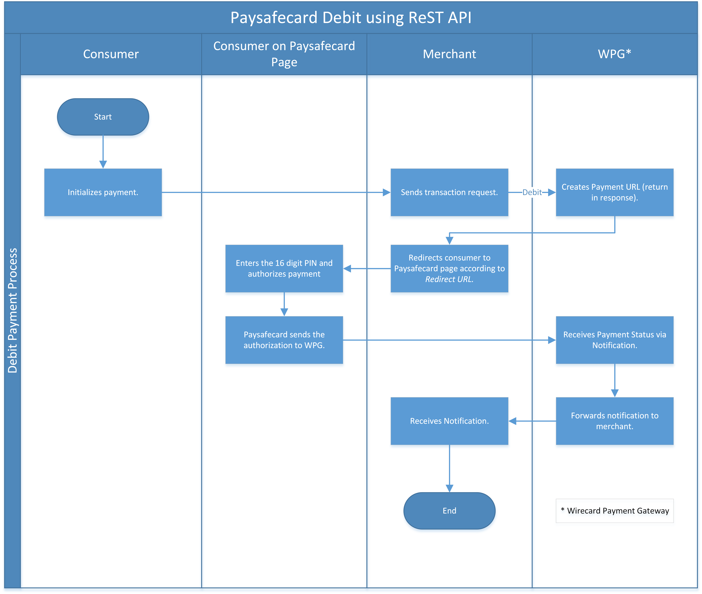
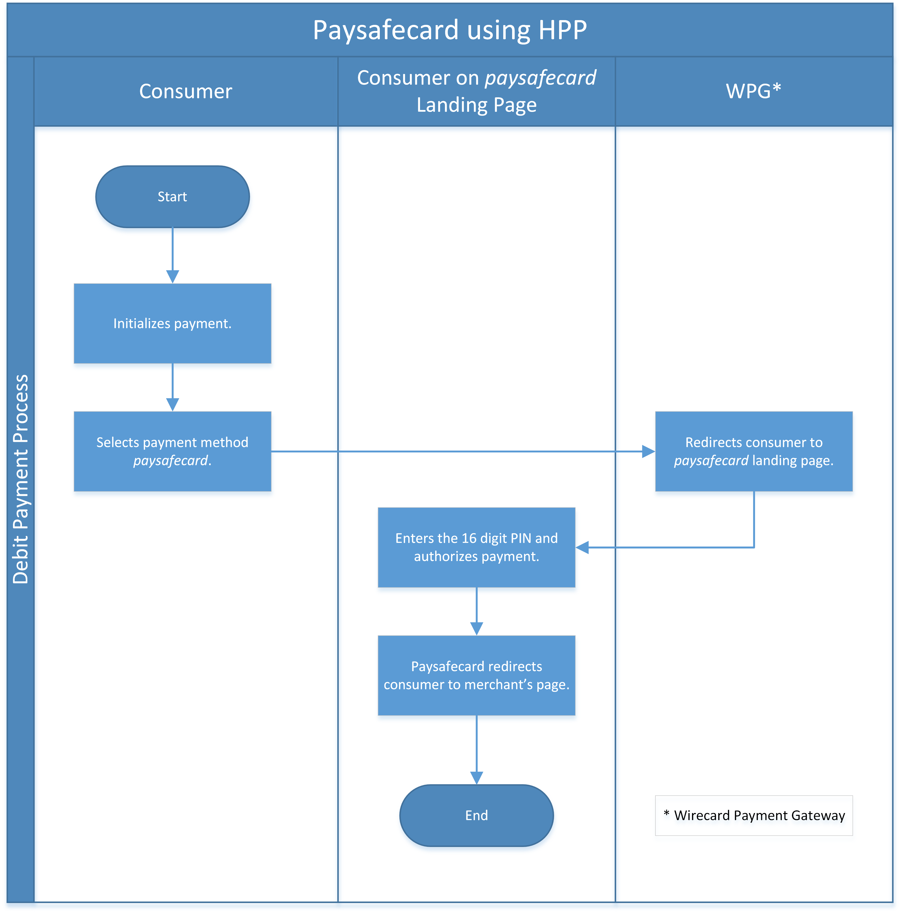
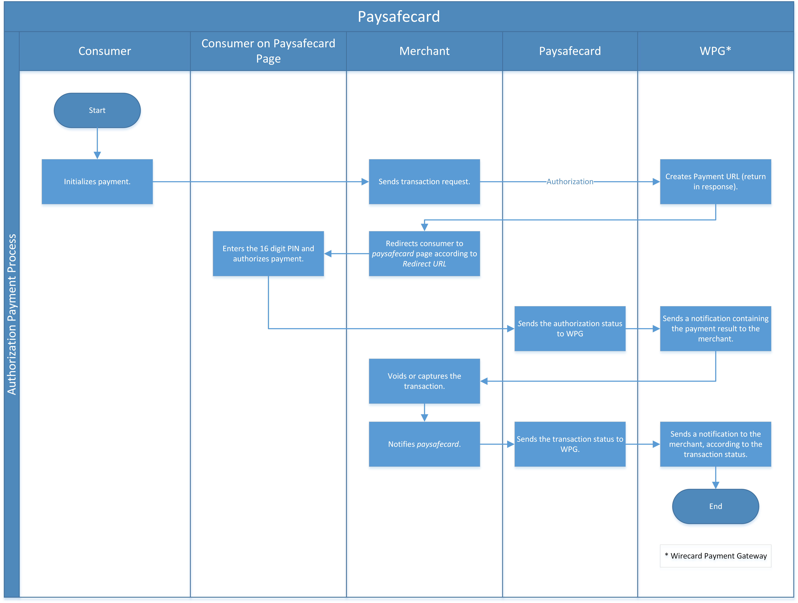

[#paysafecard]
=== paysafecard

[#paysafecard_Introduction]
==== Introduction
[.clearfix]
--
[.right]

_paysafecard_ is Europe's most popular and proven internet payment
method: It is a payment method which is predominantly used for online
shopping. _paysafecard_ lets you pay online simply, quickly and safely
at all well-known merchants in the gaming, social media & communities,
and music, film & entertainment industries, as well as in many other
areas. By integrating _paysafecard_, merchants can accommodate consumers
who:
--

- prefer not to use a credit card (or do not have one) or online banking
systems
- do not want to disclose personal information for fear of fraud
- wish to shop outside their country but don't have internationally
accepted cards or in general account in a bank.

//-

Another benefit of _paysafecard_ is to pay at thousands of online shops
by entering the 16-digit _paysafecard_ PIN. _paysafecard_ (card) is
available in 46 countries worldwide. _paysafecard_ is available in
different amounts in each country's local currency. This allows you to
buy _paysafecard_ in the amount you need. _paysafecard_ (card) and
payment limitation:

- Choose between the following amounts when purchasing _paysafecard_:
USD 10.-, 25.-, 50.-, or 100.-.
- The full amount of the _paysafecard_ you buy is then available for you
to spend.
- Any money left over on the _paysafecard_ after making a payment
remains available for future use.
- If you haven't used the full amount after 12 months, a provision fee
of USD 2.- per month is deducted from the remaining balance from the
thirteenth month on.
- Consumer can use multiple PINs in one payment but maximum up to USD 300.-
amount.

//-

_paysafecard_ is offered as a processing payment model, which means that
the acquirer directly acquires the merchants.

[#paysafecard_GeneralInformation]
==== General Information

[#paysafecard_PaymentMode]
===== Payment Mode, Countries and Currencies

This table illustrates which payment mode _paysafecard_ belongs to. It
also provides detailed information about the countries and currencies
which are relevant for _paysafecard_.

[%autowidth]
[stripes=none]
[cols=",",]
|===
h|Payment Mode
|<<PaymentMethods_PaymentMode_Prepaid, Prepaid>>
h|Countries
|*Europe:* +
Austria, Belgium, Bulgaria, Croatia, Cyprus, Czech Republic, Denmark,
Finland, France, Georgia, Germany, Greece, Hungary, Ireland, Italy,
Latvia, Lithuania, Luxembourg, Malta, Montenegro, The Netherlands, Norway,
Poland, Portugal, Romania, Slovakia, Slovenia, Spain, Sweden, Switzerland, Turkey, UK

*North & South America:* +
Argentina, Brazil, Canada, Mexico, Peru, Uruguay, USA

*Middle East:* +
Kuwait, Saudi Arabia, UAE

*Oceania:* +
Australia, New Zealand

*Africa:* +
Egypt

h|Currencies
|AED, ARS, AUD, BRL, CAD, CHF, CZK, DKK, EGP, EUR, GBP, GEL, HRK, HUF,
KWD, MXN, NOK, NZD, PEN, PLN, RON, SAR, SEK, TRY, USD, UYU
|===

[#paysafecard_CommunicationFormats]
===== Communication Formats

This table illustrates how _paysafecard_ notifications are encoded and
which formats and methods can be used for requests and responses.

[%autowidth]
[stripes=none]
|===
.2+h|Requests/Responses |Format |XML, JSON
   |Methods
   |POST
h|IPN Encodement
2+|Please follow the instructions given at <<GeneralPlatformFeatures_IPN, Instant Payment Notification>> to set up IPN.
|===

[#paysafecard_TransactionTypes]
==== Transaction Types

This table lists all transaction types available for _paysafecard_.

NOTE: Some of the transaction types cannot be used in the requests. Refer to
the columns below for an overview.

For <<Glossary_TransactionType, transaction type>> details which are not given here, look
at <<AppendixB, Appendix B: Transaction Types>>.

[%autowidth]
[stripes=none]
[cols="v,,,,,v"]
|===
|Transaction Type |Description |Request <<paysafecard_TransactionTypes_RequestFootnote, [1]>> |Response/IPN <<paysafecard_TransactionTypes_RequestFootnote, [2]>> |WEP <<paysafecard_TransactionTypes_RequestFootnote, [3]>> v|Link to sample

|_debit_ |Creates a request to charge the specified amount from the
consumer's _paysafecard_. |YES | YES |YES
|<<paysafecard_samples_debit, debit sample>>

|_authorization_ |Authorizes merchant to charge specific amount from
consumer's _paysafecard_ in the future by capture-authorization request.
|YES |YES  |YES
|<<paysafecard_Samples_authorization, authorization sample>>

|_capture-authorization_ |Captures full or partial amount, until the
authorization limit is not exceeded. Only available on
a successful _authorization_ which was neither voided nor fully
captured yet. |YES  |YES |YES
|<<paysafecard_samples_captureAuthorization, capture-authorization sample>>

|_void-authorization_ |Only available on a
successful _authorization_ which was neither voided nor captured yet.
Authorization is voided as a whole. |YES  |YES  |YES
|<<paysafecard_Samples_voidAuthorization, void-authorization sample>>

|_get-url_ |Retrieves the URL of the _paysafecard_ landing page for the
consumer to be redirected to. |NO |YES |YES |
|===

[#paysafecard_TransactionTypes_RequestFootnote]
[1] YES in "Request" indicates that the transaction type is sent in the request.

[#paysafecard_TransactionTypes_ResponseFootnote]
[2] YES in "Response/IPN" indicates that the transaction type appears in either response or notification.

[#paysafecard_TransactionTypes_WEPFootnote]
[3] YES in" WEP" indicates that the transaction type is visible in Wirecard Enterprise Portal.

[#paysafecard_TestCredentials]
==== Test Credentials

[cols=",,"]
[%autowidth]
[stripes=none]
|===
.2+h|URLs (Endpoints)
|For transaction types ``debit``, ``authorization`` and ``credit``
|``\https://api-test.wirecard.com/engine/rest/paymentmethods/``
|For transaction types ``capture-authorization`` and ``void-authorization``
|``\https://api-test.wirecard.com/engine/rest/payments/``
h|Merchant Account ID (MAID)
2+|493f9abe-0028-4631-b72e-836a7e3695af
h|Username
2+|16390-testing
h|Password
2+|3!3013=D3fD8X7
h|Secret Key
2+|4c7356f9-0d28-4c9e-8a11-5bebf0786040
|===

[#paysafecard_AdditionalTestCredentials]
===== Additional Test Credentials on paysafecard Environment

[%autowidth, cols= "h,"]
|===
|Voucher Code |3105 6626 4830 5874
|===

[#paysafecard_Workflow]
==== Workflow

[#paysafecard_debit]
===== debit

[#paysafecard_debit_RESTAPI]
====== Payment Process Using REST API

. Consumer initiates a transaction.
. Merchant sends a request with type _debit_ and consumer's data to
the endpoint of WPG.
. WPG sends a response to the merchant with generated URL
to _paysafecard_ landing page.
. The merchant redirects the consumer to the _paysafecard_ landing
page (The URL for redirection is in the response message, field
"payment-methods/payment-method/@url").5. The consumer enters 16-digit PIN and submits the transaction.
. _paysafecard_ sends the authorization status to WPG.
. WPG sends a Success/Failed notification to the merchant.

//-

[#paysafecard_debit_HPP]
====== Payment Process Using HPP

. Consumer selects payment method _paysafecard_.
. WPG redirects consumer from website to _paysafecard_ landing page.
. Consumer enters _paysafecard_ PIN and clicks on Pay button on
_paysafecard_ landing page.
. Re-direct to merchant confirmation page.

//-

[#paysafecard_authorization]
===== authorization

. Consumer initiates a transaction.
. Merchant sends a request with type _authorization_ and consumer's
data to the endpoint of WPG.
. WPG sends a response to the merchant with generated URL
to _paysafecard_ landing page.
. The merchant redirects the consumer to the _paysafecard_ landing
page (The URL for redirection is in the response message, field
"payment-methods/payment-method/@url").
. The consumer enters 16-digit PIN and submits the transaction.
. Authorization transaction is created.
. _paysafecard_ sends the authorization status to WPG.
. WPG sends a Success/Failed notification to the merchant.
. Merchant voids or captures the transaction using transaction type
_void-authorziation_ or _capture-authorization_.
. _paysafecard_ sends the transaction status to WPG.
. WPG sends a Success/Failed notification to the merchant.

//-

[#paysafecard_Fields]
==== Fields

The fields used for _paysafecard_ requests, responses and
notifications are the same as the REST API Fields. Please refer to the <<RestApi_Fields, REST API field list>> or the request example for the fields required in
a <<paysafecard_samples_debit, debit>> transaction.

Only the fields listed below have different properties.

[#paysafecard_Fields_Table]
===== _debit, authorization, capture, void_ transaction

[cols=",,,,,,v", options="header"]
[frame=all]
[%autowidth]
|===
|Field |Request |Response |Notification |Data Type |Size |Description

v|account-holder.merchant-crm-id
|M
|M
|M
|Alphanumeric
|64
|Unique ID identifying the consumer of your online shop, e.g. from your CRM system.
The parameter must not be a human readable e-mail address.
However, if an email address is used it has to be hashed beforehand by the merchant.
|===

[#paysafecard_Samples]
==== Samples

For XML we do not list any notification samples. Click the link to view corresponding <<GeneralPlatformFeatures_IPN_NotificationExamples, Notification Examples>>.

[#paysafecard_Samples_authorization]
===== authorization

.XML authorization Request (Successful)

[source, xml]
----
<?xml version="1.0" encoding="utf-8" standalone="yes"?>
<payment xmlns="http://www.elastic-payments.com/schema/payment">
   <merchant-account-id>493f9abe-0028-4631-b72e-836a7e3695af</merchant-account-id>
   <request-id>${unique for each request|no whitespaces!}</request-id>
   <transaction-type>authorization</transaction-type>
   <ip-address>127.0.0.1</ip-address>
   <country>DE</country>
   <locale>de</locale>
   <account-holder>
      <first-name>John</first-name>
      <last-name>Constatine</last-name>
      <merchant-crm-id>A123456789</merchant-crm-id>
   </account-holder>
   <payment-methods>
      <payment-method name="paysafecard" />
   </payment-methods>
   <requested-amount currency="EUR">6.66</requested-amount>
   <cancel-redirect-url>https://demoshop-test.wirecard.com/demoshop/#/cancel</cancel-redirect-url>
   <success-redirect-url>https://demoshop-test.wirecard.com/demoshop/#/success</success-redirect-url>
   <fail-redirect-url>https://demoshop-test.wirecard.com/demoshop/#/error</fail-redirect-url>
</payment>
----

.XML authorization Response (Successful)

[source, xml]
----
 <?xml version="1.0" encoding="utf-8" standalone="yes"?>
<payment xmlns="http://www.elastic-payments.com/schema/payment" xmlns:ns2="http://www.elastic-payments.com/schema/epa/transaction">
   <merchant-account-id>493f9abe-0028-4631-b72e-836a7e3695af</merchant-account-id>
   <transaction-id>12161190-e804-4385-baa2-752bd472729d</transaction-id>
   <request-id>295fc328-d630-4a15-8a9e-6f9459460814</request-id>
   <transaction-type>authorization</transaction-type>
   <transaction-state>success</transaction-state>
   <completion-time-stamp>2018-10-01T08:44:51.000Z</completion-time-stamp>
   <statuses>
      <status code="201.0000" description="The resource was successfully created." severity="information" />
   </statuses>
   <requested-amount currency="EUR">6.66</requested-amount>
   <account-holder>
     <first-name>John</first-name>
     <last-name>Constatine</last-name>
     <merchant-crm-id>A123456789</merchant-crm-id>
   </account-holder>
   <ip-address>127.0.0.1</ip-address>
   <payment-methods>
     <payment-method url="https://customer.test.at.paysafecard.com/psccustomer/GetCustomerPanelServlet?currency=EUR&amp;mtid=295fc328-d630-4a15-8a9e-6f9459460814&amp;amount=6.66&amp;mid=1000000326&amp;locale=de" name="paysafecard" />
   </payment-methods>
   <cancel-redirect-url>https://demoshop-test.wirecard.com/demoshop/#/cancel</cancel-redirect-url>
   <fail-redirect-url>https://demoshop-test.wirecard.com/demoshop/#/error</fail-redirect-url>
   <success-redirect-url>https://demoshop-test.wirecard.com/demoshop/#/success</success-redirect-url>
   <locale>de</locale>
   <country>DE</country>
</payment>
----

.XML authorization Request (Failure)

[source, xml]
----
<?xml version="1.0" encoding="utf-8" standalone="yes"?>
<payment xmlns="http://www.elastic-payments.com/schema/payment">
   <merchant-account-id>493f9abe-0028-4631-b72e-836a7e3695af</merchant-account-id>
   <request-id>${unique for each request|no whitespaces!}</request-id>
   <transaction-type>authorization</transaction-type>
   <ip-address>127.0.0.1</ip-address>
   <country>DE</country>
   <locale>de</locale>
   <account-holder>
      <first-name>John</first-name>
      <last-name>Constatine</last-name>
      <merchant-crm-id>A123456789</merchant-crm-id>
   </account-holder>
   <payment-methods>
      <payment-method name="paysafecard" />
   </payment-methods>
   <requested-amount currency="EUR">0</requested-amount>
   <cancel-redirect-url>https://demoshop-test.wirecard.com/demoshop/#/cancel</cancel-redirect-url>
   <success-redirect-url>https://demoshop-test.wirecard.com/demoshop/#/success</success-redirect-url>
   <fail-redirect-url>https://demoshop-test.wirecard.com/demoshop/#/error</fail-redirect-url>
</payment>
----

.XML authorization Response (Failure)

[source, xml]
----
<?xml version="1.0" encoding="utf-8" standalone="yes"?>
<payment xmlns="http://www.elastic-payments.com/schema/payment" xmlns:ns2="http://www.elastic-payments.com/schema/epa/transaction">
   <merchant-account-id>493f9abe-0028-4631-b72e-836a7e3695af</merchant-account-id>
   <transaction-id>6b7b0093-0246-4cf9-869f-e6818601187c</transaction-id>
   <request-id>cd5b8ffb-4b37-4bf5-a990-090c41669ccf</request-id>
   <transaction-type>authorization</transaction-type>
   <transaction-state>failed</transaction-state>
   <completion-time-stamp>2018-10-01T08:58:29.000Z</completion-time-stamp>
   <statuses>
      <status code="500.1154" description="The amount requested is not valid." severity="error" />
   </statuses>
   <requested-amount currency="EUR">0</requested-amount>
   <account-holder>
      <first-name>John</first-name>
      <last-name>Constatine</last-name>
      <merchant-crm-id>A123456789</merchant-crm-id>
   </account-holder>
   <ip-address>127.0.0.1</ip-address>
   <payment-methods>
      <payment-method name="paysafecard" />
   </payment-methods>
   <cancel-redirect-url>https://demoshop-test.wirecard.com/demoshop/#/cancel</cancel-redirect-url>
   <fail-redirect-url>https://demoshop-test.wirecard.com/demoshop/#/error</fail-redirect-url>
   <success-redirect-url>https://demoshop-test.wirecard.com/demoshop/#/success</success-redirect-url>
   <locale>de</locale>
   <country>DE</country>
</payment>
----

[#paysafecard_samples_captureAuthorization]
===== capture-authorization

.XML capture-authorization Request (Successful)

[source, xml]
----
<?xml version="1.0" encoding="utf-8" standalone="yes"?>
<payment xmlns="http://www.elastic-payments.com/schema/payment">
   <merchant-account-id>493f9abe-0028-4631-b72e-836a7e3695af</merchant-account-id>
   <request-id>${unique for each request}</request-id>
   <transaction-type>capture-authorization</transaction-type>
   <parent-transaction-id>df662ff2-f5d6-4d68-a769-f2eca91b2965</parent-transaction-id>
   <api-id>elastic-payment-page</api-id>
   <ip-address>127.0.0.1</ip-address>
   <country>DE</country>
   <locale/>
   <payment-methods>
      <payment-method name="paysafecard" />
   </payment-methods>
   <requested-amount currency="EUR">1.00</requested-amount>
   <cancel-redirect-url>https://demoshop-test.wirecard.com/demoshop/#/cancel</cancel-redirect-url>
   <success-redirect-url>https://demoshop-test.wirecard.com/demoshop/#/success</success-redirect-url>
   <fail-redirect-url>https://demoshop-test.wirecard.com/demoshop/#/error</fail-redirect-url>
</payment>
----

.XML capture-authorization Response (Successful)

[source, xml]
----
<?xml version="1.0" encoding="utf-8" standalone="yes"?>
<payment xmlns="http://www.elastic-payments.com/schema/payment" xmlns:ns2="http://www.elastic-payments.com/schema/epa/transaction" self="https://api-test.wirecard.com:443/engine/rest/merchants/493f9abe-0028-4631-b72e-836a7e3695af/payments/55bd4dd7-cbe0-4fcf-b869-111936f42091">
   <merchant-account-id ref="https://api-test.wirecard.com:443/engine/rest/config/merchants/493f9abe-0028-4631-b72e-836a7e3695af">493f9abe-0028-4631-b72e-836a7e3695af</merchant-account-id>
   <transaction-id>55bd4dd7-cbe0-4fcf-b869-111936f42091</transaction-id>
   <request-id>d1830a3e-6258-4ae7-b9e6-04c61994ab71</request-id>
   <transaction-type>capture-authorization</transaction-type>
   <transaction-state>success</transaction-state>
   <completion-time-stamp>2018-10-01T08:48:49.000Z</completion-time-stamp>
   <statuses>
      <status code="201.0000" description="paysafecard:The resource was successfully created." severity="information" />
   </statuses>
   <requested-amount currency="EUR">1.00</requested-amount>
   <parent-transaction-id>df662ff2-f5d6-4d68-a769-f2eca91b2965</parent-transaction-id>
   <account-holder>
      <first-name>John</first-name>
      <last-name>Constatine</last-name>
      <merchant-crm-id>A123456789</merchant-crm-id>
   </account-holder>
   <ip-address>127.0.0.1</ip-address>
   <payment-methods>
      <payment-method name="paysafecard" />
   </payment-methods>
   <parent-transaction-amount currency="EUR">6.660000</parent-transaction-amount>
   <api-id>elastic-api</api-id>
   <cancel-redirect-url>https://demoshop-test.wirecard.com/demoshop/#/cancel</cancel-redirect-url>
   <fail-redirect-url>https://demoshop-test.wirecard.com/demoshop/#/error</fail-redirect-url>
   <success-redirect-url>https://demoshop-test.wirecard.com/demoshop/#/success</success-redirect-url>
   <locale></locale>
   <country>DE</country>
   <iso>
      <pos-transaction-time>084849</pos-transaction-time>
      <pos-transaction-date>1001</pos-transaction-date>
   </iso>
   <provider-account-id>000000317457278A</provider-account-id>
</payment>
----

.XML capture-authorization Request (Failure)

[source, xml]
----
<?xml version="1.0" encoding="utf-8" standalone="yes"?>
<payment xmlns="http://www.elastic-payments.com/schema/payment">
   <merchant-account-id>493f9abe-0028-4631-b72e-836a7e3695af</merchant-account-id>
   <request-id>${unique for each request}</request-id>
   <transaction-type>capture-authorization</transaction-type>
   <parent-transaction-id>ab662ff2-f5d6-4d68-a769-f2eca91b2965</parent-transaction-id>
   <api-id>elastic-payment-page</api-id>
   <ip-address>127.0.0.1</ip-address>
   <country>DE</country>
   <locale />
   <payment-methods>
      <payment-method name="paysafecard" />
   </payment-methods>
   <requested-amount currency="EUR">1.00</requested-amount>
   <cancel-redirect-url>https://demoshop-test.wirecard.com/demoshop/#/cancel</cancel-redirect-url>
   <success-redirect-url>https://demoshop-test.wirecard.com/demoshop/#/success</success-redirect-url>
   <fail-redirect-url>https://demoshop-test.wirecard.com/demoshop/#/error</fail-redirect-url>
</payment>
----

.XML capture-authorization Response (Failure)

[source, xml]
----
<?xml version="1.0" encoding="utf-8" standalone="yes"?>
<payment xmlns="http://www.elastic-payments.com/schema/payment" xmlns:ns2="http://www.elastic-payments.com/schema/epa/transaction" self="https://api-test.wirecard.com:443/engine/rest/merchants/493f9abe-0028-4631-b72e-836a7e3695af/payments/ded0d69e-c771-4d9e-859f-d6a632e2559b">
   <merchant-account-id ref="https://api-test.wirecard.com:443/engine/rest/config/merchants/493f9abe-0028-4631-b72e-836a7e3695af">493f9abe-0028-4631-b72e-836a7e3695af</merchant-account-id>
   <transaction-id>ded0d69e-c771-4d9e-859f-d6a632e2559b</transaction-id>
   <request-id>d2cd32ee-2a20-45f8-bfed-c488a53ae510</request-id>
   <transaction-type>capture-authorization</transaction-type>
   <transaction-state>failed</transaction-state>
   <completion-time-stamp>2018-10-01T08:57:30.000Z</completion-time-stamp>
   <statuses>
      <status code="400.1020" description="The Parent Transaction Id does not exist.  Please check your input and try again." severity="error" />
   </statuses>
   <requested-amount currency="EUR">1.00</requested-amount>
   <ip-address>127.0.0.1</ip-address>
   <payment-methods>
      <payment-method name="paysafecard" />
   </payment-methods>
   <api-id>elastic-api</api-id>
   <cancel-redirect-url>https://demoshop-test.wirecard.com/demoshop/#/cancel</cancel-redirect-url>
   <fail-redirect-url>https://demoshop-test.wirecard.com/demoshop/#/error</fail-redirect-url>
   <success-redirect-url>https://demoshop-test.wirecard.com/demoshop/#/success</success-redirect-url>
   <locale></locale>
   <country>DE</country>
</payment>
----

[#paysafecard_Samples_voidAuthorization]
===== void-authorization

.XML void-authorization Request (Successful)

[source, xml]
----
<?xml version="1.0" encoding="utf-8" standalone="yes"?>
<payment xmlns="http://www.elastic-payments.com/schema/payment">
   <merchant-account-id>493f9abe-0028-4631-b72e-836a7e3695af</merchant-account-id>
   <request-id>${unique for each request}</request-id>
   <transaction-type>void-authorization</transaction-type>
   <requested-amount currency="EUR">1.00</requested-amount>
   <parent-transaction-id>df662ff2-f5d6-4d68-a769-f2eca91b2965</parent-transaction-id>
   <payment-methods>
      <payment-method name="paysafecard" />
   </payment-methods>
   <cancel-redirect-url>https://demoshop-test.wirecard.com/demoshop/#/cancel</cancel-redirect-url>
   <success-redirect-url>https://demoshop-test.wirecard.com/demoshop/#/success</success-redirect-url>
   <fail-redirect-url>https://demoshop-test.wirecard.com/demoshop/#/error</fail-redirect-url>
</payment>
----

.XML void-authorization Response (Successful)

[source, xml]
----
<?xml version="1.0" encoding="utf-8" standalone="yes"?>
<payment xmlns="http://www.elastic-payments.com/schema/payment" xmlns:ns2="http://www.elastic-payments.com/schema/epa/transaction" self="https://api-test.wirecard.com:443/engine/rest/merchants/493f9abe-0028-4631-b72e-836a7e3695af/payments/d56c26e6-3a80-4df5-adfd-d710bd35472d">
   <merchant-account-id ref="https://api-test.wirecard.com:443/engine/rest/config/merchants/493f9abe-0028-4631-b72e-836a7e3695af">493f9abe-0028-4631-b72e-836a7e3695af</merchant-account-id>
   <transaction-id>d56c26e6-3a80-4df5-adfd-d710bd35472d</transaction-id>
   <request-id>5b855c8b-b5a5-4f7a-b449-1ace3c4a6384</request-id>
   <transaction-type>void-authorization</transaction-type>
   <transaction-state>success</transaction-state>
   <completion-time-stamp>2018-10-01T08:55:04.000Z</completion-time-stamp>
   <statuses>
      <status code="201.0000" description="paysafecard:The resource was successfully created." severity="information" />
   </statuses>
   <requested-amount currency="EUR">1.00</requested-amount>
   <parent-transaction-id>df662ff2-f5d6-4d68-a769-f2eca91b2965</parent-transaction-id>
   <account-holder>
      <first-name>John</first-name>
      <last-name>Constatine</last-name>
      <merchant-crm-id>A123456789</merchant-crm-id>
   </account-holder>
   <ip-address>127.0.0.1</ip-address>
   <payment-methods>
      <payment-method name="paysafecard" />
   </payment-methods>
   <parent-transaction-amount currency="EUR">6.660000</parent-transaction-amount>
   <api-id>elastic-api</api-id>
   <cancel-redirect-url>https://demoshop-test.wirecard.com/demoshop/#/cancel</cancel-redirect-url>
   <fail-redirect-url>https://demoshop-test.wirecard.com/demoshop/#/error</fail-redirect-url>
   <success-redirect-url>https://demoshop-test.wirecard.com/demoshop/#/success</success-redirect-url>
   <locale>de</locale>
   <country>DE</country>
   <iso>
      <pos-transaction-time>085504</pos-transaction-time>
      <pos-transaction-date>1001</pos-transaction-date>
   </iso>
   <provider-account-id>000000317457278A</provider-account-id>
</payment>
----

.XML void-authorization Request (Failure)

[source, xml]
----
<?xml version="1.0" encoding="utf-8" standalone="yes"?>
<payment xmlns="http://www.elastic-payments.com/schema/payment">
   <merchant-account-id>493f9abe-0028-4631-b72e-836a7e3695af</merchant-account-id>
   <request-id>${unique for each request}</request-id>
   <transaction-type>void-authorization</transaction-type>
   <requested-amount currency="EUR">1.00</requested-amount>
   <parent-transaction-id>a56c26e6-3a80-4df5-adfd-d710bd35472d</parent-transaction-id>
   <payment-methods>
      <payment-method name="paysafecard" />
   </payment-methods>
   <cancel-redirect-url>https://demoshop-test.wirecard.com/demoshop/#/cancel</cancel-redirect-url>
   <success-redirect-url>https://demoshop-test.wirecard.com/demoshop/#/success</success-redirect-url>
   <fail-redirect-url>https://demoshop-test.wirecard.com/demoshop/#/error</fail-redirect-url>
</payment>
----

.XML void-authorization Response (Failure)

[source, xml]
----
<?xml version="1.0" encoding="utf-8" standalone="yes"?>
<payment xmlns="http://www.elastic-payments.com/schema/payment" xmlns:ns2="http://www.elastic-payments.com/schema/epa/transaction" self="https://api-test.wirecard.com:443/engine/rest/merchants/493f9abe-0028-4631-b72e-836a7e3695af/payments/2cca20a0-fd1c-4f84-b4c7-82e28a12f14b">
   <merchant-account-id ref="https://api-test.wirecard.com:443/engine/rest/config/merchants/493f9abe-0028-4631-b72e-836a7e3695af">493f9abe-0028-4631-b72e-836a7e3695af</merchant-account-id>
   <transaction-id>2cca20a0-fd1c-4f84-b4c7-82e28a12f14b</transaction-id>
   <request-id>7fa75695-b706-49fa-8209-32486b0c635c</request-id>
   <transaction-type>void-authorization</transaction-type>
   <transaction-state>failed</transaction-state>
   <completion-time-stamp>2018-10-01T08:56:03.000Z</completion-time-stamp>
   <statuses>
      <status code="400.1020" description="The Parent Transaction Id does not exist.  Please check your input and try again." severity="error" />
   </statuses>
   <requested-amount currency="EUR">1.00</requested-amount>
   <payment-methods>
      <payment-method name="paysafecard" />
   </payment-methods>
   <api-id>elastic-api</api-id>
   <cancel-redirect-url>https://demoshop-test.wirecard.com/demoshop/#/cancel</cancel-redirect-url>
   <fail-redirect-url>https://demoshop-test.wirecard.com/demoshop/#/error</fail-redirect-url>
   <success-redirect-url>https://demoshop-test.wirecard.com/demoshop/#/success</success-redirect-url>
</payment>
----

[#paysafecard_samples_debit]
===== debit

.XML debit Request (Successful)

[source, xml]
----
<?xml version="1.0" encoding="utf-8" standalone="yes"?>
<payment xmlns="http://www.elastic-payments.com/schema/payment">
   <merchant-account-id>493f9abe-0028-4631-b72e-836a7e3695af</merchant-account-id>
   <request-id>${unique for each request}</request-id>
   <transaction-type>debit</transaction-type>
   <api-id>elastic-payment-page</api-id>
   <ip-address>127.0.0.1</ip-address>
   <country>DE</country>
   <locale>DE</locale>
   <account-holder>
      <merchant-crm-id>A123456789</merchant-crm-id>
   </account-holder>
   <payment-methods>
      <payment-method name="paysafecard" />
   </payment-methods>
   <requested-amount currency="EUR">1.00</requested-amount>
   <cancel-redirect-url>https://demoshop-test.wirecard.com/demoshop/#/cancel</cancel-redirect-url>
   <success-redirect-url>https://demoshop-test.wirecard.com/demoshop/#/success</success-redirect-url>
   <fail-redirect-url>https://demoshop-test.wirecard.com/demoshop/#/error</fail-redirect-url>
</payment>
----

.XML debit Response (Successful)

[source, xml]
----
<?xml version="1.0" encoding="utf-8" standalone="yes"?>
<payment xmlns="http://www.elastic-payments.com/schema/payment" xmlns:ns2="http://www.elastic-payments.com/schema/epa/transaction">
   <merchant-account-id>493f9abe-0028-4631-b72e-836a7e3695af</merchant-account-id>
   <transaction-id>e85571b6-c23a-4357-b5bb-c65ea2d21cf4</transaction-id>
   <request-id>e5509e18-96f3-4d47-b33e-9bb8c35317f4</request-id>
   <transaction-type>debit</transaction-type>
   <transaction-state>success</transaction-state>
   <completion-time-stamp>2018-10-01T08:59:25.000Z</completion-time-stamp>
   <statuses>
     <status code="201.0000" description="The resource was successfully created." severity="information" />
   </statuses>
   <requested-amount currency="EUR">1.00</requested-amount>
   <account-holder>
      <merchant-crm-id>A123456789</merchant-crm-id>
   </account-holder>
   <ip-address>127.0.0.1</ip-address>
   <payment-methods>
      <payment-method url="https://customer.test.at.paysafecard.com/psccustomer/GetCustomerPanelServlet?currency=EUR&amp;mtid=e5509e18-96f3-4d47-b33e-9bb8c35317f4&amp;amount=1.00&amp;mid=1000000326&amp;locale=DE" name="paysafecard" />
   </payment-methods>
   <api-id>elastic-payment-page</api-id>
   <cancel-redirect-url>https://demoshop-test.wirecard.com/demoshop/#/cancel</cancel-redirect-url>
   <fail-redirect-url>https://demoshop-test.wirecard.com/demoshop/#/error</fail-redirect-url>
   <success-redirect-url>https://demoshop-test.wirecard.com/demoshop/#/success</success-redirect-url>
   <locale>DE</locale>
   <country>DE</country>
</payment>
----

.XML debit Request (Failure)

[source, xml]
----
<?xml version="1.0" encoding="utf-8" standalone="yes"?>
<payment xmlns="http://www.elastic-payments.com/schema/payment">
   <merchant-account-id>493f9abe-0028-4631-b72e-836a7e3695af</merchant-account-id>
   <request-id>${unique for each request}</request-id>
   <transaction-type>debit</transaction-type>
   <api-id>elastic-payment-page</api-id>
   <ip-address>127.0.0.1</ip-address>
   <country>DE</country>
   <locale>DE</locale>
   <account-holder>
      <merchant-crm-id>A123456789</merchant-crm-id>
   </account-holder>
   <payment-methods>
      <payment-method name="paysafecard" />
   </payment-methods>
   <requested-amount currency="EUR">0</requested-amount>
   <cancel-redirect-url>https://demoshop-test.wirecard.com/demoshop/#/cancel</cancel-redirect-url>
   <success-redirect-url>https://demoshop-test.wirecard.com/demoshop/#/success</success-redirect-url>
   <fail-redirect-url>https://demoshop-test.wirecard.com/demoshop/#/error</fail-redirect-url>
</payment>
----

.XML debit Response (Failure)

[source, xml]
----
<?xml version="1.0" encoding="utf-8" standalone="yes"?>
<payment xmlns="http://www.elastic-payments.com/schema/payment" xmlns:ns2="http://www.elastic-payments.com/schema/epa/transaction">
   <merchant-account-id>493f9abe-0028-4631-b72e-836a7e3695af</merchant-account-id>
   <transaction-id>5b3f149c-8cdd-476b-abb2-775ab9823d8a</transaction-id>
   <request-id>61266507-eeb8-4284-a18d-104978088ca8</request-id>
   <transaction-type>debit</transaction-type>
   <transaction-state>failed</transaction-state>
   <completion-time-stamp>2018-10-01T09:00:57.000Z</completion-time-stamp>
   <statuses>
      <status code="500.1154" description="The amount requested is not valid." severity="error" />
   </statuses>
   <requested-amount currency="EUR">0</requested-amount>
   <account-holder>
      <merchant-crm-id>A123456789</merchant-crm-id>
   </account-holder>
   <ip-address>127.0.0.1</ip-address>
   <payment-methods>
      <payment-method name="paysafecard" />
   </payment-methods>
   <api-id>elastic-payment-page</api-id>
   <cancel-redirect-url>https://demoshop-test.wirecard.com/demoshop/#/cancel</cancel-redirect-url>
   <fail-redirect-url>https://demoshop-test.wirecard.com/demoshop/#/error</fail-redirect-url>
   <success-redirect-url>https://demoshop-test.wirecard.com/demoshop/#/success</success-redirect-url>
   <locale>DE</locale>
   <country>DE</country>
</payment>
----
