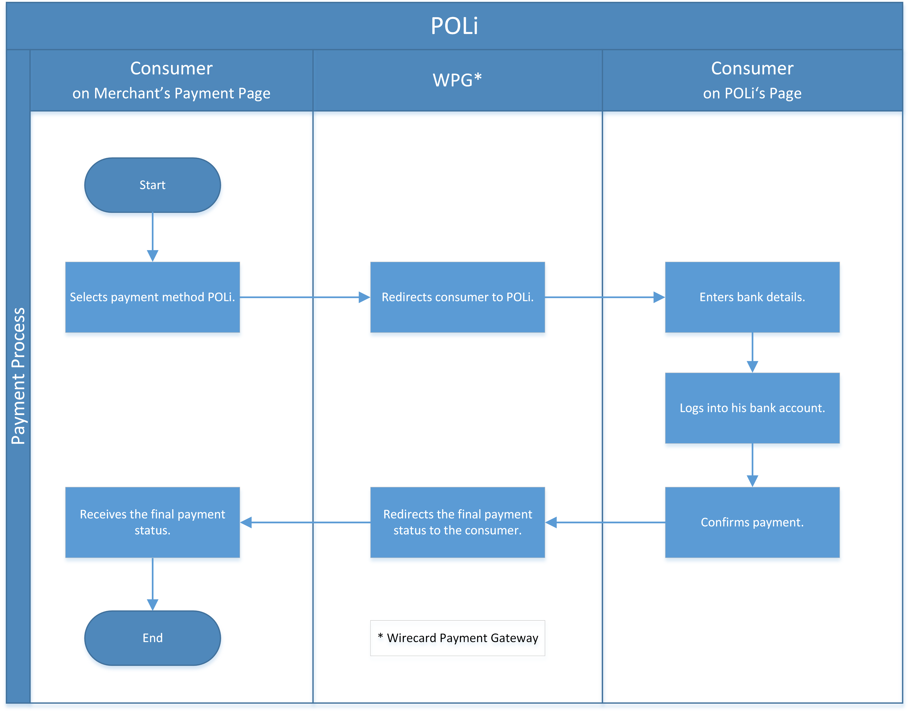

[#POLi]
=== POLi

[#POLi_Introduction]
==== Introduction
[.clearfix]
--
[.right]

_POLi_ is an online payment option that allows consumers to use internet
banking to securely pay for goods and services. It allows consumers to
pay directly from a merchant's website without the need of a credit
card. _POLi_ Payments is used throughout Australia and New Zealand.
--

[#POLi_GeneralInformation]
==== General Information

[#POLi_PaymentModeCountriesandCurrencies]
===== Payment Mode, Countries and Currencies

This table illustrates which payment mode _POLi_ belongs to. It also
provides detailed information about the countries and currencies which
are relevant for _POLi_.

[cols="h,",]
|===
|Payment Mode |<<PaymentMethods_PaymentMode_OnlineBankTransfer, Online Bank Transfer>>
|Countries    |AU, NZ
|Currencies   |AUD, NZD
|===

[#POLi_CommunicationFormats]
===== Communication Formats

This table illustrates how _POLi_ notifications are encoded and which
formats and methods can be used for requests and responses.

[%autowidth]
|===
.2+h| Requests/Responses | Format   | XML
                         | Methods  | POST, GET
   h| IPN Encodement   2+| Please follow the instructions given at <<GeneralPlatformFeatures_IPN, Instant Payment Notification>> to set up IPN.
|===

[#POLi_TransactionTypes]
==== Transaction Types

For <<Glossary_TransactionType, transaction type>> details which are not given here look
at <<AppendixB, Appendix B: Transaction Types>>.

[#POLi_TestCredentials]
==== Test Credentials

[%autowidth]
[cols="1,2"]
|===
   h| URLs (Endpoint)              | ``\https://{test-instance-hostname}/engine/rest/paymentmethods/``
.2+h| Merchant Account ID (MAID)   | 1e11f676-f3f7-4ca2-ad26-e5fe870f676b
                                  a|
NOTE: This MAID can only be used to test AUD. NZD cannot be
tested at the moment.

   h| Username                        | 16390-testing
   h| Password                        | 3!3013=D3fD8X7
   h| Secret Key                      | d99e826c-204d-497b-81ec-5ce0a16b1c24
|===

[#POLi_Workflow]
==== Workflow

. The consumer selects to pay with _POLi_ on the merchant's payment
page. +
{payment-gateway} redirects the consumer to _POLi_ to perform the
payment.  
. The consumer logs into his account on _POLi_'s page. +
{payment-gateway} redirects the consumer to a payment
confirmation page on _POLi_'s page. +
{payment-gateway} redirects the consumer to the merchant's page
for the final payment status. 

//-

[#POLi_Fields]
==== Fields

The fields required for _POLi_ are the same fields as
the <<RestApi_Fields, ReST API Fields>>.

[#POLi_Samples]
==== Samples

For XML we do not list any notification samples. Go to
<<GeneralPlatformFeatures_IPN_NotificationExamples, Notification Examples>>, if you want to see corresponding notification samples.

[#POLi_Samples_debit]
===== debit

.XML debit Request (Successful)
[source,xml,subs=attributes+]
----
<?xml version="1.0" encoding="utf-8"?>
<payment xmlns="http://www.elastic-payments.com/schema/payment">
   <payment-methods>
      <payment-method name="poli" />
   </payment-methods>
   <merchant-account-id>1e11f676-f3f7-4ca2-ad26-e5fe870f676b</merchant-account-id>
   <request-id>959ae146-31ae-4eb1-a193-3168fef226b6</request-id>
   <transaction-type>debit</transaction-type>
   <requested-amount currency="AUD">2.00</requested-amount>
   <order-number>181004092031237</order-number>
   <order-detail>Test product 001</order-detail>
   <ip-address>127.0.0.1</ip-address>
   <locale>en</locale>
   <account-holder>
      <first-name>John</first-name>
      <last-name>Doe</last-name>
      <email>john.doe@wirecard.com</email>
   </account-holder>
      <notifications>
         <notification url="add.your.url.here" />
      </notifications>
   <cancel-redirect-url>https://{pp-redirect-url-cancel}</cancel-redirect-url>
   <success-redirect-url>https://{pp-redirect-url-success}</success-redirect-url>
   <fail-redirect-url>https://{pp-redirect-url-error}</fail-redirect-url>
</payment>
----

.XML debit Response (Successful)
[source,xml,subs=attributes+]
----
<?xml version="1.0" encoding="utf-8" standalone="yes"?>
<payment xmlns="http://www.elastic-payments.com/schema/payment" xmlns:ns2="http://www.elastic-payments.com/schema/epa/transaction">
   <merchant-account-id>1e11f676-f3f7-4ca2-ad26-e5fe870f676b</merchant-account-id>
   <transaction-id>81c766c0-5bfa-4d53-a5b0-0ca9c3ca2200</transaction-id>
   <request-id>959ae146-31ae-4eb1-a193-3168fef226b6</request-id>
   <transaction-type>debit</transaction-type>
   <transaction-state>success</transaction-state>
   <completion-time-stamp>2018-10-04T07:20:32.000Z</completion-time-stamp>
   <statuses>
      <status code="201.0000" description="The resource was successfully created." severity="information" />
   </statuses>
   <requested-amount currency="AUD">2.00</requested-amount>
   <account-holder>
      <first-name>John</first-name>
      <last-name>Doe</last-name>
      <email>john.doe@wirecard.com</email>
   </account-holder>
   <ip-address>127.0.0.1</ip-address>
   <order-number>181004092031237</order-number>
   <order-detail>Test product 001</order-detail>
   <notifications>
      <notification url="add.your.url.here"/>
   </notifications>
   <payment-methods>
      <payment-method url="https://txn.apac.paywithpoli.com/?Token=DtoS%2f57clmvHJiYe0wOlSRPcZwDFjIyv" name="poli" />
   </payment-methods>
   <cancel-redirect-url>https://{pp-redirect-url-cancel}</cancel-redirect-url>
   <fail-redirect-url>https://{pp-redirect-url-error}</fail-redirect-url>
   <success-redirect-url>https://{pp-redirect-url-success}</success-redirect-url>
   <locale>en</locale>
</payment>
----

.XML debit Request (Failure)
[source,xml,subs=attributes+]
----
<?xml version="1.0" encoding="utf-8"?>
<payment xmlns="http://www.elastic-payments.com/schema/payment">
   <payment-methods>
      <payment-method name="poli" />
   </payment-methods>
   <merchant-account-id>1e11f676-f3f7-4ca2-ad26-e5fe870f676b</merchant-account-id>
   <request-id>0b05d4ed-14bc-46dd-bf80-e7c6624af749</request-id>
   <transaction-type>debit</transaction-type>
   <ip-address>127.0.0.1</ip-address>
   <locale>en</locale>
   <account-holder>
      <first-name>John</first-name>
      <last-name>Doe</last-name>
      <email>john.doe@wirecard.com</email>
   </account-holder>
   <fail-redirect-url>https://{pp-redirect-url-error}</fail-redirect-url>
   <cancel-redirect-url>https://{pp-redirect-url-cancel}</cancel-redirect-url>
   <success-redirect-url>https://{pp-redirect-url-success}</success-redirect-url>
   <notifications><notification url="add.your.url.here" />    </notifications>
</payment>
----

.XML debit Response (Failure)
[source,xml,subs=attributes+]
----
<?xml version="1.0" encoding="utf-8" standalone="yes"?>
<payment xmlns="http://www.elastic-payments.com/schema/payment" xmlns:ns2="http://www.elastic-payments.com/schema/epa/transaction">
   <merchant-account-id>1e11f676-f3f7-4ca2-ad26-e5fe870f676b</merchant-account-id>
   <request-id>0b05d4ed-14bc-46dd-bf80-e7c6624af749</request-id>
   <transaction-type>debit</transaction-type>
   <transaction-state>failed</transaction-state>
   <statuses>
      <status code="400.1011" description="The Requested Amount has not been provided.  Please check your input and try again." severity="error" />
   </statuses>
   <account-holder>
      <first-name>John</first-name>
      <last-name>Doe</last-name>
      <email>john.doe@wirecard.com</email>
   </account-holder>
   <ip-address>127.0.0.1</ip-address>
   <notifications>
      <notification url="add.your.url.here"></notification>
   </notifications>
   <payment-methods>
      <payment-method name="poli" />
   </payment-methods>
   <cancel-redirect-url>https://{pp-redirect-url-cancel}</cancel-redirect-url>
   <fail-redirect-url>https://{pp-redirect-url-error}</fail-redirect-url>
   <success-redirect-url>https://{pp-redirect-url-success}</success-redirect-url>
   <locale>en</locale>
</payment>
----
