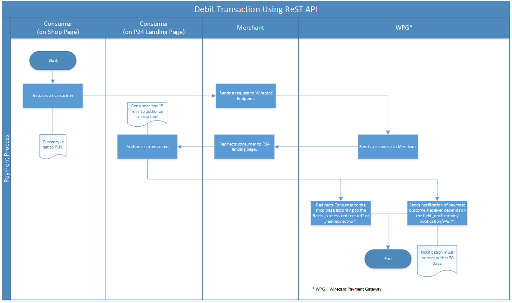

[#Przelewy24]
=== Przelewy24

[#Przelewy24_Introduction]
==== Introduction

Przelewy24 Service (P24) renders automatic payments by online transfer
available for many banks in Poland. This makes P24 one of the most
important payment methods in Poland.

It is an asynchronous online banking payment method where end consumer
is redirected to P24 landing page to choose desired bank and finish the
transaction in his or her online banking account. Subsequently a
notification confirming the outcome of the transaction is sent to the
merchant.

The notification for the final status of the transaction should be
received within a few minutes. If the notification is not sent within
this time, the merchant has the possibility to send a request for <<GeneralPlatformFeatures_RetrieveTransaction_TransactionID, Retrieve Transaction by Transaction ID>> or
<<GeneralPlatformFeatures_RetrieveTransaction_RequestID, Retrieve Transaction by Request ID>>. With the response the merchant will get the
final status of the requested transaction. If the response is 404, it
means _Wirecard Payment Gateway_ (WPG) has not received final status
from P24 yet. In such cases a retrieval should be performed again later.
A transaction is usually processed within 2 hours. In edge cases it can
take up to 30 days for P24 to provide a final status of a transaction.
Merchants should take edge cases into consideration during their
integration.

Wirecard offers this payment method as Collecting PSP. Which means:

. Wirecard provides professional services connected with the collection
of funds processed through Alternative Payment Methods, as well as the
settlement made to a merchant.
. No own contracts needs to be signed with single payment providers,
only one contract with Wirecard Bank is necessary.
. Wirecard Bank collects all funds on a collecting bank account owned by
Wirecard.
. Merchant receives payout of funds from Wirecard.
. Reporting (e.g. reconciliation) and integration / merchant support is
fully provided by Wirecard.

NOTE: The P24 landing page has a responsive design, that means it can be
accessed with any device (notebook, tablet, smartphone).

[#Przelewy24_Integration]
==== Integration

If you want to integrate P24 via *Payment Page*, please refer to the
documentation at <<PaymentPageSolutions, Payment Page>>.

If you want to integrate P24 via *ReST API*, please refer to the
documentation at <<Przelewy24_debitProcessUsingtheReSTAPI, ReST API>>.

If you want to use *IPN* with P24, please refer to the documentation at
<<GeneralPlatformFeatures_IPN, Instant Payment Notification>>.

If you want to use the *API for transaction retrieval*, please refer to
the documentation at <<GeneralPlatformFeatures_RetrieveTransaction, Retrieve Transactions>>.

[#Przelewy24_GeneralInformation]
==== General Information

[#Przelewy24_PaymentModeCountriesandCurrencies]
===== Payment Mode, Countries and Currencies

This table illustrates which payment mode _P24_ belongs to. It also
provides detailed information about the countries and currencies which
are relevant for _P24_.

.Payment Mode, Countries and Currencies
[cols="h,"]
|===
| Payment Mode | <<PaymentMethods_PaymentMode_OnlineBankTransfer, Online Bank Transfer>>
| Countries    | Poland
| Currencies   | PLN
|===

[#Przelewy24_CommunicationFormats]
===== Communication Formats

This table illustrates how _P24_ notifications are encoded and which
formats and methods can be used for requests and responses.

.Communication Formats
[%autowidth]
|===
.2+h| Requests/Responses | Format   | XML
                         | Methods  | POST
   h| IPN Encodement   2+| Please follow the instructions given at <<GeneralPlatformFeatures_IPN_NotificatonExamples>> to set up IPN.
|===

[#Przelewy24_TransactionTypes]
==== Transaction Types

This table lists all transaction types available for _P24_.

NOTE: Some transaction types cannot be sent in your request. Refer to columns
_Request_, _Response/IPN_ and _WEP_ for details where to expect involved
transaction types.

NOTE: Recurring mode is not available.

For <<Glossary_TransactionType, transaction type>> details which are not given here look
at <<AppendixB, Appendix B: Transaction Types>>.

[cols="e,,,,,"]
|===
|Transaction Type | Request | Response/IPN | WEP | Description | Link to Samples

|debit | Yes | Yes | Yes | Moves funds from Consumer to Merchant.
``debit`` requests to take funds from consumer’s bank account. a|
<<Przelewy24_Samples_debit, debit samples>>

|get-url |No |No |Yes | A step in a group of transactions where the
URL of P24 landing page is retrieved for the Consumer to be redirected
to. | 

|refund-request |Yes |Yes |Yes | A request to give funds to the
Consumer's account, referring to an eligible debit transaction.
|<<Przelewy24_Samples_refund, refund samples>>

|refund-debit |No |Yes |Yes |Moves funds from the Merchant to the
Consumer. It follows ``refund-request`` as a final step of the refund
flow.
|
|===

[NOTE]
====
[cols="h,"]
|===
| Request      | *Yes* means the transaction type can be sent in the request.
| Response/IPN | *Yes* means the transaction type can appear in either response _or_ notification.
| WEP          | *Yes* means the transaction type is visible in Wirecard Enterprise Portal.
|===
====

[#Przelewy24_TestCredentials]
==== Test Credentials

NOTE: Our test environment is connected to _P24_ sandbox which does not
require to enter any additional data. _P24_ landing page will skip
entering consumer card data or credentials and returns to your shop
immediately.

|===
.3+h|URLs (Endpoints) .2+| REST API | For transaction type ``debit``.                              | ``\https://api-test.wirecard.com/engine/rest/paymentmethods/``
                                    | For transaction types ``refund-request`` and ``refund-debit``. | ``\https://api-test.wirecard.com/engine/rest/payments/``
                       2+| Payment Page                                                          | ``\https://api-test.wirecard.com/engine/hpp/``
h| Merchant Account ID 3+| 86451785-3ed0-4aa1-99b2-cc32cf54ce9a
h| Username            3+| 16390-testing
h| Password            3+| 3!3013=D3fD8X7
h| Secret Key          3+| fdd54ea1-cef1-449a-945c-55abc631cfdc
|===

[#Przelewy24_Workflow]
==== Workflow

[#Przelewy24_debitTransaction]
===== _debit_ Transaction

[#Przelewy24_debitPrerequisites]
====== Prerequisites

For a successful workflow, please keep the following prerequisites in
mind:

* A P24 payment process is *accomplished successfully only, if WPG has
sent out a successful notification*. The status ``success`` in the response
only confirms that the payment was technically accepted.
* In case the consumer closes the browser before confirming the payment,
there is *a redirection to shop page* possible. This means, the workflow
can be accomplished successfully, even when shutting down the browser.
* As soon as the P24 landing page has been opened in a browser,
the *consumer has 15 minutes to authorize the payment*. However, the
validity of the received URL is not limited. Try to ensure that the URL
is opened by the consumer as soon as possible. In edge cases the payment
could be successfully finished even after a long time (when the merchant
could have cancelled the order already).
* The maximum period to receive notification is 30 days.

[#Przelewy24_debitProcessUsingtheReSTAPI]
====== Payment Process Using the ReST API

. The consumer initiates a transaction (currency is set to ``PLN``).
. The merchant sends a request with the consumer's data to the
endpoint of WPG.
. WPG sends a response to the merchant.
. The merchant redirects the consumer to the P24 landing page (The URL
for redirection is in the response message, field
``payment-methods/payment-method/@url``).
. The consumer authorizes the transaction.
. WPG performs two actions simultaneously:
. WPG redirects the consumer (via redirect URLs) back to the shop
where the information about the status of the payment is displayed. The
redirect URL uses the definition in ``success-redirect-url`` and
``fail-redirect-url`` from the request (Step 2). According to success or
failure during the payment process WPG sends the consumer to the
corresponding URL. This is the page where the consumer is informed about
his successful or failed payment.
. WPG sends a notification (IPN) of the payment outcome. In order to
receive server-to-server notification, the notification must use the
definition in the field ``notifications/notification/@url`` in the request
(Step 2)

[#Przelewy24_debitProcessUsingthePaymentPage]
====== Payment Process Using the Payment Page

.Payment Process Using Payment Page
image::images/11-27-przelewy24/Przelewy24_Debit_TX_PPage.png[Payment Process Using Payment Page]

. The consumer initiates a transaction (currency is set to PLN).
. The merchant sends a request with the consumer's data to the
endpoint of WPG.
. WPG analyses the consumer's data.
.. If the request does not include the payment method P24, the WPG
redirects the consumer to Payment Page
... The consumer selects P24.
... WPG redirects the consumer to the P24 landing page.
.. If the request already includes the payment method P24, WPG
redirects the consumer to the P24 landing page.
. The consumer selects the desired bank.
. The consumer authorizes the transaction.
. WPG performs two actions simultaneously:
.. WPG redirects the consumer (via redirect URLs) back to the shop
where the information about the status of the payment is displayed. The
redirect URL uses the definition
in ``success-redirect-url`` and ``fail-redirect-url`` from the request (Step
2). According to success or failure during the payment process WPG sends
the consumer to the corresponding URL. This is the page where the
consumer is informed about his successful or failed payment.
.. WPG sends a notification (IPN) of the payment outcome. In order to
receive a server-to-server notification, the notification must use the
definition in the field ``notifications/notification/@url`` in the request
(Step 2).

[#Przelewy24_refundTransaction]
===== _refund_ Transaction

A ``refund`` transaction is a backend process. Wirecard can only provide a
process for ReST API. When using Payment Page the merchant must set up a
refund process.

[#Przelewy24_refundPrerequisites]
====== Prerequisites

In order to transfer funds back to the consumer you have to be aware of
the following prerequisites:

* The flow is asynchronous. You have to wait for a notification with the
result. Usually it takes one day for refunds to be processed.
* The _refund_ must reference to a successful ``debit`` transaction. In a
_refund_, a _Transaction ID_ from a ``debit`` notification must be
used.
* The refunded amount must be less than or equal to original ``debit``
transaction
* Multiple refunds to a single ``debit`` are possible as long as the sum
of those individual refunds does not exceed original full amount.
* In order to have a final status of the _refund_, you have to process a
subsequent notification.

[#Przelewy24_refundProcessUsingtheReSTAPI]
====== _refund_ Process Using the ReST API

.refund Process Using the ReST API
image::images/11-27-przelewy24/Przelewy24_Refund_TX_ReST.png[refund Process Using the ReST API]

. The merchant initiates a ``refund`` transaction.
. The merchant sends a request to the endpoint of WPG. The request
must contain:
.. the _Request ID_ from a previously sent successful ``debit``
transaction. The _Request ID_ is expected in the
field ``parent-transaction-id``
.. a ``payment-methods/payment-method/@name`` set to ``p24``
.. a ``transaction-type`` set to ``refund-request``
. WPG sends a response to the merchant.
. P24 processes the refund.
+
NOTE: Processing a refund lasts at least one day!

+
. WPG waits for the status "Refund Process Finished".
. WPG sends a notification (IPN) of the ``refund`` outcome to the
merchant. This notification has the transaction type ``refund-debit``,
instead of ``refund-request`` which was sent in the merchant's request
(Step 2).  +
In order to receive a server-to-server notification, the notification
must use the definition in the
field ``notifications/notification/@url`` in the request (Step 2).
See <<GeneralPlatformFeatures_IPN, Instant Payment Notification>> for details.

[#Przelewy24_BankingStatement]
===== Banking Statement

After a successful payment process, a banking statement appears in the
consumer's transaction history. The statement consists of
a _Transaction-ID_ generated by P24 (_P24-Transaction-ID_) and a value
provided in the field ``descriptor`` of the <<Przelewy24_Samples_debit, debit request>>.

The structure of the _P24-Transaction-ID_ is
``P24-YXX-XXX-XXX``. _The _P24-Transaction-ID__ is also displayed in
the _Wirecard Enterprise Portal_ (WEP) as _Provider Transaction-ID_.

[#Przelewy24_Fields]
==== Fields

For full reference of allowed fields for Payment Page or REST API can be
found on <<PaymentPageSolutions_Fields, Fields for Payment Page>> or <<RestApi_Fields, Fields for ReST API>> respectively. +
The following tables describe only P24 specifics. The following elements
are either mandatory *M*, optional *O* or conditional *C*.

[#Przelewy24_debit]
===== debit

.Fields for debit transaction
[cols="e,,,,"]
|===
|Field |Cardinality |Datatype |Size |Description

|account-holder/email |M |Alphanumeric |64 |The email address of the
account holder.

|account-holder/address/country |O |Alphanumeric |3 |The Country ID of
the account holder. It must be ``PL``; if it is not provided, will be
automatically set to ``PL``.

|order-number |O |Alphanumeric |64 |This is the order number of the
merchant. If provided, it is displayed on P24 landing page as “Order
Information”

|payment-methods/payment-method-name |M |Alphanumeric |15 |This is the
name of the payment method. Always use value ``p24``

|transaction-type |M |Alphanumeric |30 |This is the type for a
transaction. Always use value ``debit``

|requested-amount/@currency |M |Alphanumeric |3 |This is the currency in
which a transaction is received and processed. Always use value ``PLN``

|descriptor |O |Alphanumeric |64 a|
Describes the transaction. It is shown on the account holder's statement
along with the _P24-Transaction-ID_. See section <<Przelewy24_BankingStatement, Banking Statement>> for details.
Do not use no more than 20 characters and do not use special chars as it
can be misinterpreted by a bank system.

|locale |O |Alphanumeric |6 a|
With this field you can specify language in which P24 landing page is
displayed.
Possible values: ``pl``, ``en``, ``de``, ``es``, ``it``
|===

NOTE: The P24 landing page contains the section “Description”. This section
displays additional information about the payment. The text displayed
comprises _Order Number_, _Merchant Name_ and _Request Id_ in the
following format:
``[order-number], [merchant_name], [request-id]``
_Merchant Name_ is taken from the configuration of the merchant's
profile.

[#Przelewy24_refund]
===== refund request

.Fields for refund request
[cols="e,,,,"]
|===
|Field |Cardinality |Datatype |Size |Description

|payment-methods.payment-method-name |M |Alphanumeric |15 |This is the
name of the payment method. Always use value ``p24``

|transaction-type |M |Alphanumeric |30 |This is the type for a
transaction. Always use value ``refund-request``

|requested-amount/@currency |M |Alphanumeric |3 |This is the currency in
which a transaction is received and processed. Always use value ``PLN``
|===

[#Przelewy24_Samples]
==== Samples

Go to <<GeneralPlatformFeatures_IPN_NotificationExamples, Notification Examples>> if you want to see corresponding notification samples.

[#Przelewy24_Samples_debit]
===== debit

.debit Request (Successful)
[source,xml]
----
<?xml version="1.0" encoding="utf-8"?>
<payment xmlns="http://www.elastic-payments.com/schema/payment">
   <merchant-account-id>86451785-3ed0-4aa1-99b2-cc32cf54ce9a</merchant-account-id>
   <request-id>28040771-b2e6-4b43-ab80-8f9a24164917</request-id>
   <transaction-type>debit</transaction-type>
   <payment-methods>
      <payment-method name="p24" />
   </payment-methods>
   <requested-amount currency="PLN">10</requested-amount>
   <account-holder>
      <first-name>John</first-name>
      <last-name>Doe</last-name>
      <email>john.doe@test.com</email>
   </account-holder>
   <order-number>180730104557465</order-number>
   <descriptor>Eshop Order - Shoes</descriptor>
   <notifications>
      <notification url="https://merchant.com/ipn.php" />
   </notifications>
 <cancel-redirect-url>https://demoshop-test.wirecard.com/demoshop/#/cancel</cancel-redirect-url>
 <success-redirect-url>https://demoshop-test.wirecard.com/demoshop/#/success</success-redirect-url>
 <fail-redirect-url>https://demoshop-test.wirecard.com/demoshop/#/error</fail-redirect-url>
</payment>
----

.debit Response (Succcessful)
[source,xml]
----
<?xml version="1.0" encoding="utf-8" standalone="yes"?>
<payment xmlns="http://www.elastic-payments.com/schema/payment" xmlns:ns2="http://www.elastic-payments.com/schema/epa/transaction">
  <merchant-account-id>86451785-3ed0-4aa1-99b2-cc32cf54ce9a</merchant-account-id>
  <transaction-id>38245a43-c7c0-43e5-bf4b-c9aca64acd41</transaction-id>
  <request-id>8a5a2813-5cd7-42ab-96b0-e70ea2d4004f</request-id>
  <transaction-type>debit</transaction-type>
  <transaction-state>success</transaction-state>
  <completion-time-stamp>2018-07-30T09:17:05.000Z</completion-time-stamp>
  <statuses>
    <status code="201.0000" description="The resource was successfully created." severity="information" />
  </statuses>
  <requested-amount currency="PLN">10</requested-amount>
  <account-holder>
    <first-name>John</first-name>
    <last-name>Doe</last-name>
    <email>john.doe@test.com</email>
  </account-holder>
  <order-number>180730111704952</order-number>
  <descriptor>Eshop Order - Shoes</descriptor>
  <notifications>
    <notification url="https://merchant.com/ipn.php"></notification>
  </notifications>
  <payment-methods>
    <payment-method url="https://sandbox.przelewy24.pl/trnRequest/D7A31BCD3C-B845DB-614CA2-7BD158C3A9" name="p24" />
  </payment-methods>
  <cancel-redirect-url>https://demoshop-test.wirecard.com/demoshop/#/cancel</cancel-redirect-url>
  <fail-redirect-url>https://demoshop-test.wirecard.com/demoshop/#/error</fail-redirect-url>
  <success-redirect-url>https://demoshop-test.wirecard.com/demoshop/#/success</success-redirect-url>
</payment>
----

[#Przelewy24_Samples_refund]
===== refund

.refund-request Request (Successful)
[source,xml]
----
<?xml version="1.0" encoding="utf-8"?>
<payment xmlns="http://www.elastic-payments.com/schema/payment">
  <request-id>e90684e4-3588-4450-b1f6-42d614f4430f</request-id>
  <transaction-type>refund-request</transaction-type>
  <requested-amount currency="PLN">10</requested-amount>
  <parent-transaction-id>77e8f783-8960-45b5-8e61-5e50f9a29ba1</parent-transaction-id>
  <payment-methods>
    <payment-method name="p24" />
  </payment-methods>
</payment>
----

.refund-request Response (Successful)
[source,xml]
----
<?xml version="1.0" encoding="utf-8" standalone="yes"?>
<payment xmlns="http://www.elastic-payments.com/schema/payment" xmlns:ns2="http://www.elastic-payments.com/schema/epa/transaction" self="https://api-test.wirecard.com:443/engine/rest/merchants/86451785-3ed0-4aa1-99b2-cc32cf54ce9a/payments/8c2bdc7f-d426-4008-a200-745275c6bd46">
  <merchant-account-id ref="https://api-test.wirecard.com:443/engine/rest/config/merchants/86451785-3ed0-4aa1-99b2-cc32cf54ce9a">86451785-3ed0-4aa1-99b2-cc32cf54ce9a</merchant-account-id>
  <transaction-id>8c2bdc7f-d426-4008-a200-745275c6bd46</transaction-id>
  <request-id>e90684e4-3588-4450-b1f6-42d614f4430f-refund-request</request-id>
  <transaction-type>refund-request</transaction-type>
  <transaction-state>success</transaction-state>
  <completion-time-stamp>2018-07-30T09:27:50.000Z</completion-time-stamp>
  <statuses>
    <status code="201.0000" description="p24:The resource was successfully created." severity="information" />
  </statuses>
  <requested-amount currency="PLN">10</requested-amount>
  <parent-transaction-id>77e8f783-8960-45b5-8e61-5e50f9a29ba1</parent-transaction-id>
  <account-holder>
    <first-name>John</first-name>
    <last-name>Doe</last-name>
    <email>john.doe@test.com</email>
  </account-holder>
  <order-number>180730111704952</order-number>
  <descriptor>Eshop Order - Shoes</descriptor>
  <notifications>
    <notification url="https://merchant.com/ipn.php" />
  </notifications>
  <payment-methods>
    <payment-method name="p24" />
  </payment-methods>
  <parent-transaction-amount currency="PLN">10.000000</parent-transaction-amount>
  <authorization-code>92749318</authorization-code>
  <api-id>elastic-api</api-id>
  <cancel-redirect-url>https://demoshop-test.wirecard.com/demoshop/#/cancel</cancel-redirect-url>
  <fail-redirect-url>https://demoshop-test.wirecard.com/demoshop/#/error</fail-redirect-url>
  <success-redirect-url>https://demoshop-test.wirecard.com/demoshop/#/success</success-redirect-url>
  <provider-account-id>16027</provider-account-id>
</payment>
----
