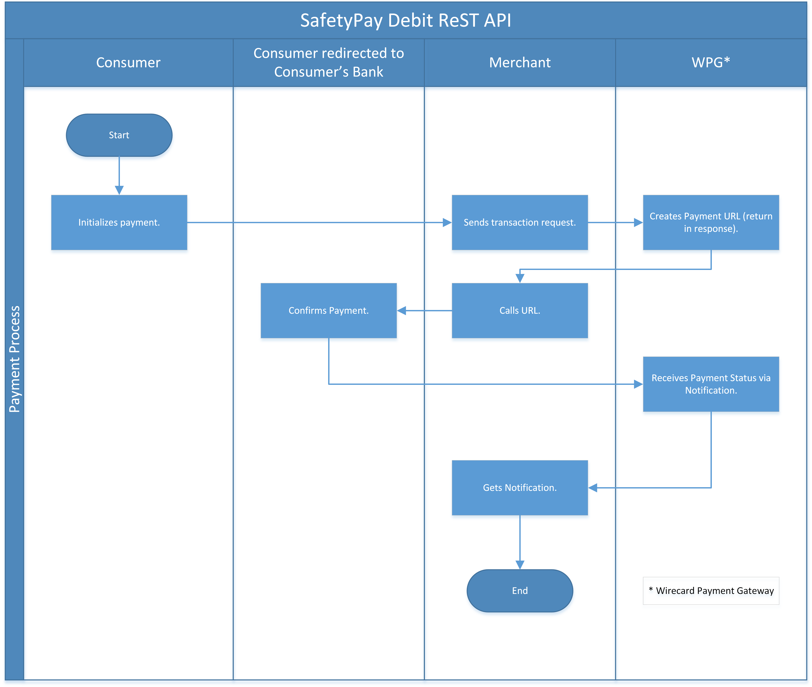
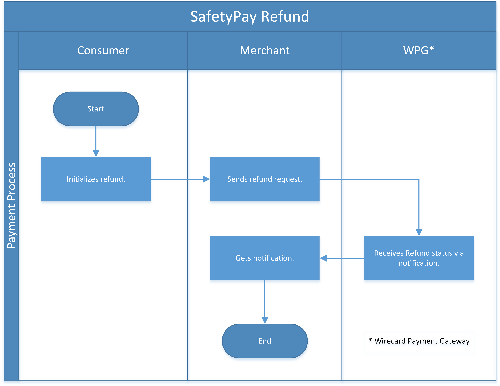

[#SafetyPay]
=== SafetyPay

[#SafetyPay_Introduction]
==== Introduction
[.clearfix]
--
[.right]

_SafetyPay_ is an asynchronous payment method where the end consumers
finish the payment in their own online-banking account after being
redirected to a _SafetyPay_ landing page during checkout to choose the
currency and the desired bank. There is also the option of a cash
payment, in which case _SafetyPay_ provides a Payment Code for the
consumers that they can use later at any point of collection to pay
(merchant receives a notification confirming the outcome of the
transaction). By integrating _SafetyPay_, merchants can accommodate
consumers who:
--

- prefer not to use a credit card (or do not have one),
- do not want to disclose personal information for fear of fraud,
- wish to shop outside their country but don't have internationally
accepted cards.

//-

Another benefit of _SafetyPay_ is that it significantly reduces
fraudulent purchases, opportunities for identity theft and many other
related security risks by using _push payments_. Consumers submit
("push") their payment to the merchant directly, without providing their
personal & financial information to the merchant or _SafetyPay_. And
since there is no fraud, the merchant controls when and how to refund
consumers: there are no chargebacks or other hidden costs.

_SafetyPay_ is offered as a processing payment model, which means that
the acquirer directly acquires the merchants.

[#SafetyPay_GeneralInformation]
==== General Information

[#SafetyPay_PaymentModeCountriesandCurrencies]
===== Payment Mode, Countries and Currencies

This table illustrates which payment mode _SafetyPay_ belongs to. It
also provides detailed information about the countries and currencies
which are relevant for _SafetyPay_.

[cols="1h,2", stripes="none"]
[%autowidth]
|===
|Payment Mode | Please <<ContactUs, contact merchant support>> for Payment Mode.
|Countries |AT, DE, ES, BE, NL, US, CA, CR, MX, PR, BR, EC, PE, CL, CO
|Currencies |EUR, USD, CAD, MXN, CRC, BRL, PEN, CLP, CLF, COP
|===

[#SafetyPay_CommunicationFormats]
===== Communication Formats

This table illustrates how _SafetyPay_ notifications are encoded and
which formats and methods can be used for requests and responses.

[%autowidth]
|===
.2+h| Requests/Responses | Format   | XML
                         | Methods  | POST
   h| IPN Encodement   2+| SHA256
|===

[#SafetyPay_TransactionTypes]
==== Transaction Types

This table lists all transaction types available for _SafetyPay_.

NOTE: Some of the transaction types cannot be used in the requests. Refer to
the columns below for an overview.

For <<Glossary_TransactionType, transaction type>> details which are not given here, look at <<AppendixB, Appendix B: Transaction Types>>.

[%autowidth]
|===
| Transaction Type | Description | Request | Response/IPN  | WEP | Link to the sample

| _debit_ |Creates a request to charge the specified amount from the Consumer's bank account. | YES | YES | YES | <<SafetyPay_Samples_debit, _debit_ samples>>
| _refund-debit_ |Initiates the _refund_ process, referring to an existing _debit_ transaction. | YES | YES | YES | <<SafetyPay_Samples_refund, _refund_ samples>>
| _refund-request_ |Returns the original transaction amount to the Consumer's account. It follows _refund-debit_ as the final step of the _refund_ flow. | NO | NO | YES | 
| _get-url_ |Retrieves the URL of the _SafetyPay_ landing page for the Consumer to be redirected to. | NO | YES | YES |  
|===

[NOTE]
====
[cols="h,"]
|===
| Request      | *YES* indicates that the transaction type is sent in the request.
| Response/IPN | *YES* indicates that the transaction type appears in either response or notification.
| WEP          | *YES* indicates that the transaction type is visible in Wirecard Enterprise Portal.
|===
====

[#SafetyPay_TestCredentials]
==== Test Credentials
[stripes="none"]
[%autowidth]
|===
.3+h| URLs (Endpoints) .2+| REST API | For transaction type _debit_. | ``\https://api-test.wirecard.com/engine/rest/paymentmethods/``
                                      | For transaction types _refund-request_ and _refund-debit._ | ``\https://api-test.wirecard.com/engine/rest/payments/``
                           2+| Payment Page | ``\https://api-test.wirecard.com/engine/hpp/``
h| Merchant Account ID (MAID) 3+| ca20c8a7-fa58-4ef5-a785-1c90ca9662c3
h| Username 3+| 16390-testing
h| Password 3+| 3!3013=D3fD8X7
h| Secret Key 3+| 13f27673-6bbe-4227-838a-e31952b5d794
|===

[#SafetyPay_Workflow]
==== Workflow

[#SafetyPay_debit]
===== _debit_ transaction

[#SafetyPay_UsingRESTAPI]
====== Payment Process Using REST API

. Consumer initiates a transaction.
. Merchant sends a request with the consumer's data to the endpoint of WPG.
. WPG sends a response to the merchant with generated URL to _SafetyPay_ landing page.
. The merchant redirects the consumer to the _SafetyPay_ landing page
(The URL for redirection is in the response message, field *payment-methods/payment-method/@url*).
. The consumer authorizes the transaction.
. _SafetyPay_ sends the authorization status to WPG.
. WPG sends a Success/Failed notification to the merchant.

//-

[#SafetyPay_UsingHPP]
====== Payment Process Using HPP

. Consumer initiates a transaction.
. Merchant sends a request with the consumer's data to the endpoint of WPG.
. WPG redirects the consumer to the _SafetyPay_ landing page (The URL
for redirection is in the response message, field *payment-methods/payment-method/@url*).
. The consumer authorizes the transaction.
. _SafetyPay_ sends the authorization status to WPG. 
. WPG sends a Success/Failed notification to the merchant.

//-

[#SafetyPay_refundTransaction]
===== _refund_ Transaction

NOTE: _refund_ is only possible via REST API.

. Consumer initiates a _refund_ process.
. Merchant sends a request to _SafetyPay_. It includes the transaction
ID of the _debit_ transaction that it's linked to.
. _SafetyPay_ processes the _refund_ request.
. _SafetyPay_ sends the _refund_ result to WPG.
. WPG sends a Success/Failed notification to the merchant.

//-

[#SafetyPay_Fields]
==== Fields

The fields used for _SafetyPay_ requests, responses and notifications
are the same as the REST API Fields. Please refer to the <<RestApi_Fields, REST API Fields>> or the request example for the fields required in a <<SafetyPay_debit_transaction, debit>> transaction.

Only the fields listed below have different properties.

The following elements are mandatory *M*, optional *O* or conditional
*C* for a request/response/notification. If the respective cell is
empty, the field is disregarded or not sent.

[#SafetyPay_debit_transaction]
===== _debit_ transaction

[%autowidth]
|===
| Field | Request   | Response | Notification | Data Type | Size | Value Range | Description | Usage of Optional Fields

|product-id | O | O | O | Alphanumeric | 36 a| "online" "offline" | Identifier for selection, if consumer wants to proceed payment with
Cash (offline) or Internet Banking (online). | If the field is not
present in the request, consumer will select ONLINE or OFFLINE option
after redirection on _SafetyPay_ page.
|===

[#SafetyPay_Samples]
==== Samples

Go to <<GeneralPlatformFeatures_IPN_NotificationExamples, Notification Examples>> if you want to see corresponding notification samples.

[#SafetyPay_Samples_debit]
===== _debit_

.debit Request (Successful)

[source,xml]
----
include::samples/xml/safetypay_debit_request_success.xml[]
----

.debit Response (Successful)

[source,xml]
----
include::samples/xml/safetypay_debit_response_success.xml[]
----

.debit Request (Failure)

[source,xml]
----
include::samples/xml/safetypay_debit_request_failure.xml[]
----

.debit Response (Failure)

[source,xml]
----
include::samples/xml/safetypay_debit_response_failure.xml[]
----

[#SafetyPay_Samples_refund]
===== _refund_

.refund-debit Request (Successful)

[source,xml]
----
include::samples/xml/safetypay_refund-debit_request_success.xml[]
----

.refund-debit Response (Successful)

[source,xml]
----
include::samples/xml/safetypay_refund-debit_response_success.xml[]
----

.refund-debit Request (Failure)

[source,xml]
----
include::samples/xml/safetypay_refund-debit_request_failure.xml[]
----

.refund-debit Response (Failure)

[source,xml]
----
include::samples/xml/safetypay_refund-debit_response_failure.xml[]
----
