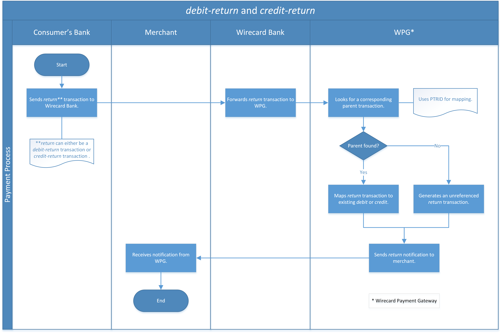

[#SEPA]
=== SEPA

[#SEPA_Introduction]
==== Introduction
[.clearfix]
--
[.right]
image::images/11-29-sepa/SepaLogoEN.jpg[SEPA Logo, 200]

The Single Euro Payments Area (SEPA) is an initiative of the European
banking industry that makes electronic payments across the euro area as
easy as domestic payments within one country. The payments are processed
under the same basic conditions, rights, and obligations regardless of
their location. The SEPA project is strongly supported by the European
Commission and the European Central Bank. It is based on ISO 20022
standards.
--

SEPA can be used for every kind of business inside the SEPA area.
Transactions are processed only in Euro. Member countries include the 28
EU Member States as well as Iceland, Liechtenstein, Monaco, Norway, and
Switzerland.

For information about SEPA timelines, please refer to the European
Payments Council:
https://www.europeanpaymentscouncil.eu/what-we-do/sepa-payment-scheme-management[SEPA Payment Scheme Management]

[#SEPA_PaymentMethods]
==== The SEPA Payment Methods

Wirecard offers two SEPA payment methods.

- <<SEPACreditTransfer, SEPA Credit Transfer>>
- <<SEPADirectDebit, SEPA Direct Debit>>
//-

_SEPA Direct Debit_ is very popular in Germany, Austria and the
Netherlands.

[#SEPA_TransactionTypes]
==== Transaction Types

The following transaction types may be used with both _SEPA Direct Debit_
and _SEPA Credit Transfer_ payment methods. For payment method
specific transaction types, please refer to the individual payment
method pages.

[#SEPA_TransactionType_Void]
===== SEPA _void_

_Wirecard Payment Gateway_ allows merchants to void _SEPA Direct Debit_
and _SEPA Credit Transfer_ transactions *before* they are forwarded to
the bank for settlement.

This means: It is only possible to void a transaction between the
time the transaction request has been received by the _Wirecard Payment Gateway_
for processing and the time the transaction will
be forwarded for processing to the bank. Once the payment was processed
by the bank and settled, it is no longer possible to void a transaction.

[NOTE]
====
To void an existing pending _SEPA Direct Debit_ or SEPA _Credit
Transfer_ transaction, a merchant must

- send a _void-pending-debit_ or _void-pending-credit_ request.
- include the parent-transaction-ID.
//-
====

[#SEPA_TransactionType_Void_Restrictions]
====== Restrictions

To ensure proper processing, please take into consideration the
following restrictions for SEPA _Void_ transactions:

- A _pending-debit_ or _pending-credit_ transaction may only be voided
*before* the transaction is batched into a file and sent to the bank for
processing.

NOTE: Batch processing starts at around 10:00 UTC.

- If a _void_ request is sent after the transaction has been sent to the
bank, a _Failed_ response will be returned.
- Once a corresponding _debit_ or _credit_ transaction exists for the
original _pending-debit_ or _pending-credit_ it is no longer possible to
void a transaction.
- A request for a _void_ transaction must contain a parent-transaction
ID referring to the _pending-debit_ or _pending-credit_ transaction
that should be voided.
//-

[#SEPA_TransactionType_Void_Fields]
====== Fields

The fields used for SEPA _Void_ requests, responses and notifications
are the same as the REST API fields. Please refer to <<RestApi_Fields, REST API Fields>>
or the request example for the fields required in a
<<SEPADirectDebit_Samples_VoidPendingDebit, _void-pending-debit_>> or
<<SEPACreditTransfer_Samples_VoidPendingCredit, _void-pending-credit_>> transaction.

WARNING: If the amount is sent within the request for the _void_ transaction it
will be checked if it is the same amount as in the previous
_pending-debit_ or _pending-credit_ request. Partial cancellations are
currently *not* possible.   

Only the fields listed below have different properties.

The following elements are mandatory (M) or optional (O) for a
request/response/notification. If the respective cell is empty, the
field is disregarded or not sent.

[%autowidth]
|===
|Field           	| Request  | Response	| Notification | Description

|requested-amount | O        | M        | M | This is the amount of the transaction. The amount of the decimal place
is dependent of the currency. Min amount €0.01. Max amount
€999,999,999.99.

If it is sent within the request it will be validated if it is the same amount like in the _pending-debit_ or _pending-credit_ request.

|requested-currency |O      | M         | M | This is the currency of the requested-amount. Only EUR is accepted.
|payment-methods.payment-method-Name | M | M | M | This is the name of the payment method *sepadirectdebit* or
*sepacredit*.
|parent-transaction-id | M | M | M | Transaction ID of the transaction that needs to be voided.
|transaction-type | M | M  | M | This is the type for a transaction. For a SEPA _Void_ request, only
_void-pending-debit_, _void-debit_, _void-pending-credit_ or
_void-credit_ are allowed.
|===

[#SEPA_TransactionType_Deposit]
===== SEPA _deposit_

Occasionally, a consumer send funds back to the merchant, either at the
request of the merchant or through his/her own initiative. There are
several reasons for this such as a re-payment or a subsequent /
supplementary payment for an already existing SEPA _Direct Debit_
transaction. 

These supplementary payments enter the _Wirecard Payment Gateway_ as
transactions with transaction type _deposit_ and with the payment method
*wiretransfer*.

If the consumer provides the PTRID (Provider Transaction Reference ID)
in the descriptor of his transfer, the _Wirecard Payment Gateway_ will
attempt to match the deposit with the original _SEPA Direct Debit_ or
_SEPA Credit Transfer_ transaction. If the PTRID is not provided or it
is simply not possible to match the transaction, the transaction will
remain unmatched.

[#SEPA_TransactionType_Deposit_Fields]
====== Fields

The following elements are submitted in the IPN
(<<GeneralPlatformFeatures_IPN, Instant Payment Notification>>) either mandatory (M) or optional (O):

[%autowidth]
|===
|Field           	| Notification | Description
|request-id | M | This is the identification number of the request on the merchant's side.
*It must be unique for each request.*
|transaction-type | M | This is the type for a transaction. For SEPA Deposit, it is always
_deposit_.
|payment-methods.payment-method-Name | M | This is the name of the payment method *wiretransfer*.

|===

[#SEPA_Samples_DepositNotification]
====== Sample

.XML deposit Notification
[source,xml]
----
<?xml version="1.0" encoding="UTF-8"?>
<payment xmlns="http://www.elastic-payments.com/schema/payment" xmlns:ns2="http://www.elastic-payments.com/schema/epa/transaction">
    <merchant-account-id>7d10ba14-5527-45de-85f5-2aaede73c225</merchant-account-id>
    <transaction-id>8486a305-59fe-488d-bf63-8255ad5d3d68</transaction-id>
    <request-id>88541df6-a5af-4c2a-ae71-44c0b17ae494-deposit</request-id>
    <transaction-type>deposit</transaction-type>
    <transaction-state>success</transaction-state>
    <completion-time-stamp>2018-03-26T12:41:03.000Z</completion-time-stamp>
    <statuses>
        <status code="201.0000" description="bank:The resource was successfully created." severity="information"/>
    </statuses>
    <requested-amount currency="EUR">10.01</requested-amount>
    <parent-transaction-id>a88b4b46-f288-432a-b800-829976a11577</parent-transaction-id>
    <account-holder>
        <first-name>John</first-name>
        <last-name>Doe</last-name>
    </account-holder>
    <descriptor>SONI MR-01</descriptor>
    <payment-methods>
        <payment-method name="wiretransfer"/>
    </payment-methods>
    <api-id>---</api-id>
    <provider-transaction-reference-id>E98FABD066</provider-transaction-reference-id>
    <Signature xmlns="http://www.w3.org/2000/09/xmldsig#">
        <SignedInfo>
            <CanonicalizationMethod Algorithm="http://www.w3.org/TR/2001/REC-xml-c14n-20010315"/>
            <SignatureMethod Algorithm="http://www.w3.org/2001/04/xmldsig-more#rsa-sha256"/>
            <Reference URI="">
                <Transforms>
                    <Transform Algorithm="http://www.w3.org/2000/09/xmldsig#enveloped-signature"/>
                </Transforms>
                <DigestMethod Algorithm="http://www.w3.org/2001/04/xmlenc#sha256"/>
                <DigestValue>DMS2y5xxPoDnm/QXEFX/jQZXWsS/O7Ydtw1Gbe5U9jE=</DigestValue>
            </Reference>
        </SignedInfo>
        <SignatureValue>pS2QkXfqI4buhzyzp2fYbTC3SBeSNe0/LDVRw6GlF1FNkh9rq0V740/12k4S5iYtaxBPXishkZVFw0sVCnaTrNhOqBjaUG6UAL0+tmaxQwgLhJojwZCM9jnovT1ShwGXkYU7wWJxX20Ue2MnoputiTkMV5sDNYY/TElP5kwoe+2oVxLZbGpgbmyvSnJwpzpb32a8wrTxRRgBnHy3Vvo2FcyojliV1H+EI+WDBL6RycEQPHT48d0E7tu0oIUTz0y3jNV4H5oaxQ0KLKMOBkGGDJ4N5zWc39oqjQh/fzvtcvVyreVuQR27s+w6NltPRUYHxhheRi+WnZtS5FXKc+TcDyw7ya7dBfMxhUBAdXPBkd2TqH7ty8bgVmUGEC39Eazb1XG+3jpBmHIbUMTP2C0HFeNFmlb6Y7zYoQIcc+dXQzWJRIXz1QTr20Q7tjkataeTKzupo55JLyw8BCrFJi4kL8SgrInODj9utjJvPgIbA/vt1KDwVvkWoHh9ejIuQhddxePqmywufsWt1YNw/pkQ8g056l2Lc2QhRWdbT3MWesPVLUtl1UJaxmCmOdIUCHPwj9Xw5uO0zeJICdnxBPtBKCEX6hOUqptw9AZvtSlUEfmhJJE1O722uYy+6MoAzVthLOukeANaegesjpEYE8pnImicgRLmsRDalO0V8E6jL9g=</SignatureValue>
        <KeyInfo>
            <X509Data>
                <X509SubjectName>L=Ascheim,CN=engine.wirecard.sys,OU=Operations,O=Wirecard Technologies GmbH,C=DE</X509SubjectName>
                <X509Certificate>MIIF0DCCBLigAwIBAgICK8EwDQYJKoZIhvcNAQELBQAwWzELMAkGA1UEBhMCREUxETAPBgNVBAoTCFdpcmVjYXJkMTkwNwYDVQQDFDB3aXJlY2FyZC1EUS1NVUMtaW50ZXJuYWwtd2Vic2VydmljZS1pc3N1aW5nQ0FfMDIwHhcNMTYwNTIwMDc1MDI0WhcNMTgwNTIwMDc1MDI0WjB3MQswCQYDVQQGEwJERTEjMCEGA1UEChMaV2lyZWNhcmQgVGVjaG5vbG9naWVzIEdtYkgxEzARBgNVBAsTCk9wZXJhdGlvbnMxHDAaBgNVBAMTE2VuZ2luZS53aXJlY2FyZC5zeXMxEDAOBgNVBAcTB0FzY2hlaW0wggIiMA0GCSqGSIb3DQEBAQUAA4ICDwAwggIKAoICAQDyqm9WQZish8wxW5WOB0m/kunHIcOC5DC8aEk55S4uf9hRi16+Fkg1y626GC//0eXVle+leUhF/e9e4wfqt/2wVNwkjhy2ww5uT2ZqojzvGyCAjnyDIr4C6+6Ezz9FZ1h2lNsbNRuKSoahTdycGAqduj5xjpiuNAnmh1EAZEYWSmR/QvY+PTV6+ltZAl5WlVCmTHuBUqvMUEOfMew5B7iA1BDUZ508l76cfTKHOu15kqA5ajxaAC/DeawCPSCdsdOTsWSVbKvn5FM8VK29Ah699XWi85sG5uniklhyDKuaHPplrL7+9eA1XaFSsaOc+obDRe2lus8YmIUMvaSsDfglZOGq8VLrDIXo2i4WC2AiNFtLNC/bndxrrYRd2+Rb5VviNblcQu1pfWTDd2SWKtyegg558UAAAgM2kJ4EUujCKp2t9EOELJZ2yHABTIySkuCkeLJfpqL6bGQJEZlzgtEE6hS1ywPjPMNg2F1BKGNH79KK8GvehWYDX4VfKoTROVHqc5ODxWGBoZ+mxHWiwLZ96KBniMBnoTuXTi5op7/0sW8F8ykd9kE6yH2d8YQMTQ6PAY4DG6KpsC0J2zE4P+iGfDeMnoud9Zws24ogf/mTag13URkYpYKpAglwuSHcciZgfGXSrmne+MspKbO24Ny0wZP3suY9ssNfyLooSlMfXwIDAQABo4IBgDCCAXwwEQYDVR0OBAoECEDpj0A8MIh/MBMGA1UdIwQMMAqACENsHhbUPQUOMAsGA1UdDwQEAwIE8DCCAUMGA1UdHwSCATowggE2MIIBMqCCAS6gggEqhoHVbGRhcDovL3dpcmVjYXJkLmxhbi9DTj13aXJlY2FyZC1EUS1NVUMtaW50ZXJuYWwtd2Vic2VydmljZS1pc3N1aW5nQ0FfMDIsQ049Q0RQLENOPVB1YmxpYyBLZXkgU2VydmljZXMsQ049U2VydmljZXMsQ049Q29uZmlndXJhdGlvbixkYz13aXJlY2FyZCxkYz1sYW4/Y2VydGlmaWNhdGVSZXZvY2F0aW9uTGlzdD9iYXNlP29iamVjdENsYXNzPUNSTERpc3RyaWJ1dGlvblBvaW50hlBodHRwOi8vY3JsLndpcmVjYXJkLmxhbi9DUkxfd2lyZWNhcmQtRFEtTVVDLWludGVybmFsLXdlYnNlcnZpY2UtaXNzdWluZ0NBXzAyLmNybDANBgkqhkiG9w0BAQsFAAOCAQEAmCbqd802pphK0hwKDcQ4mctQk1tXXS38+016QDOh/uJTzmG5WqFZfoXZ8GYwMl5zjE6g+ciuVv3q393gLLZdZrUHEOKS1xj8xWjUQd4uNDJPXY1RamPBDptahn6/AIR89UFDaN37L3fI7EfLqTHpbD92ZGVssmt/0cjd9ekNGN66dEJB0YGBZTVEALhwYF1KtcxiLo2b1KnbmKLgnldF6RwP6p93fpO29mQxw4ePU2/+GyWmYW053ObAYqMVNelLc2Fj4W82El2Gbw/rFBiNM9qBpYS8YkMwsmTr0m49AsI2H401KBwfR4Ci1zUXfZjWchIZjjEVeIR7gMTOl+/Cog==</X509Certificate>
            </X509Data>
        </KeyInfo>
    </Signature>
</payment>
----

[#SEPA_TransactionType_DebitReturnAndCreditReturn]
===== SEPA _debit-return_ and _credit-return_

A _debit-return_ reverses a _debit_ transaction. It is initiated by the
consumer bank 

- if the consumer disputes the transaction
- if there is a problem with the consumer bank account (e.g. bank account
closed)
//-

A _credit-return_ reverses a _credit_ transaction. It is initiated
either by

- the merchant's bank (e.g. insufficient funds)
- the consumer's bank (e.g. bank account closed)
//-

All _debit-returns_ and _credit-returns_ are included in
reconciliation files provided by Wirecard Bank and sent to the _Wirecard Payment Gateway._ The transaction types _debit-return_ and
_credit-return_ are then initiated by the _Wirecard Payment Gateway_. It is not possible for a
merchant to request these transaction types.

If possible, a _debit-return_ or _credit-return_ is matched by the _Wirecard Payment Gateway (WPG)_ to its original debit/credit, based on the provider transaction
reference ID (PTRID) and the merchant account.

Possible return codes are documented within <<SEPA_ReturnCodes, Return Codes>>.

[#SEPA_Workflow]
====== Workflow

. _Consumer's bank sends a debit-return_ or _credit-return_ to
Wirecard Bank.
. Wirecard Bank forwards the transaction to the WPG.
. WPG receives the transaction.
. WPG uses the PTRID to find an initial parent _debit_ or parent
_credit_ transaction.
.. If successful, WPG maps the _debit-return_ to _a debit_ or
_credit-return_ to a _credit._
.. if not successful, WPG creates _a debit-return_ or _credit-return_
without reference.
. WPG sends a notification about the _debit-return_ or _credit-return_
to the merchant.
//-

[#SEPA_Samples_DebitReturnNotification]
====== Sample

.XML debit-return Notification
[source,xml]
----
<?xml version="1.0" encoding="UTF-8"?>
<payment xmlns="http://www.elastic-payments.com/schema/payment" xmlns:ns2="http://www.elastic-payments.com/schema/epa/transaction">
    <merchant-account-id>cd237c02-72fb-4fc4-a5ab-c965ba95b5a9</merchant-account-id>
    <transaction-id>d7f4038d-3e37-403c-842f-9bfda761149c</transaction-id>
    <request-id>e446b34c-c5f5-43c4-9b2b-a1415096c334-debit-return</request-id>
    <transaction-type>debit-return</transaction-type>
    <transaction-state>success</transaction-state>
    <completion-time-stamp>2018-07-17T10:56:00.000Z</completion-time-stamp>
    <statuses>
       <status code="201.0001" description="bank:Reason for the return was not specified by the debtor bank" severity="information"/>
    </statuses>
    <requested-amount currency="EUR">10.01</requested-amount>
    <parent-transaction-id>3fa23529-a93d-4701-8e60-b01e699f3709</parent-transaction-id>
    <account-holder>
       <first-name>John</first-name>
       <last-name>Doe</last-name>
    </account-holder>
    <descriptor>Sanho XS 234-T</descriptor>
    <payment-methods>
       <payment-method name="sepadirectdebit"/>
    </payment-methods>
    <mandate>
       <mandate-id>12345678</mandate-id>
       <signed-date>2018-07-17</signed-date>
    </mandate>
    <creditor-id>DE98ZZZ09999999999</creditor-id>
    <api-id>---</api-id>
    <due-date>2018-07-20T00:00:00.000Z</due-date>
    <consumer>
       <first-name>Jack</first-name>
       <last-name>Smith</last-name>
    </consumer>
    <provider-transaction-reference-id>13DFDA6E77</provider-transaction-reference-id>
    <instrument-country>DE</instrument-country>
    <Signature xmlns="http://www.w3.org/2000/09/xmldsig#">
       <SignedInfo>
          <CanonicalizationMethod Algorithm="http://www.w3.org/TR/2001/REC-xml-c14n-20010315"/>
          <SignatureMethod Algorithm="http://www.w3.org/2001/04/xmldsig-more#rsa-sha256"/>
          <Reference URI="">
             <Transforms>
                <Transform Algorithm="http://www.w3.org/2000/09/xmldsig#enveloped-signature"/>
             </Transforms>
             <DigestMethod Algorithm="http://www.w3.org/2001/04/xmlenc#sha256"/>
             <DigestValue>BiZCe3KfQqbKFo0cAw+4b17WylkhDMMp8ahMGaDzbPQ=</DigestValue>
          </Reference>
       </SignedInfo>
       <SignatureValue>k+QO8NDFgh5RQTMZCVjOhRJ82I6Tft8z2b2UF5a0M5f4iYycd93tG8qYXJZmdpiEXnpVZg2yVmZWAJD23N3/+aONjA1EAzv4egMNb4zDSfSjQ9px2udU0YKJmUfHueFMvdXCykVtk+osYvIgm+xYg6HSLQEiBstM3OS3Hwo1UkZf2Vn/8a/QbKVpxC2cNNQd95L0HuveDbGB+FNfBqf855gkxJIfLpmTfyDB9HD9SSwquGbRf0XeTpX0wthYQepEfWSNIWpaCgoVOSFMaLjMMsnjUwn3Gga7ZJKn4VLDlwi9KROZmm/86XyXYyoP8qEIGnJxAV0zj6fM35bmCcS/1ipWJG9bpngB1K95JF1zs/GSQ4nKVnPsQZs5ifoGiqSoJ+kq8C4KHv2VOng4TFEFcGxyfLfEUHuSNpshezEVtOVfVo3jNkVLLl9I8tLXF7+HiNHGzPXgY330iwzikIJZxpozem0KkLRCM0dn2lsFzSWkT9qS7kNuDsSUb0YRWDPdWVldBrtG8wRdgx/SeSeE8L+vk4MtmEPSE46X9IHhn4OEBu7pKE3RvuEThrRgtKNvLG1CX9+ke7wXuyRrT93OOunVoCRi7XJdUUIS0Aov9a1Xaf/jEa24AGoOTkj96RhnuAjhwy7P+qD7OBk+4MNQfLRwQE/n3U3SJ2aufE+ds30=</SignatureValue>
       <KeyInfo>
          <X509Data>
             <X509SubjectName>L=Ascheim,CN=engine.wirecard.sys,OU=Operations,O=Wirecard Technologies GmbH,C=DE</X509SubjectName>
             <X509Certificate>MIIF0DCCBLigAwIBAgICK8EwDQYJKoZIhvcNAQELBQAwWzELMAkGA1UEBhMCREUxETAPBgNVBAoTCFdpcmVjYXJkMTkwNwYDVQQDFDB3aXJlY2FyZC1EUS1NVUMtaW50ZXJuYWwtd2Vic2VydmljZS1pc3N1aW5nQ0FfMDIwHhcNMTYwNTIwMDc1MDI0WhcNMTgwNTIwMDc1MDI0WjB3MQswCQYDVQQGEwJERTEjMCEGA1UEChMaV2lyZWNhcmQgVGVjaG5vbG9naWVzIEdtYkgxEzARBgNVBAsTCk9wZXJhdGlvbnMxHDAaBgNVBAMTE2VuZ2luZS53aXJlY2FyZC5zeXMxEDAOBgNVBAcTB0FzY2hlaW0wggIiMA0GCSqGSIb3DQEBAQUAA4ICDwAwggIKAoICAQDyqm9WQZish8wxW5WOB0m/kunHIcOC5DC8aEk55S4uf9hRi16+Fkg1y626GC//0eXVle+leUhF/e9e4wfqt/2wVNwkjhy2ww5uT2ZqojzvGyCAjnyDIr4C6+6Ezz9FZ1h2lNsbNRuKSoahTdycGAqduj5xjpiuNAnmh1EAZEYWSmR/QvY+PTV6+ltZAl5WlVCmTHuBUqvMUEOfMew5B7iA1BDUZ508l76cfTKHOu15kqA5ajxaAC/DeawCPSCdsdOTsWSVbKvn5FM8VK29Ah699XWi85sG5uniklhyDKuaHPplrL7+9eA1XaFSsaOc+obDRe2lus8YmIUMvaSsDfglZOGq8VLrDIXo2i4WC2AiNFtLNC/bndxrrYRd2+Rb5VviNblcQu1pfWTDd2SWKtyegg558UAAAgM2kJ4EUujCKp2t9EOELJZ2yHABTIySkuCkeLJfpqL6bGQJEZlzgtEE6hS1ywPjPMNg2F1BKGNH79KK8GvehWYDX4VfKoTROVHqc5ODxWGBoZ+mxHWiwLZ96KBniMBnoTuXTi5op7/0sW8F8ykd9kE6yH2d8YQMTQ6PAY4DG6KpsC0J2zE4P+iGfDeMnoud9Zws24ogf/mTag13URkYpYKpAglwuSHcciZgfGXSrmne+MspKbO24Ny0wZP3suY9ssNfyLooSlMfXwIDAQABo4IBgDCCAXwwEQYDVR0OBAoECEDpj0A8MIh/MBMGA1UdIwQMMAqACENsHhbUPQUOMAsGA1UdDwQEAwIE8DCCAUMGA1UdHwSCATowggE2MIIBMqCCAS6gggEqhoHVbGRhcDovL3dpcmVjYXJkLmxhbi9DTj13aXJlY2FyZC1EUS1NVUMtaW50ZXJuYWwtd2Vic2VydmljZS1pc3N1aW5nQ0FfMDIsQ049Q0RQLENOPVB1YmxpYyBLZXkgU2VydmljZXMsQ049U2VydmljZXMsQ049Q29uZmlndXJhdGlvbixkYz13aXJlY2FyZCxkYz1sYW4/Y2VydGlmaWNhdGVSZXZvY2F0aW9uTGlzdD9iYXNlP29iamVjdENsYXNzPUNSTERpc3RyaWJ1dGlvblBvaW50hlBodHRwOi8vY3JsLndpcmVjYXJkLmxhbi9DUkxfd2lyZWNhcmQtRFEtTVVDLWludGVybmFsLXdlYnNlcnZpY2UtaXNzdWluZ0NBXzAyLmNybDANBgkqhkiG9w0BAQsFAAOCAQEAmCbqd802pphK0hwKDcQ4mctQk1tXXS38+016QDOh/uJTzmG5WqFZfoXZ8GYwMl5zjE6g+ciuVv3q393gLLZdZrUHEOKS1xj8xWjUQd4uNDJPXY1RamPBDptahn6/AIR89UFDaN37L3fI7EfLqTHpbD92ZGVssmt/0cjd9ekNGN66dEJB0YGBZTVEALhwYF1KtcxiLo2b1KnbmKLgnldF6RwP6p93fpO29mQxw4ePU2/+GyWmYW053ObAYqMVNelLc2Fj4W82El2Gbw/rFBiNM9qBpYS8YkMwsmTr0m49AsI2H401KBwfR4Ci1zUXfZjWchIZjjEVeIR7gMTOl+/Cog==</X509Certificate>
          </X509Data>
       </KeyInfo>
    </Signature>
</payment>
----

[#SEPA_DynamicDescriptor]
==== Dynamic Descriptor

Just like _Credit Card_ it is also possible to use a
<<CreditCard_PaymentFeatures_DynamicDescriptor, Dynamic Descriptor>> with SEPA.

[#SEPA_Reporting]
==== Reporting

A reconciliation file is available to download by merchants. This allows
merchant to have the most up-to-date status for their transactions. For
more information about the reconciliation file see chapter
<<Reporting_DataReconciliation, Data Reconciliation>> or please contact Wirecard Merchant Support.

[#SEPA_Reporting_BankDataValidation]
==== Bank Data Validation

The _Wirecard Payment Gateway_ validates the consumer's bank data, to
ensure transactions with faulty bank data are not forwarded to the bank
for processing.

[#SEPA_Reporting_IBANValidation]
===== IBAN Validation

_Wirecard Payment Gateway_ validates the consumer's IBAN in the
following manner:

- The validity of the country code within the IBAN
- The validity of the country code within the SEPA scheme
- The structure of the IBAN including:
* the length of the IBAN based on the issuing country
* the position of the bank identifier
* the position of the country code
* the position of the check digits
- Check digit verification
//-

[#SEPA_Reporting_BICValidation]
===== BIC Validation

_Wirecard Payment Gateway_ validates the consumer's BIC in the following
manner:

- The length of the BIC may only be either 8 or 11 characters
- The validity of the BIC within the SEPA scheme
//-

[#SEPA_Reporting_IbanOnly]
===== SEPA IBAN _Only_

According to the EU's SEPA migration directive, as of February 1, 2016,
the BIC is no longer required to process cross-border _SEPA Direct Debit_ and SEPA _Credit Transfer_ transactions. The merchant may still
submit the BIC along with the IBAN, however, it is no longer a mandatory
field.

WARNING: Depending on the payment method, some providers may still use the BIC as
support functionality.

[#SEPA_ReturnCodes]
==== Return Codes

SEPA transactions may be returned by either the merchant or consumer
bank for several reasons described below.

.SEPA Return Codes
[%autowidth]
|===
|EE Status Code |Reason Name |Reason Description

|201.0001 |Return reason not specified |Reason for the return was not
specified by the debtor bank

|201.0002 |Debtor / Account holder deceased |Debtor or account holder is
deceased

|201.0003 |Debtor bank details incorrect |Debtor bank details are
incorrect

|201.0004 |Debtor account closed |Debtor account is closed

|201.0005 |Insufficient funds on debtor account |There are insufficient
funds on the debtor bank account

|201.0006 |Mandate not valid,  not active or cancelled |Mandate
reference provided is not valid, not active or cancelled

|201.0008 |Transaction forbidden |The payment type is not allowed for
this type of account

|201.0009 |Invalid Bank Operation Code |Invalid transaction code or
incorrect data format (issued by debtor bank)

|201.0010 |Duplicate transaction on debtor account |A duplicate
transaction has been found on the debtor account

|201.0011 |creditor address missing |Missing creditor address (only in
the case of direct debit)

|201.0012 |missing mandatory mandate information |Incomplete or
incorrect mandatory information on the mandate (issued by debtor bank)

|201.0013 |Invalid File Format |Data format is invalid for any reason
other than grouping indicator

|201.0014 |Refund request by End-Customer (payer) |A refund has been
requested by the debtor (payer)

|201.0015 |Regulatory reasons |Refusal due to regulatory reasons

|201.0016 |Invalid due date or execution date |The due date or execution
date specified in the request is not within the limits required by the
payment method

|201.0017 |Incorrect BIC |Bank Identifier Code (BIC) is incorrect or
invalid

|201.0018 |Amendment of mandate reference |There has been an amendment
to the mandate reference provided

|201.0019 |Returned due to technical problems |The transaction has been
returned due to technical problems.
|===
