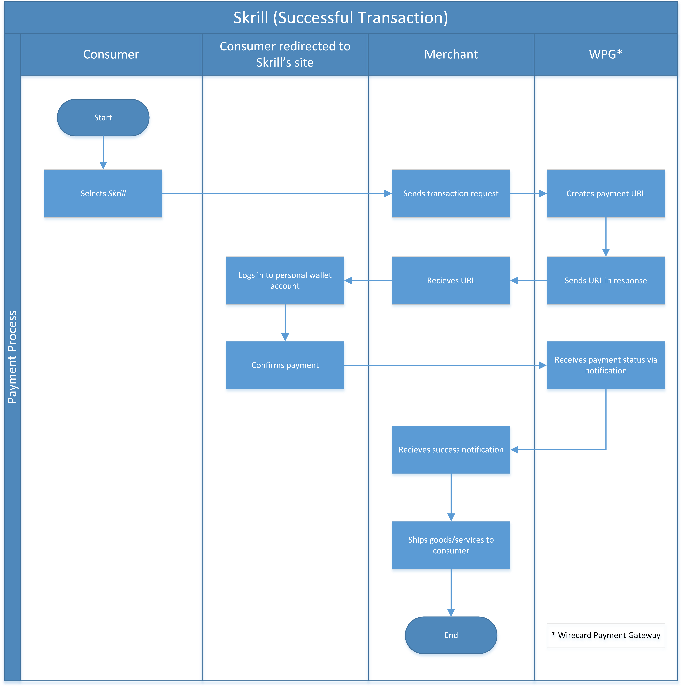

[#SkrillDigitalWallet]
=== Skrill Digital Wallet

[#SkrillDigitalWallet_Introduction]
==== Introduction
[.clearfix]
--
[.right]

_Skrill Digital Wallet_ is an online wallet payment solution available
worldwide. It allows users to make instant payments and money transfers
online. _Skrill Digital Wallet’s_ worldwide payment network offers
merchants access to over 100 payment options in over 200
countries/territories and supports more than 40 currencies. Over 135,000
merchants use _Skrill Digital Wallet’s_ payment service including global
partners.
--

The transaction type within the request must be _get-url_. If the
request is successful the _Forward-URL_ to the Landing-Page of the
wallet provider will be sent in the response. The _debit_ notification
allows a merchant to receive the final status of a payment as soon as
Wirecard receives it from the 3^rd^ party. Usually, this status is
received within seconds of the completion of the transaction, however,
may take up to a few days depending on the respective payment method.

Once Wirecard has received a _debit_ notification from the 3^rd^ party
about the final status of the transaction this status will be
communicated to the merchant via an
<<GeneralPlatformFeatures_IPN, Instant Payment Notification>>.

In case the merchant has not received a notification within 40 minutes
the merchant may request the status of the transaction by sending a
"<<GeneralPlatformFeatures_RetrieveTransaction_TransactionID, Retrieve Transaction by Transaction ID>>" or
"<<GeneralPlatformFeatures_RetrieveTransaction_RequestID, Retrieve Transaction by Request ID>>".

[#SkrillDigitalWallet_FlexibleSplitGateway]
===== Flexible Split Gateway

If the merchant would like to offer or suggest other payment methods to
the consumer inside the _Skrill Digital Wallet_ (e.g. the consumer's
wallet balance is not enough to pay for the goods or services) the
merchant's _Skrill Digital Wallet_ account must be activated for the
Flexible Split Gateway. In case the merchant has specified a payment
method in the payment request, it is pre-selected for the consumer upon
registration or log in.

[NOTE]
====
- All other payment methods enabled for the merchant for the consumer's
registration country will also be visible and available for the consumer
upon login.
- If the payment method chosen by the consumer on the merchant's website
is not supported by the consumer's registration country, a message will
appear indicating the payment type is not supported. All other available
payment methods for the consumer's registration country will be
displayed instead.

//-
====

If the Flexible Split Gateway is activated and the consumer can also
choose other payment methods within _Skrill Digital Wallet_, _debit-returns_ may occur (e.g. for Credit Card or Direct
Debit). The merchant will be notified of this _debit-return_ through an
<<GeneralPlatformFeatures_IPN, Instant Payment Notification>>.

[#SkrillDigitalWallet_GeneralInformation]
==== General Information

[#SkrillDigitalWallet_GeneralInformation_PaymentMode]
===== Payment Mode, Countries and Currencies

This table illustrates which payment mode _Skrill Digital Wallet_ belongs to.
It also provides detailed information about the
countries and currencies which are relevant for _Skrill Digital Wallet_.

[cols="1h,2", stripes="none"]
[%autowidth]
|===
|Payment Mode | <<PaymentMethods_PaymentMode_Wallet, Wallet>>
|Countries | Worldwide
|Currencies | Please <<ContactUs, contact merchant support>> for Currencies.
|===

[#SkrillDigitalWallet_GeneralInformation_CommunicationFormats]
===== Communication Formats

This table illustrates how _Skrill Digital Wallet_ notifications are
encoded and which formats and methods can be used for requests and
responses.

[%autowidth]
|===
.2+h| Requests/Responses | Format   | XML
                         | Methods  | POST
   h| IPN Encodement   2+| Please follow the instructions given at <<GeneralPlatformFeatures_IPN_NotificationExamples,Instant Payment Notification>> to set up IPN.
|===

[#SkrillDigitalWallet_TransactionTypes]
==== Transaction Types

For <<Glossary_TransactionType, transaction type>> details which are not given here look at <<AppendixB, Appendix B: Transaction Types>>.

[%autowidth]
|===
|Transaction Type |Description |Link to the samples

|_get-url_
|A step in a group of transactions where the provider or bank's URL is retrieved for the Account Holder to be redirected to.
|<<SkrillDigitalWallet_Samples_geturl, _get-url_ samples>>

|_debit_
|Moves funds from consumer to the merchant. Received in notification after _get-url_ request
| 

|_credit_
|Moves funds from the merchant to the consumer
|<<SkrillDigitalWallet_Samples_credit, _credit_ samples>>
|===

[#SkrillDigitalWallet_TestCredentials]
==== Test Credentials

[%autowidth]
|===
h|URL (Endpoint)               | ``\https://{test-instance-hostname}/engine/rest/paymentmethods/``
h| Merchant Account ID (MAID)  | f7bb4ccc-1acb-48d2-99e6-ba962bb0b74d
h| Username                    | 70000-APITEST-AP
h| Password                    | qD2wzQ_hrc!8
h| Secret Key                  | e9531d9d-fa88-47f9-aa5d-bcfd5f6bbc9e
|===

[#SkrillDigitalWallet_Workflow]
==== Workflow

. The consumer initiates a payment.
. The merchant redirects the consumer to the _Skrill Digital Wallet_
site.
. The consumer logs in to wallet account.
. The consumer confirms the payment.
. _Skrill Digital Wallet_ redirects the consumer to the merchant's
success/failure page (depending on notification's content).

//-

[#SkrillDigitalWallet_Fields]
==== Fields

The following elements are mandatory (M), optional (O) or conditional
\(C) for sending a request/response for the payment method _Skrill Digital Wallet_:

[%autowidth]
|===
|Field |Request |Response |Notification |Data Type |Size |Description

|_merchant-account-id_                  |M |M |M |String   |36   |Unique identifier for a merchant account.
|_transaction-id_                       | |M |M  |String   |36   |The Transaction ID is the unique identifier for a transaction. It is generated by Wirecard.
|_request-id_                           |M |M |M |String   |150  |This is the identification number of the request. It has to be unique for each request.
|_transaction-type_                     |M |M |M |String   |30   |This is the type for a transaction.
|_transaction-state_                    | |M |M  |String   |12   |This is the status of a transaction.
|_completion-time-stamp_                | |M |M  |dateTime |     |This is the timestamp of completion of request.
|_status.code_                          | |M |M  |String   |12   |This is the code of the status of a transaction.
|_status.description_                   | |M |M  |String   |256  |This is the description to the status code of a transaction.
|_status.severity_                      | |M |M  |String   |20   |This field gives information if a status is a warning, an error or an information.
|_statuses.Status_                      | |M |M  |String   |12   |This is the status of a transaction.
|_requested-amount_                     |M |M |M |Decimal  |18,3 |This is the amount of the transaction. The amount of the decimal place is dependent of the currency.
|_parent-transaction-id_                |O |O |O |String   |36   |Transaction ID of the first transaction of a payment.
|_account-holder.email_                 |C |C |C |String   |64   |This is the end-consumer’s Email-Address. It is mandatory if the field
                                                                  wallet-account-id is not sent in the initial request.
|_account-holder.first-Name_            |M |M |M |String   |27   |This is the first name of the end-consumer. The maximum size
                                                                  of first-name and last-name in combination is 27 characters.
|_account-holder.last-Name_             |M |M |M |String   |27   |This is the last name of the end-consumer. The maximum size of
                                                                  first-name and last-name in combination is 27 characters.
|_order-number_                         |M |M |M |String   |64   |This is the order number of the merchant.
|_order-Detail_                         |O |O |O |String  |65535 |This is a field for details of an order filled by the merchant.
|_descriptor_                           |M |M |M |String   |27   |Description on the settlement of the account holder’s account about a
                                                                  transaction. The following characters are allowed: umlaut, -
                                                                  '0-9','a-z','A-Z',' ' , '+',',','-','.'
|_notifications.notification@url_       |O |O |O |String   |256  |The URL to be used for the Instant Payment Notification. It overwrites
                                                                  the notification URL that is set up in the merchant configuration.
|_payment-methods.payment-method-Name_  |M |M |M |String   |15   |This is the name of the payment method. For _Skrill Digital Wallet_ it is "skrill".
|_api-id_                               |  |  |M |String   |     |The API id is always returned in the notification. For _Skrill Digital
                                                                  Wallet_ it is “---“
|_processing-redirect-URL_              |O |O |O |String   |256  |The URL to which the consumer will be redirected after he has fulfilled
                                                                  his payment. This is normally a page on the merchant’s website.
|_cancel-redirect-URL_                  |M |M |M |String   |256  |The URL to which the consumer will be re-directed after he has cancelled
                                                                  a payment. This is normally a page on the merchant’s Website.
|_success-redirect-URL_                 |O |O |O |String   |256  |The URL to which the consumer will be re-directed after a successful
                                                                  payment. This is normally a success confirmation page on the merchant’s website.
|_locale_                               |M |M |M |String   |6    |Code of the language. Can be any of CZ, DA, EN, DE, ES, FI, FR, IT, NL,
                                                                  PL, GR, RO, RU, SV and TR. +
                                                                  Can be sent in the format <language> or in the format <language_country>.
|_wallet-account-id_                    |C |C |C |String   |50   |The unique identifier of the Account Holder's Wallet Account. +
                                                                  It is mandatory if the field ``account-holder.email`` is not sent in the initial request.
|_settlement.gross-amount_              |  |M |  |decimal  |18,3 |The amount due to the Merchant Account for this Payment, in the Payment
                                                                  Settlement Currency, gross of rates, fees, and reserve. The amount of
                                                                  the decimal place is dependent of the currency.
|_settlement.currency_                  |  |M |  |String   |3    |The currency in which the Merchant Account can expect his Payment
                                                                  Settlement Amount.
|_Signature_                            |  |  |M |String   |     |The Signature info, consisting of SignedInfo, SignatureValue and KeyInfo.
|===

[#SkrillDigitalWallet_Samples]
==== Samples

Go to <<GeneralPlatformFeatures_IPN_NotificationExamples, Notification Examples>>, if you want to see corresponding notification samples.

[#SkrillDigitalWallet_Samples_geturl]
===== _get-url_

.XML Get-Url Request (Successful)
[source,xml,subs=attributes+]
----
<?xml version="1.0" encoding="UTF-8"?>
<payment xmlns="http://www.elastic-payments.com/schema/payment">
   <merchant-account-id>45491d10-15c7-4f4c-b95f-d54b0fb7e7a3</merchant-account-id>
   <request-id>2db38df2-223e-43c3-b626-16755de59794</request-id>
   <transaction-type>get-url</transaction-type>
   <requested-amount currency="EUR">10.01</requested-amount>
   <account-holder>
       <email>john.doe@exampleemail.com</email>
       <first-name>John</first-name>
       <last-name>Doe</last-name>
   </account-holder>
   <payment-methods><payment-method name="skrill"/></payment-methods>
   <locale>de_DE</locale>
   <descriptor>Item #32021</descriptor>
   <order-number>4509334</order-number>
   <cancel-redirect-url>https://{pp-redirect-url-cancel}</cancel-redirect-url>
</payment>
----

.XML Get-Url Response (Successful)
[source,xml,subs=attributes+]
----
<?xml version="1.0" encoding="UTF-8" standalone="yes"?>
<payment xmlns="http://www.elastic-payments.com/schema/payment" xmlns:ns2="http://www.elastic-payments.com/schema/epa/transaction">
   <merchant-account-id>45491d10-15c7-4f4c-b95f-d54b0fb7e7a3</merchant-account-id>
   <transaction-id>4ff79620-0493-45df-8aab-931da0764ff5</transaction-id>
   <request-id>2db38df2-223e-43c3-b626-16755de59794</request-id>
   <transaction-type>get-url</transaction-type>
   <transaction-state>success</transaction-state>
   <completion-time-stamp>2018-04-12T15:21:10.000Z</completion-time-stamp>
   <statuses>
      <status code="201.0000" description="The resource was successfully created." severity="information"/>
   </statuses>
   <requested-amount currency="EUR">10.01</requested-amount>
   <account-holder>
      <first-name>John</first-name>
      <last-name>Doe</last-name>
      <email>john.doe@exampleemail.com</email>
   </account-holder>
   <order-number>4509334</order-number>
   <descriptor>Item #32021</descriptor>
   <payment-methods>
      <payment-method url="http://api.wirecard.sys:9301/skrill/debit.pl?sid=cde1b594552a4adf8e7f91d3673256af" name="skrill"/>
   </payment-methods>
   <cancel-redirect-url>https://{pp-redirect-url-cancel}</cancel-redirect-url>
   <locale>de_DE</locale>
</payment>
----

[#SkrillDigitalWallet_Samples_geturlWalletAccountID]
===== _get-url_ with Wallet Account ID

.XML Get-Url Request - Using a Wallet Account ID (Failure)

[source,xml,subs=attributes+]
----
<?xml version="1.0" encoding="UTF-8"?>
<payment xmlns="http://www.elastic-payments.com/schema/payment">
   <merchant-account-id>45491d10-15c7-4f4c-b95f-d54b0fb7e7a3</merchant-account-id>
   <request-id>273c973b-07ff-42dc-a406-eaca29ef37e7</request-id>
   <transaction-type>get-url</transaction-type>
   <requested-amount currency="EUR">10.01</requested-amount>
   <account-holder>
       <email>john.doe@exampleemail.com</email>
       <first-name>John</first-name>
       <last-name>Doe</last-name>
   </account-holder>
   <wallet>
        <account-id>skrill.email@exampleemail.com</account-id>
   </wallet>
   <payment-methods><payment-method name="skrill"/></payment-methods>
   <locale>de_DE</locale>
   <descriptor>USB 12345</descriptor>
   <order-number>4502334</order-number>
   <cancel-redirect-url>https://{pp-redirect-url-cancel}</cancel-redirect-url>
</payment>
----

.XML Get-Url Response - Incorrect Wallet Account ID (Failure)
[source,xml,subs=attributes+]
----
<payment xmlns="http://www.elastic-payments.com/schema/payment" xmlns:ns2="http://www.elastic-payments.com/schema/epa/transaction">
   <merchant-account-id>45491d10-15c7-4f4c-b95f-d54b0fb7e7a3</merchant-account-id>
   <transaction-id>14aa26e8-f87a-4ff2-8de4-c5b65c507c5f</transaction-id>
   <request-id>273c973b-07ff-42dc-a406-eaca29ef37e7</request-id>
   <transaction-type>get-url</transaction-type>
   <transaction-state>failed</transaction-state>
   <completion-time-stamp>2018-04-12T15:24:54.000Z</completion-time-stamp>
   <statuses>
      <status code="500.1099" description="Transaction processing refused.  Please contact technical support." severity="error"/>
   </statuses>
   <requested-amount currency="EUR">10.01</requested-amount>
   <account-holder>
      <first-name>John</first-name>
      <last-name>Doe</last-name>
      <email>john.doe@exampleemail.com</email>
   </account-holder>
   <descriptor>USB 12345</descriptor>
   <order-number>4502334</order-number>
   <payment-methods>
      <payment-method name="skrill"/>
   </payment-methods>
   <cancel-redirect-url>https://{pp-redirect-url-cancel}</cancel-redirect-url>
   <locale>de_DE</locale>
   <wallet>
      <account-id>skrill.email@exampleemail.com</account-id>
   </wallet>
</payment>
----

[#SkrillDigitalWallet_Samples_credit]
===== _credit_

.XML Credit Request (Successful)
[source,xml]
----
<?xml version="1.0" encoding="UTF-8"?>
<payment xmlns="http://www.elastic-payments.com/schema/payment">
   <merchant-account-id>45491d10-15c7-4f4c-b95f-d54b0fb7e7a3</merchant-account-id>
   <request-id>a7b97021-954e-43af-b9a4-8d7ecfcfcb3a</request-id>
   <transaction-type>credit</transaction-type>
   <requested-amount currency="EUR">100.01</requested-amount>
   <wallet>
       <account-id>john.doe@exampleemail.com</account-id>
   </wallet>
   <payment-methods>
       <payment-method name="skrill"/>
   </payment-methods>
   <descriptor>Lottery Win #12312444</descriptor>
   <order-number>4509424</order-number>
</payment>
----

.XML Credit Response (Successful)
[source,xml]
----
<?xml version="1.0" encoding="UTF-8"?>
<payment xmlns="http://www.elastic-payments.com/schema/payment" xmlns:ns2="http://www.elastic-payments.com/schema/epa/transaction">
   <merchant-account-id>45491d10-15c7-4f4c-b95f-d54b0fb7e7a3</merchant-account-id>
   <transaction-id>97d03e1d-1f9c-4934-a480-f208e77c4c25</transaction-id>
   <request-id>a7b97021-954e-43af-b9a4-8d7ecfcfcb3a</request-id>
   <transaction-type>credit</transaction-type>
   <transaction-state>success</transaction-state>
   <completion-time-stamp>2018-04-13T07:11:46.000Z</completion-time-stamp>
   <statuses>
      <status code="200.0000" description="The request completed successfully." severity="information"/>
   </statuses>
   <requested-amount currency="EUR">100.01</requested-amount>
   <order-number>4509424</order-number>
   <descriptor>Lottery Win #12312444</descriptor>
   <payment-methods>
      <payment-method name="skrill"/>
   </payment-methods>
   <wallet>
      <account-id>john.doe@exampleemail.com</account-id>
   </wallet>
   <settlement>
      <gross-amount>100.01</gross-amount>
      <currency>EUR</currency>
   </settlement>
</payment>
----
