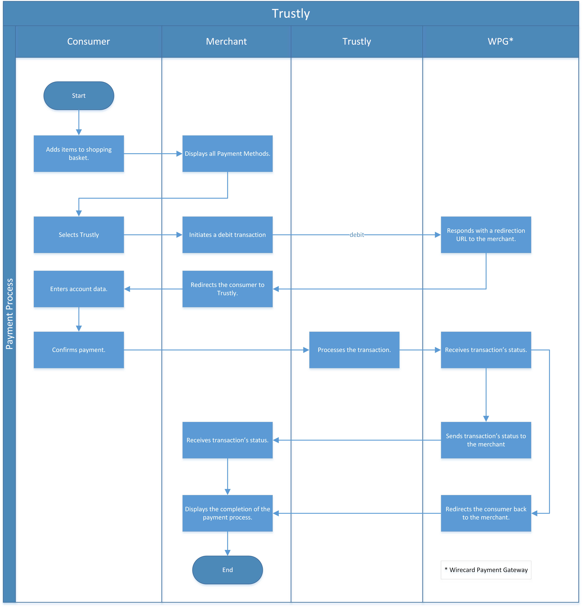

[#Trustly]
=== Trustly

[#Trustly_Introduction]
==== Introduction

_Trustly_ is a European online payment provider authorized as a Swedish
payment institution. _Trustly_ provides cross-border payment services
within the EU/EEA. _Trustly_ is an electronic fund transfer and direct
debit solution.

By signing just one agreement, a merchant can accept payments and
transfers from bank accounts in 29 European countries
(see <<Trustly_GeneralInformation_PaymentMode, Payment Mode, Countries and Currencies>>)
and reach more consumers at no
additional cost.

Consumers can pay from the account of their choice, using their familiar
banking login details. To participate in _Trustly's_ payment processes,
consumers are required to pass their banking credentials to _Trustly_,
which performs the transaction on the consumer's behalf.

[#Trustly_GeneralInformation]
==== General Information

[#Trustly_GeneralInformation_PaymentMode]
===== Payment Mode, Countries and Currencies

This table illustrates which payment mode _Trustly_ belongs to. It also
provides detailed information about the countries and currencies which
are relevant for _Trustly_.

[cols="20h,80"]
|===
| Payment Mode |<<PaymentMethods_PaymentMode_OnlineBankTransfer, Online Bank Transfer>>
|Countries | _debit_, _refund-debit_ and _credit_: +
AT, BE, BG, HR, CY, CZ, DK, EE, FI, DE, HU, IE, IT, LV, LT, MT, NL, NO,
PL, PT, RO, SK, SI, ES, SE, UK +

_refund-debit_ only: +
FR, GR, LU
|Currencies | Please <<ContactUs, contact merchant support>> for Currencies.
|===

[#Trustly_GeneralInformation_CommunicationFormats]
===== Communication Formats

This table illustrates how _Trustly_ notifications are encoded and which
formats and methods can be used for requests and responses.

[cols="20,20,60"]
|===
.2+h| Requests/Responses | Format | XML, NVP
                        | Methods | POST, GET
h| IPN Encodement     2+| Please follow the instructions given at
<<GeneralPlatformFeatures_IPN, Instant Payment Notification>> to set up IPN.
|===

[#Trustly_TransactionTypes]
==== Transaction Types

For <<Glossary_TransactionType, transaction type>> details which are not given here look
at <<AppendixB, Appendix B: Transaction Types>>.

[cols="25,85"]
|===
|Transaction Type | Link to the Samples

| _debit_ | REST API <<Trustly_Samples_RestApi_debit, _debit_ samples>> +
Payment Page <<Trustly_Samples_PP_debit, _debit_ samples>>
| _refund-debit_ | <<Trustly_Samples_RestApi_refunddebit, _refund-debit_ samples>>
| _credit_ | <<Trustly_Samples_RestApi_credit, _credit_ samples>>
|===

[#Trustly_TestCredentials]
==== Test Credentials

[cols="30h,30,40"]
|===
.2+|URLs (Endpoints) |For transaction types _debit_ and _credit_  | ``\https://api-test.wirecard.com/engine/rest/paymentmethods/``
                     | For transaction type _refund-debit_ | ``\https://api-test.wirecard.com/engine/rest/payments/``
|Merchant Account ID (MAID) 2+| d6aefe18-a0a0-4143-bd38-4a350b5e97f5
|Username 2+|16390-testing
|Password 2+|3!3013=D3fD8X7
|Secret Key |6508537f-c681-4535-ac77-bed80895a19f
|===

[#Trustly_TestCredentials_Additional]
===== Additional test credentials on _Trustly's_ environment
[%autowidth]
|===
h|Bank account credentials |Select Sweden (SWED Bank) and use 1111111111
|===

[#Trustly_Workflow]
==== Workflow

. Consumer adds items to his shopping chart.
. The merchant displays all available payment methods.
. Consumer selects _Trustly_.
. The merchant initiates a debit transaction to WPPG.
. WPPG sends a redirection URL to the merchant.
. The merchant redirects the consumer to _Trustly_.
. The consumer enters his account data and confirms the payment.
. _Trustly_ processes the transaction.
. WPPG receives the transaction status.
. WPPG sends the transaction status to the merchant and redirects the
consumer back to the merchant's web site.
. The merchant receives the transaction status and displays the
outcome to the consumer.

//-

[#Trustly_Fields]
==== Fields

The fields used for _Trustly_ requests, responses and notifications are
the same as the REST API Fields. Please refer to:
<<RestApi_Fields, REST API Fields>>.

[#Trustly_Samples]
==== Samples

[#Trustly_Samples_RestApi]
===== REST API

For XML we do not list any notification samples. Go to
<<GeneralPlatformFeatures_IPN_NotificationExamples, Notification Examples>>, if you want to see corresponding notification samples.

[#Trustly_Samples_RestApi_debit]
====== debit

.XML debit Request (Successful)
[source,xml]
----
<?xml version="1.0" encoding="utf-8"?>
<payment xmlns="http://www.elastic-payments.com/schema/payment">
    <merchant-account-id>d6aefe18-a0a0-4143-bd38-4a350b5e97f5</merchant-account-id>
    <request-id>f3414e35-0cc7-4e88-bd16-15f4e876a8e4</request-id>
    <transaction-type>debit</transaction-type>
    <requested-amount currency="EUR">1.23</requested-amount>
    <account-holder>
        <first-name>John</first-name>
        <last-name>Doe</last-name>
        <email>John.Doe@test.com</email>
        <phone>+000 000 000 000</phone>
        <address>
            <street1>Test Street 123</street1>
            <city>Test City</city>
            <state>BY</state>
            <country>DE</country>
        </address>
    </account-holder>
    <payment-methods>
        <payment-method name="trustly" />
    </payment-methods>
    <ip-address>127.0.0.1</ip-address>
    <cancel-redirect-url>https://demoshop-test.wirecard.com/demoshop/#!/cancel</cancel-redirect-url>
    <success-redirect-url>https://demoshop-test.wirecard.com/demoshop/#!/success</success-redirect-url>
    <fail-redirect-url>https://demoshop-test.wirecard.com/demoshop/#!/error</fail-redirect-url>
</payment>
----

.XML debit Response (Successful)
[source,xml]
----
<?xml version="1.0" encoding="utf-8" standalone="yes"?>
<payment xmlns="http://www.elastic-payments.com/schema/payment" xmlns:ns2="http://www.elastic-payments.com/schema/epa/transaction">
   <merchant-account-id>d6aefe18-a0a0-4143-bd38-4a350b5e97f5</merchant-account-id>
   <transaction-id>6e728c0f-dc40-46d2-8f67-db2282020b11</transaction-id>
   <request-id>f3414e35-0cc7-4e88-bd16-15f4e876a8e4</request-id>
   <transaction-type>debit</transaction-type>
   <transaction-state>success</transaction-state>
   <completion-time-stamp>2018-10-08T07:13:50.000Z</completion-time-stamp>
   <statuses>
      <status code="201.0000" description="The resource was successfully created." severity="information" />
   </statuses>
   <requested-amount currency="EUR">1.23</requested-amount>
   <account-holder>
      <first-name>John</first-name>
      <last-name>Doe</last-name>
      <email>John.Doe@test.com</email>
      <phone>+000 000 000 000</phone>
      <address>
         <street1>Test Street 123</street1>
         <city>Test City</city>
         <state>BY</state>
         <country>DE</country>
      </address>
   </account-holder>
   <ip-address>127.0.0.1</ip-address>
   <payment-methods>
      <payment-method url="https://test.trustly.com/_/orderclient.php?SessionID=d56246b1-e1d8-4a50-8258-b6435a727ec4&amp;OrderID=1608710411&amp;Locale=en" name="trustly" />
   </payment-methods>
   <cancel-redirect-url>https://demoshop-test.wirecard.com/demoshop/#!/cancel</cancel-redirect-url>
   <fail-redirect-url>https://demoshop-test.wirecard.com/demoshop/#!/error</fail-redirect-url>
   <success-redirect-url>https://demoshop-test.wirecard.com/demoshop/#!/success</success-redirect-url>
</payment>
----

.XML debit Request (Failed)
[source,xml]
----
<?xml version="1.0" encoding="utf-8"?>
<payment xmlns="http://www.elastic-payments.com/schema/payment">
    <merchant-account-id>d6aefe18-a0a0-4143-bd38-4a350b5e97f5</merchant-account-id>
    <request-id>7b56abcd-a4d1-47c1-81fd-e40b3ab46c12</request-id>
    <transaction-type>debit</transaction-type>    <account-holder>
        <first-name>John</first-name>
        <last-name>Doe</last-name>
        <email>John.Doe@test.com</email>
        <phone>+000 000 000 000</phone>
        <address>
            <street1>Test Street 123</street1>
            <city>Test City</city>
            <state>BY</state>
            <country>DE</country>
        </address>
    </account-holder>
    <payment-methods>
        <payment-method name="trustly" />
    </payment-methods>
    <ip-address>127.0.0.1</ip-address>
    <cancel-redirect-url>https://demoshop-test.wirecard.com/demoshop/#!/cancel</cancel-redirect-url>
    <success-redirect-url>https://demoshop-test.wirecard.com/demoshop/#!/success</success-redirect-url>
    <fail-redirect-url>https://demoshop-test.wirecard.com/demoshop/#!/error</fail-redirect-url>
</payment>
----

.XML debit Response (Failed)
[source,xml]
----
<?xml version="1.0" encoding="utf-8" standalone="yes"?>
<payment xmlns="http://www.elastic-payments.com/schema/payment" xmlns:ns2="http://www.elastic-payments.com/schema/epa/transaction">
   <merchant-account-id>d6aefe18-a0a0-4143-bd38-4a350b5e97f5</merchant-account-id>
   <request-id>7b56abcd-a4d1-47c1-81fd-e40b3ab46c12</request-id>
   <transaction-type>debit</transaction-type>
   <transaction-state>failed</transaction-state>
   <statuses>
      <status code="400.1011" description="The Requested Amount has not been provided.  Please check your input and try again." severity="error" />
   </statuses>
   <account-holder>
      <first-name>John</first-name>
      <last-name>Doe</last-name>
      <email>John.Doe@test.com</email>
      <phone>+000 000 000 000</phone>
      <address>
         <street1>Test Street 123</street1>
         <city>Test City</city>
         <state>BY</state>
         <country>DE</country>
      </address>
   </account-holder>
   <ip-address>127.0.0.1</ip-address>
   <payment-methods>
      <payment-method name="trustly" />
   </payment-methods>
   <cancel-redirect-url>https://demoshop-test.wirecard.com/demoshop/#!/cancel</cancel-redirect-url>
   <fail-redirect-url>https://demoshop-test.wirecard.com/demoshop/#!/error</fail-redirect-url>
   <success-redirect-url>https://demoshop-test.wirecard.com/demoshop/#!/success</success-redirect-url>
</payment>
----

[#Trustly_Samples_RestApi_refunddebit]
====== refund-debit

.XML refund-debit Request (Successful)
[source,xml]
----
<?xml version="1.0" encoding="utf-8" standalone="yes"?>
<payment xmlns="http://www.elastic-payments.com/schema/payment">
    <merchant-account-id>d6aefe18-a0a0-4143-bd38-4a350b5e97f5</merchant-account-id>
    <request-id>3e02ee61-c873-4ae9-b5cf-cb67b0d4dbfa</request-id>
    <transaction-type>refund-debit</transaction-type>
    <parent-transaction-id>f62e46b7-2f44-47c3-8a41-f11af76e81be</parent-transaction-id>
</payment>
----

.XML refund-debit Response (Successful)
[source,xml]
----
<?xml version="1.0" encoding="utf-8" standalone="yes"?>
<payment xmlns="http://www.elastic-payments.com/schema/payment" xmlns:ns2="http://www.elastic-payments.com/schema/epa/transaction" self="https://api-test.wirecard.com:443/engine/rest/merchants/d6aefe18-a0a0-4143-bd38-4a350b5e97f5/payments/78b831fe-89c1-47bb-a1f0-c9653d0cc25a">
   <merchant-account-id ref="https://api-test.wirecard.com:443/engine/rest/config/merchants/d6aefe18-a0a0-4143-bd38-4a350b5e97f5">d6aefe18-a0a0-4143-bd38-4a350b5e97f5</merchant-account-id>
   <transaction-id>78b831fe-89c1-47bb-a1f0-c9653d0cc25a</transaction-id>
   <request-id>3e02ee61-c873-4ae9-b5cf-cb67b0d4dbfa</request-id>
   <transaction-type>refund-debit</transaction-type>
   <transaction-state>success</transaction-state>
   <completion-time-stamp>2018-10-08T07:18:04.000Z</completion-time-stamp>
   <statuses>
      <status code="201.0000" description="trustly:The resource was successfully created." severity="information" />
   </statuses>
   <requested-amount currency="SEK">12.86</requested-amount>
   <parent-transaction-id>f62e46b7-2f44-47c3-8a41-f11af76e81be</parent-transaction-id>
   <account-holder>
      <first-name>John</first-name>
      <last-name>Doe</last-name>
      <email>John.Doe@test.com</email>
      <phone>+000 000 000 000</phone>
      <address>
         <street1>Test Street 123</street1>
         <city>Test City</city>
         <state>BY</state>
         <country>DE</country>
      </address>
   </account-holder>
   <ip-address>127.0.0.1</ip-address>
   <payment-methods>
      <payment-method name="trustly" />
   </payment-methods>
   <parent-transaction-amount currency="SEK">12.860000</parent-transaction-amount>
   <api-id>elastic-api</api-id>
   <cancel-redirect-url>https://demoshop-test.wirecard.com/demoshop/#!/cancel</cancel-redirect-url>
   <fail-redirect-url>https://demoshop-test.wirecard.com/demoshop/#!/error</fail-redirect-url>
   <success-redirect-url>https://demoshop-test.wirecard.com/demoshop/#!/success</success-redirect-url>
   <iso>
      <pos-transaction-time>071804</pos-transaction-time>
      <pos-transaction-date>1008</pos-transaction-date>
   </iso>
   <provider-account-id>00000031745B4126</provider-account-id>
</payment>
----

[#Trustly_Samples_RestApi_credit]
====== credit

.XML credit Request (Successful)
[source,xml]
----
<?xml version="1.0" encoding="utf-8"?>
<payment xmlns="http://www.elastic-payments.com/schema/payment">
   <merchant-account-id>d6aefe18-a0a0-4143-bd38-4a350b5e97f5</merchant-account-id>
   <request-id>d396d7e8-a431-40bc-988e-3f75b13b8869</request-id>
   <transaction-type>credit</transaction-type>
   <requested-amount currency="SEK">4.44</requested-amount>
   <account-holder>
      <first-name>John</first-name>
      <last-name>Doe</last-name>
      <email>John.Doe@test.com</email>
      <phone>+000 000 000 000</phone>
      <address>
         <street1>Test Street 123</street1>
         <city>Test City</city>
         <state>BY</state>
         <country>DE</country>
      </address>
   </account-holder>
   <payment-methods>
      <payment-method name="trustly" />
   </payment-methods>
   <ip-address>127.0.0.1</ip-address>
   <cancel-redirect-url>https://demoshop-test.wirecard.com/demoshop/#!/cancel</cancel-redirect-url>
   <success-redirect-url>https://demoshop-test.wirecard.com/demoshop/#!/success</success-redirect-url>
   <fail-redirect-url>https://demoshop-test.wirecard.com/demoshop/#!/error</fail-redirect-url>
</payment>
----

.XML credit Response (Successful)
[source,xml]
----
<?xml version="1.0" encoding="utf-8" standalone="yes"?>
<payment xmlns="http://www.elastic-payments.com/schema/payment" xmlns:ns2="http://www.elastic-payments.com/schema/epa/transaction">
   <merchant-account-id>d6aefe18-a0a0-4143-bd38-4a350b5e97f5</merchant-account-id>
   <transaction-id>585e6d01-c417-4b28-9f8d-aa77d67e2787</transaction-id>
   <request-id>d396d7e8-a431-40bc-988e-3f75b13b8869</request-id>
   <transaction-type>credit</transaction-type>
   <transaction-state>success</transaction-state>
   <completion-time-stamp>2018-10-08T07:22:18.000Z</completion-time-stamp>
   <statuses>
      <status code="201.0000" description="The resource was successfully created." severity="information" />
   </statuses>
   <requested-amount currency="SEK">4.44</requested-amount>
   <account-holder>
      <first-name>John</first-name>
      <last-name>Doe</last-name>
      <email>John.Doe@test.com</email>
      <phone>+000 000 000 000</phone>
      <address>
         <street1>Test Street 123</street1>
         <city>Test City</city>
         <state>BY</state>
         <country>DE</country>
      </address>
   </account-holder>
   <ip-address>127.0.0.1</ip-address>
   <payment-methods>
      <payment-method url="https://test.trustly.com/_/orderclient.php?SessionID=b0e99791-7cb1-4fc9-af51-b3ca7bcdf26b&amp;OrderID=1601198795&amp;Locale=en" name="trustly" />
   </payment-methods>
   <cancel-redirect-url>https://demoshop-test.wirecard.com/demoshop/#!/cancel</cancel-redirect-url>
   <fail-redirect-url>https://demoshop-test.wirecard.com/demoshop/#!/error</fail-redirect-url>
   <success-redirect-url>https://demoshop-test.wirecard.com/demoshop/#!/success</success-redirect-url>
</payment>
----

[#Trustly_Samples_PP]
===== Payment Page

[#Trustly_Samples_PP_debit]
====== debit

This request opens the Payment Page.

.NVP debit Request (Successful)
[source]
----
requested_amount=1.01&requested_amount_currency=SEK&locale=en&order_number=123456&order_detail=1+widget&form_url=http%3A%2F%2F10.0.0.114%3A8080%2Fengine%2Fhpp%2F&secret_key=c50a8e09-0648-4d2c-b638-2c14fc7606bc&request_id=32422d37-114a-657e-5403-a6b920d06c1c&request_time_stamp=20180516205251&merchant_account_id=d9d234ad-8c36-4dba-bcab-ff4d0c672f47&payment_method=trustly&transaction_type=debit&redirect_url=http%3A%2F%2F10.0.0.114%3A8080%2Fshop%2Fcomplete.jsp%3Fstate%3Dsuccess%26&ip_address=127.0.0.1&request_signature=9bf7e3c3415f227df1a584b3cb9ba6ebe32e659cbf6f9e2cf0a0a36b52ab3bbc&psp_name=demo&attempt_three_d=false&descriptor=&notification_url=&notification_transaction_state=&success_redirect_url=http%3A%2F%2F10.0.0.114%3A8080%2Fshop%2Fcomplete.jsp%3Fstate%3Dsuccess%26&fail_redirect_url=http%3A%2F%2F10.0.0.114%3A8080%2Fshop%2Fcomplete.jsp%3Fstate%3Dfailed%26&cancel_redirect_url=http%3A%2F%2F10.0.0.114%3A8080%2Fshop%2Fcomplete.jsp%3Fstate%3Dcancel%26&processing_redirect_url=http%3A%2F%2F10.0.0.114%3A8080%2Fshop%2Fcomplete.jsp%3Fstate%3Dprocessing%26&field_name_1=&field_value_1=&field_name_2=&field_value_2=&field_name_3=&field_value_3=&field_name_4=&field_value_4=&hpp_processing_timeout=&first_name=John&last_name=Doe&email=john.doe%40wirecard.com&phone=1+555+555+5555&street1=123+test&street2=&city=Toronto&state=ON&postal_code=M4P1E8&country=CA
----

This response is sent back to merchant's page.

.NVP debit Response (Successful)
[source]
----
psp_name=demo&country=CA&custom_css_url=&merchant_account_resolver_category=&response_signature=37935fdc2e19b83e2407fea105379bc5de660736a74bb43951dec42495f507a5&city=Toronto&group_transaction_id=&provider_status_code_1=&response_signature_v2=SFMyNTYKdHJhbnNhY3Rpb25faWQ9MWU1NTVjOTQtMzdjYi00Yjg5LWFkOGMtNDUxMmZmOTIyYzI1CmNvbXBsZXRpb25fdGltZXN0YW1wPTIwMTgwNTE2MjA1MzAwCm1hc2tlZF9hY2NvdW50X251bWJlcj0KdG9rZW5faWQ9CmF1dGhvcml6YXRpb25fY29kZT0KbWVyY2hhbnRfYWNjb3VudF9pZD1kOWQyMzRhZC04YzM2LTRkYmEtYmNhYi1mZjRkMGM2NzJmNDcKdHJhbnNhY3Rpb25fc3RhdGU9c3VjY2VzcwppcF9hZGRyZXNzPTEyNy4wLjAuMQp0cmFuc2FjdGlvbl90eXBlPWRlYml0CnJlcXVlc3RfaWQ9MzI0MjJkMzctMTE0YS02NTdlLTU0MDMtYTZiOTIwZDA2YzFjCg%3D%3D.jq78O3ObgFtjPHhVtfH5JUAVi1uE7Ouxw5f%2BuLrG%2F%2FQ%3D&locale=en&requested_amount=100.010000&completion_time_stamp=20180516205300&provider_status_description_1=&authorization_code=&merchant_account_id=d9d234ad-8c36-4dba-bcab-ff4d0c672f47&provider_transaction_reference_id=&street1=123+test&state=ON&first_name=John&email=john.doe%40wirecard.com&payment_method=trustly&transaction_id=1e555c94-37cb-4b89-ad8c-4512ff922c25&provider_transaction_id_1=00f092b8-995c-4055-9566-a598da200dee&status_severity_1=information&last_name=Doe&ip_address=127.0.0.1&transaction_type=debit&status_code_1=201.0000&status_description_1=The+resource+was+successfully+created.&phone=1+555+555+5555&transaction_state=success&requested_amount_currency=EUR&postal_code=M4P1E8&request_id=32422d37-114a-657e-5403-a6b920d06c1c
----

.NVP debit Notification (Successful)
[source]
----
country=CA&merchant_account_resolver_category=&response_signature=37935fdc2e19b83e2407fea105379bc5de660736a74bb43951dec42495f507a5&city=Toronto&group_transaction_id=&provider_status_code_1=&response_signature_v2=SFMyNTYKdHJhbnNhY3Rpb25faWQ9MWU1NTVjOTQtMzdjYi00Yjg5LWFkOGMtNDUxMmZmOTIyYzI1CmNvbXBsZXRpb25fdGltZXN0YW1wPTIwMTgwNTE2MjA1MzAwCm1hc2tlZF9hY2NvdW50X251bWJlcj0KdG9rZW5faWQ9CmF1dGhvcml6YXRpb25fY29kZT0KbWVyY2hhbnRfYWNjb3VudF9pZD1kOWQyMzRhZC04YzM2LTRkYmEtYmNhYi1mZjRkMGM2NzJmNDcKdHJhbnNhY3Rpb25fc3RhdGU9c3VjY2VzcwppcF9hZGRyZXNzPTEyNy4wLjAuMQp0cmFuc2FjdGlvbl90eXBlPWRlYml0CnJlcXVlc3RfaWQ9MzI0MjJkMzctMTE0YS02NTdlLTU0MDMtYTZiOTIwZDA2YzFjCg%3D%3D.jq78O3ObgFtjPHhVtfH5JUAVi1uE7Ouxw5f%2BuLrG%2F%2FQ%3D&locale=en&requested_amount=100.01&completion_time_stamp=20180516205300&provider_status_description_1=&authorization_code=&merchant_account_id=d9d234ad-8c36-4dba-bcab-ff4d0c672f47&provider_transaction_reference_id=&street1=123+test&state=ON&first_name=John&email=john.doe%40wirecard.com&payment_method=trustly&transaction_id=1e555c94-37cb-4b89-ad8c-4512ff922c25&provider_transaction_id_1=00f092b8-995c-4055-9566-a598da200dee&status_severity_1=information&last_name=Doe&ip_address=127.0.0.1&transaction_type=debit&status_code_1=201.0000&status_description_1=trustly%3AThe+resource+was+successfully+created.&phone=1+555+555+5555&transaction_state=success&requested_amount_currency=EUR&postal_code=M4P1E8&request_id=32422d37-114a-657e-5403-a6b920d06c1c&
----
