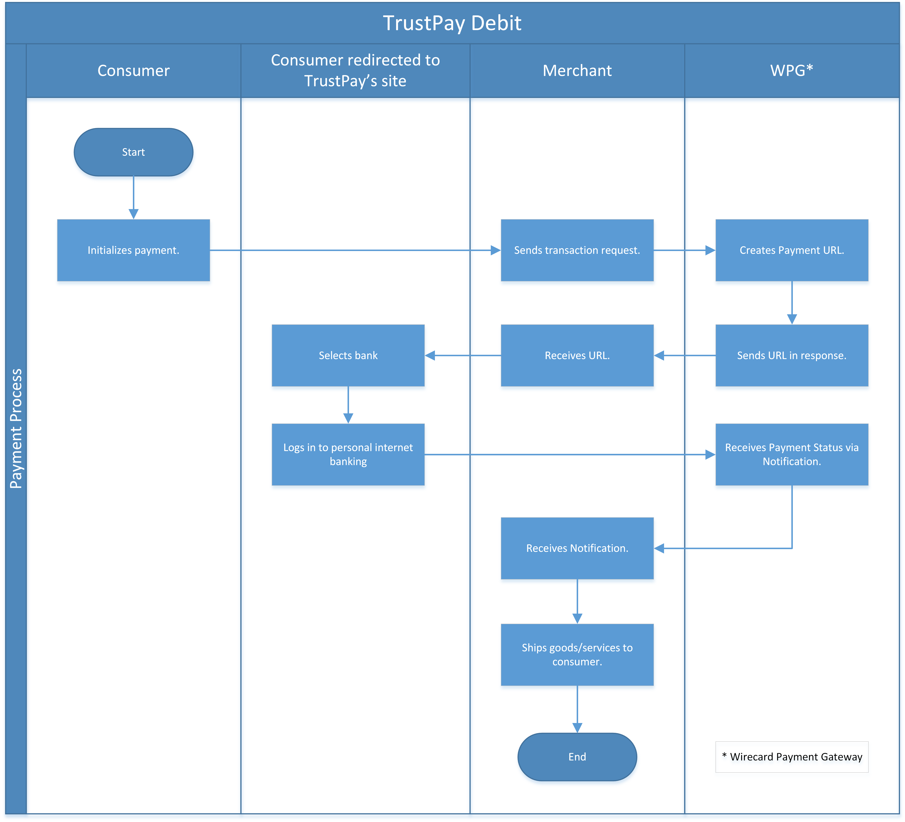
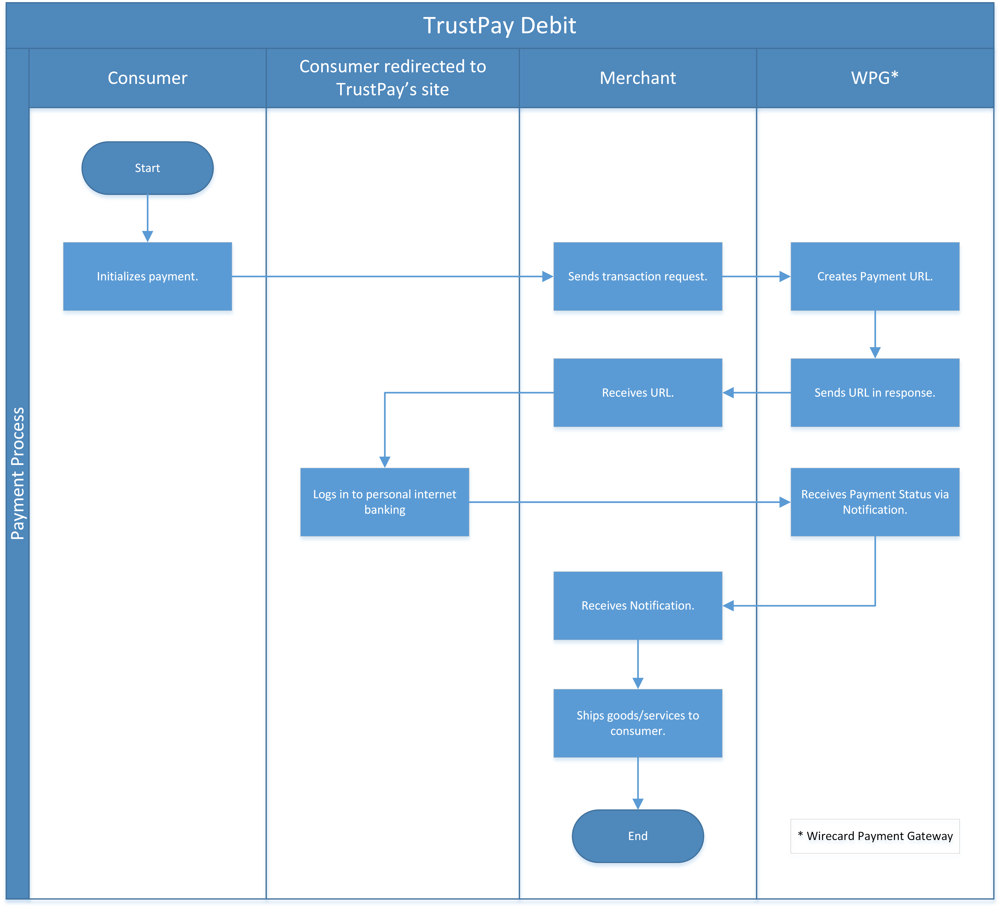

[#TrustPay]
=== TrustPay

[#TrustPay_Introduction]
==== Introduction
[.clearfix]
--
[.right]

_TrustPay_ offers reliable, safe, and fast payment processing not only
for e-commerce merchants. With one single integration of
_TrustPay_, merchants receive instant wire transfer payments from the
consumer. _TrustPay_ is used in Central Eastern Europe.
--

There is no need for the consumer to have a _TrustPay_ account – using
online Banking, the consumer completes an instant wire transfer.

The current flow includes two redirects:

- the consumer is re-directed from the merchant's page to _TrustPay_ to
choose the country of origin and bank. 
- the consumer is then re-directed to the bank's online banking page to
proceed the payment.

//-

[#TrustPay_GeneralInformation]
==== General Information

[#TrustPay_PaymentModeCountriesandCurrencies]
===== Payment Mode, Countries and Currencies

This table illustrates which payment mode _TrustPay_ belongs to. It
also provides detailed information about the countries and currencies
which are relevant for _TrustPay._

[cols="h,"]
|===
| Payment Mode | <<PaymentMethods_PaymentMode_OnlineBankTransfer, Online Bank Transfer>>, <<PaymentMethods_PaymentMode_OfflineBankTransfer, Offline Bank Transfer>> (depends on 3rd party provider/bank)
| Countries    | CZ, SK
| Currencies   | CZK, EUR
|===

[#TrustPay_CommunicationFormats]
===== Communication Formats

This table illustrates how _TrustPay_ notifications are encoded and
which formats and methods can be used for requests and responses.

|===
.2+h| Requests/Responses | Format  | XML
                         | Methods | POST, GET
   h| IPN Encodement   2+| Base64
|===

[#TrustPay_TransactionTypes]
==== Transaction Types

_TrustPay_ uses the two transaction types: <<TrustPay_Samples, debit>>
and ``pending-debit``.
For <<Glossary_TransactionType, transaction type>> details which are not given here, look
at <<AppendixB, Appendix B: Transaction Types>>.

[cols="e,"]
|===
|Transaction Type | Link to the Sample

| debit           | <<TrustPay_Samples, _debit_ sample>>
| pending-debit   | 
|===

[#TrustPay_TestCredentials]
==== Test Credentials

[cols="h,"]
|===
| URL (Endpoint)             | ``\https://api-test.wirecard.com/engine/rest/paymentmethods/``
| Merchant Account ID (MAID) | 0f78d81a-a67f-44b6-9384-f11860fda6b9
| Username                   | 16390-testing
| Password                   | 3!3013=D3fD8X7
| Secret Key                 | 44d0aa47-5d46-45aa-91b3-f3846a99be09
|===

[#TrustPay_Workflow]
==== Workflow

[#TrustPay_debitTransaction]
===== _debit_ Transaction

. The consumer initiates a payment.
. The merchant redirects the consumer to the _TrustPay_ site.
. The consumer selects the country of origin and a bank.
. The consumer opens the personal internet banking page.
. The consumer fills out the online banking page.
. _TrustPay_ redirects the consumer to the merchant's success/failure
page (depending on notification's content).

//-

[#TrustPay_Fields]
==== Fields

The fields used for _TrustPay_ requests, responses and notifications
are the same as the REST API Fields. Please refer to
the <<RestApi_Fields, ReST API Fields>> or the request example for the fields required in a
_debit_ transaction.

Only the fields listed below have different properties.

The following elements are mandatory *M*, optional *O* or conditional
*C* for a request/response/notification. If the respective cell is
empty, the field is disregarded or not sent.

[cols="e,,,,,,"]
|===
| Field | Request | Response | Notification | Data Type | Size | Description

| account-holder.address.country | M |  |  | Alphanumeric | 2 |Country identifier of a payer.
| merchant-account-id | M | M | M | Alphanumeric | 36 |Unique identifier for a merchant account.
| request-id | M | M | M | Alphanumeric | 150 a| This is the identification number of the request.

IMPORTANT: It has to be unique for each request.

| transaction-type | M | M | M | Alphanumeric | 30 | This is the type for a transaction.
| requested-amount | M | M | M | Numeric | 18,2 | This is the amount of the transaction. The amount of the decimal place is dependent
of the currency.
| payment-methods.payment-method@name | M |  | M | Alphanumeric | 15 | The name of the Payment Method is ``trustpay``.
| payment-methods.payment-method@url |  | M |  | Alphanumeric | 256 | A redirect URL of the payment method.
| locale | O | O | O | Alphanumeric | 2 | Country identifier of a payer.
| requested-amount currency | M | M | M | Alphanumeric | 3 | Currency unit.
|===

[#TrustPay_Features]
==== Features

[#TrustPay_DirectBankingExtension]
===== Direct Banking Extension

[#TrustPay_DirectBankingExtension_Introduction]
====== Introduction

The _Direct Online Banking_ feature of _TrustPay_’s merchant API allows
the merchant to display bank payment options directly on the website,
providing a fully customizable solution. By integrating the direct
banking functionality, *the consumer does not have to be redirected to the*
*_TrustPay_* *site to choose a bank*. In case of online payments, the
consumer is instead *redirected directly to the bank* selected on
merchant’s site.

[#TrustPay_DirectBankingExtension_Workflow]
====== Workflow

This workflow is almost identical to <<TrustPay_debitTransaction, _debit_ Transaction>>, except that the consumer doesn't need to select a bank.

[#TrustPay_DirectBankingExtension_Fields]
====== Fields

The following elements are used for sending a request for the direct
banking extension for _TrustPay._

[cols="e,,,,"]
|===
| Fieldname | Cardinality | Datatype | Size | Description

| account-holder.address.country | O | Alphanumeric | 2 |Country identifier of a payer.
| custom-fields.custom-field@name="gwkey" | M | Alphanumeric | 256 | Dynamic gateway key of a bank to be returned.
| success-redirect-url | M |Alphanumeric | 256 |The redirect URL for successful payments.
| fail-redirect-url | M | Alphanumeric | 256 | The redirect URL for failed payments.
|===

[#TrustPay_DirectBankingExtension_Samples]
====== Samples

Look for samples with <<TrustPay_Samples_SelectedGatewayTestPaySK, Selected Gateway of "TestPaySK">>.

[#TrustPay_OfflinePayment]
===== Offline Payment

Due to the fact the _TrustPay_ offers offline payments, Wirecard has
introduced a _pending-debit_ transaction type for this method. The
reason is that some banks don’t settle payments during weekends and
public holidays so waiting time for a notification from the bank may
take several days.

The _pending-debit_ transaction helps the merchant to confirm the
consumer's payment close to the payment process.

The General payments sequence is:

. ``get-url``
. ``pending-debit``
. ``debit``

//-

The following scenarios are covered:

[#TrustPay_OfflinePayment_SuccessfulWorkflow]
====== Successful Workflow

image::images/11-33-trustpay/TrustPay_workflow_pending_debit_debit_success.png[TrustPay workflow for pending debit and debit]

. The consumer initiates a payment.
. TrustPay redirects the consumer to the merchant and sends a
notification to the merchant.
. If the merchant receives the notification prior to the redirect of
the consumer:
.. The merchant forwards the notification to WPG.
.. WPG creates a _debit_ transaction and a _pending-debit_ transaction.
.. WPG writes both transactions to the DB.
.. WPG sends a _debit_ response to the merchant.
.. The merchant redirects the consumer to the successful TrustPay page
. If the merchant receives the redirect of the consumer prior to the
notification:
.. The merchant creates a _pending-debit_ transaction.
.. The merchant sends the _pending-debit_ transaction to WPG.
.. The merchant redirects the consumer to the successful TrustPay page.
.. WPG sends the _debit_ response to the merchant.

//-

[#TrustPay_OfflinePayment_FailureWorkflow]
====== Failure Workflow

In case of failure the merchant creates a failed _pending-debit_. WPG
doesn't create a _debit_ and the merchant redirects the consumer to the
failure page.

[#TrustPay_Samples]
==== Samples

[#TrustPay_Sample_debit]
===== _debit_

.debit Request (Successful)

[source,xml]
----
<?xml version="1.0" encoding="UTF-8" standalone="yes"?>
<payment xmlns="http://www.elastic-payments.com/schema/payment">
   <merchant-account-id>fe6c560b-5f28-4e0a-9bde-cee067f97ed6</merchant-account-id>
   <request-id>{{$guid}}</request-id>
   <transaction-type>debit</transaction-type>
   <payment-methods>
      <payment-method name="trustpay"/>
   </payment-methods>
   <requested-amount currency="EUR">10.11</requested-amount>
    <account-holder>
      <address>
        <country>SK</country>
      </address>
    </account-holder>
</payment>
----

.debit Response (Successful)

[source,xml]
----
<?xml version="1.0" encoding="UTF-8" standalone="yes"?>
<payment xmlns="http://www.elastic-payments.com/schema/payment">
    <merchant-account-id>fe6c560b-5f28-4e0a-9bde-cee067f97ed6</merchant-account-id>
    <transaction-id>ee3870bb-fa19-11e4-a14a-0050b65c678c</transaction-id>
    <request-id>${response}</request-id>
    <transaction-type>debit</transaction-type>
    <transaction-state>success</transaction-state>
    <completion-time-stamp>2015-05-14T11:17:07.000+02:00</completion-time-stamp>
    <statuses>
        <status code="201.0000" description="The resource was successfully created." severity="information"/>
    </statuses>
    <requested-amount currency="EUR">10.11</requested-amount>
    <payment-methods>
        <payment-method url="https://ib.test.trustpay.eu/mapi/pay.aspx?AID=2107796749&amp;AMT=10.11&amp;CUR=EUR&amp; REF=ee3870bb-fa19-11e4-a14a- 0050b65c678c&amp;URL=http%3A%2F%2F127.0.0.1%3A8080%2Fengine%2Fnotification%2Ftrustpay% 2F%2Fredirect%2F&amp;NURL=http%3A%2F%2F127.0.0.1%3A8080%2Fengine%2Fnotification%2Ftrust pay%2F&amp;SIG=20A074A8DBBDD06D03D0693C8E281E03CDDD10123A33202B279AEAE228106F7 D" name="trustpay"/>
    </payment-methods>
</payment>
----

.Success Notification

[source,xml]
----
<?xml version="1.0" encoding="UTF-8" standalone="yes"?>
<payment xmlns="http://www.elastic-payments.com/schema/payment">
  <merchant-account-id>fe6c560b-5f28-4e0a-9bde-cee067f97ed6</merchant-account-id>
  <transaction-id>ee3870bb-fa19-11e4-a14a-0050b65c678c</transaction-id>
  <request-id>${response}</request-id>
  <transaction-type>debit</transaction-type>
  <transaction-state>success</transaction-state>
  <completion-time-stamp>2015-05-14T11:17:07.000+02:00</completion-time-stamp>
  <statuses>
    <status code="201.0000" description="Resource successfully created" severity="information"/>
  </statuses>
  <requested-amount currency="EUR">10.11</requested-amount>
  <parent-transaction-id>6e2e230b-9117-403c-93a2-f1c67906406f</parent-transaction-id>
  <payment-methods>
    <payment-method name="trustpay"/>
  </payment-methods>
</payment>
----

.debit Request (Failure)

[source,xml]
----
<?xml version="1.0" encoding="UTF-8" standalone="yes"?>
<payment xmlns="http://www.elastic-payments.com/schema/payment">
   <merchant-account-id>fe6c560b-5f28-4e0a-9bde-cee067f97ed6</merchant-account-id>
   <request-id>{{$guid}}</request-id>
   <transaction-type>debit</transaction-type>
   <api-id>elastic-payment-page</api-id>
   <payment-methods>
      <payment-method name="trustpay"/>
   </payment-methods>
   <requested-amount currency="EUR">11.11</requested-amount>
<custom-fields><custom-field field-name="trustpay-gw-key" field-value="TestPay" /></custom-fields>
</payment>
----

.debit Response (Failure)

[source,xml]
----
<?xml version="1.0" encoding="UTF-8" standalone="yes"?>
<payment xmlns="http://www.elastic-payments.com/schema/payment">
    <merchant-account-id>fe6c560b-5f28-4e0a-9bde-cee067f97ed6</merchant-account-id>
    <transaction-id>52853032-18b5-11e5-9b53-ecf4bb5fe7cb</transaction-id>
    <request-id>${response}</request-id>
    <transaction-type>debit</transaction-type>
    <transaction-state>failed</transaction-state>
    <completion-time-stamp>2015-06-22T10:09:01.000+02:00</completion-time-stamp>
    <statuses>
        <status code="500.1050" description="Provider had a system error.  Please try again later." severity="error"/>
    </statuses>
    <requested-amount currency="EUR">11.11</requested-amount>
    <custom-fields>
        <custom-field field-name="trustpay-gw-key" field-value="TestPay"/>
    </custom-fields>
    <payment-methods>
        <payment-method name="trustpay"/>
    </payment-methods>
    <api-id>elastic-payment-page</api-id>
</payment>
----

[#TrustPay_Samples_SelectedGatewayTestPaySK]
===== XML Samples with Selected Gateway of "TestPaySK"

.debit Request "TestPaySK" (Successful)

[source,xml]
----
<?xml version="1.0" encoding="UTF-8" standalone="yes"?>
<payment xmlns="http://www.elastic-payments.com/schema/payment">
    <merchant-account-id>fe6c560b-5f28-4e0a-9bde-cee067f97ed6</merchant-account-id>
    <request-id>{{$guid}}</request-id>
    <transaction-type>debit</transaction-type>
    <api-id>elastic-payment-page</api-id>
    <payment-methods>
        <payment-method name="trustpay"/>
    </payment-methods>
    <requested-amount currency="EUR">10</requested-amount>
    <custom-fields>
        <custom-field field-name="trustpay-gw-key" field-value="TestPaySK" />
    </custom-fields>
    <success-redirect-url>http://127.0.0.1</success-redirect-url>
    <fail-redirect-url>http://127.0.0.1</fail-redirect-url>
</payment>
----

.debit Response "TestPaySK" (Successful)

[source,xml]
----
<?xml version="1.0" encoding="UTF-8" standalone="yes"?>
<payment xmlns="http://www.elastic-payments.com/schema/payment">
    <merchant-account-id>fe6c560b-5f28-4e0a-9bde-cee067f97ed6</merchant-account-id>
    <transaction-id>338889f4-35d6-11e5-b074-005056a96a54</transaction-id>
    <request-id>${same as in request}</request-id>
    <transaction-type>debit</transaction-type>
    <transaction-state>success</transaction-state>
    <completion-time-stamp>2015-07-29T09:43:02.000Z</completion-time-stamp>
    <statuses>
        <status code="201.0000" description="The resource was successfully created." severity="information"/>
    </statuses>
    <requested-amount currency="EUR">10</requested-amount>
    <custom-fields>
        <custom-field field-name="trustpay-gw-key" field-value="TestPaySK"/>
    </custom-fields>
    <payment-methods>
        <payment-method url="https://ib.test.trustpay.eu/mapi/RedirectToBank.aspx?PID=4399601190&amp;URL=https%3A%2F%2Fapi-test.wirecard.com%2Fengine%2Fnotification%2Ftrustpay%2Fredirect%2F&amp;NURL=https%3A%2F%2Fapi-test.wirecard.com%2Fengine%2Fnotification%2Ftrustpay" name="trustpay"/>
    </payment-methods>
    <api-id>elastic-payment-page</api-id>
    <fail-redirect-url>http://127.0.0.1</fail-redirect-url>
    <success-redirect-url>http://127.0.0.1</success-redirect-url>
</payment>
----

.debit Notification "TestPaySK" (Successful)

[source,xml]
----
<?xml version="1.0" encoding="UTF-8" standalone="yes"?>
<payment  xmlns="http://www.elasticpayments.com/schema/payment">
    <merchant-account-id>fe6c560b-5f28-4e0a-9bde-cee067f97ed6</merchant-account-id>
    <transaction-id>18aa5cce-02bf-11e5-820d-0050b65c678c</transaction-id>
    <request-id>${same as in request}</requestid>
    <transaction-type>debit</transaction-type>
    <transaction-state>success</transaction-state>
    <completiontime-stamp>2015-05-25T11:19:08.000+02:00</completion-time-stamp>
    <statuses>
        <status code="201.0000" description="trustpay:The resource was successfully created." severity="information"/>
    </statuses>
    <requested-amount currency="EUR">10</requestedamount>
    <custom-fields>
        <custom-field field-name="trustpay-gw-key" field-value="TestPaySK"/>
    </customfields>
    <payment-methods>
        <payment-method name="trustpay"/>
    </payment-methods>
    <api-id>elasticpayment-page</api-id>
    <Signature xmlns="http://www.w3.org/2000/09/xmldsig#">
        <SignedInfo>
            <CanonicalizationMethod Algorithm="http://www.w3.org/TR/2001/REC-xml-c14n-20010315"/>
            <SignatureMethod Algorithm="http://www.w3.org/2000/09/xmldsig#rsa-sha1"/>
            <Reference URI="">
                <Transforms>
                    <Transform Algorithm="http://www.w3.org/2000/09/xmldsig#enveloped-signature"/>
                </Transforms>
                <DigestMethod Algorithm="http://www.w3.org/2000/09/xmldsig#sha1"/>
                <DigestValue>Kfa5oTQpkAwP1xHzOopLzNDl+f8=</DigestValue>
            </Reference>
        </SignedInfo>
        <SignatureValue>aS9Bz6344fgDCrLGLmoA5hh1yOrT8QmaVZImeSw9YoGzte7j7IHldj5O7FHa6yw3NXHsBlPqM/j6yoAX/zpb1sbNvQ9kfiZe0uQs9QIDM4V9hcUMuoAz0gZEnlCCLGoTZeIGhOky1WijOegP+ZXA5Z0O  k8IslHSNciBRQyj4OLoCAeSoWHkOYM39Ck7hvYW96p9J6RuvpiOHQJJ/fNYPMApu3WBLKNlnlnFHvD++7WOdlqlDOJHzhwEa7/hQLhL1ZuZntC9FUmedoaAs/m9oanHOFiEc7sKuZHeud9jr59dR243h1RWtO969c2GlYXCsDGdty+AK8alV8cPK8lnzyg==</SignatureValue>
        <KeyInfo>
            <X509Data>
                <X509SubjectName>CN=Manoj Sahu,OU=Operations,O=Wirecard Elastic Payments,L=Toronto,ST=ON,C=CA</X509SubjectName>
                <X509Certificate>MIIDcDCCAligAwIBAgIETgQWGTANBgkqhkiG9w0BAQUFADB6MQswCQYDVQQGEwJDQTELMAkGA1UECBMCT04xEDAOBgNVBAcTB1Rvcm9udG8xIjAgBgNVBAoTGVdpcmVjYXJkIEVsYXN0aWMgUGF5bWV
                udHMxEzARBgNVBAsTCk9wZXJhdGlvbnMxEzARBgNVBAMTCk1hbm9qIFNhaHUwHhcNMTEwNjI0MDQ0NDA5WhcNMTQwMzIwMDQ0NDA5WjB6MQswCQYDVQQGEwJDQTELMAkGA1UECBMCT04xEDAOBg
                NVBAcTB1Rvcm9udG8xIjAgBgNVBAoTGVdpcmVjYXJkIEVsYXN0aWMgUGF5bWVudHMxEzARBgNVBAsTCk9w
ZXJhdGlvbnMxEzARBgNVBAMTCk1hbm9qIFNhaHUwggEiMA0GCSqGSIb3DQEBAQUAA4IBDwAwggEK
AoIBAQCc8rTt4N5fNeVzlsRgOXKDE2YUSfJx7xXBozFZ3Vh3XQyy3IpIuEfZz7004k4HeonfTxCN
 etBvJ9rgNc0Cxrk/euMj3pOUrE9WYN2eAXC0r5pUIAZhIAnSxUSaIF3JKBxf7gDAik5d8RT5HaJ
 V4n5cXJQ/uhAEYU3EGN/74UrD2UsOYD3VBXTJS5VgSi/c3IyLwhDbYIyU6j4fMKyHIlAMGzW7Vg
 KD2pqu6BRysqUVdEEAvW2OmyVqGVyPkm87EiHSMMSar3CvYYxYqBN2KBUjabkvnRWbIzyQuyUyDeUb
QmhVQKL0WlMb5ev65m2VjGyDTGL5jfB14rSXRMGzeJ+LAgMBAAEwDQYJKoZIhvcNAQEFBQADggEB
ADgkuN/e2IFy7JXdbjNJbKBd3HLvFvK87dv8qQ+HK4qfCxYXh6aYhbKHJSA6C2pbOD3HBXoyovZr
mk/KqOyUL+unVcR+APjxX4KP25sdkplgmeQ47CWxtKAHZUTtWwAVI/WhsX89SSucBfIS5TJ54e7m
02qvGoK8UA/IRbIQ6DZ9hEKV5VQKiMx3ubwwHGXfOWz2fKmeZBuTeY+HiTEH8KCHpfw2j8G+dDgU
jlp9LvjVNmJzfNBBk1Si0d/rhXmMzVSKj08tp1sPRK0/sJtJZBzQajpnsZ9NFfoJNdG13AzYwDP3
x/QspK0jYn1KZw1qz524VWoQoueR8Xj30A2jntA=</X509Certificate>
            </X509Data>
        </KeyInfo>
    </Signature >
</payment>
----
