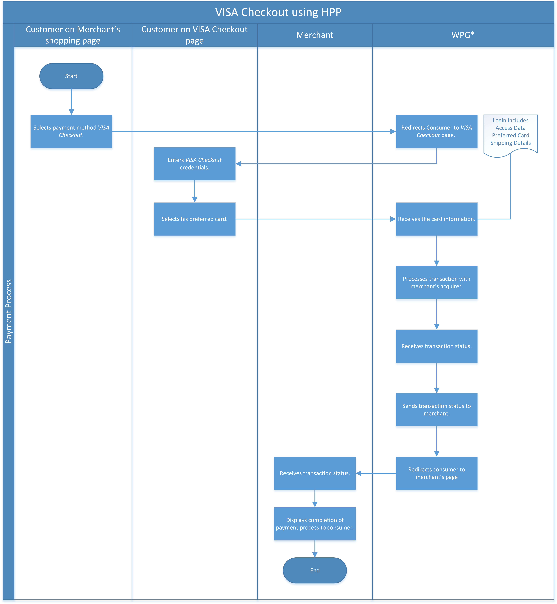
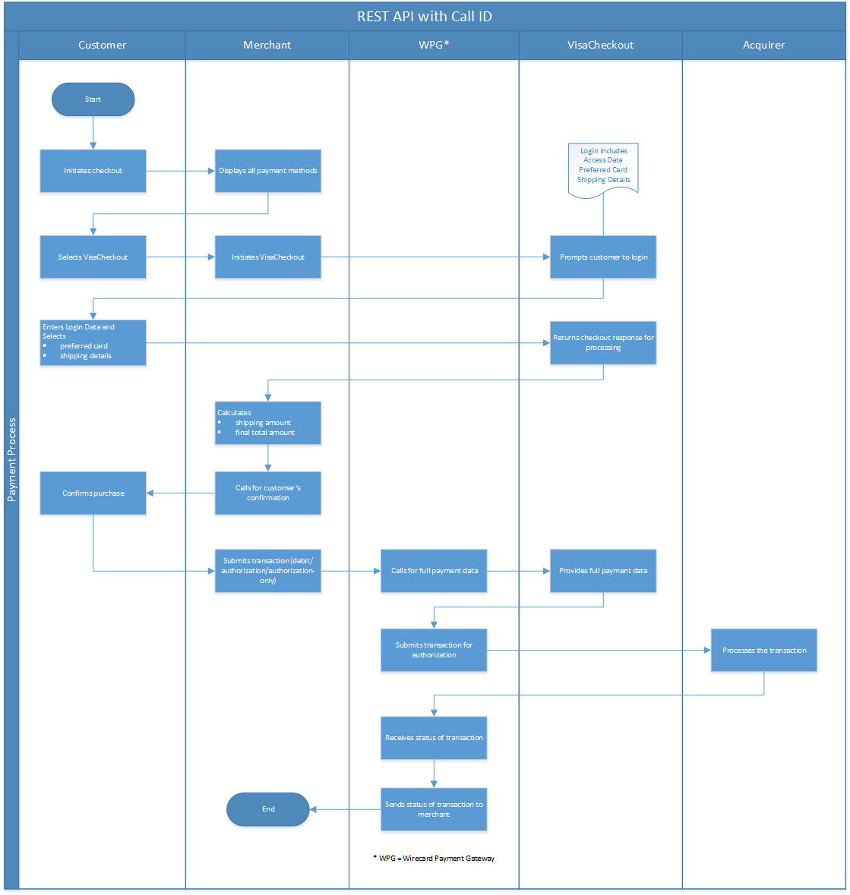
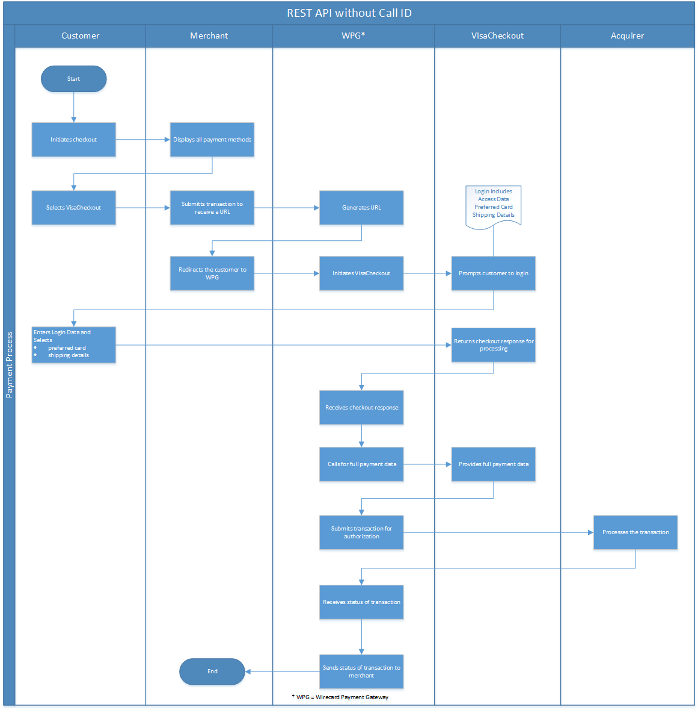

[#VISACheckout]
=== VISA Checkout

[#VISACheckout_Introduction]
==== Introduction

_VISA Checkout_ (VCO) is a digital wallet for simpler, safer shopping,
allowing customers to make purchases without having to spend much time
filling forms on the merchant's website as VCO stores credit card and
shipping details.

The VCO wallet can be integrated in three different ways:

[%autowidth]
|===
|Integration Option               |Description

|Hosted Payment Page integration a| . The customer is redirected to VCO
                                    website to login and selects the preferred credit card for payment.
                                    . Wirecard Payment Gateway receives the credit card information
                                    from VCO and proceeds with payment authorization with the acquirer.
                                    . Wirecard Payment Gateway manages all other interactions with VCO.
|ReST API integration without a VISA Checkout call ID |This is a hybrid integration. The merchant hosts the payment page and checks with the
                                                       customer on the preferred payment method. The _Wirecard Payment Gateway_
                                                       then handles all integration to VCO.

|ReST API integration with a VISA Checkout call ID    |This is a pure server-to-server implementation.
|===

[#VISACheckout_GeneralInformation]
==== General Information

[#VISACheckout_PaymentModeCountriesandCurrencies]
===== Payment Mode, Countries and Currencies

This table illustrates which payment mode _VISA Checkout_ belongs to. It
also provides detailed information about the countries and currencies
which are relevant for _VISA Checkout_.

[%autowidth, cols="h,",]
|===
|Payment Mode |<<PaymentMethods_PaymentMode_Wallet, Wallet>>
|Countries    |International
|Currencies   |All currencies are supported.
|===

[#VISACheckout_CommunicationFormats]
===== Communication Formats

This table illustrates how _VISA Checkout_ notifications are encoded and
which formats and methods can be used for requests and responses.

[%autowidth]
|===
.2+h|Requests/Responses |Format   |XML
                        |Methods  |POST, GET
   h|IPN Encodement   2+|Base64
|===

[#VISACheckout_TransactionTypes]
==== Transaction Types

Every successful VCO payment request results in two distinct
transactions in the database:

. one for VCO wallet,
. one for _Credit Card_.

//-

For <<Glossary_TransactionType, transaction type>> details which are not given here, look
at <<AppendixB, Appendix B: Transaction Types>>.

[%autowidth]
|===
|VISA Checkout          |     |Credit Card

|_debit_               | AND |_purchase_
|_authorization_       | AND |_authorization_
|_authorization-only_  | AND |_authorization-only_
|===

If the merchant does not receive a notification during the timeout period,
they can <<GeneralPlatformFeatures_RetrieveTransaction_TransactionID, Retrieve Transaction by Transaction ID>> or
<<GeneralPlatformFeatures_RetrieveTransaction_RequestID, Retrieve Transaction by Request ID>>.

[#VISACheckout_TestCredentials]
==== Test Credentials

.Test Merchant Account
NOTE: There is no public merchant-account available. VCO can be enabled to a specific merchant, provided that they have
registered with VCO and agreed on VCO's Merchant Services Agreement.
This will generate a VCO external client ID which has to be provided to
_Wirecard Payment Gateway_. For merchants integrating directly to VCO to
extract wallet data then to _Wirecard Payment Gateway_ for payments, the
API Key has to be additionally provided.

[%autowidth]
|===
.2+h|URLs (Endpoints)    |HPP      |https://api-test.wirecard.com/engine/hpp/
                         |ReST API |https://api-test.wirecard.com/engine/rest/paymentmethods/
   h|Merchant Account ID (MAID)  2+| The MAID can be generated once the VCO external client ID is provided (see info box above).
   h|Username    2+|Please <<ContactUs, contact merchant support>> for complete test credentials.
   h|Password    2+|Please <<ContactUs, contact merchant support>> for complete test credentials.
   h|Secret Key  2+|Please <<ContactUs, contact merchant support>> for complete test credentials.
|===

[#VISACheckout_Workflow]
==== Workflow

[#VISACheckout_PaymentPage]
===== Payment Page

The Payment Page workflow follows the usual Payment Page integration and
flow.

. Consumer adds items to shopping basket.
. Merchant redirects consumer to _Wirecard Payment Gateway_ for
payment.
. Consumer selects Payment Method _VCO_.
. _Wirecard Payment Gateway_ redirects consumer to _VCO_.
. Consumer enters his _VCO_ credentials and selects preferred card.
. _Wirecard Payment Gateway_ receives the card information.
. _Wirecard Payment Gateway_ processes the transaction with the
merchant's acquirer.
. _Wirecard Payment Gateway_ receives transaction status.
. _Wirecard Payment Gateway_ sends transaction status to merchant and
redirects the consumer to the merchant.
. Merchant receives the transaction's status and displays the
completion of the payment process to the consumer.

//-

[#VISACheckout_RESTAPI_Integration_with_CallID]
===== ReST API Integration with Call ID

. Consumer adds items to shopping basket.
. Consumer selects Payment Method _VCO_.
. Merchant initiates the _VCO_ lightbox.
. Consumer enters his _VCO_ credentials and selects preferred card.
. _Visa Checkout_ redirects the consumer to the merchant with the payload.
. Merchant initiate payment request with call ID information.
. _Wirecard Payment Gateway_ retrieves the card information from _VCO_.
. _Wirecard Payment Gateway_ processes the transaction with the merchant's acquirer.
. _Wirecard Payment Gateway_ receives transaction status.
. _Wirecard Payment Gateway_ sends transaction status to merchant.
. Merchant receives the transaction's status and displays the
  completion of the payment process to the consumer.

//-

[#VISACheckout_ReSTAPI_Integration_without_CallID]
===== ReST API Integration without Call ID

The workflow for _ReST API Integration without Call ID_ is similar to
the workflow for PP with the exception that the merchant displays the
payment options to the consumer and redirects the consumer to _Wirecard Payment Gateway_ which displays the lightbox.

. Consumer adds items to shopping basket.
. Consumer selects Payment Method _Visa Checkout_.
. Merchant redirects consumer to _Wirecard Payment Gateway_.
. _Wirecard Payment Gateway_ redirects consumer to _Visa Checkout_.
. Consumer enters his Visa Checkout credentials and selects preferred card.
. _Wirecard Payment Gateway_ receives the card information.
. _Wirecard Payment Gateway_ processes the transaction with the merchant's acquirer.
. _Wirecard Payment Gateway_ receives transaction status.
. _Wirecard Payment Gateway_ sends transaction status to merchant and redirects the consumer to the merchant.
. Merchant receives the transaction's status and displays the
  completion of the payment process to the consumer.

//-

[#VISACheckout_Fields]
==== Fields

[#VISACheckout_REST_Fields]
===== REST Fields

The following elements are elements with differing cardinality
from the <<RestApi_Fields, REST API Fields>>.

The following elements are either mandatory (M), optional (O) or
conditional (C) in a transaction process. 

[%autowidth]
|===
|Field                  |Request |Response |Notification |Data Type |Size |Description

|success-redirect-url   |M       |M        |M            |String    |2000 |The URL to which the customer will be re-directed after a successful
                                                                           process handling.
|fail-redirect-url      |M       |M        |M            |String    |2000 |The URL to which the customer will be re-directed after an unsuccessful
                                                                           process handling.
|wallet/request-token   |C       |M        |M            |String    |     |VISA Checkout's call Id field data. Mandatory for ReST implementation
with call Id.
|===

[#VISACheckout_Samples]
==== Samples

[#VISACheckout_Samples_RESTAPI_without_CallID]
===== REST API without Call ID

.debit Request

[source,xml]
----
include::samples/xml/visacheckout_debit_request_.xml[]
----

.debit Response

[source,xml]
----
include::samples/xml/visacheckout_debit_response_.xml[]
----

.debit Notification

[source,xml]
----
include::samples/xml/visacheckout_debit_notification_.xml[]
----

[#VISACheckout_Samples_RESTAPI_with_CallID]
===== Samples for REST API with Call ID

.debit Request

[source,xml]
----
include::samples/xml/visacheckout_debit_request_.xml[]
----

.debit Response

[source,xml]
----
include::samples/xml/visacheckout_debit_response_.xml[]
----

.debit Notification

[source,xml]
----
include::samples/xml/visacheckout_debit_notification_.xml[]
----
