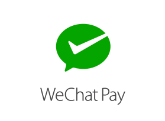

[#API_WeChatQRPay]
=== WeChat QR Pay

[#API_WeChatQRPay_Introduction]
==== Introduction

[#API_WeChatQRPay_Introduction_WeChat]
===== WeChat

With over 650 million monthly active user accounts as of the third
quarter of 2015, WeChat has become one of the most impactful mobile
products on the planet. Since its start as a chat app, WeChat has grown
to become a market-leading platform by connecting people, services, and
businesses in China and around the world.

[#API_WeChatQRPay_Introduction_WeChatQRPay]
===== WeChat QRPay

WeChat QRPay allows merchants to generate a QR code which is then
scanned by the consumer's WeChat App in order to complete the payment. +
This payment method is applicable to payments made on websites and in
physical stores, media advertising, and other scenarios.

[#API_WeChatQRPay_GeneralInformation]
==== General Information

[#API_WeChatQRPay_GeneralInformation_PaymentMode]
===== Payment Mode, Countries and Currencies

This table illustrates which payment mode _WeChat QRPay_ belongs to. It
also provides detailed information about the countries and currencies
which are relevant for _WeChat QRPay._

[cols="20%,80%",]
|===
|*Payment Mode* |link:#PaymentMethods_Overview_Wallet[Wallet]
|*Countries* |International
|*Currencies* a|
Consumers pay in CNY, and major settlement currencies are included but not
limited to GBP, HKD, USD, JPY, CAD, AUD, EUR, NZD, KRW, THB. For
unsupported currencies, transactions can be made in USD.

One merchant account only supports one settlement currency.
|===

[#API_WeChatQRPay_GeneralInformation_Communication]
===== Communication Formats

This table illustrates how _WeChat QRPay_ notifications are encoded and
which formats and methods can be used for requests and responses.

*Requests/Responses*

Format

XML, NVP

Methods

POST, GET

*IPN Encodement*

Please follow the instructions given at
https://document-center.wirecard.com/display/PTD/General+Platform+Features#GeneralPlatformFeatures-instant_payment_notificationInstantPaymentNotification[Instant
Payment Notification] to set up IPN.

[#API_WeChatQRPay_TransactionTypes]
==== Transaction Types

For
https://document-center.wirecard.com/display/PTD/Glossary#Glossary-TransactionType[transaction
type] details which are not given here, look
at https://document-center.wirecard.com/display/PTD/Appendix+B%3A+Transaction+Types[Appendix
B: Transaction Types].

[width="100%",cols="<50%,50%",options="header",]
|===
|Transaction Type |Link to the Sample
|get-url
|https://document-center.wirecard.com/display/PTD/WeChat+QRPay#WeChatQRPay-debit/get-url[_debit/get-url_
sample] (ReST API)

|check-signature | 

|debit a|
https://document-center.wirecard.com/display/PTD/WeChat+QRPay#WeChatQRPay-debit/get-url[_debit/get-url_
sample] (ReST API)

https://document-center.wirecard.com/display/PTD/WeChat+QRPay#WeChatQRPay-debit[_debit_
sample] (Payment Page)

|refund-debit | 

|void-debit | 
|===

[#API_WeChatQRPay_TestCredentials]
==== Test Credentials

*URLs (Endpoints)*

For transaction type _debit._

https://api-test.wirecard.com/engine/rest/paymentmethods/

For transaction types _refund-debit_ and _void-debit._

https://api-test.wirecard.com/engine/rest/payments/

*Merchant Account ID (MAID)*

236d1c79-5146-496b-af00-3399c9097edc

*Username*

16390-testing

*Password*

3!3013=D3fD8X7

*Secret Key*

3ab7945c-376f-4068-a8f3-7358ba214703

[#API_WeChatQRPay_Workflow]
==== Workflow

image:attachments/3703046/4194366.png[image,width=555]

1.  A consumer approaches the cashier to pay for the selected items.
2.  The merchant creates a request to the __Wirecard Payment
Gateway__ to generate the QR code so that the consumer can execute the
payment.
3.  __Wirecard Payment Gateway__ transmits the request to WeChat.
4.  WeChat responds to the __Wirecard Payment Gateway__ with a message
that contains URLs containing the generated QR code in different sizes.
5.  The merchant receives the QR code based on the returned payment URL
from WeChat.
6.  The consumer scans the QR code with WeChat Wallet and confirms
payment on his device.
7.  WeChat returns the payment result to the _Wirecard Payment Gateway_.
8.  The __Wirecard Payment Gateway__ notifies the merchant about the
payment result.

[#API_WeChatQRPay_Fields]
==== Fields

The fields used for WeChat QR Pay requests, responses and notifications
are the same as
the https://document-center.wirecard.com/display/PTD/Fields[REST API
Fields].

[#API_WeChatQRPay_Samples]
==== Samples: Requests and Responses

[#API_WeChatQRPay_Samples_debit]
===== _debit_

*XML debit Request (Successful)*  Expand source

[source,syntaxhighlighter-pre]
----
<?xml version="1.0" encoding="utf-8"?>
<payment xmlns="http://www.elastic-payments.com/schema/payment">
  <merchant-account-id>236d1c79-5146-496b-af00-3399c9097edc</merchant-account-id>
  <request-id>2c5970f8-9970-442a-b67b-bf3e2fe40d7f</request-id>
  <transaction-type>debit</transaction-type>
  <requested-amount currency="USD">1.01</requested-amount>
  <account-holder>
    <first-name>John</first-name>
    <last-name>Constantine</last-name>
    <email>john.constantine@wirecard.com</email>
    <phone></phone>
    <address>
      <street1>4950 Yonge Street</street1>
      <city>Toronto</city>
      <country>CA</country>
    </address>
  </account-holder>
  <ip-address>127.0.0.1</ip-address>
  <sub-merchant-info>
    <id>12152566</id>
    <name>Merchant Store</name>
  </sub-merchant-info>
  <order-detail>wechat test payment</order-detail>
  <payment-methods>
    <payment-method name="wechat-qrpay" />
  </payment-methods>
</payment>
----

*XML get-url Response (Successful)*  Expand source

[source,syntaxhighlighter-pre]
----
<?xml version="1.0" encoding="utf-8" standalone="yes"?>
<payment xmlns="http://www.elastic-payments.com/schema/payment" xmlns:ns2="http://www.elastic-payments.com/schema/epa/transaction">
  <merchant-account-id>236d1c79-5146-496b-af00-3399c9097edc</merchant-account-id>
  <transaction-id>7851102b-c1ce-4e7b-a833-632f9f7e780b</transaction-id>
  <request-id>2c5970f8-9970-442a-b67b-bf3e2fe40d7f-get-url</request-id>
  <transaction-type>get-url</transaction-type>
  <transaction-state>success</transaction-state>
  <completion-time-stamp>2018-06-05T08:00:45.000Z</completion-time-stamp>
  <statuses>
    <status code="201.0000" description="The resource was successfully created." severity="information" />
  </statuses>
  <requested-amount currency="USD">1.01</requested-amount>
  <account-holder>
    <first-name>John</first-name>
    <last-name>Constantine</last-name>
    <email>john.constantine@wirecard.com</email>
    <phone></phone>
    <address>
      <street1>4950 Yonge Street</street1>
      <city>Toronto</city>
      <country>CA</country>
    </address>
  </account-holder>
  <ip-address>127.0.0.1</ip-address>
  <order-detail>wechat test payment</order-detail>
  <payment-methods>
    <payment-method url="https://api-test.wirecard.com:443/engine/hpp/wechat-qrpay/7851102b-c1ce-4e7b-a833-632f9f7e780b/?request_time_stamp=20180605080045&amp;request_id=2c5970f8-9970-442a-b67b-bf3e2fe40d7f&amp;merchant_account_id=236d1c79-5146-496b-af00-3399c9097edc&amp;transaction_id=7851102b-c1ce-4e7b-a833-632f9f7e780b&amp;transaction_type=debit&amp;requested_amount=1.01&amp;requested_amount_currency=USD&amp;redirect_url=&amp;ip_address=127.0.0.1&amp;request_signature=b6216f789a1866febeb5e9e453a338c7e6f11c6591c8f85e132f43e56eccf371&amp;psp_name=elastic-payments&amp;country=CA" name="wechat-qrpay" />
  </payment-methods>
  <authorization-code>weixin://wxpay/s/An4baqw</authorization-code>
  <sub-merchant-info>
    <id>12152566</id>
    <name>Merchant Store</name>
  </sub-merchant-info>
</payment>
----

[#API_WeChatQRPay_Samples_refund-debit]
===== _refund-debit_

*XML refund-debit Request (Successful)*  Expand source

[source,syntaxhighlighter-pre]
----
<?xml version="1.0" encoding="utf-8" standalone="yes"?>
<payment xmlns="http://www.elastic-payments.com/schema/payment">
    <merchant-account-id>236d1c79-5146-496b-af00-3399c9097edc</merchant-account-id>
    <request-id>d4eac82b-c771-47c9-bf4b-37f5798f0d13</request-id>
    <transaction-type>refund-debit</transaction-type>
    <parent-transaction-id>{from-notification-of-previous-debit-transaction}</parent-transaction-id>
    <ip-address>127.0.0.1</ip-address>
    <payment-methods>
        <payment-method name="wechat-qrpay" />
    </payment-methods></payment>
----

*XML refund-debit Response (Successful)*  Expand source

[source,syntaxhighlighter-pre]
----
 <?xml version="1.0" encoding="utf-8" standalone="yes"?>
<payment xmlns="http://www.elastic-payments.com/schema/payment" xmlns:ns2="http://www.elastic-payments.com/schema/epa/transaction" self="https://api-test.wirecard.com:443/engine/rest/merchants/236d1c79-5146-496b-af00-3399c9097edc/payments/e2c34a3e-8ea4-42bc-886c-5308910d7963">
  <merchant-account-id ref="https://api-test.wirecard.com:443/engine/rest/config/merchants/236d1c79-5146-496b-af00-3399c9097edc">236d1c79-5146-496b-af00-3399c9097edc</merchant-account-id>
  <transaction-id>e2c34a3e-8ea4-42bc-886c-5308910d7963</transaction-id>
  <request-id>d462694d-e8cd-40d1-8f52-f27517d9826e-refund-request</request-id>
  <transaction-type>refund-request</transaction-type>
  <transaction-state>success</transaction-state>
  <completion-time-stamp>2018-06-05T08:07:17.000Z</completion-time-stamp>
  <statuses>
    <status code="201.0000" description="wechat-qrpay:The resource was successfully created." severity="information" />
  </statuses>
  <requested-amount currency="USD">1.01</requested-amount>
  <parent-transaction-id>cb0c0b5f-9a7c-4611-97e4-388dcf43434d</parent-transaction-id>
  <account-holder>
    <first-name>John</first-name>
    <last-name>Constantine</last-name>
    <email>john.constantine@wirecard.com</email>
    <phone></phone>
    <address>
      <street1>4950 Yonge Street</street1>
      <city>Toronto</city>
      <country>CA</country>
    </address>
  </account-holder>
  <ip-address>127.0.0.1</ip-address>
  <order-detail>wechat test payment</order-detail>
  <payment-methods>
    <payment-method name="wechat-qrpay" />
  </payment-methods>
  <parent-transaction-amount currency="USD">1.010000</parent-transaction-amount>
  <api-id>elastic-api</api-id>
  <sub-merchant-info>
    <id>12152566</id>
    <name>Merchant Store</name>
  </sub-merchant-info>
</payment>
----

[#API_WeChatQRPay_Samples_void-debit]
===== _void-debit_

*XML void-debit Request (Successful)*  Expand source

[source,syntaxhighlighter-pre]
----
 <?xml version="1.0" encoding="utf-8" standalone="yes"?>
<payment xmlns="http://www.elastic-payments.com/schema/payment">
    <merchant-account-id>236d1c79-5146-496b-af00-3399c9097edc</merchant-account-id>
    <request-id>57a94bad-3365-4fa4-b1fd-942e3175345a</request-id>
    <transaction-type>void-debit</transaction-type>
    <parent-transaction-id>{from-notification-of-previous-debit-transaction}</parent-transaction-id>
    <ip-address>127.0.0.1</ip-address>
    <payment-methods>
        <payment-method name="wechat-qrpay" />
    </payment-methods></payment>
----

*XML void-debit Response (Successful)*  Expand source

[source,syntaxhighlighter-pre]
----
 <?xml version="1.0" encoding="utf-8" standalone="yes"?>
<payment xmlns="http://www.elastic-payments.com/schema/payment" xmlns:ns2="http://www.elastic-payments.com/schema/epa/transaction" self="https://api-test.wirecard.com:443/engine/rest/merchants/236d1c79-5146-496b-af00-3399c9097edc/payments/fe5bec45-3355-4ad6-bde4-9405f8bacf9e">
  <merchant-account-id ref="https://api-test.wirecard.com:443/engine/rest/config/merchants/236d1c79-5146-496b-af00-3399c9097edc">236d1c79-5146-496b-af00-3399c9097edc</merchant-account-id>
  <transaction-id>fe5bec45-3355-4ad6-bde4-9405f8bacf9e</transaction-id>
  <request-id>1b4af610-5744-4f57-acfb-843ee494a100</request-id>
  <transaction-type>void-debit</transaction-type>
  <transaction-state>success</transaction-state>
  <completion-time-stamp>2018-06-05T08:25:01.000Z</completion-time-stamp>
  <statuses>
    <status code="201.0000" description="wechat-qrpay:The resource was successfully created." severity="information" />
  </statuses>
  <requested-amount currency="USD">1.01</requested-amount>
  <parent-transaction-id>6e9e80d9-1edb-4a9b-95e3-8cfe86b2182f</parent-transaction-id>
  <account-holder>
    <first-name>John</first-name>
    <last-name>Constantine</last-name>
    <email>john.constantine@wirecard.com</email>
    <phone></phone>
    <address>
      <street1>4950 Yonge Street</street1>
      <city>Toronto</city>
      <country>CA</country>
    </address>
  </account-holder>
  <ip-address>127.0.0.1</ip-address>
  <order-detail>wechat test payment</order-detail>
  <payment-methods>
    <payment-method name="wechat-qrpay" />
  </payment-methods>
  <parent-transaction-amount currency="USD">1.010000</parent-transaction-amount>
  <api-id>elastic-api</api-id>
  <sub-merchant-info>
    <id>12152566</id>
    <name>Merchant Store</name>
  </sub-merchant-info>
</payment>
----
