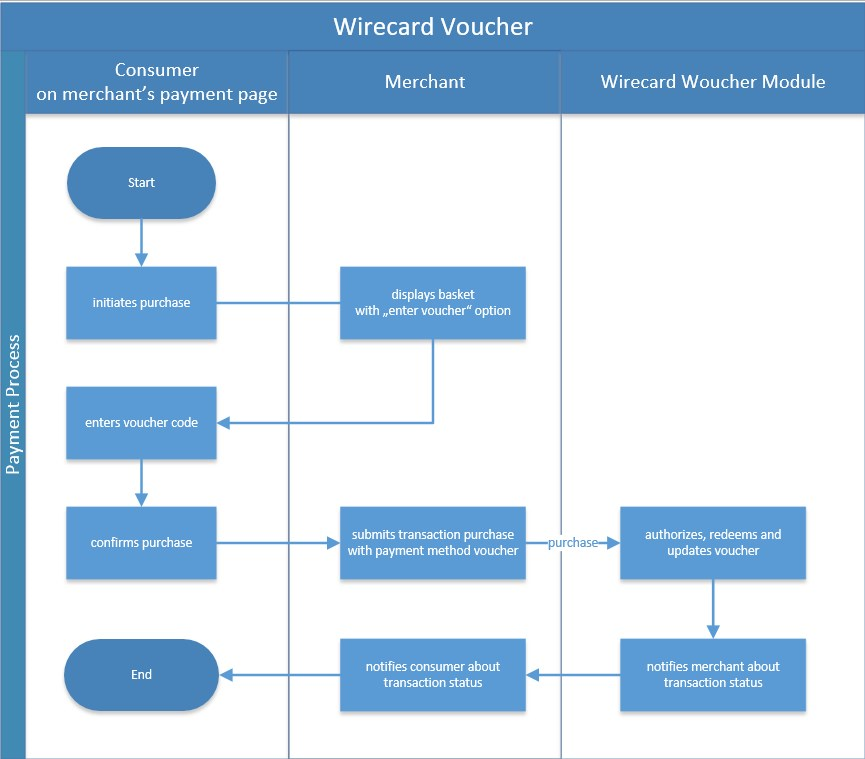

[#WirecardVoucher]
=== Wirecard Voucher

[#WirecardVoucher_Introduction]
==== Introduction

A _Wirecard Voucher_ is a customized payment method for merchants who use
the Wirecard Voucher Module. This payment method is available at both
payment and <<MultiPaymentApi, multi-payment>> levels
to make it flexible to combine vouchers together or with other payment
methods, e.g. credit card. A _voucher_ is defined as a digital or physical
gift card or coupon, which includes a code that entitles the holder to
exchange it for goods or services or to get a discount. Vouchers can be
used as a full-fledged alternative payment method enabling features
beyond simple rebates or one-time codes. 

Voucher life-cycle is handled and managed by the _Wirecard Voucher_ Module.

For further information on _Wirecard Voucher_, contact
mailto:support@wirecard.com[merchant support].

[#WirecardVoucher_GeneralInformation]
==== General Information

[#WirecardVoucher_GeneralInformation_PaymentMode]
===== Payment Mode, Countries and Currencies

This table illustrates which payment mode _Wirecard Voucher_ belongs to.
It also provides detailed information about the countries and currencies
which are relevant for _Wirecard Voucher._

[cols="20h, 80"]
|===
| Payment Mode | <<PaymentMethods_PaymentMode_Voucher, Voucher>>
| Countries    | Please <<ContactUs, contact merchant support>> for countries. 
| Currencies   | EUR
|===

[#WirecardVoucher_GeneralInformation_CommunicationFormats]
===== Communication Formats

This table illustrates how _Wirecard Voucher_ notifications are encoded
and which formats and methods can be used for requests and responses.

[cols="20, 40, 40"]
|===
.2+h| Requests/Responses | Format  | XML
                         | Methods | POST

h|IPN Encodement       2+| Please follow the instructions given at <<GeneralPlatformFeatures_IPN, Instant Payment Notification>> to set up IPN.
|===

[#WirecardVoucher_TransactionTypes]
==== Transaction Types

For <<Glossary_TransactionType, transaction type>> details look at <<AppendixB, Appendix B: Transaction Types>>.

[cols="20e, 60, 20"]
|===
| Transaction Type | Description | Link to the Samples

| purchase | Redeem voucher. |See <<WirecardVoucher_Samples_Purchase, _purchase_ samples>>
| void-purchase |Action to undo purchase against Voucher API.
Configurable on merchant level. | 
| reserve | Reservation of amount for redemption. | See <<WirecardVoucher_Samples_Reserve, _reserve_ samples>>
| void-reserve | Cancellation of not confirmed redemption reservation.
If redemption was already confirmed, reversal needs to be used. | 
| redeem | Confirmation of reservation redemption. After confirmation,
amount is subtracted from total voucher amount. |See <<WirecardVoucher_Samples_Redeem, _redeem_ samples>>
| cancel-redeem | Cancellation of confirmed redemption. Amount of
voucher is returned to value without redemption. If voucher has been
``REDEEMED``, it is returned to ``IN_USE`` state. | 
| void-cancel-redeem | Rollback of redemption reversal. Voucher's
redemption value and state is set back to the original redemption's state. | 
|===

[#WirecardVoucher_TestCredentials]
==== Test Credentials

[cols="30h, 70"]
|===
| URLs (Endpoints) | ``\https://{test-instance-hostname}/engine/rest/payments/``
| Merchant Account ID (MAID) | 7b14cf26-44ae-4bf2-a180-044ac03ff9f6
| Username         | 16390-testing
| Password         | 3!3013=D3fD8X7
| Secret Key       | 82e791c-0e68-4a5a-b178-8f9a7f3c7ba8
|===

[#WirecardVoucher_TestCredentials_AdditionalTestCredentials]
===== Additional Test Credentials on _Wirecard Voucher_ Environment

[cols="30h, 70"]
|===
| Voucher Brand | testmerchant
| Voucher Code for Test | TESTM49499486680, 9.000 EUR, not reloadable, please use small amounts.
|===

[#WirecardVoucher_Workflow]
==== Workflow

[#WirecardVoucher_Fields]
==== Fields

Payment fields required for the _Wirecard Voucher_ are the same fields as
the <<RestApi_Fields, REST API Fields>>. Additionally, voucher element should
be present.

The following elements are either mandatory (M), optional (O) or
conditional \(C) in a transaction process.

[cols="v,,,,,,"]
|===
| Field               | Request | Response | Notification | Data Type    | Size | Description

| voucher-code        | M       | M        | M            | Alphanumeric | 36   | Code for payment and voucher processing.
| voucher-brand-id    | M       | M        | M            | Alphanumeric | 255  | Brand of voucher.
| voucher-token-id    | O       | O        | O            | Alphanumeric | 255  | Redemption token as returned from ``REDEMPTION_RESERVATION``.
| voucher-description | O       | O        | O            | Alphanumeric | 255  | Used as operational comment.
| alternative-amount  | O       | O        | O            | Numeric      |      | Used for merchant specific currencies (bonuses, km, etc.).
| serial-number       | O       | O        | O            | Alphanumeric | 255  | Code for support and voucher identification.
|===

WARNING: The ``payments/payment/additional-merchant-data``
field is used along with the voucher type to send ``keyValuePairs`` to the
Voucher API. Its value is Base64 encoded.

Part of the request

[source,xml]
----
<additional-merchant-data>ew0KInh5eiI6ICIxMjMiLA0KImFiYyI6ICI0NTYiDQp9</additional-merchant-data>
----

will be sent to Voucher API as

[source]
----
"keyValuePairs": "ew0KInh5eiI6ICIxMjMiLA0KImFiYyI6ICI0NTYiDQp9"
----

Decode from Base64 ``ew0KInh5eiI6ICIxMjMiLA0KImFiYyI6ICI0NTYiDQp9``

[source,json]
----
{
  "xyz": "123",
  "abc": "456"
}
----

[#WirecardVoucher_Samples]
==== Samples

Go to <<GeneralPlatformFeatures_IPN_NotificationExamples, Notification Examples>> if you want
to see corresponding notification samples.

[#WirecardVoucher_Samples_Purchase]
===== _purchase_

.XML purchase Request (Successful)

[source,xml]
----
<?xml version="1.0" encoding="utf-8" standalone="yes"?>
<payment xmlns="http://www.elastic-payments.com/schema/payment">
	<merchant-account-id>7b14cf26-44ae-4bf2-a180-044ac03ff9f6</merchant-account-id>
	<request-id>{{$guid}}</request-id>
	<transaction-type>purchase</transaction-type>
	<requested-amount currency="EUR">1.25</requested-amount>
	<payment-methods>
		<payment-method name="voucher" />
	</payment-methods>
	<voucher>
		<voucher-code>TESTM49499486680</voucher-code>
		<voucher-brand-id>testmerchant</voucher-brand-id>
		<voucher-description>This is Voucher Description</voucher-description>
	</voucher>
</payment>
----

.XML purchase Response (Successful)

[source,xml]
----
<?xml version="1.0" encoding="utf-8" standalone="yes"?>
<payment xmlns="http://www.elastic-payments.com/schema/payment" xmlns:ns2="http://www.elastic-payments.com/schema/epa/transaction" self="https://{test-instance-hostname}:443/engine/rest/merchants/7b14cf26-44ae-4bf2-a180-044ac03ff9f6/payments/d424b4b8-c189-4f7f-b24b-912d35632924">
    <merchant-account-id ref="https://{test-instance-hostname}:443/engine/rest/config/merchants/7b14cf26-44ae-4bf2-a180-044ac03ff9f6">7b14cf26-44ae-4bf2-a180-044ac03ff9f6</merchant-account-id>
    <transaction-id>d424b4b8-c189-4f7f-b24b-912d35632924</transaction-id>
    <request-id>826a358c-ff21-4eb8-8150-dd14ba4c2263</request-id>
    <transaction-type>purchase</transaction-type>
    <transaction-state>success</transaction-state>
    <completion-time-stamp>2018-07-05T07:36:06.000Z</completion-time-stamp>
    <statuses>
        <status code="201.0000" description="voucher:The resource was successfully created." severity="information" />
    </statuses>
    <requested-amount currency="EUR">1.25</requested-amount>
    <payment-methods>
        <payment-method name="voucher" />
    </payment-methods>
    <voucher>
        <voucher-code>TE******80</voucher-code>
        <voucher-brand-id>testmerchant</voucher-brand-id>
        <voucher-token-id>e7222p70eta48ck8lidnrcsgto</voucher-token-id>
        <voucher-description>This is Voucher Description</voucher-description>
    </voucher>
    <provider-account-id>0000003173E1F10E</provider-account-id>
</payment>
----

.XML void-purchase Request (Successful)

[source,xml]
----
<?xml version="1.0" encoding="utf-8" standalone="yes"?>
<payment xmlns="http://www.elastic-payments.com/schema/payment">
	<request-id>{{$guid}}</request-id>
	<transaction-type>void-purchase</transaction-type>
	<parent-transaction-id>$transaction-id-from-purchase-response</parent-transaction-id>
</payment>
----

.XML void-purchase Response (Successful)

[source,xml]
----
<?xml version="1.0" encoding="utf-8" standalone="yes"?>
<payment xmlns="http://www.elastic-payments.com/schema/payment" xmlns:ns2="http://www.elastic-payments.com/schema/epa/transaction" self="https://{test-instance-hostname}:443/engine/rest/merchants/7b14cf26-44ae-4bf2-a180-044ac03ff9f6/payments/1c4ba465-400a-4366-bf39-d0cae16aa2fa">
    <merchant-account-id ref="https://{test-instance-hostname}:443/engine/rest/config/merchants/7b14cf26-44ae-4bf2-a180-044ac03ff9f6">7b14cf26-44ae-4bf2-a180-044ac03ff9f6</merchant-account-id>
    <transaction-id>1c4ba465-400a-4366-bf39-d0cae16aa2fa</transaction-id>
    <request-id>8eb23e9a-61e8-4bd5-8a9d-7faa9edb54b7</request-id>
    <transaction-type>void-purchase</transaction-type>
    <transaction-state>success</transaction-state>
    <completion-time-stamp>2018-07-05T07:36:59.000Z</completion-time-stamp>
    <statuses>
        <status code="201.0000" description="voucher:The resource was successfully created." severity="information" />
    </statuses>
    <requested-amount currency="EUR">1.25</requested-amount>
    <parent-transaction-id>d424b4b8-c189-4f7f-b24b-912d35632924</parent-transaction-id>
    <payment-methods>
        <payment-method name="voucher" />
    </payment-methods>
    <parent-transaction-amount currency="EUR">1.250000</parent-transaction-amount>
    <api-id>elastic-api</api-id>
    <voucher>
        <voucher-code>TE******80</voucher-code>
        <voucher-brand-id>testmerchant</voucher-brand-id>
        <voucher-token-id>e7222p70eta48ck8lidnrcsgto</voucher-token-id>
        <voucher-description>This is Voucher Description</voucher-description>
    </voucher>
    <provider-account-id>0000003173E1F10E</provider-account-id>
</payment>
----

[#WirecardVoucher_Samples_Reserve]
===== _reserve_

.XML reserve Request (Successful)

[source,xml]
----
<?xml version="1.0" encoding="utf-8" standalone="yes"?>
<payment xmlns="http://www.elastic-payments.com/schema/payment">
	<merchant-account-id>7b14cf26-44ae-4bf2-a180-044ac03ff9f6</merchant-account-id>
	<request-id>${{guid}}</request-id>
	<transaction-type>reserve</transaction-type>
	<requested-amount currency="EUR">0.25</requested-amount>
	<payment-methods>
		<payment-method name="voucher" />
	</payment-methods>
	<voucher>
		<voucher-code>TESTM49499486680</voucher-code>
		<voucher-brand-id>testmerchant</voucher-brand-id>
		<voucher-description>This is Voucher Description</voucher-description>
	</voucher>
</payment>
----

.XML reserve Response (Successful)

[source,xml]
----
<?xml version="1.0" encoding="utf-8" standalone="yes"?>
<payment xmlns="http://www.elastic-payments.com/schema/payment" xmlns:ns2="http://www.elastic-payments.com/schema/epa/transaction" self="https://{test-instance-hostname}:443/engine/rest/merchants/7b14cf26-44ae-4bf2-a180-044ac03ff9f6/payments/7c4d1dc7-d439-44a1-83b7-90b8678afe76">
    <merchant-account-id ref="https://{test-instance-hostname}:443/engine/rest/config/merchants/7b14cf26-44ae-4bf2-a180-044ac03ff9f6">7b14cf26-44ae-4bf2-a180-044ac03ff9f6</merchant-account-id>
    <transaction-id>7c4d1dc7-d439-44a1-83b7-90b8678afe76</transaction-id>
    <request-id>175215cb-00f0-42a5-9471-4b7bd17cb554</request-id>
    <transaction-type>reserve</transaction-type>
    <transaction-state>success</transaction-state>
    <completion-time-stamp>2018-07-05T07:38:52.000Z</completion-time-stamp>
    <statuses>
        <status code="201.0000" description="voucher:The resource was successfully created." severity="information" />
    </statuses>
    <requested-amount currency="EUR">0.25</requested-amount>
    <payment-methods>
        <payment-method name="voucher" />
    </payment-methods>
    <voucher>
        <voucher-code>TE******80</voucher-code>
        <voucher-brand-id>testmerchant</voucher-brand-id>
        <voucher-token-id>4q1mlejfi3g1g5uaplmekdt2tg</voucher-token-id>
        <voucher-description>This is Voucher Description</voucher-description>
    </voucher>
    <provider-account-id>0000003173E1F10E</provider-account-id>
</payment>
----

.XML void-reserve Request (Successful)

[source,xml]
----
<?xml version="1.0" encoding="utf-8" standalone="yes"?>
<payment xmlns="http://www.elastic-payments.com/schema/payment">
	<request-id>{{$guid}}</request-id>
	<transaction-type>void-reserve</transaction-type>
	<parent-transaction-id>$transaction-id-from-reserve-response</parent-transaction-id>
</payment>
----

.XML void-reserve Response (Successful)

[source,xml]
----
<?xml version="1.0" encoding="utf-8" standalone="yes"?>
<payment xmlns="http://www.elastic-payments.com/schema/payment" xmlns:ns2="http://www.elastic-payments.com/schema/epa/transaction" self="https://{test-instance-hostname}:443/engine/rest/merchants/7b14cf26-44ae-4bf2-a180-044ac03ff9f6/payments/1fcf2f9f-47df-4301-8c45-51d9085aca53">
    <merchant-account-id ref="https://{test-instance-hostname}:443/engine/rest/config/merchants/7b14cf26-44ae-4bf2-a180-044ac03ff9f6">7b14cf26-44ae-4bf2-a180-044ac03ff9f6</merchant-account-id>
    <transaction-id>1fcf2f9f-47df-4301-8c45-51d9085aca53</transaction-id>
    <request-id>6c517309-1b74-44a8-8b6f-19ed50c0cb8b</request-id>
    <transaction-type>void-reserve</transaction-type>
    <transaction-state>success</transaction-state>
    <completion-time-stamp>2018-07-09T10:19:37.000Z</completion-time-stamp>
    <statuses>
        <status code="201.0000" description="voucher:The resource was successfully created." severity="information" />
    </statuses>
    <requested-amount currency="EUR">0.25</requested-amount>
    <parent-transaction-id>83666ab6-cb2d-47eb-9112-8916008a1059</parent-transaction-id>
    <payment-methods>
        <payment-method name="voucher" />
    </payment-methods>
    <parent-transaction-amount currency="EUR">0.250000</parent-transaction-amount>
    <api-id>elastic-api</api-id>
    <voucher>
        <voucher-code>TE******80</voucher-code>
        <voucher-brand-id>testmerchant</voucher-brand-id>
        <voucher-token-id>rk0rdd9qj80r8ch2tlmf8kn3g0</voucher-token-id>
        <voucher-description>This is Voucher Description</voucher-description>
    </voucher>
    <provider-account-id>0000003173E1F10E</provider-account-id>
</payment>
----

[#WirecardVoucher_Samples_Redeem]
===== _redeem_

.XML redeem Request (Successful)

[source,xml]
----
<?xml version="1.0" encoding="utf-8" standalone="yes"?>
<payment xmlns="http://www.elastic-payments.com/schema/payment">
	<merchant-account-id>7b14cf26-44ae-4bf2-a180-044ac03ff9f6</merchant-account-id>
	<request-id>${{guid}}</request-id>
	<transaction-type>redeem</transaction-type>
	<requested-amount currency="EUR">0.25</requested-amount>
	<payment-methods>
		<payment-method name="voucher" />
	</payment-methods>
	<voucher>
		<voucher-code>TESTM49499486680</voucher-code>
		<voucher-brand-id>testmerchant</voucher-brand-id>
		<voucher-description>This is Voucher Description</voucher-description>
		<voucher-token-id>$from-successful-reserve-response</voucher-token-id>
	</voucher>
</payment>
----

.XML redeem Response (Successful)

[source,xml]
----
<?xml version="1.0" encoding="utf-8" standalone="yes"?>
<payment xmlns="http://www.elastic-payments.com/schema/payment" xmlns:ns2="http://www.elastic-payments.com/schema/epa/transaction" self="https://{test-instance-hostname}:443/engine/rest/merchants/7b14cf26-44ae-4bf2-a180-044ac03ff9f6/payments/2bf67fc0-a137-4e3e-b149-b5bbc958ecc6">
    <merchant-account-id ref="https://{test-instance-hostname}:443/engine/rest/config/merchants/7b14cf26-44ae-4bf2-a180-044ac03ff9f6">7b14cf26-44ae-4bf2-a180-044ac03ff9f6</merchant-account-id>
    <transaction-id>2bf67fc0-a137-4e3e-b149-b5bbc958ecc6</transaction-id>
    <request-id>30232dda-6a16-400d-8e91-e6d1754b227b</request-id>
    <transaction-type>redeem</transaction-type>
    <transaction-state>success</transaction-state>
    <completion-time-stamp>2018-07-05T07:40:06.000Z</completion-time-stamp>
    <statuses>
        <status code="201.0000" description="voucher:The resource was successfully created." severity="information" />
    </statuses>
    <requested-amount currency="EUR">0.25</requested-amount>
    <payment-methods>
        <payment-method name="voucher" />
    </payment-methods>
    <voucher>
        <voucher-code>TE******80</voucher-code>
        <voucher-brand-id>testmerchant</voucher-brand-id>
        <voucher-token-id>4q1mlejfi3g1g5uaplmekdt2tg</voucher-token-id>
        <voucher-description>This is Voucher Description</voucher-description>
    </voucher>
    <provider-account-id>0000003173E1F10E</provider-account-id>
</payment>
----

.XML cancel-redeem Request (Successful)

[source,xml]
----
<?xml version="1.0" encoding="utf-8" standalone="yes"?>
<payment xmlns="http://www.elastic-payments.com/schema/payment">
	<merchant-account-id>7b14cf26-44ae-4bf2-a180-044ac03ff9f6</merchant-account-id>
	<request-id>{{$guid}}</request-id>
	<transaction-type>cancel-redeem</transaction-type>
	<parent-transaction-id>$from-redeem-response</parent-transaction-id>
</payment>
----

.XML cancel-redeem Response (Successful)

[source,xml]
----
<?xml version="1.0" encoding="utf-8" standalone="yes"?>
<payment xmlns="http://www.elastic-payments.com/schema/payment" xmlns:ns2="http://www.elastic-payments.com/schema/epa/transaction" self="https://{test-instance-hostname}:443/engine/rest/merchants/7b14cf26-44ae-4bf2-a180-044ac03ff9f6/payments/75bd223e-ab98-40da-83d1-918aa4e7e210">
    <merchant-account-id ref="https://{test-instance-hostname}:443/engine/rest/config/merchants/7b14cf26-44ae-4bf2-a180-044ac03ff9f6">7b14cf26-44ae-4bf2-a180-044ac03ff9f6</merchant-account-id>
    <transaction-id>75bd223e-ab98-40da-83d1-918aa4e7e210</transaction-id>
    <request-id>bfd442bb-5b86-44b1-bfb8-34e579aff23d</request-id>
    <transaction-type>cancel-redeem</transaction-type>
    <transaction-state>success</transaction-state>
    <completion-time-stamp>2018-07-05T07:41:28.000Z</completion-time-stamp>
    <statuses>
        <status code="201.0000" description="voucher:The resource was successfully created." severity="information" />
    </statuses>
    <requested-amount currency="EUR">0.25</requested-amount>
    <parent-transaction-id>2bf67fc0-a137-4e3e-b149-b5bbc958ecc6</parent-transaction-id>
    <payment-methods>
        <payment-method name="voucher" />
    </payment-methods>
    <parent-transaction-amount currency="EUR">0.250000</parent-transaction-amount>
    <api-id>elastic-api</api-id>
    <voucher>
        <voucher-code>TE******80</voucher-code>
        <voucher-brand-id>testmerchant</voucher-brand-id>
        <voucher-token-id>4q1mlejfi3g1g5uaplmekdt2tg</voucher-token-id>
        <voucher-description>This is Voucher Description</voucher-description>
    </voucher>
    <provider-account-id>0000003173E1F10E</provider-account-id>
</payment>
----

.XML void-cancel-redeem Request (Successful)

[source,xml]
----
<?xml version="1.0" encoding="utf-8" standalone="yes"?>
<payment xmlns="http://www.elastic-payments.com/schema/payment">
	<merchant-account-id>7b14cf26-44ae-4bf2-a180-044ac03ff9f6</merchant-account-id>
	<request-id>${{guid}}</request-id>
	<transaction-type>void-cancel-redeem</transaction-type>
	<parent-transaction-id>$from-cancel-redeem-response</parent-transaction-id>
</payment>
----

.XML void-cancel-redeem Response (Successful)

[source,xml]
----
<?xml version="1.0" encoding="utf-8" standalone="yes"?>
<payment xmlns="http://www.elastic-payments.com/schema/payment" xmlns:ns2="http://www.elastic-payments.com/schema/epa/transaction" self="https://{test-instance-hostname}:443/engine/rest/merchants/7b14cf26-44ae-4bf2-a180-044ac03ff9f6/payments/11a3ce39-7d55-47a8-ae82-9103fc378878">
    <merchant-account-id ref="https://{test-instance-hostname}:443/engine/rest/config/merchants/7b14cf26-44ae-4bf2-a180-044ac03ff9f6">7b14cf26-44ae-4bf2-a180-044ac03ff9f6</merchant-account-id>
    <transaction-id>11a3ce39-7d55-47a8-ae82-9103fc378878</transaction-id>
    <request-id>cc0f56c5-e6ce-4bbc-9c9f-dc9f9da2e9d7</request-id>
    <transaction-type>void-cancel-redeem</transaction-type>
    <transaction-state>success</transaction-state>
    <completion-time-stamp>2018-07-05T07:42:09.000Z</completion-time-stamp>
    <statuses>
        <status code="201.0000" description="voucher:The resource was successfully created." severity="information" />
    </statuses>
    <requested-amount currency="EUR">0.25</requested-amount>
    <parent-transaction-id>75bd223e-ab98-40da-83d1-918aa4e7e210</parent-transaction-id>
    <payment-methods>
        <payment-method name="voucher" />
    </payment-methods>
    <parent-transaction-amount currency="EUR">0.250000</parent-transaction-amount>
    <api-id>elastic-api</api-id>
    <voucher>
        <voucher-code>TE******80</voucher-code>
        <voucher-brand-id>testmerchant</voucher-brand-id>
        <voucher-token-id>4q1mlejfi3g1g5uaplmekdt2tg</voucher-token-id>
        <voucher-description>This is Voucher Description</voucher-description>
    </voucher>
    <provider-account-id>0000003173E1F10E</provider-account-id>
</payment>
----
