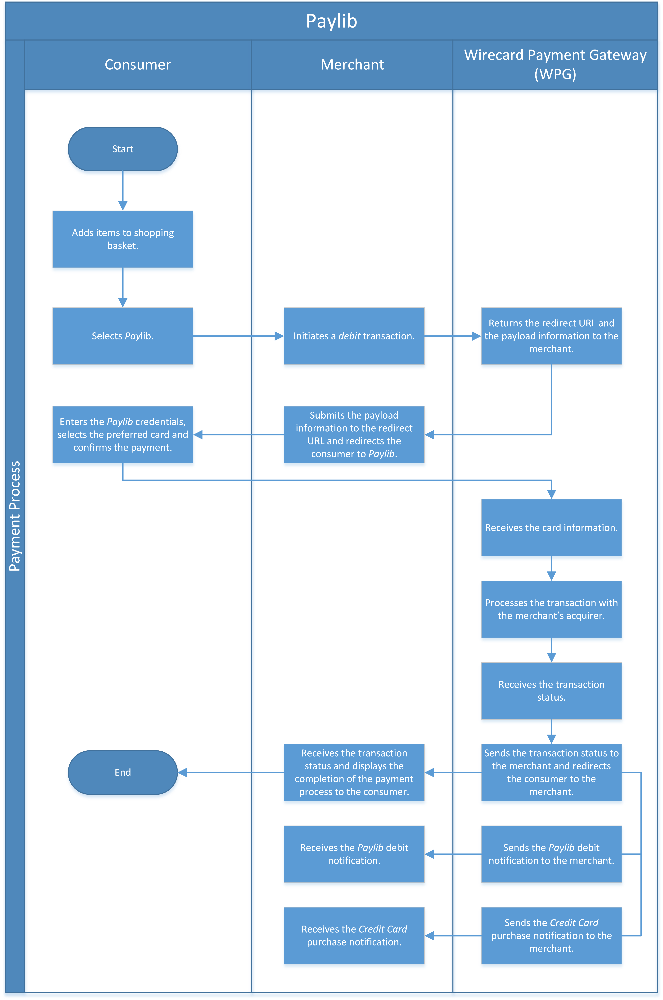

[#Paylib]
=== Paylib

[#Paylib_Introduction]
==== Introduction

_Paylib_ is a French mobile wallet initiated by a collaboration of major
French banks. By linking a credit card to their account, _Paylib_ allows
consumers to make purchases without having to re-enter their card
details. To pay, consumers have to enter their username, password and a code
generated by the _Paylib_ app.

[#Paylib_General]
==== General Information

[#Paylib_General_PaymentMode]
===== Payment Mode, Countries and Currencies

This table illustrates which payment mode _Paylib_ belongs to. It also
provides detailed information about the countries and currencies which
are relevant for _Paylib_.

[%autowidth]
|===
| Payment Mode | <<PaymentMethods_PaymentMode_Wallet, Wallet>>
| Countries    | France
| Currencies   | EUR
|===

[#Paylib_General_Communication]
===== Communication Formats

This table illustrates how _Paylib_ notifications are encoded and which
formats and methods can be used for requests and responses.

[%autowidth]
|===
.2+h| Requests/Responses | Format  | XML
                         | Methods | POST

h|IPN Encodement       2+| Please follow the instructions given at <<GeneralPlatformFeatures_IPN, Instant Payment Notification>> to set up IPN.
|===

[#Paylib_TransactionTypes]
==== Transaction Types

Every successful _Paylib_ payment request results in two distinct
transactions in the database:

. one for the _Paylib_ wallet,
. one for _Credit Card_.

//-

For <<Glossary_TransactionType, transaction type>> details look at <<AppendixB, Appendix B: Transaction Types>>.

[%autowidth]
|===
|Paylib |  |Credit Card |Link to the Sample

|_debit_ |AND |_purchase_ |See <<Paylib_Samples_debit, samples>>.
|===

[#Paylib_TestCredentials]
==== Test Credentials

[cols="30h,35,35"]
|===
| URLs (Endpoints) |For transaction type _debit_. | ``\https://api-test.wirecard.com/engine/rest/payments/``
| Merchant Account ID (MAID) 2+| d79cbe98-cb2c-4882-a16e-47eaeb99ad44
| Username         2+| 70000-APITEST-AP
| Password         2+| qD2wzQ_hrc!8
| Secret Key       2+| Please <<ContactUs, contact merchant support>> for complete test credentials. 
|===

[#Paylib_TestCredentials_Additional]
===== Additional Test Credentials on Paylib Environment

[cols="30h, 70"]
|===
|Username a|\psp-wirecard@wl.net
|Password |password
|===

[WARNING]
====
When using Postman for testing, you must disable SSL certificate
verification:

. Select *File*/*Settings*/*General.*
. Set *SSL certificate verification* to *OFF.*

//-
====

[#Paylib_Workflow]
==== Workflow

[#Paylib_Workflow_debit]
===== _debit_

*REST API: Standard Checkout*

. The consumer adds items to the shopping basket.
. The consumer selects the payment method _Paylib_.
. The merchant initiates a _debit_ transaction.
. _Wirecard Payment Gateway_ sends a response to the merchant
containing the redirect URL and payload information for authentication
in _Paylib_.
. The merchant submits a POST form containing payload information to
the redirect URL and redirects the consumer to _Paylib_.
. The consumer enters their _Paylib_ credentials, selects the
preferred card and confirms the payment.
. _Wirecard Payment Gateway_ receives the card information.
. _Wirecard Payment Gateway_ processes the transaction with the
merchant's acquirer.
. _Wirecard Payment Gateway_ receives the transaction status.
. _Wirecard Payment Gateway_ sends the transaction status to the
merchant and redirects the consumer to the merchant.
. The merchant receives the transaction status and displays the
completion of the payment process to the consumer.
. _Wirecard Payment Gateway_ sends the _Paylib_ _debit_ notification
to the merchant. 
. _Wirecard Payment Gateway_ sends the _Credit Card_ _purchase_ notification to the merchant.

//-

NOTE: Currently, the test environment does not offer polling for the final
transaction status. A status check needs to be integrated
on the merchant side.

[#Paylib_Fields]
==== Fields

The following elements are elements with differeing cardinality from
the <<RestApi_Fields, REST API Fields>> and mandatory (M), optional (O) or conditional (C) for sending a
request/response for the payment method _Paylib_.

[#Paylib_Fields_debit]
===== _debit_ fields

[cols="v,,,,,,"]
|===
| Field               | Request | Response | Notification | Data Type    | Size | Description

|merchant-account-id |M |M |M |String |36 |The unique identifier for a merchant account.
|transaction-id |  |M |M |String |36 |The transaction-ID is the unique identifier for a transaction. It is generated by the _Wirecard Payment Gateway_.
|request-id |M |M |M |String |36 |This is the unique identifier for the
request. Every single request MUST be unique.
|transaction-type |M |M |M |String |22 |Determines a
transaction's behavior during transaction processing and merchant
settlement. Must be _debit._
|payment-methods/payment-method[@name] |M |M |M |String |9 |The name of
the payment method is _Paylib._
|payment-methods/payment-method[@url] |  |C |  |String |  a|
Only if ``transaction-state`` is ``success``.+
_Paylib_ URL where the consumer is redirected to in order to confirm the
payment.+
This is the URL where the merchant has to send the POST form with data
specified in ``payment-methods/payment-method/payload`` to.
|payment-methods/payment-method/payload/payload-field[@field-name] |  |C |  |String |  a|
Only if ``transaction-state`` is ``success``. +
This is the input field name of the form that the merchant has to submit
to the _Paylib_ URL (``payment-methods/payment-method[@url]``).
|payment-methods/payment-method/payload/payload-field[@field-value] |  |C |  |String |  a|Only if ``transaction-state`` is ``success``. +
This is the input field value of the form that the merchant has to
submit to the _Paylib_ URL (``payment-methods/payment-method[@url]``).
|requested-amount |M |M |M |Decimal |18,2 a|
This is the amount of the transaction. +
The amount of the decimal place depends on the currency. Minimum is
0.01.
|requested-amount[@currency] |M |M |M |String |3 |This is the currency
in which a transaction is received and processed.
|account-holder/first-name |O |O |O |String |  |This is the first name
of the consumer.
|account-holder/last-name |O |O |O |String  |  |This is the last name of
the consumer.
|account-holder/email |O |O |O |String |  |This is the consumer's
email-address.
|card-token/token-id |  |  |M |String |36 |This is the token
corresponding to "card/account-number" of a consumer. It is mandatory if
"card/account-number" is not specified. It is unique on the instance of
EE.
|card-token/masked-account-number  |  |  |M |String |36 |This is the
masked version of "card/account-number" of a consumer. E.g.
440804******7893
|descriptor |  |  |M |String |64 |Description on the settlement of the
account holder’s account about a transaction. The following characters
are allowed: 0-9, a-z, A-Z.
|api-id |O |O |O |String |  |A unique identifier assigned for every API.
|processing-redirect-url |O |O |C |String |256 |The URL a consumer is
redirected to after he has fulfilled his payment. This is normally a
page on the merchant’s website.
|success-redirect-url |O |O |C |String |256 |The URL a consumer is
redirected to after a successful payment. This is normally a
success-confirmation page on the merchant’s website.
|cancel-redirect-url |O |O |C |String |256 |The URL a consumer is
redirected to after he has canceled a payment. This is normally a page
on the merchant’s website.
|fail-redirect-url |O |O |C |String |256 |The URL a consumer will be
redirected to after a failed payment. This is normally a
failure-confirmation page on the merchant’s website.
|notifications/notification[@url] |O |O |O |String |256 |The URL to be
used for the IPN. It overwrites the notification URL that is set up in
the merchant configuration.
|custom-fields/custom-field[@field-name] |  |  |M |String |36 |This is
the name of the custom field.
|custom-fields/custom-field[@field-value] |  |  |M |String |256 |This is
the content of the custom field. With this field the merchant can send
additional information.
|authorization-code |  |  |C |String |36 |Output for _authorization_.
|transaction-state |  |M |M |String |7 |This is the status of the
transaction. Should be ``success`` or ``failed``.
|statuses/status[@code] |  |M |M |String |  |This is the code of the
status of a transaction (e.g. 201.0000).
|statuses/status[@description] |  |M |M |String |  |This is the
description of the status code of a transaction.
|statuses/status[@severity] |  |M |M |String |  |Transaction status
severity. Should be ``information`` for successful transactions, ``error``
for failed ones.
|completion-time-stamp |  |M |M |Date time |  |This is the time-stamp of
the get-urltransaction.
|provider-transaction-reference-id |  |  |O |String |  |Transaction ID
ofprovider.
|parent-transaction-id |  |  |M |String |36 |Parent transaction ID (in
this case of the get-urltransaction).
|signature |  |  |O |String |  |Standard enveloped XML signature
according to XSD http://www.w3.org/2000/09/xmldsig
|===

[#Paylib_Samples]
==== Samples

[#Paylib_Samples_debit]
===== _debit_

.XML Debit Request (Successful)
[source,xml]
----
<payment xmlns="http://www.elastic-payments.com/schema/payment">
    <merchant-account-id>d79cbe98-cb2c-4882-a16e-47eaeb99ad44</merchant-account-id>
    <request-id>{{$guid}}</request-id>
    <transaction-type>debit</transaction-type>
    <payment-methods>
        <payment-method name="paylib" />
    </payment-methods>
    <requested-amount currency="EUR">1</requested-amount>
    <account-holder>
        <first-name>John</first-name>
        <last-name>Doe</last-name>
        <email>john.doe@email.com</email>
    </account-holder>
    <api-id>elastic-api</api-id>
</payment>
----

.XML Debit Response (Successful)
[source,xml]
----
<?xml version="1.0" encoding="UTF-8" standalone="yes"?>
<payment xmlns="http://www.elastic-payments.com/schema/payment" xmlns:ns2="http://www.elastic-payments.com/schema/epa/transaction">
    <merchant-account-id>d79cbe98-cb2c-4882-a16e-47eaeb99ad44</merchant-account-id>
    <transaction-id>40709893-46da-42c1-80d9-97ce1e7ea356</transaction-id>
    <request-id>113df6ef-4096-44f5-ab3d-d68735a06dfc</request-id>
    <transaction-type>debit</transaction-type>
    <transaction-state>success</transaction-state>
    <completion-time-stamp>2019-03-26T09:41:21.000Z</completion-time-stamp>
    <statuses>
        <status code="201.0000" description="The resource was successfully created." severity="information"/>
    </statuses>
    <requested-amount currency="EUR">1</requested-amount>
    <account-holder>
        <first-name>John</first-name>
        <last-name>Doe</last-name>
        <email>john.doe@email.com</email>
    </account-holder>
    <payment-methods>
        <payment-method url="https://ssl-liv-paycore.ewallet.aw.atos.net/interbank-pay-core/payment/register.do" name="paylib">
            <payload>
                <payload-field field-name="MSEReq" field-value="eJztWVeTq0iy/isTZx8VMxgBggmd3lsY4QQIhH9DgPBGIOyvX9R93Ji9OzEv9+EuER0qk1WZlVWZ31fVx3/OVfnTGHd91tSfPyG/wJ9+iuuwibI6+fzJMk8/k5/++XZUrpwRP96OVdyFaVA/xTp7ZkGZ9cFzG3eN+9fwTWKI++dPWfT5EwWjOHrAURTDUJQiDweSOhAEdkDhPUUS+Ke3Y/chzTT1M56fb8cs+jL+7T+MPULfRb+Paro3EkXwPXzY/yCwtR77uI7izsyq+A2FEepneP8zSpgw9SuG/IoiR+iH/iP0e6u2PquPu+/1KsjKt7xJ61+iJv6f9+ovYVMdoY+e4z3r+mcdbJNJm9AR+l4/lsGXEtvER+hbbRv6OyVfvfyDb5QvTW/w6yMO1GuR3xqPt6wG4WPIurh7Q9+/I/Rj2xH6w5xtsFTxb3SYXVD3bwhMIggKU8i7oz/ajkHVDPXzN5VNED5CX8rHcOi67dwsb9SBPELfasd4bpt6U/O2GfSt/HXYl/mi4Bl/FP9kf37Zlusfoe8yx+fSfilu+r9XjtDvVwT9ldP6drxmSR08hy7+aQuFuv/8KX0+218haJqmX6b9L02XQOhmBART0CYQ9Vnyj08fo+JIrO/N25EJ6qbOwk3D+q5BiZ9pE/0EyqTpsmda/ZspEQiBX1P+HM/hzyGC1f/4BP1gzl+c5TeGdX3wc58GyGsiI77Hr12If7IM8fOnf/znkGSzZPPI39H7VefHDHZQDvGbdgYZ6ws1GFiVoQuuPBT9xCsPSLQ+H6EfJY/QN1u38o+e/eaMD8FKumIPtKxy2xJXeahwfRZazotTFYNjiQ1WOr8wrD6XXkCTsgvn8sNQxpvhjrHd8Gs26CEi2GbJN1IZqjBugMqajQ45BTo6ZZlZFIzfUc4zXltF0TTG95T5Ko8Wz868vJpyR/EtwyHlem0r5aJg2EpYCEloHRcYUpTrYko0CWEJHLPbO1VWVeT1luRrcIk42dGp9OFLTi5bXsciAdAzV3dBmbcTS2fhTrIDHK/Cu7C7jJiSPLFGukTdMpTIZE727MRaPJYE73UVMjT8rtJDGjOMkBRzLpd3+0IWTZl51lxh7cm2dnVIjZ0xkoVLc11YLc+mrhN2wcC14LTYnkazOcQxjFrU0+fPH07/wdFHOV4+dsDFYYoNnsFHiYm7Z3bfjvozflNEUbBYhqHzLAGTSINE1EVPtdUUPB5MAl6fpbWOyQKVTopHWmQ8NcE00PsTYBl6yLmzAgoeIBZHpwpj28p8yoFFJ6pNg8ZkLXuIBAkJ93ovcuXgLdgss6D66O9NAVFL/0rvo304+A4Oh7W9Rgw++K4+3ni79pzpGfH2cnOVWTPB/us4hUlz+QoWheUWkfuDjuR8pavbXkw814YDnloCty19hkZC1EpuKN7HJjcozPRuN5iV0vimm2Z9V4IDx2899LT9UoPInZCIT8ewKuH4Cp4iN83XFcSnCZ41lpuVfJuBVbbfNNjaXjZ9tJnbXx4FCk/OzAqkD9s9ExT+VdHJidU91tZ1gZt807BU5WphM5cD/avvGDvadM7FjS8H3+QOClt8tXex+BO+tWdnWzrpsG3ZnPW00LK+VZvsAmNKziHKCvbKgpcReuo3X8Ln6rRqrLdXl3f/TknCZQqAeeb64K/ibc/q3LavFgCYSLMTePXLoNnOhM7KHO48zuGS2mLaV9BBKhJIQ3O6kSSZu3tYJN1dtp2zSYZcUMN3G7BO5BSX8+BCN1ZIWTh53CGzfQ7B2qU6Js8dIchClsb1TgiyKUl9vCsCxlOqbmkPPDFZxROvaWbyrQ6I6bieZwk/BRR2dhipJyCJSe9MGXmX5z1P+lP0dHies7ApbwWmGbPzYukdMTCHWGihVE2d01lS3RwS7WyfwDh7YkRjMdYb65rUgWd3VlZ6j+fZTM0CqkDuwo8JFO7oTMtekryHp5WHkcZAfalWMRHC0QUj3GZypvSPRXWrO78M3n3lMARTyRap+kFO3cXFrLQ7cF2tq5QZPwyjb097fB0kUzrUg6qCRKEB4PMk0YItDtkyB9Rr7wWD49QcwEku6Z5b9oEjPq3CZg3bsIwrYgZONAQOXp/NZFFMa1XYcD1X9t5z5n7b18FzFUzNw/252vZ+i21wD3km63mg6zRSFwwNRC5JhJoWRRqbhBQIIbA9wZrSQFeTk0wkw81eZ5PcDpwmpJOkJ+6Z0B6CHprwNG0Z4VQrSgpeJRoo4MrSPMg40PsMeng+jOXkHzLj4J7xwerR/EqfCJhKFEVOhJyC8pYjSEbUGStsZcOsYNyhIn/eW51UeGYXl31r5IzA19dxVda+iaoR0HsgRsi4i/z7JVN0vLyPd3WAkEA1EA+F4AfiKTxMjFTciMrlZZa/sqKukltRZwGXTEYipuBSSZHICHGiL3Ba4g7jGETqsWbI9km4+MMBoSs2vOzRsHutZxQkebrtClPkb8jG7Uye4EnvdvOny3XSc+XuqvNkA00vMRDptHMCQXCm7sxBvSDYDeH6/CAYdYCPUmG4CjuWUmojTa3v9c0sJ5wWjrtvJQ5MNK9wOiOClXqOIp5cmi6aNKqRdoE/0gkdXqG6cTOxXXE8YUoGpCvIaLFzdxki7e6TmXE80pt1/ATa3B/mu+ZgeWRwN70ln6KD6jQKzqO/P0z3rOaRAtfzknhcYzjEbNySH8i52SDR8dlAE5786Zv/LsUX/4WToYsJBwdP8pK0br2H6Xs4cFDeBd5tRzqqFOLZLkWu/k0R9bvWbPvL7ngknbQx7cexOOhWyJlJGUZj41OOMAgQWbMFeQh6tPZWoL2fe52kwZ3ckpDC0AGYuGnLjwZc0mCamMQT5cmjad0SNpyalI+++5YhJjkHTcMEiSR6WSAYcMg24xlVlxuDl7faWCJXhd9jgaG2+PDLG3vqztXWz9Lnd71XwBkszSisxzMVw18Bv0HzJG+5cPrAqqSjE+5E6yEDDC/4pmNDrWj5g44l5LmJAR7vY5wCdJFR+IRnmFf8WSd64mj6NE1ODvIf5p2A57nfbae26AW/x8PXmr/5QAEyL6EpHAmAOC9UGjjcH/HztU5HbTynHJTcQrc1l2EO7h9rVjieBU5CXzeqTcP722xeNi6JXO7qnYiSOWmVcQXRx75g3CnRrcPhSpH7KkjOtuObSShArnxVssOYhhOjv++HueWWCfwZVwAaA3QOPPh8Sfzu3BYLnaaBEYcTJPqaJ8ziHfFYlIi5C6L5xv2ZZIRqduLqm1cPUrdzRdQzNhCPkJMPAIgwwWtasA+8LpdkgKLAlrigfRBVe0K9qjOtwJPv/KaN0dYtQSz1SI+c8wxgfHItrHQTNXHkmTDn7R6XX5CSnzaADdp7OkOWOZurqkpTYoqmUO1BdF0KxsSRzSNRILhmZLXEqbTPUdCT8dLtpXBfhH4JMnFEjAVSNL9h2KI2JvfcGQlin69lqRWX7a40IT6ysjeJ2ihpoaVOsITJiTilwJ4YodfAgpl5MagMvjzFlosAuRH5Sr3LGjT3sQ01h4iazlxhG7THuDwgat2XLh14kb/fM7s/o3onsG5wsBu+Uj3OitTkkP85tRv/z6kdwP8mtXuN/UqV2h+o3fWGUrDIbWFQG61flbnnGu0NxRL921wGLjJwYqziBoyhqpj6Ru3EDWbDSTU52Hm15e9t77CrrOLi5P+fafB2nq7ii8pKcuNvRC1UtzDfUhRgN/p4AS/6oTfMVqaB2kDlk1aHK8XhVI+77VM/lEvpRS3tI4r0SJggLyNIdsbbvOPSbUICFhFBpM7PML1NxVW4urcYuxIZmx9iQ6nyy5o55vksUSWZ76ab7g5JFQOcMeP9LCWL1GTtGBukMldCM9wtcIYHcgcfZOXRUOLjTgKCKT16jNECeVjhsuUNO9E2RMSQuF1jx2isxcFSZWfFD4w39CUP4L0+d4cHL+soKcnLkC5ivrbXOxTFN08J6zu44+HF2Qc2VuTodLuujyXcWbpRzgafEcY6cYSNEpcRINTsoPUoDicDgwwyFzU5Wg0bUXt2mPM0bNVdF9E6lw24jsoNclPvuMlfSdHouUc/t5lgYR1q9MwGlAAEr/RavCj7SQHYaz8jdoMaaNpy7hbrdA4uH9RS4ZhXbOgCBBIObNeW30ITE06S+TegCXyF42KSVlA2jJaInnf/D3BcK5WafkAxOHyFYpV9j32ePlmRCMDfhmDhA5I0mva4kyhnoWBG40mB1v1oUSQCtSjLM8WWrmny3V/ipHvKxjtOfLtIdacLA0Xh67O1IqPP/Z3OVUH3++sSM31cl4AOIIFubxAMMsEjEZZBH9U17iaaW0I1RGV+SzY3rq4seTdvGft6itjweuFwi3h2hToW9e3Ex5A88hRj0kGQPgpOU6KSvFgKxnX3Zuw0PuWbmi82EeiB5ed1LRbSSDYm6LFGig7Zio7WHdoj3kmqbYJ+wo5Bn3gY9gaYvzHmQndTAx4kew7Flb6P50d6a3yDZimnDDHs5FUh0sGHXIjn0l4sVottBwuxunU5utJnCaIPaWk/HXUi7kh/88u6Z1i1Jh3DnOErrsmXC9dRpj2F+7FOkuvMS4mGSPPIjyvZrlo5HHqPRJ+Ea8oChcIlrm0EJuNizrqpUYKPJqGnof7g2gVGH1aSWS7B/DVY4y75lmaW4BusXUtNkf/Ni8V/YW2DMLaY1NfrgBkuqml9wNr6eq14b0Pe2/L/+uqvv5AwRHr2FxTHlGAn+4QJ6HZ/eyhdZutGJ6HVSXOE8wUaAya+Uaune/IGGl6PQKZhYWH49DVllJYsgfbJXOtBw2z3QivulXtddeTVXsKwQZORaWIqqHrNrdxVEO42IjpqyPBwv57rjDjbaV4w/S2/GuShWKya04h7vEMMyj4cJoI/bLpFgkHczJISR0nV8LxPnSmUrR6SApyJg3ox3XlY9WpxGIxcmZlzT7kUEXTVPzh/1zIVLmoodENoztfH+EIfIMRCduFl1N2z5rcdhy0mL+2JLWPhtx4e6erctbOBH6Ld09ZmZTmXt5CaLnRHYO2zfjYXOA+c0StmFTtlvc/qVwBlaO4bG6s35q8vJHr+emf4X2Ht4+ZobnePDdoUGv6QTXSHpo1HmPkETB/GexweAluwbiJ6L2ipeqz//qYS+2RU9gEam2SWe3cznRTO49uuynA/cxWj4y4GZVyg3Cy66SJT5p5RHlfocSL1sy0dLB4PPGVdms6RMyAEnbPdwugU2c3nksv9bOSeW9aetgxc3FcCivINSU667F6f0BWp8gB6eCmaAcOmmSFM92SgrvPuHFgBql4lt39QHYv0KI+OyF1FWRI+ZGyS1c5iVr1OjZh4881dxSLoA9Kc5RQ+kC4MyEvEcITW8GFHq5opYeOKGTUYitpvUhJibsxKYygphCl82Y28Fiy9ywhKLeR38sCViYh3HnUQmt4cB7bsMeXCV4ItaEVIyiaEcHpH2xaIcpK+8VLjUnCCt9LGc7QYa8Ub9jxRyZ/eVKDv79PQtzfr76/ZW/nLvy7/BSJvmIU="/>
                <payload-field field-name="returnURL" field-value="https://api-test.wirecard.com:443/engine/notification/paylib?payment.transaction-id=40709893-46da-42c1-80d9-97ce1e7ea356&amp;payment.transaction-type=debit"/>
                <payload-field field-name="internalContext" field-value=""/>
            </payload>
        </payment-method>
    </payment-methods>
    <api-id>elastic-api</api-id>
</payment>

----

.XML Debit Notification (Successful)
[source,xml]
----
<?xml version="1.0" encoding="UTF-8"?>
<payment xmlns="http://www.elastic-payments.com/schema/payment" xmlns:ns2="http://www.elastic-payments.com/schema/epa/transaction">
    <merchant-account-id>d79cbe98-cb2c-4882-a16e-47eaeb99ad44</merchant-account-id>
    <transaction-id>14a6aa34-1551-412c-9f19-68dbfeb02130</transaction-id>
    <request-id>{{$guid}}</request-id>
    <transaction-type>debit</transaction-type>
    <transaction-state>success</transaction-state>
    <completion-time-stamp>2019-02-19T14:29:51.000+01:00</completion-time-stamp>
    <statuses>
        <status code="201.0000" description="paylib:The resource was successfully created." severity="information"/>
    </statuses>
    <requested-amount currency="EUR">1.000000</requested-amount>
    <parent-transaction-id>c651ffd1-38e3-466b-aa0d-53f0827539bf</parent-transaction-id>
    <account-holder>
        <first-name>John</first-name>
        <last-name>Doe</last-name>
        <email>john.doe@email.com</email>
    </account-holder>
    <card-token>
        <token-id>4798462076841111</token-id>
        <masked-account-number>444433******1111</masked-account-number>
    </card-token>
    <descriptor>mda</descriptor>
    <custom-fields>
        <custom-field field-name="provider.response.additional-authentication-reason-code" field-value="01"/>
        <custom-field field-name="provider.response.cryptogram-algorithm" field-value="1"/>
        <custom-field field-name="provider.name" field-value="paylib"/>
        <custom-field field-name="provider.response.additional-authentication-method" field-value="01"/>
        <custom-field field-name="provider.response.additional-authentication-reason-code" field-value="01"/>
        <custom-field field-name="provider.response.cryptogram-algorithm" field-value="1"/>
        <custom-field field-name="provider.name" field-value="paylib"/>
        <custom-field field-name="provider.response.additional-authentication-method" field-value="01"/>
    </custom-fields>
    <payment-methods>
        <payment-method name="paylib"/>
    </payment-methods>
    <authorization-code>153620</authorization-code>
    <api-id>elastic-api</api-id>
    <processing-redirect-url>https://sandbox-engine.thesolution.com/shop/processing.html</processing-redirect-url>
    <cancel-redirect-url>https://sandbox-engine.thesolution.com/shop/cancel.html</cancel-redirect-url>
    <fail-redirect-url>https://sandbox-engine.thesolution.com/shop/error.html</fail-redirect-url>
    <success-redirect-url>https://sandbox-engine.thesolution.com/shop/success.html</success-redirect-url>
    <Signature xmlns="http://www.w3.org/2000/09/xmldsig#">
        <SignedInfo>
            <CanonicalizationMethod Algorithm="http://www.w3.org/TR/2001/REC-xml-c14n-20010315"/>
            <SignatureMethod Algorithm="http://www.w3.org/2001/04/xmldsig-more#rsa-sha256"/>
            <Reference URI="">
                <Transforms>
                    <Transform Algorithm="http://www.w3.org/2000/09/xmldsig#enveloped-signature"/>
                </Transforms>
                <DigestMethod Algorithm="http://www.w3.org/2001/04/xmlenc#sha256"/>
                <DigestValue>36iWVcv+bN2hI+RuI8jIcuGcGm/+L0kKzxhRqY8KJxA=</DigestValue>
            </Reference>
        </SignedInfo>
        <SignatureValue>tZbpvmOfw9yxYTeBLL+m9Q4K6uBnZ002uFyUnY7nUmNjPWs3gKxoWbDDOv8ukQKFok8oY1YXm/Lu
99cs6NHV9y4l+jZ3CojJL+ok3f/3NCqCfZDKBh1lnYr+DyDhW+B//kLWYrocCPjDogZETQuHkC8e
00iLeGfvmBpr1i2ZXjj/glUMYwHgqX08CK1vHhU26/shZILSO0W0eZ5g9kSvEzEbWqvrtkHT5pLv
1QGvuiHBp6uVZLnxyYi9+AyKElDH6qOW32CihN26CZ/pUqVMjmkN+yAuJqKFlac/ffN1ajzor2V0
VMMFJfRluSlOoOkwgcJ63rvfT4r6ZCLiOf8kSuXtELI/wo9iRrwKzOREYrpUxy8dmzUxUiaXxgS6
WGOY68o5hJqseKHyP95Y4RYkct7ZGLKSheGQuvQwhmUZ74j9r+1TBqiHXY+drnvJLbQbd2NNTctM
cA82UV2Sz1S0Wqhe77L/pdyPG14Pq6g23xVRTU5bd/8ZlXfm1ZDUbg5W/BLWBCzy3Gr9bC781JE5
+QzwgrEcUV79Md7MUKo7MAYzKR8TZfXNAkSuCu+mLvjqWm4zElihgRRNu7Ot+szdEOYTz0YIiSlL
A8bCwMTOFUPuhB3RSILBFx8VRLZEmts0X3zHSVB0N5PKcqJ631vMvyfhhJx7fdfLTkeWLfvnGP4=</SignatureValue>
        <KeyInfo>
            <X509Data>
                <X509SubjectName>L=Ascheim,CN=engine.wirecard.sys,OU=Operations,O=Wirecard Technologies GmbH,C=DE</X509SubjectName>
                <X509Certificate>MIIF0DCCBLigAwIBAgICK8EwDQYJKoZIhvcNAQELBQAwWzELMAkGA1UEBhMCREUxETAPBgNVBAoT
CFdpcmVjYXJkMTkwNwYDVQQDFDB3aXJlY2FyZC1EUS1NVUMtaW50ZXJuYWwtd2Vic2VydmljZS1p
c3N1aW5nQ0FfMDIwHhcNMTYwNTIwMDc1MDI0WhcNMTgwNTIwMDc1MDI0WjB3MQswCQYDVQQGEwJE
RTEjMCEGA1UEChMaV2lyZWNhcmQgVGVjaG5vbG9naWVzIEdtYkgxEzARBgNVBAsTCk9wZXJhdGlv
bnMxHDAaBgNVBAMTE2VuZ2luZS53aXJlY2FyZC5zeXMxEDAOBgNVBAcTB0FzY2hlaW0wggIiMA0G
CSqGSIb3DQEBAQUAA4ICDwAwggIKAoICAQDyqm9WQZish8wxW5WOB0m/kunHIcOC5DC8aEk55S4u
f9hRi16+Fkg1y626GC//0eXVle+leUhF/e9e4wfqt/2wVNwkjhy2ww5uT2ZqojzvGyCAjnyDIr4C
6+6Ezz9FZ1h2lNsbNRuKSoahTdycGAqduj5xjpiuNAnmh1EAZEYWSmR/QvY+PTV6+ltZAl5WlVCm
THuBUqvMUEOfMew5B7iA1BDUZ508l76cfTKHOu15kqA5ajxaAC/DeawCPSCdsdOTsWSVbKvn5FM8
VK29Ah699XWi85sG5uniklhyDKuaHPplrL7+9eA1XaFSsaOc+obDRe2lus8YmIUMvaSsDfglZOGq
8VLrDIXo2i4WC2AiNFtLNC/bndxrrYRd2+Rb5VviNblcQu1pfWTDd2SWKtyegg558UAAAgM2kJ4E
UujCKp2t9EOELJZ2yHABTIySkuCkeLJfpqL6bGQJEZlzgtEE6hS1ywPjPMNg2F1BKGNH79KK8Gve
hWYDX4VfKoTROVHqc5ODxWGBoZ+mxHWiwLZ96KBniMBnoTuXTi5op7/0sW8F8ykd9kE6yH2d8YQM
TQ6PAY4DG6KpsC0J2zE4P+iGfDeMnoud9Zws24ogf/mTag13URkYpYKpAglwuSHcciZgfGXSrmne
+MspKbO24Ny0wZP3suY9ssNfyLooSlMfXwIDAQABo4IBgDCCAXwwEQYDVR0OBAoECEDpj0A8MIh/
MBMGA1UdIwQMMAqACENsHhbUPQUOMAsGA1UdDwQEAwIE8DCCAUMGA1UdHwSCATowggE2MIIBMqCC
AS6gggEqhoHVbGRhcDovL3dpcmVjYXJkLmxhbi9DTj13aXJlY2FyZC1EUS1NVUMtaW50ZXJuYWwt
d2Vic2VydmljZS1pc3N1aW5nQ0FfMDIsQ049Q0RQLENOPVB1YmxpYyBLZXkgU2VydmljZXMsQ049
U2VydmljZXMsQ049Q29uZmlndXJhdGlvbixkYz13aXJlY2FyZCxkYz1sYW4/Y2VydGlmaWNhdGVS
ZXZvY2F0aW9uTGlzdD9iYXNlP29iamVjdENsYXNzPUNSTERpc3RyaWJ1dGlvblBvaW50hlBodHRw
Oi8vY3JsLndpcmVjYXJkLmxhbi9DUkxfd2lyZWNhcmQtRFEtTVVDLWludGVybmFsLXdlYnNlcnZp
Y2UtaXNzdWluZ0NBXzAyLmNybDANBgkqhkiG9w0BAQsFAAOCAQEAmCbqd802pphK0hwKDcQ4mctQ
k1tXXS38+016QDOh/uJTzmG5WqFZfoXZ8GYwMl5zjE6g+ciuVv3q393gLLZdZrUHEOKS1xj8xWjU
Qd4uNDJPXY1RamPBDptahn6/AIR89UFDaN37L3fI7EfLqTHpbD92ZGVssmt/0cjd9ekNGN66dEJB
0YGBZTVEALhwYF1KtcxiLo2b1KnbmKLgnldF6RwP6p93fpO29mQxw4ePU2/+GyWmYW053ObAYqMV
NelLc2Fj4W82El2Gbw/rFBiNM9qBpYS8YkMwsmTr0m49AsI2H401KBwfR4Ci1zUXfZjWchIZjjEV
eIR7gMTOl+/Cog==</X509Certificate>
            </X509Data>
        </KeyInfo>
    </Signature>
</payment>
----

.XML Purchase Notification (Successful)
[source,xml]
----
<?xml version="1.0" encoding="UTF-8" standalone="yes"?>
<payment xmlns="http://www.elastic-payments.com/schema/payment" xmlns:ns2="http://www.elastic-payments.com/schema/epa/transaction">
    <merchant-account-id>d79cbe98-cb2c-4882-a16e-47eaeb99ad44</merchant-account-id>
    <transaction-id>c651ffd1-38e3-466b-aa0d-53f0827539bf</transaction-id>
    <request-id>41e593c8-f2ec-44ca-825d-d5a6bdb60777-purchase</request-id>
    <transaction-type>purchase</transaction-type>
    <transaction-state>success</transaction-state>
    <completion-time-stamp>2019-02-19T14:29:51.000+01:00</completion-time-stamp>
    <statuses>
        <status code="201.0000" description="3d-acquirer:The resource was successfully created." severity="information"/>
    </statuses>
    <requested-amount currency="EUR">1</requested-amount>
    <parent-transaction-id>1e943abb-3945-4590-9d94-e9dea997a599</parent-transaction-id>
    <account-holder>
        <first-name>John</first-name>
        <last-name>Doe</last-name>
        <email>john.doe@email.com</email>
    </account-holder>
    <card-token>
        <token-id>4798462076841111</token-id>
        <masked-account-number>444433******1111</masked-account-number>
    </card-token>
    <descriptor>mda</descriptor>
    <custom-fields>
        <custom-field field-name="provider.response.additional-authentication-reason-code" field-value="01"/>
        <custom-field field-name="provider.response.cryptogram-algorithm" field-value="1"/>
        <custom-field field-name="provider.name" field-value="paylib"/>
        <custom-field field-name="provider.response.additional-authentication-method" field-value="01"/>
    </custom-fields>
    <payment-methods>
        <payment-method name="creditcard"/>
    </payment-methods>
    <parent-transaction-amount currency="EUR">1.000000</parent-transaction-amount>
    <authorization-code>153620</authorization-code>
    <api-id>elastic-api</api-id>
    <processing-redirect-url>https://sandbox-engine.thesolution.com/shop/processing.html</processing-redirect-url>
    <cancel-redirect-url>https://sandbox-engine.thesolution.com/shop/cancel.html</cancel-redirect-url>
    <fail-redirect-url>https://sandbox-engine.thesolution.com/shop/error.html</fail-redirect-url>
    <success-redirect-url>https://sandbox-engine.thesolution.com/shop/success.html</success-redirect-url>
    <provider-transaction-reference-id>4a22c312-0526-4c5b-b3a4-aa7b1ef08f17</provider-transaction-reference-id>
    <provider-account-id>0000003168FB4BEC</provider-account-id>
</payment>
----

.POST form containing payload information
[source,html]
----
<!DOCTYPE html>
<html>
    <body>
        <form name="sendMSERes" action="https://ssl-liv-paycore.ewallet.aw.atos.net/interbank-pay-core/payment/register.do" method="POST">
            <input type="hidden" name="MSEReq" value="eJztWdlu40iyfTfgf2jUPArdXERS4sDluclFXCSS4i7qjfsibiIlbl8/KbvKVV1dPXemMbhPV5ChXCMyIyPjnEi//GOqyl+GuOvzpv78CfsN/fRLXIdNlNfp50+2tft1++kfry+KyRvx9fWlirsw8+ubVOe33C/z3r/BeWbcP6bDEfe4v/2SR58/kQSB0iSNUxS5wWn80+tL997LNvUtnm6vL3n0ZfzrD2NfkG9d30Y13esWx8g1ull/NwC2vvRxHcWdlVfxK45i9K8o/iuOWujm7/C73r4g3/W/ID+uAvbZfdx9q1d+Xr4WTVb/FjXx/7xVfwub6gV573lJ8q6/1T4UJsNBL8i3+kvpfylxTfyCfNTg1B+UfLXid7ZQvjS9oo8PRVGPTX40vgR5DcLrPe/i7hV/+7wg37e9IH+Q2fpzFf9Oh9X5df+KUyhKbPD1mnyoeG978avmXt9+V3nFUPQF+VJ+Ce9dB/1ifqU30KQftZd4apsaqnmFC/oof532RV7k3+Ivur87n+37+fwGt7tCsb8/lH0b+HKb2y9F2P6t8oL8uC3k33HJ1xczT2v/du/iX6C/1/3nT9nt1v4dQcZx/G1c/9Z0KYLDlSAojcABUZ+nf/v0PiuOpDppXl9Yv27qPIQaljcNSnzLmugXUKZNl9+y6k9EYgiGPkT+Gk/hryFG1H/7hHy3nH9Tyu8W1vX+r33mYw9BRpzEj6OIf7EN6fOnv/3x3nF5Ci3wV/R81fEuwfHLe/wqhn6wlJN+yA7WVoi4PIlCoQCr1VH//IJ8P/IF+VgbLH9vyY/Nvw+cdvfSbxUlqvXaT7Gai73NcojmwwrvVm67r5elLs839t7TdevdL2WVSYOXx9yFuWSry3C02nLlGjRocfb5yUe35X42BcNy801s4lda2yUWkpqqcGPlBKOCJtVHXQMhdcCp9Q2nQyxwrlfbmPOzbExWlxJuy7MdJmrPT4skOTv56JvcTitpNrLIE9Z1q21uKzJzCvYHYUwV9nJJnDE2uH1bIpOjNCBXldHN1+1+wmS3vuuYTV2856eryPOtwKY0YV7Xw3VpjouZKLHKrKqAq1lvpXPVysF212QStsG9lEpaXeu33ETVpsOSwCqiNJpkMi1lKA0JDUPZ7Etno+Fh1VwriR71vrAv3t235TsOVKdZpZ8/vxv/O4O/7OP5/SROJEpz/s1/L7Fxd8sT6OK3+FWRJNHmWJYp8hSMEgNSSZc81VEzcL2yKXh8bK11LQ6oTHq5ZpdcoEeUAXq/AxzL3Av+oICLADCbf35iMoV1HGXaFcBmUtVhQGNxtnOPRBkL13ov8eXdm4lpz4Hqvb+3REwtzyazjtbh/eySaFg7S8SS9+en80kfAsGpPXe8RYIzBydl0iyw/jpTYbNib4JZ4fhZ4v+gJT2YTBWspdQ7OSh0GIGe/VNbnlkGC3E7DXCyjy3+rrDj2+rBpJTGh36GO59k1HfPrYfv4C99l/gdFgnZEFYllBab4Cbx42QuIN6N6KRx/KQUUAanwN/Mh22Pdb23WfCviHxF2E7sAuT39XsWuJxNRd+Oz0+c7nGOrov8eLYMW1VMm5j4Auhfbcg6EdQ7XQKhvJ8tfqNwl69rnm1hR8L2/ODIOx117Ocnh7dvNl7WQQVHzyihFDymLGCtzGQZ4bse2hQ9VLtF47y1OpN3aOcxTflcAajAmlfBlII1p/PwjG3w/AQIieFG8BixBw30EJ3b86R7PYRz5khZXyEb+ZIiGl4wjSzv+cQjIjk5ce2Uj3vkBGo0cQDnRu7leHh+up+QgBMzDk2vCWK1t7u/dJlO7KeOEvdinsX1SvTzMc3OZHfxWU+purndCNRoX25kzbDj2e6AlA3LYZKfn8idTxMHl5V7CpHZLGHLyDvekiLtd9HNFQTeJsaiFdlmyA+zrXfUnd3EYotkaubuDrJ6KhDJydcpSnK75ydWMmZjCbiTRW8EbmXnpXe9HazMuiAVKE7odQSX0+CO81qWvaunlZuBIUB9rBYpFcPhBAa0zfe50l9n9fnpVCXCfPeShScwQt22WNXf99lpPhF21m34rtZV2oqvhtG3uzW53GVL3tR3VQWpwgAgFGmq+fB2cmUBaHizoCeIBs+rBUDTQta9U9n7rnSzLw5nOIZtmJjlu9Hdd8n6YKWzYtmLwoXLoXLWnjv18Izv3kkh1CJcPz8dKugJ8NaDJBTYvBeArjNYfWEZIPFpKtaMJDHEKGZADIHjifaY+bqa7vZUeg+cZbK20AE1MRtlPT1BaZR2FfXQQscRRotdrSgZeJQYoACTYwSQ86A/s/jmdjXm3XmTG5vTgbzbPV6YzI5C6VRR9qlY0EjRPj/x1JaVdNYO271hVSjp0tF5WtudfPGsLi771ihYUajNYVGWvomqATBrIEXYsIrOyTFXdLJMhkS9I5gPT8HAPBxBr5inCCg10HEjKcfH0s4LJ+nqFhZ1DvDpaKRSBo6VHEmsGKf6jGYl6bKuQWUeZ4Vcn4bzGXrvBmMqLjyu8bB77GoQ5f0YrC6WJAQYpH6WQAlbLwjO49Ec9UJJTuo0OkDTSwJEOuPugO8f6ITdqEfs+YkIML4vNqJR++QgX4yTwg2lnDlYU+trHS7NDceZ5xNY4sHICAqvsxJY6Nsgkemx6aJRoxt55Z8HJoUeEppI3ZxyqV1IMmVLFmQLyBmpO61yTF4lo5XzAtZbdXwD2tRvpkRziSIy+EBvtzfJxXUGB4fhvN6MyfNTXgvYhdSLkrqaMRoSDmnvr9ihEVrWPXO+Jt6E3Ycdj5cvdgxHQ5dSHvVv22Panuo1yiQhjOQ8UnS+F6y2riqHZL7KMPMcKJKeaA08a24lYNmoDVk/DJeNboe8lZZhNDRn2hXvIrKtuct24/d47S1A+3IX9C0Dki0MUgrL+GDkRxhBDbRkwDiyqSftR49hdFuEmDYq730JjB7jvgBNw/qpLHm5LxowkodcMxxwdQ5YsgxqY45OKvp2P1ga3ppzGXC77lDBfo45vGk2AW9wDKtwnsBWrGACQVhV4x5GSxjJ35Et7ZiU3zF6yALD8x963rRAjIvmP2iZQ4EfWeAJZ4JXgC6xipAKLNsLMPbq9o4ZeYbZjaNbgOI7ySPwvNOHZJyG9xr8Dj8fUR3u/MMSz08K2AsynqGRCKjDTGe+y/84Y3jbras2nlvelcLG4c7LsADJ+84VXuCAmzImJGBNzaDrYLKOW3qDHRM1oaJ0SltlWED0fkIEv0t1e7Mx6e268tOD456tNBSR095U8s2QhSOrv52MBc8USCP4GccAGgt0HlyFYk7P3aG9zEyW+UYcjoh01jxxkhLM43Aq5o+YdjaSW5o/P1Gq1UnL2TI9RIV+RtUTcaeuIb/fACChlKBp/tr3ukLeAxwHjsz77ZWq2h3uVZ1l+94+EaA+Vltg6Hh+muuBGXj35qPkeLKJ8pSqqbufKGuCCWBxxEphhJDst0k2IbY1WYuqymNqSZZYrUFkzhfWIjFol8gXYbS0IruldqVziPx+G8/dWg7Xl/BcglwaMGNGFO3csNylNsbToTNSzDmYZaldjjDNGrEztnCBTCuTedEy14drC9MdtcuAM7Jir4GZsIrLXWXJ+Sa1fAS2MCGo1GSvIVMfO0iziejxwF8cg/HYkwCoWj/Lxw48yOOPzPBnVHEHFggaq/tXqsjbkZpuip9Tw+E7avgjMXwc+F+nhj8Sw+enP6eGgPzfqOGPxBBKe6eGj9lfaVb7HTU0A5xGJR5ejNpoz1VZeCejDXAi1T+kGaTEoqmxSDAkiFmoKpYOqaEEYTkcVYtH3Udb8db2BtPKIs1u8Xs6/TMyDanif8lmD4s9P/1VOv0zMg1J8V+k09/INPQuUxohHYbkbt+cIdELVXj9YQADHCSgR/AgLXrDwjID1AYpb4x6N2mepHvy1N70TTmXXtQyZ0yRrynrF2WE7N0heH6aVnwm7xsKlTBRog+3MAvGiymapyAmTCrnik1sKFVxXHLXOhxkutwWqzHQT/e0igHJWvF6ktNZbvJ2iCGt2CpTJTb3xAYH9L5doZu9cm1o6ZpsAcWWHjPE+AW72uEMI4qTahA9CSxul9g1Gnt2iUxZ2fGVEAx9Lh657Fqfus1V2Ov4Vt7P92yWiqU1EySKA08J6wQkZHh0175DXAp8DMzlOocrWzfKyRByylhGnnJw6jgASCvoycXrQbrvDAIxtoWk7aPFcDC15+5TkYWtuuoiRufzO6nj+wYL1IS0BHMrGT1/7ac2F22iw42ehaD6oP/+IwBfHvR/pwDicbYRByEJGWFUhlGAKcDxnZwqPPu4L7qIgJQHMBF6A7EPCGNDeBdk6y+AGPgK35dRXkDZsFoqeR4kKd9m/hS+a6VSs3foBpuv0K1yb1FBYHZ2JAEwfgXsB634zyBbfAcvjWE8fift81C0omGnIMt6gEkYvcWQFucE9gJDOrN9s5s06p4C2cpOaGe57nTxTtPkcmvtyOiL80rnK7/7MQljx69JGNABIjJtgKAgF70txrH4tTLjbmT4OVRDfC/AUBTwdWXvVxOM6uYu4kLzyJM2desu6nCpg50QI/vnp0GgWYvx/ex64TUlKrdHWyH4LmmGThMyoamFCxyCXInisCyXeWukkEl6nJHh93zBBztB1pi3k2uHYm7PT6hrMDsBRb07KgSsNTPd2IDrljuE0sIkw+GaBc3ZYDjaLUOC2HlViHXophDjqXRmm9NixyVCom5PPFM9P+mTjDCbrHRurjpSCdYH57LuWU6tt65hTahJavvjke9oyxnD9VCnqTkJcqph8jQIw7JtF628b3pvi98omIRZe5HG0ZLUIPHJ+Zi3AzVKycGi9CzUr3w7o/jVTnP7RLH/HgTyxwKGoNn/gECz1JT9n7yO/D8EfgeB3GVUH68QVjirlv0OgcvjZeStDXtrK/61zf7vIPA/t9kHBP5XbPZ4j3kw9j++yPzxPYalssN5xklC8Vf7M2UBpl0HV6XLHd3oZLzaaa54OD4/IYPPxgG9eLq3h+Di9RhiGTYRhrezpgzynKfIOp1q3W9YmHHaca8kddVtTWcOwwZPB7aJab/qtVN1WuCZiomDSa4asgLaL4c6pw5OVlzYPihMY7u5zHbNa1QSrzCDdjabkRI2ULtEsdgpt+XUVTI1PKwzdwz3MFz2iOyTbOzXs3Wa7otezS5LbBd24k+7Qo4opuqv/HnVshUpaTgSYAx/1of4yGwQzMZW4XHQTwft3HY8Ae+CJchrCsYzMujRgakOXTsZ5CZa3RxtUuZDGYT0eGQ6imhv9a05ooXvDt5lUold3p853QRIjhdnA+YHBvSQry8yevF40fiXEPiek1owk4EwqDDo+9hUdxnGuIb5GYYklNkMSRxufEe0AwlPLoxcXZc/z3zi8zYqex+PrW1eeImVjQrvCW1X5eQZ5uknxej4o0EbR6SwLt143NPWmlWuJnLdbfWDI29sgfQ9ZZmbzt3nQPQ7F+Z2TIatpkPJF+d84G8wso8NlGZckoVCogJizk7fn8wbYmJV4SNXL8NzYDgMew+z9dZXl2l18G0fV0351F/pjsN6XMAHLFFxbotucu6RhdXubFW9Tg+EFJytVcVh+BXR3HkXXrEu9LfHiOUprRHCjlE1SyaGhTBqcL/U5ybbImzALgyBb8UwQ4+rB2hp/tyfWFGpxSLZbvgylcjOozdi01vDnSt7QjkKleiI2iXc7i0E4/WOcWwQFVsmEOTmRKMp2coYPWnwnhKtFBC3HZ3+NPdBvr2YIx+v6N/e12H5y39K/wlVwpZZ">
            <input type="hidden" name="returnURL" value="https://api-test.wirecard.com:443/engine/notification/paylib?payment.transaction-id=40709893-46da-42c1-80d9-97ce1e7ea356&amp;payment.transaction-type=debit">
            <input type="hidden" name="internalContext" value="wirecard">
        </form>
        
    </body>
</html>
----

NOTE: Use the form parameters ``MSEReq`` and ``returnURL`` from the debit
response.
