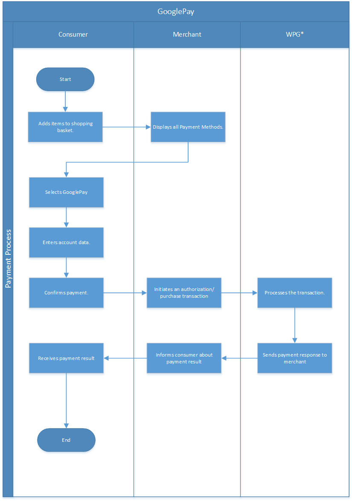

[#GooglePay]
=== Google Pay™

[#GooglePay_Introduction]
==== Introduction

Wirecard lets merchants take advantage of fast, cashless payments for
products and services via a mobile device with Google Pay™. +
Google Pay is the fast, simple way to pay at millions of places – on
sites, in apps, and in stores. It brings together everything you need at
checkout and protects your payment info with multiple layers of
security. +
Plus, Google Pay makes it easy to redeem loyalty points, manage your
cards, and get personalized suggestions to help you save time and money.

[#GooglePay_TransactionTypes]
==== Transaction Types

[%autowidth]
|===
|Transaction Type (WPG <<GooglePay_TransactionTypes_Footnote, ^(*)^>>) |Transaction Type (Google Pay)

|authorization |Authorizations
|purchase |One-Time
|capture-authorization |Partial shipment
|refund-capture, refund-purchase |Refund
|void-authorization |Void
|===

[#GooglePay_TransactionTypes_Footnote]
(*) WPG = Wirecard Payment Gateway

[#GooglePay_TestCredentials]
==== Test Credentials

[#GooglePay_TestCredentials_Tokenized]
.For GooglePay tokenized cards Testing

[%autowidth]
[cols=",a,v"]
[stripes=none]
|===
.2+|URLs (Endpoints)
|*To Test Environment*
|``\https://api-test.wirecard.com/engine/rest/payments/``
|*To Production Environment*
|``\https://api.wirecard.com/engine/rest/payments/``
|Currencies
2+|AUD ,CAD ,CHF ,CZK ,DKK ,EUR ,GBP ,HRK ,HUF ,ILS ,INR ,JPY ,MXN ,NZD,PLN ,RON ,RUB ,SEK ,SGD ,THB ,TRY ,USD ,ZAR
|Countries
2+|International
3+|
.5+|*Test Merchant Account ID*
|Merchant-Account-ID +
_This property value is set as the gatewayMerchantId in GATEWAY_TOKENIZATION_PARAMETERS of the merchant google app (eg.merchant google test app)_
|3a3d15ec-197a-4958-890e-9843f86207ee 
|Username
|70000-APITEST-AP
|Password
|qD2wzQ_hrc!8
|Google API Gateway ID +
_This property value is set as the GATEWAY_TOKENIZATION_NAME in the merchant google app (eg. merchant google test app)_
|wirecard
|Secret Key
|5c879659-f7ab-41ea-bf23-df9f4b953a33
3+|
|IPN Encoding
2+|Base64
|Payment Mode
2+|tokenized cards
.2+|Requests/Responses
|Format (Languages)
|XML
|Methods
|POST, GET
|===

[#GooglePay_TestCredentials_NonTokenized]
.For GooglePay non-tokenized cards testing

[%autowidth]
[cols=",a,v"]
[stripes=none]
|===
.2+|URLs (Endpoints)
|*To Test Environment*
|``\https://api-test.wirecard.com/engine/rest/payments/``
|*To Production Environment*
|``\https://api.wirecard.com/engine/rest/payments/``
|Currencies
2+|AUD ,CAD ,CHF ,CZK ,DKK ,EUR ,GBP ,HRK ,HUF ,ILS ,INR ,JPY ,MXN ,NZD, PLN ,RON ,RUB ,SEK ,SGD ,THB ,TRY ,USD ,ZAR
|Countries
2+|International
3+|
.5+|*Test Merchant Account ID*
|Merchant-Account-ID +
_This property value is set as the gatewayMerchantId in GATEWAY_TOKENIZATION_PARAMETERS of the merchant google app (eg.merchant google test app)_
|9fcacb0d-b46a-4ce2-867b-6723687fdba1
|Username
|70000-APITEST-AP
|Password
|qD2wzQ_hrc!8
|Google API Gateway ID +
_This property value is set as the GATEWAY_TOKENIZATION_NAME in the merchant google app (eg. merchant google test app)_
|wirecard
|Secret Key
|bd60d7b0-b5a0-4ffe-b2db-e004a0fce893
3+|
|IPN Encoding
2+|Base64
|Payment Mode
2+|non-tokenized cards
.2+|Requests/Responses
|Format (Languages)
|XML
|Methods
|POST, GET
|===

[#GooglePay_MerchantEndToEndTesting]
==== Merchant End to End Testing

[#GooglePay_MerchantEndToEndTesting_NonTokenized]
===== 1. Testing with a non-tokenized card (google-pay cryptogram contains the PAN)
. Add a credit card to your google account
. Follow Google Pay instruction to create a test app to generate a
test cryptogram (Please refer
to 
https://developers.google.com/pay/api/android/guides/setup
& 
https://developers.google.com/pay/api/android/guides/tutorial
for in-app integration and 
https://developers.google.com/pay/api/android/guides/setup
& 
https://developers.google.com/pay/api/android/guides/tutorial
for web integration)
. Modify to use 'wirecard' as the GATEWAY_TOKENIZATION_NAME and the
provided merchant-account-id as  gatewayMerchantId in
GATEWAY_TOKENIZATION_PARAMETERS
. Create the request payload with the test cryptogram and send it to
payment gateway for processing (Please refer to the sample request
payload with google-pay cryptogram below)

//-

[#GooglePay_MerchantEndToEndTesting_Tokenized]
===== 2. Testing with a tokenized card (google-pay cryptogram contains a token)
. Add a contactless enabled credit card using google-pay app in your
android phone
. Follow Google Pay instruction to create a test app to generate a
test cryptogram (Please refer
to 
https://developers.google.com/pay/api/android/guides/setup
& 
https://developers.google.com/pay/api/android/guides/tutorial
for in-app integration and 
https://developers.google.com/pay/api/android/guides/setup
& 
https://developers.google.com/pay/api/android/guides/tutorial
for web integration)
. Modify to use 'wirecard' as the GATEWAY_TOKENIZATION_NAME and the
provided merchant-account-id as gatewayMerchantId in
GATEWAY_TOKENIZATION_PARAMETERS
. Create the request payload with that test cryptogram and send it to
the payment gateway for processing (Please refer to the sample request
payload with google-pay cryptogram below).

//-

[#GooglePay_Fields]
==== Fields

``<cryptogram-value>`` is optional in the response.

All the other fields used for Google Pay requests, responses and
notifications are the same as the REST API Fields. Please refer to
the <<RestApi_Fields, API field list>>.

[#GooglePay_Workflow]
==== Workflow

[#GooglePay_Samples]
==== Samples: Requests and Responses

[#GooglePay_Samples_Authorization]
===== _authorization_

.XML Authorization Request (Successful)

[source,XML]
----
<payment xmlns="http://www.elastic-payments.com/schema/payment">
  <merchant-account-id>9fcacb0d-b46a-4ce2-867b-6723687fdba1</merchant-account-id>
  <request-id>0cb57755-0fa8-4113-bd93-dc0105ae13b0</request-id>
  <transaction-type>authorization</transaction-type>
  <requested-amount currency="USD">0.20</requested-amount>
  <account-holder>
    <first-name>John</first-name>
    <last-name>Doe</last-name>
    <email>tech.pdi-gw@wirecard.com</email>
    <address>
      <street1>Any Street</street1>
      <city>Toronto</city>
      <state>ON</state>
      <country>CA</country>
      <postal-code>M2H1C9</postal-code>
    </address>
  </account-holder>
  <card>
    <card-type>visa</card-type>
  </card>
  <cryptogram>
    <cryptogram-value>eyJzaWduYXR1cmUiOiJNRVlDSVFDSVM0QVZRV2ZXTEFBbW56TVZsMXUwckViZnFIM3g0UDhXUVd6K1VrL3dJZ0loQUkvc3oyOHBqVTFBbmluRnlDVGVienAzcXI3ZGs2bXN1WHlZM1JyOCtGbW8iLCJwcm90b2NvbFZlcnNpb24iOiJFQ3YxIiwic2lnbmVkTWVzc2FnZSI6IntcImVuY3J5cHRlZE1lc3NhZ2VcIjpcIjl2RFVMS1JUMUpSWXRTWlZBbkRNR3VCNzJEUFVlb3pVQkJ6NDVmZ2J0bkdrTStRYTFYTThEanI2Q3BhNGxiWDlhOFczWTVhWXppYkNBRWhUWUNuakNLVXV0clp3bHNPYmpNUXJ6a0dPTWhobENkcnU2alFzMnp3ODZCaTVvNkFISThycVg3RFMrcUpSZk9XRmJEM2dHQ1VZVjdBUURUenQveCtNOFkzUkpOeFdIYUdIVE5DNDQ1OHowZHgra2VLWWF6YkJXUWpldXE0bnIzbmdQUkVFa1lXeTN3TFFYb3JjYzZRTUZIa2xJazJ1YzExa2ttWllKRksyU2tGbDQ4SDZ1aGdUeG8ycEJrWkVlR2EyUjVRTjc0NDJ2VHZ4bGxJQW9NMkc3UkNFNmlxODNQSzlaaUNtWURoYXBHaTI0NnpPRG56Z0tiMlFvSXVWS2wrZFRydUowdzdVRkJpRTBFZ3lWVU1iY1JmcjFQaWJtNThHaFhFRU9JTWV6OE55S0s1dFBmdFkwMmRiV3ZpNVFtRisyK2diUFA1Z1h2eCtJRTN1ZVJobGJYOWFmUFo5M1JRVmxKUFkvcWtMYkVIaW1tSkFRVW9HU1lrZTRlSEdRSE9ib2tDaU5WQlg3dTRsVEIzUmNhY1FiNlJ3bGdcXHUwMDNkXFx1MDAzZFwiLFwiZXBoZW1lcmFsUHVibGljS2V5XCI6XCJCSnNaYWdTclowNFl4SmhMbTNhNkhST3dWdkJYRnFnc1NETlc4eEZqU2E1NithdGVHb0l6NHdYc3VFamh2VDllMWNkL2k5VXJqT0t4cEpXUTZzQ0czdGtcXHUwMDNkXCIsXCJ0YWdcIjpcIngxNkU5Y3U1UTZscUhlMENzL0FtZ3drMzcxeGZNZWNsZXAwak5jRWtIeFlcXHUwMDNkXCJ9In0=</cryptogram-value>
    <cryptogram-type>google-pay</cryptogram-type>
  </cryptogram>
  <ip-address>127.0.0.1</ip-address>
  <entry-mode>mcommerce</entry-mode>
  <payment-methods>
    <payment-method name="creditcard"/>
  </payment-methods>
</payment>
----

.XML Authorization Response (Successful)

[source,XML]
----
<payment xmlns="http://www.elastic-payments.com/schema/payment" xmlns:ns2="http://www.elastic-payments.com/schema/epa/transaction" self="https://api-test.wirecard.com:443/engine/rest/merchants/9fcacb0d-b46a-4ce2-867b-6723687fdba1/payments/a13463f2-4a77-4b76-acb8-5c829535f847">
  <merchant-account-id ref="https://api-test.wirecard.com:443/engine/rest/config/merchants/9fcacb0d-b46a-4ce2-867b-6723687fdba1">9fcacb0d-b46a-4ce2-867b-6723687fdba1</merchant-account-id>
  <transaction-id>a13463f2-4a77-4b76-acb8-5c829535f847</transaction-id>
  <request-id>0cb57755-0fa8-4113-bd93-dc0105ae13b0</request-id>
  <transaction-type>authorization</transaction-type>
  <transaction-state>success</transaction-state>
  <completion-time-stamp>2018-09-20T13:51:10.000Z</completion-time-stamp>
  <statuses>
    <status code="201.0000" description="3d-acquirer:The resource was successfully created." severity="information"/>
  </statuses>
  <requested-amount currency="USD">0.20</requested-amount>
  <account-holder>
    <first-name>John</first-name>
    <last-name>Doe</last-name>
    <email>tech.pdi-gw@wirecard.com</email>
    <address>
      <street1>Any Street</street1>
      <city>Toronto</city>
      <state>ON</state>
      <country>CA</country>
      <postal-code>M2H1C9</postal-code>
    </address>
  </account-holder>
  <cryptogram>
    <cryptogram-type>google-pay</cryptogram-type>
    <cryptogram-value>eyJzaWduYXR1cmUiOiJNRVlDSVFDSVM0QVZRV2ZXTEFBbW56TVZsMXUwckViZnFIM3g0UDhXUVd6K1VrL3dJZ0loQUkvc3oyOHBqVTFBbmluRnlDVGVienAzcXI3ZGs2bXN1WHlZM1JyOCtGbW8iLCJwcm90b2NvbFZlcnNpb24iOiJFQ3YxIiwic2lnbmVkTWVzc2FnZSI6IntcImVuY3J5cHRlZE1lc3NhZ2VcIjpcIjl2RFVMS1JUMUpSWXRTWlZBbkRNR3VCNzJEUFVlb3pVQkJ6NDVmZ2J0bkdrTStRYTFYTThEanI2Q3BhNGxiWDlhOFczWTVhWXppYkNBRWhUWUNuakNLVXV0clp3bHNPYmpNUXJ6a0dPTWhobENkcnU2alFzMnp3ODZCaTVvNkFISThycVg3RFMrcUpSZk9XRmJEM2dHQ1VZVjdBUURUenQveCtNOFkzUkpOeFdIYUdIVE5DNDQ1OHowZHgra2VLWWF6YkJXUWpldXE0bnIzbmdQUkVFa1lXeTN3TFFYb3JjYzZRTUZIa2xJazJ1YzExa2ttWllKRksyU2tGbDQ4SDZ1aGdUeG8ycEJrWkVlR2EyUjVRTjc0NDJ2VHZ4bGxJQW9NMkc3UkNFNmlxODNQSzlaaUNtWURoYXBHaTI0NnpPRG56Z0tiMlFvSXVWS2wrZFRydUowdzdVRkJpRTBFZ3lWVU1iY1JmcjFQaWJtNThHaFhFRU9JTWV6OE55S0s1dFBmdFkwMmRiV3ZpNVFtRisyK2diUFA1Z1h2eCtJRTN1ZVJobGJYOWFmUFo5M1JRVmxKUFkvcWtMYkVIaW1tSkFRVW9HU1lrZTRlSEdRSE9ib2tDaU5WQlg3dTRsVEIzUmNhY1FiNlJ3bGdcXHUwMDNkXFx1MDAzZFwiLFwiZXBoZW1lcmFsUHVibGljS2V5XCI6XCJCSnNaYWdTclowNFl4SmhMbTNhNkhST3dWdkJYRnFnc1NETlc4eEZqU2E1NithdGVHb0l6NHdYc3VFamh2VDllMWNkL2k5VXJqT0t4cEpXUTZzQ0czdGtcXHUwMDNkXCIsXCJ0YWdcIjpcIngxNkU5Y3U1UTZscUhlMENzL0FtZ3drMzcxeGZNZWNsZXAwak5jRWtIeFlcXHUwMDNkXCJ9In0=</cryptogram-value>
  </cryptogram>
  <ip-address>127.0.0.1</ip-address>
  <descriptor></descriptor>
  <payment-methods>
    <payment-method name="creditcard"/>
  </payment-methods>
  <authorization-code>361538</authorization-code>
  <api-id>elastic-api</api-id>
  <entry-mode>mcommerce</entry-mode>
  <provider-account-id>0000003174475EA0</provider-account-id>
</payment>
----

[#GooglePay_Samples_CaptureAuthorization]
===== _capture-authorization_

.XML Capture-Authorization Request (Successful)

[source,XML]
----
<payment xmlns="http://www.elastic-payments.com/schema/payment">
    <merchant-account-id>9fcacb0d-b46a-4ce2-867b-6723687fdba1</merchant-account-id>
    <request-id>c09207d2-e774-4df4-8b1d-b26934bde7a0</request-id>
    <transaction-type>capture-authorization</transaction-type>
    <parent-transaction-id>a13463f2-4a77-4b76-acb8-5c829535f847</parent-transaction-id>
    <requested-amount currency="USD">0.20</requested-amount>
    <ip-address>127.0.0.1</ip-address>
</payment>
----

.XML Capture-Authorization Response (Successful)

[source,XML]
----
<payment self="https://api-test.wirecard.com:443/engine/rest/merchants/9fcacb0d-b46a-4ce2-867b-6723687fdba1/payments/88915dc8-f144-4390-85d1-f7e84cb14a99" xmlns="http://www.elastic-payments.com/schema/payment" xmlns:ns2="http://www.elastic-payments.com/schema/epa/transaction">
   <merchant-account-id ref="https://api-test.wirecard.com:443/engine/rest/config/merchants/9fcacb0d-b46a-4ce2-867b-6723687fdba1">9fcacb0d-b46a-4ce2-867b-6723687fdba1</merchant-account-id>
   <transaction-id>88915dc8-f144-4390-85d1-f7e84cb14a99</transaction-id>
   <request-id>c09207d2-e774-4df4-8b1d-b26934bde7a0</request-id>
   <transaction-type>capture-authorization</transaction-type>
   <transaction-state>success</transaction-state>
   <completion-time-stamp>2018-09-20T14:21:15.000Z</completion-time-stamp>
   <statuses>
      <status code="201.0000" description="3d-acquirer:The resource was successfully created." severity="information"/>
   </statuses>
   <requested-amount currency="USD">0.20</requested-amount>
   <parent-transaction-id>a13463f2-4a77-4b76-acb8-5c829535f847</parent-transaction-id>
   <account-holder>
      <first-name>John</first-name>
      <last-name>Doe</last-name>
      <email>tech.pdi-gw@wirecard.com</email>
      <address>
         <street1>Any Street</street1>
         <city>Toronto</city>
         <state>ON</state>
         <country>CA</country>
         <postal-code>M2H1C9</postal-code>
      </address>
   </account-holder>
   <card-token>
      <masked-account-number>411111******1111</masked-account-number>
   </card-token>
   <cryptogram>
      <cryptogram-type>google-pay</cryptogram-type>
   </cryptogram>
   <ip-address>127.0.0.1</ip-address>
   <payment-methods>
      <payment-method name="creditcard"/>
   </payment-methods>
   <parent-transaction-amount currency="USD">0.200000</parent-transaction-amount>
   <authorization-code>361538</authorization-code>
   <api-id>elastic-api</api-id>
   <entry-mode>mcommerce</entry-mode>
   <provider-account-id>0000003174475EA0</provider-account-id>
</payment>
----

[#GooglePay_Samples_Purchase]
===== _purchase_

.XML Purchase Request (Successful)

[source,XML]
----
 <payment xmlns="http://www.elastic-payments.com/schema/payment">
  <merchant-account-id>9fcacb0d-b46a-4ce2-867b-6723687fdba1</merchant-account-id>
  <request-id>5d631840-78a8-435a-94e9-f49f58bc04bb</request-id>
  <transaction-type>purchase</transaction-type>
  <requested-amount currency="USD">0.20</requested-amount>
  <account-holder>
    <first-name>John</first-name>
    <last-name>Doe</last-name>
    <email>tech.pdi-gw@wirecard.com</email>
    <address>
      <street1>Any Street</street1>
      <city>Toronto</city>
      <state>ON</state>
      <country>CA</country>
      <postal-code>M2H1C9</postal-code>
    </address>
  </account-holder>
  <card>
   <card-type>visa</card-type>
  </card>
  <cryptogram>
    <cryptogram-value>eyJzaWduYXR1cmUiOiJNRVlDSVFDSVM0QVZRV2ZXTEFBbW56TVZsMXUwckViZnFIM3g0UDhXUVd6K1VrL3dJZ0loQUkvc3oyOHBqVTFBbmluRnlDVGVienAzcXI3ZGs2bXN1WHlZM1JyOCtGbW8iLCJwcm90b2NvbFZlcnNpb24iOiJFQ3YxIiwic2lnbmVkTWVzc2FnZSI6IntcImVuY3J5cHRlZE1lc3NhZ2VcIjpcIjl2RFVMS1JUMUpSWXRTWlZBbkRNR3VCNzJEUFVlb3pVQkJ6NDVmZ2J0bkdrTStRYTFYTThEanI2Q3BhNGxiWDlhOFczWTVhWXppYkNBRWhUWUNuakNLVXV0clp3bHNPYmpNUXJ6a0dPTWhobENkcnU2alFzMnp3ODZCaTVvNkFISThycVg3RFMrcUpSZk9XRmJEM2dHQ1VZVjdBUURUenQveCtNOFkzUkpOeFdIYUdIVE5DNDQ1OHowZHgra2VLWWF6YkJXUWpldXE0bnIzbmdQUkVFa1lXeTN3TFFYb3JjYzZRTUZIa2xJazJ1YzExa2ttWllKRksyU2tGbDQ4SDZ1aGdUeG8ycEJrWkVlR2EyUjVRTjc0NDJ2VHZ4bGxJQW9NMkc3UkNFNmlxODNQSzlaaUNtWURoYXBHaTI0NnpPRG56Z0tiMlFvSXVWS2wrZFRydUowdzdVRkJpRTBFZ3lWVU1iY1JmcjFQaWJtNThHaFhFRU9JTWV6OE55S0s1dFBmdFkwMmRiV3ZpNVFtRisyK2diUFA1Z1h2eCtJRTN1ZVJobGJYOWFmUFo5M1JRVmxKUFkvcWtMYkVIaW1tSkFRVW9HU1lrZTRlSEdRSE9ib2tDaU5WQlg3dTRsVEIzUmNhY1FiNlJ3bGdcXHUwMDNkXFx1MDAzZFwiLFwiZXBoZW1lcmFsUHVibGljS2V5XCI6XCJCSnNaYWdTclowNFl4SmhMbTNhNkhST3dWdkJYRnFnc1NETlc4eEZqU2E1NithdGVHb0l6NHdYc3VFamh2VDllMWNkL2k5VXJqT0t4cEpXUTZzQ0czdGtcXHUwMDNkXCIsXCJ0YWdcIjpcIngxNkU5Y3U1UTZscUhlMENzL0FtZ3drMzcxeGZNZWNsZXAwak5jRWtIeFlcXHUwMDNkXCJ9In0=</cryptogram-value>
    <cryptogram-type>google-pay</cryptogram-type>
  </cryptogram>
  <ip-address>127.0.0.1</ip-address>
  <payment-methods>
    <payment-method name="creditcard"/>
  </payment-methods>
</payment>
----

.XML Purchase Response (Successful)

[source,XML]
----
 <payment self="https://api-test.wirecard.com:443/engine/rest/merchants/9fcacb0d-b46a-4ce2-867b-6723687fdba1/payments/9d865c78-4c19-4667-ade5-1c1749417a2a" xmlns="http://www.elastic-payments.com/schema/payment" xmlns:ns2="http://www.elastic-payments.com/schema/epa/transaction">
   <merchant-account-id ref="https://api-test.wirecard.com:443/engine/rest/config/merchants/9fcacb0d-b46a-4ce2-867b-6723687fdba1">9fcacb0d-b46a-4ce2-867b-6723687fdba1</merchant-account-id>
   <transaction-id>9d865c78-4c19-4667-ade5-1c1749417a2a</transaction-id>
   <request-id>5d631840-78a8-435a-94e9-f49f58bc04bb</request-id>
   <transaction-type>purchase</transaction-type>
   <transaction-state>success</transaction-state>
   <completion-time-stamp>2018-09-20T14:24:17.000Z</completion-time-stamp>
   <statuses>
      <status code="201.0000" description="3d-acquirer:The resource was successfully created." severity="information"/>
   </statuses>
   <requested-amount currency="USD">0.20</requested-amount>
   <account-holder>
      <first-name>John</first-name>
      <last-name>Doe</last-name>
      <email>tech.pdi-gw@wirecard.com</email>
      <address>
         <street1>Any Street</street1>
         <city>Toronto</city>
         <state>ON</state>
         <country>CA</country>
         <postal-code>M2H1C9</postal-code>
      </address>
   </account-holder>
   <cryptogram>
      <cryptogram-type>google-pay</cryptogram-type>
      <cryptogram-value>eyJzaWduYXR1cmUiOiJNRVlDSVFDSVM0QVZRV2ZXTEFBbW56TVZsMXUwckViZnFIM3g0UDhXUVd6K1VrL3dJZ0loQUkvc3oyOHBqVTFBbmluRnlDVGVienAzcXI3ZGs2bXN1WHlZM1JyOCtGbW8iLCJwcm90b2NvbFZlcnNpb24iOiJFQ3YxIiwic2lnbmVkTWVzc2FnZSI6IntcImVuY3J5cHRlZE1lc3NhZ2VcIjpcIjl2RFVMS1JUMUpSWXRTWlZBbkRNR3VCNzJEUFVlb3pVQkJ6NDVmZ2J0bkdrTStRYTFYTThEanI2Q3BhNGxiWDlhOFczWTVhWXppYkNBRWhUWUNuakNLVXV0clp3bHNPYmpNUXJ6a0dPTWhobENkcnU2alFzMnp3ODZCaTVvNkFISThycVg3RFMrcUpSZk9XRmJEM2dHQ1VZVjdBUURUenQveCtNOFkzUkpOeFdIYUdIVE5DNDQ1OHowZHgra2VLWWF6YkJXUWpldXE0bnIzbmdQUkVFa1lXeTN3TFFYb3JjYzZRTUZIa2xJazJ1YzExa2ttWllKRksyU2tGbDQ4SDZ1aGdUeG8ycEJrWkVlR2EyUjVRTjc0NDJ2VHZ4bGxJQW9NMkc3UkNFNmlxODNQSzlaaUNtWURoYXBHaTI0NnpPRG56Z0tiMlFvSXVWS2wrZFRydUowdzdVRkJpRTBFZ3lWVU1iY1JmcjFQaWJtNThHaFhFRU9JTWV6OE55S0s1dFBmdFkwMmRiV3ZpNVFtRisyK2diUFA1Z1h2eCtJRTN1ZVJobGJYOWFmUFo5M1JRVmxKUFkvcWtMYkVIaW1tSkFRVW9HU1lrZTRlSEdRSE9ib2tDaU5WQlg3dTRsVEIzUmNhY1FiNlJ3bGdcXHUwMDNkXFx1MDAzZFwiLFwiZXBoZW1lcmFsUHVibGljS2V5XCI6XCJCSnNaYWdTclowNFl4SmhMbTNhNkhST3dWdkJYRnFnc1NETlc4eEZqU2E1NithdGVHb0l6NHdYc3VFamh2VDllMWNkL2k5VXJqT0t4cEpXUTZzQ0czdGtcXHUwMDNkXCIsXCJ0YWdcIjpcIngxNkU5Y3U1UTZscUhlMENzL0FtZ3drMzcxeGZNZWNsZXAwak5jRWtIeFlcXHUwMDNkXCJ9In0=</cryptogram-value>
   </cryptogram>
   <ip-address>127.0.0.1</ip-address>
   <descriptor/>
   <payment-methods>
      <payment-method name="creditcard"/>
   </payment-methods>
   <authorization-code>324144</authorization-code>
   <api-id>elastic-api</api-id>
   <provider-account-id>0000003174475EA0</provider-account-id>
</payment>
----

[#GooglePay_Samples_Refund]
===== _refund_

.XML Refund Request (Successful)

[source,XML]
----
<payment xmlns="http://www.elastic-payments.com/schema/payment">
    <merchant-account-id>9fcacb0d-b46a-4ce2-867b-6723687fdba1</merchant-account-id>
    <request-id>371bdfef-649c-4375-b302-71f50c1946d0</request-id>
    <transaction-type>refund-capture</transaction-type>
    <parent-transaction-id>88915dc8-f144-4390-85d1-f7e84cb14a99</parent-transaction-id>
    <requested-amount currency="USD">0.20</requested-amount>
    <ip-address>127.0.0.1</ip-address>
</payment>
----

.XML Refund Response (Successful)

[source,XML]
----
<payment self="https://api-test.wirecard.com:443/engine/rest/merchants/9fcacb0d-b46a-4ce2-867b-6723687fdba1/payments/a1a788df-e566-44d8-ae1c-149b76e1a3c7" xmlns="http://www.elastic-payments.com/schema/payment" xmlns:ns2="http://www.elastic-payments.com/schema/epa/transaction">
   <merchant-account-id ref="https://api-test.wirecard.com:443/engine/rest/config/merchants/9fcacb0d-b46a-4ce2-867b-6723687fdba1">9fcacb0d-b46a-4ce2-867b-6723687fdba1</merchant-account-id>
   <transaction-id>a1a788df-e566-44d8-ae1c-149b76e1a3c7</transaction-id>
   <request-id>371bdfef-649c-4375-b302-71f50c1946d0</request-id>
   <transaction-type>refund-capture</transaction-type>
   <transaction-state>success</transaction-state>
   <completion-time-stamp>2018-09-20T14:22:03.000Z</completion-time-stamp>
   <statuses>
      <status code="201.0000" description="3d-acquirer:The resource was successfully created." severity="information"/>
   </statuses>
   <requested-amount currency="USD">0.20</requested-amount>
   <parent-transaction-id>88915dc8-f144-4390-85d1-f7e84cb14a99</parent-transaction-id>
   <account-holder>
      <first-name>John</first-name>
      <last-name>Doe</last-name>
      <email>tech.pdi-gw@wirecard.com</email>
      <address>
         <street1>Any Street</street1>
         <city>Toronto</city>
         <state>ON</state>
         <country>CA</country>
         <postal-code>M2H1C9</postal-code>
      </address>
   </account-holder>
   <card-token>
      <masked-account-number>411111******1111</masked-account-number>
   </card-token>
   <cryptogram>
      <cryptogram-type>google-pay</cryptogram-type>
   </cryptogram>
   <ip-address>127.0.0.1</ip-address>
   <payment-methods>
      <payment-method name="creditcard"/>
   </payment-methods>
   <parent-transaction-amount currency="USD">0.200000</parent-transaction-amount>
   <authorization-code/>
   <api-id>elastic-api</api-id>
   <entry-mode>mcommerce</entry-mode>
   <provider-account-id>0000003174475EA0</provider-account-id>
</payment>
----

[#GooglePay_Samples_Void]
===== _void_

.*XML Void-Authorization Request (Successful)*

[source,XML]
----
<payment xmlns="http://www.elastic-payments.com/schema/payment">
    <merchant-account-id>9fcacb0d-b46a-4ce2-867b-6723687fdba1</merchant-account-id>
    <request-id>98dfcc05-6b4b-4925-9c48-2912c37a2317</request-id>
    <transaction-type>void-authorization</transaction-type>
    <parent-transaction-id>b517f83a-a06e-4771-a222-75987557c814</parent-transaction-id>
    <requested-amount currency="EUR">1.01</requested-amount>
    <ip-address>127.0.0.1</ip-address>
</payment>
----

.XML Void-Authorization Response (Successful)

[source,XML]
----
<payment self="https://api-test.wirecard.com:443/engine/rest/merchants/9fcacb0d-b46a-4ce2-867b-6723687fdba1/payments/a4cc9c9f-9958-442f-b2cd-f7ce9fa68e45" xmlns="http://www.elastic-payments.com/schema/payment" xmlns:ns2="http://www.elastic-payments.com/schema/epa/transaction">
   <merchant-account-id ref="https://api-test.wirecard.com:443/engine/rest/config/merchants/9fcacb0d-b46a-4ce2-867b-6723687fdba1">9fcacb0d-b46a-4ce2-867b-6723687fdba1</merchant-account-id>
   <transaction-id>a4cc9c9f-9958-442f-b2cd-f7ce9fa68e45</transaction-id>
   <request-id>98dfcc05-6b4b-4925-9c48-2912c37a2317</request-id>
   <transaction-type>void-authorization</transaction-type>
   <transaction-state>success</transaction-state>
   <completion-time-stamp>2018-09-20T14:23:24.000Z</completion-time-stamp>
   <statuses>
      <status code="201.0000" description="3d-acquirer:The resource was successfully created." severity="information"/>
   </statuses>
   <requested-amount currency="EUR">1.01</requested-amount>
   <parent-transaction-id>b517f83a-a06e-4771-a222-75987557c814</parent-transaction-id>
   <account-holder>
      <first-name>John</first-name>
      <last-name>Doe</last-name>
      <email>tech.pdi-gw@wirecard.com</email>
      <address>
         <street1>Any Street</street1>
         <city>Toronto</city>
         <state>ON</state>
         <country>CA</country>
         <postal-code>M2H1C9</postal-code>
      </address>
   </account-holder>
   <card-token>
      <masked-account-number>411111******1111</masked-account-number>
   </card-token>
   <cryptogram>
      <cryptogram-type>google-pay</cryptogram-type>
   </cryptogram>
   <ip-address>127.0.0.1</ip-address>
   <payment-methods>
      <payment-method name="creditcard"/>
   </payment-methods>
   <parent-transaction-amount currency="EUR">1.010000</parent-transaction-amount>
   <authorization-code>645276</authorization-code>
   <api-id>elastic-api</api-id>
   <entry-mode>mcommerce</entry-mode>
   <provider-account-id>0000003174475EA0</provider-account-id>
</payment>
----
