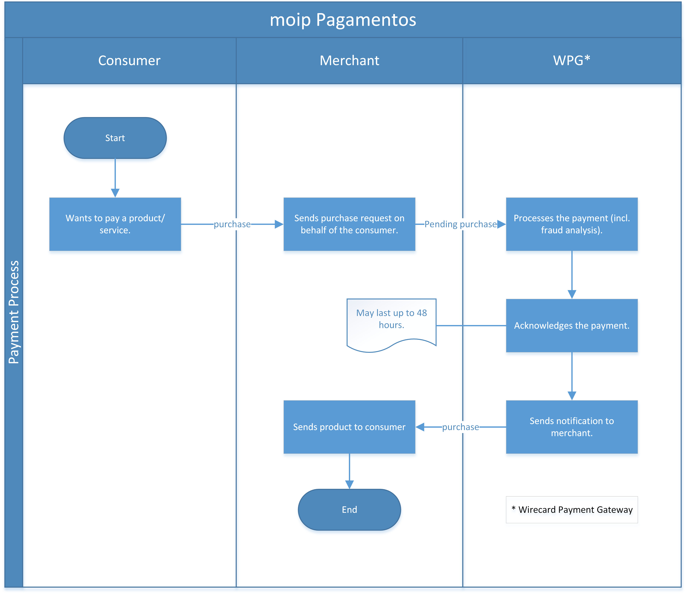

[#MoipPagamentos]
=== moip Pagamentos

[#MoipPagamentos_Introduction]
==== Introduction
[.clearfix]
--
[.right]

_moip_ is a Wirecard company which serves as a provider for transactions
realized in BRL (Brazil Real).

At the moment, _credit card_ is the only supported payment method.

The method is in PROCESSING model.
--

[#MoipPagamentos_Introduction_General]
==== General Information

[#MoipPagamentos_Introduction_General_PaymentMode]
===== Payment Mode, Countries and Currencies

This table illustrates which payment mode _moip_ belongs
to. It also provides detailed information about the countries and
currencies, which are relevant for _moip_.

.Payment Mode, Countries and Currencies
[%autowidth, cols="h,"]
|===
|Payment Mode |<<PaymentMethods_PaymentMode_OnlineBankTransfer, Online Bank Transfer>>
|Countries |Brazil (+55 is the only supported country code for phone numbers), country code 'BR'
|Currencies |BRL
|===

[#MoipPagamentos_Introduction_General_CommunicationFormats]
===== Communication Formats

This table illustrates how _moip_ notifications are
encoded and which languages and methods can be used for requests and
responses.

.Communication Formats
[%autowidth]
|===
.2+h|Requests/Responses | Format | XML, NVP
                        | Methods | POST
h|IPN Encodement      2+| Base64
|===

[#MoipPagamentos_Transactions]
==== Transactions

[#MoipPagamentos_Transactions_Configuring]
===== Configuring Your Account for _moip_

The merchant account you want to use for BRL transactions has to be
configured for _moip_ specifically, otherwise it will not be able to
process them. At the moment, merchant accounts configured for _moip_
cannot use any other providers.

NOTE: If you want to process transactions from multiple providers, you will
need additional merchant accounts for those.

[#MoipPagamentos_Transactions_TransactionTypes]
===== Transaction Types

[cols="1e,2"]
[%autowidth]
|===
|Transaction Type |Link to the sample

|pending-authorization | 
|authorization |<<MoipPagamentos_XMLSamples_RestApi_paymentmethods_authorization, _authorization_ samples>>
|pending-purchase | 
|purchase |<<MoipPagamentos_XMLSamples_RestApi_paymentmethods_purchase, _purchase_ samples>>
|capture-authorization  | 
|void-authorization | 
|refund-purchase | 
|refund-capture |<<MoipPagamentos_XMLSamples_RestApi_paymentmethods_refund, _refund-capture_ samples>>
|===

For <<Glossary_TransactionType, transaction type>> details which are not given here look at <<AppendixB, Appendix B: Transaction Types>>.

[#MoipPagamentos_Transactions_ProcessingTransaction]
===== Processing a Transaction

After your account is configured for _moip_, you only need to send a
regular payment request to _{payment-gateway}_ and the rest of
the transaction is processed automatically by _{payment-gateway}_.

Due to security requirements, all payments are registered as pending. It
can take up to 48 hours before the pending status is processed and
cleared.

[#MoipPagamentos_TestCredentials]
==== Test Credentials

[%autowidth]
[cols="1,2,3"]
|===
.2+s|URLs (Endpoints) s|REST API |``\https://{test-instance-hostname}/engine/rest/payments/``
                    s|Hosted Payment Page |``\https://{test-instance-hostname}/engine/rest/paymentmethods/``
s|Merchant Account ID (MAID) 2+|0c9a0604-b997-49f8-b34e-864dd9886e30 
s|Username 2+|70000-APITEST-AP 
s|Password 2+|qD2wzQ_hrc!8 
s|Merchant Account name 2+|MOIP Wirecard Test Account

////

Do we need the Merchant Account Name? NO would make white labeling easier! 

////

s|Secret Key 2+|e3c51303-3255-4520-8f41-17f1c2c1e9b3
s|Visible in _{enterprise-portal-name}_? 2+|yes (under '_Search Card Transactions (EE)_')
s|Test Credit Card Number 2+|Please contact <<ContactUs, merchant support>> for complete test credentials.
|===

NOTE: _moip_ gateway supports the following card brands: VISA, MasterCard,
Diners Club, Discover, AMEX, Hipercard, ELO, Hiper

[#MoipPagamentos_TestCredentials_TestCards]
===== Test Cards

[%autowidth]
|===
|Scheme |Number

|Mastercard |5555666677778880
|Visa |4012001037141112
|Amex |376449047333005
|Elo |6362970000457013
|Diners |36490102462661
|Hiper |6370950000000005
|Hipercard |6062825624254001
|===

*Expiration Date* needs to be in the future and *CVV* can be anything with 3
characters except AMEX that contains 4 characters.

[#MoipPagamentos_TestCredentials_CreateAccount]
===== Create a Classical _moip_ Account

NOTE: This is currently done by the _moip_ team. 

Having a Classical _moip_ Account means that the owner of that account
can manage its sales in the _moip_ environment. _moip_ offers two types
of accounts, allowing any marketplace or platform to create two
different onboarding experiences, they are: Transparent _moip_ Account
and Classical _moip_ Account.

[%autowidth]
|===
|Transparent _moip_ Account |Classical _moip_ Account

|Customized experience |Merchants have access to a _moip_ Account.
|Marketplace look and feel |_moip_ provides support for sellers.
|Full marketplace onboarding |Sellers can have their own Ecommerce and send invoices.
|Exclusive relationship with the sellers |Merchant can use any marketplace.
|Moip white label |Payout process through _moip_ Dashboard.
|===

The *token* and *keys* will be provided afterwards to the merchant support
team to proceed with _{payment-gateway}_ merchant setup.

[#MoipPagamentos_TestCredentials_CreateAccount_MerchantDataRequired]
====== Merchant Data Required by _moip_

- Email Address 
- Name
- Last Name
- Tax Document (CPF) - This is the Brazilian equivalent of a Social
Security Number. That's the only personal document we currently accept
in the account creation.
- Identity Document
- Birth Date
- Phone Number
- Address
- Company Name
- Company Business Name
- Company Tax Document (CNPJ)

//-

[#MoipPagamentos_Workflow]
==== Workflow

. Consumer adds products to cart and proceeds to checkout.
. Merchant sends _purchase_ request to _WPG_.
. _WPG_ returns _pending-purchase_ back to merchant.
. _moip_ acknowledges the payment to _WPG_ within 48 hours.
. _WPG_ sends a final notification to merchant.
. The payment is done.

//-

[#MoipPagamentos_Fields]
==== Fields

The following elements are mandatory (M), optional (O) or conditional
\(C) depending on circumstances and merchant account settings for
additional features in a transaction process.

[#MoipPagamentos_Fields_payment]
.payment
[cols="20e,5,5,5,5,5,5,5,5,40"]
|===
.2+h|Field 3+h|Transaction Process (REST API) 3+h|Transaction Process (HPP) .2+h|Datatype .2+h|Size .2+h|Description
h|Request h|Response h|Notification h|Request h|Response h|Notification
|merchant-account-id |M |M |M |M |M |M |String |36 |Unique identifier for a merchant account.
|merchant-account-resolver-category |C |C |C |C |O |C |String |36 |The category used to resolve the merchant account based on rules on
input. It is mandatory only, if _Merchant Resolving_ is activated.
|transaction-id | |M |M | |M |M |String |36 |This is the unique identifier for a transaction. It is generated by
_{payment-gateway}_.
|request-id |M |M |M |M |M |M |String |150 |This is the identification number of the request. It has to be unique
for each request.
|requested-amount@currency |M |M |M |M |M |M |String |3 |This is the amount of the transaction and its currency. The amount of
the decimal place is dependent of the currency. +
It is optional for _capture_ and _void_ requests (only the full amount can
be captured or voided). +
It is optional for _refund_ requests.
|transaction-type |M |M |M |M |M |M |String |30 |This is the type for a transaction.
|transaction-state | |M |M |  |M |M |String |12 |This is the status of a transaction.
|completion-time-stamp | |M |M | |M |M |Timestamp | |This is the time stamp of completion of request.
|avs-code | |O |O | | | |String |36 |This is the result of address' validation.
|csc-code | |O |O | | | |String |36 |This is the result of CVC validation.
|===

[#MoipPagamentos_Fields_statuses]
.statuses
[cols="20e,5,5,5,5,5,5,5,5,40"]
|===
.2+h|Field 3+h|Transaction Process (REST API) 3+h|Transaction Process (HPP) .2+h|Datatype .2+h|Size .2+h|Description
h|Request h|Response h|Notification h|Request h|Response h|Notification
|statuses.status | |O |O | |M |M |String |12 |This is the status of a transaction.
|status@code | |M |M | |M |M |String |12 |This is the code of the status of a transaction.
|status@description | |M |M | |M |M |String |256 |This is the description to the status code of a transaction.
|status@severity | |M |M | |M |M |String |20 |This field gives information if a status is a warning, an error or
an information.
|parent-transaction-id |C |C |C |C |O |O |String |36 |This is the unique identifier of the referenced transaction. This might
be mandatory if ``merchant-account-id`` or
``merchant-account-resolver-category`` is not used or this is a follow-up
payment after an _authorization_ or _purchase_.
|===

[#MoipPagamentos_Fields_paymentmethods]
.payment-methods
[cols="20e,5,5,5,5,5,5,5,5,40"]
|===
.2+h| Field 3+h|Transaction Process (REST API) 3+h|Transaction Process (HPP) .2+h|Datatype .2+h|Size .2+h|Description
h|Request h|Response h|Notification h|Request h|Response h|Notification
|payment-method@name |M |M |  |M |M |M |String | |Name of payment method.
|payment-method@url |O |O | | |M | |String | |A redirect link to _{payment-provider-name} Payment Page_ to collect consumer's payment
data and submit payment.
|===

[#MoipPagamentos_Fields_accountholder]
.account-holder
[cols="20e,5,5,5,5,5,5,5,5,40"]
|===
.2+h| Field 3+h|Transaction Process (REST API) 3+h|Transaction Process (HPP) .2+h|Datatype .2+h|Size .2+h|Description
h|Request h|Response h|Notification h|Request h|Response h|Notification
|first-name |M |M |M |O | |M |String |32 |This is the first name of the consumer.
|last-name |M |M |M |O | |M |String |32 |This is the last name of the consumer.
|email |O |O |O | | |M |String |64 |This is the consumer's email address.
|gender |O |O |O | | |O |String |1 |This is the consumer's gender.
|date-of-birth |M |O |O |M | |O |Date |0 |This is the consumer's birth date in format: DD-MM-YYYY.
|phone |O |O |O |O | |O |String |32 |This is the phone number of the consumer.
|social-security-number |M |O |O |M | |O |Numeric |14 |This is the social security number of the consumer (only one of
social security number and tax number is mandatory).
|tax-number |M |O |O |M | |O |Numeric |14 |This is the tax document number of the consumer (only one of
social security number and tax number is mandatory).
|merchant-crm-id |O |O |O | | |O |String |64 |This is the merchnat crm ID of the consumer.
|device.fingerprint |O |O |O |O |O |O |String |4096 |A device fingerprint is information collected about a remote computing
device for the purpose of identification retrieved on merchants side.
Fingerprints can be used to fully or partially identify individual users
or devices even when cookies are turned off.
|===

[#MoipPagamentos_Fields_accountholderaddress]
.account-holder.address
[cols="20e,5,5,5,5,5,5,5,5,40"]
|===
.2+h| Field 3+h|Transaction Process (REST API) 3+h|Transaction Process (HPP) .2+h|Datatype .2+h|Size .2+h|Description
h|Request h|Response h|Notification h|Request h|Response h|Notification
|account-holder.address.block-no |O |O |O | | |O |String |12 |This is the block-no of the consumer.
|account-holder.address.level |O |O |O | | |O |String |3 |This is the level of the consumer.
|account-holder.address.unit |O |O |O | | |O |String |12 |This is the unit of the consumer.
|account-holder.address.street1 |O |M |M |O | |M |String |128 |This is the first part of the consumer's street.
|account-holder.address.street2 |O |M |M |O | |M |String |128 |This is the second part of the consumer's street.
|account-holder.address.city |O |M |M |O | |M |String |32 |This is the consumer's city.
|account-holder.address.state |O |M |M |O | |M |String |32 |This is the consumer's state.
|account-holder.address.country |O |M |M |O | |M |String |2 |This is the consumer's country.
|account-holder.address.postal-code |O |M |M |O | |M |String |16 |This is the consumer's postal code.
|===

[#MoipPagamentos_Fields_shipping]
.shipping
[cols="20e,5,5,5,5,5,5,5,5,40"]
|===
.2+h| Field 3+h|Transaction Process (REST API) 3+h|Transaction Process (HPP) .2+h|Datatype .2+h|Size .2+h|Description
h|Request h|Response h|Notification h|Request h|Response h|Notification
|first-name |M |M |M |M |M |M |String |32 |This is first name from shipping information.
|last-name |M |M |M |M |M |M |String |32 |This is last name from shipping information.
|email |M |M |M |M |M |M |String |32 |This is email address of the consumer.
|phone |O |O |O |O | |O |String |3 |This is phone number from shipping information.
|address |O |O |O |O | |O | | |This is used for specify the address from shipping information.
|===

[#MoipPagamentos_Fields_card]
.card
[cols="20e,5,5,5,5,5,5,5,5,40"]
|===
.2+h| Field 3+h|Transaction Process (REST API) 3+h|Transaction Process (HPP) .2+h|Datatype .2+h|Size .2+h|Description
h|Request h|Response h|Notification h|Request h|Response h|Notification
|account-number |M | | | | | |String |36 |This is the card account number of the consumer. It is mandatory if
``card-token`` is not used.
|expiration-month |M |O | | | | |Numeric |2 |This is the card's expiration month of the consumer. If this field
is configured, it will be sent in the response. +
ONLY transaction type _detokenize_ returns card elements in response.
All the other transaction types return ``card``/``card-token`` in response.
|expiration-year |M |O | | | | |Numeric |4 |This is the card's expiration year of the consumer. If this field is
configured, it will be sent in the response. +
ONLY transaction type _detokenize_ returns card elements in response.
All the other transaction types return ``card``/``card-token`` in response.
|card-security-code |M | | | | | |String |4 |This is the card's security code of the consumer.
|card-type |M |O | | | | |String |15 |This is the card's type of the consumer. If this field is configured,
it will be sent in the response.
|===

[#MoipPagamentos_Fields_cardtoken]
.card-token
[cols="20e,5,5,5,5,5,5,5,5,40"]
|===
.2+h| Field 3+h|Transaction Process (REST API) 3+h|Transaction Process (HPP) .2+h|Datatype .2+h|Size .2+h|Description
h|Request h|Response h|Notification h|Request h|Response h|Notification
|token-id | |M |M | | |M |String |36 |This is the token corresponding to ``card.account-number`` of the
consumer. It is mandatory if ``card.account-number`` is not specified.
It is unique on instance of the _{payment-gateway}_. 
|masked-account-number | |M |M | |M |M |String |36 |This is the masked version of ``card.account-number`` of the
consumer. E.g. 440804******7893. +
For REST API's request value see section
<<MoipPagamentos_Fields_accountholder, _account-holder_>>.
|===

[#MoipPagamentos_Fields_descriptor]
.descriptor
[cols="20e,5,5,5,5,5,5,5,5,40"]
|===
.2+h| Field 3+h|Transaction Process (REST API) 3+h|Transaction Process (HPP) .2+h|Datatype .2+h|Size .2+h|Description
h|Request h|Response h|Notification h|Request h|Response h|Notification
|descriptor | |M |M | | |M |String |27 |Description on the settlement of the account holder's account about a
transaction. The following characters are allowed: umlaut, -
'0-9','a-z','A-Z',' ' , '+',',','-','.'
|===

[#MoipPagamentos_Fields_apiid]
.api-id
[cols="20e,5,5,5,5,5,5,5,5,40"]
|===
.2+h| Field 3+h|Transaction Process (REST API) 3+h|Transaction Process (HPP) .2+h|Datatype .2+h|Size .2+h|Description
h|Request h|Response h|Notification h|Request h|Response h|Notification
|api-id | |M |M | | |M |String |36 |The api ID is always returned in the notification.
|===

[#MoipPagamentos_Fields_orderitems]
.order-items
[cols="20e,5,5,5,5,5,5,5,5,40"]
|===
.2+h| Field 3+h|Transaction Process (REST API) 3+h|Transaction Process (HPP) .2+h|Datatype .2+h|Size .2+h|Description
h|Request h|Response h|Notification h|Request h|Response h|Notification
|order-item.name |M |M |M |M |M |M |String |36 |Name of a product in the cart.
|order-item.amount@currency |M |M |M |M |M |M |String |3 |This is the currency and the ordered amount of the transaction.
|order-item.quantity |M |M |M |M |M |M |Numeric |9 |Quantity of ordered items.
|===

[#MoipPagamentos_XMLSamples]
==== XML Samples

[#MoipPagamentos_XMLSamples_RestApi_payments]
===== Use REST API addressing the endpoint _/payments_

NOTE: Requests sent to the endpoint ``/payments`` begin a simple XML
request/response exchange. First Name/Last Name in
<<MoipPagamentos_Fields_accountholder, account-holder>> and all the fields under
<<MoipPagamentos_Fields_card, card>> have to be present in the request.

[#MoipPagamentos_XMLSamples_RestApi_payments_purchase]
====== _purchase_

This _purchase_ sample set can also be used with the transaction type
_authorization_. *Contains mandatory fields only*.

.XML _purchase_ Request (Successful)
[source,xml]
----
<payment xmlns="http://www.elastic-payments.com/schema/payment">
  <merchant-account-id>c6b58c82-9035-4ddc-9447-6738797610e5</merchant-account-id>
  <request-id>a1901424-9791-4f8d-9826-be75d34fbbc1</request-id>
  <transaction-type>purchase</transaction-type>
  <requested-amount currency="BRL">23.00</requested-amount>
  <payment-methods>
    <payment-method name="creditcard"/>
  </payment-methods>
  <order-items>
    <order-item>
      <name>Series Box - Exterminate!</name>
      <amount currency="BRL">23.00</amount>
      <quantity>1</quantity>
    </order-item>
  </order-items>
  <account-holder>
    <first-name>Jose</first-name>
    <last-name>Portador da Silva</last-name>
    <date-of-birth>1988-12-30</date-of-birth>
    <social-security-number>22222222222</social-security-number>
  </account-holder>
  <shipping>
    <first-name>Jose</first-name>
    <last-name>Silva</last-name>
    <email>josesilva@email.com</email>
  </shipping>
  <card>
    <account-number>5555666677778884</account-number>
    <expiration-month>05</expiration-month>
    <expiration-year>2018</expiration-year>
    <card-security-code>123</card-security-code>
    <card-type>visa</card-type>
  </card>
</payment>
----

.XML _pending-purchase_ Response (Successful)
[source,xml]
----
<payment self="http://127.0.0.1:8080/engine/rest/merchants/c6b58c82-9035-4ddc-9447-6738797610e5/payments/10715235-9cc8-4c62-a798-5af8eb9fb640" xmlns="http://www.elastic-payments.com/schema/payment" xmlns:ns2="http://www.elastic-payments.com/schema/epa/transaction">
  <merchant-account-id ref="http://127.0.0.1:8080/engine/rest/config/merchants/c6b58c82-9035-4ddc-9447-6738797610e5">c6b58c82-9035-4ddc-9447-6738797610e5</merchant-account-id>
  <transaction-id>10715235-9cc8-4c62-a798-5af8eb9fb640</transaction-id>
  <request-id>a1901424-9791-4f8d-9826-be75d34fbbc1</request-id>
  <transaction-type>pending-purchase</transaction-type>
  <transaction-state>success</transaction-state>
  <completion-time-stamp>2017-06-15T13:19:22.000Z</completion-time-stamp>
  <statuses>
    <status code="201.0000" description="acquirer:The resource was successfully created." severity="information"/>
  </statuses>
  <requested-amount currency="BRL">23.00</requested-amount>
  <account-holder>
    <first-name>Jose</first-name>
    <last-name>Portador da Silva</last-name>
  </account-holder>
  <shipping>
    <first-name>Jose</first-name>
    <last-name>Silva</last-name>
    <email>josesilva@email.com</email>
  </shipping>
  <card-token>
    <token-id>5145743732788884</token-id>
    <masked-account-number>555566******8884</masked-account-number>
  </card-token>
  <order-items>
    <order-item>
      <name>Series Box - Exterminate!</name>
      <amount currency="BRL">23.00</amount>
      <quantity>1</quantity>
    </order-item>
  </order-items>
  <descriptor>demo descriptor</descriptor>
  <payment-methods>
    <payment-method name="creditcard"/>
  </payment-methods>
  <api-id>elastic-api</api-id>
</payment>
----

The notification is sent after the pending payment is cleared.

.XML _purchase_ Notification (Successful)
[source,xml]
----
<payment xmlns="http://www.elastic-payments.com/schema/payment" xmlns:ns2="http://www.elastic-payments.com/schema/epa/transaction">
  <merchant-account-id>c6b58c82-9035-4ddc-9447-6738797610e5</merchant-account-id>
  <transaction-id>a0a98a58-67da-4edb-b82f-b7352f88f993</transaction-id>
  <request-id>a1901424-9791-4f8d-9826-be75d34fbbc1</request-id>
  <transaction-type>purchase</transaction-type>
  <transaction-state>success</transaction-state>
  <completion-time-stamp>2017-06-15T13:19:23.000Z</completion-time-stamp>
  <statuses>
    <status code="201.0000" description="acquirer:The resource was successfully created." severity="information"/>
  </statuses>
  <requested-amount currency="BRL">23.000000</requested-amount>
  <account-holder>
    <first-name>Jose</first-name>
    <last-name>Portador da Silva</last-name>
  </account-holder>
  <shipping>
    <first-name>Jose</first-name>
    <last-name>Silva</last-name>
    <email>josesilva@email.com</email>
  </shipping>
  <card-token>
    <token-id>5145743732788884</token-id>
    <masked-account-number>555566******8884</masked-account-number>
  </card-token>
  <order-items>
    <order-item>
      <name>Series Box - Exterminate!</name>
      <amount currency="BRL">23.000000</amount>
      <quantity>1</quantity>
    </order-item>
  </order-items>
  <descriptor>demo descriptor</descriptor>
  <payment-methods>
    <payment-method name="creditcard"/>
  </payment-methods>
  <api-id>elastic-api</api-id>
</payment>
----

[#MoipPagamentos_XMLSamples_RestApi_paymentmethods]
===== Use REST API addressing the endpoint _/paymentmethods_

NOTE: Requests sent to the endpoint ``/paymentmethods`` return a response that
includes an URL to HPP/EPP. Those have a proper card payment form where
that additional data is entered manually by the consumer and then
forwarded for processing.

[#MoipPagamentos_XMLSamples_RestApi_paymentmethods_purchase]
====== _purchase_

This _purchase_ request can also be used with the transaction type
_authorization_. *Contains mandatory fields only*.

.XML _purchase_ Request (Successful)
[source,xml]
----
<payment xmlns="http://www.elastic-payments.com/schema/payment">
  <merchant-account-id>c6b58c82-9035-4ddc-9447-6738797610e5</merchant-account-id>
  <request-id>d7c79b5d-be22-4520-aaf3-58255508a7c6</request-id>
  <transaction-type>purchase</transaction-type>
  <requested-amount currency="BRL">23.00</requested-amount>
  <payment-methods>
    <payment-method name="creditcard"/>
  </payment-methods>
  <order-items>
    <order-item>
      <name>Series Box - Exterminate!</name>
      <amount currency="BRL">23.00</amount>
      <quantity>1</quantity>
    </order-item>
  </order-items>
  <account-holder>
    <date-of-birth>1988-12-30</date-of-birth>
    <social-security-number>22222222222</social-security-number>
  </account-holder>
  <shipping>
    <first-name>Jose</first-name>
    <last-name>Silva</last-name>
    <email>josesilva@email.com</email>
  </shipping>
</payment>
----

This _purchase_ sample set can also be used with the transaction type
_authorization_. *Contains optional fields also*.

.XML _purchase_ Request (Successful)
[source,xml]
----
<payment xmlns="http://www.elastic-payments.com/schema/payment">
  <merchant-account-id>c6b58c82-9035-4ddc-9447-6738797610e5</merchant-account-id>
  <request-id>040a7561-c8e6-456a-b692-af4f59aa2341</request-id>
  <transaction-type>purchase</transaction-type>
  <requested-amount currency="BRL">23.00</requested-amount>
  <payment-methods>
    <payment-method name="creditcard"/>
  </payment-methods>
  <order-items>
    <order-item>
      <name>Series Box - Exterminate!</name>
      <description>Series box with 8 dvds</description>
      <amount currency="BRL">23.00</amount>
      <quantity>1</quantity>
    </order-item>
  </order-items>
  <account-holder>
    <first-name>Jose</first-name>
    <last-name>Portador da Silva</last-name>
    <date-of-birth>1988-12-30</date-of-birth>
    <phone>+551166778899</phone>
    <masked-account-number>555566******8884</masked-account-number>
    <social-security-number>22222222222</social-security-number>
    <address>
      <street1>Avenida Faria Lima</street1>
      <street2>2927</street2>
      <city>Sao Paulo</city>
      <state>SP</state>
      <country>BR</country>
      <postal-code>01234000</postal-code>
    </address>
  </account-holder>
  <shipping>
    <first-name>Jose</first-name>
    <last-name>Silva</last-name>
    <phone>+551166778899</phone>
    <email>josesilva@email.com</email>
    <address>
      <street1>Avenida Faria Lima</street1>
      <street2>2927</street2>
      <city>Sao Paulo</city>
      <state>SP</state>
      <country>BR</country>
      <postal-code>01234000</postal-code>
    </address>
  </shipping>
  <card>
    <account-number>5555666677778884</account-number>
    <expiration-month>05</expiration-month>
    <expiration-year>2018</expiration-year>
    <card-security-code>123</card-security-code>
    <card-type>visa</card-type>
  </card>
</payment>
----

.XML _purchase_ Response (Successful)
[source,xml]
----
<payment xmlns="http://www.elastic-payments.com/schema/payment" xmlns:ns2="http://www.elastic-payments.com/schema/epa/transaction">
  <merchant-account-id>c6b58c82-9035-4ddc-9447-6738797610e5</merchant-account-id>
  <transaction-id>4c582f80-fa89-4bd5-af0f-a333ac805151</transaction-id>
  <request-id>d7c79b5d-be22-4520-aaf3-58255508a7c6</request-id>
  <transaction-type>purchase</transaction-type>
  <transaction-state>success</transaction-state>
  <completion-time-stamp>2017-06-15T14:08:32.000Z</completion-time-stamp>
  <statuses>
    <status code="201.0000" description="The resource was successfully created." severity="information"/>
  </statuses>
  <requested-amount currency="BRL">23.00</requested-amount>
  <shipping>
    <first-name>Jose</first-name>
    <last-name>Silva</last-name>
    <email>josesilva@email.com</email>
  </shipping>
  <order-items>
    <order-item>
      <name>Series Box - Exterminate!</name>
      <amount currency="BRL">23.00</amount>
      <quantity>1</quantity>
    </order-item>
  </order-items>
  <payment-methods>
    <payment-method url="http://localhost:8080/engine/hpp/creditcard/4c582f80-fa89-4bd5-af0f-a333ac805151/?request_time_stamp=20170615140832&amp;request_id=d7c79b5d-be22-4520-aaf3-58255508a7ca&amp;merchant_account_id=c6b58c82-9035-4ddc-9447-6738797610e5&amp;transaction_id=4c582f80-fa89-4bd5-af0f-a333ac805151&amp;transaction_type=purchase&amp;requested_amount=23.00&amp;requested_amount_currency=BRL&amp;redirect_url=&amp;ip_address=&amp;request_signature=25d9e1bd46c91c68e5c92f38eb88319eb6bfe2d233ec90ecd5d04026fca282c6&amp;psp_name=elastic-payments" name="creditcard">
      <card-types>
        <card-type>mastercard</card-type>
        <card-type>visa</card-type>
        <card-type>amex</card-type>
        <card-type>diners</card-type>
        <card-type>discover</card-type>
        <card-type>jcb</card-type>
        <card-type>cup</card-type>
        <card-type>maestro</card-type>
        <card-type>cartebleue</card-type>
        <card-type>aura</card-type>
        <card-type>hipercard</card-type>
        <card-type>maestrouk</card-type>
        <card-type>uatp</card-type>
      </card-types>
    </payment-method>
  </payment-methods>
</payment>
----

[#MoipPagamentos_XMLSamples_RestApi_paymentmethods_authorization]
====== _authorization_

.XML _capture-authorization_ Request (Successful)
[source,xml]
----
<payment xmlns="http://www.elastic-payments.com/schema/payment">
  <merchant-account-id>c6b58c82-9035-4ddc-9447-6738797610e5</merchant-account-id>
  <request-id>39597f2d-a68a-4ece-a0c5-27987485fc8f</request-id>
  <transaction-type>capture-authorization</transaction-type>
  <parent-transaction-id>2ba623d0-4222-4896-ae43-4905167b2f04</parent-transaction-id>
  <requested-amount currency="BRL">23.00</requested-amount>
  <payment-methods>
    <payment-method name="creditcard"/>
  </payment-methods>
</payment>
----

.XML _capture-authorization_ Response (Successful)
[source,xml]
----
<payment self="http://127.0.0.1:8080/engine/rest/merchants/c6b58c82-9035-4ddc-9447-6738797610e5/payments/3f7d5d69-5884-4904-86fe-9d6ecc35254a" xmlns="http://www.elastic-payments.com/schema/payment" xmlns:ns2="http://www.elastic-payments.com/schema/epa/transaction">
  <merchant-account-id ref="http://127.0.0.1:8080/engine/rest/config/merchants/c6b58c82-9035-4ddc-9447-6738797610e5">c6b58c82-9035-4ddc-9447-6738797610e5</merchant-account-id>
  <transaction-id>3f7d5d69-5884-4904-86fe-9d6ecc35254a</transaction-id>
  <request-id>39597f2d-a68a-4ece-a0c5-27987485fc8f</request-id>
  <transaction-type>capture-authorization</transaction-type>
  <transaction-state>success</transaction-state>
  <completion-time-stamp>2017-06-15T13:19:36.000Z</completion-time-stamp>
  <statuses>
    <status code="201.0000" description="acquirer:The resource was successfully created." severity="information"/>
  </statuses>
  <requested-amount currency="BRL">23.00</requested-amount>
  <parent-transaction-id>2ba623d0-4222-4896-ae43-4905167b2f04</parent-transaction-id>
  <account-holder>
    <first-name>Jose</first-name>
    <last-name>Portador da Silva</last-name>
  </account-holder>
  <shipping>
    <first-name>Jose</first-name>
    <last-name>Silva</last-name>
    <email>josesilva@email.com</email>
  </shipping>
  <card-token>
    <token-id>5145743732788884</token-id>
    <masked-account-number>555566******8884</masked-account-number>
  </card-token>
  <order-items>
    <order-item>
      <name>Series Box - Exterminate!</name>
      <amount currency="BRL">23.000000</amount>
      <quantity>1</quantity>
    </order-item>
  </order-items>
  <descriptor>demo descriptor</descriptor>
  <payment-methods>
    <payment-method name="creditcard"/>
  </payment-methods>
  <parent-transaction-amount currency="BRL">23.000000</parent-transaction-amount>
  <api-id>elastic-api</api-id>
</payment>
----

.XML _void-authorization_ Request (Successful)
[source,xml]
----
<payment xmlns="http://www.elastic-payments.com/schema/payment">
  <merchant-account-id>c6b58c82-9035-4ddc-9447-6738797610e5</merchant-account-id>
  <request-id>cccd62ff-767f-4f64-84ce-9c6229fbf66a</request-id>
  <transaction-type>void-authorization</transaction-type>
  <parent-transaction-id>adbd1fdc-0ecf-4371-834d-7d0cc471a09e</parent-transaction-id>
  <requested-amount currency="BRL">23.00</requested-amount>
  <payment-methods>
    <payment-method name="creditcard"/>
  </payment-methods>
</payment>
----

.XML _void-authorization_ Response (Successful)
[source,xml]
----
<payment self="http://127.0.0.1:8080/engine/rest/merchants/c6b58c82-9035-4ddc-9447-6738797610e5/payments/8af65f94-eb06-4e92-8876-69b10302c16b" xmlns="http://www.elastic-payments.com/schema/payment" xmlns:ns2="http://www.elastic-payments.com/schema/epa/transaction">
  <merchant-account-id ref="http://127.0.0.1:8080/engine/rest/config/merchants/c6b58c82-9035-4ddc-9447-6738797610e5">c6b58c82-9035-4ddc-9447-6738797610e5</merchant-account-id>
  <transaction-id>8af65f94-eb06-4e92-8876-69b10302c16b</transaction-id>
  <request-id>cccd62ff-767f-4f64-84ce-9c6229fbf66a</request-id>
  <transaction-type>void-authorization</transaction-type>
  <transaction-state>success</transaction-state>
  <completion-time-stamp>2017-06-15T13:19:44.000Z</completion-time-stamp>
  <statuses>
    <status code="201.0000" description="acquirer:The resource was successfully created." severity="information"/>
  </statuses>
  <requested-amount currency="BRL">23.00</requested-amount>
  <parent-transaction-id>adbd1fdc-0ecf-4371-834d-7d0cc471a09e</parent-transaction-id>
  <account-holder>
    <first-name>Jose</first-name>
    <last-name>Portador da Silva</last-name>
  </account-holder>
  <shipping>
    <first-name>Jose</first-name>
    <last-name>Silva</last-name>
    <email>josesilva@email.com</email>
  </shipping>
  <card-token>
    <token-id>5145743732788884</token-id>
    <masked-account-number>555566******8884</masked-account-number>
  </card-token>
  <order-items>
    <order-item>
      <name>Series Box - Exterminate!</name>
      <amount currency="BRL">23.000000</amount>
      <quantity>1</quantity>
    </order-item>
  </order-items>
  <descriptor>demo descriptor</descriptor>
  <payment-methods>
    <payment-method name="creditcard"/>
  </payment-methods>
  <parent-transaction-amount currency="BRL">23.000000</parent-transaction-amount>
  <api-id>elastic-api</api-id>
</payment>
----

[#MoipPagamentos_XMLSamples_RestApi_paymentmethods_refund]
====== _refund_

.XML _refund_ Response (Successful)
[source,xml]
----
<payment self="http://127.0.0.1:8080/engine/rest/merchants/c6b58c82-9035-4ddc-9447-6738797610e5/payments/56a22acb-5955-47d6-8014-24c38872334a" xmlns="http://www.elastic-payments.com/schema/payment" xmlns:ns2="http://www.elastic-payments.com/schema/epa/transaction">
  <merchant-account-id ref="http://127.0.0.1:8080/engine/rest/config/merchants/c6b58c82-9035-4ddc-9447-6738797610e5">c6b58c82-9035-4ddc-9447-6738797610e5</merchant-account-id>
  <transaction-id>56a22acb-5955-47d6-8014-24c38872334a</transaction-id>
  <request-id>7536c7a6-0f6e-4526-8307-efa8e3a926c3</request-id>
  <transaction-type>refund-capture</transaction-type>
  <transaction-state>success</transaction-state>
  <completion-time-stamp>2017-06-15T13:19:51.000Z</completion-time-stamp>
  <statuses>
    <status code="201.0000" description="acquirer:The resource was successfully created." severity="information"/>
  </statuses>
  <requested-amount currency="BRL">5.00</requested-amount>
  <parent-transaction-id>3f7d5d69-5884-4904-86fe-9d6ecc35254a</parent-transaction-id>
  <account-holder>
    <first-name>Jose</first-name>
    <last-name>Portador da Silva</last-name>
  </account-holder>
  <shipping>
    <first-name>Jose</first-name>
    <last-name>Silva</last-name>
    <email>josesilva@email.com</email>
  </shipping>
  <card-token>
    <token-id>5145743732788884</token-id>
    <masked-account-number>555566******8884</masked-account-number>
  </card-token>
  <order-items>
    <order-item>
      <name>Series Box - Exterminate!</name>
      <amount currency="BRL">23.000000</amount>
      <quantity>1</quantity>
    </order-item>
  </order-items>
  <descriptor>demo descriptor</descriptor>
  <payment-methods>
    <payment-method name="creditcard"/>
  </payment-methods>
  <parent-transaction-amount currency="BRL">23.000000</parent-transaction-amount>
  <api-id>elastic-api</api-id>
</payment>
----

_refund_ requests can be done using the transaction type
_refund-purchase_. Partial refunds are also possible.

.XML _refund-capture_ Request (Successful)
[source,xml]
----
<payment xmlns="http://www.elastic-payments.com/schema/payment">
    <merchant-account-id>c6b58c82-9035-4ddc-9447-6738797610e5</merchant-account-id>
    <request-id>7536c7a6-0f6e-4526-8307-efa8e3a926c3</request-id>
    <transaction-type>refund-capture</transaction-type>
    <parent-transaction-id>3f7d5d69-5884-4904-86fe-9d6ecc35254a</parent-transaction-id>
    <requested-amount currency="BRL">5.00</requested-amount>
    <payment-methods>
        <payment-method name="creditcard" />
    </payment-methods>
</payment>
----

[#MoipPagamentos_NVPSample]
==== NVP Sample

[#MoipPagamentos_NVPSample_HostedPaymentPage]
===== Use Hosted Payment Page

For HPP front-end integration, follow integration journey as described
<<PP_HPP_Integration, here>>.

[#MoipPagamentos_NVPSample_HostedPaymentPage_purchase]
====== _purchase_

.NVP _purchase_ Request (Successful)
[source]
----
{
                "merchant_account_id": "c6b58c82-9035-4ddc-9447-6738797610e5",
                "request_id": "d7c79b5d-be22-4520-aaf3-58255508a7c6",
                "transaction_type": "purchase",
                "requested_amount_currency": "BRL",
                "requested_amount": "23.00",
                "payment_method": "creditcard",
                “orderItems[0].name”: "Series Box - Exterminate!"
                "orderItems[0].amount.value”: “23.00”
                "orderItems[0].amount.currency”: "BRL"
                "orderItems[0].quantity”: "1"
                "date_of_birth": "30-12-1988",
                "social_security_number": "22222222222"
                "shipping_first_name": "Jose"
                "shipping_last_name": "Silva"
                "shipping_email": "josesilva@email.com"
                /* You need to calculate a proper signature on your server to demonstrate the authenticity
                   of every request. Please consult the merchant documentation for the details.
                   NEVER SHARE YOUR SECRET IN THE BROWSER! */
                “request_signature”: “09c7c7b92114c01f9495e4a61af82375335deeb2ffa7157a1d384449214d7d3e”
                ”request_signature_v2”: "WAUTH SFMyNTYKY3VzdG9tX2Nzc191cmw9CnJlcXVlc3RfdGltZV9zdGFtcD0yMDE4LTAxLTI0VDEzOjE0OjAzWgptZXJjaGFudF9hY2NvdW50X2lkPTA1ZmQ3YjEwLTJjY2MtNGU5NS1hNzkwLWNhOTQ1MjE1M2UzNwpyZXF1ZXN0ZWRfYW1vdW50X2N1cnJlbmN5PUVVUgppcF9hZGRyZXNzPTEyNy4wLjAuMQp0cmFuc2FjdGlvbl90eXBlPWF1dG8tc2FsZQpyZXF1ZXN0X2lkPTVmZmRkZGZiLTA1YjAtNzczNy0xNWUwLTFhZDkzNDU2NzAxNQpyZXF1ZXN0ZWRfYW1vdW50PTIyNApyZWRpcmVjdF91cmw9Cg==.q85AgZTwpva9AwBGs5W50u7UPkWd7dXWjPViwUKnQDk="
               /* use either “request_signature” OR “request_signature_v2”, not both at the same time */
            }
----
