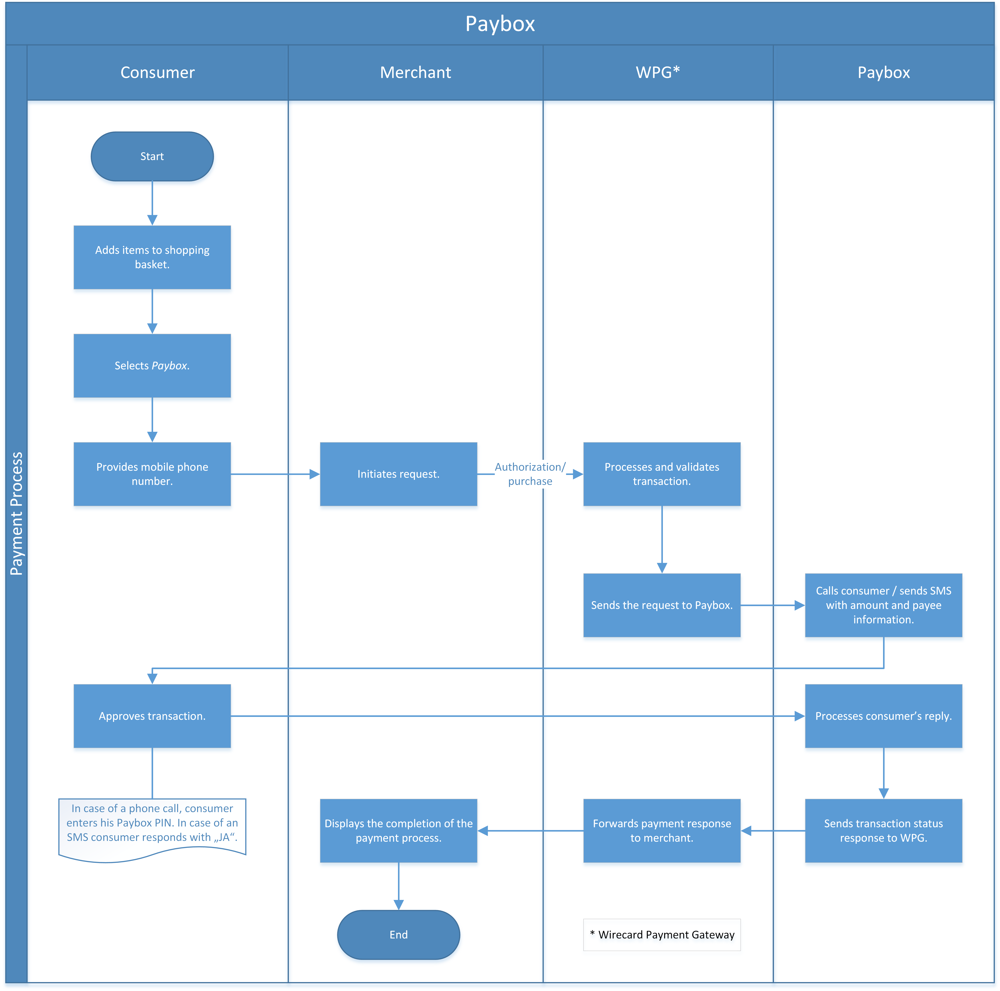
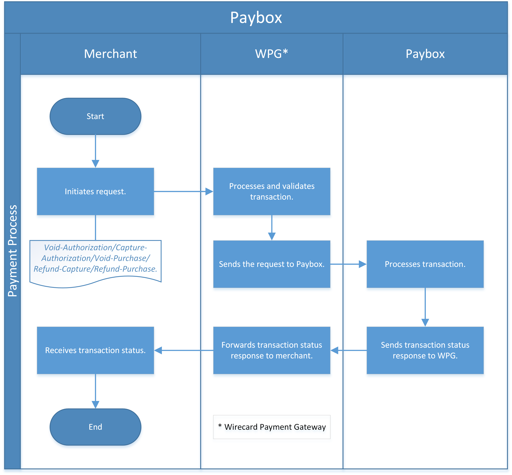

[#API_paybox]
=== paybox

[#paybox_Introduction]
==== Introduction
[.clearfix]
--
[.right]

_paybox_ is a payment system allowing a consumer to purchase goods and
services using a mobile phone. Consumers provide their mobile phone
number and set up a direct debit agreement with _paybox_ and select a
secret PIN for their _paybox_ account. In order to use _paybox_,
consumers need to have a bank account in Austria, Switzerland or the
European Economic Area. After a once-only registration, all payments are
debited to the consumer's bank account. For private consumers who have a
valid mobile phone contract with an Austrian mobile telephone provider,
online purchases via _paybox_ are included on the consumer's mobile phone
bill.

Before being able to offer _paybox_ as a payment method, the merchant
needs to sign an acceptance contract with _paybox._

When purchasing in an online shop, the consumer selects _paybox_ as the
preferred payment method and is prompted to enter a mobile phone number.
During the checkout process, _paybox_ calls the consumer's phone
(automated call), and asks for the PIN to confirm the transaction. After
entering the correct PIN, _paybox_ debits the money from the consumer's
bank account and credits it to the merchant's account. Finally, the
consumer receives an SMS message confirming the transaction. The
merchant also receives a confirmation and may thus proceed with the
delivery of the goods or services.
--

[#paybox_Advantages]
===== Advantages

- Easy to use.
- World-wide GSM radio networks ensure the highest level of security during data transfer.
- Consumers only need to give their bank details to the _paybox_ company
and do not need to reveal their credit card or bank account details to
any other company.

//-

[#paybox_GeneralInformation]
==== General Information

[#paybox_PaymentModeCountriesandCurrencies]
===== Payment Mode, Countries and Currencies

This table illustrates which payment mode _paybox_ belongs to. It also
provides detailed information about the countries and currencies which
are relevant for _paybox._

[%autowidth]
[cols="h,"]
|===
| Payment Mode | <<PaymentMethods_PaymentMode_OnlineBankTransfer, Online Bank Transfer>>, <<PaymentMethods_PaymentMode_MobilePayment, Mobile Payment>>
| Countries    | Austria
| Currencies   | EUR
|===

[#paybox_CommunicationFormats]
===== Communication Formats

This table illustrates how _paybox_ notifications are encoded and
which formats and methods can be used for requests and responses.

|===
.2+| *Requests/Responses* | Format  | XML
                          | Methods | POST
| *IPN Encodement*      2+| Please follow the instructions given at
<<GeneralPlatformFeatures_IPN, Instant Payment Notification>> to set up IPN.
|===

[#paybox_TransactionTypes]
==== Transaction Types

For <<Glossary_TransactionType, transaction type>> details look at <<AppendixB, Appendix B: Transaction Types>>.

[cols="20, 60, 20"]
|===
| Transaction Type | Description | Link to the Sample

| _authorization_ | Reserves funds on a consumer's account until the
merchant ships the product/service.
| <<paybox_Samples_Authorization, _authorization_ samples>>
| _capture-authorization_ | Used to capture the reserved funds at the
moment when some or all goods are physically delivered to the consumer.
| <<paybox_Samples_CaptureAuthorization, _capture-authorization_ samples>>
| _purchase_ | An immediate payment for online purchase. | <<paybox_Samples_Purchase, _purchase_ samples>>
| _refund-capture_ | Used when the consumer wishes to return some or all
delivered goods. | <<paybox_Samples_RefundCapture, _refund-capture_ samples>>
| _refund-purchase_ | Used when the consumer wishes to return some or all
delivered goods. | <<paybox_Samples_RefundPurchase, _refund-purchase_ samples>>
| _void-authorization_ | Used when the consumer wishes to cancel some or
all (not yet shipped) items from the order. | <<paybox_Samples_VoidAuthorization, _void-authorization_ samples>>
| _void-purchase_ | Used when the consumer wishes to cancel some or all
(not yet shipped) items from the order. | <<paybox_Samples_VoidPurchase, _void-purchase_ samples>>
|===

[#paybox_TestCredentials]
==== Test Credentials

[cols="20, 50, 30"]
|===
.2+s| URLs (Endpoints) | For transaction types _authorization_ and _purchase._ | ``\https://{test-instance-hostname}/engine/rest/paymentmethods/``
                      | For transaction types _void-authorization_, _void-purchase_, _refund-capture_ and _refund-purchase._
                      | ``\https://{test-instance-hostname}/engine/rest/payments/``
s| Merchant Account ID (MAID) 2+| Please contact <<ContactUs, merchant support>> for complete test credentials.
s| Username   2+| Please contact <<ContactUs, merchant support>> for complete test credentials.
s| Password   2+| Please contact <<ContactUs, merchant support>> for complete test credentials.
s| Secret Key 2+| Please contact <<ContactUs, merchant support>> for complete test credentials.
|===

[#paybox_Workflow]
==== Workflow

WARNING: Be aware that initial _paybox_ _authorization/purchase_ transactions have
a long timeout (190 seconds). _paybox_ calls the consumer to authorize
the transfer. Synchronous http-calls are used in _paybox_ interface
which are kept alive until confirmation.

[#paybox_Workflow_AuthorizationPurchase]
===== _authorization, purchase_

. Consumer adds items to the shopping basket and selects _paybox._
. Consumer provides the phone number.
. The merchant sends an _authorization-purchase_ request to _{payment-gateway} ({payment-gateway-abbr})._
. _WPG_ processes and validates the transaction.
. _WPG_ sends a request to _paybox._
. _paybox_ calls or sends SMS to consumer to verify the amount and payee information.
. Consumer approves the transaction. The approval is done via _paybox_ PIN (when called) or typing "JA" (when receiving an SMS).
. _paybox_ processes consumer's reply.
. _paybox_ sends the transaction status to _WPG._
. _WPG_ forwards transaction status to the merchant.
. The merchant displays the completion of the payment process to the consumer.

//-

[#paybox_Workflow_OtherTransactionTypes]
===== _void-authorization, capture-authorization, void-purchase, refund-capture, refund-purchase_

. The merchant initiates a request (either _void-authorization, capture-authorization, void-purchase, refund-capture_ or _refund-purchase_).
. {payment-gateway-abbr} processes and validates the transaction.
. _WPG_ sends the request to _paybox._
. _paybox_ processes the transaction.
. _paybox_ sends the transaction status to _WPG._
. _WPG_ forwards the transaction status to the merchant.

//-

[#paybox_Fields]
==== Fields 

The fields used for _paybox_ requests, responses and notifications are
the same as the REST API fields. Please refer to <<RestApi_Fields, REST API Fields>>.
Only the fields listed below have different properties, especially
according to size.

[#paybox_Fields_AuthorizationPurchase]
===== _authorization, purchase_

The following elements are mandatory (M), optional (O) or conditional
\(C) for a request/response/notification. If the respective cell is
empty, the field is disregarded or not sent.

[%autowidth]
|===
| Field | Cardinality | Datatype | Size | Description

| order-number | O | xs:string | 40 | This is the order number of the merchant.
| descriptor   | O | xs:string | 60 |Description on the settlement of the
account holder's account about a transaction.
| account-holder/phone | M | xs:string | 24 |The phone number of the account holder.
|===

[#paybox_Samples]
==== Samples

[#paybox_Samples_Authorization]
===== _authorization_

.XML _authorization_ Request (Successful)

[source,xml]
----
<?xml version="1.0" encoding="UTF-8" standalone="yes"?>
<payment xmlns="http://www.elastic-payments.com/schema/payment">
    <merchant-account-id>cd774c92-e46b-48da-9963-a30bb6a362cf</merchant-account-id>
    <request-id>$(unique for each request}</request-id>
    <transaction-type>authorization</transaction-type>
    <requested-amount currency="EUR">1.23</requested-amount>
    <account-holder>
        <phone>+43000123456789</phone>
    </account-holder>
    <order-number>order-number</order-number>
    <descriptor>customer-statement</descriptor>
    <payment-methods>
        <payment-method name="paybox"/>
    </payment-methods>
</payment>
----

.XML _authorization_ Response (Successful)

[source,xml]
----
 <?xml version="1.0" encoding="UTF-8" standalone="yes"?>
<payment xmlns="http://www.elastic-payments.com/schema/payment">
    <merchant-account-id>cd774c92-e46b-48da-9963-a30bb6a362cf</merchant-account-id>
    <transaction-id>d6e3497e-15c7-11e5-b0a7-005056a97509</transaction-id>
    <request-id>$(unique for each request}</request-id>
    <transaction-type>authorization</transaction-type>
    <transaction-state>success</transaction-state>
    <completion-time-stamp>2015-06-18T14:39:35.000Z</completion-time-stamp>
    <statuses>
        <status code="201.0000" description="The resource was successfully created." severity="information"/>
    </statuses>
    <requested-amount currency="EUR">1.23</requested-amount>
    <account-holder>
        <phone>+43100</phone>
    </account-holder>
    <ip-address>127.0.0.2</ip-address>
    <order-number>0</order-number>
    <order-detail>order detail</order-detail>
    <descriptor>Customer 007</descriptor>
    <payment-methods>
        <payment-method name="paybox"/>
    </payment-methods>
    <authorization-code>success</authorization-code>
    <locale>de</locale>
</payment>
----

.XML _authorization_ Response (Failure)

[source,xml]
----
<?xml version="1.0" encoding="UTF-8" standalone="yes"?>
<payment xmlns="http://www.elastic-payments.com/schema/payment">
    <merchant-account-id>cd774c92-e46b-48da-9963-a30bb6a362cf</merchant-account-id>
    <transaction-id>ee35f4fa-1441-11e5-8539-005056b13ce8</transaction-id>
    <request-id>$(unique for each request}</request-id>
    <transaction-type>authorization</transaction-type>
    <transaction-state>failed</transaction-state>
    <completion-time-stamp>2015-06-16T16:08:31.000Z</completion-time-stamp>
    <statuses>
        <status code="500.1051" description="A Provider refused to accept the transaction.  Please check your input and try again." severity="error"/>
    </statuses>
    <requested-amount currency="EUR">1.23</requested-amount>
    <account-holder>
        <phone>+43000123456789</phone>
    </account-holder>
    <order-number>order-number</order-number>
    <descriptor>customer-statement</descriptor>
    <payment-methods>
        <payment-method name="paybox"/>
    </payment-methods>
</payment>
----

[#paybox_Samples_CaptureAuthorization]
===== _capture-authorization_

.XML _capture-authorization_ Request (Successful)

[source,xml]
----
<?xml version="1.0" encoding="UTF-8" standalone="yes"?>
<payment xmlns="http://www.elastic-payments.com/schema/payment">
     <merchant-account-id>0e0a466b-bed8-4eb3-973f-faddd77e692c</merchant-account-id>
     <request-id>$(unique for each request}</request-id>
     <transaction-type>capture-authorization</transaction-type>
    <payment-methods>
       <payment-method name="paybox"/>
    </payment-methods>
     <parent-transaction-id>31af95ca-15c9-11e5-b0a7-005056a97509</parent-transaction-id>
     <ip-address>127.0.0.1</ip-address>
</payment>
----

.XML _capture-authorization_ Response (Successful)

[source,xml]
----
<?xml version="1.0" encoding="UTF-8" standalone="yes"?>
<payment xmlns="http://www.elastic-payments.com/schema/payment" self="http://p-grz-web02.wirecard.lan:8080/engine/rest/merchants/0e0a466b-bed8-4eb3-973f-faddd77e692c/payments/321d784f-15c9-11e5-b0a7-005056a97509">
    <merchant-account-id ref="http://p-grz-web02.wirecard.lan:8080/engine/rest/merchants/0e0a466b-bed8-4eb3-973f-faddd77e692c">0e0a466b-bed8-4eb3-973f-faddd77e692c</merchant-account-id>
    <transaction-id>321d784f-15c9-11e5-b0a7-005056a97509</transaction-id>
    <request-id>$(unique for each request}</request-id>
    <transaction-type>capture-authorization</transaction-type>
    <transaction-state>success</transaction-state>
    <completion-time-stamp>2015-06-18T14:49:17.000Z</completion-time-stamp>
    <statuses>
        <status code="201.0000" description="paybox:The resource was successfully created." severity="information"/>
    </statuses>
    <requested-amount currency="EUR">1.01</requested-amount>
    <account-holder>
        <phone>+43100</phone>
    </account-holder>
    <ip-address>127.0.0.1</ip-address>
    <order-number>0</order-number>
    <order-detail>order detail</order-detail>
    <descriptor>Customer 007</descriptor>
    <payment-methods>
        <payment-method name="paybox"/>
    </payment-methods>
    <api-id>elastic-api</api-id>
</payment>
----

[#paybox_Samples_Purchase]
===== _purchase_

.XML _purchase_ Request (Successful)

[source,xml]
----
<?xml version="1.0" encoding="UTF-8" standalone="yes"?>
<payment xmlns="http://www.elastic-payments.com/schema/payment">
    <merchant-account-id>0e0a466b-bed8-4eb3-973f-faddd77e692c</merchant-account-id>
    <request-id>$(unique for each request}</request-id>
    <transaction-type>purchase</transaction-type>
    <payment-methods>
       <payment-method name="paybox"/>
    </payment-methods>
    <account-holder>
      <phone>+43100</phone>
    </account-holder>
    <requested-amount currency="EUR">1.01</requested-amount>
</payment>
----

.XML _purchase_ Response (Successful)

[source,xml]
----
<?xml version="1.0" encoding="UTF-8" standalone="yes"?>
<payment xmlns="http://www.elastic-payments.com/schema/payment">
    <merchant-account-id>0e0a466b-bed8-4eb3-973f-faddd77e692c</merchant-account-id>
    <transaction-id>58093450-15c6-11e5-b0a7-005056a97509</transaction-id>
    <request-id>$(unique for each request}</request-id>
    <transaction-type>purchase</transaction-type>
    <transaction-state>success</transaction-state>
    <completion-time-stamp>2015-06-18T14:28:53.000Z</completion-time-stamp>
    <statuses>
        <status code="201.0000" description="The resource was successfully created." severity="information"/>
    </statuses>
    <requested-amount currency="EUR">1.01</requested-amount>
    <account-holder>
        <phone>+43100</phone>
    </account-holder>
    <payment-methods>
        <payment-method name="paybox"/>
    </payment-methods>
    <authorization-code>success</authorization-code>
</payment>
----

[#paybox_Samples_RefundCapture]
===== _refund-capture_

.XML _refund-capture_ Request (Successful)

[source,xml]
----
<?xml version="1.0" encoding="UTF-8" standalone="yes"?>
<payment xmlns="http://www.elastic-payments.com/schema/payment">
     <merchant-account-id>0e0a466b-bed8-4eb3-973f-faddd77e692c</merchant-account-id>
     <request-id>$(unique for each request}</request-id>
     <transaction-type>refund-capture</transaction-type>
    <payment-methods>
       <payment-method name="paybox"/>
    </payment-methods>
     <parent-transaction-id>321d784f-15c9-11e5-b0a7-005056a97509</parent-transaction-id>
     <ip-address>127.0.0.1</ip-address>
</payment>
----

.XML _refund-capture_ Response (Successful)

[source,xml]
----
<?xml version="1.0" encoding="UTF-8" standalone="yes"?>
<payment xmlns="http://www.elastic-payments.com/schema/payment" self="http://p-grz-web02.wirecard.lan:8080/engine/rest/merchants/0e0a466b-bed8-4eb3-973f-faddd77e692c/payments/32b39020-15c9-11e5-b0a7-005056a97509">
    <merchant-account-id ref="http://p-grz-web02.wirecard.lan:8080/engine/rest/merchants/0e0a466b-bed8-4eb3-973f-faddd77e692c">0e0a466b-bed8-4eb3-973f-faddd77e692c</merchant-account-id>
    <transaction-id>32b39020-15c9-11e5-b0a7-005056a97509</transaction-id>
    <request-id>$(unique for each request}</request-id>
    <transaction-type>refund-capture</transaction-type>
    <transaction-state>success</transaction-state>
    <completion-time-stamp>2015-06-18T14:49:18.000Z</completion-time-stamp>
    <statuses>
        <status code="201.0000" description="paybox:The resource was successfully created." severity="information"/>
    </statuses>
    <requested-amount currency="EUR">1.01</requested-amount>
    <account-holder>
        <phone>+43100</phone>
    </account-holder>
    <ip-address>127.0.0.1</ip-address>
    <order-number>0</order-number>
    <order-detail>order detail</order-detail>
    <descriptor>Customer 007</descriptor>
    <payment-methods>
        <payment-method name="paybox"/>
    </payment-methods>
    <api-id>elastic-api</api-id>
</payment>
----

[#paybox_Samples_RefundPurchase]
===== _refund-purchase_

.XML _refund-purchase_ Request (Successful)

[source,xml]
----
<?xml version="1.0" encoding="UTF-8" standalone="yes"?>
<payment xmlns="http://www.elastic-payments.com/schema/payment">
     <merchant-account-id>0e0a466b-bed8-4eb3-973f-faddd77e692c</merchant-account-id>
     <request-id>$(unique for each request}</request-id>
     <transaction-type>refund-purchase</transaction-type>
    <payment-methods>
       <payment-method name="paybox"/>
    </payment-methods>
     <parent-transaction-id>264082a3-15c7-11e5-b0a7-005056a97509</parent-transaction-id>
     <ip-address>127.0.0.1</ip-address>
</payment>
----

.XML _refund-purchase_ Response (Successful)

[source,xml]
----
<?xml version="1.0" encoding="UTF-8" standalone="yes"?>
<payment xmlns="http://www.elastic-payments.com/schema/payment" self="http://p-grz-web02.wirecard.lan:8080/engine/rest/merchants/0e0a466b-bed8-4eb3-973f-faddd77e692c/payments/269e9ea3-15c7-11e5-b0a7-005056a97509">
    <merchant-account-id ref="http://p-grz-web02.wirecard.lan:8080/engine/rest/merchants/0e0a466b-bed8-4eb3-973f-faddd77e692c">0e0a466b-bed8-4eb3-973f-faddd77e692c</merchant-account-id>
    <transaction-id>269e9ea3-15c7-11e5-b0a7-005056a97509</transaction-id>
    <request-id>$(unique for each request}</request-id>
    <transaction-type>refund-purchase</transaction-type>
    <transaction-state>success</transaction-state>
    <completion-time-stamp>2015-06-18T14:34:39.000Z</completion-time-stamp>
    <statuses>
        <status code="201.0000" description="paybox:The resource was successfully created." severity="information"/>
    </statuses>
    <requested-amount currency="EUR">1.01</requested-amount>
    <account-holder>
        <phone>+43100</phone>
    </account-holder>
    <ip-address>127.0.0.1</ip-address>
    <order-number>0</order-number>
    <order-detail>order detail</order-detail>
    <descriptor>Customer 007</descriptor>
    <payment-methods>
        <payment-method name="paybox"/>
    </payment-methods>
    <api-id>elastic-api</api-id>
</payment>
----

[#paybox_Samples_VoidAuthorization]
===== _void-authorization_

.XML _void-authorization_ Request (Successful)

[source,xml]
----
<?xml version="1.0" encoding="UTF-8" standalone="yes"?>
<payment xmlns="http://www.elastic-payments.com/schema/payment">
     <merchant-account-id>0e0a466b-bed8-4eb3-973f-faddd77e692c</merchant-account-id>
     <request-id>$(unique for each request}</request-id>
     <transaction-type>void-authorization</transaction-type>
    <payment-methods>
       <payment-method name="paybox"/>
    </payment-methods>
     <parent-transaction-id>d6e3497e-15c7-11e5-b0a7-005056a97509</parent-transaction-id>
     <ip-address>127.0.0.1</ip-address>
</payment>
----

.XML _void-authorization_ Response (Successful)

[source,xml]
----
<?xml version="1.0" encoding="UTF-8" standalone="yes"?>
<payment xmlns="http://www.elastic-payments.com/schema/payment" self="http://p-grz-web02.wirecard.lan:8080/engine/rest/merchants/0e0a466b-bed8-4eb3-973f-faddd77e692c/payments/d739eb5a-15c7-11e5-b0a7-005056a97509">
    <merchant-account-id ref="http://p-grz-web02.wirecard.lan:8080/engine/rest/merchants/0e0a466b-bed8-4eb3-973f-faddd77e692c">0e0a466b-bed8-4eb3-973f-faddd77e692c</merchant-account-id>
    <transaction-id>d739eb5a-15c7-11e5-b0a7-005056a97509</transaction-id>
    <request-id>$(unique for each request}</request-id>
    <transaction-type>void-authorization</transaction-type>
    <transaction-state>success</transaction-state>
    <completion-time-stamp>2015-06-18T14:39:35.000Z</completion-time-stamp>
    <statuses>
        <status code="201.0000" description="paybox:The resource was successfully created." severity="information"/>
    </statuses>
    <requested-amount currency="EUR">1.01</requested-amount>
    <account-holder>
        <phone>+43100</phone>
    </account-holder>
    <ip-address>127.0.0.1</ip-address>
    <order-number>0</order-number>
    <order-detail>order detail</order-detail>
    <descriptor>Customer 007</descriptor>
    <payment-methods>
        <payment-method name="paybox"/>
    </payment-methods>
    <api-id>elastic-api</api-id>
</payment>
----

[#paybox_Samples_VoidPurchase]
===== _void-purchase_

.XML _void-purchase_ Request (Successful)

[source,xml]
----
<?xml version="1.0" encoding="UTF-8" standalone="yes"?>
<payment xmlns="http://www.elastic-payments.com/schema/payment">
     <merchant-account-id>0e0a466b-bed8-4eb3-973f-faddd77e692c</merchant-account-id>
     <request-id>$(unique for each request}</request-id>
     <transaction-type>void-purchase</transaction-type>
    <payment-methods>
       <payment-method name="paybox"/>
    </payment-methods>
     <parent-transaction-id>c391dd8f-15c6-11e5-b0a7-005056a97509</parent-transaction-id>
     <ip-address>127.0.0.1</ip-address>
</payment>
----

.XML _void-purchase_ Response (Successful)

[source,xml]
----
<?xml version="1.0" encoding="UTF-8" standalone="yes"?>
<payment xmlns="http://www.elastic-payments.com/schema/payment" self="http://p-grz-web02.wirecard.lan:8080/engine/rest/merchants/0e0a466b-bed8-4eb3-973f-faddd77e692c/payments/c3ea4dc7-15c6-11e5-b0a7-005056a97509">
    <merchant-account-id ref="http://p-grz-web02.wirecard.lan:8080/engine/rest/merchants/0e0a466b-bed8-4eb3-973f-faddd77e692c">0e0a466b-bed8-4eb3-973f-faddd77e692c</merchant-account-id>
    <transaction-id>c3ea4dc7-15c6-11e5-b0a7-005056a97509</transaction-id>
    <request-id>$(unique for each request}</request-id>
    <transaction-type>void-purchase</transaction-type>
    <transaction-state>success</transaction-state>
    <completion-time-stamp>2015-06-18T14:31:54.000Z</completion-time-stamp>
    <statuses>
        <status code="201.0000" description="paybox:The resource was successfully created." severity="information"/>
    </statuses>
    <requested-amount currency="EUR">1.01</requested-amount>
    <account-holder>
        <phone>+43100</phone>
    </account-holder>
    <ip-address>127.0.0.1</ip-address>
    <order-number>0</order-number>
    <order-detail>order detail</order-detail>
    <descriptor>Customer 007</descriptor>
    <payment-methods>
        <payment-method name="paybox"/>
    </payment-methods>
    <api-id>elastic-api</api-id>
</payment>
----
